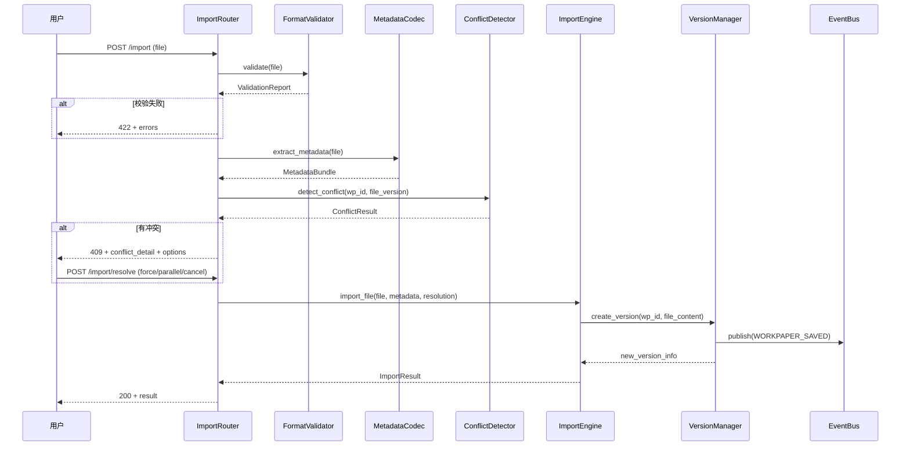
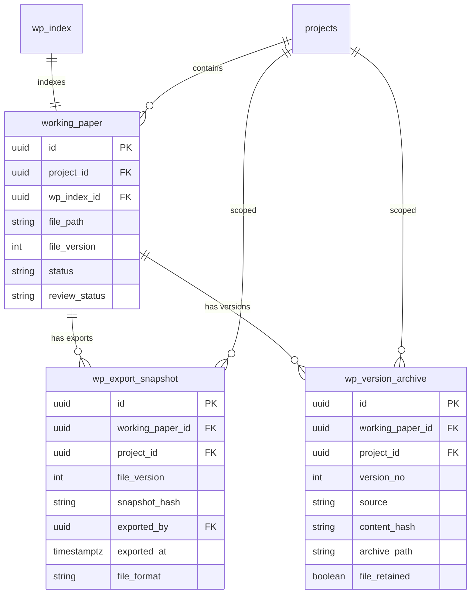

# Design Document: 底稿统一导入导出

## Overview

底稿统一导入导出系统为审计平台提供完整的离线工作流引擎。核心功能包括：单底稿/批量导出为 xlsx/docx、离线编辑后回导、版本冲突检测、格式校验、自动版本管理、跨项目模板复制。

系统基于现有 `wp_download_service`（已有下载/上传基础设施）和 `wp_xlsx_export_service`（模板填值导出）构建，新增元数据嵌入/提取层、SHA-256 快照哈希冲突检测、结构化校验报告、版本归档管理四大能力。

### 设计原则

1. **Round-Trip 保证**：导出→未修改→导入 = 数据零差异（确定性序列化）
2. **非破坏性导入**：导入创建新版本，旧版本归档保留
3. **冲突检测优先**：先检测冲突再执行导入，给用户充分选择权
4. **增量复用**：尽可能复用现有 `wp_xlsx_export_service`、`wp_download_service`、`event_bus`
5. **service 只 flush 不 commit**：遵循平台铁律

---

## ⚠️ 现状复用与真实空白（2026-06-11 codegraph 复盘修订）

**铁律「改动前先现状确认」结果**：本 spec 大部分能力已存在，实施时必须复用扩展，禁止重建。

### 已存在能力（复用，禁止重写）

| 能力 | 现有产物 | 复用方式 |
|------|----------|----------|
| 单底稿 xlsx 导出 | `wp_xlsx_export_service.export_workpaper_xlsx`（4路径写入：fixed_cells/dynamic_table/formulas跳过/static；Semaphore(10)；公式保留） | 直接调用，仅在其外层包装元数据嵌入 |
| 批量 ZIP 打包 | `WpDownloadService.download_pack`（`{audit_cycle}/{wp_code}_{wp_name}.xlsx` 目录结构） | 扩展：加 manifest.json + SHA-256 + 状态过滤 |
| 单底稿下载 | `WpDownloadService.download_single`（RFC5987 中文名） | 直接复用 |
| 导入回传 | `WpUploadService.upload_file`（版本+1、解析、WORKPAPER_SAVED 事件、云同步、version_line、structure 桥） | 扩展：加快照哈希校验 + 版本归档 + 格式校验前置 |
| 版本号冲突 | `WpUploadService.check_version_conflict`（uploaded_version < server_version） | 复用 + 叠加内容哈希实质冲突判断 |
| 字段级冲突 | `offline_conflict_service.detect/resolve/list`（procedure_id+field_name 粒度，trace 留痕，QC 重跑） | 复用，不重建 ConflictDetector |
| Round-Trip 测试 | `test_xlsx_export_roundtrip.py` / `exports/test_xlsx_diff.py` | 复用基线，新增元数据 round-trip |
| 现有路由 | `wp_download.py`：download-pack/download-file/check-version/upload-file/cloud-url | 在同 router 增端点，不另起 router |

### 真实空白（本 spec 唯一新建内容）

1. **MetadataCodec**（需求 3）：xlsx Custom Properties / docx core+custom properties 元数据嵌入提取——**现有导出完全无元数据嵌入**
2. **SHA-256 快照哈希冲突**（需求 4.1/4.5）：现有 `check_version_conflict` 仅比版本号，无内容哈希；新增 `wp_export_snapshot` 表存导出快照 + 实质冲突判断（内容真变了才算冲突）
3. **FormatValidator**（需求 5）：MIME 校验 + sheet 结构匹配 + 必填单元格 + 数值类型——**现有 upload 无任何导入前校验**
4. **TemplateCopier**（需求 7）：跨项目复制 + 业务数据清除——**完全不存在**
5. **docx 文字底稿导出/导入**（需求 1.3）：现有 `wp_xlsx_export_service` 仅 xlsx；文字底稿需 python-docx 路径
6. **版本归档**（需求 6.3/6.4）：现有 upload 仅 `file_version += 1` 覆盖文件，**无旧版本归档**；新增 `wp_version_archive` 表 + 归档路径 + 保留10版
7. **程序表/审定表特殊导入**（需求 8/9）：只读列锁定、审定数列忽略——现有 upload 是整文件覆盖，无列级语义

### 实施纲领

- **Components 章节下述 WpExportEngine/WpImportEngine/BatchPackager/ConflictDetector 不是全新服务**，而是上述「复用 + 扩展」的封装层；编码时优先在现有 service 加方法，仅元数据/校验/模板复制/归档/docx 这 6 项是真新增模块
- 任务清单已按此原则裁剪（见 tasks.md「复用标注」）

## Architecture

### 组件图

```mermaid
graph TB
    subgraph Frontend["前端 Vue3 + Element Plus"]
        WPList["底稿列表页"]
        ExportDialog["导出配置弹窗"]
        ImportDialog["导入上传弹窗"]
        ConflictPanel["冲突处理面板"]
        ValidationReport["校验报告展示"]
    end

    subgraph API["FastAPI Router Layer"]
        ExportRouter["/api/projects/{pid}/workpapers/export"]
        ImportRouter["/api/projects/{pid}/workpapers/import"]
        BatchRouter["/api/projects/{pid}/workpapers/batch-export"]
        TemplateRouter["/api/projects/{pid}/workpapers/template-copy"]
    end

    subgraph Services["Service Layer"]
        ExportEngine["WpExportEngine"]
        ImportEngine["WpImportEngine"]
        ConflictDetector["ConflictDetector"]
        FormatValidator["FormatValidator"]
        BatchPackager["BatchPackager"]
        VersionManager["WpVersionManager"]
        TemplateCopier["TemplateCopier"]
        MetadataCodec["MetadataCodec"]
    end

    subgraph Existing["复用的现有服务"]
        XlsxExport["wp_xlsx_export_service"]
        RenderSchema["WpRenderSchemaService"]
        EventBus["event_bus"]
        CloudStorage["CloudStorageService"]
        DownloadSvc["WpDownloadService"]
    end

    subgraph Storage["存储层"]
        PG[(PostgreSQL)]
        FileSystem["文件系统 storage/"]
        Templates["wp_templates/"]
    end

    WPList --> ExportDialog
    WPList --> ImportDialog
    ExportDialog --> ExportRouter
    ImportDialog --> ImportRouter
    ImportDialog --> ConflictPanel
    ImportDialog --> ValidationReport

    ExportRouter --> ExportEngine
    ImportRouter --> ImportEngine
    ImportRouter --> ConflictDetector
    ImportRouter --> FormatValidator
    BatchRouter --> BatchPackager
    TemplateRouter --> TemplateCopier

    ExportEngine --> MetadataCodec
    ExportEngine --> XlsxExport
    ExportEngine --> RenderSchema
    ImportEngine --> MetadataCodec
    ImportEngine --> VersionManager
    ImportEngine --> FormatValidator
    ImportEngine --> ConflictDetector

    BatchPackager --> ExportEngine
    VersionManager --> EventBus
    ExportEngine --> CloudStorage

    ExportEngine --> PG
    ImportEngine --> PG
    VersionManager --> PG
    ExportEngine --> FileSystem
    ImportEngine --> FileSystem
    VersionManager --> FileSystem
    ExportEngine --> Templates
```



### 导入流程时序图



## Components and Interfaces

### 1. WpExportEngine

负责单底稿导出，支持表格(xlsx)和文字(docx)两种格式。

```python
class WpExportEngine:
    """底稿导出引擎"""

    async def export_single(
        self, db: AsyncSession, wp_id: UUID, project_id: UUID
    ) -> ExportResult:
        """导出单份底稿，返回文件字节流 + 元数据"""

    async def export_program_sheet(
        self, db: AsyncSession, wp_id: UUID, project_id: UUID
    ) -> BytesIO:
        """导出程序表底稿（含只读/可编辑列标记）"""

    async def export_audit_sheet(
        self, db: AsyncSession, wp_id: UUID, project_id: UUID
    ) -> BytesIO:
        """导出审定表底稿（含科目明细+调整分录批注）"""

    def _compute_snapshot_hash(self, workbook_data: dict) -> str:
        """计算底稿内容 SHA-256 快照哈希"""
```

### 2. WpImportEngine

负责解析导入文件并恢复底稿数据。

```python
class WpImportEngine:
    """底稿导入引擎"""

    async def import_file(
        self,
        db: AsyncSession,
        project_id: UUID,
        file_content: bytes,
        filename: str,
        resolution: ConflictResolution | None = None,
        user_id: UUID | None = None,
    ) -> ImportResult:
        """完整导入流程：校验→冲突检测→版本创建"""

    async def import_program_sheet(
        self, db: AsyncSession, wp_id: UUID, file_content: bytes
    ) -> ImportResult:
        """程序表导入：仅更新可编辑列"""

    async def import_audit_sheet(
        self, db: AsyncSession, wp_id: UUID, file_content: bytes
    ) -> ImportResult:
        """审定表导入：仅更新备注和工作结论"""
```

### 3. ConflictDetector

```python
class ConflictDetector:
    """冲突检测器"""

    async def detect(
        self, db: AsyncSession, wp_id: UUID, imported_version: int
    ) -> ConflictResult:
        """检测版本冲突和内容冲突"""

    def _is_substantive_conflict(
        self, export_hash: str, current_hash: str
    ) -> bool:
        """判断是否为实质冲突（内容真的变了）"""
```

### 4. FormatValidator

```python
class FormatValidator:
    """格式校验器"""

    def validate(
        self, file_content: bytes, filename: str, target_wp_code: str | None = None
    ) -> ValidationReport:
        """校验文件格式、结构、数据完整性"""

    def _check_mime_type(self, content: bytes, ext: str) -> list[ValidationItem]:
        """MIME 类型一致性检查"""

    def _check_sheet_structure(
        self, wb: Workbook, schema: dict
    ) -> list[ValidationItem]:
        """sheet 页签结构匹配检查"""

    def _check_required_cells(
        self, wb: Workbook, schema: dict
    ) -> list[ValidationItem]:
        """必填单元格检查"""

    def _check_numeric_types(
        self, wb: Workbook, schema: dict
    ) -> list[ValidationItem]:
        """数值型字段类型检查"""
```

### 5. MetadataCodec

```python
class MetadataCodec:
    """元数据编解码器"""

    XLSX_PROPS = ["wp_code", "project_id", "file_version",
                  "export_timestamp", "preparer", "reviewer", "review_status"]
    DOCX_CORE_PROPS = ["wp_code", "project_id", "file_version", "export_timestamp"]
    DOCX_CUSTOM_PROPS = ["preparer", "reviewer", "review_status"]

    def embed_xlsx(self, wb: Workbook, metadata: MetadataBundle) -> None:
        """写入 xlsx Custom Properties"""

    def embed_docx(self, doc: Document, metadata: MetadataBundle) -> None:
        """写入 docx core + custom properties"""

    def extract_xlsx(self, wb: Workbook) -> MetadataBundle | None:
        """从 xlsx 提取元数据"""

    def extract_docx(self, doc: Document) -> MetadataBundle | None:
        """从 docx 提取元数据"""
```

### 6. BatchPackager

```python
class BatchPackager:
    """批量打包器"""

    async def package(
        self,
        db: AsyncSession,
        project_id: UUID,
        audit_cycles: list[str],
        status_filter: list[str] | None = None,
    ) -> BatchExportResult:
        """按审计循环打包导出为 ZIP"""
```

### 7. WpVersionManager

```python
class WpVersionManager:
    """版本管理器"""

    async def create_version(
        self,
        db: AsyncSession,
        wp_id: UUID,
        file_content: bytes,
        source: str = "import",
        user_id: UUID | None = None,
    ) -> VersionInfo:
        """创建新版本，归档旧文件，发布事件"""

    async def archive_old_version(
        self, project_id: UUID, wp_id: UUID, version: int, file_path: Path
    ) -> None:
        """将旧版本移至归档路径"""

    async def cleanup_excess_versions(
        self, db: AsyncSession, wp_id: UUID, keep: int = 10
    ) -> int:
        """清理超出保留数的文件（仅删文件保留元数据）"""
```

### 8. TemplateCopier

```python
class TemplateCopier:
    """跨项目模板复制器"""

    async def copy_single(
        self,
        db: AsyncSession,
        source_wp_id: UUID,
        target_project_id: UUID,
        overwrite: bool = False,
        user_id: UUID | None = None,
    ) -> CopyResult:
        """复制单份底稿到目标项目"""

    async def copy_cycle(
        self,
        db: AsyncSession,
        source_project_id: UUID,
        target_project_id: UUID,
        audit_cycle: str,
        overwrite: bool = False,
        user_id: UUID | None = None,
    ) -> list[CopyResult]:
        """复制整个审计循环"""

    def _strip_business_data(self, wb: Workbook, schema: dict) -> Workbook:
        """清除金额/日期/描述，保留结构和程序步骤"""
```


## Data Models

### 新增表：`wp_export_snapshot`（V071）

记录每次导出时的快照哈希，用于导入时冲突检测。

```sql
CREATE TABLE IF NOT EXISTS wp_export_snapshot (
    id UUID PRIMARY KEY DEFAULT gen_random_uuid(),
    working_paper_id UUID NOT NULL REFERENCES working_paper(id) ON DELETE CASCADE,
    project_id UUID NOT NULL REFERENCES projects(id) ON DELETE CASCADE,
    file_version INT NOT NULL,
    snapshot_hash VARCHAR(64) NOT NULL,  -- SHA-256 hex
    exported_by UUID REFERENCES users(id),
    exported_at TIMESTAMPTZ NOT NULL DEFAULT now(),
    file_format VARCHAR(10) NOT NULL DEFAULT 'xlsx',  -- xlsx | docx
    file_size_bytes BIGINT,
    metadata_bundle JSONB,  -- 导出时嵌入的完整元数据
    created_at TIMESTAMPTZ NOT NULL DEFAULT now(),
    updated_at TIMESTAMPTZ NOT NULL DEFAULT now()
);

CREATE INDEX IF NOT EXISTS idx_wp_export_snapshot_wp_version
    ON wp_export_snapshot(working_paper_id, file_version DESC);
```

### 新增表：`wp_version_archive`（V071）

记录版本归档元数据（文件可能已清理但元数据保留）。

```sql
CREATE TABLE IF NOT EXISTS wp_version_archive (
    id UUID PRIMARY KEY DEFAULT gen_random_uuid(),
    working_paper_id UUID NOT NULL REFERENCES working_paper(id) ON DELETE CASCADE,
    project_id UUID NOT NULL REFERENCES projects(id) ON DELETE CASCADE,
    version_no INT NOT NULL,
    source VARCHAR(20) NOT NULL DEFAULT 'import',  -- import | upload | edit | template
    content_hash VARCHAR(64),  -- SHA-256 of file content
    file_size_bytes BIGINT,
    archive_path TEXT,  -- storage/projects/{pid}/archive/{wp_id}/v{n}/
    file_retained BOOLEAN NOT NULL DEFAULT true,  -- false = 仅元数据
    created_by UUID REFERENCES users(id),
    created_at TIMESTAMPTZ NOT NULL DEFAULT now(),
    updated_at TIMESTAMPTZ NOT NULL DEFAULT now(),
    UNIQUE(working_paper_id, version_no)
);
```

### ORM 模型

```python
class WpExportSnapshot(Base):
    """底稿导出快照"""
    __tablename__ = "wp_export_snapshot"

    id: Mapped[uuid.UUID] = mapped_column(PG_UUID(as_uuid=True), primary_key=True, default=uuid.uuid4)
    working_paper_id: Mapped[uuid.UUID] = mapped_column(ForeignKey("working_paper.id", ondelete="CASCADE"), nullable=False)
    project_id: Mapped[uuid.UUID] = mapped_column(ForeignKey("projects.id", ondelete="CASCADE"), nullable=False)
    file_version: Mapped[int] = mapped_column(sa.Integer, nullable=False)
    snapshot_hash: Mapped[str] = mapped_column(String(64), nullable=False)
    exported_by: Mapped[uuid.UUID | None] = mapped_column(ForeignKey("users.id"), nullable=True)
    exported_at: Mapped[datetime] = mapped_column(server_default=func.now())
    file_format: Mapped[str] = mapped_column(String(10), server_default=text("'xlsx'"), nullable=False)
    file_size_bytes: Mapped[int | None] = mapped_column(sa.BigInteger, nullable=True)
    metadata_bundle: Mapped[dict | None] = mapped_column(JSONB, nullable=True)
    created_at: Mapped[datetime] = mapped_column(server_default=func.now())
    updated_at: Mapped[datetime] = mapped_column(server_default=func.now())


class WpVersionArchive(Base):
    """底稿版本归档"""
    __tablename__ = "wp_version_archive"

    id: Mapped[uuid.UUID] = mapped_column(PG_UUID(as_uuid=True), primary_key=True, default=uuid.uuid4)
    working_paper_id: Mapped[uuid.UUID] = mapped_column(ForeignKey("working_paper.id", ondelete="CASCADE"), nullable=False)
    project_id: Mapped[uuid.UUID] = mapped_column(ForeignKey("projects.id", ondelete="CASCADE"), nullable=False)
    version_no: Mapped[int] = mapped_column(sa.Integer, nullable=False)
    source: Mapped[str] = mapped_column(String(20), server_default=text("'import'"), nullable=False)
    content_hash: Mapped[str | None] = mapped_column(String(64), nullable=True)
    file_size_bytes: Mapped[int | None] = mapped_column(sa.BigInteger, nullable=True)
    archive_path: Mapped[str | None] = mapped_column(Text, nullable=True)
    file_retained: Mapped[bool] = mapped_column(server_default=text("true"), nullable=False)
    created_by: Mapped[uuid.UUID | None] = mapped_column(ForeignKey("users.id"), nullable=True)
    created_at: Mapped[datetime] = mapped_column(server_default=func.now())
    updated_at: Mapped[datetime] = mapped_column(server_default=func.now())

    __table_args__ = (
        UniqueConstraint("working_paper_id", "version_no", name="uq_wp_version_archive_wp_ver"),
    )
```

### 数据模型关系



### DTO / Schema 定义

```python
class MetadataBundle(BaseModel):
    wp_code: str
    project_id: UUID
    file_version: int
    export_timestamp: datetime
    preparer: str | None = None
    reviewer: str | None = None
    review_status: str | None = None

class ExportResult(BaseModel):
    file_content: bytes  # 实际通过 StreamingResponse 传输
    filename: str
    file_format: str  # xlsx | docx
    snapshot_hash: str
    metadata: MetadataBundle

class ConflictResolution(str, Enum):
    FORCE_OVERWRITE = "force_overwrite"
    PARALLEL_VERSION = "parallel_version"
    CANCEL = "cancel"

class ConflictResult(BaseModel):
    has_conflict: bool
    conflict_type: str | None = None  # version | content | both
    server_version: int
    imported_version: int
    last_modifier: str | None = None
    last_modified_at: datetime | None = None
    is_substantive: bool = False  # 内容实质变更

class ValidationLevel(str, Enum):
    PASSED = "passed"
    WARNING = "warning"
    ERROR = "error"

class ValidationItem(BaseModel):
    level: ValidationLevel
    location: str  # e.g. "Sheet1!B5" or "core_properties.wp_code"
    message: str
    field: str | None = None

class ValidationReport(BaseModel):
    overall: ValidationLevel
    items: list[ValidationItem]
    passed_count: int
    warning_count: int
    error_count: int

class ImportResult(BaseModel):
    status: str  # success | conflict | validation_error
    wp_id: UUID
    new_version: int | None = None
    validation_report: ValidationReport | None = None
    conflict_result: ConflictResult | None = None

class BatchExportResult(BaseModel):
    zip_content: bytes  # 实际通过 StreamingResponse
    manifest: dict
    total_files: int
    failed_files: list[str]
    warnings: list[str]

class CopyResult(BaseModel):
    source_wp_code: str
    target_wp_id: UUID | None = None
    status: str  # copied | skipped | overwritten | failed
    message: str | None = None
```

## API 设计

### 导出端点

```
POST /api/projects/{project_id}/workpapers/{wp_id}/export
  → StreamingResponse (xlsx/docx)
  Headers: Content-Disposition: attachment; filename*=UTF-8''{encoded_name}

POST /api/projects/{project_id}/workpapers/batch-export
  Body: { audit_cycles: ["D","E"], status_filter?: ["draft","approved"] }
  → StreamingResponse (ZIP)
```

### 导入端点

```
POST /api/projects/{project_id}/workpapers/import
  Body: multipart/form-data (file + optional force_overwrite)
  → ImportResult (200/409/422)

POST /api/projects/{project_id}/workpapers/import/resolve
  Body: { wp_id, resolution: "force_overwrite"|"parallel_version"|"cancel" }
  → ImportResult

POST /api/projects/{project_id}/workpapers/{wp_id}/import-validate
  Body: multipart/form-data (file)
  → ValidationReport (仅校验不执行导入)
```

### 模板复制端点

```
POST /api/projects/{project_id}/workpapers/template-copy
  Body: {
    source_wp_id?: UUID,           # 单底稿
    source_project_id?: UUID,      # 批量复制源项目
    audit_cycle?: str,             # 批量复制循环代号
    overwrite: bool = false
  }
  → CopyResult | list[CopyResult]
```

### 版本查询端点

```
GET /api/projects/{project_id}/workpapers/{wp_id}/versions
  → list[WpVersionArchive]

GET /api/projects/{project_id}/workpapers/{wp_id}/export-history
  → list[WpExportSnapshot]
```


## 核心算法

### 1. 导出序列化（确定性）

确保 Round-Trip 一致性的关键是确定性序列化：

```python
# 列顺序固定：按 render_schema 中 columns 定义顺序
# 数值精度固定：Decimal(20,4)，四舍五入
# 日期格式固定：ISO-8601 (YYYY-MM-DD)
# 空值处理固定：None → 空字符串（文本列）/ None（数值列）

NUMERIC_PRECISION = 4  # decimal(20,4)
DATE_FORMAT = "%Y-%m-%d"

def serialize_cell_value(value: Any, col_type: str) -> Any:
    """确定性单元格值序列化"""
    if value is None:
        return None if col_type == "number" else ""
    if col_type == "number":
        return float(Decimal(str(value)).quantize(Decimal(f"0.{'0' * NUMERIC_PRECISION}")))
    if col_type == "date":
        if isinstance(value, (date, datetime)):
            return value.strftime(DATE_FORMAT)
        return str(value)
    return str(value)
```

### 2. 导入解析（列映射）

导入时使用与导出相同的列映射规则确保双向一致：

```python
def parse_sheet_data(ws: Worksheet, schema: dict) -> dict:
    """按 schema 列映射解析 sheet 数据"""
    table_schema = schema.get("dynamic_table", {})
    columns = table_schema.get("columns", {})
    start_row = table_schema.get("start_row", 1)
    rows = []
    for row_idx in range(start_row, ws.max_row + 1):
        row_data = {}
        has_data = False
        for col_letter, col_def in columns.items():
            field = col_def.get("field", "") if isinstance(col_def, dict) else col_def
            cell = ws[f"{col_letter}{row_idx}"]
            value = deserialize_cell_value(cell.value, col_def)
            if value is not None and value != "":
                has_data = True
            _set_nested(row_data, field, value)
        if has_data:
            rows.append(row_data)
    return {"rows": rows}
```

### 3. 冲突检测算法

```python
async def detect_conflict(db, wp_id, imported_version) -> ConflictResult:
    """两层冲突检测：版本号 + 内容哈希"""
    wp = await get_working_paper(db, wp_id)

    # Layer 1: 版本号比对
    if imported_version >= wp.file_version:
        return ConflictResult(has_conflict=False, ...)

    # Layer 2: 实质冲突（内容是否真的变了）
    export_snapshot = await get_latest_snapshot(db, wp_id, imported_version)
    if export_snapshot:
        current_hash = compute_content_hash(wp)
        is_substantive = export_snapshot.snapshot_hash != current_hash
    else:
        is_substantive = True  # 无快照记录，保守认为冲突

    return ConflictResult(
        has_conflict=True,
        conflict_type="version" if not is_substantive else "both",
        is_substantive=is_substantive,
        server_version=wp.file_version,
        imported_version=imported_version,
        last_modifier=wp.updated_by,
        last_modified_at=wp.updated_at,
    )
```

### 4. SHA-256 快照哈希计算

```python
import hashlib
import json

def compute_snapshot_hash(workbook_data: dict[str, list[list]]) -> str:
    """计算底稿全部 sheet 内容的 SHA-256 哈希

    规则：
    - sheet 按名称字母序排列
    - 每个 sheet 内 rows 按原始顺序
    - 每个 cell 按确定性序列化规则转字符串
    - 连接后计算 SHA-256
    """
    hasher = hashlib.sha256()
    for sheet_name in sorted(workbook_data.keys()):
        hasher.update(sheet_name.encode("utf-8"))
        for row in workbook_data[sheet_name]:
            row_str = json.dumps(row, ensure_ascii=False, sort_keys=True)
            hasher.update(row_str.encode("utf-8"))
    return hasher.hexdigest()
```

### 5. 程序表导入匹配算法

```python
def match_program_rows(
    imported_rows: list[dict],
    server_rows: list[dict],
) -> ProgramMatchResult:
    """按程序编号匹配导入行与服务器行"""
    server_map = {r["procedure_code"]: r for r in server_rows}
    matched = []
    unmatched = []

    for imp_row in imported_rows:
        code = imp_row.get("procedure_code")
        if code in server_map:
            matched.append({
                "procedure_code": code,
                "updates": {
                    "execution_status": imp_row.get("execution_status"),
                    "execution_conclusion": imp_row.get("execution_conclusion"),
                }
            })
        else:
            unmatched.append(imp_row)

    return ProgramMatchResult(matched=matched, unmatched=unmatched)
```

### 6. 模板业务数据清除

```python
def strip_business_data(wb: Workbook, schema: dict) -> Workbook:
    """清除业务数据保留结构

    保留：
    - sheet 结构和名称
    - 固定表头和标题行
    - 程序步骤编号和描述
    - 公式（保留不清除）

    清除：
    - dynamic_table 区域的数值列（金额/余额）
    - 日期列内容
    - 具体描述文字（备注/结论/说明）
    """
    for sheet_name, sheet_schema in schema.get("sheets", {}).items():
        if sheet_name not in wb.sheetnames:
            continue
        ws = wb[sheet_name]
        table = sheet_schema.get("dynamic_table", {})
        columns = table.get("columns", {})
        start_row = table.get("start_row", 1)

        for col_letter, col_def in columns.items():
            col_type = col_def.get("type", "text") if isinstance(col_def, dict) else "text"
            is_readonly = col_def.get("readonly", False) if isinstance(col_def, dict) else False
            if is_readonly:
                continue  # 保留只读列（程序编号/描述）
            if col_type in ("number", "date", "text"):
                for row_idx in range(start_row, ws.max_row + 1):
                    cell = ws[f"{col_letter}{row_idx}"]
                    if cell.value and not (isinstance(cell.value, str) and cell.value.startswith("=")):
                        cell.value = None
    return wb
```

## 与现有系统的集成点

| 集成点 | 现有组件 | 交互方式 |
|--------|----------|----------|
| 导出渲染 | `wp_xlsx_export_service._sync_export_workpaper_xlsx` | 复用模板填值逻辑 |
| Schema 加载 | `WpRenderSchemaService.load_schema` | 获取 sheet 结构定义 |
| 事件发布 | `event_bus.publish(WORKPAPER_SAVED)` | 导入成功后触发级联 |
| 文件下载 | `WpDownloadService.download_single` | 获取源文件路径 |
| 云端同步 | `CloudStorageService.sync_single_file` | 导入后非阻塞同步 |
| 版本线 | `version_line_service.write_stamp` | 导入后写入版本链 |
| 审计日志 | `app_audit_log` 表 | 强制覆盖操作留痕 |
| 模板库 | `wp_templates/` + `gt_template_library.json` | 导出回退查找模板 |
| 冲突检测 | `offline_conflict_service.detect`（现有） | 复用字段级冲突逻辑 |
| 解析引擎 | `prefill_engine.parse_workpaper_real` | 导入后触发解析 |
| Stale 传播 | `StalePropagationEngine` | 导入触发下游 stale |

### 迁移文件

- `V071__wp_export_import_tables.sql`：创建 `wp_export_snapshot` + `wp_version_archive` 两表
- `R071__wp_export_import_tables.sql`：回滚


## Correctness Properties

*A property is a characteristic or behavior that should hold true across all valid executions of a system—essentially, a formal statement about what the system should do. Properties serve as the bridge between human-readable specifications and machine-verifiable correctness guarantees.*

### Property 1: Export-Import Round-Trip

*For any* workpaper with valid content (table/text/program/audit types), exporting to xlsx/docx and then importing the unmodified file should produce cell-by-cell identical content to the original.

**Validates: Requirements 10.1, 10.3**

### Property 2: Metadata Embed-Extract Round-Trip

*For any* valid MetadataBundle (containing wp_code, project_id, file_version, export_timestamp, preparer, reviewer, review_status), embedding into an xlsx/docx file and then extracting from that file should return an identical MetadataBundle.

**Validates: Requirements 1.4, 3.1, 3.2, 3.3**

### Property 3: Snapshot Hash Determinism

*For any* workpaper content, computing the SHA-256 snapshot hash multiple times on the same content should always produce the same 64-character hex string. Content that differs by even one cell value should produce a different hash.

**Validates: Requirements 1.5, 4.1**

### Property 4: Export Format Matches Workpaper Type

*For any* workpaper with a defined type, the export engine should produce xlsx for table/audit-sheet/program-sheet types and docx for text types. The mapping is deterministic and exhaustive.

**Validates: Requirements 1.1**

### Property 5: Deterministic Serialization

*For any* workpaper data, two independent exports of the same content should produce byte-identical cell values (fixed column order, numeric precision decimal(20,4), date format ISO-8601). No floating-point drift or ordering instability.

**Validates: Requirements 10.2**

### Property 6: Version Conflict Detection

*For any* import attempt where the file's embedded file_version < server's current file_version, the conflict detector should flag a conflict. Conversely, if file_version >= server version, no conflict is flagged.

**Validates: Requirements 4.2, 4.3**

### Property 7: Substantive Conflict via Hash

*For any* version conflict, if the content hash at export time equals the current content hash, the conflict is marked as non-substantive (version-only). If hashes differ, it is marked as substantive.

**Validates: Requirements 4.5**

### Property 8: Version Increment Invariant

*For any* successful import operation, the resulting file_version equals the previous file_version + 1, and a WpVersionArchive record exists with the correct version_no, source="import", non-null content_hash, and created_by.

**Validates: Requirements 6.1, 6.2**

### Property 9: Version Archive Path Format

*For any* version archive operation, the archive_path follows the pattern `storage/projects/{project_id}/archive/{wp_id}/v{version_no}/` exactly.

**Validates: Requirements 6.3**

### Property 10: Maximum 10 Retained Version Files

*For any* workpaper with N version archive records where N > 10, at most 10 records have file_retained=true. The 10 most recent versions are retained.

**Validates: Requirements 6.4**

### Property 11: Batch Export Completeness

*For any* set of audit cycles and a project, the batch packager includes exactly all non-deleted workpapers in those cycles (matching the specified status filter if provided). No workpaper is missed or duplicated.

**Validates: Requirements 2.1, 2.6**

### Property 12: ZIP Directory Structure

*For any* batch export, each file in the ZIP has path matching `{audit_cycle}/{wp_code}_{wp_name}.{ext}` where audit_cycle matches the workpaper's cycle code.

**Validates: Requirements 2.2**

### Property 13: Manifest Contains All Required Fields

*For any* batch export manifest.json, it contains: files array (with path + sha256 per entry), export_timestamp, project metadata, and any failed items are marked with error reason.

**Validates: Requirements 2.3, 2.5**

### Property 14: MIME Type Validation

*For any* import file, if the file extension doesn't match its actual MIME type (xlsx↔spreadsheet, docx↔wordprocessing), the validator reports an error-level item.

**Validates: Requirements 5.1**

### Property 15: Sheet Structure Validation

*For any* xlsx import targeting a specific workpaper, if the sheet names don't match the workpaper's render_schema classification structure, the validator reports an error-level item.

**Validates: Requirements 5.2**

### Property 16: Required Cell Validation

*For any* xlsx import where the render_schema defines required fields, cells at those positions with empty/null values produce error-level validation items.

**Validates: Requirements 5.3**

### Property 17: Numeric Type Validation

*For any* xlsx import cell marked as numeric in schema, if the cell contains non-numeric content, the validator produces a warning-level item.

**Validates: Requirements 5.5**

### Property 18: Validation Report Structure

*For any* validation run, the report's overall level equals the worst level among items (error > warning > passed), and passed_count + warning_count + error_count equals len(items) partitioned correctly.

**Validates: Requirements 5.6**

### Property 19: Template Copy Produces Valid Draft

*For any* template copy operation, the target workpaper has: a new UUID different from source, project_id equal to target project, status="draft", review_status="not_submitted", and both a wp_index record and working_paper record exist.

**Validates: Requirements 7.1, 7.3, 7.6**

### Property 20: Business Data Cleared on Copy

*For any* template copy, the target workpaper's dynamic_table cells (numeric/date/text columns not marked readonly) are empty/null, while sheet structure, formulas, and readonly columns (procedure codes/descriptions) are preserved.

**Validates: Requirements 7.2**

### Property 21: Batch Copy Covers Entire Cycle

*For any* audit cycle batch copy, the number of copied workpapers equals the number of non-deleted workpapers in that cycle in the source project.

**Validates: Requirements 7.5**

### Property 22: Program Sheet Editable Column Isolation

*For any* program sheet import, only the editable columns (execution_status, execution_conclusion) are updated. Readonly columns (procedure_code, procedure_description) in the target remain unchanged regardless of what values appear in the import file.

**Validates: Requirements 8.2, 8.3**

### Property 23: Program Sheet Export Contains Required Columns

*For any* program-type workpaper export, the program sheet contains columns for procedure_code, procedure_description, execution_status, execution_conclusion, and executor.

**Validates: Requirements 8.1**

### Property 24: Audit Sheet Import Ignores Computed Columns

*For any* audit sheet import, the audited_amount column values are never written to the database (system-calculated). Only notes and conclusion fields from the import are applied.

**Validates: Requirements 9.3**

### Property 25: Audit Sheet Export Completeness

*For any* audit-type workpaper export, the sheet contains account_code, account_name, unadjusted_amount, adjustment_amount, audited_amount columns, and the last data row is a summary row with totals.

**Validates: Requirements 9.1, 9.4**


## Error Handling

### 导出错误

| 错误场景 | 处理策略 | HTTP 状态码 |
|----------|----------|-------------|
| 底稿不存在 | 返回 404 + wp_id | 404 |
| file_path 不存在且模板库无匹配 | 返回 404 + 具体路径 | 404 |
| render_schema 缺失 | 返回 500 + wp_code | 500 |
| openpyxl 加载模板失败 | 返回 500 + 文件路径 | 500 |
| 必填项目元数据缺失 | 返回 422 + missing_fields | 422 |
| 批量导出中单文件失败 | 跳过+记录 manifest.failed | 部分成功仍200 |

### 导入错误

| 错误场景 | 处理策略 | HTTP 状态码 |
|----------|----------|-------------|
| 文件解析失败（损坏/加密） | ValidationReport.error + 原因 | 422 |
| MIME 类型不匹配 | ValidationReport.error | 422 |
| 缺少必要元数据 | 拒绝 + 缺失字段列表 | 422 |
| 版本冲突 | ConflictResult + 三选项 | 409 |
| sheet 结构不匹配 | ValidationReport.error | 422 |
| 必填单元格为空 | ValidationReport.error | 422 |
| 数值类型不匹配 | ValidationReport.warning（不阻塞） | 200 with warnings |
| 版本归档失败（磁盘满） | 记录日志不阻塞导入 | 200 |
| 云端同步失败 | 记录日志不阻塞导入 | 200 |

### 模板复制错误

| 错误场景 | 处理策略 | HTTP 状态码 |
|----------|----------|-------------|
| 源底稿不存在 | 返回 404 | 404 |
| 目标项目不存在 | 返回 404 | 404 |
| 目标已有同 wp_code（未指定 overwrite） | 返回 409 + 提示 | 409 |
| 文件复制 IO 错误 | 返回 500 + 原因 | 500 |

### 通用错误处理原则

1. **非阻塞副作用**：云端同步、解析触发、事件发布失败均不阻塞主流程
2. **结构化错误响应**：所有错误返回 `{code, message, data}` 信封（遵循 ResponseWrapperMiddleware）
3. **审计留痕**：强制覆盖、版本归档失败等关键操作写 app_audit_log
4. **幂等保护**：同一文件重复导入（相同 content_hash）应返回已有版本而非重复创建

## Testing Strategy

### 测试框架

- **后端单元测试**：pytest + pytest-asyncio
- **Property-Based Testing**：hypothesis（max_examples=5，遵循用户偏好）
- **前端测试**：vitest + @vue/test-utils

### Property-Based Tests（hypothesis）

每个 correctness property 对应一个 hypothesis 测试，标记格式：

```python
# Feature: workpaper-unified-import-export, Property 1: Export-Import Round-Trip
@given(...)
@settings(max_examples=5, deadline=None)
def test_property_1_export_import_roundtrip(...):
    ...
```

**PBT 覆盖矩阵：**

| Property | 测试文件 | 生成策略 |
|----------|----------|----------|
| P1 Round-Trip | test_wp_import_export_properties.py | st_workpaper_content() → random sheets + cells |
| P2 Metadata Round-Trip | test_wp_import_export_properties.py | st_metadata_bundle() → random metadata |
| P3 Hash Determinism | test_wp_import_export_properties.py | st_sheet_data() → random cell grids |
| P4 Format Mapping | test_wp_import_export_properties.py | st.sampled_from(WP_TYPES) |
| P5 Deterministic Serialization | test_wp_import_export_properties.py | st_workpaper_content() 双次导出 |
| P6 Version Conflict | test_wp_import_export_properties.py | st_version_pair() |
| P7 Substantive Conflict | test_wp_import_export_properties.py | st_hash_pair() |
| P8 Version Increment | test_wp_import_export_properties.py | st_import_scenario() |
| P9 Archive Path | test_wp_import_export_properties.py | st_uuid_pair() + st.integers |
| P10 Max 10 Versions | test_wp_import_export_properties.py | st.integers(11,30) |
| P11 Batch Completeness | test_wp_batch_export_properties.py | st_cycle_set() |
| P12 ZIP Structure | test_wp_batch_export_properties.py | st_wp_list() |
| P13 Manifest Fields | test_wp_batch_export_properties.py | st_batch_result() |
| P14 MIME Validation | test_wp_validation_properties.py | st_file_bytes() + st_extension() |
| P15 Sheet Structure | test_wp_validation_properties.py | st_sheet_names() |
| P16 Required Cells | test_wp_validation_properties.py | st_schema_with_required() |
| P17 Numeric Type | test_wp_validation_properties.py | st_cell_values() |
| P18 Report Structure | test_wp_validation_properties.py | st_validation_items() |
| P19 Copy Produces Draft | test_wp_template_copy_properties.py | st_copy_scenario() |
| P20 Business Data Cleared | test_wp_template_copy_properties.py | st_workbook_with_data() |
| P21 Batch Copy Cycle | test_wp_template_copy_properties.py | st_cycle_workpapers() |
| P22 Editable Column Isolation | test_wp_program_import_properties.py | st_program_rows() |
| P23 Program Export Columns | test_wp_program_import_properties.py | st_program_workpaper() |
| P24 Audit Import Ignores Computed | test_wp_audit_import_properties.py | st_audit_rows() |
| P25 Audit Export Completeness | test_wp_audit_import_properties.py | st_audit_workpaper() |

### Unit Tests

单元测试聚焦具体示例和边界条件：

| 测试类别 | 关注点 |
|----------|--------|
| MetadataCodec | 空值处理、中文字符、超长字段 |
| ConflictDetector | 无快照记录时的保守判断 |
| FormatValidator | 损坏文件、加密文件、空文件 |
| BatchPackager | 空循环报错、单文件失败跳过 |
| VersionManager | 第11版清理、归档路径创建失败 |
| TemplateCopier | 重复 wp_code、跨项目权限 |
| 程序表导入 | 行数不一致、编号缺失 |
| 审定表导入 | 汇总行检测、批注保留 |

### 集成测试

- **E2E 导出→导入 Round-Trip**：真实 openpyxl 读写 + SHA-256 验证
- **批量打包**：多底稿 ZIP 生成 + manifest 完整性
- **冲突检测全流程**：导出→第三方修改→导入→冲突→强制覆盖
- **版本归档**：创建 12 个版本后验证仅保留 10 个文件

