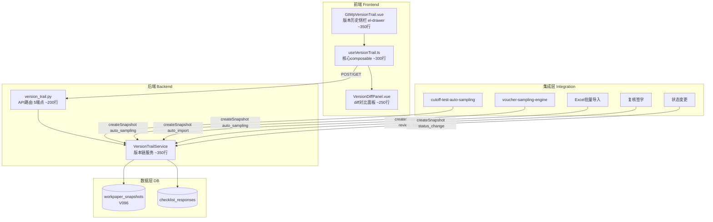
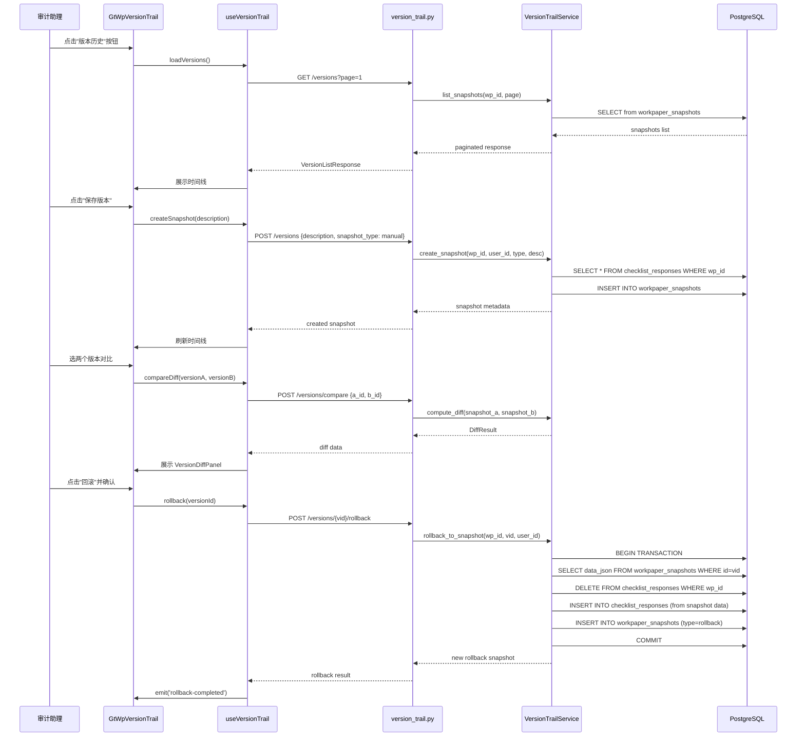

# Design Document: 底稿版本链通用组件

## Overview

底稿版本链通用组件（workpaper-version-trail）为平台所有底稿提供 field-level 数据版本历史记录。核心数据流：

**触发事件 → 读取当前 checklist_responses → 序列化为 JSONB 快照 → 存储到 workpaper_snapshots → 时间线展示 → diff 对比 → 回滚恢复**

设计目标：
- 后端 `VersionTrailService` 作为独立服务层，提供快照创建/列表/详情/diff/回滚/生命周期管理
- 前端 `GtWpVersionTrail.vue` 作为 el-drawer 侧栏组件，通过 workpaperId prop 适配所有底稿类型
- Diff 引擎为纯函数，基于 item_id 集合比较 + 字段值对比
- 回滚操作为事务性原子操作（读快照 → 删现有 → 插入快照行 → 创建回滚版本）
- 自动快照为 fire-and-forget（异步，失败仅 warning 不阻塞主流程）

## Architecture



### 文件结构

```
backend/migrations/
│   └── V096_create_workpaper_snapshots.sql      # 新表迁移

backend/app/services/
│   └── version_trail_service.py                  # 版本链核心服务（~350行）

backend/app/routers/
│   └── version_trail.py                          # API端点（~200行）

backend/tests/
│   └── test_version_trail_pbt.py                 # 后端PBT测试（hypothesis）

audit-platform/frontend/src/components/workpaper/
├── version-trail/
│   ├── GtWpVersionTrail.vue                      # 时间线侧栏（~350行）
│   └── VersionDiffPanel.vue                      # diff对比面板（~250行）
├── composables/
│   └── useVersionTrail.ts                        # 核心composable（~300行）

audit-platform/frontend/src/components/workpaper/__tests__/
│   ├── versionTrail.spec.ts                      # composable单元测试
│   └── versionTrail.property.spec.ts             # 前端PBT测试（fast-check）
```

### 数据流序列图



## Components and Interfaces

### 1. VersionTrailService — 后端核心服务

```python
from pydantic import BaseModel, Field
from uuid import UUID
from datetime import datetime
from typing import Optional

# ─── Pydantic Models ──────────────────────────────────────────────────────────

class SnapshotCreate(BaseModel):
    """创建快照请求"""
    snapshot_type: str  # manual/auto_sampling/auto_import/review_sign/status_change/rollback
    description: Optional[str] = None
    change_summary: Optional[str] = None  # caller override

class SnapshotMeta(BaseModel):
    """快照元数据（列表展示用）"""
    id: UUID
    snapshot_type: str
    description: Optional[str]
    change_summary: Optional[str]
    item_count: int
    data_size_bytes: int
    user_id: UUID
    user_name: Optional[str] = None
    created_at: datetime

class SnapshotDetail(BaseModel):
    """快照详情（含完整data_json）"""
    id: UUID
    snapshot_type: str
    description: Optional[str]
    change_summary: Optional[str]
    item_count: int
    data_size_bytes: int
    data_json: list[dict]
    user_id: UUID
    created_at: datetime

class DiffItem(BaseModel):
    """单条diff记录"""
    item_id: str
    change_type: str  # added/deleted/modified
    field_name: Optional[str] = None  # conclusion/remark/wp_ref (for modified)
    value_a: Optional[str] = None
    value_b: Optional[str] = None

class DiffResult(BaseModel):
    """diff对比结果"""
    added: list[DiffItem]
    deleted: list[DiffItem]
    modified: list[DiffItem]
    unchanged_count: int
    summary: str  # "新增2项，删除1项，修改3个字段"

class CompareRequest(BaseModel):
    """对比请求"""
    version_a_id: UUID
    version_b_id: UUID

# ─── Service Interface ────────────────────────────────────────────────────────

class VersionTrailService:
    """底稿版本链核心服务
    
    提供快照创建、列表、详情、diff、回滚、生命周期管理。
    所有方法操作 checklist_responses 数据层，不依赖 componentType。
    """

    @staticmethod
    async def create_snapshot(
        db: AsyncSession,
        project_id: UUID,
        workpaper_id: UUID,
        user_id: UUID,
        snapshot_type: str,
        description: Optional[str] = None,
        change_summary: Optional[str] = None,
    ) -> SnapshotMeta:
        """创建版本快照
        
        1. 读取当前所有 checklist_responses WHERE wp_id
        2. 序列化为 JSON array [{item_id, conclusion, remark, wp_ref}, ...]
        3. 计算 data_size_bytes，若 > 2MB 则降级存储（仅 item_id 列表）
        4. 若无 change_summary 且有上一快照，自动计算 diff summary
        5. 执行生命周期清理（超50条时purge oldest non-manual）
        6. INSERT into workpaper_snapshots
        """

    @staticmethod
    async def create_snapshot_fire_and_forget(
        db: AsyncSession,
        project_id: UUID,
        workpaper_id: UUID,
        user_id: UUID,
        snapshot_type: str,
        description: Optional[str] = None,
    ) -> Optional[SnapshotMeta]:
        """自动快照（fire-and-forget）
        
        包裹 create_snapshot，异常仅 log warning 不抛出。
        用于抽凭/导入/签字/状态变更等自动触发场景。
        """

    @staticmethod
    async def list_snapshots(
        db: AsyncSession,
        workpaper_id: UUID,
        project_id: UUID,
        page: int = 1,
        page_size: int = 20,
    ) -> tuple[list[SnapshotMeta], int]:
        """分页获取快照列表（按 created_at DESC）"""

    @staticmethod
    async def get_snapshot_detail(
        db: AsyncSession,
        snapshot_id: UUID,
        project_id: UUID,
    ) -> SnapshotDetail:
        """获取快照详情（含 data_json）"""

    @staticmethod
    async def compute_diff(
        db: AsyncSession,
        version_a_id: UUID,
        version_b_id: UUID,
        project_id: UUID,
    ) -> DiffResult:
        """计算两个快照间的 field-level diff
        
        算法：
        1. 读取两个快照的 data_json
        2. 以 item_id 为 key 构建 dict
        3. added = B_keys - A_keys
        4. deleted = A_keys - B_keys
        5. common = A_keys ∩ B_keys → 逐字段比较 conclusion/remark/wp_ref
        6. modified = common 中有字段差异的
        7. unchanged = common - modified
        """

    @staticmethod
    async def rollback_to_snapshot(
        db: AsyncSession,
        project_id: UUID,
        workpaper_id: UUID,
        snapshot_id: UUID,
        user_id: UUID,
    ) -> SnapshotMeta:
        """回滚到指定快照
        
        事务内执行：
        1. 读取目标快照 data_json
        2. DELETE FROM checklist_responses WHERE wp_id = workpaper_id
        3. INSERT INTO checklist_responses (from snapshot data_json rows)
        4. 创建新快照 snapshot_type='rollback', description="回滚到{ts}的版本"
        """

    @staticmethod
    async def enforce_lifecycle(
        db: AsyncSession,
        workpaper_id: UUID,
        max_snapshots: int = 50,
    ) -> int:
        """生命周期管理：超过限额时清理最老的非手动快照
        
        返回被清理的数量。保留所有 snapshot_type='manual' 的快照。
        """

    @staticmethod
    def compute_diff_pure(
        data_a: list[dict],
        data_b: list[dict],
    ) -> DiffResult:
        """纯函数版本 diff（用于 PBT 测试）
        
        不依赖 DB，直接对两个 JSON 数组做 diff。
        """
```

### 2. useVersionTrail.ts — 前端核心 composable

```typescript
export type SnapshotType = 'manual' | 'auto_sampling' | 'auto_import' | 'review_sign' | 'status_change' | 'rollback'

export interface SnapshotMeta {
  id: string
  snapshotType: SnapshotType
  description: string | null
  changeSummary: string | null
  itemCount: number
  dataSizeBytes: number
  userId: string
  userName: string | null
  createdAt: string
}

export interface DiffItem {
  itemId: string
  changeType: 'added' | 'deleted' | 'modified'
  fieldName?: string  // conclusion/remark/wp_ref
  valueA?: string | null
  valueB?: string | null
}

export interface DiffResult {
  added: DiffItem[]
  deleted: DiffItem[]
  modified: DiffItem[]
  unchangedCount: number
  summary: string
}

export interface UseVersionTrailOptions {
  projectId: Ref<string>
  workpaperId: Ref<string>
}

export function useVersionTrail(options: UseVersionTrailOptions) {
  return {
    // 状态
    versions: Ref<SnapshotMeta[]>,
    totalCount: Ref<number>,
    currentPage: Ref<number>,
    loading: Ref<boolean>,
    drawerVisible: Ref<boolean>,
    diffResult: Ref<DiffResult | null>,
    diffLoading: Ref<boolean>,
    selectedVersions: Ref<[string | null, string | null]>,

    // 操作
    loadVersions: (page?: number) => Promise<void>,
    createSnapshot: (description?: string) => Promise<void>,
    compareDiff: (versionAId: string, versionBId: string) => Promise<void>,
    rollback: (versionId: string) => Promise<void>,
    openDrawer: () => void,
    closeDrawer: () => void,

    // 计算属性
    canRollback: ComputedRef<boolean>,  // 基于用户角色
    hasMore: ComputedRef<boolean>,
  }
}
```

### 3. GtWpVersionTrail.vue — 时间线侧栏

```typescript
// Props
interface GtWpVersionTrailProps {
  workpaperId: string
  projectId: string
}

// Emits
interface GtWpVersionTrailEmits {
  (e: 'rollback-completed'): void
}
```

### 4. VersionDiffPanel.vue — diff 对比面板

```typescript
// Props
interface VersionDiffPanelProps {
  diffResult: DiffResult
  versionA: SnapshotMeta
  versionB: SnapshotMeta
}
```

### 5. API 端点规格

```python
# POST /api/projects/{pid}/workpapers/{wp_id}/versions
# 请求体: SnapshotCreate
# 响应: SnapshotMeta

# GET /api/projects/{pid}/workpapers/{wp_id}/versions?page=1&page_size=20
# 响应: { items: [SnapshotMeta, ...], total: int }

# GET /api/projects/{pid}/workpapers/{wp_id}/versions/{vid}
# 响应: SnapshotDetail

# POST /api/projects/{pid}/workpapers/{wp_id}/versions/compare
# 请求体: CompareRequest
# 响应: DiffResult

# POST /api/projects/{pid}/workpapers/{wp_id}/versions/{vid}/rollback
# 响应: SnapshotMeta (新创建的 rollback 快照)
```

## Data Models

### workpaper_snapshots 表结构（V096）

| 列名 | 类型 | 约束 | 说明 |
|------|------|------|------|
| id | UUID | PK DEFAULT gen_random_uuid() | 主键 |
| project_id | UUID | FK projects(id) NOT NULL | 项目ID |
| workpaper_id | UUID | FK working_papers(id) NOT NULL | 底稿ID |
| user_id | UUID | NOT NULL | 操作人 |
| snapshot_type | VARCHAR(50) | NOT NULL | manual/auto_sampling/auto_import/review_sign/status_change/rollback |
| description | TEXT | NULL | 用户描述 |
| change_summary | TEXT | NULL | 自动生成的变动摘要 |
| data_json | JSONB | NOT NULL | 完整 checklist_responses 快照 |
| item_count | INTEGER | NOT NULL DEFAULT 0 | 快照包含的条目数 |
| data_size_bytes | INTEGER | NOT NULL DEFAULT 0 | data_json 字节大小 |
| created_at | TIMESTAMP | NOT NULL DEFAULT now() | 创建时间 |

索引：
- `idx_wp_snapshots_wp_created` (workpaper_id, created_at DESC) — 时间线查询
- `idx_wp_snapshots_project` (project_id) — 项目级查询

### data_json 结构

```json
[
  {
    "item_id": "D2-adj-bank-current-audited",
    "conclusion": "Y",
    "remark": "已核对银行对账单",
    "wp_ref": "D2-3"
  },
  {
    "item_id": "D2-ecl-rate-1year",
    "conclusion": null,
    "remark": "0.5%",
    "wp_ref": null
  }
]
```

### 2MB 降级 data_json 结构

```json
{
  "_degraded": true,
  "item_ids": ["D2-adj-bank-current-audited", "D2-ecl-rate-1year", ...],
  "item_count": 1850,
  "reason": "data_size_exceeds_2MB"
}
```


## Correctness Properties

*A property is a characteristic or behavior that should hold true across all valid executions of a system—essentially, a formal statement about what the system should do. Properties serve as the bridge between human-readable specifications and machine-verifiable correctness guarantees.*

### Property 1: 快照数据保真性（Snapshot Fidelity）

*For any* workpaper with any set of checklist_responses rows (each containing item_id, conclusion, remark, wp_ref), when a snapshot is created, the resulting data_json SHALL contain exactly those rows — no more, no fewer — with all field values preserved identically.

**Validates: Requirements 1.1, 1.2, 1.5**

### Property 2: Diff 完备性（Diff Completeness）

*For any* two snapshots A and B (each being a list of {item_id, conclusion, remark, wp_ref}), the diff result's sets SHALL satisfy: `added_ids ∪ deleted_ids ∪ modified_ids ∪ unchanged_ids = all_item_ids_in_A ∪ all_item_ids_in_B`. No item_id is lost or duplicated across the four categories.

**Validates: Requirements 4.1, 4.2, 4.3, 4.4**

### Property 3: Diff 互斥性（Diff Mutual Exclusivity）

*For any* two snapshots A and B, the diff result's sets SHALL be pairwise disjoint: `added ∩ deleted = ∅`, `added ∩ modified = ∅`, `deleted ∩ modified = ∅`, `added ∩ unchanged = ∅`, `deleted ∩ unchanged = ∅`, `modified ∩ unchanged = ∅`.

**Validates: Requirements 4.2, 4.3, 4.4**

### Property 4: 回滚恢复保真性（Rollback Restores State）

*For any* snapshot with data_json D and any current checklist_responses state, after executing rollback to that snapshot, the resulting checklist_responses for that workpaper SHALL deep-equal D (same item_ids, same field values).

**Validates: Requirements 5.2, 5.4**

### Property 5: 回滚创建新版本（Rollback Creates Snapshot）

*For any* rollback operation, upon completion the system SHALL have created exactly one new snapshot with snapshot_type='rollback' whose data_json equals the target snapshot's data_json.

**Validates: Requirements 5.3**

### Property 6: 生命周期上界（Lifecycle Bound）

*For any* workpaper, after any sequence of snapshot creation operations, the total snapshot count SHALL never exceed 50 + count(manual snapshots exceeding 50). Equivalently: non-manual snapshot count ≤ 50 at all times.

**Validates: Requirements 9.2, 9.3, 9.4**

### Property 7: 不可变性（Immutability）

*For any* API request to the version trail endpoints, there SHALL be no operation that results in a snapshot being deleted or its data_json being modified. The only write operations are INSERT (create) and lifecycle purge of non-manual auto snapshots.

**Validates: Requirements 10.4**

### Property 8: 安全隔离性（Security Isolation）

*For any* request with project_id P, the list/detail/diff/rollback operations SHALL only return or operate on snapshots where snapshot.project_id = P AND snapshot.workpaper_id matches the requested workpaper within that project. Cross-project access is impossible.

**Validates: Requirements 10.5, 11.6, 12.3**

## Error Handling

| 场景 | 处理方式 |
|------|---------|
| 自动快照创建失败（DB异常） | log warning + 允许主操作继续（fire-and-forget） |
| 快照 data_json > 2MB | log warning + 降级存储（仅 item_id 列表，无 remark 文本） |
| 回滚时目标快照不存在 | 404 + "版本快照不存在" |
| 回滚时快照属于其他项目 | 403 + "无权操作此版本" |
| 回滚时用户角色不足（审计助理） | 403 + "仅现场经理及以上可执行回滚" |
| diff 时两个快照属于不同底稿 | 400 + "只能对比同一底稿的版本" |
| 分页超出范围 | 返回空列表 + total 为真实总数 |
| checklist_responses 为空时创建快照 | 正常创建（data_json=[], item_count=0） |
| 并发回滚（极端情况） | DB 事务隔离保证，后到的回滚基于已变更的状态重新执行 |
| 网络断开时前端操作 | http.ts 全局重试 + ElMessage.error |

## Testing Strategy

### 单元测试（vitest）

- `useVersionTrail.ts`：loadVersions 分页、createSnapshot 调用、diff 展示逻辑
- `VersionDiffPanel.vue`：diff 结果渲染、颜色编码、变更类型标签
- `GtWpVersionTrail.vue`：时间线渲染、快照类型颜色、回滚确认弹窗

### Property-Based Tests（fast-check + hypothesis）

前端 PBT 库：**fast-check**（项目已有）
后端 PBT 库：**hypothesis**（项目已有）

每个 correctness property 对应一个 PBT 测试，最少 100 次迭代。

标签格式：`Feature: workpaper-version-trail, Property {N}: {title}`

| Property | 测试文件 | 框架 | 生成器 |
|----------|---------|------|--------|
| P1 快照保真 | `test_version_trail_pbt.py` | hypothesis | `st.lists(st.fixed_dictionaries({item_id: st.text(min_size=1,max_size=50), conclusion: st.one_of(st.none(), st.text(max_size=20)), remark: st.one_of(st.none(), st.text(max_size=500)), wp_ref: st.one_of(st.none(), st.text(max_size=20))}))` |
| P2 Diff完备 | `test_version_trail_pbt.py` | hypothesis | 两组随机 checklist_responses 列表 |
| P3 Diff互斥 | `test_version_trail_pbt.py` | hypothesis | 同 P2 生成器 |
| P4 回滚恢复 | `test_version_trail_pbt.py` | hypothesis | 随机 data_json + 随机 current state |
| P5 回滚创建版本 | `test_version_trail_pbt.py` | hypothesis | 随机快照 + rollback 调用 |
| P6 生命周期上界 | `test_version_trail_pbt.py` | hypothesis | `st.integers(1,100)` 控制快照数 + `st.lists(st.sampled_from(['manual','auto_sampling','auto_import']))` |
| P7 不可变性 | `versionTrail.property.spec.ts` | fast-check | 随机操作序列（create/list/diff/rollback）验证无删除 |
| P8 安全隔离 | `test_version_trail_pbt.py` | hypothesis | `st.uuids()` × 2 项目 + 随机快照分配 |

### 后端集成测试（pytest）

- 完整流程：创建快照 → 列表 → 详情 → diff → 回滚 → 验证恢复
- 安全隔离：项目A快照不可被项目B访问
- 生命周期：创建51个auto快照后验证最老的被purge
- 回滚权限：审计助理调用回滚返回403
- 自动快照失败不阻塞：mock DB异常验证主流程继续
- 2MB降级：构造大数据验证降级存储

### 测试配置

```typescript
// fast-check 配置
fc.assert(fc.property(...), { numRuns: 100 })

// 标签示例
// Feature: workpaper-version-trail, Property 7: 不可变性
```

```python
# hypothesis 配置
@settings(max_examples=100)
@given(...)
def test_property_N_xxx(self, ...):
    # Feature: workpaper-version-trail, Property N: xxx
    ...
```
