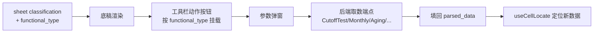

# 设计文档：底稿功能行为联动

## 概述

引入 functional_type 第三维度 + 动作面板框架 + 逐类型填充。一次性建机制，后续加类型只配置。

## 数据模型

### workpaper_sheet_classification 新增字段

```sql
ALTER TABLE workpaper_sheet_classification ADD COLUMN IF NOT EXISTS functional_type VARCHAR(50);
```

值域：sampling / cutoff / aging / monthly_analysis / contract_ledger / reconciliation / detail_table / consolidation / impairment / depreciation / ...

### 动作注册表（代码配置，非 DB）

```python
# backend/app/services/wp_action_registry.py
ACTION_REGISTRY: dict[str, ActionConfig] = {
    "cutoff": ActionConfig(
        label="截止测试取数",
        endpoint="sampling_enhanced.run_cutoff_test",
        params_schema=CutoffParamsSchema,
        fill_strategy="replace_rows",
    ),
    "aging": ActionConfig(...),
    "monthly_analysis": ActionConfig(...),
    "sampling": ActionConfig(...),
}
```

### 前端动作面板

```typescript
// composables/useWpFunctionalActions.ts
export function useWpFunctionalActions(wpCode: string, functionalType: string) {
  const actions = computed(() => ACTION_REGISTRY[functionalType] || [])
  async function executeAction(actionKey: string, params: Record<string, any>) {
    // 1. 调后端取数端点
    // 2. 结果填回 parsed_data
    // 3. 触发 locateCell 定位到新数据
  }
  return { actions, executeAction }
}
```

## 架构



## 正确性属性

**Property 1**: 对任意有 functional_type 的底稿，工具栏显示对应动作按钮。
**Property 2**: 动作执行后 parsed_data 被更新且包含取数结果。
**Property 3**: 新增 functional_type 只需配置 ACTION_REGISTRY（不改框架代码）。

## 不在范围
- L3 测算型（并入 stub 对话框治理）
- 目录页全景图（独立增强）
