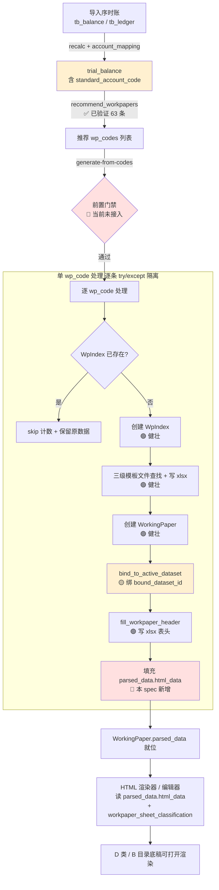

# 设计文档

## 概述

本设计服务于一个**非典型** spec：它不是"从零开发新功能"，而是让一条**已经写好、但从未在真实数据上跑通过一次**的链路——「账→稿」生成管线——真正端到端跑通，并把它固化为**可重复、可验证、有自动化测试保护**的能力，同时顺手补缺与纠正实跑过程中暴露的真实问题。

核心事实（已通过读代码 + PG 实测确认，设计据此而非臆测）：

- 入口端点 `POST /api/projects/{project_id}/working-papers/generate-from-codes`（`backend/app/routers/wp_template.py:generate_from_codes`）**逻辑健壮**：逐 `wp_code` 去重 → 建 `WpIndex` → 三级模板文件查找（知识库目录 → 原始路径 → openpyxl 空 workbook 兜底）→ 建 `WorkingPaper`（`source_type=template`）→ `bind_to_active_dataset` 绑定快照 → `fill_workpaper_header` 填表头。
- 推荐服务 `WpMappingService.recommend_workpapers(df5b8403, 2025, "standalone")` 已实测对 827 个科目返回 63 张底稿。
- **本机 `working_paper` / `wp_index` 当前 0 行**——这条链路从未被真实触发。

因此本设计采用**诊断驱动**的方法论：**先实跑定位、再针对性修复**，绝不大改架构。设计的产出物有三类：①一个可重复执行的实跑验证脚本（需求 7 的落地）；②对 `generate_from_codes` 的最小必要补缺（最关键的是 `parsed_data` 填充，使 HTML 渲染器/编辑器"有稿可渲"）；③对前置门禁与标准科目取数路径的澄清与纠正。

设计目标与边界：

- **不新增数据库表**。主要工作是验证现有四表/两稿模型，并补 `WorkingPaper.parsed_data` 的填充逻辑。
- **不大改推荐链**（已验证健康）。
- 所有验收以「在 df5b8403 上实跑出正确结果」为准，端点存在性 grep 与单测绿不构成验收证据。

## 现状诊断（基于 df5b8403 实跑视角）

下表把「账→稿」链路逐环节列出，标注当前健康度。这是设计的事实地基——后续每个设计决策都对应一处"存疑/待验证"环节的收口。

| 环节 | 组件 | 当前状态 | 判断依据 |
|------|------|---------|---------|
| ① 推荐 | `WpMappingService.recommend_workpapers` | ✅ 健康 | 实测对 df5b8403 返回 63 条 wp_codes |
| ② 取数源 | `trial_balance.standard_account_code` | 🟡 待验证 | `tb_balance` 仅有 `account_code`；`trial_balance` 才有 `standard_account_code`，由 recalc 经 `account_mapping` join 落地。需确认 df5b8403 的 `trial_balance` 已 recalc 且映射齐备 |
| ③ 前置门禁 | `PrerequisiteChecker._check_workpaper_prerequisites` | 🔴 不适用 | 该检查要求 `wizard_state.template_set_id`，但 generate-from-codes **不走模板集**，且端点当前**根本没调用**门禁 |
| ④ 索引创建 | `generate_from_codes` → `WpIndex` | 🟢 逻辑健壮，从未触发 | 代码路径完整（去重 + 唯一索引），但本机 `wp_index` 0 行 |
| ⑤ 底稿创建 | `generate_from_codes` → `WorkingPaper` | 🟢 逻辑健壮，从未触发 | 同步创建 `WorkingPaper`，但本机 `working_paper` 0 行 |
| ⑥ 内容填充 | `WorkingPaper.parsed_data` | 🔴 **确认缺失** | `generate_from_codes` 创建 `WorkingPaper` 时**未设置 `parsed_data`**（保持 NULL）；`fill_workpaper_header` 只写 xlsx 文件、**不写 `parsed_data`**（grep 0 命中）。HTML 渲染器读 `parsed_data['html_data']` → 无稿可渲 |
| ⑦ 快照绑定 | `bind_to_active_dataset` | 🟡 待验证 | 无 active `ledger_datasets` 时静默 no-op（`bound_dataset_id=None`），需确认 df5b8403 有 active dataset |
| ⑧ 表头填充 | `fill_workpaper_header` | 🟢 逻辑健壮 | 写 xlsx 表头（编制单位/审计期间/索引号/交叉索引），但不进 `parsed_data` |
| ⑨ 渲染/编辑 | HTML 渲染器 / 编辑器 | 🟡 前置已就位但缺数据 | `workpaper_sheet_classification` 已 seed 3867 行、`derive_component_type` 正常，但 ⑥ 缺 `parsed_data` 导致渲染器拿不到 sheet 内容 |

**诊断结论（最可能的真断点）**：链路在结构上是通的（①④⑤⑦⑧），但**环节 ⑥ `parsed_data` 从未被填充**，使得即便 `working_paper` 建出来，HTML 渲染器/编辑器也"有记录无内容"。这是本 spec 要根本解决的核心缺口。次要问题是 ③ 门禁语义错位与 ② 标准科目取数路径需澄清。

## 架构与数据流

### 端到端链路图



### 每一跳的状态标注

- 🔴 红色（本 spec 必须动手）：前置门禁接入（语义纠正）、`parsed_data.html_data` 填充。
- 🟡 黄色（实跑验证 + 必要澄清）：`standard_account_code` 取数路径、`bound_dataset_id` 绑定。
- 🟢 绿色（逻辑健壮，实跑确认即可）：推荐、`WpIndex`/`WorkingPaper` 创建、模板文件查找、表头填充。

### 数据流关键说明

1. **取数源必须是 `trial_balance` 而非 `tb_balance`**：`recommend_workpapers` 与 `get_prefill_data` 都通过 `TrialBalance.standard_account_code.in_(codes)` 取数。`tb_balance` 物理表只有 `account_code`，没有标准科目编码列。标准科目映射的落地点在 `trial_balance_service`：recalc 时把 `tb_balance.account_code` 经 `account_mapping`（`mp.c.standard_account_code`）join 聚合写入 `trial_balance.standard_account_code`。
2. **二段创建的事务边界**：`WpIndex` 与 `WorkingPaper` 在同一 `generate_from_codes` 调用内、同一 DB 事务中创建，函数末尾统一 `await db.commit()`。单 `wp_code` 失败需被隔离，不能让整批回滚。
3. **`parsed_data` 是渲染的载体**：HTML 渲染器（`GtWpRenderer`）与各编辑器读 `working_paper.parsed_data['html_data'][sheet_name]`，componentType 由 `workpaper_sheet_classification` + `derive_component_type` 派生。没有 `parsed_data.html_data`，渲染器拿不到 sheet 内容。

## 组件与接口

### 1. 生成端点 `generate_from_codes`（修改）

位置：`backend/app/routers/wp_template.py`

当前签名与返回保持稳定，但做三处**最小必要**修改：

```python
@router.post("/api/projects/{project_id}/working-papers/generate-from-codes")
async def generate_from_codes(project_id, data: GenerateFromCodesRequest, db, current_user):
    # [新增] 1. 前置门禁（语义纠正版，见组件 2）
    check = await PrerequisiteChecker().check(db, project_id, data.year, "generate_from_codes")
    if not check["ok"]:
        raise HTTPException(status_code=422, detail=check)

    created, skipped = 0, 0
    failures: list[dict] = []          # [新增] 失败明细
    created_codes: list[str] = []      # [新增] 新建列表
    skipped_codes: list[str] = []      # [新增] 跳过列表

    for code in data.wp_codes:
        try:                            # [新增] 单条隔离
            existing = ...              # 已有 WpIndex 去重逻辑（保留）
            if existing:
                skipped += 1
                skipped_codes.append(code)
                continue
            wp_index = WpIndex(...)     # 保留
            wp = WorkingPaper(...)      # 保留
            await bind_to_active_dataset(...)   # 保留
            await fill_workpaper_header(...)    # 保留
            # [新增] 填充 parsed_data（见组件 3）
            await populate_parsed_data(db, wp, code, wp_name, cycle)
            created += 1
            created_codes.append(code)
        except Exception as e:          # [新增] 捕获 + 记录，不中断
            failures.append({"wp_code": code, "error": str(e)})
            logger.warning("generate failed for %s: %s", code, e)

    await db.commit()
    return {
        "created": created, "skipped": skipped,
        "created_codes": created_codes, "skipped_codes": skipped_codes,
        "failures": failures,           # [新增] 结构化结果（需求 1.4 / 5.5 / 6.4）
        "message": f"已生成 {created} 个底稿，跳过 {skipped} 个，失败 {len(failures)} 个",
    }
```

**关键设计点**：
- 单 `wp_code` 的 `try/except` 必须包住该条的全部子步骤（建 index/建 wp/绑定/表头/填充），保证一条失败不影响其余（需求 6.3 / 6.5）。
- 失败后**不 rollback 整个 session**——用 savepoint（`db.begin_nested()`）隔离单条，使失败条目回滚而不破坏整批已成功条目（见错误处理章节）。

### 2. 前置门禁 `_check_generate_from_codes_prerequisites`（新增分支）

位置：`backend/app/services/prerequisite_checker.py`

**澄清结论**：`generate-from-codes` 不需要 `template_set`（它从 wp_codes 直接生成，模板文件走三级查找）。复用 `generate_workpapers` 门禁（检查 `template_set_id`）是**语义错误**。正确前置是「有可取数的 `trial_balance` 数据」，与推荐链的数据源一致。

新增 action 分支：

```python
async def _check_generate_from_codes_prerequisites(self, db, project_id, year) -> dict:
    """generate-from-codes 前置：trial_balance > 0 行（与推荐链数据源一致）"""
    tb_count = await db.scalar(
        sa.select(sa.func.count()).select_from(TrialBalance).where(
            TrialBalance.project_id == project_id,
            TrialBalance.year == year,
            TrialBalance.is_deleted == sa.false(),
        )
    ) or 0
    if tb_count == 0:
        return {"ok": False,
                "message": "请先执行试算表重算（当前无标准试算表数据，无法生成底稿）",
                "prerequisite_action": "recalc"}
    return {"ok": True, "message": "", "prerequisite_action": None}
```

在 `check()` 的 `checks` 字典注册 `"generate_from_codes"`。门禁不通过返回 **HTTP 422 + 中文诊断**（需求 6.1 / 6.2）。注意现有 `generate_project_workpapers` 用的是 400，本端点按需求 6.1 明确要求 **422**。

### 3. `parsed_data` 填充 `populate_parsed_data`（新增）

位置：建议新增 `backend/app/services/wp_parsed_data_service.py`（纯函数 + 一个 async writer），不塞进已超长的 service。

职责：从底稿的 xlsx 模板文件读取 sheet 结构，连同表头元数据，写入 `WorkingPaper.parsed_data`，结构对齐 HTML 渲染器消费的 `parsed_data['html_data'][sheet_name]` 形态。

```python
async def populate_parsed_data(db, wp, wp_code, wp_name, cycle) -> None:
    """读取 wp.file_path 的 xlsx，构建 parsed_data.html_data。

    结构（对齐 GtWpRenderer / wp_html_save 的 html_data 形态）：
    parsed_data = {
        "html_data": {
            "<sheet_name>": {
                "cells": { "A1": {"v": ...}, ... },   # 表头 + 模板已有内容
                "columns": [...],                      # 列结构（若可识别）
            },
            ...
        },
        "wp_code": wp_code,
        "generated_at": iso8601,
    }
    """
    structure = _read_xlsx_structure(wp.file_path)   # 纯函数：openpyxl 读 sheet→cells
    wp.parsed_data = {
        "html_data": structure,
        "wp_code": wp_code,
        "generated_at": datetime.now(timezone.utc).isoformat(),
    }
    flag_modified(wp, "parsed_data")
```

**设计权衡**：
- 表头已由 `fill_workpaper_header` 写入 xlsx 文件 → `populate_parsed_data` 在表头填充**之后**调用，读到的 xlsx 已含表头，`html_data` 自然包含表头内容（满足需求 2.2「parsed_data 包含表头内容与模板 sheet 结构」）。
- `_read_xlsx_structure` 是纯函数（输入文件路径，输出 dict），便于单测与属性测试。
- 不在此处做取数填充（取数是 `prefill_engine` 的职责，属于后续 spec）；本 spec 只保证"有结构可渲"。

### 4. 实跑验证脚本 `verify_wp_generation_pipeline.py`（新增）

位置：`backend/scripts/verify_wp_generation_pipeline.py`（**无 `_` 前缀**，因可重复执行，按项目 scripts 命名规约属正式工具）。

职责（需求 7 的落地）：对 df5b8403 执行一次可重复的端到端验证，输出真实结果并断言。

```
用法: ..\.venv\Scripts\python.exe scripts/verify_wp_generation_pipeline.py \
        --project df5b8403 --year 2025 [--report]

步骤:
  1. recommend  : 调 WpMappingService.recommend_workpapers → 打印 wp_codes 数量
  2. precheck   : 调 PrerequisiteChecker.check(..., "generate_from_codes") → 打印门禁结果
  3. generate   : 调 generate_from_codes 等价逻辑 → 打印 created/skipped/failures
  4. count      : SELECT count(*) FROM working_paper / wp_index WHERE project_id=... → 打印真实计数
  5. assert     : 断言 working_paper > 0 / wp_index == working_paper 计数一致 /
                  parsed_data 非空 / 至少 1 张 D 类 + 1 张 B 目录底稿存在
  6. idempotent : 再跑一次 generate → 断言计数不变（幂等验证，需求 5.2/5.3）
```

脚本输出既是验收证据，也作为回归工具长期保留。`--report` 输出 markdown 报告到 `docs/uat/`。

### 5. 标准科目取数路径（澄清，无新代码）

设计层面明确（需求 4）：

- **TB_Balance（`tb_balance`）**：导入产生的原始账表，仅 `account_code`，**不用于按标准科目取数**。
- **Trial_Balance（`trial_balance`）**：recalc 产物，含 `standard_account_code`，是推荐与取数的**唯一**数据源。
- **映射落地点**：`trial_balance_service` recalc 时把 `tb_balance.account_code` 经 `account_mapping.standard_account_code` join 聚合写入 `trial_balance`。未映射科目由 recalc 阶段处理（不在本端点）。
- 本 spec 不改取数逻辑，只在 design 与验证脚本中**断言取数走 `trial_balance.standard_account_code`**，并在验证脚本中比对取数结果与 `trial_balance` 对应标准科目余额一致（需求 4.4）。

## 数据模型

本 spec **不新增表、不新增列**。涉及的现有模型（`backend/app/models/`）：

### WpIndex（`wp_index`）— 底稿索引

| 字段 | 类型 | 说明 |
|------|------|------|
| id | UUID | PK |
| project_id | UUID FK | 项目 |
| wp_code | str | 底稿编码 |
| wp_name | str | 底稿名称 |
| audit_cycle | str? | 审计循环前缀 |
| status | WpStatus | not_started 等 |
| is_deleted | bool | 软删除 |

唯一索引 `uq_wp_index_project_code (project_id, wp_code)` — 这是幂等去重的物理保障（需求 5）。

### WorkingPaper（`working_paper`）— 底稿记录

| 字段 | 类型 | 说明 |
|------|------|------|
| id | UUID | PK |
| project_id | UUID FK | 项目 |
| wp_index_id | UUID FK → wp_index | 二段关系绑定 |
| file_path | str | xlsx 文件路径 |
| source_type | WpSourceType | template / manual |
| status | WpFileStatus | draft 等 |
| **parsed_data** | JSONB? | **本 spec 核心**：渲染内容载体，需填充 `html_data` |
| bound_dataset_id | UUID? | 快照绑定（由 bind_to_active_dataset 设置） |
| dataset_bound_at | datetime? | 绑定时间 |
| prefill_tb_snapshot | JSONB? | 上次 prefill 的 TB 快照 |
| is_deleted | bool | 软删除 |

`parsed_data` 当前在 `generate_from_codes` 路径下保持 NULL — 这是要修复的缺口。

### TrialBalance（`trial_balance`）— 标准试算表（取数源）

关键字段：`project_id` / `year` / `company_code` / **`standard_account_code`** / `account_name` / `unadjusted_amount` / `audited_amount` / `opening_balance` / `rje_adjustment` / `aje_adjustment`。

### TbBalance（`tb_balance`）— 原始余额表（非取数源）

仅 `account_code` / `company_code` / `account_name` / `currency_code`，**无 `standard_account_code`**。设计上明确区分二者用途。

### workpaper_sheet_classification — sheet 分类（已 seed）

已灌 3867 行（9 类）。HTML 渲染器经 `get_classification(wp_code, project_id)` + `derive_component_type` 派生 componentType。本 spec 只消费、不修改。

## 正确性属性（Correctness Properties）

*属性（property）是指在系统所有有效执行路径上都应成立的特征或行为——本质上是关于"系统应该做什么"的形式化陈述。属性是人类可读规格与机器可验证正确性保证之间的桥梁。*

下列属性由验收标准经可测性分析与冗余合并得到（详见 prework）。每条属性都是普遍量化（"对任意…"）的陈述，将由单一的属性测试实现。示例类与不可测的验收标准（1.3 / 3.1 / 3.4 / 4.1 / 4.3 / 4.4 / 4.5 / 7.1 / 7.2 / 7.3 / 7.4）归入测试策略的单元/集成测试或文档职责，不在此列为属性。

### Property 1: 二段一一对应

*对任意* 去重后的 `wp_codes` 列表，在 Test_Project 上完成生成后，列表中每个被新建的 `wp_code` 都恰好对应一条 `WpIndex` 记录与一条 `wp_index_id` 指向它、`file_path` 非空的 `WorkingPaper` 记录；两表中同一 `wp_code` 的记录数相等。

**Validates: Requirements 1.1, 1.2, 2.1, 2.5**

### Property 2: parsed_data 内容填充

*对任意* 新建的 `WorkingPaper`，其 `parsed_data` 字段非空且包含 `html_data`，`html_data` 至少含一个 sheet 结构（表头内容随模板已写入）。

**Validates: Requirements 2.2**

### Property 3: componentType 按分类正确派生

*对任意* 已生成的底稿，经 `get_classification` + `derive_component_type` 派生出的 componentType 均为非空有效值：D 类底稿派生为非 `univer` 的 HTML componentType，B 目录底稿派生为 `b-index`；当某底稿缺 `workpaper_sheet_classification` 记录时，按 `wp_code` 前缀 fallback 派生且不返回空白/错误状态。

**Validates: Requirements 3.2, 3.3, 3.5**

### Property 4: 幂等——重复生成计数不变

*对任意* `wp_codes` 列表，对同一项目以相同列表连续执行两次生成后，该项目的 `working_paper` 与 `wp_index` 记录数与首次执行后保持一致；已存在对应记录的 `wp_code` 在第二次执行中被跳过并正确计入 `skipped`。

**Validates: Requirements 5.1, 5.2, 5.3**

### Property 5: 跳过不破坏已有数据

*对任意* 在生成时被跳过的已存在底稿，其 `parsed_data` 与 `bound_dataset_id` 在调用前后保持不变。

**Validates: Requirements 5.4**

### Property 6: 返回结构与 DB 实际变化一致

*对任意* 一次生成调用，返回结果都包含 `created` / `skipped` / `failures` 以及 `created_codes` / `skipped_codes` 列表，且这些统计与失败明细与数据库中 `wp_index` / `working_paper` 的真实记录变化一致（新建数 == created、跳过数 == skipped、失败 code 不出现在新建记录中）。

**Validates: Requirements 1.4, 5.5, 6.4, 7.5**

### Property 7: 单条失败隔离

*对任意* 含至少一个会抛异常的 `wp_code` 的列表，该失败 `wp_code` 被捕获并记录失败原因，且不影响列表中其余 `wp_code` 的 `WpIndex` 与 `WorkingPaper` 正常创建。

**Validates: Requirements 6.3, 6.5**

### Property 8: 前置门禁拦截返回 422 + 中文诊断

*对任意* 前置条件不满足（无可取数 `trial_balance` 数据）的生成请求，系统都返回 HTTP 422 状态码，且诊断信息为列出具体未满足前置条件项的中文文本，而非通用错误或 HTTP 500。

**Validates: Requirements 6.1, 6.2**

### Property 9: 标准科目取数走 Trial_Balance

*对任意* 按标准科目取数的底稿，取数查询命中的均为 `trial_balance.standard_account_code`，而非 `tb_balance.account_code`；取数结果中的科目编码集合是 `trial_balance` 中标准科目编码的子集。

**Validates: Requirements 4.2**

### Property 10: 快照绑定

*对任意* 在存在 active `ledger_datasets` 时新建的 `WorkingPaper`，其 `bound_dataset_id` 等于该项目当前 active dataset 的 id。

**Validates: Requirements 1.5**

## 错误处理

### 前置门禁失败（需求 6.1 / 6.2）

- 无 `trial_balance` 数据 → `PrerequisiteChecker.check(..., "generate_from_codes")` 返回 `ok=False` → 端点抛 `HTTPException(status_code=422, detail=check)`。
- `detail` 为结构化字典 `{ok, message(中文), prerequisite_action}`，前端据此引导用户去执行 recalc。
- **明确区分**：本端点用 **422**（业务前置不满足），不是 500（服务器异常），也不是现有 `/generate` 用的 400。

### 单 wp_code 失败隔离（需求 6.3 / 6.5）

- 每个 `wp_code` 的处理包在 `try/except Exception` 中。
- 为避免单条失败污染整批事务，单条处理使用 **savepoint**：`async with db.begin_nested():` 包住该条的 index/wp/绑定/表头/填充；该条抛异常时仅回滚 savepoint，已成功的其余条目不受影响。
- 失败被记录到 `failures.append({"wp_code": code, "error": str(e)})` 并 `logger.warning`，循环继续。
- 函数末尾 `await db.commit()` 提交所有成功条目。

### 子步骤的降级（保留现有行为）

- 模板文件查找三级兜底（知识库 → 原始路径 → openpyxl 空 workbook → 空字节）已存在，保留。
- `bind_to_active_dataset` 无 active dataset 时静默 no-op（`bound_dataset_id=None`），不抛异常——允许"先建底稿后导账套"的工作流，但验证脚本会对 df5b8403 断言 `bound_dataset_id` 非空。
- `fill_workpaper_header` 失败时记 warning 不中断（保留），但 `populate_parsed_data` 失败应计入该条 `failures`（因 parsed_data 是核心产物）。

### 标准科目映射缺口（需求 4.5，归属上游）

- account_code → standard_account_code 的映射落地在 recalc 阶段（`trial_balance_service`），不在本端点。未映射科目的记录与隔离是上游 recalc 职责。本 spec 在验证脚本中**检测并报告** df5b8403 是否存在 `trial_balance` 缺 `standard_account_code` 的情况，作为诊断输出。

## 测试策略

采用**单元测试 + 属性测试 + 真实数据集成验证**三位一体，三者互补缺一不可。

### 属性测试（Property-Based Testing）

- 框架：后端用 **hypothesis**（项目既有依赖，`.hypothesis/` 已在用）。
- 每条正确性属性（Property 1–10）由**单一**属性测试实现。
- 每个属性测试最少运行 **100** 次迭代（受项目 PBT 调速铁律影响，CI 环境可按既有惯例降速，但本地完整验证不少于 100）。
- 每个测试用注释标注其对应的设计属性，格式：
  `# Feature: wp-generation-pipeline, Property {number}: {property_text}`
- 生成器策略：
  - Property 1/4/5/6/7：生成随机去重 `wp_codes` 列表（从 `wp_account_mapping.json` 真实 code 池采样 + 合成 code），用内存/SQLite 或 FakeDB 承载 `WpIndex`/`WorkingPaper`，断言不变量。
  - Property 2：生成随机模板 sheet 结构 → `populate_parsed_data` → 断言 `parsed_data.html_data` 非空。
  - Property 3：生成随机 wp_code（覆盖 D/B/缺分类三类）→ `derive_component_type` → 断言派生值符合分类规则。
  - Property 7：在随机位置注入一个必失败的 `wp_code`（如模板写入 mock 抛异常）→ 断言其余条目仍创建。
  - Property 8：构造无 `trial_balance` 数据场景 → 断言返回 422 + 中文 detail。
  - Property 9：生成随机 `trial_balance` 数据集 → 取数 → 断言结果 code 是 `standard_account_code` 子集。
  - Property 10：构造存在 active dataset 的场景 → 断言 `bound_dataset_id` 命中。

### 单元测试

聚焦具体示例、边界与错误条件（避免与属性测试重复覆盖输入空间）：

- `_read_xlsx_structure` 对一个真实致同模板 xlsx 的解析（具体示例）。
- 幂等去重边界：空列表、单元素列表、全部已存在的列表。
- savepoint 隔离：两条 code 一成功一失败，断言成功条入库、失败条未入库。
- 门禁分支注册：`check(..., "generate_from_codes")` 正确路由到新分支。

### 真实数据集成验证（核心验收，需求 7）

- **`verify_wp_generation_pipeline.py`** 对 df5b8403 实跑（见组件 4），是本 spec 的**首要验收证据**：
  - 断言 `working_paper` 计数 > 0（需求 1.3 / 7.4）。
  - 断言 `wp_index` 计数 == `working_paper` 计数（需求 2.5 / 7.5）。
  - 断言返回 `created`/`skipped` 与 DB 真实计数一致（需求 7.5）。
  - 断言至少 1 张 D 类 + 1 张 B 目录底稿存在且 `parsed_data` 非空、componentType 派生正确（需求 3.4 / 7.4）。
  - 二次调用断言计数不变（幂等，需求 5.2 / 5.3）。
  - 断言取数结果与 `trial_balance` 对应标准科目余额一致（需求 4.4）。
- 验收铁律：端点存在性 grep 与单测绿**不构成**充分验收证据（需求 7.2）；必须有 df5b8403 实跑产出的真实结果。
- 三层一致校验：DB（PG 实查 `docker exec audit-postgres psql -d audit_platform`）+ ORM（`WorkingPaper.parsed_data`）+ service（返回统计）三者对账一致。

### 环境约定

- Windows：`python`（非 `python3`）；backend cwd 用 `..\.venv\Scripts\python.exe`；多命令用 `;` 不用 `&&`。
- PG：容器 `audit-postgres`，库 `audit_platform`。
- 测试用 `python -m pytest backend/tests/... -v --tb=short`。
