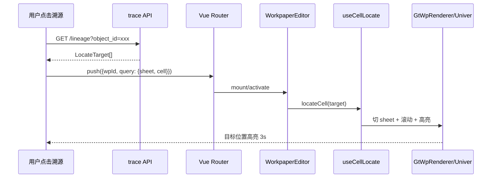

# 设计文档：底稿定位基础设施（wp-locate-foundation）

## 概述

这是整个底稿改进路线图的**技术枢纽**——统一溯源面板（Spec 3b）、TSJ 复核跳证据（Spec 4）、穿透体验（Spec 5）都依赖它。

核心问题（proposal 第十七章实测）：**cell 定位是 Univer 独占能力，HTML 渲染器 0 响应**。追溯/穿透即使带了 sheet+cell，跳到 HTML 类底稿（占 57%）后无法定位高亮——过半底稿的精确定位追溯是断的。

本 spec 做两件事：
1. **后端**：统一 `LocateTarget` 坐标契约（所有 trace service 输出统一格式）
2. **前端**：给 HTML 渲染器补 `useCellLocate` composable（切 sheet → 滚动 → 高亮 → 淡出）

## 现状诊断

| 能力 | Univer | HTML 渲染器 |
|------|--------|------------|
| cell 定位 | ✅ UniverEditorCore.onLocateCell | ❌ GtWpRenderer grep locate=0 |
| sheet 切换 | ✅ univerAPI.setActiveSheet | ✅ 内部 el-tabs |
| 高亮 | ✅ Univer selection | ❌ 无 |
| 穿透带上下文 | ❌ toWorkpaperEditor 只带 wpId | ❌ 同 |

## 架构设计

### 统一坐标契约 LocateTarget

```python
@dataclass
class LocateTarget:
    wp_code: str
    wp_id: str | None = None
    sheet_name: str | None = None
    cell_ref: str | None = None          # "A1" / "B3:D5" 范围
    component_type: str | None = None    # HTML componentType 或 "univer"
    value: str | None = None             # 目标值（辅助定位）
    label: str | None = None             # 人类可读标签
```

所有 trace service 输出统一为 `LocateTarget`：
- `wp_trace_service.TraceItem` → 已是 cell 级，映射到 LocateTarget
- `report_trace_service` → 从"返回整个 parsed_data"升级为返回 LocateTarget 列表（利用 cell_provenance）

### 前端 useCellLocate composable

```typescript
// audit-platform/frontend/src/composables/useCellLocate.ts
export function useCellLocate() {
  function locateCell(target: LocateTarget): boolean {
    // 1. 切到目标 sheet（如需要）
    // 2. 按 component_type 委托定位策略
    // 3. 滚动到目标位置
    // 4. 高亮 + 3s 淡出
    // 5. 返回是否成功
  }
  return { locateCell }
}
```

**定位策略按 componentType 分派**：
| componentType | 定位方式 |
|---------------|---------|
| el-table 类（c-note-table / d-form-table / e-control-test） | 滚动到行 + 行高亮（el-table scrollTo + row class） |
| GtIndexChip 类（a-program-console / b-index） | scrollIntoView + 闪烁动画 |
| h-static-doc | scrollIntoView（段落级） |
| univer | 委托 UniverEditorCore.onLocateCell（已有） |

### 穿透带定位上下文

`usePenetrate.toWorkpaperEditor` 扩展签名：

```typescript
// 修改前
function toWorkpaperEditor(wpId: string): void

// 修改后
function toWorkpaperEditor(wpId: string, locate?: { sheet?: string; cell?: string }): void
```

路由 query 带 `?sheet=xxx&cell=yyy`，WorkpaperEditor onMounted 读 query → 触发 locateCell。

### 定位失败降级

- cell 级定位失败 → 降级到 sheet 级（至少切到对的 sheet）
- sheet 级也失败 → 提示"已打开底稿但未能定位到目标位置"
- 不静默失败

## 数据流



## 正确性属性

**Property 1: LocateTarget 完整性**
对任意 trace service 返回的定位目标，LocateTarget 的 wp_code 非空且 component_type 为有效值。

**Property 2: HTML 定位覆盖率**
对任意 HTML componentType（9 类），useCellLocate 都有对应的定位策略（不返回"不支持"）。

**Property 3: 定位幂等**
对同一 LocateTarget 连续调用两次 locateCell，第二次不产生额外副作用（高亮不叠加）。

**Property 4: 降级不静默**
对任意定位失败场景，系统给出可见反馈（toast/提示），不静默忽略。

**Property 5: 穿透上下文传递**
对任意带 sheet/cell 的穿透跳转，目标编辑器 onMounted 后 locateCell 被调用且参数与 query 一致。

## 文件变更清单

### 新增
- `backend/app/schemas/locate_target.py`（LocateTarget dataclass + 序列化）
- `audit-platform/frontend/src/composables/useCellLocate.ts`
- `audit-platform/frontend/src/composables/__tests__/useCellLocate.spec.ts`

### 修改
- `backend/app/services/wp_trace_service.py`：TraceItem → LocateTarget 映射
- `backend/app/services/report_trace_service.py`：升级返回 LocateTarget（利用 cell_provenance）
- `audit-platform/frontend/src/components/workpaper/GtWpRenderer.vue`：监听 locate-cell 事件
- `audit-platform/frontend/src/composables/usePenetrate.ts`：toWorkpaperEditor 扩展签名
- `audit-platform/frontend/src/views/WorkpaperEditor.vue`：onMounted 读 query 触发 locateCell

## 不在范围

- 不改 Univer 的定位能力（已有，只对齐接口）
- 不做统一溯源面板 UI（那是 wp-traceability-panel spec）
- 不做附件入网（那是 wp-traceability-panel spec）
- 不追求像素级精确定位（HTML 类到"行+高亮"足够实用）
