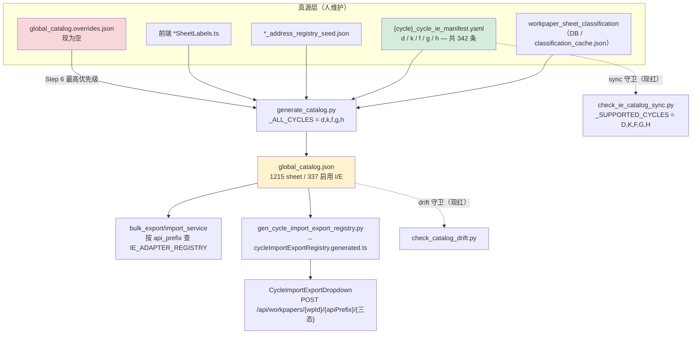
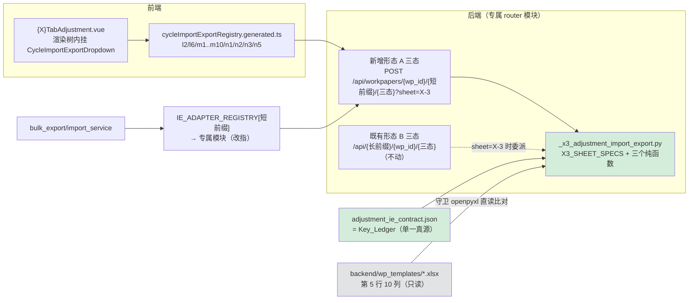

# Design Document

## Overview

本设计把 16 张 X-3 调整分录汇总表接入三态导入导出，落点选择的核心不是"写哪个文件"，而是**同一个 `api_prefix` 取值能否同时打通单份 UI 通路与批量通路**。需求文档已钉死缺口本体（16×16 互补矩阵 / 缺陷 A·B·C / 47 条同源缺陷）。

> **两个开放项已由用户裁决闭合（详见文末 §用户裁决）**：①`N5-3` 纳入本轮作业面 ⇒ **作业面 16 张，无 `pending_manual` 条目**（E12 的结论被 E17 推翻）；②三个已红 CI job 本 spec **不修**，只带可复算证据登记进 `Deviation_Registry`。

本设计在此之上补齐三件需求阶段未定的事：

1. **catalog 是派生物，不是真源。** `backend/data/acnr/global_catalog.json` 由 `backend/scripts/acnr/generate_catalog.py` 生成，`import_export` 段只从两处来：`{cycle}_cycle_ie_manifest.yaml`（**仅 d/k/f/g/h 五个循环**）与 `global_catalog.overrides.json`。直接写 catalog 的登记**重生成即消失**。本轮实测：38 条已启用 IE 条目无 manifest 兜底、重生成即丢；另有 15 条 `api_prefix` 会被 manifest 反向覆盖回旧值。两个阻断级 CI job（`check-acnr-catalog-drift` / `acnr-ie-catalog-sync`）**当前已红**。
2. **路线不是三选一，而是四选一 —— 平台自己已经走出了第四条。** 前端共享 composable 把 URL 形态与 HTTP 方法写死为 `POST /api/workpapers/{wpId}/{apiPrefix}/{三态}`（形态 A）。而 `l1`/`l3`/`l4`/`l5`/`h7` 的**专属 router 模块**已经在用**短前缀 + 形态 A** 注册三态端点 —— `l4_bonds_payable` 更是 POST×3、与共享 composable 完全匹配。X-3 的 16 个专属 router 是这条收敛路上的滞后者（还停在长前缀 + 形态 B + GET/POST 混用）。

3. **`storage_field` 不是逐 sheet 观察值，是机制的函数。** 前端只有两条 entries 持久化通路：`use{X}FormData.setField()` **恒**写 `conclusion`、`use{X}Adjustment` 的 `saveBatch`/`debouncedSave` **恒**写 `remark`。逐张核实 16/16 无例外（E18 + §storage_field 机制归类）。⇒ 台账记**机制**、守卫按机制推导列；顺带暴露 E19（M3-3 键族归类错）、E20（M9-3 多一个后缀）、**E21（四张只写不读，R6.5 当前不可满足）**三条实证。

据此裁定 **`Selected_Route` = R-D「专属 router 补短前缀形态 A 三态 + X-3 纳入白名单 + adapter 改指专属模块」**：单份通路与批量通路共用短前缀与**同一套实现**，19 个工厂模块的两项能力都被专属侧接管 ⇒ 父 spec Task 25 可执行。

### 本轮补充实证（design 阶段新增，与需求文档不冲突）

| # | 事实 | 取得方式 |
|---|---|---|
| E1 | `generate_catalog._ALL_CYCLES = ["d","k","f","g","h"]`；L/M/N 无 manifest ⇒ 16 张目标 sheet 的 `import_export` 无任何生成源 | 读源码 + `load_ie_manifest` |
| E2 | 重生成会**丢 38 条**已启用 IE（H5-2/H5-3/H7-2/H7-3 · I 循环 24 条 · L1/L3/L4/L5 各 2 条 · N4-2/N4-3），并把 **15 条** `api_prefix` 改回工厂短前缀（`g4-main→g4` 等）；`overrides` 段现为**空** | 运行期 diff：committed catalog vs `generate_catalog(offline=True, 同版本号)` |
| E3 | `check-acnr-catalog-drift`（无 `continue-on-error`）与 `acnr-ie-catalog-sync` 均 **exit=1**（用户侧独立复算已佐证同一结果）。**裁决 2：本 spec 不修**，只登记进 `Deviation_Registry` G2 / G3，且登记须带可复算三字段 | 执行 `python backend/scripts/acnr/check_catalog_drift.py` 与 `python backend/scripts/acnr/check_ie_catalog_sync.py`，取退出码 |
| E4 | 前端共享 `useWorkpaperImportExport` 的 `apiBase()` = `/api/workpapers/${wpId}/${apiPrefix}`，三态全 **POST** | 读 `useWorkpaperImportExport.ts` |
| E5 | 16 个专属前缀（长前缀，形态 B）**14 个已声明 `sheet`**，仅 `l2-interest-payable` / `m1-dividends-payable` 六个 handler 无 `sheet`（与 R4.3 一致）；但 **16 个白名单无一含 X-3** | 运行期 `inspect.signature` + 读模块常量 |
| E6 | M 族专属 service 的 sheet 分派是 `if sheet and sheet in _SHEET_CONFIGS: … else: 全部 sheet` ⇒ **未知 sheet 静默回退导出/导入全部**，不是可读错误 | 读 `m4_capital_reserve_service.py` |
| E7 | `_kfgh_cycle_adapters._PREFIX_TO_MODULE` 共 89 键，**68 键**的短前缀在运行期有形态 A 三态；**21 键没有**（= 本 spec 的 16 + `h5`/`h9`/`l7`/`l8`/`n4`） | 运行期路由表 × `_PREFIX_TO_MODULE` |
| E8 | `l1`/`l3`/`l4`/`l5`/`h7` 的形态 A 短前缀端点由**专属 router 模块**提供（`app.routers.l1_short_term_loans` 等），而其 adapter 仍指向**工厂模块** ⇒ 同一前缀下 UI 与 bulk 跑两套实现（**split-brain**，5 例存量） | 运行期 `endpoint.__module__` × `_PREFIX_TO_MODULE` |
| E9 | 形态 A 三态**方法不齐**的前缀 8 个：`bad-debt-rows`/`c24-journal`/`h7`/`j2`/`l1`/`l3`/`l5`/`offline`；其中 `h7` 已挂共享 dropdown ⇒ 其导出必 405（存量缺陷） | 运行期 `route.methods` × 前端 `api-prefix=` 挂载点扫描 |
| E10 | 工厂 `create_cycle_import_export_router` 已有四个扩展点：`item_id_candidates`（导出多键回退）/ `mirror_item_ids`（导入镜像写）/ `parse_import` + `import_handler`（自定义解析与落库）/ `header_row`；`sheet: str = Query(...)` **必填**且 `_validate` 已返回可读 400 | 读 `_cycle_import_export_common.py` |
| E11 | 逐字段族的键后缀词表实测为 `type/desc/category/report/account/note/debit/credit/ref/remark`（**含 `type` = AJE/RJE**，源模板无对应列）；字段名逐循环有分歧（L6 用 `entry.indexRef`，L7/L8 用 `entry.refIndex`） | 读 `useL6Adjustment.ts` / `useL7Adjustment.ts` / `useL8Adjustment.ts` |
| E12 | **（观察成立、结论已推翻，见 E17）** `N5TabAdjustment.vue` 里唯一可见的 `'N5-3-entries'` **字面量**出现在 `useAdjustmentCentralSync` 的 `itemId` 选项里。当时据此判 N5-3 为「键不可确证」⇒ 触发 R2.6。**该结论错**：真数据键与这个字面量**同名但不同源**，纯属巧合 | 读 `N5TabAdjustment.vue` |
| E13 | `L2-3` 源模板第 6 行含**示例数据行** `['北京','账项调整','货币资金','银行存款','银行存款','','200','200','北京','北京']`；其余 15 张第 6 行为空 | 源模板 openpyxl 直读，快照留存于 `evidence/source_template_x3_headers.txt` |
| E14 | 前端契约守卫 `adjustmentIeContract.spec.ts` 的 `Property 9` 硬断言 `entry.storage_field === 'remark'` ⇒ 把 N1 / N2 / N3 / **N5** 的实测列 `conclusion` 判为违规（**守卫自身把错值锁成基线**）。修法不是把常量换成 `'conclusion'`，而是换成 **E18 的机制判据** | 读该 spec 文件 |
| E15 | `wp_bound_entry_coverage.json` 是 `entry_coverage_scanner.py` 的**生成物**，由 `coverage_guard.py` 做 Route_Drift_Guard ⇒ 新增端点不重新生成台账即 CI 红 | 读 `entry_coverage_scanner.py` / `coverage_guard.py` |
| E16 | 已有变异检验框架 `backend/scripts/diagnose/mutate_ie_lifecycle_guards.py`（含 M13/M14 等命名变异），可直接扩本 spec 的守卫 | 读该脚本 |
| E17 | **`N5-3` 的键已确证，作业面 16 张（推翻 E12 与开放项 1）**：`N5TabAdjustment.vue` 不走 `persistEntries`，走 `useN5FormData` —— 写 `saveEntries → formData.setField('3','entries', entries.value)`、读 `onMounted → formData.getField('3','entries')`；`useN5FormData` 内 `ITEM_PREFIX='N5-'` + `` itemId = `${ITEM_PREFIX}${sheet}-${field}` `` ⇒ 真键 `N5-3-entries`、列 `conclusion`、`key_family = single_json`、`read_family` 同族 | 读 `n5/core/N5TabAdjustment.vue` + `composables/useN5FormData.ts` |
| E18 | **`storage_field` 有机制级规律，不必逐 sheet 猜**：`use{X}FormData.setField()` 恒 `saveField(itemId, { conclusion })`（4/4 逐字相同）；`use{X}Adjustment` 的 `saveBatch`/`debouncedSave` 恒 `{ remark: … }`（12/12）。⇒ 机制 ① ⇒ `conclusion`、机制 ② ⇒ `remark`，**16/16 无例外**（逐张核实结果见 §storage_field 机制归类） | 逐读 16 个 `use{X}FormData.ts` + 12 个 `use{X}Adjustment.ts`，快照 `evidence/storage_field_mechanism_probe.txt` |
| E19 | **`M3-3` 的键族归类须改**：它同样写 `` `M3-M3-3-entry-${n}-data` ``（`{ remark }`），且 `M3TabAdjustment._restoreEntries` 只读 `-data` ⇒ `M3-3` 是 `per_field_plus_data`（双前缀），不是 `per_field`。真正只有 per-field 无 `-data` 的是 `L6-3` / `M1-3` / `M2-3` | 快照 `evidence/key_family_probe.txt` |
| E20 | **`per_field_suffixes` 不是全局常量**：`M9-3` 有第 11 个后缀 `ociBlock`（其他综合收益类别块），源模板无对应列；其余 11 张为同一 10 项。⇒ 后缀表必须逐 sheet 承载 | 同上 |
| E21 | 🔴 **`L6-3` / `M1-3` / `M2-3` / `M9-3` 四张只写不读** —— 全前端生产代码（排除 `__tests__`/`*.spec.ts`）对这四族键的引用**只出现在写入处**，`restoreEntries` / `loadFromResponses` / `.get(` 一个都没有 ⇒ 用户填完刷新页面即看不见（存量缺陷）。R6.5「导入后界面重载 SHALL 显示导入的行」对这四张**当前不可满足** | 全库 grep 四个键族前缀，命中文件数各 1（均为写入侧 composable） |

> E7/E8 与需求文档「7 个工厂模块是活代码」的判定**一致**：那 7 个模块（`_h5`/`_h7`/`_l1`/`_l3`/`_l4`/`_l5`/`_n4`）的模块本身确实未被 `include_router`，其存活来自 catalog 声明短前缀 + adapter 直调闭包。E8 只是补出一层：其中 5 个短前缀的 HTTP 宿主另有其人（专属 router），这才是 split-brain 的成因。

### `storage_field` 机制归类（逐张核实，取代逐 sheet 观察值）

判据不是「观察到写了哪一列」，而是「这张 X-3 的 entries 走哪条持久化通路」——**通路可解释、可守卫；观察值会被下一次改名打散**（R2.7 / E18）。两条通路各自的列是写死在通路实现里的：

- **机制 ①** `use{X}FormData.setField(sheet, field, value)` → `` itemId = `${ITEM_PREFIX}${sheet}-${field}` `` → `saveField(itemId, { conclusion })` ⇒ **恒 `conclusion`**
- **机制 ②** `use{X}Adjustment` 的 `saveBatch(...)` / `debouncedSave(itemId, { remark: … })` ⇒ **恒 `remark`**

| sheet | 机制 | 数据键 / 键族 | `storage_field` | 界面读回族 | 读回宿主符号 |
|---|---|---|---|---|---|
| L2-3 | ② | `L2-L2-3-entries`（单键 JSON，常量 `ITEM_ID_ENTRIES`） | `remark` | 同族 | `useL2Adjustment` 内 `.get(ITEM_ID_ENTRIES)` |
| L6-3 | ② | `L6-L6-3-entry-{n}-{f}` ×10（**无 `-data`**） | `remark` | **无**（E21） | — |
| M1-3 | ② | `M1-M1-3-entry-{n}-{f}` ×10（**无 `-data`**） | `remark` | **无**（E21） | — |
| M2-3 | ② | `M2-M2-3-entry-{n}-{f}` ×10（**无 `-data`**） | `remark` | **无**（E21） | — |
| M3-3 | ② | `M3-M3-3-entry-{n}-{f}` ×10 **+ `-data`** | `remark` | `-data` | `M3TabAdjustment._restoreEntries` |
| M4-3 | ② | `M4-3-entry-{n}-{f}` ×10 + `-data` | `remark` | `-data` | `M4TabAdjustment.restoreEntries` |
| M5-3 | ② | `M5-3-entry-{n}-{f}` ×10 + `-data` | `remark` | `-data` | `M5TabAdjustment.restoreEntries` |
| M6-3 | ② | `M6-3-entry-{n}-{f}` ×10 + `-data` | `remark` | `-data` | `useM6Adjustment.loadFromResponses`（唯一把读回放在 composable 的） |
| M7-3 | ② | `M7-3-entry-{n}-{f}` ×10 + `-data` | `remark` | `-data` | `M7TabAdjustment._restoreEntries` |
| M8-3 | ② | `M8-3-entry-{n}-{f}` ×10 + `-data` | `remark` | `-data` | `M8TabAdjustment._restoreEntries` |
| M9-3 | ② | `M9-3-entry-{n}-{f}` **×11（含 `ociBlock`）** + `-data` | `remark` | **无**（E21） | — |
| M10-3 | ② | `M10-3-entry-{n}-{f}` ×10 + `-data` | `remark` | `-data` | `M10TabAdjustment.restoreEntries` |
| N1-3 | ① | `N1-3-entries`（单键 JSON） | **`conclusion`** | 同族 | `N1TabAdjustment._restoreEntries`（读 `formData.allResponses`） |
| N2-3 | ① | `N2-3-entries` | **`conclusion`** | 同族 | `N2TabAdjustment` 内 IIFE `restoreEntries`（读 **`props.allResponses`**） |
| N3-3 | ① | `N3-3-entries` | **`conclusion`** | 同族 | `N3TabAdjustment` 内 IIFE `restoreEntries`（读 **`props.allResponses`**） |
| N5-3 | ① | `N5-3-entries` | **`conclusion`** | 同族 | `N5TabAdjustment.onMounted → formData.getField('3','entries')` |

**与需求文档记载的对照**：机制归类**没有推翻**需求文档的「M 族 `remark` / N1·N2·N3 `conclusion`」——恰好证实那两条正是这两条机制的体现。新增的三条实证是 E17（N5-3 归入机制 ①）、E19（M3-3 键族归类改）、E20（M9-3 多一个后缀）；新暴露的一条存量缺陷是 E21（四张只写不读）。

**三处衍生设计约束**：

1. `Key_Ledger` 的 `provenance` 必须记**机制**（`mechanism: "formdata_setfield" | "adjustment_savebatch"`）而不只记观察列；`storage_field` 由机制推导，GS1 双向断言「机制 ⇒ 列」与「清单登记列」一致（E14 的守卫缺陷由此彻底修掉，而不是把常量从 `remark` 换成 `conclusion` —— 那只是把错值换成另一个错值）。
2. N2-3 / N3-3 的读回源是 **`props.allResponses`**（父宿主下发），不是自己的 `formData` ⇒ R6.5 的 `@imported` 必须触发**父宿主**重载，只重载 Tab 自身对这两张无效。
3. `per_field_suffixes` 逐 sheet 承载（M9-3 为 11 项），`extra_fields` 逐 sheet 承载（`ociBlock` 仅 M9-3）。

---

## Architecture

### 生成链全貌（登记落点裁定的依据）



**决策 1 — 登记落点 = 新建 `l_/m_/n_cycle_ie_manifest.yaml`，不写 catalog、不写 overrides。**

| 落点 | 能否活过重生成 | 并发争用 | 守卫覆盖 | 裁定 |
|---|---|---|---|---|
| 直接写 `global_catalog.json` | ❌ 重生成即丢（E2 已有 38 条前例） | 高（单一大文件，多 spec 都碰） | drift 守卫会红 | **否** |
| 写 `global_catalog.overrides.json` | ✅ | 高（单文件，且是全平台唯一 overrides 出口） | 无 IE 专项守卫 | 备选 |
| 新建 `{l,m,n}_cycle_ie_manifest.yaml` | ✅ | **最低（三个新文件，无存量内容）** | 可扩 ie-sync 守卫 | **是** |

理由：manifest 是 ACNR 冻结规则 R-ROUTE / `docs/acnr/CONTRIBUTING.md` 明写的官方通道（"改 import/export 路由 → 改 `{cycle}_cycle_ie_manifest.yaml` 后重跑生成器"）；三个新文件对并发会话零争用（R11.3）；且能顺带把 L/M/N 从"catalog 里凭空存在"变成"有生成源"。

**决策 1a — 不把 L/M/N 加进 `check_ie_catalog_sync._SUPPORTED_CYCLES`，改加"部分登记循环"模式。**
`_SUPPORTED_CYCLES` 的 Step 4 会把「catalog 有 IE 而 manifest 未登记」判 error。L/N 存在 10 条存量孤儿（L1-2/L1-3/L3-2/L3-3/L4-2/L4-3/L5-2/L5-3/N4-2/N4-3），把 L/N 直接纳入会**逼我把这 10 条未经核验的值写进真源**（违反"禁止把错值锁成基线"，且属别的 spec 半径）。故：

- `generate_catalog._ALL_CYCLES` 追加 `"l","m","n"` → manifest 被加载、catalog 得到 `import_export`；
- `check_ie_catalog_sync` 新增 `_PARTIAL_CYCLES = {"L","M","N"}`：对这些循环只跑 Step 3（manifest→catalog 逐字段一致），**跳过 Step 4**，但输出「该循环 catalog 中未被 manifest 覆盖的启用条目数」并与基线比对（只许下调）。
- 这三个已红的 CI job 本 spec **不负责修绿**（radius 在 d/g manifest 与 I 循环，属别的 active spec）；本 spec 的义务是**不让红的规模变大**，并把现状写进 `Deviation_Registry`。

**决策 1b — Catalog_Registrar 做「manifest 写入 + committed catalog 外科补丁」，绝不整体重生成。**
运行期读的是 committed `global_catalog.json`，所以 manifest 写完还得让 committed 文件带上这 16 段。但跑一次 `generate_catalog.py` 会**顺手杀掉 E2 的 38 条**（H5/H7/I/L1/L3/L4/L5/N4 全部掉出 bulk 作业面）。故 Registrar 只对 16 个 `addr_id` 就地写 `import_export`，其余字节不动，并自检「补丁值 == manifest 派生值」（=可复现性），从而不增加 drift。

### 路线裁定（R1）

四条候选路线，同一判据下逐条算代价：

| 判据 | R-A 工厂 router 上线 | R-B 长前缀补 adapter | R-C catalog 拆字段 | **R-D 专属 router 补短前缀形态 A（选定）** |
|---|---|---|---|---|
| 单份 UI 通路可达 | ✅ 形态 A + POST×3，与共享 composable 天然匹配 | ❌ 形态 B + GET/POST 混用，共享 composable 必 404/405；需改前端 URL 拼装与方法元数据 | ❌ 单拆字段不产生任何新端点 | ✅ 形态 A + POST×3 |
| 批量通路可达 | ✅ 16/16 已在 `IE_ADAPTER_REGISTRY` | 需新增 16 条映射 + `_endpoint_for` 支持形态 B | ✅（沿用工厂前缀） | ✅ 短前缀已在 registry，只需 `_PREFIX_TO_MODULE` 改指 |
| 同一 `api_prefix` 通两路（R1.1） | ✅ | ❌ 需两个不同前缀 | 靠拆字段绕开，等于承认打不通 | ✅ 短前缀 |
| 19 个工厂模块可删（R1.3） | ❌ **反向恶化** —— 上线后成为 UI 运行期依赖 | ✅ | ❌ 仍是 bulk 唯一实现 | ✅ 两项能力都由专属侧接管 |
| 与平台既有形态一致 | 部分（40+ 前缀确是工厂闭包在服务） | ❌ 无先例 | ❌ | ✅ `l4_bonds_payable` 即此形态；`l1/l3/l5/h7` 已走一半 |
| 消除 split-brain（E8） | ❌ 新增 16 例 | ✅ | ❌ | ✅ 且把 5 例存量纳入守卫视野 |
| 平台级 schema 变更 | 无 | 无 | **有**：`SheetCatalogEntry` + 5 个 manifest（342 条）+ 生成器 + ie-sync + `list_sheets` 全部消费方 + 前端 registry 生成器与守卫 | 无 |
| 改动半径 | `router_registry/workpaper.py` 1 处 + 19 个工厂 `_SPECS` | 16 个专属模块 + 前端 URL 层 + adapter 层 | 337 个已启用 sheet | 16 个专属模块 + adapter 映射表 + 1 个共享实现模块 |

**裁定：R-D。** R-A 最省事但与父 spec Task 25 的收敛方向直接对撞（R1.4：它会把待删模块变成 UI 运行期依赖，Task 25 从此不可执行）；R-C 半径最大且**单独施加产出为零**（拆完字段仍无端点能服务 X-3）；R-B 与 R-D 的差别只在 URL 形态，而 R-D 顺着平台已有的收敛方向走。

**R1.4 的冲突登记：** R-D 下不存在「工厂模块成为批量通路必需依赖」的冲突 —— adapter 改指专属模块后，16 个工厂模块的最后一条运行期引用被切断。但**存量冲突仍在**：`_h5_import_export` / `_n4_import_export` 的短前缀（`h5`/`n4`）在 catalog 启用（H5-2/H5-3/N4-2/N4-3）、运行期无形态 A 宿主、adapter 仍指向工厂模块 ⇒ **删它们会静默切掉这 4 张 sheet 的批量能力**。这一条进 `Equivalence_Proof`（R9.4），结论：Task 25 的删除清单须移出 `_h5_import_export` / `_n4_import_export`，或先给它们做同款处理。

**R1.7 的落点：** 单份与批量在 R-D 下用同一前缀打通，无需改任一侧键面，故 R1.7 的 WHERE 条件不成立；`Deviation_Registry` 记录该判定与依据（长前缀继续保留、不改、不接 X-3 的 UI 通路）。

### 逐张两列实测值（R1.2）

「运行期三态 HTTP 端点由哪个 `api_prefix` 提供」×「哪个 `api_prefix` 命中 `IE_ADAPTER_REGISTRY`」，本轮运行期复算（`app.main:app` 路由表 + 触发全部 `register_*` 后的 registry 键集）：

| sheet | 运行期三态端点前缀（形态/方法/宿主模块） | 命中 `IE_ADAPTER_REGISTRY` 的前缀 | 施加后目标态 |
|---|---|---|---|
| L2-3 | `l2-interest-payable`（B / GET,GET,POST / `l2_interest_payable`） | `l2` → `_l2_import_export`（工厂） | `l2`（A / POST×3 / `l2_interest_payable`）两路同源 |
| L6-3 | `l6-special-payables`（B / POST×3 / `l6_special_payables`） | `l6` → `_l6_import_export` | `l6` 两路同源 |
| M1-3 | `m1-dividends-payable`（B / POST×3 / `m1_dividends_payable`） | `m1` → `_m1_import_export` | `m1` 两路同源 |
| M2-3 | `m2-paid-in-capital`（B / POST×3） | `m2` → `_m2_import_export` | `m2` 两路同源 |
| M3-3 | `m3-treasury-stock`（B / POST×3） | `m3` → `_m3_import_export` | `m3` 两路同源 |
| M4-3 | `m4-capital-reserve`（B / GET,GET,POST） | `m4` → `_m4_import_export` | `m4` 两路同源 |
| M5-3 | `m5-surplus-reserve`（B / POST×3） | `m5` → `_m5_import_export` | `m5` 两路同源 |
| M6-3 | `m6-retained-earnings`（B / POST×3） | `m6` → `_m6_import_export` | `m6` 两路同源 |
| M7-3 | `m7-special-reserve`（B / POST×3） | `m7` → `_m7_import_export` | `m7` 两路同源 |
| M8-3 | `m8-general-risk-reserve`（B / POST×3） | `m8` → `_m8_import_export` | `m8` 两路同源 |
| M9-3 | `m9-other-comprehensive-income`（B / POST×3） | `m9` → `_m9_import_export` | `m9` 两路同源 |
| M10-3 | `m10-other-equity-instruments`（B / POST×3） | `m10` → `_m10_import_export` | `m10` 两路同源 |
| N1-3 | `n1-deferred-tax-assets`（B / POST×3） | `n1` → `_n1_import_export` | `n1` 两路同源 |
| N2-3 | `n2-taxes-payable`（B / POST×3） | `n2` → `_n2_import_export` | `n2` 两路同源 |
| N3-3 | `n3-deferred-tax-liabilities`（B / POST×3） | `n3` → `_n3_import_export` | `n3` 两路同源 |
| N5-3 | `n5-income-tax-expense`（B / POST×3） | `n5` → `_n5_import_export` | `n5` 两路同源（键已由 E17 确证，纳入本轮作业面） |

三列共同的两条结论：①16 个短前缀在运行期**零形态 A 路由**（无路径冲突，新增即可）；②16 张 sheet 在 catalog 中**零启用条目** ⇒ bulk 今天从不向这 16 个短前缀取数 ⇒ adapter 改指是施加当刻的行为中性操作。

> 形态 A / B 的口径：A = `/api/workpapers/{wp_id}/{prefix}/{三态}`（前端共享 composable 唯一支持的形态）；B = `/api/{prefix}/{wp_id}/{三态}`。方法列按 `export-template, export-data, import-data` 顺序。表中数据由本轮运行期探针得出；与 `test_ie_route_inventory` 的台账口径（参数段回退取 `segs[-3]`）存在计数差（本探针严格锚定两种形态得 99 组 / 三态齐全 96，台账为 107 / 100）—— **以台账为基线权威**，本表只用于逐 sheet 归属判定。

### 施加后的目标态



---

## Components and Interfaces

### C1 `_x3_adjustment_import_export.py`（新建，共享实现，唯一真源出口）

`backend/app/routers/wp_render_strategies/_x3_adjustment_import_export.py`

```python
X3_SHEET_SPECS: dict[str, X3SheetSpec]          # 16 条，从 Key_Ledger JSON 装载，模块导入时校验
COLUMN_ORDER: tuple[str, ...]                    # 源模板第 5 行 10 个字面量，唯一定义处

def build_template_workbook(sheet: str) -> Workbook
def build_data_workbook(rows: list[dict], sheet: str) -> Workbook
def parse_workbook(content: bytes, sheet: str) -> tuple[list[dict], list[str]]   # (rows, errors) 纯函数
async def load_rows(db, wp_id: str, sheet: str) -> list[dict]
async def write_rows(db, wp_id: str, sheet: str, rows: list[dict], strategy: str) -> ImportOutcome
def attach_shape_a_routes(router: APIRouter, api_prefix: str, sheets: frozenset[str]) -> None
```

- **不新造 xlsx 构建/解析**：`build_*` 与 `parse_workbook` 复用 `_cycle_import_export_common` 的 `build_workbook_template` / `parse_upload_xlsx` / `parse_row_by_headers(expected_headers=…)` / `export_row_by_keys`（R1.5）。
- `attach_shape_a_routes` 生成三个 **POST** 端点，签名 `(wp_id, sheet: str = Query(...), db, current_user)`，鉴权依赖与该模块既有三态端点**逐字相同**（不放宽也不收紧）。
- `write_rows` 按 `X3_SHEET_SPECS[sheet].key_family` 分派三种落库形态（见 §Data Models `KeyFamily`）；`PER_FIELD_PLUS_DATA` **两族都写**（per-field 族供进度统计与跨表取数、`-data` 族供界面读回，R6.6），列一律取 `spec.storage_field`。
- 逐字段族的后缀表、`-data` 族有无、写入列**一律从 `X3_SheetSpec` 取**，C1 内不写任何后缀/列名字面量（E20：M9-3 有第 11 个后缀 `ociBlock`，写死一份全局常量必丢字段）。
- `load_rows` 的读取族按 `spec.read_family`：`NONE`（E21 的四张）时读 `write_family` 并在响应 `warnings` 标注「界面读回路径由本 spec Task 补齐前，导出取自写入族」。

### C2 16 个专属 router 模块（改）

每个模块新增两行量级的接线：

```python
from .wp_render_strategies._x3_adjustment_import_export import X3_SHEET_SPECS, attach_shape_a_routes

IE_SHEETS: frozenset[str] = _SUPPORTED_SHEETS | {_X3_CODE}     # _X3_CODE 从 X3_SHEET_SPECS 反查，禁写字面量
attach_shape_a_routes(router, api_prefix="l2", sheets=frozenset({_X3_CODE}))
```

- `IE_SHEETS` 是该前缀 sheet 白名单的**唯一真源**（R4.4）；X-3 码由 `X3_SHEET_SPECS` 按 cycle 反查得到，模块内不出现 X-3 字面量。
- 既有形态 B 端点**路径、方法、行为一律不动**（R1.6）；只有 `l2` / `m1` 的六个 handler 追加 `sheet: str | None = Query(None)`（R4.3）：`None` → 现行行为；值 ∈ `IE_SHEETS` 且为 X-3 → 委派 C1；值 ∉ `IE_SHEETS` → 400 可读错误。
- `l6`/`m2`~`m10`/`n1`/`n2`/`n3`/`n5` 的形态 B `sheet` 分派**不改**；E6 的「未知 sheet 静默回退全部」是存量缺陷 → `Deviation_Registry`。

### C3 `_kfgh_cycle_adapters._PREFIX_TO_MODULE`（改）

- 16 个短前缀的值从 `_{x}_import_export`（工厂）改为 `app.routers.{x}_{name}`（专属）。
- `_MODULE_PKG` 拼接改为：值含 `.` 视为完整点路径，否则沿用 `_MODULE_PKG` 前缀 —— 单点小改，其余 73 键行为不变。
- `_endpoint_for` 不改：新形态 A 路径以 `/{短前缀}/{suffix}` 结尾，现有 `path.endswith` 判据直接命中。
- **零回归论证**：这 16 个短前缀今天在 catalog **没有任何启用条目**（catalog 启用 IE 按循环为 D81/F71/G75/H34/I24/K42/L8/N2，L 的 8 条是 L1/L3/L4/L5，N 的 2 条是 N4）⇒ bulk 今天从不向这 16 个前缀取数 ⇒ 改指在施加当刻是**行为中性**的。

### C4 `Catalog_Registrar`（新建脚本）

`backend/scripts/fix/fix_x3_adjustment_ie_registration.py`，形态对齐既有 `fix_acnr_catalog_ie_gap.py`：`--check` / `--dry-run` / `--apply`。

顺序（R5.1，先适配器再 catalog）：

1. **Preflight（行为判据，非"键存在"）**：对每张 sheet，`IE_ADAPTER_REGISTRY[短前缀]` 存在 → 解析其模块 → `_endpoint_for(module, 前缀, 三态)` 三者均非 None → `sheet in module.IE_SHEETS`。任一不成立 → 拒绝写入该 sheet，写进 `Deviation_Registry`（R5.8）。
2. 从 Key_Ledger 取 `enabled` / `api_prefix` / `item_id` / `storage_field` / `import_order` / `depends_on_sheets`，写 `{l,m,n}_cycle_ie_manifest.yaml`（R5.3）。
3. 对 committed `global_catalog.json` 做外科补丁：仅 16 个 `addr_id` 的 `import_export`；写盘前做 **round-trip 自检**（`json.loads(原文)` 重新序列化后与磁盘逐字节比对；不一致 → 拒绝写盘，R5.5）。
4. 自检可复现性：`generate_catalog(offline=True, registry_version=现值)` 的输出中，这 16 条与补丁值逐字段相等。
5. `--check`：以退出码表达收口状态（0 收口 / 2 未收口），供 CI 判定（R5.6）。
6. 二次执行零变更（R5.4）：manifest 与 catalog 两个文件 md5 不变。

### C5 `Registry_Generator` 与前端挂载

- `gen_cycle_import_export_registry.py` **不改逻辑**，重跑 `--apply` 即派生出 16 个新前缀条目（16 个短前缀均不在 `MANUAL_PREFIXES`，`MANUAL_OVERRIDES` 接管的 10 个 key 逐字节不变，R6.2）。
- 16 个 `{X}TabAdjustment.vue` 在**渲染树内**（section 标题同行右侧，与 `k5`/`k12`/`g12` 现状一致）挂 `CycleImportExportDropdown`，`api-prefix` = 短前缀、`sheet` = catalog `sheet_code`（R6.3、R6.4）；`@imported` 触发宿主重载 `allResponses`（R6.5）。
- 挂载点由既有 `ieWiringIntegrity.spec.ts` 的 MOUNTS 扫描自动纳入校验（含 R6.8 的 `apiPrefix` ↔ 后端前缀双向锁死、R4.5 的多 sheet 前缀必须收 `sheet`）。

### C5a 四张只写不读 sheet 的读回路径补齐（E21，R6.5 / R6.7 的必要条件）

`L6-3` / `M1-3` / `M2-3` / `M9-3` 当前**全前端零读回路径** ⇒ 导入接口返 200、库里有数据、用户刷新页面**照样是空表**。R6.7 明写「导入后界面读不到数据 ⇒ 判为不通过」，故这四张不补读回路径就无法验收，绕不开。

处置采用**平台已有形态、不发明新结构**：

| sheet | 现状 | 补法 | 落点 |
|---|---|---|---|
| M9-3 | 写 per-field ×11 + `-data`，无读 | 抄 `useM6Adjustment.loadFromResponses` 的既有实现（读 `-data` 族、`while` 到断档为止） | `useM9Adjustment.ts` 加 `loadFromResponses` + `M9TabAdjustment.onMounted` 调用 |
| L6-3 / M1-3 / M2-3 | 只写 per-field ×10，**无 `-data` 族** | 同 `loadFromResponses` 形态，但按 **per-field 族**逐后缀取值组行；行数由「`-desc` 键存在的最大 n」界定 | 各自 `use{X}Adjustment.ts` + `{X}TabAdjustment.onMounted` |

三条约束：

1. **不改写入侧、不新增键族**（把 L6/M1/M2 也改成写 `-data` 属改前端存储结构，是需求文档已登记的「已知不做」）。
2. 读回实现**从 `X3_SHEET_SPECS` 派生后缀表**同样不可行（前端不能 import 后端模块）⇒ 前端侧的后缀表真源 = `adjustment_ie_contract.json`（前端 vitest 已在读它），读回函数按清单 `key_families.per_field.suffixes` 取；GS5 断言前端读回函数覆盖的后缀集 == 清单登记集。
3. 该补齐**只碰 X-3 专属文件**（`use{X}Adjustment.ts` 与 `{X}TabAdjustment.vue`），L2/L6 的非 X-3 业务表逐字节不变（R11.2）。

补齐后 `read_family` 由 `NONE` 变为实际族，`Deviation_Registry` G10 的实测条数从 4 降到 0（R8.7 的自我失效在此有一次真实演练）。

### C6 `Key_Ledger` = `backend/data/adjustment_ie_contract.json`（扩）

- 16 条从 `exempt` 迁入 `sheets`（R7.2），`L6-3` 新登记；11 条把复核键当数据键的 `observed` 改为实测数据键（R7.3）。
- `exempt._exempt_kinds` 的 `no_backend_spec` 条目数只许下调，`sheets` 条目数只许上调（R7.8）。
- **E14 的守卫缺陷必须同时修，且要修到机制层**：`adjustmentIeContract.spec.ts` 的 `Property 9 — storage_field 一致` 现在硬断言 `=== 'remark'`。**不改成 `'conclusion'`**（那只是把一个错值换成另一个错值），改为按 **E18 的机制判据**推导：先判该 sheet 的 entries 走机制 ①（`use{X}FormData.setField`）还是机制 ②（`use{X}Adjustment` 的 `saveBatch`/`debouncedSave`），再由机制得出应有列（① ⇒ `conclusion`、② ⇒ `remark`），最后与清单 `storage_field` 比对。三条铁律不动（对齐方向后端向前端 / `dual_write` 停用 / `field_keys` 为期望值，R7.6）。
  - 反向自检两条：**（a）** 把某 sheet 的清单 `storage_field` 改成另一列 ⇒ 必打红；**（b）** 把该 sheet 的机制探针结果强制成另一种机制 ⇒ 必打红。只做 (a) 会让「机制推导」退化成摆设（判据实际仍在比常量）。
- **提取判据修正（R7.4）—— 四种形态，不是三种**：`extractKeys()` 现只识别①引号字面量 ②`ITEM_PREFIX` + `` `${ITEM_PREFIX}-…` ``。须补两种：

  | # | 形态 | 例 | 现判据为何抓不到 |
  |---|---|---|---|
  | ③ | **模板字面量逐字段**（同文件内） | `` `M4-3-entry-${n}-desc` `` · 双前缀变体 `` `L6-L6-3-entry-${n}-type` `` | 只识别引号字面量与 `ITEM_PREFIX` 拼接 ⇒ 该形态无命中；而文件里唯一可见的 X-3 引号字面量恰好是复核键 `{X}-3-adjustment` ⇒ **被当成数据键收录**（缺陷 B 的 11 条成因） |
  | ④ | **跨文件运行期拼装** | tab 里只有 `formData.setField('3', 'entries')`；键前缀 `ITEM_PREFIX='N5-'` 在**另一个文件** `useN5FormData.ts`，键在运行期由 `ITEM_PREFIX + sheet + '-' + field` 三段拼出 | 单文件纯文本 grep 永远抓不到；`'N5-3-entries'` 字面量在 tab 里确实存在，但它属**中央同步键**、与真数据键**同名纯属巧合**（E12 / E17）⇒ 按字面量判据必误判为「键不可确证」 |

  形态 ③ 的骨架：`` /`\$\{?([A-Z]\d{0,2})\}?-(\d{1,2})-entry-\$\{[^}]+\}-(\$\{[^}]+\}|[a-z]+)`/ `` 及其双前缀变体，匹配处归约为**族键** `{X}-3-entry-*`，登记为 sheet `{X}-3` 的数据键族（而非收复核键）。

  形态 ④ 的链式判据（三步，缺一即判「键不可确证」而**不是**静默放过）：**（i）** 在 `{X}TabAdjustment.vue` 找 `setField(<sheet 实参>, <field 实参>, …)` / `getField(…)` 调用并取两个实参字面量 → **（ii）** 顺 import 定位 `use{X}FormData.ts`，取其模块级 `ITEM_PREFIX` 字面量 → **（iii）** 取 `setField` 体内的键拼装表达式与写入列（`saveField(itemId, { conclusion })`），三段拼出真键。

  **反向自检（必配，否则形态 ④ 判据是空转）**：把 `use{X}FormData.ts` 的 `ITEM_PREFIX` 改名或改值 ⇒ 该 sheet 必须被判为「键不可确证」并打红；把 tab 里的 `setField('3','entries')` 实参改掉 ⇒ 同样打红。**不得**因为 tab 里仍有 `'N5-3-entries'` 这个中央同步字面量而蒙对。

  形态 ③④ 都要显式**排除**两类非数据键：`openReviewDialog(sectionId)` 的复核键（实测形态两种：`{X}-3-adjustment` 与 `{X}-3-调整分录`）、`useAdjustmentCentralSync({ itemId })` 的中央同步键（R2.4）。修完重扫，与清单 `observed` 逐条一致（R7.5）。

### C7 `Deviation_Registry`（新建）

`.kiro/specs/x3-adjustment-entry-import-export/evidence/deviation_registry.json` + 生成/校验脚本 `backend/scripts/check/check_x3_deviation_registry.py`。

三列 = catalog 现值 / 契约清单现值 / 前端实测值（R8.4），每条带 `verdict ∈ {real_drift, probe_false_negative}` + `method`（可复算判定步骤，R8.5）。收录：

| 组 | 条数 | 内容 |
|---|---|---|
| G1 | 16 | catalog `class_code = F-调整分录` 且启用 I/E 但 `item_id` 在前端生产代码无消费方（含实证 `K3-3`：catalog `K3-3-rows` vs 前端真键 `K3-3-adj-entries`） |
| G2 | 38 | 无 manifest 兜底的启用 IE 条目（重生成即丢）。**用户裁决 2：本 spec 不修**，只登记 —— 附 `check_catalog_drift.py` 实测 **exit=1** 的复算记录（`observed_exit_code` + `observed_at` + 复算命令），不写「本地执行」这类不可复算的措辞 |
| G3 | 15 | manifest 与 catalog `api_prefix` 反向不一致。**用户裁决 2：本 spec 不修**，只登记 —— 附 `check_ie_catalog_sync.py` 实测 **exit=1** 的复算记录（同上三字段） |
| G4 | 5 | split-brain：短前缀的形态 A 宿主 ≠ adapter 目标模块（`h7`/`l1`/`l3`/`l4`/`l5`） |
| G5 | 8 | 形态 A 三态方法不齐（其中 `h7` 已挂 dropdown ⇒ 导出必 405） |
| G6 | 10 | M 族专属 service 未知 sheet 静默回退全部（`m1`~`m10`） |
| G7 | 2 | `_h5_import_export` / `_n4_import_export` 是 Task 25 不可删项（R9.4） |
| G8 | 1 | `N3-3` 源模板标题笔误（递延所得税**资产** → 应为负债）+ 第 3 行「编制人：」重复（源模板只读，登记不改） |
| G9 | 1 | `K3-3` 的上游 `k_cycle_ie_manifest.yaml` 与 catalog 同错（改 catalog 会被重生成打回） |
| G10 | 4 | **只写不读**（E21）：`L6-3` / `M1-3` / `M2-3` / `M9-3` 的键族在前端生产代码零读回路径。属存量缺陷，但 R6.5 / R6.7 使其成为本 spec 的必要条件 ⇒ 由 **C5a 补齐**，实测条数应降至 **0**（本组是 R8.7「登记表自我失效」的一次真实演练：补齐后 `--check` 必须要求把 `baseline_count` 从 4 下调到 0，否则打红） |
| G11 | 1 | `N5-3` 的 `'N5-3-entries'` 字面量在 tab 内属**中央同步键**、与真数据键**同名不同源**（E12 → E17）。登记以防下一轮再按「字面量 grep」得出「键不可确证」的错结论；`verdict = probe_false_negative`，`method` 写明须走形态 ④ 链式判据 |

自我失效（R8.7）：每组带 `baseline_count`，`--check` 断言**实测数 ≤ 基线**；某条被别的 spec 修好 ⇒ 实测数下降 ⇒ 脚本要求同步下调基线，否则打红。守卫基线只收已确证正确的值，已判错位的值一律由本登记表承载（R8.6）。

### C8 `Guard_Suite`

| 守卫 | 位置 | 不变量 | 判据形态 |
|---|---|---|---|
| GS1 键三重对齐 | `backend/tests/test_x3_key_ledger.py` | 16 条 `item_id`/`storage_field`/`field_keys` == Key_Ledger；`X3_SHEET_SPECS` 从清单装载而非硬编码 | 结构 + 真实装载 |
| GS2 列面对源模板 | 同上（openpyxl 直读 `backend/wp_templates/`） | `COLUMN_ORDER` 与 16 张 sheet 第 5 行逐字相等；出现第 5 行不存在的列即红 | 真实读文件（R3.7） |
| GS3 `sheet` 可达 | 扩 `backend/tests/test_ie_prefix_reachability.py` | registry 声明多 sheet 的前缀，其运行期端点必须收 `sheet`；`SHEET_AGNOSTIC_PREFIXES` 规模 ≤ 1 | 运行期 `inspect.signature` |
| GS4 登记顺序 | `backend/tests/test_x3_catalog_registration.py` | catalog/manifest 里每个 X-3 的前缀必须 preflight 通过；顺序颠倒即红 | 行为（解析端点 + 查白名单） |
| GS5 UI 渲染宿主 | 扩 `ieWiringIntegrity.spec.ts` | 16 个 dropdown 在 `<template>` 渲染树内且 `api-prefix`/`sheet` 与 catalog 一致 | AST/模板结构（仅 import 不算） |
| GS6 同源宿主 | `backend/tests/test_x3_adapter_host_same_module.py` | 每个 catalog `api_prefix`：形态 A 宿主模块 == adapter 目标模块；违规集基线 5（只许下调） | 运行期 `__module__` 比对 |
| GS7 取值层真执行 | `backend/tests/test_x3_roundtrip_live.py` | `load_rows` / `write_rows` 真跑一次，捕获到的异常记为**失败态**（不得吞成 WARNING） | 真实执行（R10.11） |
| GS8 台账新鲜度 | 扩既有 `coverage_guard` | 新增 48 个端点已进 `wp_bound_entry_coverage.json` | 生成物 drift（E15） |
| GS9 机制↔列推导 | 前端 `adjustmentIeContract.spec.ts`（扩）+ `backend/tests/test_x3_key_ledger.py` | ∀16 张：机制探针实测值 ⇒ 应有列 == 清单 `storage_field`；机制探针本身读前端源码而非清单 | 源码实测 + 双向断言（Property 10） |
| GS10 读回宿主存在 | 扩 `ieWiringIntegrity.spec.ts` | ∀16 张：`read_family != NONE` 且存在对应读回函数、其覆盖的后缀集 == 清单 `key_families` 登记集；`read_source = props.allResponses` 的两张须由**父宿主**绑 `@imported` | 模板/AST 结构 + 清单交叉（E21 / C5a） |

变异检验（R10.2~10.4）扩 `mutate_ie_lifecycle_guards.py`，每条守卫至少一条命名变异，结果按 **RED / GREEN / ANCHOR-MISS / WRONG-TEST** 四态判读（只看退出码会把后三态误判成 RED）。

CI 以**追加 step** 方式挂载（R10.10、R11.4），不重排既有 job。

---

## Data Models

### `X3SheetSpec`（Python，运行期）

```python
class KeyFamily(str, Enum):
    SINGLE_JSON = "single_json"        # L2-3 / N1-3 / N2-3 / N3-3 / N5-3（5 张）
    PER_FIELD = "per_field"            # L6-3 / M1-3 / M2-3（3 张，无 -data 族）
    PER_FIELD_PLUS_DATA = "per_field_plus_data"   # M3-3 ~ M10-3（8 张，双写）
    NONE = "none"                      # 仅作 read_family 取值：界面无读回路径（E21 的 4 张）

class Mechanism(str, Enum):
    FORMDATA_SETFIELD = "formdata_setfield"       # ① use{X}FormData.setField ⇒ 恒 conclusion
    ADJUSTMENT_SAVEBATCH = "adjustment_savebatch"  # ② use{X}Adjustment saveBatch/debouncedSave ⇒ 恒 remark

@dataclass(frozen=True)
class X3SheetSpec:
    sheet_code: str            # "M4-3"
    cycle: str                 # "M4"
    api_prefix: str            # "m4"（短前缀）
    sheet_name: str            # catalog sheet_name，与源模板 tab 名逐字一致（R3.8）
    item_id: str | None        # SINGLE_JSON 用；其余为 None
    key_family: KeyFamily      # 写入族
    per_field_prefix: str | None      # "M4-3-entry-" / "L6-L6-3-entry-"（双前缀逐 sheet 不同）
    per_field_suffixes: tuple[str, ...]   # 逐 sheet 承载，非全局常量（E20：M9-3 为 11 项，含 "ociBlock"）
    data_key_suffix: str | None       # "-data"（PER_FIELD_PLUS_DATA）
    read_family: KeyFamily            # 界面实际读的族（R2.5）；E21 的 4 张为 NONE
    read_host: str | None             # 读回宿主符号（"M4TabAdjustment.restoreEntries" / None）
    read_source: str                  # "formData.allResponses" | "props.allResponses"（决定 @imported 重载谁）
    mechanism: Mechanism              # 持久化机制（E18）；storage_field 由它推导
    storage_field: str                # "remark" | "conclusion"（R2.7，须与 mechanism 一致）
    field_keys: tuple[str, ...]       # 与 COLUMN_ORDER 同序，10 项；`……` 列对应 None 占位
    extra_fields: tuple[str, ...]     # 源模板无列的字段（type=AJE/RJE、index；M9-3 另有 ociBlock）
    sample_row: tuple[str, ...] | None  # 源模板第 6 行示例行；仅 L2-3 非空（E13）
    provenance: Provenance            # 取得依据
```

`Provenance` 三种取值（R2.2）：`frontend_path`（含**机制** + 文件 + 符号 + 读/写两条路径）/ `source_template`（含 xlsx 文件名 + tab 名 + 单元格）/ `manual`（含核验人与步骤）。

**`mechanism` 与 `storage_field` 的双向锁死（R2.7 / R2.8）**：GS1 断言 `storage_field == {FORMDATA_SETFIELD: "conclusion", ADJUSTMENT_SAVEBATCH: "remark"}[mechanism]`，且 `mechanism` 本身要由前端源码探针实测得出、不能只读清单。⇒ 前端改名或换通路时，探针结果变 → 与清单登记不一致 → 打红（而不是「清单里写的还是老值、守卫照样绿」）。

**唯一真源关系：** `X3_SHEET_SPECS` 在模块导入时从 `adjustment_ie_contract.json` 装载并做结构校验，Python 侧不写任何键字面量；GS1 反向断言两者一致 ⇒ 双向锁死。

### `Key_Ledger` 条目（JSON，扩 `adjustment_ie_contract.json.sheets`）

沿用既有字段（`cycle` / `item_id` / `storage_field` / `field_keys` / `frontend_source` / `frontend_row_model` / `frontend_extra_fields` / `frontend_extra_reason` / `backend_current` / `status` / `notes`），新增四个：

```json
{
  "M4-3": {
    "cycle": "M4",
    "key_family": "per_field_plus_data",
    "read_family": "data",
    "key_families": {
      "per_field": { "prefix": "M4-3-entry-", "suffixes": ["type","desc","category","report","account","note","debit","credit","ref","remark"], "storage_field": "remark", "written_by": "saveBatch" },
      "data":      { "prefix": "M4-3-entry-", "suffix": "-data", "storage_field": "remark", "written_by": "debouncedSave", "read_by": "restoreEntries" }
    },
    "column_map": [
      { "col": "调整事项说明", "letter": "A", "field": "description" },
      { "col": "类别（报表调整/账项调整/其他）", "letter": "B", "field": "category" },
      { "col": "报表项目", "letter": "C", "field": "reportItem" },
      { "col": "科目名称", "letter": "D", "field": "accountName" },
      { "col": "附注项目", "letter": "E", "field": "noteItem" },
      { "col": "……", "letter": "F", "field": null, "gap": "源模板占位列，前端行模型无对应字段；导出写空、导入忽略" },
      { "col": "借方调整金额", "letter": "G", "field": "debitAmount" },
      { "col": "贷方调整金额", "letter": "H", "field": "creditAmount" },
      { "col": "索引", "letter": "I", "field": "refIndex" },
      { "col": "备注", "letter": "J", "field": "remark" }
    ],
    "unmapped_fields": [
      { "field": "type", "handling": "AJE/RJE 标记；源模板无列。导出不写列；导入由 category 派生（见 §D2）" },
      { "field": "index", "handling": "行序号；导入按行序重建" }
    ],
    "mechanism": "adjustment_savebatch",
    "provenance": {
      "kind": "frontend_path",
      "mechanism": "adjustment_savebatch",
      "write_file": "composables/useM4Adjustment.ts",
      "write": "saveBatch（per-field 族）+ debouncedSave（-data 族），两族均 { remark: … }",
      "read_file": "m4/core/M4TabAdjustment.vue",
      "read": "restoreEntries（只读 -data 族，源 formData.allResponses）"
    }
  }
}
```

`column_map` 的 `col` 字面量**只在此处出现一次**；`COLUMN_ORDER` 由它派生，GS2 再与源模板第 5 行三向比对（清单 ↔ 派生常量 ↔ openpyxl 实读）。`refIndex` vs `indexRef` 的循环分歧由每张 sheet 各自的 `column_map` 承载（L6-3 为 `indexRef`）。

**16 张的键族与机制分布（登记值，来源 §storage_field 机制归类）**：

| 维度 | 取值 | sheet |
|---|---|---|
| `key_family = single_json` | 5 | L2-3 · N1-3 · N2-3 · N3-3 · N5-3 |
| `key_family = per_field`（无 `-data`） | 3 | L6-3 · M1-3 · M2-3 |
| `key_family = per_field_plus_data` | 8 | M3-3 · M4-3 · M5-3 · M6-3 · M7-3 · M8-3 · M9-3 · M10-3 |
| `mechanism = adjustment_savebatch` ⇒ `remark` | 12 | L2-3 · L6-3 · M1-3 ~ M10-3 |
| `mechanism = formdata_setfield` ⇒ `conclusion` | 4 | N1-3 · N2-3 · N3-3 · N5-3 |
| `read_family = NONE`（E21，待 C5a 补齐） | 4 | L6-3 · M1-3 · M2-3 · M9-3 |
| `read_source = props.allResponses`（重载父宿主） | 2 | N2-3 · N3-3 |
| `per_field_suffixes` 为 11 项（含 `ociBlock`） | 1 | M9-3 |
| `sample_row` 非空（E13） | 1 | L2-3 |

`M9-3` 的 `ociBlock` 归入 `unmapped_fields`（源模板第 5 行无对应列）：导出不写列、导入按空处理，**但落库时必须保留该键**（否则 M9 界面的类别块选择在往返后丢失）—— 处置写进该 sheet 的 `unmapped_fields[].handling`。

### **D2 — `……` 列与 AJE/RJE 的处置**

- **R3.4（列无字段）**：`……`（F 列）在 16 张全部为占位。导出写空字符串保持列序；导入忽略该列。登记在 `column_map[5].gap`。
- **R3.5（字段无列）**：`entryType`/`type`（AJE/RJE）、`seq`/`index`、`entryId`。
  - 导出：不新增列（R3.6 禁止出现源模板第 5 行不存在的列），导出**全部**分录（AJE + RJE 合并一表），因为前端把两类存在同一列表里靠 `entryType` 过滤。
  - 导入：`entryType` 由 B 列 `category` **派生**，映射表 `{"账项调整": "AJE", "报表调整": "RJE", "其他": "AJE"}` 定义在 C1 内且为唯一定义处。
  - **已知限制（进 `Deviation_Registry`）**：`category` 为空或非枚举值时一律落 `AJE`；因此一条被归为「其他」的 RJE 在往返后会变成 AJE。缓解：导出模板的「编制说明」sheet 写明 B 列枚举；Property 1 只对「category 全属枚举」的输入断言往返恒等，对枚举外输入另有 Property 9 断言「不静默改写已有非枚举值 → 报 warning」。
- **E13 示例行**：导出模板**不预填**源模板第 6 行的示例数据；导入时仅跳过与该示例行**逐字段全等**的行（不用"过半相似"，那会吞真实数据）。示例行内容由 `X3_SHEET_SPECS["L2-3"].sample_row` 承载，仅 L2-3 非空。

### `manifest` 条目（新建三个 yaml）

```yaml
version: 1
cycle: M
partial: true          # 本文件只登记本 spec 作业面；未覆盖条目数由 ie-sync 的 PARTIAL 模式报告
entries:
  - sheet_code: M4-3
    api_prefix: m4
    item_id: M4-3-entry-*        # 族键，见 notes
    storage_field: remark
    import_order: 20
    depends_on_sheets: [M4-2]
    notes: "per_field_plus_data 双键族；界面只读 -data 族。真源 = adjustment_ie_contract.json"
```

> `item_id` 在逐字段族下不是单键。`from_ie_manifest.ImportExportSegment.item_id` 的类型已是 `str | list[str]`，故族键以 `"{prefix}*"` 通配字符串登记；bulk 侧不按 `item_id` 取数（它只按 `api_prefix` 找 adapter，取数由 C1 的 `load_rows` 依 `key_family` 决定），故 catalog 的 `item_id` 在此仅作**目录/溯源**用途。这一点必须在 manifest 与 Key_Ledger 的 notes 里写明，否则下一轮会有人误以为 catalog `item_id` 是取数键。

### `Deviation_Registry` 条目

```json
{
  "group": "G1",
  "sheet_code": "K3-3",
  "catalog_value": "K3-3-rows",
  "contract_value": "K3-3-adj-entries",
  "frontend_observed": "K3-3-adj-entries",
  "frontend_evidence": "k3/core/K3TabAdjustment.vue: ITEM_PREFIX='K3-3-adj' + `${ITEM_PREFIX}-entries`",
  "upstream_source": "backend/data/acnr/sources/k_cycle_ie_manifest.yaml (同错)",
  "verdict": "real_drift",
  "method": "① grep 前端 ITEM_PREFIX 常量值 ② 拼接后在生产代码（排除 __tests__/*.spec.ts）grep 消费方 ③ 与 catalog/manifest 三向比对",
  "owner_spec": "workpaper-import-export-lifecycle-closure（不在本 spec 行为半径）"
}
```

### `Equivalence_Proof`

`.kiro/specs/x3-adjustment-entry-import-export/evidence/equivalence_proof.json`，逐 sheet 记录：

```json
{
  "sheet_code": "M4-3",
  "ui_path":   { "route": "POST /api/workpapers/{wp_id}/m4/export-data?sheet=M4-3", "host_module": "app.routers.m4_capital_reserve", "artifact_rows": 3, "artifact_bytes": 6421 },
  "bulk_path": { "adapter_prefix": "m4", "target_module": "app.routers.m4_capital_reserve", "skip_reason": null, "artifact_rows": 3 },
  "factory_module_referenced": false,
  "verdict": "covered_by_non_deletable_module"
}
```

判据是**产物含数据**（`artifact_rows > 0`）而非端点存在（R9.2）。

**「7 个活代码模块」复核（R9.5）**，判定按**模块路径**而非导入别名 —— 对每个候选工厂模块，问「是否存在一条运行期路径最终执行到该文件」：

| 工厂模块 | catalog 是否启用其短前缀 | adapter 目标 | 形态 A 宿主 | 复核判定 |
|---|---|---|---|---|
| `_h5_import_export` | ✅ H5-2 / H5-3 | 自身 | 无 | **活**（唯一实现）⇒ Task 25 须移出删除清单 |
| `_n4_import_export` | ✅ N4-2 / N4-3 | 自身 | 无 | **活**（唯一实现）⇒ Task 25 须移出删除清单 |
| `_h7_import_export` | ✅ H7-2 / H7-3 | 自身 | `h7_biological_assets` | **活**（bulk 唯一实现；与 UI 分裂，split-brain） |
| `_l1_import_export` | ✅ L1-2 / L1-3 | 自身 | `l1_short_term_loans` | **活**（同上） |
| `_l3_import_export` | ✅ L3-2 / L3-3 | 自身 | `l3_long_term_loans` | **活**（同上） |
| `_l4_import_export` | ✅ L4-2 / L4-3 | 自身 | `l4_bonds_payable` | **活**（同上） |
| `_l5_import_export` | ✅ L5-2 / L5-3 | 自身 | `l5_long_term_payables` | **活**（同上） |
| `_h9` / `_l7` / `_l8` | ❌ 未启用 | 自身（不被调用） | 无 | 死（与需求文档「sheet 面已被专属 router 覆盖」一致） |
| 本 spec 的 16 个 | 施加后 ✅ | 施加后改指专属模块 | 施加后专属模块 | 施加后死 ⇒ 可删 |

⇒ 复核结论：需求文档记录的 7 个活代码模块判定**仍成立**；本 spec 只把其中 5 例的活因追溯到 split-brain（进 `Deviation_Registry` G4），并把 `_h5`/`_n4` 明确为 Task 25 的不可删项（R9.4）。

同时给出 Task 25 施加后应下调的基线（R9.3）：`test_ie_route_inventory` 的 `_BASE_FACTORY_PREFIXES`（现 62）、模块数（现 99）、`_BASE_GROUPS`（现 107）、`_BASE_FULL3_PREFIXES`（现 100）、`_BASE_SHAPE_A`（现 85）、`_BASE_ROUTE_KINDS`（现 106/102/100）、`_BASE_THREE_STATE_ROUTES`（现 308）—— 本 spec 施加后先**上调** 48 条路由 / 16 组，Task 25 删壳时再按删除的模块数下调；两次都必须走 `TestBaselineRejectsStaleFigures` 的反向自检。

---

## 验收判据预分析（prework）

> 说明：本工作流指定的 `prework` 工具在当前会话不可用，故按其输出格式在文档内完成同等分析，供下方 Correctness Properties 逐条追溯。

```
1.1 同一 api_prefix 通两路
  Thoughts: 这是路线属性，判定靠运行期结构比对（形态 A 宿主模块 == adapter 目标模块），不随输入变化。
  Classification: INTEGRATION
  Test Strategy: GS6 结构守卫，一次运行期比对；违规集基线只许下调。
1.2 / 1.3 / 1.4 / 1.7 逐张两列实测值、可删性、冲突登记
  Thoughts: 文档制品，无输入空间。
  Classification: SMOKE
  Test Strategy: Equivalence_Proof / Deviation_Registry 的 --check 断言条数与字段完备。
1.5 复用既有两套机制
  Thoughts: "不增第三套"是结构判据 —— C1 必须只调既有 build/parse 函数。
  Classification: INTEGRATION
  Test Strategy: 静态断言 C1 未自建 Workbook 构建/解析（只允许经 _cycle_import_export_common）。
1.6 既有非 X-3 产物逐字节不变
  Thoughts: 输入是"该前缀下的既有 sheet 集合"，有限但可枚举；判据是产物字节相等。
  Classification: PROPERTY
  Test Strategy: 对 16 个前缀既有 sheet 各取一份，改动前后导出字节比对（当前态 → 施加 → 对照）。
2.1~2.4 Key_Ledger 完备与 provenance
  Thoughts: 台账结构校验，16 条有限枚举，但"每条 item_id 必须在前端有读写路径"要扫全部前端源码 —— 输入是源码集合。
  Classification: PROPERTY（结构不变量，∀sheet）
  Test Strategy: GS1 + 前端 vitest：∀sheet，item_id/族键在生产代码（排除测试）有读且有写。
2.5 双键族两族都登记且标明界面读哪族
  Thoughts: 可用「族键爆炸/归约往返」表达为纯函数属性。E21 使本条多出一个取值 read_family = NONE（四张只写不读），
    该取值不是「登记不全」而是实测结论，须能被登记且在 C5a 补齐后收敛。
  Classification: PROPERTY
2.6 无法确证则标待人工核并排除作业面
  Thoughts: 用户裁决 1 + E17 之后，16 张**无一**处于 pending_manual ⇒ 本条的 IF 分支当前零实例。
    但分支不能因此不实现（下一张新增 X-3 或前端改名都会命中）。判据改为用替身：构造一个键不可确证的 sheet 替身，
    断言 Registrar 拒绝登记且 Key_Ledger 标 pending_manual。同时断言真实 16 张的 pending_manual 集合为空。
  Classification: EXAMPLE
  Test Strategy: 替身分支单测 + 真实 16 张 pending 集合为空的结构断言；形态 ④ 的反向自检（改 ITEM_PREFIX 必判不可确证）由 Property 8 承担。
2.7 storage_field 取前端实测
  Thoughts: E18 把它从「逐 sheet 观察」升级为「机制推导」——∀sheet 的写入列 == 由其持久化机制推导的列。
    这才是可守卫的形式；E14 的守卫缺陷正是因为拿常量当判据。
  Classification: PROPERTY
2.8 前端改名即打红
  Thoughts: 与 2.7 同一不变量的反向面：机制探针实测值与清单登记值分叉即红。做成属性比只做变异更强
    （变异只覆盖被变异的那一处，属性覆盖全部 16 张）。
  Classification: PROPERTY（另配变异检验作四态判读）
3.1~3.3 / 3.6~3.8 列面与 sheet 名对源模板
  Thoughts: ∀16 张 sheet，导出列头 == openpyxl 实读第 5 行；sheet 名 == catalog sheet_name。
  Classification: PROPERTY
3.4 / 3.5 缺口与多余字段登记
  Thoughts: 台账字段完备性 + 派生规则正确性（category→entryType）。
  Classification: PROPERTY（派生）+ SMOKE（登记）
4.1 / 4.2 / 4.7 sheet 参数与错误
  Thoughts: 输入是任意 sheet 字符串与任意上传工作簿身份 —— 输入空间大，属性合适。
  Classification: PROPERTY
4.3 l2/m1 六个 handler 收 sheet
  Thoughts: 签名结构，一次判定。
  Classification: INTEGRATION
4.4 14 个白名单含 X-3 且唯一真源
  Thoughts: ∀prefix 的结构不变量 + "无字面量"静态判据。
  Classification: PROPERTY
4.5 / 4.6 registry 多 sheet 必收 sheet / 基线 ≤1
  Thoughts: 既有守卫已覆盖，只需不回退。
  Classification: INTEGRATION
5.1 / 5.7 / 5.8 登记顺序与 no_adapter
  Thoughts: ∀sheet，preflight 不通过则拒绝写入；这是可随机化的（构造未注册前缀）。
  Classification: PROPERTY
5.2 / 5.3 只填既有条目 / 字段取自 Key_Ledger
  Thoughts: 写入前后 diff 只含 16 个 addr_id 的 import_export。
  Classification: PROPERTY
5.4 / 5.5 幂等 + round-trip 自检
  Thoughts: 经典幂等属性 + 序列化往返属性。
  Classification: PROPERTY
5.6 三态 CLI 与退出码
  Classification: EXAMPLE
6.1 / 6.2 registry 派生与 MANUAL 不变
  Thoughts: 生成器幂等 + 差异集判定。
  Classification: PROPERTY
6.3 / 6.4 / 6.8 挂载宿主与前缀一致
  Classification: INTEGRATION（模板结构扫描）
6.5 / 6.6 / 6.7 导入后界面读到 / 写界面读的族
  Thoughts: ∀行数 n 与任意分录列表，导入后按界面读路径读回应得同一批行；含"删行后不残留幽灵行"。
  Classification: PROPERTY
7.1~7.3 / 7.6 / 7.8 清单落点与迁移
  Classification: SMOKE + PROPERTY（条数单调）
7.4 / 7.5 提取判据修正与重扫一致
  Thoughts: 提取器是纯函数，输入是源码文本 —— 属性非常合适（含"故意写错必失败"的反向自检）。
    形态由三种改为四种：第四种是跨文件运行期拼装（tab 的 setField 实参 + 另一文件的 ITEM_PREFIX），
    输入因此是「文件组」而非单文件文本，属性的量化对象随之改为文件组。
    该形态必须配反向自检，否则会因 tab 内恰好存在同名的中央同步键字面量而蒙对（E12 → E17 的成因）。
  Classification: PROPERTY
8.1~8.7 同源缺陷核验与登记表自失效
  Thoughts: ∀catalog F-调整分录 条目判消费方存在性；登记表条数单调。
  Classification: PROPERTY
9.1~9.6 Equivalence_Proof
  Thoughts: 产物含数据是行为判据，但对象是 16 张固定 sheet 且依赖真实库。
  Classification: INTEGRATION
10.1~10.5 / 10.11 守卫与变异检验
  Classification: INTEGRATION（变异检验四态）
10.6~10.9 真实库往返 + 浏览器实测 + 三步法
  Classification: INTEGRATION
11.1~11.8 边界与禁区
  Thoughts: 文件字节不变 / 追加式改动 / 临时产物清理，均为一次性判定。
  Classification: SMOKE + INTEGRATION
```

**属性反思（去冗余）：** 初稿列出 12 条候选属性，合并三处冗余 —— ① 「金额为数值 / 索引为文本」被往返恒等属性蕴含，合入 Property 1；② 「导出列头 == 源模板」与「不得出现源模板不存在的列」是同一不变量的两面，合为 Property 3；③ 「manifest 幂等」与「catalog 补丁幂等」同为幂等，合为 Property 6。得 9 条。

**本轮追加一条（E18 之后）：** Property 10「写入列由持久化机制推导」。它**不**与 Property 1 冗余 —— Property 1 的往返两端都读同一份 Key_Ledger，一份「内部自洽但与前端不符」的清单能让往返全绿（这正是 E14 那类「守卫把错值锁成基线」的形态）；Property 10 把判据锚到前端源码实测的机制上，是唯一能抓出该类错的属性。⇒ 最终 **10 条**，每条各自提供独立验证价值。

---

## Correctness Properties

*A property is a characteristic or behavior that should hold true across all valid executions of a system—essentially, a formal statement about what the system should do. Properties serve as the bridge between human-readable specifications and machine-verifiable correctness guarantees.*

### Property 1: 导出导入往返恒等（界面读路径可见）

*For any* X-3 分录列表（每行 `category` 取自源模板 B 列枚举，金额为任意有限小数，文本字段为任意含中文/特殊字符的字符串），把它写入 16 张 X-3 中任意一张后执行「导出数据 → 导入该文件」，再按该 sheet 的**界面读路径**（`read_family` + `read_source`，E21 的四张以 C5a 补齐后的路径为准）读回，所得行序与 `column_map` 映射的 10 个字段值应与原列表逐字段相等，且 `entryType` 与原值相等；`M9-3` 的 `ociBlock` 亦须保留。

**Validates: Requirements 2.1, 2.5, 2.7, 3.5, 6.5, 6.6**

### Property 2: 族键爆炸与归约保行数、无幽灵残留

*For any* X-3 分录列表与任意目标行数 `n`（含 `n = 0` 与 `n <` 库中现有行数），按该 sheet 的 `key_family` 执行「族键爆炸 → 落库 → 族键归约」后，界面读路径读回的行数恰为 `n`，且不存在索引大于 `n` 的残留键。

**Validates: Requirements 2.5, 6.5, 6.6**

### Property 3: 导出列面与 sheet 名对齐源模板

*For any* 16 张目标 sheet，`X3_Exporter` 产出的列头序列与 openpyxl 直读 `backend/wp_templates/` 对应 tab 第 5 行的标签序列逐字相等（等势且同序），且导出工作簿的 sheet 名等于 catalog `sheet_name`。

**Validates: Requirements 3.1, 3.2, 3.6, 3.7, 3.8**

### Property 4: 列序无关解析与 sheet 身份不符零写入

*For any* 上传的 xlsx，若其列头是源模板 10 列的任意排列（含缺失 `……` 占位列），解析结果与按标准列序上传时逐字段相等；若其 sheet 身份与请求的 `sheet` 不一致，或请求的 `sheet` 不在该前缀白名单内，则返回可读错误且 `checklist_responses` 无任何写入。

**Validates: Requirements 4.1, 4.2, 4.4, 4.7**

### Property 5: 适配器未就绪则拒绝登记

*For any* `api_prefix` 与 sheet 组合，若该前缀在 `IE_ADAPTER_REGISTRY` 缺失、或其目标模块解析不出三态端点、或该 sheet 不在目标模块白名单内，则 `Catalog_Registrar` 拒绝把该 sheet 写入 manifest 与 catalog，两个文件保持逐字节不变，并在 `Deviation_Registry` 新增一条带理由的记录。

**Validates: Requirements 5.1, 5.7, 5.8**

### Property 6: 登记幂等且差异集最小

*For any* 仓库状态，连续两次执行 `Catalog_Registrar --apply` 后 manifest 与 `global_catalog.json` 的字节内容相同；且任意一次 `--apply` 造成的 catalog 差异集恰好只含 16 个目标 `addr_id` 的 `import_export` 键，其值逐字段等于 Key_Ledger 派生值。

**Validates: Requirements 5.2, 5.3, 5.4, 5.5**

### Property 7: 前端 registry 派生确定且 MANUAL 不受污染

*For any* catalog 内容，`Registry_Generator` 产出的前端 registry 中，`MANUAL_OVERRIDES` 接管的 10 个前缀不出现，其余前缀的 `apiPrefix` 与 `sheets` 集合等于 catalog 启用条目按 `api_prefix` 的分组；重复执行产出字节相同。

**Validates: Requirements 6.1, 6.2, 6.4**

### Property 8: 键提取判据覆盖四形态且排除非数据键

*For any* 前端调整分录源文件组（tab 文件 + 其 import 到的 `use{X}FormData.ts` / `use{X}Adjustment.ts`），修正后的键提取判据所得键集包含该文件组中出现的全部四种形态（引号字面量 / `ITEM_PREFIX` 同文件拼接 / 模板字面量逐字段族 / **跨文件 `setField`+`ITEM_PREFIX` 运行期拼装**），且不包含 `openReviewDialog` 的复核键与 `useAdjustmentCentralSync` 的中央同步键；对任意一处把 `ITEM_PREFIX` 或 `setField` 实参改名的变体输入，该 sheet 被判为「键不可确证」而非静默放过；对全部源文件重扫所得结果与契约清单 `observed` 逐条相等。

**Validates: Requirements 2.3, 2.4, 2.6, 7.4, 7.5**

### Property 9: 同源缺陷有消费方或有登记

*For any* catalog 中 `class_code = F-调整分录` 且已启用 I/E 的条目，其 `item_id`（或族键）要么在前端生产代码（排除 `__tests__` 与 `*.spec.ts`）中存在消费方，要么在 `Deviation_Registry` 中有一条带 `verdict` 与可复算 `method` 的记录；两者皆无即失败。且 `Deviation_Registry` 各组实测条数不超过其基线。

**Validates: Requirements 8.1, 8.2, 8.3, 8.6, 8.7**

### Property 10: 写入列由持久化机制推导

*For any* 目标 sheet，其 `storage_field` 登记值等于「由该 sheet 前端 entries 持久化机制推导出的列」——机制取自源码实测（`use{X}FormData.setField` ⇒ `conclusion`；`use{X}Adjustment` 的 `saveBatch`/`debouncedSave` ⇒ `remark`），而非取自清单自身；对任意一处「改清单登记列」或「改前端机制」的变体输入，该判据失败。

**Validates: Requirements 2.7, 2.8**

---

## Error Handling

| 场景 | 处置 | 反假绿要求 |
|---|---|---|
| `sheet` 不在白名单 | 400 + `不支持的sheet: {值}。支持: {sorted(IE_SHEETS)}`（沿用工厂 `_validate` 文案） | 禁止回退成"导出全部 sheet"（E6 的存量形态） |
| 上传文件 sheet 身份与请求 `sheet` 不符 | 写库前 400，零写入 | 判据是"库中无新增/无修改"，不是"返回码非 200" |
| 缺列 / 列头全不匹配 | `{"ok": false, "errors": [...]}`，零写入 | 沿用 `parse_upload_xlsx` 的 `require_all_headers`；不得用"过半相似"放宽 |
| 行数超 `ROW_LIMIT`（500） | `partial` + `warning`，已解析行照写 | 不整包失败 |
| `category` 非枚举值 | 落 `AJE` 并在响应 `warnings` 追加该行号 | 不得静默；已知限制进 `Deviation_Registry` |
| `working_paper` 不存在 | `upsert_json_payload` 抛 `ValueError` → 400 | 不得 `except Exception` 吞成"本项目无此数据" |
| 取值层任何异常 | 记 **ERROR** 并使守卫失败 | R10.11：`except Exception: logger.warning` 是明令禁止形态 |
| bulk 侧某 sheet 失败 | 该 sheet `TabImportResult(status="failed")`，不整包崩；`skip_reason` 必须为空值以外的具体原因 | `skip_reason=no_adapter` 出现即视为登记顺序错误 |
| Registrar 写盘前 round-trip 不一致 | 拒绝写盘 + 非零退出 | 防重排整个文件与并发会话互相回退 |
| 源模板缺 tab / 第 5 行标签不符 | 守卫失败并指名 sheet + 差异列 | 禁止落 fallback 列表 |

---

## Testing Strategy

### 分工

- **属性测试**：10 条 Correctness Properties，各一个属性测试，`hypothesis`（后端）/ `fast-check`（前端）；每条 **≥100 次迭代**（涉及真实库的用 in-memory fake 或事务回滚，保持成本可控）；每个测试以注释标注 `Feature: x3-adjustment-entry-import-export, Property {n}: {property_text}`。
- **单元测试**：具体样例与边界 —— `l2`/`m1` 的 `sheet=None` 兼容分支、L2-3 示例行逐字全等跳过、**「键不可确证」替身分支**（R2.6 当前零实例，见 prework 2.6）、`M9-3` 的 `ociBlock` 往返保留、CLI 三态退出码。
- **结构守卫**：GS1~GS10（见 §C8），判据落在运行期结构或真实文件读取，不用"源码含某字符串"。
- **变异检验**：扩 `backend/scripts/diagnose/mutate_ie_lifecycle_guards.py`，每条守卫 ≥1 条命名变异；结果按 **RED / GREEN / ANCHOR-MISS / WRONG-TEST** 四态判读；GREEN 即判该守卫有缺陷并重写（R10.4）。锚点一律行首正则 + 命中次数断言（`\n` 跨行锚点在 CRLF 必 ANCHOR-MISS）。

### 零回归判定（R10.9）

三步法：**当前态快照 → 施加改动 → 对照**。三类快照：
1. 16 个短前缀既有 sheet 的导出字节（R1.6）；
2. `test_ie_route_inventory` 全部基线数字（施加后应上调 48 条路由 / 16 组）；
3. `IE_ADAPTER_REGISTRY` 键集与每键解析出的目标模块。

禁用 HEAD-swap（会破坏并发会话未提交成果）。

### `Acceptance_Run`（R10.6~10.8）

1. 真实库上按 `get_active_filter` 找 16 张 X-3 各一个合法底稿对象；找不到 → 输出「无法验收」并列出缺失 sheet（**fixture 不得替代真实对象**）。
2. 每张做一次「导出模板 → 填 3 行 → 导入 → 按界面读路径读回」往返；判据是**读回行数与字段相等**，接口 200 不构成通过（R6.7）。
3. Playwright 浏览器实测：进入各 X-3 页 → 下拉三项可见可点 → 导入后表格显示导入行 → 校验金额千分符与「元」单位显示（平台级铁律）。
4. 实测写入的数据在验收后完整复原（记录写入前快照，验收后逐键还原并二次比对）。

### 前端

- 扩 `ieWiringIntegrity.spec.ts`（挂载点 + `api-prefix`/`sheet` 一致性 + GS10 读回宿主）、`cycleImportExportRegistry.spec.ts`（generated ↔ MANUAL 双向锁死 + 前缀总数基线上调）、`adjustmentIeContract.spec.ts`（E14 的 `storage_field` 判据改为 **E18 机制推导**、提取判据加第③④两种形态 + 两条反向自检"改 `ITEM_PREFIX` / 改机制必失败"）。
- 命令：`npx vitest run --silent=true`（单次执行，不用 watch）。

### 后端

- `python -m pytest` **从仓库根跑**（从 `backend/` 跑会让用相对路径的测试 `FileNotFoundError` 假红）。
- 连库守卫用**一次 `asyncio.run` 取全部快照**（每测试各自 async 会污染共享连接池）。
- 多测试选择用 `subprocess.run([...])` 不经 shell，并加「passed < N 即中止」自检。

### CI

以**追加 step** 方式挂到 `.github/workflows/governance-checks.yml`（既有 job 顺序不变，R11.4）：
`Catalog_Registrar --check` → `gen_cycle_import_export_registry.py --check` → `check_x3_deviation_registry.py --check` → 后端 GS1~GS4 / GS6~GS9 → 前端三个 vitest（含 GS5 / GS9 前端侧 / GS10）→ 变异检验汇总（报告态）。GS7 的真实库往返在 CI 空库上会正确输出「无法验收」⇒ 该 step 为 `continue-on-error`，挂载价值在于验证脚本可执行、import 不炸（沿用父 spec Task 23 的既定处置）。

---

## 边界与禁区的具体落点

| 约束 | 本设计的具体承诺 |
|---|---|
| R11.1 `backend/wp_templates/` 逐字节不变 | 全链路只经 `openpyxl.load_workbook(..., read_only=True)` 读取；`Change_Set` 不含该目录任何写路径；GS2 的自检包含「读取后目录 mtime/size 快照未变」 |
| R11.2 L2 / L6 非 X-3 业务表不变 | `Change_Set` 只在 `l2_interest_payable.py` / `l6_special_payables.py` 内**追加**形态 A 端点与 `IE_SHEETS` 常量；既有形态 B 端点的路径/方法/handler 主体不动；L2-2/L2-4/L6-2/L6-4 的 render 策略、公式、披露映射一律不碰（active spec `l-cycle-extraction-formula-and-disclosure-completion` 在该半径内）。**C5a 的前端补齐同受此约束**：只碰 `use{L6,M1,M2,M9}Adjustment.ts`（X-3 专属）与 `{X}TabAdjustment.vue` 的 `onMounted`，不碰 `use{X}FormData.ts` 与任何非 X-3 tab |
| R11.3 共享文件改动前核查其他 active spec | 施工前对每个共享文件跑一次「其他 active spec 的 tasks.md/design.md 是否提及该文件」的 grep，结果写入 `evidence/shared_file_contention.md`。已知需核查清单：`_kfgh_cycle_adapters.py` · `_cycle_import_export_common.py` · `generate_catalog.py` · `check_ie_catalog_sync.py` · `global_catalog.json` · `adjustment_ie_contract.json` · `cycleImportExportRegistry.generated.ts` · `governance-checks.yml` · `test_ie_route_inventory.py` · `test_ie_prefix_reachability.py` |
| R11.4 CI 只许追加 | 新增独立 job，不动既有 job 的顺序与内容 |
| R11.5 保留 7 个工厂模块 | 本 spec 不删任何工厂模块（含这 7 个与本 spec 的 16 个）；仅切断 16 个的 adapter 引用 |
| R11.6 迁移 | **本设计不需要数据库迁移** —— 全部数据落在既有 `checklist_responses(wp_id, item_id, remark/conclusion)`，无新表、无新列。若后续施工发现必须迁移，文件置于 `backend/migrations/V*.sql` 且以 `IF NOT EXISTS` 幂等 |
| R11.7 破坏性数据操作 | 唯一涉及删除的是导入时清理「索引 > 导入行数」的残留族键（Property 2）。它是**单张 sheet 单次请求内的覆盖语义**，作用域由 `(wp_id, item_id 前缀)` 双重限定，且只在 `strategy="overwrite"` 下生效；`fill-empty` 不清理、`reject` 在已有行时直接报错。`Catalog_Registrar` 与任何批量脚本的写盘一律要求显式 `--apply`（缺省 `--check`），且 `--apply` 前做 round-trip 自检 |
| R11.8 临时产物清理 | 交付前删除本 spec 产生的 `tmp_x3_*` 与 `backend/scripts/diagnose/_wip_x3_*`；需长期留存的实证（源模板列头快照、路由矩阵、变异检验结果）迁入 `.kiro/specs/x3-adjustment-entry-import-export/evidence/` 而非留在仓库根 |

---

## Requirements 追溯

| Requirement | 设计落点 |
|---|---|
| 1.1~1.7 | §Architecture「路线裁定」四路对照表 + R1.4/R1.7 登记段 + §C1 复用声明 + §C3 零回归论证 |
| 2.1~2.8 | §`storage_field` 机制归类（16 张逐张实测表）+ §Data Models `X3SheetSpec`（含 `mechanism` / `read_family` / `read_source`）/ `Key_Ledger` 条目 + §C6 + Property 1、2、8、**10** + GS1、**GS9**；2.5 的 `read_family = NONE` 四张见 §C5a；2.6 的零实例分支见 prework 2.6 |
| 3.1~3.8 | §Data Models `column_map` / D2 + §C1 `COLUMN_ORDER` + Property 3 + GS2 |
| 4.1~4.7 | §C1 `attach_shape_a_routes` + §C2（l2/m1 加 `sheet`；`IE_SHEETS` 唯一真源）+ Property 4 + GS3 |
| 5.1~5.8 | §C4 `Catalog_Registrar` 六步 + 决策 1/1a/1b + Property 5、6 + GS4 |
| 6.1~6.8 | §C5 + **§C5a（E21 的四张读回补齐，R6.5 / R6.7 的必要条件）** + Property 1、2、7 + GS5、**GS10** |
| 7.1~7.8 | §C6（迁入 `sheets`、修 11 条 `observed`、提取判据补第③④形态、修 E14 守卫缺陷到机制层）+ Property 8、**10** |
| 8.1~8.7 | §C7 `Deviation_Registry` **十一组**（新增 G10 只写不读 / G11 N5-3 同名不同源）+ Property 9 |
| 9.1~9.6 | §Data Models `Equivalence_Proof` + 「7 个活代码模块」复核表（R9.5）+ R1.4 冲突登记（h5/n4 移出删除清单，R9.4）+ §Testing 基线上调/下调（R9.3）；R9.6 见 §边界与禁区 R11.5 行 |
| 10.1~10.11 | §C8 `Guard_Suite` **十条** + §Testing 变异检验四态 + `Acceptance_Run` 四步 + Error Handling 反假绿列 |
| 11.1~11.8 | §边界与禁区的具体落点（逐条一行）+ 决策 1（新建文件避争用）+ §C2（形态 B 不动）+ §Testing 零回归三步法 + CI 追加 step |

---

## 用户裁决（原开放项，已闭合）

### 裁决 1 —— `N5-3` 纳入本轮作业面 ⇒ **16 张**

原开放项 1 作废。E12 的观察成立、结论被推翻（见 E17）：`N5-3` 的真数据键 `N5-3-entries`、列 `conclusion`、`key_family = single_json`，取自 `N5TabAdjustment.vue` 的 `saveEntries → formData.setField('3','entries')` 与 `onMounted → formData.getField('3','entries')`，再顺 `useN5FormData.ts` 的 `ITEM_PREFIX='N5-'` 拼出。

- **作业面 = 16 张**（不再有 `pending_manual` 条目）。
- **E12 保留不删**：它的成因值得留痕 —— 源码里**不存在** `'N5-3-entries'` 这个**数据键**字面量（键在运行期三段拼出），唯一那处同名字面量属中央同步键，**纯属巧合**。按「字面量 grep」判据必然误判为「不可确证」。⇒ 直接催生第四种提取形态（见 §C6）与 `Deviation_Registry` G11。
- R2.6 的 IF 分支仍须实现（当前零实例，用替身覆盖，见 prework 2.6）。

### 裁决 2 —— 三个已红 CI job 本 spec **不修**，只登记

`check-acnr-catalog-drift` / `acnr-ie-catalog-sync` 均已复算实测 **exit=1**（用户侧独立复算佐证）。本 spec 的义务限于三条：

1. **不修绿**（radius 在 `d_`/`g_cycle_ie_manifest.yaml` 与 I 循环 24 条，属其他 active spec；且与 `g7-column-alignment-and-extraction-closure` 存在文件级争用）。
2. **不让红的规模变大** —— 决策 1b 的「外科补丁 + 可复现性自检」保证本 spec 不新增 drift 条目；零回归三步法把「改动前后 drift 条目数」纳入对照快照。
3. **登记进 `Deviation_Registry` G2 / G3**，每条附可复算的三字段：`observed_exit_code` / `observed_at` / `reproduce_cmd`（不写「本地执行」这类不可复算措辞）。
