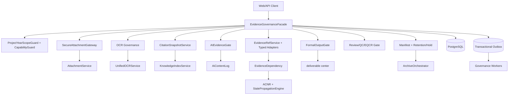
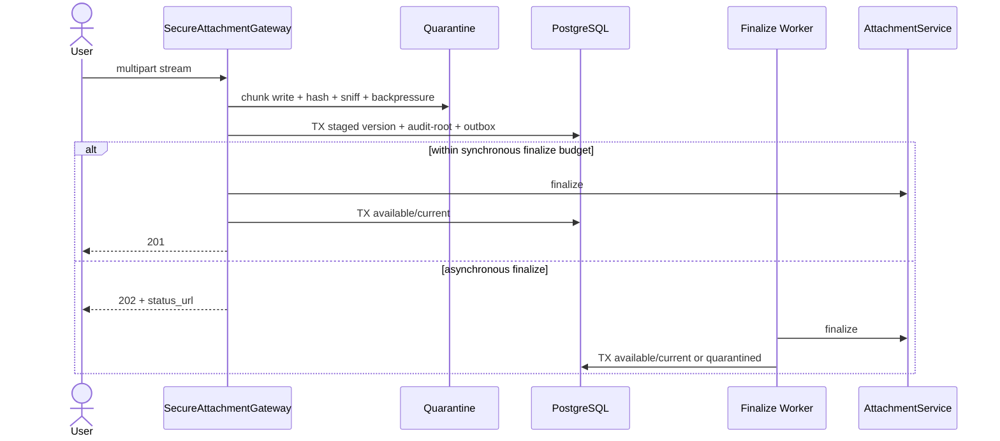

# Design Document
附件、OCR、AI 与证据链治理加固

## Overview

本设计以最新 `requirements.md` 为唯一需求基线，完整覆盖 R1–R16、P1–P30 与 UAT-01～15。采用“治理编排层 + 既有能力适配器”的 strangler 架构：新增持久证据模型、项目/年度边界、状态机、人工确认、依赖传播、正式输出门禁、归档清单与发布健康门；不复制附件存储、OCR、检索、AI 日志、stale、交付或归档引擎。

### 1.1 设计目标

1. 可引用证据绑定项目、年度、不可变版本、SHA-256、可定位上下文和责任主体。
2. 跨项目/跨年度请求在读取路径、对象名称或文件字节前失败，且不泄露目标信息。
3. OCR 形成持久 Job/Result/Confirmation/Writeback 闭环；所有 required 字段先作决定，只有 accepted/corrected 进入 mapping。
4. 所有 AI 入口统一登记；FormalOutput 只检查策略声明为必需的证据和对象已有依赖，历史对象没有附件不自动违规。
5. stale 集合由同项目同年度统一依赖图精确计算，图由活动 `EvidenceDependency` 与规范化 ACNR/legacy 边并集组成。
6. Archive Manifest 可离线复算、不可覆盖，并受 Retention 与 Legal Hold 保护。
7. 6000 并发下使用流式 I/O、队列背压、PG/PgBouncer 配额和有界异步处理，外部依赖失败时安全降级。

### 1.2 非目标与复用边界

本 spec 明确复用且不得重复造引擎：

- `AttachmentService`：Paperless/local 存储与既有附件契约；治理层只包装安全接收、版本和 locator。
- `UnifiedOCRService`：OCR 引擎选择、调用与降级；治理层只负责任务、结果、确认和写回编排。
- `KnowledgeIndexService`：语义/BM25/ILIKE 检索；治理层只补可定位元数据、权限交集与 CitationSnapshot。
- `AiContentLog`：AI 内容生命周期；治理层扩展证据、哈希、服务状态和统一门禁。
- ACNR 与 `StalePropagationEngine`：已有规范化地址、legacy 图和 stale 写入；治理层提供持久动态边并统一求闭包。
- deliverable center：交付件版本与固化；治理层只做 FormalOutput preflight/finalize gate。
- `ArchiveOrchestrator`：归档工作流、存储与断点；治理层只增加证据图快照、manifest 和离线验证。

不替换对象存储、OCR 引擎、向量检索、LLM provider、OnlyOffice；不改变底稿/附注/报表计算口径；不允许 AI 自动确认或签发；不实现跨项目、跨客户、跨年度证据复用。

## 2. 实施前置核验与冻结契约

### 2.1 角色契约（实施第一步）

实施的第一步不是建表，而是实测并对齐以下四处：后端 `SystemRole` 枚举、数据库角色 CHECK/enum、JWT role claim 解析、`ProjectAssignment` 项目角色映射。发现漂移必须先修正并以契约测试锁定，之后才允许迁移治理模型。

`SystemRole` 冻结为七值：`admin/partner/manager/auditor/qc/eqcr/readonly`。中文显示固定为：`auditor=审计助理`、`manager=现场负责人`、`partner=业务合伙人`、`qc=质量控制复核人`、`eqcr=EQCR技术复核人`；`admin=管理员`、`readonly=只读用户`。后端 capability 判定是唯一真源，前端只展示、隐藏和解释，不承担授权。任何候选人查询、项目分配、复核流转都必须把 `eqcr` 作为独立合法角色，禁止“EQCR 候选仅 admin/partner”之类限制。
### 2.2 Capability 基线

高风险能力最少包括 `attachment.create/replace/deactivate`、`evidence_ref.create/deactivate`、`ocr.start/retry/confirm/writeback`、`ai.generate/confirm`、`review.close`、`qc.complete`、`eqcr.complete`、`archive.seal`、`legal_hold.create/release`、`retention.purge`。系统角色与项目分配取交集；admin 也不能绕过 scope、actor、原因、人工确认、Legal Hold 或 FormalOutput 门禁。Service Identity 永远不能获得 human-confirm、review-close、hold-release、QC/EQCR-complete 或 signoff。

| 能力 | auditor | manager | partner | qc | eqcr | admin | readonly | Service Identity |
|---|---|---|---|---|---|---|---|---|
| 附件读/创建 | 分配范围读写 | 项目读写 | 项目读写 | 只读 | 只读 | 管理 | 只读 | 任务 scope 受限 |
| 附件替换/停用 | 非受保护替换 | 管理 | 管理 | 禁止 | 禁止 | 管理 | 禁止 | 禁止 |
| OCR 启动/重试 | 启动；重试默认禁 | 启动/重试 | 启动/重试 | 禁止 | 禁止 | 管理 | 禁止 | 启动/有界自动重试 |
| OCR 人工确认/写回 | 有目标编辑权时 | 有目标编辑权时 | 有目标编辑权时 | 禁止 | 禁止 | 有目标编辑权时 | 禁止 | 禁止 |
| Review 关闭 | 禁止 | 一级复核范围 | 合伙人范围 | QC 意见 | EQCR 意见 | 管理 | 禁止 | 禁止 |
| QC/EQCR 完成 | 禁止 | 禁止 | 查看/最终门禁 | 仅 QC | 仅 EQCR | 管理 | 禁止 | 禁止 |
| Hold 解除/归档批准 | 禁止 | 禁止 | 有能力时 | 禁止 | 禁止 | 有能力时 | 禁止 | 只能执行已批准任务 |

## Architecture



### 3.1 信任边界

1. 客户端提供的 `project_id/year/path/hash/status/role/target_id` 均不可信；归属从数据库对象关系重新解析。
2. scope/capability 校验先于目标名称、路径、`stat/open/read`；不存在与无权访问对外使用同一脱敏错误。
3. 数据库只存 opaque `storage_key`；本地读取只能经 `StorageBoundaryResolver`，Paperless ID 只能由 `AttachmentService` 使用服务凭据解析。
4. 外部 OCR、检索与 LLM 输出均为候选数据；只有确定版本、哈希、定位与人工确认完整后才可进入正式流程。
5. worker 使用最小 Service Identity，不能模拟人工动作。
6. 业务变化、command-root 审计和 outbox 同事务；外部 I/O 不占长数据库事务。

## Components and Interfaces

### 3.2 统一 Facade 与服务职责

`EvidenceGovernanceFacade` 是所有新写入和兼容旧路由的唯一入口，负责 ActorContext、scope、capability、幂等键、短事务、command-root 审计和 outbox。底层服务只 `flush`，router 不提交业务事务。

- `SecureAttachmentGateway`：流式接收、内容嗅探、哈希、staged/finalize、边界读取与版本替换。
- `EvidenceRefService`：锁定两端、同 scope/权限/版本/hash 校验、幂等引用、停用历史与动态依赖边。
- typed adapter：`resolve/can_read/can_edit/locate/lock_for_update`；不得用无 FK 的通用裸 insert 伪造对象。
- `OCRGovernanceOrchestrator`：持久 Job 后调度既有 OCR；不实现识别算法。
- `OCRConfirmationService`：仅人工用户 append decision revision。
- `OCRWritebackService`：按 adapter 类别执行本地事务写回或外部 staging。
- `CitationSnapshotService`：检索后二次权限、版本/hash/locator 校验与不可变快照。
- `AIEvidenceGate`：统一登记、确认、失效与入口覆盖。
- `EvidenceDependencyService`：把动态边与 ACNR/legacy 规范化边合并给闭包 worker。
- `FormalOutputGate`：底稿、附注、报告、签发、QC/EQCR、交付与归档共用规则。
- `ArchiveManifestService`/`RetentionLegalHoldService`：两阶段快照、离线校验、hold 闭包与墓碑。

## Data Models

所有 UUID 主键和 `timestamptz`；哈希为 64 位小写 SHA-256。所有含 actor 的治理表统一使用：

```sql
actor_type text NOT NULL CHECK (actor_type IN ('user','service')),
actor_user_id uuid NULL REFERENCES users(id) ON DELETE RESTRICT,
actor_service_identity_id uuid NULL REFERENCES service_identities(id) ON DELETE RESTRICT,
CHECK (
  (actor_type='user' AND actor_user_id IS NOT NULL AND actor_service_identity_id IS NULL)
  OR
  (actor_type='service' AND actor_user_id IS NULL AND actor_service_identity_id IS NOT NULL)
)
```

命名可按表加前缀，但物理语义不得改成单个多态 `actor_id`。人工确认、OCR 写回批准、复核关闭、Legal Hold 解除分别使用独立 `confirmed_by_user_id`、`written_by_user_id`、`closed_by_user_id`、`released_by_user_id`，均为 `NOT NULL REFERENCES users(id) ON DELETE RESTRICT`；这些字段不接受 Service Identity。legacy `created_by` 只作为兼容镜像，不是新写真源。历史创建者无法证明时使用 migration Service Identity，并设置 `original_creator_unknown=true`，不得冒充人工用户。

### 4.0 UploadAttempt、失败审计与隔离区

`UploadAttempt` 是每次上传命令在任何内容验证前创建的最小审计记录，字段至少包括 `id, project_id, audit_year, sanitized_file_name, declared_media_type, detected_media_type, received_byte_size, content_hash, validation_outcome, failure_category, actor_*, attempted_at, updated_at, command_root_id`。`detected_media_type/received_byte_size/content_hash` 在尚未可得时允许 NULL，流式处理算出后更新同一 attempt；`validation_outcome` 从 `pending` 收敛为 `accepted|rejected|quarantined|failed`。原始未清洗文件名、绝对路径、凭据和恶意文件正文不得进入该审计记录。

上传内容先进入不可公开读取的 quarantine/staging 句柄，不能通过附件下载、预览、EvidenceRef、OCR、AI、FormalOutput 或 archive 路径访问。无效、恶意或完整性失败内容不得创建 `available` Attachment/AttachmentVersion；拒绝后删除或加密擦除隔离内容，仅保留 UploadAttempt 最小元数据和 command-root/transition。隔离清理本身受审计与 Legal Hold 策略约束，但绝不能把恶意内容变为可访问文件。

### 4.1 Attachment 聚合与旧 ID 解析

`Attachment` 是逻辑聚合根，`AttachmentVersion` 是不可变内容快照。不能声称所有 legacy attachment ID 都等于新的 `Attachment.id`。迁移按可证明的 legacy 版本链/同名版本族选择一个新聚合根；每个旧行通过别名表解析：

```text
legacy_attachment_alias(
  old_attachment_id PK,
  attachment_id FK NOT NULL,
  attachment_version_id FK NOT NULL,
  project_id NOT NULL,
  audit_year NOT NULL,
  resolution_kind enum(root,current_version,historical_version),
  created_at NOT NULL
)
```

别名表含复合 scope FK，`ON DELETE RESTRICT`。所有旧下载、预览、关联、OCR 与响应兼容路径先调用 `LegacyAttachmentResolver`：优先 alias，只有明确创建为新聚合根的 ID 才按新 ID 解析；解析结果同时返回根与确定版本。API 不把 old ID 静默解释成“当前版本”。

### 4.2 Attachment

核心字段：`id, project_id, audit_year, original_file_name, source_type, obtained_at, provider, is_key_evidence, metadata_status, metadata_missing, state, current_version_id, actor_*, created_at, original_creator_unknown`。

- `UNIQUE(id,project_id,audit_year)` 作为父复合 scope key。
- `state=pending|available|inactive|tombstoned`；只有 `available` 且当前版本 available 才可新建正式引用。
- `current_version_id` 初建允许 NULL；完成 finalize 后设置。
- legacy `file_name/file_type/file_size/file_path/ocr_status/version/previous_version_id/created_by` 是只读兼容镜像。
- `file_path` 字段名可保留，但响应值只能是 opaque locator、脱敏 locator 或短时受控下载 URL，绝不返回绝对路径。

### 4.3 AttachmentVersion 与复合约束

核心字段：`id, attachment_id, project_id, audit_year, version_no, storage_type, storage_key, media_type, byte_size, content_hash, config_snapshot, availability, previous_version_id, actor_*, created_at, original_creator_unknown`。

约束与建表顺序：

1. `Attachment` 先建，`current_version_id` 暂不加 FK。
2. 建 `AttachmentVersion`，增加 `UNIQUE(id,attachment_id,project_id,audit_year)` 和 `UNIQUE(attachment_id,version_no)`。
3. 父 scope FK：`(attachment_id,project_id,audit_year) REFERENCES attachments(id,project_id,audit_year) ON DELETE RESTRICT`。
4. 前序复合 FK：`(previous_version_id,attachment_id,project_id,audit_year) REFERENCES attachment_versions(id,attachment_id,project_id,audit_year) DEFERRABLE INITIALLY DEFERRED ON DELETE RESTRICT`；NULL 时整组按约束允许。
5. 再给 `Attachment` 添加当前版本复合 FK：`(current_version_id,id,project_id,audit_year) REFERENCES attachment_versions(id,attachment_id,project_id,audit_year) DEFERRABLE INITIALLY DEFERRED ON DELETE RESTRICT`。
6. 增加 deferrable constraint trigger 或等价 PostgreSQL 约束，提交时验证 `current_version_id` 与 `previous_version_id` 必须属于同一聚合根和 scope、previous 不能自指、current 必须 available；循环 FK 通过上述分阶段添加解决。
7. 删除冗余 `UNIQUE(attachment_id,content_hash,version_no)`；`UNIQUE(attachment_id,version_no)` 已足够，内容哈希另建普通索引用于查重。
8. 新版本号在 `SELECT Attachment ... FOR UPDATE` 锁定父行后读取 current/max 并生成 `+1`，数据库 unique 是最终并发兜底。旧版本字节、key、hash、actor、时间、attachment_id、version_no 由 trigger 禁止 UPDATE。

### 4.4 EvidenceRef 与统一依赖图

`EvidenceRef` 保存 `project_id/audit_year/source_type/source_id/source_version/evidence_type/evidence_id/attachment_version_id/target_version/target_hash/label/context/intent_hash/status/actor_*`。活动引用用 partial unique `(project_id,audit_year,intent_hash) WHERE status='active'`；反向关系不复制，使用 source/evidence 两套索引查询同一行。

创建关联时由 `EvidenceRefService` 在该命令事务内按需执行四项校验：源 scope、目标 scope、调用者源端权限、调用者目标端权限；并同时校验目标存在/活动状态、版本和 hash。该校验是 create-time command guard，不建立持续轮询。创建后状态变化通过既有 outbox/stale 事件与读取时授权处理，而不是周期性重跑四项创建校验。

`EvidenceDependency` 保存 source→target（source 变化使 target stale）、scope、版本、ACNR addr_id、relation、edge_hash、status、EvidenceRef FK 和 actor。统一依赖图定义为：

```text
UnifiedGraph(scope) = ActiveEvidenceDependency(scope)
                    ∪ Normalize(ACNRActiveEdges(scope))
                    ∪ Normalize(LegacyActiveEdges(scope))
```

规范化必须产生稳定 node key、方向和 edge provenance；同一逻辑边按 canonical edge hash 去重。P20、影响查询、Legal Hold、Review 重开和 P23 manifest 全部使用同一 `UnifiedGraph` builder，不得由任何单表闭包替代。

### 4.5 OCR 模型

- `OCRJob`：绑定确定 `AttachmentVersion`、hash、canonical parse config、幂等键、状态、进度、attempt、lease、actor；状态仅允许 `queued→running→awaiting_confirmation→confirmed→written_back`、`queued/running→failed`、`failed→queued`。
- `OCRJobTransition`：每次迁移一条，关联 command-root；状态机迁移可有零到多条 transition 审计事件。
- `OCRResult`：不可变 raw text、pages、fields、confidence、page、region、engine/model/config version、result hash。
- `OCRConfirmation`：append-only；每个 required 字段最终必须有 current `accepted|corrected|rejected` 决定。`accepted/corrected` 必须有确认值；`rejected` 表示“已决定但不采纳”，满足 required decided，但永远不得进入字段 mapping。
- `OCRWriteback`：记录目标版本、mapping、confirmation IDs、幂等键、payload hash、结果和独立 `written_by_user_id NOT NULL`。

写回 adapter 必须声明 `write_mode`：

- `transactional-local`：目标与治理表在同一 PostgreSQL 事务中，锁定目标并全字段+Writeback+Dependency+audit/outbox 原子提交。
- `staged-external`：外部系统、跨库或无法共享事务的目标只能先写 `ocr_writeback_staging`；staging 自身原子持久化后，由目标模块以幂等键消费，在目标事务成功后回执并推进 `written_back`。禁止治理服务直接跨库“尽力写回”并声称原子。

### 4.6 Citation、AI、Review、Manifest、Hold 与审计

- `CitationSnapshot`：绑定 AiContentLog、EvidenceRef、版本/hash、page、region、excerpt hash、index/locator version；不可变且打开时重新鉴权。
- `AiContentLog` 扩展 prompt hash、model、service status、output hash、EvidenceRef/CitationSnapshot 与 stale；不复制现有生命周期。
- `ReviewEvidenceSnapshot` 冻结提出/关闭时的 ref/version/hash/locator；`ReviewClose` 使用 `closed_by_user_id NOT NULL`。
- `ArchiveManifest/Entry/Edge` 冻结 watermark、策略所需图、已有依赖图、版本/hash/state/actor；sealed 后不可变，后续归档递增版本。
- `LegalHold/LegalHoldScope` 固化直接与传递范围；解除使用 `released_by_user_id NOT NULL`、原因和时间，范围历史不删除。
- `EvidenceAuditCommandRoot` 对 `(command_type,idempotency_key,scope)` 唯一；`EvidenceAuditTransition` 多行 FK 到 root。一个命令及重放恰好一个 command-root，可有零到多条 transition，不把“每次状态迁移”误计为重复命令。
- outbox/inbox、migration checkpoint、quality snapshot 均使用同一 actor/scope 与保留约束。
## 5. Critical Flows and Transaction Boundaries

### 5.1 流式上传与异步 finalize

上传不是把 multipart 全量读入内存。API 先以权威 path scope、actor 与清洗文件名创建 `UploadAttempt(pending)` 和 command-root，然后以固定上限分块读取；边接收边更新已得字节数/hash/安全识别的实际 MIME，并执行大小限制、SHA-256、magic MIME、文件名规范化和背压。任何 validation 前都已有最小 attempt；下游缓冲/隔离区达到高水位时暂停读取或返回 429，不无限缓存。验证失败只把同一 attempt 更新为 rejected/quarantined/failed，不创建可用 Attachment/AttachmentVersion，并清除或加密擦除不可访问隔离内容。接收完成并通过初检后，短事务创建 `Attachment + AttachmentVersion(staged) + audit transition + outbox`。

- staged 已持久且 finalize 需要外部 I/O：返回 `202 Accepted`，包含 attachment/version/job/status URL；worker 调用 `AttachmentService` finalize。只有 finalize、恶意文件检查（启用时）和可读性验证成功后，才在短事务中把版本/current 标记为 `available`。
- finalize 能在当前预算内同步完成：可返回 `201 Created`；仍必须先持久 staged，再 finalize，再提交 available，不能跳过状态机。
- `staged/quarantined` 不能被 EvidenceRef、OCR、AI confirmation、FormalOutput 或 Archive 引用。
- enqueue SLO 只覆盖流式接收后的持久化与入队；对象存储/Paperless finalize 耗时单独计为 finalize task SLO，不把外部耗时伪装成 enqueue 延迟。



读取时先解析 old/new ID 为确定根和版本，再做 scope/capability，最后由 `StorageBoundaryResolver` 解析 opaque key。边界、scope 或权限失败时 `open/stat/read` 调用次数必须为 0；即使这些条件通过，存储不可用、版本/hash 完整性失败、对象 `quarantined`、malware/readability gate 失败或其他安全/可用性前置条件不满足时仍须拒绝读取并返回脱敏错误。替换先锁父 Attachment，检查 hold/impact/expected current，再生成版本号并新增版本，旧版本不覆盖。

### 5.2 OCR 决策与写回

1. 先持久化/复用 OCRJob，再 enqueue；worker 调用 `UnifiedOCRService`。
2. 结果不可变；人工用户对每个 required 字段作 accepted/corrected/rejected 决定。job 可在“全部 required 已决定”后进入 confirmed，即使其中存在 rejected。
3. mapping 只由 current accepted/corrected confirmation 构造；任何 rejected 或 undecided 字段若出现在拟写回 mapping，整体拒绝。
4. `transactional-local` 在一个 PG 事务中全成全败；`staged-external` 先 staging，目标模块消费成功后才形成 written_back。
5. target/attachment 版本变化、权限不足、confirmation 非 current 或幂等 payload 冲突均保持目标零变化。

### 5.3 RAG/AI 与 FormalOutputGate

检索继续调用 `KnowledgeIndexService`，治理层取“检索候选 ∩ 用户可读 ∩ 同 scope ∩ active ref ∩ 版本/hash/locator 有效”，随后冻结 CitationSnapshot。所有生成/改写/摘要/补全入口先经统一 `register_generation`，落 `AiContentLog` 后才可返回 draft。

FormalOutput 的证据集合不是“所有历史对象必须有附件”，而是：

```text
RequiredEvidence(target, policy_version)
  = PolicyDeclaredRequiredEvidence(target, policy_version)
  ∪ ExistingDependencies(target, UnifiedGraph)
```

Gate 仅验证该集合中的 metadata、actor、版本/hash、active ref、OCR confirmation/writeback、AI 人工确认、citation locator、stale/pending propagation、Blocking Review 与 hold/retention 一致性。历史对象没有附件且策略未要求、对象也没有附件依赖时，不产生 `MISSING_ATTACHMENT`；但任何已有或被引用证据都必须满足全部 P0 完整性。底稿结论、附注、报告、签发、QC/EQCR、deliverable 固化和 archive 在 preflight 与 finalize 两次检查，watermark 变化则失败重试。

### 5.4 stale、Review 与统一图

变化源（附件版本、OCR 确认、知识版本、EvidenceRef 停用、citation/hash、confirmed AI 内容）写 outbox。worker 构造同 scope `UnifiedGraph`，用稳定排序和 visited 计算完整闭包；超过同步阈值转游标化异步任务，不按深度截断。pending/dead-letter 时 scope 标记 `governance_degraded`，FormalOutput fail-closed。

stale 清除必须重新验证全部活动入边；恢复一个 source 不清除其他 source 导致的 stale。关闭后的 Review 依据失效时转 `re_review_required`，阻断相应 QC/EQCR/partner 完成。QC/EQCR API/UI 显示原版本、hash、人工确认、stale path 和 locator，不只展示摘录。

### 5.5 Archive、Retention 与 Legal Hold

归档短事务冻结 `UnifiedGraph + policy-required evidence` 的 watermark，异步调用 deliverable center 与 `ArchiveOrchestrator` 构建，finalize 前重跑 FormalOutputGate 并比较 watermark。Manifest 精确包含该图的 nodes/edges；历史无附件不扩大图。只有验证失败并实际阻断归档时才生成 `blocking_difference_report`，报告包含完整、可机器读取的阻断差异；校验通过并成功归档时不生成阻断差异报告。每次归档新增版本，sealed 包、manifest、entries、edges 不可改。离线 verifier 不连接业务库，重算成员、manifest 与 package hash。

Legal Hold 激活时固化统一图闭包并监听新增边；hold 内物理删除、清理、覆盖三类操作具有同等严格的零效果语义，任何角色、admin、Service Identity 或紧急授权都无绕过通道，附件内容替换只能新增版本且不能覆盖受保护历史。解除必须由独立人工 FK 记录原因；只有 hold 已解除且 retention 已到期，具备 `retention.purge` 的主体才可授权清理。清理还须确认无活动悬空 EvidenceRef 并保留不可变墓碑。

## 6. API and Compatibility Contracts

### 6.1 通用约定

- 新 API 根：`/api/projects/{project_id}/years/{year}/evidence`；path scope 与对象权威 scope 必须一致。
- 写命令需要 `Idempotency-Key`；版本敏感命令需要 `If-Match/expected_version`。
- 异步操作返回 202、job ID、status URL；同步完成创建可返回 201；幂等复用返回 200。
- cursor 分页默认 `limit<=100`、硬上限 200；大图和归档不提供无界列表。
- 错误含稳定 `error_code/message/trace_id/retryable`；权限/存在性错误不含目标名称、客户、项目、路径。
- legacy `file_path` 响应只允许 opaque locator/受控下载 URL；storage key、绝对路径、token 不出服务边界。

### 6.2 主要端点

| Domain | Endpoints | 关键契约 |
|---|---|---|
| Attachment | POST/GET `/attachments`，GET/POST `/attachments/{id}/versions`，GET content/impact | staged 后 202；available 才可引用；旧 ID 经 alias 解析 |
| EvidenceRef | POST `/references`，GET 双向 references/impact，POST deactivate | 同 scope/权限/版本/hash；活动 intent 幂等 |
| OCR | POST/GET jobs，retry，results，PUT confirmations，POST writebacks | 先持久后调度；required decided；mapping accepted/corrected only |
| RAG/AI | POST rag/query，GET citation locate，AI confirm/revise/reject，formal preflight | 所有入口登记；定位时重鉴权；降级不进正式终态 |
| Review | bind evidence，close | 冻结快照；关闭者独立 user FK；失效自动重开 |
| Archive/Hold | preflight/jobs/manifests/verify，legal-holds/scope/release，purge-jobs | 两阶段 watermark；新包不覆盖；hold 单调保护 |

### 6.3 legacy 调用方盘点与兼容

切换前生成并评审调用方清单：attachments router 的 upload/create/download/preview/associate/retry/status，所有直接读取 `Attachment.file_path` 的 service/worker/导出器，前端依赖 `file_path` 的 viewer/download，AttachmentWorkingPaper 裸写入，OCR 局部入口，以及任何按旧 attachment ID 查询的报表/归档。清单记录 owner、调用路径、读写类型、目标 adapter、迁移阶段、验证证据和到期日；CI 阻止新增未登记调用。

兼容期旧 URI/字段名保留，但内部必须委托 facade：旧 ID 通过 `legacy_attachment_alias`；`file_path` 值改 opaque locator/受控 URL；旧 `created_by`/OCR status/current version 仅镜像。禁止因为字段名兼容而继续暴露绝对路径或允许客户端直写终态。

## 7. Audit, Events and Failure Semantics

### 7.1 Command-root 唯一与 transition 多条

每个敏感命令用 `(scope,command_type,idempotency_key)` upsert 一个 `EvidenceAuditCommandRoot`，命令成功、拒绝或重放都不得多建 root。状态机步骤、worker attempt、告警和业务状态变化写零到多条 `EvidenceAuditTransition(root_id,transition_type,from_state,to_state,actor_*,at,metadata_redacted)`。重放可返回已有结果并关联原 root；P25 统计 root 唯一，不要求整个生命周期只有一条事件。

日志仅含 ID、scope、版本、hash、动作、结果、原因码和 trace；不含凭据、绝对路径、附件/OCR 原文、完整 prompt/answer。outbox/inbox 按 event ID 幂等，失败有 jitter 的有界退避和 dead-letter。

## Error Handling

### 7.2 稳定失败类别

| HTTP | error_code | 数据效果 |
|---:|---|---|
| 403/404 | `SCOPE_NOT_FOUND_OR_FORBIDDEN` | 不泄露存在性，目标零变化 |
| 409 | `VERSION_CONFLICT` / `INVALID_STATE_TRANSITION` | 不覆盖，不新增非法 transition |
| 409 | `EVIDENCE_GATE_BLOCKED` | 返回策略化阻断列表 |
| 413/415 | `ATTACHMENT_TOO_LARGE` / `MEDIA_TYPE_MISMATCH` | 无 available 版本 |
| 422 | `METADATA_INCOMPLETE` / `REQUIRED_FIELD_UNDECIDED` / `INVALID_MAPPING` | 保留草稿，目标零变化 |
| 423 | `LEGAL_HOLD_ACTIVE` | destructive delta=0，记录安全事件 |
| 429 | `CAPACITY_BACKPRESSURE` | 不丢已持久意图，不绕过门禁 |
| 502/503 | `DEPENDENCY_DEGRADED` | 不产生 confirmed/written_back/archived |

## 8. Migration, Deployment and Rollback

### 8.1 MigrationRunner 编号与建表策略

实施时必须先调用项目现有 `migration_status` 能力并扫描 `backend/migrations/V*.sql` 的当前最高号，再在执行时分配“下一可用 V”；设计不固定 V103 或任何静态号。若状态源与目录扫描不一致，停止实施并人工解决，不猜号、不覆盖迁移。

迁移均 additive：先角色契约核验，再建 ServiceIdentity/actor 基础表，随后 Attachment/Version（按循环 FK 分阶段）、alias、EvidenceRef/dependency、OCR、citation/AI 扩展、audit/outbox、manifest/hold/quality。所有 FK 默认 `ON DELETE RESTRICT`；immutable/append-only、复合 scope、partial unique、deferrable trigger 必须在真实 PG 验证。

### 8.2 M0–M4

- **M0 additive/dark-read**：新表、约束、alias 和兼容列；不切写。
- **M1 backfill**：按 project/year/id 小批 checkpoint；只回填可证明字段。legacy 版本链不可证明则标 `legacy_unverified_chain`；unknown creator 使用 migration identity + `original_creator_unknown`。
- **M2 dual-write**：旧入口委托 facade，同时写新真源与兼容镜像；P0 规则首日 hard-block，其他 gate 可先观测。
- **M3 source-of-truth cutover**：新表唯一写真源，worker/AI coverage/manifest/hold/stale gate 启用。
- **M4 retirement**：无旧写遥测后停止非必要 mirror 更新；删除 legacy 列不在本 spec。

`legacy_attachment_alias` 使用稳定 old ID upsert；批次键包含 migration version/project/partition/input hash。重跑不增加根、版本、引用、Job 或 Writeback，不修改历史字节与业务内容。

### 8.3 高风险部署 Health Gate

切 flag 或启 worker 前必须同时满足：所有相关迁移成功、schema/ORM/约束契约通过、无 pending/failed migration、所需锁/约束已生效、alias/backfill 差异在阈值内、备份已验证可恢复、outbox/queue/PG/PgBouncer 配额已就绪。任一相关迁移失败，或迁移因锁不可得而进入“无锁降级/跳过约束”，均不得切 feature flag、不得启治理 worker、不得把新表设为写真源。

备份失败时禁止自动执行高风险数据库回滚。自动响应只能停止新写、关闭 flag、drain worker、保留现场并告警；由人工确认恢复策略。部署健康事件关联 migration command-root 和 trace。

### 8.4 Rollback

回滚以 feature flag、dual-write/read adapter 切换、停止 enqueue、worker drain、暂停 backfill 为主。已经产生的 AttachmentVersion、EvidenceRef、OCR 决策、依赖、审计、Manifest、Hold 等治理对象一律保留，不因应用回滚删除或覆盖。若旧应用无法理解新状态，只能只读或继续经兼容 facade 写，避免双主。DDL 前滚修复优先；不自动删表/降 enum/删除约束。
## 9. Performance, Capacity and Observability

### 9.1 6000 并发容量模型与 SLO

容量环境运行 6000 并发虚拟用户，30 分钟稳态 + 10 分钟突发，流量模型为 70% 元数据读、20% 写/关联、7% OCR/AI enqueue、3% 影响/归档控制。错误率 <1%、跨项目 canary 泄露=0、重复副作用=0。

| 操作 | P95 | 口径 |
|---|---:|---|
| 单附件/版本/引用元数据读 | <=200ms | 不读文件字节 |
| cursor 列表 | <=300ms | 默认 limit<=100 |
| <=100 节点直接影响 | <=500ms | 超阈值异步 |
| 引用/治理元数据写 | <=500ms | 含 audit+outbox，不含外部 I/O |
| staged 持久+enqueue | <=300ms | 接收完成后计时，返回 202 |
| 同步 finalize 创建 | <=1s | 只有预算内完成才 201 |
| finalize 外部任务 | P95<=30s | 与 enqueue SLO 分开统计 |
| FormalOutput preflight <=500依赖 | <=750ms | 读 materialized summary/watermark |
| stale 入队 | <=200ms | 闭包 95%<=5s，超大图<=60s |
| archive request | <=500ms | 构建异步 |

### 9.2 队列背压与 PG/PgBouncer 配额

- upload finalize、OCR、AI、stale、archive 使用独立队列/worker pool；按项目 weighted fair queue，限制单项目 in-flight、全局 backlog 和单 actor enqueue rate。
- 达到 soft limit 时延迟/降并发，hard limit 返回 429；已持久 job 不丢失。队列指标包括 depth、oldest age、claim latency、retry/dead-letter。
- API 元数据池、长游标/归档池、worker 写池分离。PgBouncer 使用 transaction pooling；每类服务配置连接预算，所有预算总和加运维保留必须低于 PG `max_connections`，并保留至少 20% 给管理/恢复。
- worker 并发由“PG 写连接预算、外部 provider 配额、队列年龄”三者最小值动态限制；禁止每个 6000 用户各占一个 DB 连接。
- 所有热查询以 `(project_id,audit_year,...)` 索引开头，使用 keyset cursor；大图批量 upsert/游标，不使用大 offset 或每请求全图遍历。
- 流式上传/下载/manifest 不把大正文放进 DB、outbox、SSE；缓存 key 必含 scope、actor permission version 和对象版本。

### 9.3 可观测性

低基数指标覆盖 upload/boundary/ref/OCR queue+failure/AI coverage/citation/stale age+closure/review reopen/formal gate/archive hash/hold/outbox lag/PG pool wait/backpressure。API→outbox→worker→外部引擎贯穿 trace；告警关联 command-root/audit transition。AI coverage gap、manifest hash failure、跨 scope denied 异常峰值立即告警。

## Testing Strategy

### 10.1 Hypothesis profile 铁律

常规 PR/CI 统一使用 `backend/tests/conftest.py` 注册并加载全局 `fast` profile：默认 `max_examples=5`、`deadline=None`，并按仓库约定抑制 `too_slow/data_too_large/function_scoped_fixture` 健康检查。属性测试不得在测试装饰器中固定大样本数覆盖全局配置；需要局部 deadline/health-check 时也不得覆盖样本数。

nightly/release 通过 `HYPOTHESIS_PROFILE` 选择更高 profile，或通过 `HYPOTHESIS_MAX_EXAMPLES` 提高样本数；同一测试代码不分叉。失败必须保留 Hypothesis 原始 counterexample。

纯函数/模型属性可使用内存 reference model；但 PostgreSQL enum/check/partial unique/复合 FK/deferrable constraint trigger/immutable trigger、`FOR UPDATE`、并发 version/ref 去重、事务 rollback、SKIP LOCKED 等必须运行真实 PostgreSQL integration。禁止以 SQLite PBT 代替 PG 约束、并发或 trigger 验证；SQLite 仅可用于与数据库无关的纯算法测试，且不得作为发布门中的 PG 证据。

### 10.2 测试分层与 Playwright 边界

1. **PBT**：P1–P30 的纯谓词、状态机、哈希、统一图、幂等、迁移和确定性；使用全局 fast profile。
2. **PG integration**：所有数据库物理约束、并发、trigger、事务、worker claim、staging-external 回执。
3. **Adapter contract**：真实接口形状验证 `AttachmentService/UnifiedOCRService/KnowledgeIndexService/AiContentLog/ACNR/StalePropagationEngine/deliverable center/ArchiveOrchestrator`，证明未复制引擎。
4. **API/component**：错误码、脱敏、角色/capability、locator、GateEvaluation 和兼容响应。
5. **Playwright**：只验证用户可见、浏览器可达的 UAT 流程与网络契约，例如上传状态、引用定位、人工确认、复核重开、归档差异；不承担 DB trigger/并发/PBT/6000 VU 的证明。需要数据库断言时由测试专用只读 API/fixture 采证，不在浏览器中直连数据库。
6. **capacity/chaos**：独立工具执行 6000 VU、队列/PG 配额与 storage/OCR/retrieval/AI 故障；Playwright 不模拟 6000 并发。
7. **offline verifier**：独立进程只读 archive package 重算 hash。

UAT-15 专门验证 R15 和 P29：6000 并发、背压和外部依赖中断下零泄露、错误率与无 forbidden terminal state。P30 不属于 UAT-15；它以预先固定、不可变的治理数据快照在历史增强启用前独立验收，重复执行必须得到相同指标、账龄桶和问题清单。

## Correctness Properties

### Property 1: 项目隔离

任意跨项目或跨年度读取、引用、关联均失败且不泄露目标元数据；完整 P1–P30 不变量与验证层见下表。

**Validates: Requirements 1.3, 3.2, 4.1, 4.2, 9.4**

### P1–P30 同步表

以下与最新 requirements 完全同步，属性测试名称和注释使用 `Feature: attachment-ocr-ai-evidence-governance-hardening, Property N`。

| P | 设计不变量 | 验证层 |
|---|---|---|
| P1 | 任意跨项目/跨年度读取、引用、关联均失败且不泄露目标元数据 | PBT + API/PG |
| P2 | 只有规范化真实路径仍在 Storage Boundary 内才调用字节读取器 | PBT + OS边界集成 |
| P3 | 每个成功新记录恰有 user/service actor XOR；迁移未知创建者有专用 identity+unknown 标记 | PBT + PG CHECK |
| P4 | 替换序列中新版本号严格递增，旧字节/hash/actor/time 不变 | PBT + PG trigger/并发 |
| P5 | SHA-256 绑定字节；内容变化不能用旧 hash 通过 ref/citation/manifest | PBT |
| P6 | 仅 scope、目标、版本、hash、活动状态、权限全部一致时可创建 ref；失败无 ref/edge | PBT + PG事务 |
| P7 | 相同 intent 顺序/并发重放只保留一个活动 ref 和一条活动 dependency | PBT + 真实PG并发 |
| P8 | source/evidence 双向查询返回同一 ref ID、版本和状态 | PBT + API |
| P9 | OCR 只走定义迁移；非法事件不改变状态或历史 | 状态机PBT + PG |
| P10 | 只有项目访问+`ocr.retry`可重试；幂等重放至多一次排队效果 | PBT + API |
| P11 | 确认/修正/拒绝/写回不改变 OCR 原值、来源版本/hash/page/region | PBT + immutable trigger |
| P12 | 任一 required 未决定，或拟 mapping 含非 accepted/corrected（含 rejected），目标变化量为0；rejected 永不进 mapping | PBT + PG事务 |
| P13 | 写回只能全部成功或全部保持旧值；外部目标以 staging+回执实现业务原子边界 | 故障注入 + PG |
| P14 | 相同写回幂等键重放只产生一次业务效果和一个成功记录 | PBT + PG unique |
| P15 | confirmed citation 的 page/region/version/hash/ref/excerpt hash 均有效可复算 | PBT + locate集成 |
| P16 | 返回引用集合始终是 actor 可访问来源集合的子集 | PBT + API |
| P17 | 只有人工确认/hash一致，且“策略必需证据 ∪ 已有依赖”有效时可进入 FormalOutput；历史无附件本身不违规 | 真值PBT + gate集成 |
| P18 | AI discovered entrypoints − declared gated entrypoints 恒为空 | scanner PBT/契约 |
| P19 | confirmed 内容或任一已有依据变化后进入 draft/stale，原确认不再授权输出 | PBT + 集成 |
| P20 | stale 集精确等于变化源在同 scope `Active EvidenceDependency ∪ normalized ACNR/legacy edges` 统一图中的可达下游闭包 | 图PBT + worker集成 |
| P21 | Blocking Review 仅在权限、充分说明、至少一个有效非 stale ref 同时满足时关闭 | 真值PBT + API |
| P22 | 已关闭意见依据失效后为 `re_review_required`，QC/EQCR/partner gate 拒绝 | PBT + 集成 |
| P23 | manifest nodes/edges 精确等于归档范围内“策略必需证据及已有依赖”形成的可达统一证据图；历史无附件不扩大图 | 图PBT + archive集成 |
| P24 | 每次归档新增版本，历史包、manifest、hash、冻结关系不变 | PBT + offline verifier |
| P25 | 每个敏感命令及幂等键恰一个脱敏 command-root，可有零到多条关联 transition；执行/重放均不重复 root | PBT + PG unique/审计集成 |
| P26 | active hold 闭包内删除、清理、覆盖对任何授权级别均为零效果且无紧急绕过；替换只能新增版本 | 图PBT + PG/API |
| P27 | 仅 hold 已解除、retention 到期、有授权且无悬空 active ref 时可清理 | 真值PBT + 集成 |
| P28 | 迁移中断/重跑不增加逻辑对象，不改变历史字节和业务内容 | crash-point PBT + PG |
| P29 | storage/OCR/retrieval/AI 失败、超时、stub、不可验证时不产生 confirmed/written_back/archived | 故障PBT + chaos/UAT-15 |
| P30 | 固定不可变快照重复计算得到相同指标、账龄桶、问题清单且不改业务结论 | 独立固定快照PBT |

## 12. UAT-01～15 Design Matrix

| UAT | 设计路径 | 验收证据 |
|---|---|---|
| UAT-01 | 每次上传先建最小UploadAttempt；再流式处理 valid/oversize/MIME mismatch/missing actor | 每次尝试有outcome；仅合法 staged→available；非法无可用Attachment/Version且隔离内容不可访问 |
| UAT-02 | traversal/absolute/symlink/reparse 越界读取 | storage-open spy=0；脱敏错误和安全 command-root |
| UAT-03 | 项目A附件关联项目B底稿 | ref/edge不变；不暴露B信息；cross-scope指标 |
| UAT-04 | 替换被底稿/附注/报告引用附件 | vN+1、旧快照不变、统一图影响路径与stale |
| UAT-05 | 创建ref后服务重启 | ref ID/version/hash及双向视图不变 |
| UAT-06 | OCR running时刷新/重启 | 同一Job、attempt、transition、lease恢复且不重复消费 |
| UAT-07 | OCR corrected/rejected/冲突写回 | required均decided；rejected不映射；成功全写/失败全回滚 |
| UAT-08 | 七角色+ServiceIdentity轮换重试 | capability真源；授权重排一次；越权零效果 |
| UAT-09 | 打开citation并替换来源 | 精确版本/page/region；旧citation invalid/stale |
| UAT-10 | 底稿/附注/报告/复核AI入口 | 均登记；未人工确认全部FormalOutput拒绝 |
| UAT-11 | 关闭Blocking Review后替换依据 | 自动重开；QC/EQCR页面显示版本/hash/确认/path/locator |
| UAT-12 | 缺hash/stale/未确认AI/OCR/Review归档 | 仅验证失败阻断时生成完整blocking difference report；修复后新包离线hash/签名通过且不生成阻断报告 |
| UAT-13 | active hold后以普通/admin/紧急授权删、清、覆盖 | 三类destructive delta均为0且无绕过；仅解除hold且retention届满后授权purge |
| UAT-14 | 重复/中断回填和旧ID访问 | alias稳定、对象基数稳定、unknown不伪造、file_path不泄露路径 |
| UAT-15 | 6000 VU + OCR/retrieval/AI outage | 对应R15/P29：P95、<1%、零泄露、背压、无禁用终态 |

## 13. Requirements Traceability

| Requirement | 主要设计 | Properties | UAT |
|---|---|---|---|
| R1 | UploadAttempt先审计、流式上传、quarantine、StorageBoundary、scope-first、actor XOR与读取安全/可用性拒绝链 | P1,P2,P3,P5,P25 | 01,02 |
| R2 | Attachment聚合、复合FK、不可变Version、影响/hold | P4,P5,P20,P26 | 04,13 |
| R3 | 持久EvidenceRef、intent unique、typed adapters | P6,P7 | 05 |
| R4 | 创建关联时按需执行双端scope/capability、双向索引、统一图过滤；不持续轮询 | P1,P6,P8,P20 | 03,05 |
| R5 | 持久OCRJob、封闭状态机、重试capability | P3,P9,P10 | 06,08 |
| R6 | immutable Result、required decided、mapping规则、typed writeback | P11,P12,P13,P14 | 07 |
| R7 | 可定位chunk、CitationSnapshot、重鉴权 | P15,P16 | 09 |
| R8 | AiContentLog统一包装、入口registry、策略化FormalOutput | P17,P18,P19,P29 | 10,15 |
| R9 | UnifiedGraph、outbox闭包、条件清除、scope隔离 | P19,P20 | 04,09,11 |
| R10 | Review快照、独立人工关闭FK、自动重开 | P21,P22 | 11 |
| R11 | 策略证据+已有依赖manifest、两阶段watermark、失败阻断差异报告、成功无阻断报告、离线验签 | P5,P23,P24 | 12 |
| R12 | command-root唯一、transition多条、脱敏指标告警 | P25,P30 | 02,03,08,15 |
| R13 | Hold统一图闭包、删除/清理/覆盖同等零效果且无紧急绕过、人工解除、解除后且retention到期才可purge | P26,P27 | 13 |
| R14 | alias、caller inventory、opaque file_path、动态迁移/checkpoint | P3,P28 | 14 |
| R15 | 6000 VU、流式/背压、PG配额、安全降级 | P1,P2,P10,P20,P29 | 15 |
| R16 | 可证明历史增强、固定质量快照与问题清单 | P28,P30 | 14；P30独立门 |

## 14. Release Gates

P0/P1 发布要求：R1–R15 对应验收通过、P1–P29 全绿、UAT-01～15 全绿、真实 PG 约束/并发/trigger 契约通过、AI coverage gap=0、跨项目泄露=0、offline manifest 校验通过、6000 VU 错误率<1%。UAT-15 只承接 R15/P29。R16 的历史增强可后置，但启用前必须以固定不可变快照独立通过 P30；不得把 P30 绑到 UAT-15 或用在线变化数据代替固定快照。

发布还必须通过第8.3节 health gate。任何相关 migration 失败、无锁降级、备份不可恢复、PG/PgBouncer 配额超预算、队列未配置背压、worker drain 不可用，均阻止切 flag/启 worker。

## 15. Risks and Decisions

| 风险 | 决策 |
|---|---|
| legacy一行兼任附件与版本 | alias + additive聚合根，不假设old_id=new root_id |
| 循环FK/跨根current/previous | 分阶段建FK + 复合scope key + deferrable constraint trigger |
| 版本并发 | 父行FOR UPDATE生成version_no + PG unique兜底 |
| file_path兼容泄露 | 保留字段名但只返回opaque locator/受控URL，并盘点所有调用方 |
| 外部写回无法共享事务 | typed adapter明确transactional-local/staged-external，不做伪XA |
| 历史无附件被误阻断 | FormalOutput/Manifest只看策略必需证据和已有依赖 |
| stale图来源分裂 | UnifiedGraph单一builder合并活动Dependency与规范化ACNR/legacy边 |
| 审计“恰一事件”误解 | command-root恰一，transition允许多条且全部关联root |
| PBT拖慢PR | conftest fast默认5；nightly/release仅由环境/profile提高 |
| SQLite假证明PG能力 | 约束/并发/trigger必须真实PG integration |
| 迁移号漂移 | 实施时migration_status+扫描最高号动态取下一可用V，不固定V103 |
| 高风险回滚扩大损失 | flag/dual-write/drain优先；备份失败禁止自动DB回滚；不删治理对象 |
| 6000并发连接耗尽 | 队列背压、连接预算、PgBouncer transaction pooling、worker动态限流 |
| Playwright假代容量/约束 | Playwright仅用户边界；PG与容量由专用测试证明 |
| 重复实现既有能力 | adapter contract守卫复用八项现有服务/引擎 |

## 16. Implementation Boundary Summary

新增范围仅为治理 facade、持久模型与约束、legacy alias、typed adapters、状态机、人工门禁、统一依赖图输入、outbox、manifest、健康门和验证体系。实现不得复制或分叉 `AttachmentService`、`UnifiedOCRService`、`KnowledgeIndexService`、`AiContentLog`、ACNR/`StalePropagationEngine`、deliverable center 或 `ArchiveOrchestrator`。前端所有角色与能力仅用于展示，后端 capability 和数据库约束共同构成最终真源。