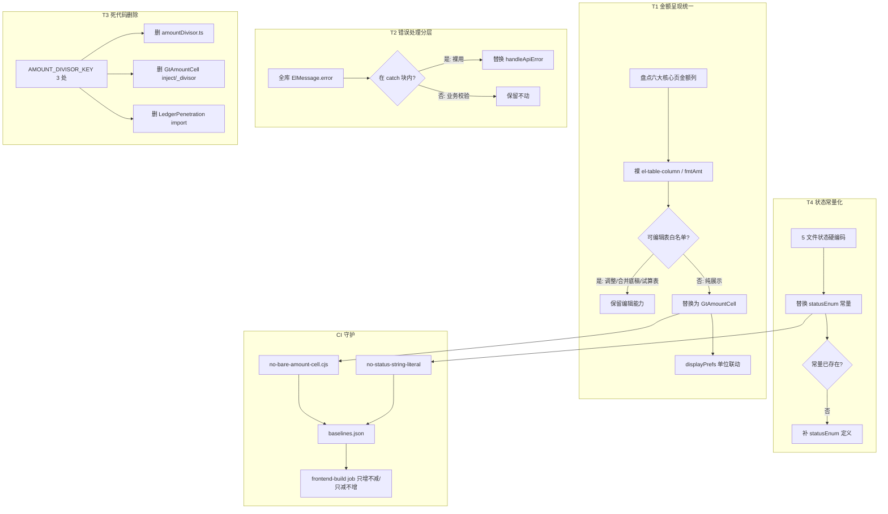

# Design Document: frontend-consistency-m1

## Overview

本设计覆盖 v4 路线图 **M1「一致性收口」** 的 4 项前端治理（T1～T4），目标是消除"同一金额在不同页面长得不一样""失败提示风格分裂""历史除法死代码""状态字符串硬编码"四类一致性短板。

设计原则：
- **复用优先，不造新轮子**：GtAmountCell / handleApiError / statusEnum / no-bare-amount-cell.cjs ESLint 规则 / baselines.json 全部已存在，本 spec 只做"接入 + 替换 + 删除 + 卡点更新"，不新增组件或工具。
- **行为等价，零功能回归**：T1 替换金额渲染、T3 删 no-op 死代码、T4 替换状态常量，三者都必须保持运行时行为完全不变，仅统一呈现/清理代码。
- **可验收 + CI 守护**：每项治理有 grep/CI 基线/vue-tsc/vitest 量化验收，并把基线写进 baselines.json 防退化。
- **仅前端**：改动范围 `audit-platform/frontend/src/`，不碰后端/DB/router。

### 关键澄清（设计前置事实，已实测）

1. **`gt-amount-cell-rollout` 不是真实 spec**：全仓 fileSearch 0 命中，它只在 `baselines.json` 注释和 memory 里作为"推荐待启动 / 口径来源"被引用，从未建三件套。**故 T1 无撞车风险**，本 spec 直接吸收"列数口径 17%→80%"作为长期目标。
2. **T1 范围务实折中**：M1 定位 ~5 人天，全平台 GtAmountCell 80% 是 2-3 周工作量。本 spec T1 **聚焦六大核心数据页**（四表/报表/底稿/调整/错报/附注），把全平台 80% 作为延伸目标记录在 baselines.json 的 target 字段，不强求一次到位。验收以"六大核心页接入 + 裸用降 80%"为准。
3. **AMOUNT_DIVISOR_KEY 全仓仅 3 处引用**（已 grep 确认）：`constants/amountDivisor.ts` 定义 + `GtAmountCell.vue` inject/no-op + `LedgerPenetration.vue` 死 import（仅 import 未 provide），整文件可安全删除。

## Architecture



## Components and Interfaces

### T1 — GtAmountCell 全量化

**已有组件接口（不改，仅调用）**：
```ts
// src/components/common/GtAmountCell.vue
defineProps<{
  value: number | string | null | undefined  // 金额值
  clickable?: boolean                          // 可点击穿透
  comment?: CellComment | null                 // 批注（null 时直接渲染）
  priorValue?: number | string | null          // 上期值（变动高亮）
}>()
defineEmits<{ click: [value: number | string | null | undefined] }>()
// 内部 Decimal.js 计算 + 跟随 useDisplayPrefsStore（单位/小数位/负数红/零值/阈值）
```

**替换模式**（el-table-column scoped slot）：
```html
<!-- 替换前：裸金额列 -->
<el-table-column prop="balance" label="期末余额" align="right">
  <template #default="{ row }">{{ fmtAmt(row.balance) }}</template>
</el-table-column>

<!-- 替换后：GtAmountCell -->
<el-table-column prop="balance" label="期末余额" align="right">
  <template #default="{ row }">
    <GtAmountCell :value="row.balance" />
  </template>
</el-table-column>

<!-- 可穿透场景 -->
<GtAmountCell :value="row.balance" clickable @click="onPenetrate(row)" />
```

**可编辑表白名单**（保留 GtEditableTable / el-input 编辑，不替换为只读 GtAmountCell）：
| 视图 | 表 | 理由 |
|------|-----|------|
| Adjustments | 调整分录借贷金额 | 用户需录入 |
| 合并工作底稿（InternalTradeSheet/InternalCashFlowSheet） | 抵销分录 | 用户需录入 |
| TrialBalance | 试算表审定数调整列 | 用户需录入 |

**六大核心页盘点清单**（T1 实际改动目标）：
| 类别 | 视图文件 | 处理 |
|------|---------|------|
| 四表 | BalanceSheet / IncomeStatement / CashFlowStatement / EquityStatement（或 ReportView 内 tab） | 纯展示列 → GtAmountCell |
| 报表 | ReportView | 已部分接入，补齐剩余裸列 |
| 底稿 | WorkpaperList / WorkpaperWorkbench / WorkpaperSummary | 本地 fmtAmt → GtAmountCell |
| 调整 | Adjustments | 展示列接入，录入列保留 |
| 错报 | Misstatements | 已部分接入，补齐 |
| 附注 | DisclosureEditor | 展示金额 → GtAmountCell |

> 实际清单以**立项当天 grep `no-bare-amount-cell` 报告**为准（Requirement 1 守门），上表为 v4.2 快照预估。

### T2 — ElMessage.error 分层 + 替换

**已有工具（不改，仅调用）**：
```ts
// src/utils/errorHandler.ts
handleApiError(e: any, context: string): void
// 分级：无status→网络/401静默/403无权/404不存在/409冲突/423归档只读/422业务校验(含AI/冲突error_code)/5xx系统(带traceId)
```

**分层判定规则**（区分两类 ElMessage.error）：
```
第一类（catch 裸用，要改）：
  - 词法位置在 try { ... } catch (e/err/error) { ... } 的 catch 块内
  - 且参数是固定文案（'保存失败' / 'xxx失败'），未解析 e.response.data.detail
  → 替换为 handleApiError(e, '操作名')

第二类（业务校验，保留）：
  - 不在 catch 块内（同步校验路径）
  - 文件大小超限 / 表单必填未填 / 登录凭证错误 / 业务前置条件不满足
  → 保持不变
```

**分层方法**（三选一，设计推荐组合）：
1. **ESLint 临时审计规则 / 脚本**：写一次性 node 脚本，用 `@typescript-eslint/parser` AST 判断 `ElMessage.error` 调用是否在 `CatchClause` 祖先链内，输出两类清单 + 文件:行号。
2. **人工 review 兜底**：脚本难判定的（如 catch 内的业务提示、或 `.catch(() => ElMessage.error)` promise 链）人工归类，记录理由。
3. **替换执行**：第一类逐处改 `handleApiError(e, '中文操作名')`，操作名取自上下文（按钮/函数名）。

**CI 基线**：分层后 catch 块内裸用治理到 0，baselines.json 新增字段 `elmessage-error-in-catch`（目标 0，只减不增）。

### T3 — 删除 AMOUNT_DIVISOR_KEY 死代码

**三处改动（精确）**：
```ts
// 1. 删除整个文件 src/constants/amountDivisor.ts（仅 6 行，唯一导出 AMOUNT_DIVISOR_KEY）

// 2. GtAmountCell.vue 删除以下片段：
//    - import { AMOUNT_DIVISOR_KEY } from '@/constants/amountDivisor'
//    - import { inject } 若 inject 不再被其他逻辑使用则一并清理
//    - const injectedDivisor = inject(AMOUNT_DIVISOR_KEY, 1) as ...
//    - // eslint-disable-next-line @typescript-eslint/no-unused-vars
//    - const _divisor = computed(() => typeof injectedDivisor === 'function' ? ...)
//    （注意：computed import 若仍被 formattedDisplay/cssClass 使用则保留）

// 3. LedgerPenetration.vue 删除：
//    - import { AMOUNT_DIVISOR_KEY } from '@/constants/amountDivisor'（死 import，无 provide）
```

**回归保证**：`_divisor` 是 no-op（从未参与 `formattedDisplay` 计算），删除后金额显示行为 100% 不变。删除后 grep `AMOUNT_DIVISOR_KEY` = 0。

### T4 — 状态硬编码 → statusEnum

**已有常量源（`src/constants/statusEnum.ts`）**，T4 五文件对应映射：
| 文件 | 可能的硬编码 | statusEnum 常量 |
|------|------------|----------------|
| QcInspectionWorkbench | `=== 'pass'/'fail'/'pending'/'not_applicable'` | `QC_INSPECTION_VERDICT.*` |
| ArchiveWizard | `=== 'final'/'interim'` / archive job 状态 | `ARCHIVE_SCOPE.*` / `ARCHIVE_JOB_STATUS.*` |
| AuditReportEditor | `=== 'draft'/'review'/'final'/'eqcr_approved'` | `REPORT_STATUS.*` |
| IssueTicketList | `=== 'open'/'closed'/'rejected'/'in_progress'` | `ISSUE_STATUS.*` |
| PDFExportPanel | `=== 'pending'/'processing'/'success'/'failed'` | `PDF_TASK_STATUS.*` |

**注意（element-plus 类型陷阱，memory 铁律）**：statusEnum.ts 的 `StatusDictEntry.color` 含 `''` 空字符串，但 el-tag v2 `type=''` 已废弃。若 T4 触碰到 el-tag type 绑定，需顺带改 `''` → `'primary'`（vue-tsc 才报，getDiagnostics 不报）。

**缺常量兜底**：若某状态值 statusEnum.ts 无对应常量（如 ArchiveWizard 某特殊状态），先在 statusEnum.ts 补常量定义再引用（Requirement 7.5）。

## Data Models

本 spec 不涉及数据模型变更（纯前端 UI 一致性治理，不改 DB/schema/接口契约）。

涉及的前端状态结构（已存在，不改）：
- `displayPrefs` store：`{ amountUnit, decimals, negativeRed, showZero, highlightThreshold }`
- `statusEnum` 常量集：见 Components 章节 T4 表
- `baselines.json`：CI 卡点真源，本 spec 更新其中金额/错误/状态相关字段

## Correctness Properties

> 本 spec 是 UI 一致性治理，正确性核心是"行为等价 + 单调收敛"。PBT 用 fast-check，`max_examples=15`（项目约定）。

### Property 1: GtAmountCell 替换金额等价性

*对任意* 合法金额值 v（number/string/null/负数/0/大数），替换前的 `fmtAmt(v)` 输出与替换后 `GtAmountCell` 在**相同 displayPrefs 设置**下的渲染输出，应表示同一数值（单位换算 + 小数位 + 千分位规则一致，允许格式呈现差异但数值相等）。

**Validates: Requirement 2.7（不改数值精度）**

### Property 2: 金额单位切换单调联动

*对任意* displayPrefs.amountUnit ∈ {yuan, wan, qian} 的切换序列，所有已接入 GtAmountCell 的金额显示值应同步按对应 divisor 换算，不存在"切换后某页面不变"的情况。

**Validates: Requirement 2.5**

### Property 3: handleApiError 替换错误处理等价或更优

*对任意* 后端错误响应（含/不含 detail，各 HTTP status），替换后 handleApiError 的提示**不弱于**替换前裸 ElMessage.error：有 detail 时显示 detail（更优），无 detail 时至少显示带 context 的中文提示（等价）。

**Validates: Requirement 5.6**

### Property 4: 死代码删除行为不变性

*对任意* 金额值 v，删除 AMOUNT_DIVISOR_KEY 相关 inject/_divisor 后，GtAmountCell 的 `formattedDisplay` 与 `cssClass` 输出与删除前完全一致（因 _divisor 是 no-op，从未参与计算）。

**Validates: Requirement 6.5**

### Property 5: 状态常量替换逻辑等价

*对任意* 状态值 s，`s === 'draft'`（硬编码）与 `s === WP_STATUS.DRAFT`（常量）的布尔结果应恒等（因常量值 === 字面量值）。

**Validates: Requirement 7.4**

### Property 6: CI 基线单调性

*对任意* PR，`GtAmountCell-uses` / 接入文件数只增不减；`no-bare-amount-cell-tables` / `elmessage-error-in-catch` / 状态硬编码数只减不增。任一方向违反则 CI 失败。

**Validates: Requirement 3.3, 3.4, 5.4**

## Error Handling

| 场景 | 处理 |
|------|------|
| T1 替换后某列数据是非数值（如文本备注误判为金额列） | GtAmountCell `safeDecimal` 返回 null → 显示 '-'，不抛异常；盘点时人工排除非金额列 |
| T1 可编辑表误判为纯展示 | 白名单守门（调整/合并底稿/试算表），盘点时对照白名单 |
| T2 catch 块内实为业务提示（如 catch 后做业务判断再提示） | 人工 review 归入第二类，记录理由，不机械替换 |
| T2 `.catch(() => ElMessage.error)` promise 链形式 | AST 脚本可能漏判，人工补充清单 |
| T3 删除后 computed import 变成未使用 | 检查 computed 是否仍被 formattedDisplay/cssClass 使用，仍用则保留 import |
| T4 状态值无对应常量 | 先补 statusEnum.ts 常量定义再引用，不跳过 |
| T4 触碰 el-tag type='' | 顺带改 'primary'（element-plus v2 铁律） |
| 任何改动引入 vue-tsc error / vitest 失败 | 视为未完成，必须修复至 0 errors / 0 failed |

## Testing Strategy

### 测试框架
- 单元/组件测试：**vitest**（前端既有）
- 属性测试：**fast-check**，`max_examples=15`（或 `numRuns: 15`）
- 类型卡点：**vue-tsc** 0 errors
- 静态卡点：**ESLint** no-bare-amount-cell.cjs + no-status-string-literal + CI baselines.json

### 单元测试
1. **GtAmountCell 替换回归**：对改动的核心页组件，断言金额列渲染走 GtAmountCell（snapshot 或 wrapper.findComponent）。
2. **handleApiError 调用**：对改动的 catch 块，mock api 抛错，断言调用 handleApiError 而非裸 ElMessage.error。
3. **statusEnum 替换**：断言改动文件 import 了 statusEnum 常量，且状态判断行为不变。

### 属性测试（映射 Correctness Properties）
| Property | 测试策略 | fast-check 生成器 |
|----------|---------|------------------|
| P1 金额等价 | 生成随机金额，对比 fmtAmt vs GtAmountCell 数值 | `fc.oneof(fc.integer, fc.float, fc.constant(null), 负数, 0)` |
| P2 单位联动 | 生成单位切换序列，断言换算 | `fc.array(fc.constantFrom('yuan','wan','qian'))` |
| P3 错误处理 | 生成各 status + detail 组合 | `fc.record({ status, detail })` |
| P4 死代码不变 | 生成金额，对比删除前后 formattedDisplay | `fc.oneof(金额生成器)` |
| P5 状态等价 | 生成状态字符串，断言 === 结果恒等 | `fc.constantFrom(各状态值)` |

### CI 卡点（baselines.json 更新）
- 立项当天重测填入真实基线（Requirement 1）
- frontend-build job 守护：`GtAmountCell-uses` 只增、`no-bare-amount-cell-tables` 只减、`elmessage-error-in-catch` 只减、状态硬编码只减
- 本地可复现命令（PowerShell `Select-String -List | Measure-Object`）与 CI 读同一份 baselines.json

### 验收门槛
- vue-tsc 0 errors + vitest 0 failed（硬门槛，任一不过即未完成）
- grep AMOUNT_DIVISOR_KEY = 0
- 5 文件状态硬编码 = 0
- 六大核心页金额列裸用降 ≥ 80%
