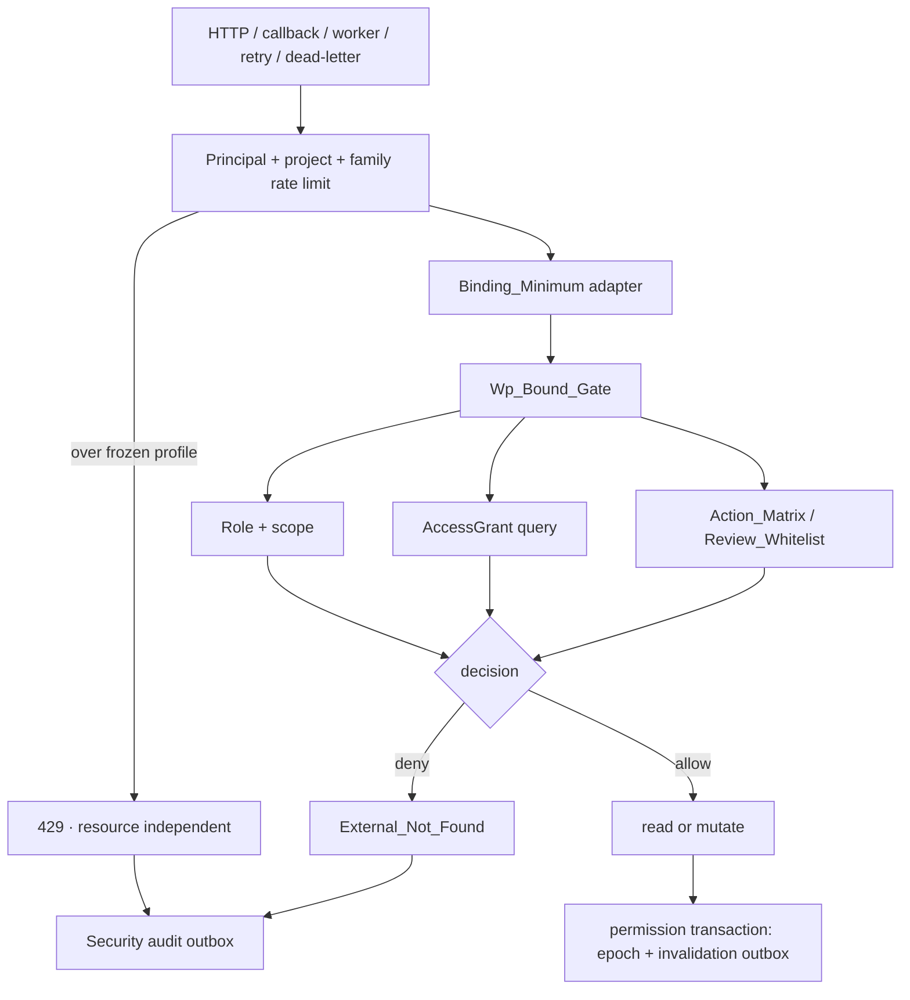

# Design Document

## Overview

本设计建立服务端强制、fail-closed 的底稿与页面可见性边界。任何能定位到底稿、页面、版本、附件、编辑器文件、复核对象或 AI 上下文的 HTTP route、callback、worker、retry 或 dead-letter，均须在读取业务内容或产生副作用前进入统一 `resolve_wp_binding_and_access()` / `Wp_Bound_Gate`，再由唯一 `Action_Matrix` 判定动作。

```text
Restricted_Visible_Set = (Delegated_Set ∪ History_Set) ∩ scope_cycles
Visibility_Unit        = wp_index_id
Page_Visibility_Set    = 各 AccessGrant 独立完整命中 Action_Matrix 后的 sheet_key 并集
External_Not_Found     = HTTP 404 + {"detail":"资源不存在或不可访问"}
```

两层委派分层但联动：`working_paper.assigned_to` 保存 Workpaper_Lead 的 `users.id`；`procedure_instances.assigned_to` 保存同一自然人的 `staff_members.id`，仅为主编 Staff_Projection；`procedure_row_tasks.assignee_staff_id/reviewer_staff_id` 分别为程序执行人和操作复核人真源，不产生额外投影。禁止直接复制或比较 user/staff UUID，只能使用目标项目内唯一 active staff↔user 映射判同人。两层互不覆盖、无 last-write-wins，共同贡献可见性。

隔离层只消费既有委派真源，不重建 ProcedureRowTask 状态机，不合并 My_Lead_Workpapers 与 My_Procedure_Tasks，不修改 `scope_cycles` 数据模型或 `require_project_access` 语义。当前迁移 head 为 V112；实施前必须重扫并使用当时下一空闲版本，不能静态占用 V113。

### Verified constraints

- ORM 表名为 `working_paper`（单数），`wp_code` 位于 `wp_index`。
- `WorkingPaper.assigned_to → users.id`；`ProcedureInstance.assigned_to` 与 ProcedureRowTask 人员字段保存 staff id。
- `ProcedureRowTaskHistory` 的 old/new staff 不是稳定身份快照；人员重绑后不得通过当前 StaffMember、当前 task 或当前 sheet 反推历史权限。
- 当前 render-config、附件、AI、OnlyOffice/WOPI 等入口存在项目级或仅认证授权缺口，必须由 Coverage Ledger 全量盘点，不能以本文枚举代替扫描。
- `visibility_mode`、前端隐藏、客户端角色与深链参数均不构成安全边界。

## Architecture



执行顺序固定为：认证 → 资源无关限流 → Binding_Minimum → 角色/scope/grants/current version → path/body/claims 绑定 → 每个 grant 独立完整匹配矩阵 → allow 后读正文或产生副作用。429 只能在资源解析前依据 principal、project 与 Entry_Family 产生；进入资源判定后，所有不可见原因统一 404。

## Data Models

### Existing authorities

| Table | Authority |
|---|---|
| `working_paper` | Current_Version、file_status、Workpaper_Lead user 真源 |
| `wp_index` | `wp_index_id`、project、audit_cycle、index_status |
| `procedure_instances` | Workpaper_Lead staff projection，非第二真源 |
| `procedure_row_tasks` | 当前 assignee/reviewer、task、wp_index、wp、sheet_key |
| `procedure_row_task_history` | 行任务工作流历史，不作为稳定身份历史真源 |
| `staff_members` | 唯一 active staff↔user 映射依据 |
| `project_assignments` | 项目角色权威 |
| `project_users` | 项目 user 成员与 `scope_cycles` 权威 |

Admin 显式产生 `admin` grant；Supervisor 必须同时具有唯一 active StaffMember、唯一 active ProjectAssignment（角色为 partner/signing_partner/manager/qc/eqcr）与唯一 active ProjectUser，并对 scope 内资源显式产生 `supervisor_scope` grant。任一链路缺失、重复或查询失败均归 Restricted；admin 是唯一忽略 scope 的类别。

### New persistent records

**`workpaper_delegation_history`** 是 History_Set 唯一来源，append-only 快照 `request_id/project/wp_index/wp/layer/target_role/task/sheet_key/old+new user/old+new staff/actor/reason/scope_before/scope_after/created_at`。Lead、assignee、reviewer 的事件时 user、staff、wp、task、sheet 与 scope 均被固定；历史查询禁止 JOIN 当前 StaffMember、当前 ProcedureRowTask 或当前 sheet 反推参与人及页面。

**`wp_access_security_outbox`** 只记录 request/actor、可空 binding、entrypoint/family/action、内部 reason、delivery state/attempt；reason 包括 `not_found/cross_project/out_of_scope/not_delegated/sheet_unmapped/action_denied/historical_version/binding_conflict/token_invalid/rate_limited`。正文、名称、文件字节、prompt、token 不得入表。写入或投递失败只触发 Operational_Alert，不改变 404/429。

**`wp_visibility_policy_epoch` + `wp_visibility_invalidation_outbox`** 为每项目持久单调 epoch。权限、委派、history、scope、角色或项目成员变更必须在同一业务事务中递增 epoch 并写 outbox；Redis 仅在提交后 fan-out。节点最多缓存 epoch 1 秒，Redis/dispatcher 失败时同步核对 DB 或拒绝，禁止 stale allow。

所有 history/outbox 采用 append-only 约束或触发器。实施时先重扫迁移 head；索引只能在 PostgreSQL `EXPLAIN (ANALYZE, BUFFERS)` 证明必要后 additive 增加。

### AccessGrant query

查询层以单次 `UNION ALL` 产生 `admin/supervisor_scope/lead/assignee/reviewer/lead_history/row_history`，每个 grant 恰有一个已登记 `access_kind` 并保留其 `sheet_key` 或 `all` 页面范围。同一资源允许多个独立 grants；每个 grant 必须独立完整命中 Action_Matrix，之后才能并集页面和动作，禁止跨身份拼接维度。所有 Non_Admin grants 与 `wp_index.audit_cycle ∈ scope_cycles` 相交；空集合不回退到循环级。History row 仅读不可变快照 sheet，History lead 可读整稿当前页面，两者均只读 Current_Version。

## Components and Interfaces

| ID | Component | Responsibility |
|---|---|---|
| C1 | Persistence | 不可变历史、安全审计 outbox、policy epoch/invalidation outbox |
| C2 | Contracts | ResourceRef、WpBoundRequest、AccessGrant、WpAccessContext、统一 404 |
| C3 | Role/Mapping | 唯一角色分类与严格 staff↔user 映射 |
| C4 | ProcedureWpResolver | 标准/自定义 procedure 多来源唯一解析 |
| C5 | VisibilityQuery | 带 access_kind 的底稿、页面和历史 grants |
| C6 | ActionMatrix | 完整 route/method/action/state 矩阵与 Review_Whitelist |
| C7 | SecurityAudit | 最小拒绝事实、可靠投递与告警 |
| C8 | WpBoundGate | 绑定、scope、页面、版本、claims 与动作判定 |
| C9 | BindingAdapters | wp/task/item/attachment/review/version/AI/bulk/job 最小绑定 |
| C10 | EntryIntegration | HTTP 与非 HTTP 全入口接入 |
| C11 | EditorSecurity | OnlyOffice/WOPI claims、文件权限与 callback 重校验 |
| C12 | DelegationTransaction | 两层委派、history、scope、epoch 原子事务 |
| C13 | List/Views | 正式分页、状态拆分与两个独立“我的”视图 |
| C14 | CoverageGuard | HTTP/worker/callback ledger 与漂移守卫 |
| C15 | Cache/Rate/Perf | epoch 校验、两阶段限流、6000 并发与观测 |
| C16 | Frontend | 角色化 UX、两层控件、拒绝占位 |
| C17 | Verification | 同源 smoke/correctness PBT 与集成验收 |
| C18 | Evidence | schema、manifest、hash、fresh-context 与完成门禁 |

### Core contracts and gate

```python
@dataclass(frozen=True)
class AccessGrant:
    access_kind: str
    identity: str
    allowed_sheet_keys: frozenset[str] | Literal["all"]
    readonly: bool

@dataclass(frozen=True)
class WpBoundRequest:
    entry_kind: Literal["http", "callback", "worker", "retry", "dead_letter"]
    entrypoint: str
    route_name: str | None
    method: str | None
    action: str
    resource_ref: ResourceRef
    requested_sheet_key: str | None = None
    requested_version: str | None = None
    source_state: str = "none"
    target_state: str = "none"
    token_claims: Mapping[str, str] | None = None

async def resolve_wp_binding_and_access(
    db: AsyncSession,
    current_user: User,
    request: WpBoundRequest,
) -> WpAccessContext: ...
```

`VisibilityRoleClassifier` 仅输出 Admin/Supervisor/Restricted。`StaffUserMappingService` 对写事务严格要求目标项目唯一 active 双向映射；宽松 normalize helper 不得替代写校验。`ProcedureWpResolver` 联合 project、procedure、wp_code、既有 wp_index/wp 与 sheet 来源解析唯一一致 wp_index；sheet_name 只能在已确定的 project+wp_index+version 内转 sheet_key，零/多候选或来源冲突 fail-closed。

Action Matrix 键为 `(user_class, access_kind, identity, entrypoint, route, method, action, source_state, target_state)`；任一维度未登记即拒绝。Reviewer Whitelist 只含 `submitted→reviewed`、`submitted→changes_requested`（reason 必填）以及同 task/sheet 的复核会话读取与评论；通用 status、checklist、parsed_data、附件关联、version restore、editor write 均不在白名单。

| access_kind | Page scope | Read | Mutation |
|---|---|---|---|
| admin | project all | matrix | matrix |
| supervisor_scope | scope 内 all | existing permission + matrix | existing permission + matrix |
| lead | assigned wp all | Current_Version | registered content actions |
| assignee | assigned sheet | Current_Version | mapped-sheet actions + assignee transitions |
| reviewer | reviewed sheet | Current_Version | Review_Whitelist only |
| lead_history | current all pages | Current_Version | denied |
| row_history | snapshot sheet | Current_Version | denied |

Binding adapters 只读取作出判定所需最小关系：wp_id→wp_index→project；task→wp_index/wp/sheet；item→服务端 sheet catalog；attachment→project+links→wp；review child→related object→wp/task；version→wp；AI→URL wp+服务端 refs；bulk manifest entry→wp/sheet；callback/job→持久 binding+actor/token。row-only 入口无法唯一映射 sheet 时拒绝，不能退化为整稿授权。批量写在任何副作用前逐资源 preflight，显式任一拒绝则按原子模式整体失败。

### Delegation transactions

Lead 路径严格 staff→user 映射并唯一解析 wp_index，锁定相关行后同事务写 `working_paper.assigned_to=user_id`、`procedure_instances.assigned_to=staff_id` 投影、统一 delegation history、可选 scope expansion、policy epoch 与 invalidation outbox。Row 路径只写明确目标 ProcedureRowTask、既有 task history、统一 delegation history、epoch 与 outbox，不写 projection。清空一个角色保留另一 row role、lead 和 projection；跨循环默认拒绝，仅 delegator 显式 `expand_scope=true` 且 reason 非空时同事务扩权；撤销委派不自动缩 scope。任一步失败全部回滚。

### Lists, editor, coverage and frontend

列表 SQL 顺序固定：参数校验 → classification/scope/grants → 业务过滤 → wp_index 去重 → 分页前 total/stats → NULLS LAST + wp_index_id ASC → 分页 → hydrate；禁止全量到 Python/前端过滤。响应仅 `{items,total,stats,page,page_size}`，拆分 `index_status/file_status`。MyProcedureTasks 仅 row roles；MyLeadWorkpapers 独立返回 lead 底稿。

OnlyOffice/WOPI token 必含非空 `sub,project_id,wp_id,sheet_name,wp_code,version,action,iat,exp,jti`；secret 缺失、disabled bypass、签名/过期/claim 不一致均 fail-closed。config/file read 前 gate；callback/PutFile 落盘前重新校验 Current_Version、actor、action、Page_Visibility_Set 与 persistent epoch。`UserCanWrite = gate allow ∩ file state ∩ lock`。

Coverage Ledger 登记 `kind`、稳定 entrypoint/callable、route/path/method、family/action、binding adapter、gate、matrix 与 stable test ids。HTTP AST/router registry 和 callback/worker/retry/dead-letter registry 双轨扫描并与 ledger 双向相等；动态、未登记、stale、重复、缺 gate/matrix/test 的入口均阻断 CI。静态 ledger 只存稳定 test id，Evidence Manifest 绑定本次 CI run 与 artifact。

前端只消费服务端可见项与 allow actions；404 显示“资源不存在或不可访问”且不闪现名称/正文。两个“我的”视图分区；nullable wp 显示“底稿尚未生成”并禁用文件动作；ProcedureTrimming 分别展示底稿层主编与程序行执行/操作复核；深链只定位不授权。

## Correctness Properties

Smoke 与 Correctness 收集同一属性函数；Smoke `max_examples=5` 且不能作为完成证据，Correctness 每条至少 100 个有效样例。SQL 集合、事务、索引和令牌属性必须在 PostgreSQL 与真实 FastAPI app 验证。

### Property 1: Role classification is unique and fail-closed

分类结果唯一；未知、重复、inactive、查询异常均 Restricted，Non_Admin 永不超出 scope。

**Validates: Requirements 1.1, 1.2, 1.3, 1.4, 1.5, 1.6, 1.7, 1.8, 1.9, 1.10, 1.11**

### Property 2: Staff and user identity require a unique active mapping

user/staff 只通过目标项目唯一 active 双向映射判同人，字段值直接相等不得放行。

**Validates: Requirements 2.4, 2.5, 2.6, 3.1, 3.2, 3.3, 3.4, 3.5, 3.6**

### Property 3: Delegation layers never overwrite each other

Row role 不产生 projection；任一层变更或定向清空保留另一层及非目标 row role。

**Validates: Requirements 2.1, 2.2, 2.3, 2.7, 2.11, 2.12, 2.13, 2.14, 2.15, 3.7, 3.9, 3.10, 3.11, 3.12, 3.15**

### Property 4: Procedure binding is unique or rejected without mutation

标准/自定义 procedure 的所有来源必须各自唯一且一致；零、多候选或冲突时不改数据。

**Validates: Requirements 4.1, 4.2, 4.3, 4.4, 4.5, 4.6, 4.7, 4.8, 4.9, 4.10, 4.11, 4.12, 4.13, 4.14**

### Property 5: Restricted visibility equals the fixed set formula

Restricted 可见集精确等于 `(Delegated∪History)∩scope`，按 wp_index 去重，空集不回退循环级。

**Validates: Requirements 5.1, 5.2, 5.3, 5.4**

### Property 6: Delegation history remains stable after rebinding

History_Set 只读事件时不可变 user/staff/wp/task/sheet/scope 快照，不受当前 StaffMember、task 或 sheet 重绑影响。

**Validates: Requirements 3.13, 3.14, 5.2, 5.18**

### Property 7: Page visibility follows role and immutable history

lead/admin/supervisor_scope、row current、lead history 与 row history 的页面范围分别遵循 all/current sheet/snapshot sheet 规则，History_Only 只读 Current_Version。

**Validates: Requirements 5.5, 5.6, 5.7, 5.8, 5.9, 5.10, 5.11, 5.12, 5.13, 5.14, 5.17, 5.18**

### Property 8: Every grant has one known kind and cannot splice matrix dimensions

每个 grant 只有一个已登记 access_kind；未知 kind 丢弃；多个 grants 只能并集各自完整命中的页面和动作。

**Validates: Requirements 5.15, 5.16, 7.1, 7.2, 7.3, 7.4, 7.6, 7.7, 7.8, 7.9, 7.10**

### Property 9: Reviewer actions are limited to the whitelist

Operation_Reviewer 必须同时命中完整 Action_Matrix 与 Review_Whitelist，不能编辑通用底稿内容。

**Validates: Requirements 7.5**

### Property 10: Binding and claim conflicts fail closed

project/wp/sheet/version/path/body/token claims 任一冲突均在正文读取或副作用前拒绝。

**Validates: Requirements 8.1, 8.2, 8.3, 8.4, 10.1, 10.2, 10.3, 10.4, 10.5, 10.6, 10.7, 10.8, 10.9**

### Property 11: Rate limiting and resource denial do not reveal existence

资源无关 429 仅在解析前产生；进入 gate 后，不存在、跨项目、越权、未映射页及历史版本的最终 wire 404 完全相同。

**Validates: Requirements 9.1, 9.2, 9.3, 9.4, 9.5, 9.6, 9.7, 14.18, 14.19**

### Property 12: Audit failure never changes the external contract

安全审计 outbox 写入或投递失败不改变 404/429，且产生 Operational_Alert。

**Validates: Requirements 9.8, 9.9, 9.10, 9.11**

### Property 13: Editor tokens remain bound through callback execution

OnlyOffice/WOPI token 完整、签名、过期、URL/resource/action 绑定正确；callback 执行时重新校验版本、动作和撤权状态。

**Validates: Requirements 10.1, 10.2, 10.3, 10.4, 10.5, 10.6, 10.7, 10.8, 10.9, 10.10, 10.11**

### Property 14: Filtering, deduplication, statistics, sorting and paging are ordered

列表严格按 filter→dedupe→total/stats→stable sort→page 执行，两个“我的”视图遵循各自身份边界。

**Validates: Requirements 11.1, 11.2, 11.3, 11.4, 11.5, 11.6, 11.7, 11.8, 11.9, 11.10, 11.11, 11.12, 11.13**

### Property 15: Display parameters and client identity never authorize

`visibility_mode`、客户端角色/身份、前端隐藏和深链参数均不改变服务端授权；状态与 nullable wp UX 契约稳定。

**Validates: Requirements 12.1, 12.2, 12.3, 12.4, 12.5, 12.6, 12.7, 12.8, 12.9, 12.10**

### Property 16: HTTP and non-HTTP entry inventories equal the coverage ledger

生产 HTTP route+method 与 callback/worker/retry/dead-letter callable 均与 ledger 双向相等，并具 gate、matrix 和绑定当前 CI run 的稳定测试证据。

**Validates: Requirements 13.1, 13.2, 13.3, 13.4, 13.5, 13.6, 13.7, 13.8, 13.9, 13.10, 13.11, 13.12, 13.13, 13.14, 13.15**

### Property 17: Permission changes and persistent invalidation commit atomically

权限、委派、history、scope、角色和项目成员变化与 policy epoch/invalidation outbox 在同一数据库事务提交或整体回滚。

**Validates: Requirements 3.14, 3.15, 14.13, 14.20**

### Property 18: Revocation converges within one second without stale allow

撤权后最多 1 秒拒绝；Redis 或 outbox dispatcher 失败时持久 epoch 仍触发重查或拒绝，绝不 stale-allow。

**Validates: Requirements 14.14, 14.15, 14.21**

### Property 19: Rate profiles require measured capacity evidence

Rate_Limit_Profile 必须由 6000 并发容量报告与哈希生成并冻结；无证据不能激活，阈内不误限、超阈返回有效 Retry-After。

**Validates: Requirements 14.1, 14.2, 14.3, 14.4, 14.5, 14.6, 14.7, 14.8, 14.9, 14.10, 14.11, 14.12, 14.16, 14.17, 14.18**

### Property 20: Evidence is append-only, current and complete

Evidence 的相对路径、追加 run、SHA-256、size、schema、current CI 绑定和全部必做叶子任务覆盖完整；smoke 或旧 run 不能冒充完成证据。

**Validates: Requirements 15.1, 15.2, 15.3, 15.4, 15.5, 15.6, 15.7, 15.8, 15.9, 15.10, 15.11, 15.12, 16.1, 16.2, 16.3, 16.4**

## Error Handling

- **401**：仅未认证。
- **422**：在任何底稿数据查询前发现非法分页/排序，或在资源存在性判定前完成的写 DTO 格式校验失败；不得暴露资源存在性。
- **429**：认证后、资源解析前，仅依据 principal+project+Entry_Family，带有效 `Retry-After` 且不含资源信息。
- **404**：进入 wp-bound gate 后的不存在、跨项目、无 scope、未委派、sheet 未映射、action denied、历史版本、binding/token 冲突，最终 wire body 仅 `{"detail":"资源不存在或不可访问"}`。
- SecurityAudit 写入/投递失败保持原 429/404 并发送 Operational_Alert。
- 委派或权限事务中字段、历史、scope、epoch 或 invalidation outbox 任一失败均整体回滚。
- 普通日志只记 request id、entrypoint 与 reason；删除 `_render_config_500.log`，禁止正文、名称、token、文件字节和完整 traceback 临时文件。

## Testing Strategy

### Unit and property tests

角色、映射、resolver、grants、matrix、gate、history snapshot、epoch、profile 与 evidence 运行 P1–P20。Smoke 和 Correctness 共用属性定义；数据库语义不以 SQLite/mock 替代 PostgreSQL，每条属性输出有效样例数。

### Integration and coverage

真实 FastAPI app + PostgreSQL 覆盖全部 Entry_Family。直接比较不存在、跨项目、越权、未映射页与历史版本最终 wire 404；验证附件目标替换、bulk preflight、callback 创建后撤权、outbox 故障、permission commit 后 publish 前崩溃恢复。运行 EXPLAIN/query-count 证明无 N+1，索引只在实证后创建。HTTP AST/router registry 与 worker/callback/retry/dead-letter registry 分别对账 ledger。

### Load, frontend and evidence

先 measurement baseline，再以 6000 已认证用户结果生成并冻结 Rate_Limit_Profile，随后用冻结 profile 重跑成功、拒绝、撤权、callback、bulk、429 与阈内场景。目标为 list p95≤2s、single gate p95≤1s、成功错误率≤1%、错误允许数=0。

Playwright 为 Admin、Supervisor、Workpaper_Lead、Row_Assignee、Operation_Reviewer、History Lead/Row 及普通无委派 Restricted 分别创建新 browser context 并 fresh navigation，覆盖列表、tab、URL、写入、复核、附件、AI、版本、OnlyOffice/WOPI、callback/worker 与撤权刷新；拒绝不闪现名称/正文，console error=0。

Task 1 即建立 Evidence Schema、空 manifest、append writer 与 precheck；后续任务即时追加证据。Completion Guard 拒绝绝对路径或 `..`、缺 artifact、hash/size 不符、旧 run、smoke 冒充 correctness，以及任一叶子任务或 criterion 最新结果非 passed。

## Requirements Traceability

| Requirement | Components | Properties |
|---|---|---|
| 1 唯一角色分类与 scope 上界 | C3 | P1, P5 |
| 2 两层委派语义与权威字段 | C12, C3 | P2, P3 |
| 3 staff↔user 映射事务不变量 | C3, C12 | P2, P3, P6, P17 |
| 4 procedure→wp_index 统一解析 | C4 | P4 |
| 5 固定可见集/页面/历史只读 | C5, C1 | P5, P6, P7, P8 |
| 6 跨循环 scope 扩权事务 | C12 | P10 |
| 7 完整动作矩阵与多身份合并 | C6 | P8, P9 |
| 8 全入口前置统一门 | C8, C9, C10 | P10, P13 |
| 9 不可枚举拒绝与真实审计 | C7, C8 | P11, P12 |
| 10 OnlyOffice/WOPI 令牌绑定 | C11 | P10, P13 |
| 11 分页/稳定排序/独立视图 | C13 | P14 |
| 12 展示模式/状态字段/前端拒绝 | C13, C16 | P15 |
| 13 路由覆盖台账与 CI 漂移 | C14 | P16 |
| 14 6000 并发/限流/缓存收敛 | C15, C1 | P11, P17, P18, P19 |
| 15 证据清单/追加记录/完成阻断 | C18 | P20 |
| 16 同源属性测试/角色新上下文 | C17, C18 | P1–P20 |
