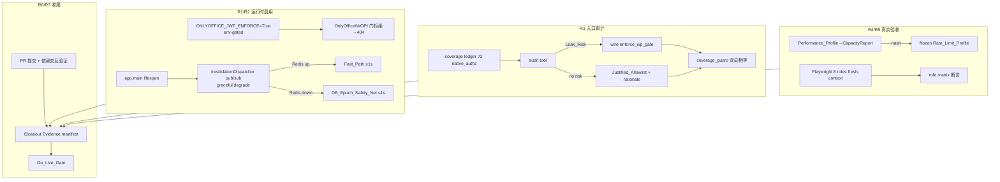

# Design Document

## Overview

本设计把已完成的 Parent_Spec（`procedure-delegation-visibility-isolation`）从"机制已构建并在开发库验证"推进到"生产 LIVE 且被独立证据接受"。它**只做启用、运行时挂载、审计、真实压测、真实浏览器验收、提交与依赖交互验证**，不重建可见性系统、不改 `resolve_wp_binding_and_access()` / Action_Matrix / epoch_cache 语义。若过程中发现机制缺陷，回 Parent_Spec 修复。

设计覆盖 requirements.md 的 R1–R7。所有可见性术语沿用 Parent_Spec Glossary。相关实现真源：

- 配置开关：`backend/app/core/config.py::Settings.ONLYOFFICE_JWT_ENFORCE`（默认 `False`；已在 `wp_onlyoffice_router.py`、`api/wopi.py` 的门拒绝分支处 gate，`False` 时记 warning 放行，`True` 时统一 404 fail-closed）。
- 运行时组件：`app.services.wp_visibility.invalidation_dispatcher`（`InvalidationDispatcher` publisher + `run_invalidation_subscriber`）、`epoch_cache.PersistentEpochCache`（DB epoch 安全网 + `invalidate()` 快路径）。
- lifespan 挂载范式：`app/main.py` 内 `asyncio.create_task(worker.run(stop_event))`，由 settings flag 门控（如 `procedure_dispatcher_worker`）。
- 覆盖台账与守卫：`app/security/wp_bound_entry_coverage.json`、`coverage_guard.py`、`entry_coverage_scanner.py`（`native_authz` 基线 72）。
- 容量与限流：`wp_visibility/rate_limit_profile.py`（`freeze_rate_limit_profile`/`CapacityReport`/measurement mode）、`tests/procedure_delegation_visibility/test_task17_capacity_and_role_acceptance.py`（可扩展的代表性压测 harness）。
- 证据：`app/security/{evidence_manifest.py,completion_guard.py}`；本 spec 使用**独立** manifest 于 `.kiro/specs/visibility-isolation-go-live-hardening/evidence/`，复用同一 schema/append-only/latest-run-per-task 语义。

### 核心不变量（沿用父 spec，不重定义）

```text
门拒绝对外 = External_Not_Found (404 + {"detail":"资源不存在或不可访问"})
撤权收敛 = Fast_Path(Redis fan-out) 或 DB_Epoch_Safety_Net(≤1s 复查)，二者皆 fail-closed，绝不 stale-allow
生产限流阈值 = 仅来自 frozen Rate_Limit_Profile（引用 Capacity_Report_Hash）
上线判定 = Go_Live_Gate 确认每个 Go_Live_Item 为 LIVE/ACCEPTED（非"已构建"）
```

## Architecture



运行时改动仅新增：①`ONLYOFFICE_JWT_ENFORCE` 的生产求值路径（env override，不改门逻辑）；②lifespan 内 dispatcher 的挂载/停止（复用现有 `_start_workers` 范式，flag 门控 + Redis 不可用不阻塞启动）。其余为审计、验收、证据活动，不改请求热路径。

## Data Models

本 spec **不新增数据库表或迁移**（迁移 head 保持 Parent_Spec 的 V113）。仅引入以下配置/证据层数据结构；持久授权数据全部复用 Parent_Spec 的 `working_paper`/`wp_index`/`procedure_row_tasks`/`wp_visibility_policy_epoch`/`wp_visibility_invalidation_outbox` 等真源。

### Enforcement 配置（R1）
- `ONLYOFFICE_JWT_ENFORCE: bool`——环境求值：prod/staging 或显式 env=`true` → `True`；dev 默认 `False`。无 schema 变更，纯配置。

### Justified_Allowlist 记录（R3，静态数据文件 / ledger 内嵌）
```json
{
  "entry": "wp_ai.summarize",
  "route": "/api/workpapers/{wp_id}/ai/summarize",
  "method": "POST",
  "classification": "justified_allowlist",
  "reason": "仅返回项目级聚合，不落具体底稿正文；跨项目已由 native authz 挡",
  "reviewer": "<auditor id>"
}
```
每条 native_authz 入口最终归类为 `gated`（接入 Wp_Bound_Gate）或 `justified_allowlist`（附 reason），写回 `wp_bound_entry_coverage.json`。

### CapacityReport / frozen Rate_Limit_Profile（R4，复用父结构）
- `CapacityReport`：`performance_profile_version` + `measured_at` + `results{p95/error_rate/error_allow/...}`；`content_hash()` = SHA-256。
- `RateLimitProfile`（frozen）：`version` + `per_user/per_project/per_family` 阈值 + `capacity_report_hash` + `frozen=true`；无 hash 不激活。
- Deterministic_Summary：剥离时间戳/buffers/actual-rows 的稳定摘要用于 hash-pin。

### Closeout Evidence（R7，独立 manifest，复用父 schema）
- 路径 `.kiro/specs/visibility-isolation-go-live-hardening/evidence/manifest.json` + `manifest.schema.json`；append-only run 记录（task_id/test_ids/criterion_ids/status/artifacts[sha256,size]）；latest-run-per-task 语义。

## Components and Interfaces

| ID | Component | 复用/新增 | 职责 |
|---|---|---|---|
| C8 | WpBoundGate | 复用(父) | R3 Leak_Risk 入口接入统一门 |
| C11 | EditorSecurity | 复用(父) | R1 令牌绑定/回调重校验（已 fail-closed，仅启用） |
| C14 | CoverageGuard | 复用+扩展 | R3 审计后台账双向相等 + Justified_Allowlist 守卫 |
| C15 | Cache/Rate/Perf | 复用+扩展 | R2 dispatcher 挂载、R4 容量冻结 |
| C18 | Evidence | 复用 | R7 manifest/Completion_Guard（本 spec 独立 manifest） |
| H1 | EnforcementEnabler | 新增 | R1 env-gated 启用 + Rollback_Path + LIVE 验证 |
| H2 | DispatcherLifecycle | 新增 | R2 lifespan 挂载/优雅降级/重连/停止 |
| H3 | NativeAuthzAuditor | 新增 | R3 72 入口分类工具 + Justified_Allowlist 数据面 |
| H4 | CapacityHarness | 新增 | R4 Performance_Profile + 诚实外推 + 冻结 profile |
| H5 | RoleAcceptanceHarness | 新增 | R5 Playwright 8 角色 fresh-context + API 级回退 |
| H6 | CommitAndInteraction | 新增 | R6 PR 流 + 依赖 spec 回归区分 |
| H7 | GoLiveGate | 新增 | R7 6 项 LIVE/ACCEPTED 终局门 |

### H1 EnforcementEnabler（R1）

- 启用方式：`ONLYOFFICE_JWT_ENFORCE` 改为**环境求值**——生产/预发环境（`ENV in {prod,staging}` 或显式 `ONLYOFFICE_JWT_ENFORCE=true`）为 `True`，dev（JWT disabled）保持 `False`。默认值本身不硬翻转为 `True`，避免破坏本地开发编辑；生产由环境变量/部署配置置 `True`。
- Rollback_Path：置环境变量 `ONLYOFFICE_JWT_ENFORCE=false` 即恢复启用前行为，**不需代码回滚**。
- LIVE 验证：`enforce=True` 下真实应用对 config/GetFile/PutFile/callback + WOPI CheckFileInfo/PutFile 的令牌 fail-closed（签名/过期/claim 绑定/只读令牌写/secret 缺失/已撤权会话）返回 404；`enforce` 关闭时 dev 编辑不受影响。
- 不改 `editor_security` 校验逻辑（恒 fail-closed），仅改 gate 是否对外 404。

### H2 DispatcherLifecycle（R2）

- 在 `app/main.py::_start_workers`（或等价 lifespan 段）新增 `asyncio.create_task(run_invalidation_subscriber(stop_event))`，与既有 worker 同范式；publisher 侧确保权限事务提交后经 `InvalidationDispatcher` fan-out。
- Graceful_Degradation：Redis 启动时不可用 → 记 warning、应用照常启动、订阅任务进入重连循环（指数退避）；运行期 Redis 断连 → 重连并 resubscribe，期间由 `PersistentEpochCache` 的 DB epoch ≤1s 复查兜底，fail-closed 无 stale-allow。
- 停止：lifespan 退出时 set stop_event + 优雅取消订阅任务。
- flag 门控：可选 `VISIBILITY_INVALIDATION_DISPATCHER_ENABLED`（默认 True），便于回退。不改 epoch_cache 语义。

### H3 NativeAuthzAuditor（R3）

- 工具（`app/security/native_authz_audit.py` 或扩展 `coverage_guard`）遍历 ledger 中 72 条 `native_authz`，对每条产出判定：`leak_risk` | `justified_allowlist`（附 rationale）。
- 分类准绳：入口能否返回/改动"scope-internal-not-delegated"底稿正文或 unmapped-sheet 内容 → Leak_Risk；仅项目级聚合/元数据/全局目录且不落到具体底稿正文 → 可豁免。
- Leak_Risk → 接 `enforce_wp_gate`/`dedicated_wp_gate`，ledger 该条 gate/matrix/test 更新为 gated；其余写入 `Justified_Allowlist`（结构：entry, route, method, reason, reviewer）。
- 守卫：`coverage_guard` 断言"每条 native_authz 要么 gated 要么在 allowlist"，否则 Route_Drift_Guard 阻断 CI；无 silent pass。

### H4 CapacityHarness（R4）

- Performance_Profile（版本化）：定义工具（in-process closed-loop + 可选外部 locust/k6）、ramp、项目分布、动作组合、数据规模；目标 6000 并发已认证用户。
- Honest_Extrapolation：若环境无法字面 6000，记录实际最大并发 + 外推方法与局限，产出 `CapacityReport`（含 p95/错误率/拒绝正确率/限流行为/缓存一致性）。
- 冻结：`freeze_rate_limit_profile(capacity_report=...)` 以 `Capacity_Report_Hash` 绑定；生产仅从 frozen profile 读阈值；缺报告/哈希拒绝激活。
- 证据：易变计时以 Deterministic_Summary 摘要（剥离时间戳/buffers）hash-pin。
- 目标：list p95≤2s、gate p95≤1s、成功错误率≤1%、错误允许数=0。

### H5 RoleAcceptanceHarness（R5）

- Playwright：为 8 个 Acceptance_Role 各建全新 browser context + fresh navigation（禁跨角色复用会话）。
- Dev_Servers：经后台进程机制起 backend 9980 + frontend 3030（非阻塞），探活后执行。
- 断言矩阵：scope-internal-not-delegated 与 scope-external-delegated 皆拒绝；覆盖 list/tab/URL/write/review/attachment/AI/version/OnlyOffice-WOPI；撤权刷新 ≤1s 生效；404 显"资源不存在或不可访问"无名称/正文闪现；console error=0。
- 环境回退：某 lane 因环境阻塞（如某服务起不来）时降级为 API/gate + PostgreSQL 级证明并如实记为该 criterion 的 GAP（不冒充浏览器验收）。

### H6 CommitAndInteraction（R6）

- PR 流：新分支 + `-u` 远程跟踪，`gh pr create`，不直推 main/master；仅 stage 本次交付文件；疑似 secret 文件提交前标记。
- 依赖交互：跑 `procedure-delegation-notification` 相关套件，区分其既有 `service_identities` create_all 失败与本次新增回归（基线快照对比）。

### H7 GoLiveGate（R7）

- 复用 `completion_guard` 语义（latest-run-per-task、重算 SHA-256/size、拒绝 `..`/绝对路径/缺 artifact/旧 run/smoke 冒充）。
- 额外：逐一确认 6 个 Go_Live_Item 的最新 Criterion_Run = passed 且标注为 LIVE/ACCEPTED；任一仅"已构建"未被证据证明 LIVE → 阻断。
- 通过后写最终确认记录。

## Correctness Properties

面向集成/验收，真实 FastAPI app + PostgreSQL `audit_platform`；环境门控项（H4 6000、H5 Playwright）如实标注可扩展/回退。

### Property 1: 编辑器令牌强制启用且可回退

`enforce=True` 下 OnlyOffice/WOPI 全部令牌失败态（签名/过期/claim 不一致/只读令牌写/secret 缺失/已撤权会话）在真实应用返回 External_Not_Found；有效令牌放行；`enforce=false` dev 编辑不受影响；Rollback_Path 纯配置可逆。

**Validates: Requirements 1.1, 1.2, 1.3, 1.4, 1.5, 1.6, 1.7, 1.8, 1.9, 1.10, 1.11, 1.12**

### Property 2: 失效 dispatcher 挂载后撤权收敛且降级 fail-closed

dispatcher 挂载后 Fast_Path 撤权 ≤1s 收敛；Redis 不可用时应用仍启动且 DB_Epoch_Safety_Net ≤1s 拒绝，绝不 stale-allow；连接中断可重连恢复订阅；应用关闭优雅停止。

**Validates: Requirements 2.1, 2.2, 2.3, 2.4, 2.5, 2.6, 2.7, 2.8, 2.9, 2.10**

### Property 3: 每条 native_authz 入口要么接门要么显式豁免

Native_Authz_Set 每条要么接入 Wp_Bound_Gate（强制 scope_cycles/Sheet_Key/委派隔离），要么在 Justified_Allowlist 有 rationale；coverage_guard 双向相等；任一漏项 Route_Drift_Guard 阻断 CI，无 silent pass。

**Validates: Requirements 3.1, 3.2, 3.3, 3.4, 3.5, 3.6, 3.7, 3.8, 3.9, 3.10, 3.11**

### Property 4: 生产限流仅由测量容量证据激活

frozen Rate_Limit_Profile 必须引用 Capacity_Report_Hash 才激活，缺报告/哈希拒绝激活；阈内不误限、超阈 429 + 有效 Retry-After；6000 并发目标达成或以 Honest_Extrapolation 记录依据；易变计时以 Deterministic_Summary hash-pin。

**Validates: Requirements 4.1, 4.2, 4.3, 4.4, 4.5, 4.6, 4.7, 4.8, 4.9, 4.10, 4.11, 4.12**

### Property 5: 多角色 fresh-context 浏览器行为与服务端授权一致

8 个 Acceptance_Role 各建全新 browser context + fresh navigation；scope-internal-not-delegated 与 scope-external-delegated 均拒绝；覆盖 list/tab/URL/write/review/attachment/AI/version/OnlyOffice-WOPI；撤权刷新 ≤1s；404 无名称/正文闪现；console error=0；环境阻塞 lane 以 API/gate 级回退并如实记 GAP，不冒充浏览器验收。

**Validates: Requirements 5.1, 5.2, 5.3, 5.4, 5.5, 5.6, 5.7, 5.8, 5.9**

### Property 6: 提交经 PR 且依赖回归可区分

变更经 Pull Request 提交、不直推 main/master、仅 stage 本次交付文件；`procedure-delegation-notification` 既有 `service_identities` 失败与本次新增回归被区分记录。

**Validates: Requirements 6.1, 6.2, 6.3, 6.4, 6.5, 6.6, 6.7, 6.8**

### Property 7: 上线证据 append-only 且终局门只认 LIVE/ACCEPTED

Closeout_Evidence append-only + 易变 artifact 确定性摘要 hash-pin + latest-run-per-task 重算 SHA-256/size；Go_Live_Gate 仅在 6 个 Go_Live_Item 皆被证据证明 LIVE/ACCEPTED 时通过，拒绝 smoke 冒充 correctness 或"仅已构建"。

**Validates: Requirements 7.1, 7.2, 7.3, 7.4, 7.5, 7.6, 7.7, 7.8, 7.9, 7.10**

## Error Handling

- R1：`enforce=True` 门拒绝统一 404；secret/config 缺失 fail-closed；dev（enforce=false）保持放行且记 warning。
- R2：Redis 不可用不抛出、不阻塞启动；投递失败仅告警 + DB epoch 兜底；绝不因 dispatcher 故障 stale-allow。
- R3：审计工具对无法判定的入口默认按 Leak_Risk 处理（fail-closed），要求人工复核后方可移入 allowlist。
- R4：缺 CapacityReport/hash → 拒绝激活 profile，保持 measurement-only（不预设阈值）。
- R5：dev 服务起不来 → 该 lane 记 GAP + API 级回退，不标 passed 冒充。
- R7：任一门禁失败 → Go_Live_Gate 阻断，列出失败证据，不关闭上线声明。

## Testing Strategy

- H1/H2/H3：真实 FastAPI app + PostgreSQL 集成测试（enforce 开关两态、dispatcher 挂载/降级/重连、native_authz 审计前后台账对账）。
- H4：容量 harness 产出 CapacityReport + frozen profile 单测（激活需 hash、阈内/超阈行为）。
- H5：Playwright e2e（dev 服务后台起）；不可行 lane 用 gate+PG 集成回退并标 GAP。
- H6：PR 元数据 + 依赖套件基线对比。
- H7：Go_Live_Gate 自测（6 项 LIVE 判定、smoke 冒充拒绝、hash/size 重算）。
- 证据：每任务 append-only 追加本 spec 独立 manifest；易变 artifact 仅 hash-pin 确定性摘要。

## Requirements Traceability

| Requirement | Components | Properties |
|---|---|---|
| R1 启用编辑器令牌强制 | H1, C11, C8 | HP1 |
| R2 挂载失效 dispatcher | H2, C15 | HP2 |
| R3 审计 native_authz | H3, C14, C8 | HP3 |
| R4 真实容量 + 冻结限流 | H4, C15 | HP4 |
| R5 Playwright 多角色验收 | H5 | HP5 |
| R6 提交 + 依赖交互 | H6 | HP6 |
| R7 证据纪律 + 上线门 | H7, C18 | HP7 |
