# Design Document

## Overview

本设计承接 `workpaper-maintainability-convergence` spec 遗留的四类技术债，通过四个工具/脚本协同完成：

1. **Ledger Generator 增强** — 修复 8 个漂移条目 + unknown→covered 自动标记
2. **Legacy Provider 删除工具** — AST-aware 批量删除已被 Runtime Boundary 覆盖的 version/review 本地接线
3. **FormData 工厂迁移脚本** — 将 94 个同构 composable 替换为 `createChecklistFormData` 工厂调用
4. **批次验证协议** — 每批完成后 get_diagnostics + Vite transform 验证

## Architecture

```mermaid
graph TD
    subgraph "Wave 0: Ledger Drift Fix"
        A1[generate_coverage_ledger.py 增强] --> A2[coverage-ledger.json 完整]
        A3[修复 J1/J2/J3/K14-K18 漂移] --> A2
    end

    subgraph "Wave 1: Legacy Provider Removal"
        B1[remove_legacy_providers.py] --> B2[扫描 inject WorkpaperRuntimeContextKey]
        B2 --> B3[移除 useWorkpaperVersionToolbar import+调用]
        B2 --> B4[移除 useWorkpaperReviewProvide import+调用]
        B3 --> B5[per-file diff review]
        B4 --> B5
    end

    subgraph "Wave 2: FormData Factory Migration"
        C1[migrate_formdata_factory.py] --> C2[解析同构 FormData composable]
        C2 --> C3[生成 createChecklistFormData 调用]
        C3 --> C4[保留 exported API 不变]
    end

    subgraph "Wave 3: CI + Final"
        D1[check_homogeneous_formdata.py --strict] --> D2[CI 阻断新建]
        D3[Ledger regen] --> D4[unknown 减少]
        D5[migration-report.md] --> D6[before/after 指标]
    end
```



## Components and Interfaces

### 1. Ledger Generator 增强 (`generate_coverage_ledger.py`)

**现状问题**：
- `get_distinct_root_codes()` 从 `wp_code_overrides.json` 提取 root codes，但 J1/J2/J3/K14-K18 的 override 条目可能使用全编码（如 `J1-1`→`j1-employee-compensation`）而非裸根编码
- `find_main_entry_files()` 使用 `MAIN_ENTRY_RE = r'^Gt([A-Z]\d+(?:-\d+)?)\w*\.vue$'` 匹配文件名，对 J1/J2/J3 应能匹配到 `GtJ1*.vue`，问题在于 root code 提取逻辑或 overrides 数据缺失

**修改方案**：
1. 在 `get_distinct_root_codes()` 中确保 J1/J2/J3/K14-K18 的 root codes 被正确提取
2. 添加 `WorkpaperRuntimeContextKey` 检测模式到 `DETECTION_PATTERNS`：
   ```python
   RUNTIME_BOUNDARY_PATTERN = re.compile(r'inject\s*\(\s*WorkpaperRuntimeContextKey')
   ```
3. 在 `detect_capabilities()` 中，当检测到 Runtime Boundary inject 模式时，自动标记 5 项能力为 covered：
   - displayPrefs、agingConfig、version、review、ai

**接口不变**：输出 `coverage-ledger.json` 格式（schemaVersion=2）不变。

### 2. Legacy Provider 删除工具 (`remove_legacy_providers.py`)

**新建脚本**，位于 `backend/scripts/migration/remove_legacy_providers.py`。

**输入**：扫描 `workpaper/Gt*.vue` 主入口文件
**前置条件检查**：文件包含 `inject(WorkpaperRuntimeContextKey`
**删除目标**：
- `import { useWorkpaperVersionToolbar } from ...` 及相关解构赋值和调用
- `import { useWorkpaperReviewProvide } from ...` 及相关解构赋值和调用

**技术方案**：基于正则行匹配（非 PowerShell）：
1. 逐行读取文件（UTF-8）
2. 构建要删除的行集合：
   - import 行匹配 `useWorkpaperVersionToolbar` 或 `useWorkpaperReviewProvide`
   - 紧跟的解构/调用行（如 `const { versionTrailRef, ... } = useWorkpaperVersionToolbar(...)` 或 `useWorkpaperReviewProvide(...)` 调用）
3. 删除匹配行，保留其余代码不变
4. 输出 unified diff 供人工审查

**安全约束**：
- 仅操作已确认包含 `inject(WorkpaperRuntimeContextKey` 的文件
- 不触碰 Runtime Boundary 消费代码（`const runtime = inject(WorkpaperRuntimeContextKey, null)` 等）
- 仅删除 Legacy Provider 的 import 和直接调用，不删除间接引用

### 3. FormData 工厂迁移工具 (`migrate_formdata_factory.py`)

**新建脚本**，位于 `backend/scripts/migration/migrate_formdata_factory.py`。

**输入**：94 个同构 FormData composable 文件列表（按循环分组）
**输出**：每个文件替换为 `createChecklistFormData` 工厂调用的精简版本

**迁移模板**：
```typescript
import { createChecklistFormData, type ChecklistFormDataReturn } from '../factories/createChecklistFormData'
import { ref, type Ref } from 'vue'

export function useX{N}FormData(wpId: Ref<string>, projectId: Ref<string>, year?: Ref<number | undefined>): ChecklistFormDataReturn {
  return createChecklistFormData({
    wpId,
    projectId,
    year,
    itemPrefix: '{PREFIX}-',
    label: '{LABEL}',
    forceComponentType: '{COMPONENT_TYPE}',
    accountCodes: ['{ACCOUNT_CODE}'],
  })
}
```

**参数提取策略**：
- `itemPrefix`：从文件名提取（`useK1FormData` → `K1-`）
- `label`：从文件名提取（`useK1FormData` → `K1`）
- `forceComponentType`：从文件内容中搜索 `force_component_type` 参数值
- `accountCodes`：从文件内容中搜索科目代码常量

**API 保留**：生成的 wrapper 函数保留相同的导出签名，消费组件无需修改。

### 4. 批次验证协议

每个迁移批次完成后执行：
1. `get_diagnostics` 对所有修改文件 → 零 errors
2. Vite transform curl → HTTP 200（`curl http://localhost:3030/src/components/workpaper/{file}`）
3. 可选：`vitest run` 对受影响的 composable 测试

## Data Models

### Coverage Ledger Entry（不变，schemaVersion=2）

```json
{
  "schemaVersion": 2,
  "generatedAt": "2026-07-14T12:00:00Z",
  "capabilities": ["displayPrefs", "agingConfig", "version", "review", "ai", "importExport", "acnr", "persistence"],
  "entries": {
    "J1": {
      "componentType": "j1-employee-compensation",
      "entryFile": "audit-platform/frontend/src/components/workpaper/GtJ1EmployeeCompensation.vue",
      "capabilities": {
        "displayPrefs": { "status": "covered", "evidence": ["...WorkpaperRuntimeContextKey"] },
        "version": { "status": "covered", "evidence": ["...WorkpaperRuntimeContextKey"] },
        "review": { "status": "covered", "evidence": ["...WorkpaperRuntimeContextKey"] },
        "ai": { "status": "covered", "evidence": ["...WorkpaperRuntimeContextKey"] },
        "agingConfig": { "status": "covered", "evidence": ["...WorkpaperRuntimeContextKey"] }
      }
    }
  }
}
```

### FormData 迁移配置（脚本内嵌）

```python
FORMDATA_MIGRATION_MAP = {
    'useK1FormData': {'prefix': 'K1-', 'label': 'K1', 'componentType': 'k1-other-receivables', 'accountCodes': ['1221']},
    'useK2FormData': {'prefix': 'K2-', 'label': 'K2', 'componentType': 'k2-other-current-assets', 'accountCodes': ['1231']},
    # ... 94 entries total
}
```

## Correctness Properties

*A property is a characteristic or behavior that should hold true across all valid executions of a system — essentially, a formal statement about what the system should do. Properties serve as the bridge between human-readable specifications and machine-verifiable correctness guarantees.*

### Property 1: Ledger completeness — all dedicated roots present

*For any* wp_code root that has a dedicated main entry file and a non-skip componentType in wp_code_overrides.json, the generated Coverage Ledger SHALL contain a capability record for that root.

**Validates: Requirements 1.2**

### Property 2: Runtime Boundary auto-marking consistency

*For any* main entry file containing `inject(WorkpaperRuntimeContextKey`, the Ledger Generator SHALL mark all 5 Runtime Boundary capabilities (displayPrefs, agingConfig, version, review, ai) as covered with non-empty evidence.

**Validates: Requirements 2.1, 2.2, 2.3, 2.4, 2.5**

### Property 3: Runtime Boundary absence preserves unknown

*For any* main entry file that does NOT contain `inject(WorkpaperRuntimeContextKey` and has no other matching detection patterns for a given capability, that capability SHALL remain as unknown status.

**Validates: Requirements 2.6**

### Property 4: Legacy Provider removal preserves Runtime Boundary

*For any* main entry file where Legacy Provider code is removed, the file SHALL still contain `inject(WorkpaperRuntimeContextKey` and all Runtime Boundary consumption code intact.

**Validates: Requirements 3.3**

### Property 5: FormData factory migration preserves public API

*For any* migrated FormData composable, the exported function name and return type (ChecklistFormDataReturn) SHALL remain identical to the pre-migration public API, ensuring consuming components require zero changes.

**Validates: Requirements 4.3**

### Property 6: FormData migration eliminates self-built network

*For any* migrated FormData composable, the `check_homogeneous_formdata.py` guard SHALL detect zero violations (no self-built checklist-responses GET/PUT patterns present).

**Validates: Requirements 4.4**

### Property 7: CI guard strict mode blocks new violations

*For any* new file matching the homogeneous FormData pattern that contains self-built checklist-responses network calls and does NOT use createChecklistFormData or useChecklistPersistence, `check_homogeneous_formdata.py --strict` SHALL exit 1.

**Validates: Requirements 5.2**

## Error Handling

| 场景 | 处理策略 |
|------|----------|
| 主入口文件读取失败（编码/权限） | 跳过该文件，报 WARN，继续处理其余 |
| wp_code_overrides.json 缺失 | 报错退出（前置依赖，不可继续） |
| Legacy Provider 删除后 Vite transform 500 | 立即回滚该文件（git checkout），标记为手动处理 |
| FormData 迁移后 get_diagnostics 报错 | 回滚该批次所有文件，报告具体错误供人工修复 |
| 同构 FormData 文件含非标业务差异 | 脚本跳过（在 SKIP_LIST 中显式注册） |

## Testing Strategy

**单元测试**（pytest）：
- `test_generate_coverage_ledger.py`：验证 J1/J2/J3/K14-K18 出现在输出中
- `test_runtime_boundary_automark.py`：mock 文件内容含/不含 inject 模式，验证能力标记
- `test_remove_legacy_providers.py`：给定样本文件，验证删除结果正确
- `test_migrate_formdata_factory.py`：给定样本 composable，验证输出模板正确

**属性测试**（Hypothesis，min 100 iterations）：
- Property 1: 随机生成 wp_code_overrides 子集 + 对应 entry files → 所有 non-skip roots 出现在 ledger
- Property 2: 随机生成含 WorkpaperRuntimeContextKey 的文件内容 → 5 项能力均 covered
- Property 3: 随机生成不含 WorkpaperRuntimeContextKey 且无其他模式的文件 → 能力保持 unknown
- Property 5: 随机生成 FormData 配置参数 → 输出文件保留相同 export 函数名
- Property 6: 随机生成迁移后文件 → check_homogeneous_formdata 扫描零 violation
- Property 7: 随机生成含自建网络的新文件 → strict 模式 exit 1

**集成验证**：
- 每批修改后 get_diagnostics 零错误
- 每批修改后 Vite transform HTTP 200
- 最终 Ledger 重新生成后 drift=0

**PBT 库**：Hypothesis（Python，项目已配置 `max_examples=5` fast profile）
- 每个属性测试标注 `# Feature: workpaper-maintainability-convergence-followup, Property N: {title}`
- 配置 `@settings(max_examples=100)` 显式覆盖 fast profile 以达到最低 100 iterations
