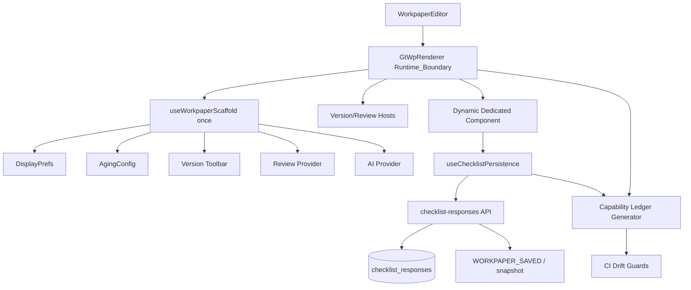

# Design Document · 底稿可维护性收敛

## Overview

### 设计目标

本设计把底稿模块从“每个专属组件自行接线”迁移到“统一运行时边界 + 统一持久化适配器 + 机器可验证覆盖”。它复用现有 `GtWpRenderer`、`useWorkpaperScaffold`、`checklist_responses`、版本链、复核、AI、ACNR 和 CI 脚本，不重写成熟业务组件。

### 1.1 非目标

- 不新增审计循环、sheet 或 componentType。
- 不改变审定表、明细表、ECL、抽凭等业务计算口径。
- 不把所有业务状态强制迁入一个巨型 store。
- 不在本 spec 中重写 OnlyOffice、批量导入导出或 ACNR 内核。
- 不以 Redis 缓存掩盖慢查询；性能优化必须先有测量和失效策略。

## 2. 当前架构证据

| 证据 | 当前状态 | 维护风险 |
|---|---|---|
| `GtWorkpaperShell` callers | 0 | 骨架存在但未成为运行时入口 |
| `useWorkpaperScaffold` callers | 仅 Shell | 全局能力仍依赖主入口手工接线 |
| `useWorkpaperReviewProvide` | 少量 callers | 多数 💬 入口可能无真实 Host/provider |
| `useWorkpaperVersionToolbar` | 大量独立 callers | 快照策略、生命周期和 UI 重复 |
| `saveImmediate` | 多签名、多实现 | `/api`、project_id、debounce、回滚、快照容易漂移 |
| Capability Ledger | entry 级 exemption | 一个理由可掩盖全部能力缺失 |
| Vite transform smoke | 已存在 | 只能抓 transform，抓不到 named-export 与 Round_Trip |

## Architecture

### 目标架构



### 3.1 核心决策

1. **Runtime_Boundary 放在 `GtWpRenderer`，而不是要求 100+ 主入口逐个包 Shell。** Renderer 已是动态组件共同祖先，可一次 provide 覆盖全部子树。
2. `GtWorkpaperShell` 保留为独立/嵌入式底稿的可选布局壳；默认平台路径以 Renderer 边界为真源。
3. 迁移期允许 Legacy_Provider 继续存在，但本地 provider 会被扫描并逐批删除，禁止长期双重接线。
4. 持久化统一“薄适配器”，业务 composable 保留自己的行模型和公式；只收敛 I/O、缓存、debounce、错误和快照。
5. Ledger 记录能力级状态与证据，不再允许 entry 级 blanket exemption。

## Components and Interfaces

### Runtime Boundary 设计

`GtWpRenderer` 在 setup 中基于响应式 `wpId/projectId/wpCode/year` 调用一次 `useWorkpaperScaffold`。由于 Vue provide 对动态子组件天然生效，无需修改每个 registry entry。

Renderer 增加的职责仅限：

- 初始化并 provide Scaffold；
- 渲染 `GtWpVersionTrail` 与 `GtWpReviewDialogHost` 所需 Host；
- 把现有 `navigate-sheet/save-success/saved-notify` 事件桥接到统一服务；
- 不新增第二套 toolbar，不包裹影响布局的业务容器。

为避免生命周期重复，`useWorkpaperScaffold` 增加实例标记 InjectionKey。若祖先已提供实例，嵌套 Shell 复用现有实例；只有独立场景才新建。

```ts
interface WorkpaperRuntimeContext {
  wpId: Ref<string>
  projectId: Ref<string>
  wpCode: Ref<string>
  year: Ref<number | undefined>
  displayPrefs: DisplayPrefsContract
  agingConfig: AgingConfigContract
  version: ReturnType<typeof useWorkpaperVersionToolbar>
  review: ReviewProviderContract
  generateAiText(input: AiTextInput): Promise<string>
  jumpToSection(sheet: string): void
  reload(): Promise<void>
}
```

### 4.1 Host 挂载

- 复核：Runtime Boundary 统一挂 `GtWpReviewDialogHost`。
- 版本：统一挂真实 `GtWpVersionTrail`；toolbar action 只打开 Host，不在各主入口重复 new 实例。
- AI：统一 provider 只封装通用端点；业务 prompt/context 仍由 tab 传入。
- 导入导出：保留现有业务 composable；本 spec 只统一能力发现与 toolbar 契约，不强行改造特殊多 sheet 导出。

## 5. Persistence Adapter 设计

新增 `useChecklistPersistence.ts`，作为 I/O 层而非业务状态层。

```ts
interface ChecklistItemPayload {
  item_id: string
  remark: string | null
  conclusion: string | null
  wp_ref?: string | null
}

interface PersistenceState {
  status: 'idle' | 'dirty' | 'saving' | 'saved' | 'error' | 'conflict'
  serverVersion?: string
  lastError?: string
}

interface ChecklistPersistence {
  responses: Ref<Map<string, ChecklistResponse>>
  load(): Promise<void>
  hydrate(source: unknown): void
  save(itemId: string, patch: Partial<ChecklistResponse>): Promise<void>
  saveDebounced(itemId: string, patch: Partial<ChecklistResponse>): void
  flush(itemId?: string): Promise<void>
  cancel(itemId?: string): void
  stateOf(itemId: string): PersistenceState
}
```

### 5.1 序列化规则

- Adapter 接收 `remark` 字符串；业务对象通过 `encodeRemark(value)` 序列化一次。
- `decodeRemark` 兼容历史：字符串 JSON、`{remark:"..."}` 双层包装、数组/对象直值。
- 新写入一律单层字符串，禁止父子两层重复 `JSON.stringify`。
- 大于 100 行动态数据延续“单 item JSON 打包”铁律，不逐行写 checklist 表。

### 5.2 并发与错误

第一阶段保持后端现有单请求 UPSERT；增加响应版本（优先使用 `updated_at`/ETag）和可选 `if_match`。冲突策略：

1. 无版本参数时保持兼容的 last-write-wins，但返回 `overwritten` 元数据；
2. 有 `if_match` 且版本不一致时返回 409；
3. 前端保留 dirty 值并提示用户比较/重试，不静默覆盖。

### 5.3 快照与事件

保存成功后由 Runtime Boundary 的版本服务统一 schedule snapshot。后端保存成功发布现有 `WORKPAPER_SAVED` 事件入口；事件失败不得回滚已提交数据，但必须记录结构化日志和指标。

## Data Models

### Capability Ledger v2

```json
{
  "schemaVersion": 2,
  "generatedAt": "ISO-8601",
  "entries": {
    "D2": {
      "componentType": "d2-accounts-receivable",
      "entryFile": ".../GtD2AccountsReceivable.vue",
      "capabilities": {
        "review": {
          "status": "covered|missing|exempt|unknown",
          "evidence": ["GtWpRenderer:Runtime_Boundary"],
          "exemption": null
        }
      }
    }
  }
}
```

规则：
- Runtime Boundary 提供的能力可标记 `covered/runtime-boundary`。
- importExport、ACNR 等业务相关能力仍按组件实际接入检测，不因 Runtime Boundary 自动判定。
- exemption 必须绑定单一 capability、理由、批准角色和到期/复核日期。
- generated 字段由脚本重建；人工只维护明确豁免文件，避免生成物和人工状态混写。

## 7. 防回归守卫

### 7.1 API Prefix Guard

扫描平台 `http/api/axios` 客户端的字符串字面量与模板字面量：
- `/api/...`：放行；
- 明确的 `/workpapers/...`、`/projects/...` 等后端路由且缺 `/api`：违规；
- 外部绝对 URL、blob URL、OnlyOffice 协议路径：仅在显式 allowlist 中放行；
- 动态不可解析：报告 unknown，fail-open。

### 7.2 Import Contract Guard

维护 default-only module 清单，至少覆盖 `@/utils/http`。守卫解析 import 语句并阻断 named import。Vite transform 不保证发现 ESM named-export 缺失，因此另建 Runtime Import Smoke 动态加载所有 registry component。

### 7.3 Persistence Contract Guard

阻断以下明确模式：
- 在迁移完成目录内直接 `http.put(...checklist-responses...)`；
- `JSON.stringify({ remark: ... })` 后再次作为 remark 传输；
- `project_id: wpId`；
- checklist URL 缺 `/api`；
- 新增同构 `saveImmediate/debouncedSave` 网络实现而未使用 Adapter。

## 8. 同构代码收敛

### 8.1 FormData Factory

```ts
createChecklistFormData({
  itemPrefix: 'G10-',
  label: 'G10',
  forceComponentType: 'g10-trading-financial-liabilities',
  normalizeResponse,
  afterSave,
})
```

工厂负责通用 load/render cache/persistence；各循环保留公式、行模型、交叉验证和业务提示。迁移仅针对结构同构文件，禁止为了追求 DRY 把差异大的业务 composable 塞入条件分支。

### 8.2 Registry 拆分

按 `core/a-b/c/d-f/g-i/j-n/s/confirmation` 拆 registry module。每个 module 导出 `readonly HtmlRendererEntry[]`；barrel 合并并在开发期校验 componentType 唯一。`HtmlComponentType` 从 entries 推导或由生成脚本校验，避免手工 union 与注册条目漂移。

### 8.3 目录页

通用目录组件消费 render-config sheets + ACNR 名称；扩展接口只负责业务状态：

```ts
interface IndexExtension {
  progress(sheet: SheetMeta, responses: Map<string, unknown>): number
  linkage(sheet: SheetMeta): 'matched' | 'diff' | 'none'
  hidden(sheet: SheetMeta): boolean
}
```

## 9. 后端边界

现有 `batch_save_checklist_responses` 保持 UPSERT，但补齐：
- 通用底稿编辑权限校验；
- 每 item 输入错误定位；
- 响应 `updated_at/version/overwritten`；
- 可选 `if_match` 并发保护；
- 成功后统一事件入口；
- 结构化日志不输出 remark 内容，避免敏感数据泄露。

不在本 spec 中把 checklist_responses 改成逐业务表；它继续作为通用 section store。需要查询/统计的大规模明细仍应使用领域表或四表库。

## 10. 性能与可观测性

新增指标：
- `wp_render_config_duration_ms{component_type,cold}`；
- `wp_renderer_invocations{component_type}`；
- `wp_checklist_save_duration_ms{status}`；
- `wp_checklist_conflicts_total`；
- `wp_persistence_dirty_items`（前端埋点/开发诊断）。

先基准，再优化：
1. 验证 whole-wp request-local memo 覆盖；
2. 移除重复 render-config 拉取（父 Renderer 已有数据时子 composable 不再重复 GET）；
3. 只有在指标证明必要时设计 Redis 缓存，key 必含 project/wp/year/template version/permission scope，失效绑定保存与模板变更事件。

## 11. 迁移策略

- **Wave A：** D2、K5、J2 三类试点，覆盖复杂账龄/历史持久化 bug/多 section AI。
- **Wave B：** D/E/F、G/H/I、J/K、L/M/N、A/B/C/S 分批迁移。
- **Wave C：** 同构 FormData 工厂化、registry 拆分、目录数据驱动。
- **Wave D：** 守卫 strict、删除过期 provider、全量性能和 Playwright 验收。

每批回滚仅需恢复该批 Legacy_Provider/旧 FormData；后端 API 保留兼容参数直到全量迁移结束。

## Correctness Properties

### Property 1: 能力豁免隔离
对任意 wp_code 与能力集合，豁免一个 capability 不改变其他 capability 的 covered/missing 判定。
**Validates: Requirements 1.2, 1.3, 1.4**

### Property 2: 覆盖证据可复现
任意标记 covered 的能力必须能由 Runtime Boundary、静态符号或显式业务接线重新生成同一证据。
**Validates: Requirements 1.2, 1.4**

### Property 3: remark 编解码往返
对任意可序列化业务值，`decodeRemark(encodeRemark(x))` 与 x 等价，且 encode 结果不存在双层 remark 包装。
**Validates: Requirements 3.4**

### Property 4: 防抖隔离与最后写胜出
同 item 的多次更新只提交最后值，不同 item 的调度和提交互不影响。
**Validates: Requirements 3.5, 3.8**

### Property 5: 保存状态真实性
保存失败永不进入 saved；在输入未变化且重试成功后最终进入 saved。
**Validates: Requirements 3.6, 3.9**

### Property 6: 批量事务可定位
批量输入任一非法项时，结果符合定义的原子性且错误包含该 item_id。
**Validates: Requirements 4.1, 4.3**

### Property 7: Runtime 单实例
任意 Renderer 子树内 Scaffold/Review/Version Runtime 实例数至多为一。
**Validates: Requirements 2.1, 2.2**

### Property 8: 嵌套 Shell 幂等
在已有 Runtime Boundary 下嵌套 Shell 不增加 Host 或 provider 实例。
**Validates: Requirements 2.3, 2.4**

### Property 9: Registry 集合等价
拆分前后 componentType 集合完全相等，且每个值唯一注册。
**Validates: Requirements 6.4, 6.5**

### Property 10: 目录顺序等价
对任意 render-config sheet 序列，通用目录层保留全部有效 sheet 的原始顺序。
**Validates: Requirements 6.3, 6.5**

### Property 11: Runtime Import 覆盖完整
Runtime Import Smoke 的目标集合与专属 componentType 注册集合相等。
**Validates: Requirements 5.3, 5.4**

### Property 12: 持久化刷新不变量
对任意成功保存值，fresh navigation 后 hydrate 的业务值等于最后成功写入值。
**Validates: Requirements 3.9, 8.5, 8.6**

| 属性 | 不变量 |
|---|---|
| P1 | 单能力豁免不影响其他能力 |
| P2 | Ledger covered 必须有可复现证据 |
| P3 | decode(encode(x)) 保持业务值且新写单层 |
| P4 | debounce 对同 item 最后写胜出、不同 item 隔离 |
| P5 | 保存失败不进入 saved，重试后可收敛 |
| P6 | 批量保存事务语义与错误 item 可定位 |
| P7 | 每个 Renderer 子树至多一个 Runtime Context |
| P8 | 嵌套 Shell 复用 Runtime，不重复 Host |
| P9 | Registry 拆分前后 componentType 集合相等且唯一 |
| P10 | 目录元数据生成前后有效 sheet 顺序相等 |
| P11 | Runtime Import Smoke 覆盖每个专属 componentType |
| P12 | 保存成功后的 reload 值等于最后成功写入值 |

## 13. 验收与回滚

### 验收

- 静态：Ledger strict、API prefix、import contract、persistence contract、registry contract 全绿。
- 编译：Vite transform 全树 0 failure。
- 运行时：全部专属 componentType 动态 import 成功。
- 行为：代表底稿每循环至少一个 Round_Trip，复核/版本/AI/跳转按适用性实测。
- 性能：warm render-config 不回退；whole-wp renderer 调用次数符合 memo 预期。

### 回滚

- Runtime Boundary 由 feature flag 控制灰度；关闭后恢复 Legacy_Provider。
- Adapter 按循环迁移，旧 API 契约保留到最后一批完成。
- 守卫由 report → strict 单向推进；发现误报可按规则级回退 report，不删除测试。

## Error Handling

- Runtime Boundary 缺上下文时开发环境明确报错，生产环境降级且不得白屏。
- Persistence Adapter 区分 validation、permission、conflict、network 和 server error；失败值保持 dirty/error，不伪装 saved。
- 409 冲突保留本地值并展示覆盖信息；用户确认后才重试。
- 横切能力失败不得破坏主编辑流程，但必须有可见提示或结构化日志；禁止空 catch 吞掉持久化失败。
- 守卫无法解析时 fail-open 并报告 unknown；明确命中禁用模式时 fail-closed。

## Testing Strategy

1. **纯函数/PBT**：Ledger 判定、remark 编解码、debounce 隔离、registry 集合与 sheet 顺序不变量。
2. **组件测试**：Runtime Context 单实例、Host 挂载、嵌套 Shell 复用、缺上下文降级。
3. **API 契约测试**：权限、批量原子性、project_id 推导、409 冲突、事件发布。
4. **静态守卫**：API Prefix、default import、persistence anti-pattern、coverage drift。
5. **编译与运行时**：Vite transform 全树 + registry component 动态 import。
6. **Playwright**：D2/K5/J2 试点后扩至每循环代表底稿，执行编辑、保存、fresh navigation、回显，并检查复核/版本/AI/跳转。
7. **性能**：冷/热 render-config 基准、whole-wp renderer 调用次数、保存 p50/p95 与失败率；无基准不引入缓存。
