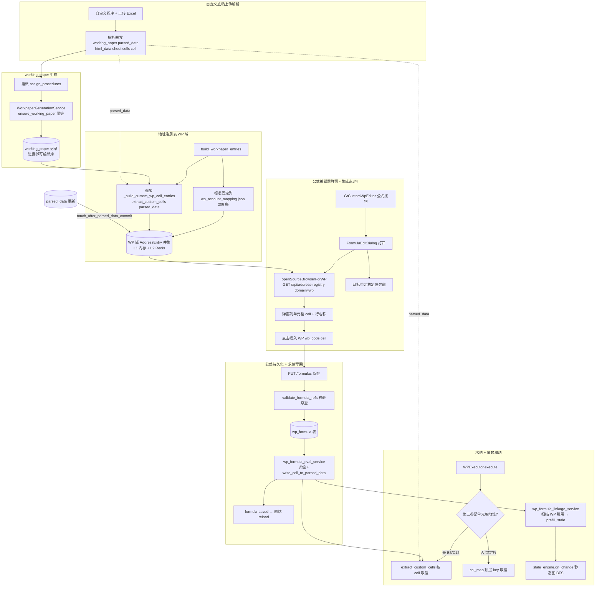
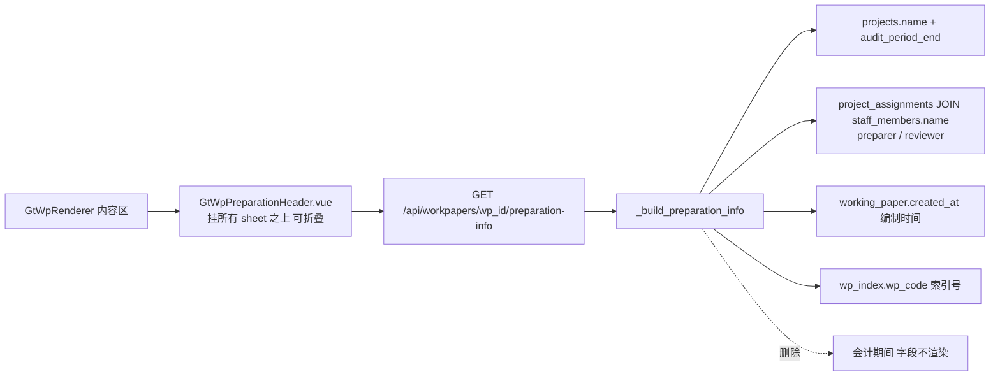

# Design Document

## Overview

本设计打通"自定义底稿 + 公式绑定 + 编制信息表头"的端到端链路，**已于 2026-06-03 落地**（见 `tasks.md` 验收记录）。**最大化复用既有能力**（`FormulaEditDialog.vue` 弹窗选址、`AddressRegistryService` 地址注册表、`formula_engine` WP/NOTE/REPORT 联动、`_generate_b_index_data` 编制信息 JOIN），在勘察确认的 9 个集成点处做最小增量改造。

### 实现状态（2026-06-03）

| 能力 | 状态 | 主要产物 |
|------|------|----------|
| 注册表 + 自定义单元格 | ✅ | `extract_custom_cells`、`_build_custom_wp_cell_entries` |
| wp_formula + CRUD | ✅ | V052、`WpFormulaService`、`wp_formula` router |
| 编制信息表头 | ✅ | `GtWpPreparationHeader`、`preparation-info` |
| 自定义编辑 + 公式 | ✅ | `GtCustomWpEditor`（只读 `GtGridSheet` + 公式按钮） |
| 保存后求值写回 | ✅ | `wp_formula_eval_service`、`write_cell_to_parsed_data` |
| 依赖联动 | ✅ | `wp_formula_linkage_service`（`prefill_stale` + 静态图 BFS） |
| touch 缓存失效 | ✅ router 层 + `test_touch_wp_registry_wiring.py` |

设计分两条主线：

- **主线 A（编制信息表头）**：新建 workpaper 级 `GtWpPreparationHeader.vue`，挂在 `GtWpRenderer` 内容区上方、所有 sheet 共享、可折叠、用 GT 紫令牌；复用 `_generate_b_index_data` 的人员/项目 JOIN 逻辑抽出为 `_build_preparation_info()`，补 `working_paper.created_at`（编制时间）和 `wp_index.wp_code`（索引号），删除"会计期间"字段。

- **主线 B（自定义底稿公式绑定）**：①扩展 `build_workpaper_entries` 追加读取 `working_paper.parsed_data` 解析出的单元格条目进 WP 域；②`FormulaEditDialog` 的 WP 弹窗数据源从 `/api/working-papers`（底稿级静态列表）切换到 `/api/address-registry?domain=wp`（单元格级注册表）；③新建独立 `wp_formula` 表持久化公式 + target_cell（用户拍板，非内嵌 parsed_data）；④自定义底稿指派后自动生成 `working_paper` 记录进委派可编辑库（用户拍板）；⑤`WP()` 求值扩展支持读取自定义底稿单元格地址；⑥`parsed_data` 更新触发 `invalidate_async(domain='wp')`。

> 下文「现状勘察确认」为设计前 grep 实证；**当前均已实现**。残留：生产环境须手工执行 V052；`wopi`/`ocr` 等 service 层写 `parsed_data` 未接 touch（TTL 120s）；复核人取派单角色非复核操作轨迹；网格只读非 Excel 直编。

---

## 现状勘察确认（9 集成点 grep 实证）

> 用户铁律：设计前先以 grep/codegraph/readFile 对 requirements 末尾列的 9 个集成点逐一实证。以下为确认结论 + 降级方案 + 切换点。

### 集成点 1 — `build_workpaper_entries` 数据源

**确认方法**：`readFile backend/app/services/address_registry.py`（`build_workpaper_entries`，约 line 400-470）。

**确认结论**：✅ 假设成立（缺口①确认）。当前 `build_workpaper_entries(db, project_id, year)` 仅有两个数据源：
1. `backend/data/wp_account_mapping.json` 的 `mappings`（206 条固定列，列集合 `['审定数','未审数','AJE调整','RJE调整','期初','期末']`，经 `build_uri` 生成 `wp://{wp_code}/{col}`，path 承载列名；legacy `#` 仅 `uri_to_formula_ref` 兼容解析）；
2. `backend/data/wp_fine_rules/*.json` 的 `cross_references`（交叉引用条目）。

**完全未读 `working_paper.parsed_data`**，自定义底稿单元格无法进入 WP 域。

**切换点**：在 `build_workpaper_entries` 末尾 `return entries` 之前，追加一段"自定义底稿单元格注册"逻辑（新函数 `_build_custom_wp_cell_entries(db, project_id)`），把 parsed_data 解析单元格 append 进 `entries`。
**降级方案**：自定义条目构建用独立 try/except 包裹，任一底稿 parsed_data 异常时记录 warning 并跳过该底稿，不影响标准条目与其他底稿（对应 Req 9.2 / P5）。

### 集成点 2 — `working_paper.parsed_data` 真实结构

**确认方法**：grep `parsed_data`（`wp_auto_fill_service.py`、`wp_cross_check_service.py`、`wp_conclusion_service.py`、`formula_engine.py`）。

**确认结论**：⚠️ 存在**两种并存结构**，提取逻辑必须同时兼容：
- **嵌套结构（主流，wp_auto_fill_service / wp_migration_service）**：
  `parsed_data["html_data"][sheet_name]["cells"][cell_ref]`，其中 cell 值可能是标量，也可能是 `{"value": .., "v": ..}` 字典。
- **扁平结构（wp_cross_check_service）**：
  `parsed_data[sheet_name][field_name] = value`。
- 另有 `parsed_data["user_formulas"]`（`sheet!cell` → 公式条目，见集成点 6）与 `parsed_data["conclusion"]`。

**提取路径决策**：单元格地址取自 `html_data[sheet].cells` 的键（如 `B5`/`C12`）；行名称（label 组成）取自同 sheet 内同行的名称列单元格（如 A 列），或退化为 `cells[cell].label`/`cells[cell].name`（若解析器已附带）。
**切换点**：新建纯函数 `extract_custom_cells(parsed_data) -> list[CellRecord]`（`CellRecord = {sheet, cell, row_label, value}`），集中兼容两种结构 + 字典/标量 cell 值。
**降级方案**：解析不出单元格时返回空列表（不抛异常）；非 ASCII（中文行名）原样保留（对应 Req 9.4）。

### 集成点 3 — `FormulaEditDialog` WP 弹窗数据来源（`openSourceBrowserForWP`）

**确认方法**：`readFile audit-platform/frontend/src/components/formula/FormulaEditDialog.vue`（line 763-790）。

**确认结论**：✅ 当前 `openSourceBrowserForWP()` 调用 `api.get('/api/working-papers')`，返回**底稿级**列表（`wp_code`/`wp_name`），`refBuilder` 硬编码生成 `WP('{wp_code}','审定数')`——**只能选到底稿，选不到单元格**，且不经过 address_registry。`PICKER_FUNCTIONS` 已含 `'WP'`（line 560），弹窗机制（`showSourceBrowser`/`sourceBrowserRows`/`onBrowserRowClick`/搜索 `filteredBrowserRows`）全部就绪可复用。

**切换点（最小改动）**：仅改写 `openSourceBrowserForWP()` 的数据加载——从 `/api/working-papers` 改为 `api.get('/api/address-registry', { params: { project_id, year, domain: 'wp' } })`，把返回的 `AddressEntry` 映射为 `sourceBrowserRows`（`row_code=e.wp_code`、`row_name=e.label`、`_ref=e.formula_ref`）。`onBrowserRowClick` 直接插入 `row._ref`（已是 `WP('{wp_code}','{cell}')`），无需改。
**降级方案**：注册表请求失败或返回空 → 回退到原 `/api/working-papers` 底稿级列表（保留标准底稿固定列选项），并显示空态提示（对应 Req 5.5 / 9.1）。

### 集成点 4 — 自定义底稿 componentType 归类 + 编辑视图入口

**确认方法**：`readFile GtWpRenderer.vue`（componentType 注册表分发）；grep `openTargetPicker`（FormulaEditDialog）。

**确认结论**：⚠️ 部分确认，需新增触发点。`GtWpRenderer` 按 `activeSheet.componentType` 经 `htmlRendererRegistry` 分发；自定义上传底稿目前多落入 `univer`（表格类）或 skip。`FormulaEditDialog` 当前主要服务**报表/附注行**场景——其 `openTargetPicker(idx)` 检测 `props.row.row_code`，若以 `CUSTOM` 开头才弹目标行选择，否则把目标固定为报表当前行。底稿编辑场景没有现成触发入口。

**切换点**：在自定义底稿渲染组件（新建轻量 `GtCustomWpEditor.vue`，归类 componentType=`custom`，或在现有编辑视图工具栏）加一个"公式"按钮，点击以 `props.row = { row_code: 'CUSTOM:{wp_id}:{sheet}', ... }` + `props.wpContext` 打开 `FormulaEditDialog`，使其进入"自定义底稿上下文"。
**降级方案**：若该底稿未生成 `working_paper`（集成点 5），按钮禁用 + tooltip"底稿未生成，无法编辑公式"（对应 Req 7.4 / 9.1）。

### 集成点 5 — `working_paper` 生成时机（缺口③）

**确认方法**：`readFile backend/app/routers/procedures.py`（`add_custom_with_template`）。

**确认结论**：✅ 假设成立（缺口③确认）。`custom-with-template` 端点只做两件事：①`svc.add_custom` 建 `ProcedureInstance`；②建 `WpIndex` 占位（`status=not_started`）。**完全不创建 `working_paper`**，所以自定义底稿无法进委派可编辑库、无法在编辑器打开。

**切换点（用户拍板=指派后自动生成 + 保留手动入口）**：在指派流程（`PUT /api/projects/{project_id}/procedures/assign` → `procedure_service.assign_procedures`）中，对自定义且已有 `WpIndex` 但无 `working_paper` 的程序，调用新增 `WorkpaperGenerationService.ensure_working_paper(project_id, wp_index_id, source_type='manual')` 幂等创建 `working_paper`（`uq_working_paper_project_index` 唯一约束兜底防重）。另保留手动入口 `POST /api/workpapers/generate-from-index`。
**降级方案**：parsed_data 尚未上传时仍创建空 `working_paper`（`parsed_data=NULL`），底稿列表显示"未生成→已生成（待上传）"状态过渡（对应 Req 7.3）。

### 集成点 6 — 公式 + target_cell 持久化位置（用户拍板=独立表）

**确认方法**：grep `__tablename__ = .*formula`（无结果）；`readFile backend/app/routers/wp_user_formulas.py`。

**确认结论**：✅ 无现成 formula 表。现有手动公式编辑器（`wp_user_formulas.py`）把公式写进 `WorkingPaper.parsed_data["user_formulas"]`（`sheet!cell` 键）。用户已拍板本特性用**独立 `wp_formula` 表**，不沿用 parsed_data 内嵌。

**切换点**：新建 `wp_formula` 表（DDL 见数据模型）+ ORM `WpFormula(Mapped[])` + `WpFormulaService`（save/list/delete）+ 端点 `GET/PUT/DELETE /api/workpapers/{wp_id}/formulas`。保存前复用 `address_registry.validate_formula_refs` 校验悬空引用（与 `wp_user_formulas.py` 一致的拒绝逻辑，对应 Req 6.4）。
**降级/共存**：本特性新表与既有 `parsed_data["user_formulas"]` 并存，互不破坏；自定义底稿公式走新表，标准底稿手动公式仍走旧路径（迁移收口非本特性范围）。

### 集成点 7 — `Formula_Engine` WP() 求值路径（缺口④）

**确认方法**：grep `WP`（`formula_engine.py`：`_handle_wp` line 731、`WPExecutor.execute` line 1347）。

**确认结论**：✅ 假设成立（缺口④确认）。两条 WP 求值路径都取不到自定义单元格：
- `_handle_wp(args, ctx)`：从内存 `ctx.wp_data[wp_code][col_name]` 取，依赖上游填充 `wp_data`；
- `WPExecutor.execute(db, project_id, wp_code, column)`：读 `working_paper.parsed_data` 但用 `col_map`（审定数→audited_amount 等）取 **parsed_data 顶层 key**，**不是** `html_data[sheet].cells[cell]` 单元格地址。

所以 `WP('{wp_code}','B5')` 这种单元格地址引用当前会返回 `0`。

**切换点**：扩展 `WPExecutor.execute`（及 `_handle_wp` 的 ctx 装填）——当第二参看起来是单元格地址（正则 `^[A-Z]+\d+$`）时，走 `extract_custom_cells(parsed_data)`（集成点 2 的纯函数）按 cell 取值；否则保持原 col_map 逻辑。
**降级方案**：单元格地址在 parsed_data 中不存在 → 返回可识别失效标记（沿用引擎现有 `0` + trace 记录 `not_found`），不中断整体重算（对应 Req 8.4 / P6）。

### 集成点 8 — 编制信息数据源 JOIN 路径 + `_generate_b_index_data` 复用边界

**确认方法**：`readFile backend/app/routers/wp_render_config.py`（`_generate_b_index_data` line 87-185）。

**确认结论**：✅ JOIN 路径全部成立且已有现成实现：
- preparer/reviewer：`project_assignments pa JOIN staff_members s ON s.id = pa.staff_id WHERE pa.role IN ('preparer','reviewer','partner','manager')`（**确认 `users` 表无 name，必须 JOIN staff_members**）；
- entity_name + period_end：`SELECT name, audit_period_end FROM projects WHERE id=:pid`；
- `_generate_b_index_data` 当前**已填** entity_name/period_end/preparer/reviewer，但**未填**编制时间（`working_paper.created_at`）和索引号（`wp_index.wp_code`），且**当前会生成"会计期间"**（`accounting_period`，需求 3 要求删除）。

**复用边界 + 切换点**：抽出 `_build_preparation_info(db, project_id, wp_id) -> dict`（从 `_generate_b_index_data` 提取人员/项目 JOIN），**新增** `prep_date=working_paper.created_at`、`index_no=wp_index.wp_code`，**移除** `accounting_period`。`_generate_b_index_data` 改为调用该函数（保持 B-Index 兼容，但其 preparation_info 也不再含会计期间）。新端点 `GET /api/workpapers/{wp_id}/preparation-info` 供 `GtWpPreparationHeader.vue` 消费。
**降级方案**：任一字段记录缺失 → 该字段返回空串，前端渲染占位符"—"，不影响其他字段（对应 Req 2.6 / 9.3 / P7）。

### 集成点 9 — `parsed_data` 更新时缓存失效接线点

**确认方法**：grep `address.*registry|invalidate`（`wp_structure.py` line 100-104）。

**确认结论**：✅ 已有标准接线模式：`wp_structure.py` 在结构变更后调用 `await address_registry.invalidate_async(str(project_id), domain="wp")`。`AddressRegistryService.invalidate_async` 支持精准失效（L1 内存 + L2 Redis 同步删）。

**切换点（已实现）**：`touch_after_parsed_data_commit` 在 **router 层**全部 `wp.parsed_data=` + `commit` 路径 commit 后调用 `invalidate_async(domain='wp')`；`test_touch_wp_registry_wiring.py` 静态守护。service 层裸 SQL 写（wopi/ocr/conversion）未接。
**降级方案**：失效调用包 try/except（沿用 `wp_structure.py` 模式），失败仅 warning 不阻断保存；TTL（wp 域 120s）作为最终兜底（对应 Req 8.3 / P9）。

### 现状勘察小结

| # | 集成点 | 结论 | 主要改造 |
|---|--------|------|---------|
| 1 | build_workpaper_entries 数据源 | ✅ 已实现 | `_build_custom_wp_cell_entries` |
| 2 | parsed_data 结构 | ✅ 已实现 | `extract_custom_cells` |
| 3 | WP 弹窗数据源 | ✅ 已实现 | `/api/address-registry?domain=wp` |
| 4 | 自定义底稿编辑入口 | ✅ 已实现 | `GtCustomWpEditor` + 公式按钮 |
| 5 | working_paper 生成时机 | ✅ 已实现 | 指派后自动生成 + 手动入口 |
| 6 | 公式持久化 | ✅ 已实现 | `wp_formula` 独立表 |
| 7 | WP() 求值 | ✅ 已实现 | 单元格地址分流 |
| 8 | 编制信息 JOIN | ✅ 已实现 | `_build_preparation_info` |
| 9 | 缓存失效接线 | ✅ router 层 | `touch_after_parsed_data_commit`；service 裸 SQL 例外 |
| 10 | 保存后求值写回 + 联动 | ✅ 已实现 | `wp_formula_eval_service`、`wp_formula_linkage_service` |

---

## Architecture

### 端到端联动链路



### 编制信息表头链路（主线 A）



### 分层职责

| 层 | 组件 | 职责 | 复用/新增 |
|---|------|------|----------|
| 前端表头 | `GtWpPreparationHeader.vue` | workpaper 级编制信息表头，可折叠，GT 紫令牌 | 新增 |
| 前端编辑 | `GtCustomWpEditor.vue` | 只读 `GtGridSheet` + 公式按钮；保存后 `reload` | 已实现 |
| 后端求值写回 | `wp_formula_eval_service.py` | 保存后求值并写回 `parsed_data` 目标格 | 已实现 |
| 后端联动 | `wp_formula_linkage_service.py` | 动态扫描 `WP('code','cell')` → `prefill_stale` + BFS | 已实现 |
| 前端公式 | `FormulaEditDialog.vue` | 弹窗选址 + 目标单元格定位 | 复用（仅改 WP 数据源） |
| 后端注册表 | `address_registry.py` | WP 域并集（标准 + 自定义单元格） | 扩展 `build_workpaper_entries` |
| 后端公式 | `WpFormulaService` + `wp_formula` 表 | 公式 + target_cell 持久化、悬空校验 | 新增 |
| 后端生成 | `WorkpaperGenerationService` | 指派后幂等生成 working_paper | 新增 |
| 后端编制信息 | `_build_preparation_info` | 编制信息 JOIN | 复用 `_generate_b_index_data` 抽取 |
| 后端引擎 | `formula_engine.WPExecutor` | WP 单元格地址取值 | 扩展 |
| 后端解析 | `extract_custom_cells` | parsed_data 单元格提取纯函数 | 新增 |
| 缓存 | `AddressRegistryService.invalidate_async` | WP 域失效 | 复用 |

---

## Components and Interfaces

### 前端组件

#### GtWpPreparationHeader.vue（已实现）

挂在 `GtWpRenderer.vue` 内容区（`gt-wp-renderer__content`）上方、sheet tabs 之外，确保 sheet 切换不重置（Req 1.1/1.2）。

```typescript
// Props
interface Props {
  wpId: string
  readonly?: boolean
}

// 内部状态
const collapsed = ref(false)          // 折叠状态（Req 1.3/1.4）
const info = ref<PreparationInfo>({})  // 自动填充字段

interface PreparationInfo {
  entity_name: string   // 被审计单位
  period_end: string    // 截止日 ← projects.audit_period_end
  preparer: string      // 编制人 ← project_assignments(preparer) → staff_members.name
  prep_date: string     // 编制时间 ← working_paper.created_at
  reviewer: string      // 复核人 ← project_assignments reviewer/manager → staff_members.name
  review_date: string   // 复核日期
  index_no: string      // 索引号 ← wp_index.wp_code
  // 注意：无 accounting_period（会计期间，Req 3 删除）
}

// 加载：GET /api/workpapers/{wpId}/preparation-info
// 渲染：每个字段 value || '—'（Req 2.6 占位符；P7 永不 null/undefined）
```

样式：仅用 GT 紫令牌（`--gt-color-primary:#4b2d77`、`--gt-color-primary-bg:#f4f0fa`、`--gt-color-border-purple-light:#d8b8ee`），禁用 Element 默认蓝（Req 1.5）。`el-tag`/标题色用 `:deep()` scoped 覆盖（遵循 memory 铁律）。

挂载点改动（`GtWpRenderer.vue`）：在 `<div class="gt-wp-renderer__content">` 之前插入 `<GtWpPreparationHeader :wp-id="wpId" :readonly="readonly" />`，位于 sheet-tabs 上方。

#### FormulaEditDialog.vue（复用，单点改动）

唯一改动 `openSourceBrowserForWP()`（line 763）数据源：

```typescript
async function openSourceBrowserForWP() {
  sourceBrowserTitle.value = '底稿单元格'
  sourceBrowserSearch.value = ''
  showSourceBrowser.value = true
  sourceBrowserLoading.value = true
  // refBuilder 直接用注册表的 formula_ref（已是 WP('{wp_code}','{cell}')）
  sourceBrowserRefBuilder.value = (r: any) => r._ref || `WP('${r.row_code}','审定数')`
  try {
    const resp = await api.get('/api/address-registry', {
      params: { project_id: props.projectId, year: props.year, domain: 'wp' },
      validateStatus: (s: number) => s < 600,
    })
    const entries = resp?.data ?? resp ?? []
    sourceBrowserRows.value = entries.map((e: any) => ({
      row_code: e.wp_code || '',
      row_name: e.label || '',       // 含行名称 + 单元格（Req 5.2）
      cell: e.cell || '',
      indent_level: 0,
      formula: '',
      _ref: e.formula_ref,           // WP('{wp_code}','{cell}')（Req 5.3）
    }))
    if (!sourceBrowserRows.value.length) {
      // 空态：降级回底稿级列表（Req 5.5 / 9.1）
      await loadWorkingPapersFallback()
    }
  } catch {
    await loadWorkingPapersFallback()  // 注册表失败降级（集成点 3 降级）
  } finally {
    sourceBrowserLoading.value = false
  }
}
```

搜索过滤复用现有 `filteredBrowserRows`（按 row_code/row_name，Req 5.4）。点击插入复用 `onBrowserRowClick`（插 `_ref`，Req 5.3）。`FormulaEditDialog` 需新增可选 props `projectId` / `year` / `wpContext`（自定义底稿上下文）。

#### GtCustomWpEditor.vue（已实现）

自定义底稿编辑视图，componentType=`custom` 注册进 `htmlRendererRegistry`。**网格只读**（`GtGridSheet`），公式经工具栏「公式」按钮 + `FormulaEditDialog` 配置；保存成功后 emit `formula-saved` → `GtWpRenderer.reload()`。提供"公式"工具栏按钮：

```typescript
function openFormulaDialog() {
  if (!props.wpGenerated) {  // working_paper 未生成（Req 7.4）
    ElMessage.warning('底稿未生成，无法编辑公式')
    return
  }
  formulaDialogRow.value = { row_code: `CUSTOM:${props.wpId}:${activeSheet.value}` }
  showFormulaDialog.value = true
}
// 保存：emit('save-formula', payload) → PUT /api/workpapers/{wpId}/formulas
```

### 后端接口

#### 编制信息端点（主线 A）

```python
# GET /api/workpapers/{wp_id}/preparation-info
# wp_render_config.py（或新 router）
async def get_preparation_info(wp_id: UUID, db, user) -> dict:
    """返回编制信息（复用 _build_preparation_info）。"""
    # 查 working_paper → project_id, created_at, wp_index_id
    # → _build_preparation_info(db, project_id, wp_id)
    return {
        "entity_name": ..., "period_end": ..., "preparer": ...,
        "prep_date": ..., "reviewer": ..., "review_date": ..., "index_no": ...,
        # 无 accounting_period
    }
```

```python
# 抽取自 _generate_b_index_data（集成点 8）
async def _build_preparation_info(db, project_id: UUID, wp_id: UUID) -> dict:
    info = {}
    # projects.name / audit_period_end
    # project_assignments JOIN staff_members（preparer/reviewer）
    # working_paper.created_at → prep_date（新增）
    # wp_index.wp_code → index_no（新增）
    # 不再写 accounting_period（删除）
    # 缺失字段留空串 → 前端 '—'
    return info
```

#### 公式持久化端点（独立表，集成点 6）

```python
# router prefix=/api/workpapers/{wp_id}
GET    /formulas                  # 列出该底稿公式
PUT    /formulas                  # 保存/更新公式（先 validate_formula_refs）
DELETE /formulas/{formula_id}     # 删除单条公式

class FormulaSaveItem(BaseModel):
    sheet_name: str
    target_cell: str        # 写入目标单元格（Req 6.2/6.3）
    expression: str         # 公式表达式
    category: str | None = None
    description: str | None = None

# 保存前：address_registry.validate_formula_refs → 悬空引用 422（Req 6.4）
# commit 后：wp_formula_eval_service 求值并 write_cell_to_parsed_data；
#           wp_formula_linkage_service 标记引用方 prefill_stale + stale_engine BFS；
#           响应含 evaluated_value、linkage 摘要
```

#### working_paper 生成（集成点 5）

```python
class WorkpaperGenerationService:
    async def ensure_working_paper(
        self, project_id: UUID, wp_index_id: UUID,
        source_type: WpSourceType = WpSourceType.manual,
    ) -> WorkingPaper:
        """幂等创建 working_paper（uq_working_paper_project_index 兜底）。
        已存在则直接返回，不重复创建（Req 7.1 / P3 思想）。"""

# 接入点：procedure_service.assign_procedures 内，
# 对自定义 + 有 WpIndex + 无 working_paper 的程序调用。
# 手动入口：POST /api/workpapers/generate-from-index { wp_index_id }
```

#### 注册表扩展（集成点 1/2）

```python
# address_registry.py — build_workpaper_entries 末尾追加
async def _build_custom_wp_cell_entries(db, project_id: str) -> list[AddressEntry]:
    """读 working_paper.parsed_data → 自定义单元格 AddressEntry。"""
    entries = []
    # SELECT wp.parsed_data, wi.wp_code, wi.wp_name
    #   FROM working_paper wp JOIN wp_index wi ON wi.id = wp.wp_index_id
    #   WHERE wp.project_id=:pid AND wp.is_deleted=false
    for wp in rows:
        try:
            for rec in extract_custom_cells(wp.parsed_data):  # 集成点 2 纯函数
                uri = build_uri('wp', wp.wp_code, cell=rec.cell)
                entries.append(AddressEntry(
                    uri=uri, domain='wp', source=wp.wp_code, path='',
                    cell=rec.cell,
                    label=f"底稿 > {wp.wp_code} {wp.wp_name} > {rec.row_label}（{rec.cell}）",
                    wp_code=wp.wp_code,
                    formula_ref=f"WP('{wp.wp_code}','{rec.cell}')",
                    tags=['底稿', '自定义', rec.row_label],
                ))
        except Exception as e:
            logger.warning("custom wp cell entries skip wp=%s: %s", wp.wp_code, e)
            continue  # 跳过坏底稿（Req 9.2 / P5）
    return entries

def extract_custom_cells(parsed_data: dict) -> list[CellRecord]:
    """兼容 html_data[sheet].cells 嵌套 + [sheet][field] 扁平两种结构。"""
    # None/{}/异常 → 返回 []（P5）
```

---

## Data Models

### 新增表：`wp_formula`（独立公式表，用户拍板）

走 D6 MigrationRunner 运行时迁移（非 alembic）。**V052** 已落地（`CREATE TABLE IF NOT EXISTS` 幂等）+ 配对 **R052** 回滚；本地 PG 已应用，生产须手工执行。三层一致：DB 迁移 + ORM `Mapped[]` + service 方法。

#### V052__wp_formula.sql（DDL）

```sql
-- V052: 自定义底稿公式绑定独立表
CREATE TABLE IF NOT EXISTS wp_formula (
    id            UUID        PRIMARY KEY DEFAULT gen_random_uuid(),
    project_id    UUID        NOT NULL REFERENCES projects(id),
    wp_id         UUID        NOT NULL REFERENCES working_paper(id),
    sheet_name    VARCHAR(255) NOT NULL,
    target_cell   VARCHAR(50) NOT NULL,          -- 写入目标单元格（如 B5）
    expression    TEXT        NOT NULL,           -- 公式表达式
    category      VARCHAR(50),                    -- auto_calc / cross_check / ...
    description   TEXT,
    created_by    UUID        REFERENCES users(id),
    created_at    TIMESTAMPTZ NOT NULL DEFAULT now(),
    updated_at    TIMESTAMPTZ NOT NULL DEFAULT now()
);

CREATE UNIQUE INDEX IF NOT EXISTS uq_wp_formula_wp_sheet_cell
    ON wp_formula (wp_id, sheet_name, target_cell);   -- 一个目标单元格一条公式（覆盖更新）

CREATE INDEX IF NOT EXISTS idx_wp_formula_project
    ON wp_formula (project_id);
```

> `gen_random_uuid()` 需 pgcrypto；若环境无该扩展，改用 ORM 端 `default=uuid.uuid4`（DDL 去掉 DEFAULT，由应用层赋值，避免 PK 缺 default bug——参考 memory 合并模块教训）。本设计采用 **ORM 端 `default=uuid.uuid4`**，DDL 的 DEFAULT 仅作裸 SQL 插入兜底。

#### R052__wp_formula_rollback.sql

```sql
DROP TABLE IF EXISTS wp_formula;
```

#### ORM 模型（`backend/app/models/workpaper_models.py` 追加）

```python
class WpFormula(Base):
    """自定义底稿公式绑定（独立表，custom-workpaper-formula-binding）"""
    __tablename__ = "wp_formula"

    id: Mapped[uuid.UUID] = mapped_column(
        PG_UUID(as_uuid=True), primary_key=True, default=uuid.uuid4
    )
    project_id: Mapped[uuid.UUID] = mapped_column(
        ForeignKey("projects.id"), nullable=False
    )
    wp_id: Mapped[uuid.UUID] = mapped_column(
        ForeignKey("working_paper.id"), nullable=False
    )
    sheet_name: Mapped[str] = mapped_column(String(255), nullable=False)
    target_cell: Mapped[str] = mapped_column(String(50), nullable=False)
    expression: Mapped[str] = mapped_column(Text, nullable=False)
    category: Mapped[str | None] = mapped_column(String(50), nullable=True)
    description: Mapped[str | None] = mapped_column(Text, nullable=True)
    created_by: Mapped[uuid.UUID | None] = mapped_column(
        ForeignKey("users.id"), nullable=True
    )
    created_at: Mapped[datetime] = mapped_column(
        sa.DateTime(timezone=True), server_default=func.now()
    )
    updated_at: Mapped[datetime] = mapped_column(
        sa.DateTime(timezone=True), server_default=func.now()
    )

    __table_args__ = (
        Index("uq_wp_formula_wp_sheet_cell", "wp_id", "sheet_name", "target_cell",
              unique=True),
        Index("idx_wp_formula_project", "project_id"),
    )
```

### 内存值对象（非持久化）

```python
@dataclass
class CellRecord:
    """parsed_data 提取出的单元格（集成点 2 纯函数产物）"""
    sheet: str
    cell: str          # B5 / C12
    row_label: str     # 行名称（中文，可空）
    value: object      # 标量或 None
```

### 复用的既有模型（不改结构）

- `WorkingPaper`（`working_paper`）：`parsed_data` JSONB、`created_at`（编制时间）、`wp_index_id`、`source_type`、`status`。
- `WpIndex`（`wp_index`）：`wp_code`（索引号）、`wp_name`。
- `AddressEntry`（dataclass）：`uri`/`domain`/`cell`/`label`/`formula_ref`/`wp_code`——自定义单元格条目复用，不加字段。
- `ProcedureInstance`：`is_custom`、`wp_code`、`wp_id`、`assigned_to`（指派触发生成的入口数据）。

---

## Correctness Properties

*A property is a characteristic or behavior that should hold true across all valid executions of a system—essentially, a formal statement about what the system should do. Properties serve as the bridge between human-readable specifications and machine-verifiable correctness guarantees.*

> **属性化裁定说明**（基于 prework）：需求中 1.1-1.5、6.1/6.2、7.2/7.3/7.4 为 UI 交互/布局/权限要求，不可计算化，归 Playwright 实测（见测试策略）。需求 9.4（中文场景一致）不是独立属性，而是**所有属性的生成器约束**——每个属性测试的生成器都必须包含中文样本（中文底稿名/行名/项目名）。下述属性已经过反思去冗余：字段映射类（2.1-2.5）与占位降级（2.6/9.3）合并为 P7；会计期间三条（3.1-3.3）合并为 P8；降级三条（4.4/9.1/9.2）合并为 P5；条目完备（4.2/5.2）合并为 P10；formula_ref 正确性（4.3/5.3）并入往返 P2。

### Property 1: WP 域并集不丢失

*For all* 项目及其底稿集合，`build_workpaper_entries` 的结果恒为标准固定列条目集合的超集；追加自定义底稿单元格条目后，标准条目一条不减少，且与自定义条目共存（即便存在相同 wp_code 也不相互覆盖）。

形式：`set(standard_entries) ⊆ set(build_workpaper_entries(project))`

**Validates: Requirements 4.1, 4.5**

### Property 2: URI / formula_ref 往返一致

*For all* 自定义底稿单元格生成的 WP 域 AddressEntry，其 `formula_ref` 经 `formula_ref_to_uri` 再经 `uri_to_formula_ref` 回到等价表示；且生成的 `uri` 形如 `wp://{wp_code}/{cell}`（path 承载单元格；legacy `#` 仅兼容解析）、`formula_ref` 形如 `WP('{wp_code}','{cell}')`。这是地址互转正确性的核心守护，也保证弹窗点击插入的引用（Req 5.3）正确。

形式：`uri_to_formula_ref(formula_ref_to_uri(e.formula_ref)) == e.formula_ref`（对 WP 域条目）

**Validates: Requirements 4.3, 5.3**

### Property 3: 注册幂等

*For all* 未变化的 `parsed_data`，重复构建 WP 域产出的 AddressEntry 集合恒等（去重后数量与内容一致）。

形式：`build(parsed_data) == build(build(parsed_data) 重建)`

**Validates: Requirements 4.1, 8.3**

### Property 4: 弹窗可选项 ⊆ 注册表条目

*For all* 项目，公式编辑器 WP 弹窗展示的可选单元格集合恒为该项目 Address_Registry WP 域条目集合的子集（不凭空出现未注册地址）；当 WP 域无自定义条目时，可选项仍包含标准底稿固定列条目（降级保留）。

形式：`set(picker_options) ⊆ set(registry.wp_domain_entries)` 且 `standard_entries ⊆ picker_options`（空自定义时）

**Validates: Requirements 5.1, 5.5**

### Property 5: 解析数据缺失/异常不崩且保留标准条目

*For all* `parsed_data ∈ {None, {}, 结构异常的 dict, 含中文坏数据}`，`build_workpaper_entries` 恒不抛异常，记录告警并跳过坏底稿，且结果仍包含全部标准底稿固定列条目。

形式：`∀ bad_input. build_workpaper_entries(...) does not raise ∧ standard_entries ⊆ result`

**Validates: Requirements 4.4, 9.1, 9.2**

### Property 6: 公式引用有效性校验完备

*For all* 公式，若其引用的某 WP 地址不在注册表中，则 `validate_formula_refs` 必返回包含该引用的 `not_found` 项；若全部引用均已注册，则返回空问题列表。重算时遇不存在的单元格地址，求值返回可识别失效标记且不中断整体流程。

形式：`(∃ ref ∉ registry) ⟺ (validate_formula_refs(formula) 含该 ref 的 not_found)`

**Validates: Requirements 6.4, 8.4**

### Property 7: 编制信息字段映射与缺失降级

*For all* 项目/底稿元数据组合，编制信息表头每个字段的渲染值：当数据源记录存在时等于对应来源值（编制人=preparer staff_members.name、截止日=projects.audit_period_end、编制时间=working_paper.created_at、索引号=wp_index.wp_code、复核人=project_assignments 中 reviewer/manager 角色姓名）；当记录缺失时为占位符"—"。渲染值永不为 `null`/`undefined`，永不抛错，且单字段缺失不影响其他字段。

形式：`∀ field. render(field) ∈ {对应来源真实值, "—"}`

**Validates: Requirements 2.1, 2.2, 2.3, 2.4, 2.5, 2.6, 9.3**

### Property 8: "会计期间"字段恒不渲染

*For all* 底稿数据（包括 `parsed_data` 中残留历史"会计期间"/`accounting_period` 值的数据），编制信息表头渲染输出恒不包含"会计期间"字段。

形式：`∀ data. "会计期间" ∉ rendered_fields(data)`

**Validates: Requirements 3.1, 3.2, 3.3**

### Property 9: 缓存失效后读到最新

*For all* 项目，当自定义底稿 `parsed_data` 更新并调用 `invalidate_async(project_id, domain='wp')` 后，下一次读取该项目 WP 域条目应反映更新后的单元格集合（不返回陈旧缓存），从而引用方在下一轮读取时取到最新值。

形式：`update(parsed_data) ; invalidate(wp) ; get(wp) == build(updated_parsed_data)`

**Validates: Requirements 8.1, 8.3**

### Property 10: 自定义单元格条目完备性

*For all* 自定义底稿单元格生成的 AddressEntry，其 `cell` 等于该单元格地址坐标（如 B5）、`label` 包含该行的行名称、`wp_code` 等于所属底稿编码、`domain` 恒为 `'wp'`。

形式：`∀ e ∈ custom_entries. e.cell == 单元格地址 ∧ 行名称 ∈ e.label ∧ e.wp_code == 底稿编码 ∧ e.domain == 'wp'`

**Validates: Requirements 4.2, 5.2**

### Property 11: WP() 单元格地址求值正确

*For all* 已注册的自定义底稿单元格，`WP('{wp_code}','{cell}')` 经 `WPExecutor.execute` 求得的值等于该底稿 `parsed_data` 中该单元格的值（经 `extract_custom_cells` 提取）；第二参为列名（非单元格地址）时保持原 col_map 语义不变。

形式：`∀ (wp_code, cell). WP(wp_code, cell) == extract_custom_cells(parsed_data)[wp_code][cell].value`

**Validates: Requirements 8.2**

### Property 12: 公式持久化往返

*For all* 自定义底稿公式（expression + target_cell + sheet_name），保存到 `wp_formula` 表后再查询，应取回等价的 expression 与 target_cell（往返一致）；对同一 (wp_id, sheet_name, target_cell) 重复保存为覆盖更新而非新增。

形式：`load(save(formula)) == formula`（按 wp_id+sheet+target_cell 唯一）

**Validates: Requirements 6.3**

### Property 13: 弹窗搜索过滤正确性

*For all* 搜索关键词与底稿单元格条目集合，过滤结果恒为全集的子集，且结果中每一条的编码或名称（行名称）包含该关键词（不区分大小写）。

形式：`∀ kw. set(filter(kw, rows)) ⊆ set(rows) ∧ ∀ r ∈ filter(kw, rows). kw ∈ lower(r.code) ∨ kw ∈ lower(r.name)`

**Validates: Requirements 5.4**

### Property 14: working_paper 幂等生成

*For all* 已有 `WpIndex` 占位的自定义底稿，`ensure_working_paper` 调用后恒存在对应 `working_paper` 记录；对同一 (project_id, wp_index_id) 重复调用（重复指派）不产生重复记录（`uq_working_paper_project_index` 保证），返回同一记录。

形式：`ensure_working_paper(p, idx)` 后 `∃! working_paper(p, idx)`；`ensure(ensure(x)) == ensure(x)`

**Validates: Requirements 7.1**

---

## Error Handling

### 降级矩阵

| 异常场景 | 触发位置 | 降级行为 | 对应需求 |
|---------|---------|---------|---------|
| `parsed_data` 为 None/{}/结构异常 | `build_workpaper_entries` → `_build_custom_wp_cell_entries` | try/except 包裹单底稿，记 `logger.warning` 跳过，标准条目与其他底稿不受影响 | 4.4 / 9.2 / P5 |
| 单元格提取失败（键缺失/类型异常） | `extract_custom_cells` | 返回空列表，不抛异常 | 4.4 / P5 |
| 注册表请求失败或返回空 | `FormulaEditDialog.openSourceBrowserForWP` | 回退到 `/api/working-papers` 底稿级列表 + 空态提示 | 5.5 / 9.1 / P4 |
| 公式含悬空引用 | `WpFormulaService.save` 前 `validate_formula_refs` | 返回 422 + `issues` 列表（不静默丢弃，不写库） | 6.4 / P6 |
| WP() 引用单元格地址不存在 | `WPExecutor.execute` | 返回 `Decimal('0')` + trace 记 `not_found`，不中断重算 | 8.4 / P6 |
| 底稿未生成 working_paper 时打开公式编辑器 | `GtCustomWpEditor.openFormulaDialog` | 按钮禁用 + `ElMessage.warning('底稿未生成，无法编辑公式')` | 7.4 / 9.1 |
| 编制信息字段数据源缺失 | `_build_preparation_info` | 字段留空串 → 前端渲染"—" | 2.6 / 9.3 / P7 |
| 缓存失效调用失败 | `touch_after_parsed_data_commit` | try/except 仅 warning 不阻断保存；TTL 120s 兜底；service 裸 SQL 写未接 | 8.3 / P9 |
| 被引用单元格值变更 | `wp_formula_linkage_service` | 引用方 `prefill_stale=true` + `stale_engine.on_change` BFS；PUT 响应 `linkage` | 8.1 |
| working_paper 重复生成 | `ensure_working_paper` | `uq_working_paper_project_index` 唯一约束 + 先查后建幂等 | 7.1 / P14 |

### 中文场景一致性（Req 9.4，横切）

- 后端：parsed_data 中文行名/底稿名原样进 `label`（`ensure_ascii=False` 序列化，沿用 address_registry Redis set 模式）。
- 求值/构建/校验所有路径不假设 ASCII，正则单元格地址判断 `^[A-Z]+\d+$` 仅匹配地址、中文行名走 label 分支。
- 前端：`GtWpPreparationHeader` 字段值与弹窗行名称直接绑定中文文本，无编码转换。
- 所有 PBT 生成器（见测试策略）**必须包含中文样本**（中文底稿名、中文行名称、中文项目名），作为 Req 9.4 的覆盖手段。

### 事务与一致性铁律（遵循 memory）

- service 层只 `flush` 不 `commit`，由 router 统一 commit 保原子（`WpFormulaService`/`WorkpaperGenerationService` 遵循）。
- `parsed_data` JSONB 修改后必 `sa.orm.attributes.flag_modified(wp, 'parsed_data')`（沿用 `wp_user_formulas.py` 模式）。
- 缓存失效在 commit **之后**调用（读到已提交数据）。
- PG-only SQL（`gen_random_uuid`）加 SQLite dialect 检测；UUID 主键用 ORM `default=uuid.uuid4` 兜底（避免 PK 缺 default）。

---

## Testing Strategy

### 双轨测试（单元测试 + 属性测试，二者互补必备）

**单元测试**聚焦具体示例、边界、错误条件与集成点；**属性测试**聚焦跨大量随机输入的通用属性。两者结合方为完整覆盖。

### 属性测试配置（铁律）

- **库**：Python 后端用 **hypothesis**（不自研 PBT）；不为前端属性自研框架。
- **迭代数**：用户明确铁律 **`max_examples=5`**（禁默认 100），所有 hypothesis 测试统一 `@settings(max_examples=5)`。
- **生成器**：所有生成器必须包含**中文样本**（中文底稿名/行名/项目名），覆盖 Req 9.4。
- **标签**：每个属性测试必须注释引用设计属性，格式：
  `# Feature: custom-workpaper-formula-binding, Property {number}: {property_text}`
- **一一对应**：每条 Correctness Property 由**单个** hypothesis 属性测试实现（共 14 个属性测试）。

### 属性测试映射（14 条）

| 属性 | 测试文件（建议） | 生成器要点 |
|------|----------------|-----------|
| P1 WP 域并集 | `test_wp_domain_union_pbt.py` | 随机 parsed_data 集 + 含重复 wp_code |
| P2 URI 往返 | `test_wp_uri_roundtrip_pbt.py` | 随机 wp_code/cell（含中文 wp_name） |
| P3 注册幂等 | `test_wp_registry_idempotence_pbt.py` | 固定 parsed_data 重复构建 |
| P4 弹窗 ⊆ 注册表 | `test_wp_picker_subset_pbt.py` + `wpFormulaPicker.spec.ts` | 自定义 formula_ref ⊆ 全量 build |
| P5 缺失不崩 | `test_build_wp_bad_parsed_pbt.py` | None/{}/异常 dict/中文坏数据 |
| P6 校验完备 | `test_formula_validate_pbt.py` | 随机公式（已注册/未注册引用混合） |
| P7 编制信息降级 | `test_preparation_info_pbt.py` | 随机元数据组合含缺失字段 |
| P8 会计期间不渲染 | `test_no_accounting_period_pbt.py` | 随机数据含残留 accounting_period |
| P9 失效后读最新 | `test_wp_invalidate_fresh_pbt.py` | update→invalidate→get 序列 |
| P10 条目完备性 | `test_custom_entry_complete_pbt.py` | 随机单元格（中文行名） |
| P11 WP() 求值 | `test_wp_eval_cell_pbt.py`（`deadline=None`） | 随机 parsed_data 单元格 + 缺失返回 0 |
| P12 公式往返 | `test_wp_formula_roundtrip_pbt.py` | 随机 expression/target_cell（中文 sheet） |
| P13 搜索过滤 | `test_wp_picker_search_pbt.py` | 随机关键词 + 条目（含中文） |
| P14 幂等生成 | `test_ensure_wp_idempotent_pbt.py` | 重复 ensure 调用 |

### 单元测试（具体示例 + 边界 + 集成点）

- `extract_custom_cells`：两种 parsed_data 结构（html_data.cells 嵌套 / 扁平 sheet.field）+ 字典/标量 cell 值 各一例。
- `_build_preparation_info`：齐全项目（首汽租车类）一例 + audit_period_end 为 NULL 一例（占位"—"）。
- `WorkpaperGenerationService.ensure_working_paper`：首次创建 + 重复指派幂等 各一例。
- `wp_formula` 端点：保存→列出→删除 往返 + 悬空引用 422 各一例。
- 注册表扩展：标准 + 自定义并集条数断言（具体项目数据）。

### 集成测试（in-process ASGI，最可靠）

遵循 memory 铁律：用 `httpx.ASGITransport(app=app)` in-process 直调端点（跑磁盘当前代码，无 stale uvicorn 风险；隔离脚本 import 部分 ORM 会触发 staff_members FK NoReferencedTableError，必须全 app 加载）。

- 链路：上传解析 parsed_data → 指派生成 working_paper → 注册表追加单元格 → `GET /api/address-registry?domain=wp` 含自定义条目 → 保存公式（写回 target_cell + linkage）→ `WP()` 求值取到值。
- `GET /api/workpapers/{wp_id}/preparation-info` 返回 7 字段、无 accounting_period。
- 实测：`test_custom_wp_formula_full_chain.py`（44 passed / 2 skipped 套件之一）、`test_wp_formula_eval.py`、`test_wp_formula_linkage.py`。

### 前端 E2E（Playwright 实测，覆盖不可属性化的 UI 需求）

遵循 memory 铁律：getDiagnostics 过 ≠ 运行时无错，改动后必 Playwright 实测。

**2026-06-03 实测**：`npm run test:e2e:custom-wp`（`PW_API_BASE=http://localhost:9980`）**3 passed**；vitest `wpFormulaPicker.spec.ts` **4 passed**。

- Req 1.1/1.2：表头在内容区上方，切换 sheet 表头保持显示且内容不变。
- Req 1.3/1.4：折叠/展开切换，折叠后保留展开入口。
- Req 1.5：表头样式取 GT 紫令牌（断言计算样式非 #409eff），`el-tag` scoped 覆盖生效。
- Req 6.1/6.2：自定义底稿编辑视图触发公式编辑器、目标单元格定位弹窗选址。
- Req 7.2/7.4：已生成底稿可配置公式（**网格只读**）；未生成公式按钮禁用 + 提示。
- 中文场景（Req 9.4）：中文底稿名/行名/项目名下表头、弹窗、求值全链路不乱码不崩。

### 契约测试（守护新表 + schema 漂移）

- 新表 `wp_formula` 三层一致校验：DB 迁移 V052 + ORM `WpFormula(Mapped[])` + `WpFormulaService` 方法齐全（任一缺失即伪绿）。
- `test_raw_sql_schema_contract.py` / `test_raw_sql_column_contract.py`：新增对 `wp_formula` 表/列引用纳入契约，防 schema 漂移 500。
- 迁移版本：V052 + R052 配对；生产环境须手工执行 V052。

---

## 设计决策与理由

1. **公式独立表 vs 内嵌 parsed_data**（用户拍板=独立表）：`wp_formula` 表与查询/校验/审计解耦，便于按 wp_id/project_id 索引与跨底稿引用分析，避免 JSONB 深层修改的 flag_modified 脆弱性。既有 `parsed_data["user_formulas"]` 路径并存不破坏。
2. **指派后自动生成 working_paper + 保留手动入口**（用户拍板）：自动生成消除"有 wp_index 无 working_paper"导致进不了可编辑库的缺口③；手动入口兜底未指派/需重建场景。幂等约束防重复。
3. **复用 FormulaEditDialog 单点改 WP 数据源**：弹窗机制（选址/搜索/插入/目标定位）全就绪，改动收敛到 `openSourceBrowserForWP` 一处，风险最小。
4. **复用 `_generate_b_index_data` 抽 `_build_preparation_info`**：编制信息 JOIN 逻辑已验证可用（B-Index"No Data"修复已实测），抽取复用避免重写易错的 staff_members JOIN。
5. **WP() 求值按第二参形态分流**：`^[A-Z]+\d+$` 判定单元格地址 vs 列名，向后兼容标准底稿 col_map 语义，自定义底稿走单元格提取。
6. **缓存失效统一钩子 `touch_after_parsed_data_commit`**：router 层写 `parsed_data` 路径 commit 后调用；`test_touch_wp_registry_wiring.py` 静态守护。
7. **保存后求值写回 + 动态联动**（2026-06-03 补强）：不把每条 custom 边写入 `unified_dependency_graph.json`；保存时 `wp_formula_eval_service` 写回单元格，再由 `wp_formula_linkage_service` 扫描 `WP('code','cell')` 标记引用方 `prefill_stale` 并 best-effort 走静态图 BFS。

## 已拍板的技术决策（原待确认项已闭环）

1. **`GtCustomWpEditor.vue` 作为新 componentType=`custom` 注册**（用户拍板）：在 `htmlRendererRegistry.ts` 注册新 componentType=`custom` → `GtCustomWpEditor`（lazy import + icon + label），同步 `useWpRenderer` 的 `HtmlComponentType` 类型与 `HTML_RENDERER_REGISTRY`；不复用 univer 编辑视图，避免与表格类渲染耦合。对应任务 11.2。
2. **自定义底稿单元格"行名称"提取列约定**（已定）：默认取同行 A 列单元格文本作 `row_label`；若解析器已附带 `cells[cell].label`/`name` 则优先采用。对应任务 4.1 的 `extract_custom_cells`。
