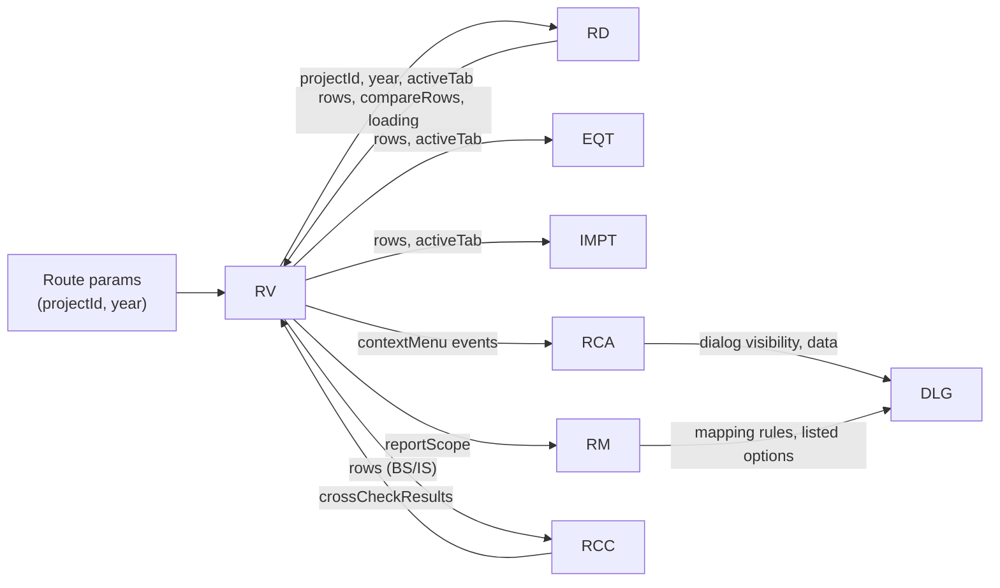

# Design Document: ReportView Slimdown

## Overview

纯前端重构——将 `ReportView.vue`（2944 行）拆分为 orchestrator 主文件 + 6 个 composable + 3 个子组件 + 1 个外置 CSS 文件，目标主文件 ≤750 行（硬上限 1500）。

遵循 DisclosureEditor 已验证模式：主文件保留顶部横幅/Tab 编排/路由胶水，业务逻辑全部下沉 composable，复杂模板片段提取为 SFC。

**关键约束**：
- 零功能变更、零后端改动、零新端点
- 所有既有 vitest 测试在重构后保持通过
- vue-tsc 零错误
- 先测后拆——特征测试在抽取前锁定行为

## Architecture

### Orchestrator Pattern

```mermaid
graph TD
    RV[ReportView.vue<br/>~750 行 orchestrator]

    subgraph Composables
        RD[useReportData]
        RM[useReportMapping]
        RCA[useReportCellActions]
        RCC[useReportCrossCheck]
        RE[useReportExport]
        RC[useReportColumns]
    end

    subgraph Sub-Components
        EQT[ReportEquityTable.vue]
        IMPT[ReportImpairmentTable.vue]
        DLG[ReportDialogs.vue]
    end

    subgraph External
        CSS[report-view.css<br/>~484 行 scoped]
    end

    subgraph Existing Composables
        CS[useCellSelection → rvCtx]
        SR[useStaleRefresh]
        PEN[usePenetrate → rvPenetrate]
        PE[useProjectEvents]
        FS[useFullscreen]
        CC[useCellComments → rvComments]
        TS[useTableSearch]
        AC[useAuditContext]
    end

    RV --> RD
    RV --> RM
    RV --> RCA
    RV --> RCC
    RV --> RE
    RV --> RC
    RV --> EQT
    RV --> IMPT
    RV --> DLG
    RV --> CSS
    RV --> CS
    RV --> SR
    RV --> PEN
    RV --> PE
    RV --> FS
```



### 数据流



## Components and Interfaces

### File Placement

| 类型 | 文件路径 |
|------|---------|
| 主文件 | `src/views/ReportView.vue` |
| composable | `src/views/composables/useReportData.ts` |
| composable | `src/views/composables/useReportMapping.ts` |
| composable | `src/views/composables/useReportCellActions.ts` |
| composable | `src/views/composables/useReportCrossCheck.ts` |
| composable | `src/views/composables/useReportExport.ts` |
| composable | `src/views/composables/useReportColumns.ts` |
| sub-component | `src/components/report/ReportEquityTable.vue` |
| sub-component | `src/components/report/ReportImpairmentTable.vue` |
| sub-component | `src/components/report/ReportDialogs.vue` |
| CSS | `src/views/report-view.css` |

> 注：composable 放 `src/views/composables/`（与 DisclosureEditor 同目录，视图专属逻辑非全局复用）。


### Composable Interfaces

#### 1. `useReportData`

报表数据获取、生成、模板行加载、对比行合并、自动校对。

```typescript
interface UseReportDataOptions {
  projectId: ComputedRef<string>
  year: ComputedRef<number>
  activeTab: Ref<string>
  reportMode: Ref<'audited' | 'unadjusted' | 'compare'>
  currentApplicableStandard: ComputedRef<string>
}

interface UseReportDataReturn {
  // State
  rows: Ref<ReportRow[]>
  compareRows: Ref<any[]>
  loading: Ref<boolean>
  genLoading: Ref<boolean>
  checkLoading: Ref<boolean>
  syncLoading: Ref<boolean>
  balanceCheckResult: Ref<{ status: string; message: string } | null>
  consistencyResult: Ref<ReportConsistencyCheck | null>
  tableMaxHeight: Ref<number>

  // Actions
  fetchReport: () => Promise<void>
  onGenerate: () => Promise<void>
  onConsistencyCheck: () => Promise<void>
  runBalanceCheck: () => Promise<void>
  loadTemplateRows: () => Promise<void>
  ensureProjectYear: () => Promise<void>
  reloadReportContext: () => Promise<void>

  // Derived
  activeTabLabel: ComputedRef<string>
  coverageSummary: ComputedRef<{ total: number; withData: number; text: string } | null>

  // Project metadata (populated by ensureProjectYear)
  projectName: Ref<string>
  reportScope: Ref<string>
  templateType: Ref<string>
  isConsolidated: ComputedRef<boolean>
}

export function useReportData(options: UseReportDataOptions): UseReportDataReturn
```

**行范围**：原文 ~1200–1810 行（fetchReport / loadTemplateRows / onGenerate / onConsistencyCheck / ensureProjectYear / runBalanceCheck / formatReportAmount / coverageSummary / getRowType / rowClassName / compareRowClassName）

#### 2. `useReportMapping`

转换规则（国企↔上市）的加载/保存/预设/模板应用。

```typescript
interface UseReportMappingOptions {
  projectId: ComputedRef<string>
  reportScope: Ref<string>
}

interface UseReportMappingReturn {
  // State
  showMappingDialog: Ref<boolean>
  mappingLoading: Ref<boolean>
  mappingTab: Ref<string>
  allMappingRules: Ref<Record<string, MappingRule[]>>
  allListedOptions: Ref<Record<string, ListedOption[]>>

  // Derived
  mappingReportTypes: { key: string; label: string }[]
  mappingTabLabel: ComputedRef<string>
  currentMappingRules: ComputedRef<MappingRule[]>
  currentListedOptions: ComputedRef<ListedOption[]>
  totalMappedCount: ComputedRef<number>
  totalRuleCount: ComputedRef<number>

  // Actions
  loadPresetMappingAll: () => Promise<void>
  saveMappingRulesAll: () => Promise<void>
  getMappingConfigData: () => Record<string, any>
  onMappingTemplateApplied: (configData: Record<string, any>) => void
}

export function useReportMapping(options: UseReportMappingOptions): UseReportMappingReturn
```

**行范围**：原文 ~1070–1200 行

#### 3. `useReportCellActions`

单元格点击/双击/右键菜单全部处理函数、穿透、附注引用反查、溯源、合并明细。

```typescript
interface UseReportCellActionsOptions {
  projectId: ComputedRef<string>
  year: ComputedRef<number>
  activeTab: Ref<string>
  rows: Ref<ReportRow[]>
  reportMode: Ref<string>
  isConsolidated: ComputedRef<boolean>
  fetchReport: () => Promise<void>
  activeTabLabel: ComputedRef<string>
  // 🔴 已有实例必须从主文件传入，不可在 composable 内重新 new（否则状态分裂）
  rvCtx: ReturnType<typeof useCellSelection>
  rvPenetrate: ReturnType<typeof usePenetrate>
  rvComments: ReturnType<typeof useCellComments>
}

interface UseReportCellActionsReturn {
  // Drilldown
  drilldownVisible: Ref<boolean>
  drilldownLoading: Ref<boolean>
  drilldownData: Ref<ReportDrilldownData | null>
  onDrilldown: (row: ReportRow) => Promise<void>

  // Line composition
  lineCompVisible: Ref<boolean>
  lineCompLoading: Ref<boolean>
  lineCompData: Ref<LineCompositionData | null>
  onLineComposition: (row: ReportRow) => Promise<void>
  onLineCompJumpToTB: (accountCode: string) => void

  // Note references
  noteRefsVisible: Ref<boolean>
  noteRefsLoading: Ref<boolean>
  noteRefsList: Ref<any[]>
  noteRefsRowCode: Ref<string>
  noteRefsRowName: Ref<string>
  onRvCtxShowNoteRefs: () => Promise<void>
  onJumpToNoteSection: (ref: { note_section: string; table_index: number }) => void

  // Cell trace (lineage)
  rvTraceDialogVisible: Ref<boolean>
  rvTraceLoading: Ref<boolean>
  rvTraceResult: Ref<{ upstream: any[]; downstream: any[] } | null>
  onRvCtxCellTrace: () => Promise<void>
  onRvTraceLocate: (node: any) => void

  // Audit dialog (consistency check results UI)
  showAuditDialog: Ref<boolean>
  auditTab: Ref<string>
  filteredAuditChecks: ComputedRef<any[]>
  onExportAuditExcel: () => void
  onAuditDrilldown: (check: any) => void

  // Trace select
  showTraceSelectDialog: Ref<boolean>
  traceSelectOptions: Ref<TraceLocation[]>
  isTracing: Ref<boolean>
  onTraceJump: (loc: TraceLocation) => void
  onTraceReturn: () => void

  // Consol breakdown
  consolBreakdownVisible: Ref<boolean>
  consolBreakdownAccountCode: Ref<string>
  onRvCtxViewConsolBreakdown: () => void

  // Formula source
  showCellFormulaDetail: Ref<boolean>
  cellDetailWpCode: Ref<string>
  onRvCtxViewFormulaSource: () => void
  onCellDetailNavigate: (uri: string) => void

  // Right-click actions
  onRvCellClick: (row: any, column: any, cell: HTMLElement, event: MouseEvent) => void
  onRvCellDblClick: (row: any, column: any) => void
  onRvCellContextMenu: (row: any, column: any, cell: HTMLElement, event: MouseEvent) => void
  onRvCtxCopy: () => void
  onRvCtxDrillDown: () => void
  onRvCtxFormula: () => void
  onRvCtxTrustScore: () => void
  onRvCtxGoNote: () => void
  onRvCtxOpenWorkpaper: () => Promise<void>
  onRvCtxViewAdjustments: () => void
  onRvCtxSum: () => void
  onRvCtxCompare: () => void
  onRowNameClick: (row: ReportRow) => void
}

export function useReportCellActions(options: UseReportCellActionsOptions): UseReportCellActionsReturn
```

**行范围**：原文 ~1860–2400 行

#### 4. `useReportCrossCheck`

跨表核对 7 条等式的数据加载与计算。

```typescript
interface UseReportCrossCheckOptions {
  projectId: ComputedRef<string>
  year: ComputedRef<number>
  activeTab: Ref<string>
  currentApplicableStandard: ComputedRef<string>
}

interface UseReportCrossCheckReturn {
  crossCheckData: Ref<Record<string, any>>
  crossCheckLoading: Ref<boolean>
  crossCheckResults: ComputedRef<CrossCheckItem[]>
  loadCrossCheckData: () => Promise<void>
}

interface CrossCheckItem {
  description: string
  leftValue: number | null
  rightValue: number | null
  diff: number | null
  passed: boolean
}

export function useReportCrossCheck(options: UseReportCrossCheckOptions): UseReportCrossCheckReturn
```

**行范围**：原文 ~1880–2000 行

#### 5. `useReportExport`

单表导出、全部导出、审核报告导出、表格复制。

```typescript
interface UseReportExportOptions {
  projectId: ComputedRef<string>
  year: ComputedRef<number>
  activeTab: Ref<string>
  rows: Ref<ReportRow[]>
  activeTabLabel: ComputedRef<string>
}

interface UseReportExportReturn {
  onExportExcel: () => void
  onExportAllExcel: () => void
  copyReportTable: () => void
  showReportImport: Ref<boolean>
  onReportImported: () => void
}

export function useReportExport(options: UseReportExportOptions): UseReportExportReturn
```

**行范围**：原文 ~2400–2460 行

#### 6. `useReportColumns`

权益变动表/减值准备表的动态列定义、span-method、行样式、单元格取值。

```typescript
interface UseReportColumnsOptions {
  isConsolidated: ComputedRef<boolean>
  activeTab: Ref<string>
  rows: Ref<ReportRow[]>
}

interface UseReportColumnsReturn {
  // Equity columns
  eqColumns: ComputedRef<{ key: string; label: string }[]>
  eqTotalCols: ComputedRef<number>
  equitySpanMethod: (params: { row: any; column: any; rowIndex: number; columnIndex: number }) => { rowspan: number; colspan: number }
  eqRowClassName: (params: { row: any }) => string
  eqCellVal: (row: any, colKey: string) => any

  // Impairment columns
  impIncCols: { key: string; label: string }[]
  impDecCols: { key: string; label: string }[]
  impRowClassName: (params: { row: any }) => string

  // Shared helpers
  getRowType: (row: ReportRow) => string
  rowClassName: (params: { row: ReportRow }) => string
  compareRowClassName: (params: { row: any }) => string
  formatReportAmount: (value: any) => { text: string; isNegative: boolean }
  getNoteSection: (rowCode: string) => string | null
  goToNote: (rowCode: string) => void
}

export function useReportColumns(options: UseReportColumnsOptions): UseReportColumnsReturn
```

**行范围**：原文 ~1350–1500 行 + 散落的辅助函数


### Sub-Component Interfaces

#### `ReportEquityTable.vue`

权益变动表 el-table 矩阵模板（含本年/上年动态列、三级表头）。

```typescript
// Props
interface ReportEquityTableProps {
  rows: ReportRow[]
  eqColumns: { key: string; label: string }[]
  eqTotalCols: number
  year: number
  tableMaxHeight: number
  cellClassName: (params: any) => string
  fontSize: string
}

// Emits
interface ReportEquityTableEmits {
  (e: 'cell-click', row: any, column: any, cell: HTMLElement, event: MouseEvent): void
  (e: 'cell-dblclick', row: any, column: any): void
  (e: 'cell-contextmenu', row: any, column: any, cell: HTMLElement, event: MouseEvent): void
}

// Expose
interface ReportEquityTableExpose {
  tableRef: Ref<any>  // for drag binding
}
```

**原文行范围**：模板 141–295 行

#### `ReportImpairmentTable.vue`

减值准备表 el-table 矩阵模板（含增加/减少嵌套列）。

```typescript
// Props
interface ReportImpairmentTableProps {
  rows: ReportRow[]
  impIncCols: { key: string; label: string }[]
  impDecCols: { key: string; label: string }[]
  tableMaxHeight: number
  cellClassName: (params: any) => string
  fontSize: string
}

// Emits
interface ReportImpairmentTableEmits {
  (e: 'cell-click', row: any, column: any, cell: HTMLElement, event: MouseEvent): void
  (e: 'cell-dblclick', row: any, column: any): void
  (e: 'cell-contextmenu', row: any, column: any, cell: HTMLElement, event: MouseEvent): void
}

// Expose
interface ReportImpairmentTableExpose {
  tableRef: Ref<any>
}
```

**原文行范围**：模板 296–340 行

#### `ReportDialogs.vue`

统一弹窗容器——穿透弹窗、构成科目弹窗、审核结果弹窗、溯源弹窗、转换规则弹窗、溯源选择弹窗、附注引用 Drawer、合并明细弹窗。

```typescript
// Props
interface ReportDialogsProps {
  // Drilldown
  drilldownVisible: boolean
  drilldownLoading: boolean
  drilldownData: ReportDrilldownData | null

  // Line composition
  lineCompVisible: boolean
  lineCompLoading: boolean
  lineCompData: LineCompositionData | null

  // Audit check
  showAuditDialog: boolean
  consistencyResult: ReportConsistencyCheck | null
  auditTab: string
  filteredAuditChecks: any[]

  // Trace select
  showTraceSelectDialog: boolean
  traceSelectOptions: TraceLocation[]

  // Note refs
  noteRefsVisible: boolean
  noteRefsLoading: boolean
  noteRefsList: any[]
  noteRefsRowCode: string
  noteRefsRowName: string

  // Cell trace
  rvTraceDialogVisible: boolean
  rvTraceLoading: boolean
  rvTraceResult: { upstream: any[]; downstream: any[] } | null

  // Mapping
  showMappingDialog: boolean
  mappingLoading: boolean
  mappingTab: string
  mappingReportTypes: { key: string; label: string }[]
  currentMappingRules: any[]
  currentListedOptions: any[]
  totalMappedCount: number
  totalRuleCount: number

  // Consol breakdown
  consolBreakdownVisible: boolean
  consolBreakdownAccountCode: string
  projectId: string
  year: number

  // Formula detail
  showCellFormulaDetail: boolean
  cellDetailWpCode: string
}

// Emits
interface ReportDialogsEmits {
  (e: 'update:drilldownVisible', val: boolean): void
  (e: 'update:lineCompVisible', val: boolean): void
  (e: 'update:showAuditDialog', val: boolean): void
  (e: 'update:showTraceSelectDialog', val: boolean): void
  (e: 'update:noteRefsVisible', val: boolean): void
  (e: 'update:rvTraceDialogVisible', val: boolean): void
  (e: 'update:showMappingDialog', val: boolean): void
  (e: 'update:consolBreakdownVisible', val: boolean): void
  (e: 'update:showCellFormulaDetail', val: boolean): void
  (e: 'update:mappingTab', val: string): void
  (e: 'update:auditTab', val: string): void
  (e: 'line-comp-jump', accountCode: string): void
  (e: 'audit-drilldown', check: any): void
  (e: 'audit-export-excel'): void
  (e: 'trace-jump', loc: TraceLocation): void
  (e: 'trace-return'): void
  (e: 'trace-locate', node: any): void
  (e: 'note-ref-jump', ref: { note_section: string; table_index: number }): void
  (e: 'mapping-load-preset'): void
  (e: 'mapping-save'): void
  (e: 'mapping-template-applied', data: Record<string, any>): void
  (e: 'cell-detail-navigate', uri: string): void
}
```

**原文行范围**：模板 571–930 行

## Data Models

本 spec 不引入新数据模型——所有类型定义复用 `auditPlatformApi.ts` 中已有的 `ReportRow`、`ReportDrilldownData`、`ReportConsistencyCheck`，以及各 composable 内部定义的 `MappingRule`、`ListedOption`、`LineCompositionData`、`TraceLocation`、`CrossCheckItem` 等接口。

每个 composable 的 Options/Return 接口在各自文件顶部导出，主文件通过 import type 引用。

## Correctness Properties

*A property is a characteristic or behavior that should hold true across all valid executions of a system — essentially, a formal statement about what the system should do. Properties serve as the bridge between human-readable specifications and machine-verifiable correctness guarantees.*

### Property 1: Behavioral Equivalence (Primary Property)

*For any* user interaction sequence on ReportView (tab switch, button click, right-click menu action, keyboard shortcut), the observable behavior (API calls issued, DOM output rendered, events emitted to parent/router) after slimdown SHALL be identical to before slimdown.

**Validates: Requirements 1.1, 1.4, 1.6**

### Property 2: File Size Invariant

*For any* file produced by this extraction (composable or sub-component), its line count SHALL be ≤1500 lines. The main ReportView.vue SHALL also be ≤1500 lines.

**Validates: Requirements 2.1, 2.4**

### Property 3: Type Safety — Explicit Interfaces

*For any* extracted composable, it SHALL export a function with an explicitly typed options parameter and explicitly typed return value. *For any* extracted sub-component, it SHALL define `defineProps` and `defineEmits` with TypeScript generics (no runtime-only declarations).

**Validates: Requirements 3.8, 4.4**

### Property 4: CSS Selector Completeness

*For any* CSS selector that existed in the original `<style scoped>` block of ReportView.vue, that selector SHALL exist in the externalized `report-view.css` file (or in a sub-component's own scoped style if the selector is specific to that sub-component's template).

**Validates: Requirements 5.3, 5.4**

## Error Handling

本 spec 是纯重构，不改变任何错误处理逻辑。所有 `try/catch`、`handleApiError`、`ElMessage.warning/error` 调用原样保留在抽取后的 composable 中。

迁移原则：
- API 调用的 `try/catch` 跟随其调用方迁移（如 `fetchReport` 的错误处理随 `useReportData` 迁移）
- UI 反馈（`ElMessage`）在 composable 内直接调用（已有先例：`useNoteSectionManage` 内部调 `ElMessage`）
- 主文件不需要包装 composable 返回的 action——composable 内部自行处理错误

## Testing Strategy

### 1. 特征测试（Characterization Tests）——拆分前编写（聚焦纯函数）

在 `src/views/__tests__/ReportView.characterization.spec.ts` 中捕获现有纯函数行为快照（无需 mount 组件，避免 mock 35+ 依赖）：

| 测试用例 | 验证点 |
|---------|--------|
| 权益表 span-method | equitySpanMethod 对分类行返回 colspan |
| 行类型判定 6 种 | getRowType 对 header/total/special/manual/zero/data |
| 跨表核对 7 条等式 | crossCheckResults 公式正确性 |
| formatReportAmount | 千分位 + 负数括号 |

> **需 mount 的交互用例**（Tab 切换触发 fetchReport / 刷新按钮调 generateReports / 对比视图合并 / 右键菜单穿透）**不在特征测试**——改为抽取后对应 composable 单测覆盖（useReportData.spec / useReportCellActions.spec），mock 精简依赖。

### 2. Composable 单元测试——抽取后编写

每个 composable 一个 spec 文件（位于 `src/views/composables/__tests__/`）：

- `useReportData.spec.ts` — mock API，验证 fetchReport/onGenerate/loadTemplateRows
- `useReportMapping.spec.ts` — mock API，验证 loadPreset/save/templateApply
- `useReportCellActions.spec.ts` — mock router/API，验证 click/dblclick/contextmenu handlers
- `useReportCrossCheck.spec.ts` — mock API，验证 7 条等式计算
- `useReportExport.spec.ts` — mock downloadFileAsBlob，验证 export URL 拼接
- `useReportColumns.spec.ts` — 纯计算，验证 eqColumns/spanMethod/getRowType

### 3. Property-Based Testing

使用 `fast-check` 库（项目前端已有 vitest 生态，fast-check 与 vitest 兼容）。

**配置要求**：
- 每个 property test `numRuns: 5`（项目铁律，禁默认 100）
- 每个 test 以注释标注对应 design property

```typescript
// Feature: report-view-slimdown, Property 1: Behavioral Equivalence
// (characterization snapshot comparison — for pure functions like getRowType, formatReportAmount)
test.prop([fc.record(...)], { numRuns: 5 })('getRowType produces same result before/after extraction', (row) => {
  expect(getRowType(row)).toBe(originalGetRowType(row))
})

// Feature: report-view-slimdown, Property 4: CSS Selector Completeness
// (static analysis — compare selector sets)
```

### 4. 验证清单（CI 门禁）

1. `vue-tsc --noEmit` → 0 errors（含所有新文件）
2. `vitest run` → 全部 pass（含特征测试 + composable 单测）
3. `check_file_size.py` → ReportView.vue ≤ HARD_CAP
4. 抽取后的每个文件 ≤1500 行

### 5. Dual Testing Approach

- **Unit tests**：特征测试（具体例子锁定行为）+ composable spec（边界条件）
- **Property tests**：纯函数（getRowType、formatReportAmount、crossCheck 计算、equitySpanMethod）用 fast-check 随机输入验证
- 二者互补：unit test 抓具体回归，property test 验证通用正确性

**Property-Based Testing 标注格式**：`Feature: report-view-slimdown, Property {N}: {title}`

## CSS Externalization Strategy

1. 将 `<style scoped>` 全部内容（~484 行）移到 `src/views/report-view.css`
2. 主文件改为 `<style scoped src="./report-view.css" />`
3. Vite/Vue SFC compiler 自动为 src 引入的样式添加 scoped attribute hash，作用域不变
4. 子组件（ReportEquityTable/ReportImpairmentTable）如需专属样式，在各自 SFC 内 `<style scoped>` 中定义——仅移动与该组件模板强相关的选择器（如 `.gt-rv-equity-matrix`）
5. ReportDialogs 的弹窗样式保留在主 CSS 中（弹窗挂载在 body，scoped 通过 `:deep()` 穿透）
