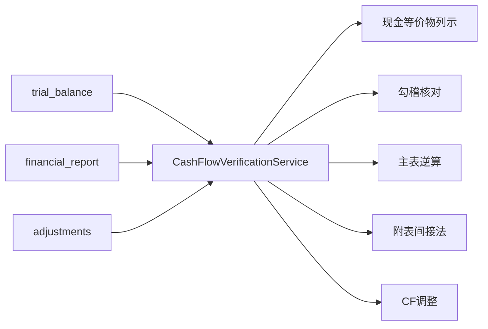

# Design: 现金流量表核查模块

## Overview

新建 CF（Cash Flow）核查子模块，提供：现金等价物列示、BS-CF 勾稽核对、主表逆算验证、附表间接法验证、CF 调整分录。数据源全部来自 trial_balance + financial_report + adjustments，无需用户手动录入底层数据。

## Architecture



## Components and Interfaces

### 1. 后端服务

```python
# cash_flow_verification_service.py
class CashFlowVerificationService:
    """现金流量表核查服务"""

    async def get_cash_equivalents(self, project_id, year) -> dict:
        """A5-1-1: 现金及现金等价物列示"""
        # 从 TB 取 1001/1002/1012/1101 等科目期末余额
        # 标记受限资金（>3月定期/冻结款）
        # 计算总额 vs BS 货币资金行差异
        ...

    async def reconcile_bs_cf(self, project_id, year) -> dict:
        """A5-1-3: BS期末-期初 = CF净增加"""
        bs_end = await self._get_bs_cash(project_id, year, 'end')
        bs_begin = await self._get_bs_cash(project_id, year, 'begin')
        cf_net = await self._get_cf_net_increase(project_id, year)
        diff = (bs_end - bs_begin) - cf_net
        return {'bs_end': bs_end, 'bs_begin': bs_begin, 'cf_net': cf_net, 'diff': diff, 'pass': abs(diff) < 0.01}

    async def verify_main_table(self, project_id, year) -> list[dict]:
        """A5-1-4/5: 主表逆算验证"""
        items = []
        # 销售收到现金 ≈ 收入 + (应收期初-期末) + (预收期末-期初) + 增值税
        items.append(await self._verify_sales_received(project_id, year))
        # 购买支付现金 ≈ 成本 + (存货期末-期初) + (应付期初-期末) + 增值税
        items.append(await self._verify_purchase_paid(project_id, year))
        # ... 经营/投资/筹资各项
        return items

    async def verify_supplementary(self, project_id, year) -> dict:
        """A5-1-附表: 间接法核对"""
        # 净利润 + 折旧 + 摊销 + 减值 + 处置损益 + 营运资本变动 = 经营CF
        net_profit = await self._get_net_profit(project_id, year)
        adjustments = await self._calc_indirect_adjustments(project_id, year)
        indirect_total = net_profit + sum(adjustments.values())
        direct_total = await self._get_operating_cf(project_id, year)
        return {
            'net_profit': net_profit,
            'adjustments': adjustments,
            'indirect_total': indirect_total,
            'direct_total': direct_total,
            'diff': indirect_total - direct_total,
        }
```

### 2. 逆算公式配置

```json
// backend/data/cf_verification_formulas.json
{
  "operating": [
    {
      "item": "销售商品、提供劳务收到的现金",
      "row_code": "CF-001",
      "formula": "revenue + (ar_begin - ar_end) + (advance_end - advance_begin) + vat_output",
      "components": {
        "revenue": {"source": "PL", "row_code": "PL-001"},
        "ar_begin": {"source": "TB", "accounts": ["1122"], "period": "begin"},
        "ar_end": {"source": "TB", "accounts": ["1122"], "period": "end"},
        ...
      }
    },
    ...
  ],
  "investing": [...],
  "financing": [...]
}
```

### 3. 前端视图

```typescript
// CashFlowVerification.vue — CF 核查主视图
// Tab: 现金等价物 | 勾稽核对 | 主表逆算 | 附表间接法 | CF调整
// 每个 Tab 对应一个子组件
// 差异项高亮（红/黄）+ 用户可填写原因说明
// "导出"按钮 → 按 A5-1 模板格式输出 Excel
```

## Data Models

不新增主表。新增：
- `cf_verification_results` 表：缓存核查结果 + 用户填写的差异说明
- `cf_adjustments` 复用 adjustments 表（adjustment_type='CF'）

## Testing Strategy

- 单元测试：每个逆算公式的计算正确性（用已知数据验证）
- PBT：随机 TB 数据 → 验证勾稽公式恒等
- 集成测试：真实项目数据跑一遍全部核查项
