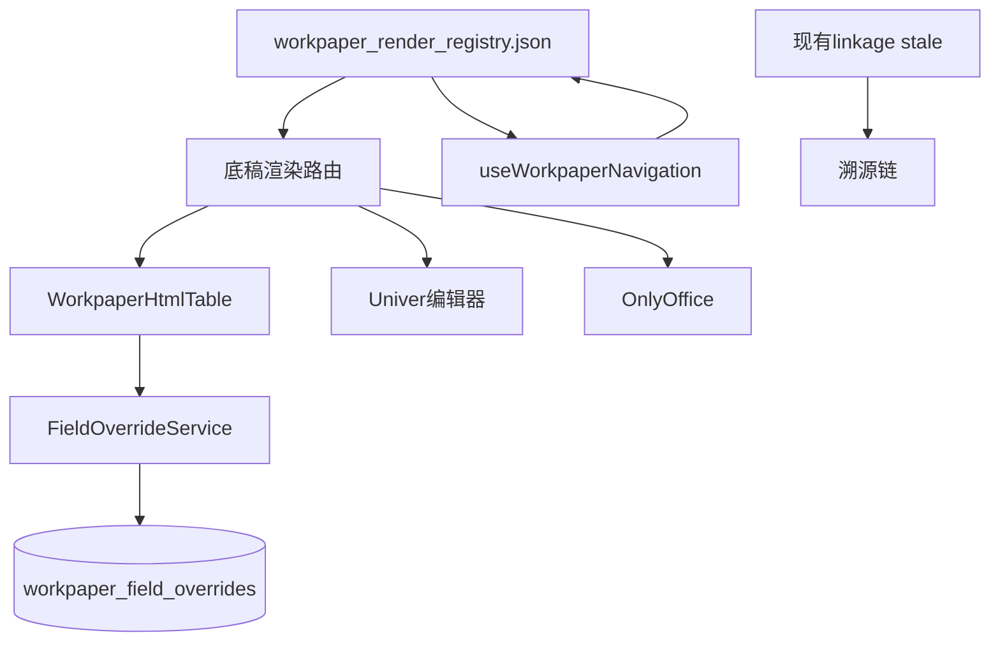

# Design: 底稿基础设施套件

## Overview

提供 A 循环改造的 4 大共享基础设施：索引跳转、字段覆盖存储、HTML 渲染框架、底稿类型注册表，并复用现有 linkage stale 机制实现溯源链。所有上层 spec 依赖本套件。

## Architecture



## Components and Interfaces

### 1. useWorkpaperNavigation (前端)

```typescript
// composables/useWorkpaperNavigation.ts
export function useWorkpaperNavigation() {
  const router = useRouter()
  const registry = useWorkpaperRegistry()  // 从注册表取映射

  /** 解析索引号字符串（可含多个，逗号分隔）为可点击链接数组 */
  function parseIndexRefs(refStr: string): IndexRef[] {
    // "A1-13,A1-14" → [{code:'A1-13', exists, target}, {code:'A1-14',...}]
  }

  /** 跳转到指定 wp_code 对应的底稿/视图 */
  async function navigateToWorkpaper(wpCode: string, projectId: string, year: number) {
    const entry = registry.lookup(wpCode)
    if (!entry) { ElMessage.warning(`未知索引号 ${wpCode}`); return }
    if (!entry.generated) { ElMessage.warning('该底稿尚未生成'); return }
    router.push(entry.resolveRoute(projectId, year))
  }

  return { parseIndexRefs, navigateToWorkpaper }
}
```

### 2. FieldOverrideService (后端)

```python
# field_override_service.py
class FieldOverrideService:
    """统一字段覆盖存储服务"""

    async def get(self, project_id, year, scope, item_key, field) -> Any | None:
        ...

    async def get_batch(self, project_id, year, scope) -> dict:
        """返回该 scope 下所有覆盖值 {item_key: {field: value}}"""
        ...

    async def set(self, project_id, year, scope, item_key, field, value, user_id):
        """upsert 覆盖值"""
        ...

    @staticmethod
    def merge(auto_values: dict, overrides: dict) -> dict:
        """自动值 + 覆盖值合并（覆盖优先）"""
        ...
```

```sql
-- V076: workpaper_field_overrides (本 spec 占首个迁移号)
CREATE TABLE IF NOT EXISTS workpaper_field_overrides (
    id UUID PRIMARY KEY DEFAULT gen_random_uuid(),
    project_id UUID NOT NULL,
    year INT NOT NULL,
    scope VARCHAR(50) NOT NULL,      -- 'procedure_table:A1' / 'review:A23' / 'report_analysis:bs_trend'
    item_key VARCHAR(100) NOT NULL,  -- 行/项标识
    field VARCHAR(50) NOT NULL,      -- 'applicable'/'executor'/'summary'/'explanation'
    value JSONB,
    updated_by UUID REFERENCES users(id),
    updated_at TIMESTAMPTZ NOT NULL DEFAULT now(),
    UNIQUE(project_id, year, scope, item_key, field)
);
```

### 3. WorkpaperHtmlTable (前端)

```typescript
// components/workpaper/WorkpaperHtmlTable.vue
// Props:
//   - header: { entityName, wpName, indexNo, preparer, reviewer, dates } (致同标准表头)
//   - columns: ColumnDef[]  (列定义: type=text/tristate/editable/indexLink/computed)
//   - rows: RowData[]
//   - scope: string  (字段覆盖存储的 scope)
// Emits: field-change (失焦保存到 FieldOverrideService)
// 内置: 索引链接调用 useWorkpaperNavigation; 导出 Excel; GT 紫样式 + gt-compact-table
```

### 4. 底稿类型注册表

```json
// backend/data/workpaper_render_registry.json
{
  "A1":    {"render_type": "html_procedure", "module": "procedure_table", "categories": ["A","B","C"]},
  "A2":    {"render_type": "html_procedure", "data_source": "adjustments", "categories": ["A","B","C"]},
  "A2-1":  {"render_type": "auto_report", "module": "report", "categories": ["A","B","C"]},
  "A5-1":  {"render_type": "auto_report", "module": "cf_verification", "categories": ["A","B","C"]},
  "A13":   {"render_type": "html_procedure", "data_source": "adjustments", "categories": ["A","B","C"]},
  "A16-1": {"render_type": "word_template", "module": "delivery", "categories": ["A","B","C"]},
  "A17-7": {"render_type": "signing", "categories": ["A"]},
  "A21-1": {"render_type": "html_review", "role": "field_lead", "categories": ["A","B","C"]},
  "A30":   {"render_type": "html_review", "subtype": "archive_check", "categories": ["A","B","C"]},
  "A31":   {"render_type": "readonly_reference", "categories": ["A","B","C"]},
  ...
}
```

### 5. 溯源链（复用现有 linkage）

- 不新建机制，复用 `event_bus` + `linkage:stale-changed` + `address_registry`
- 底稿间引用关系存储在注册表的 `upstream`/`downstream` 字段
- 溯源视图前端组件 `WorkpaperTraceView.vue` 读取关系渲染

## Data Models

| 表/文件 | 用途 |
|---------|------|
| workpaper_field_overrides | 统一字段覆盖存储（V076） |
| workpaper_render_registry.json | 底稿类型+渲染方式+数据源+溯源关系 |

## Testing Strategy

- 单元测试：FieldOverrideService get/set/merge；索引解析 parseIndexRefs
- PBT：随机 scope+item_key+field → set/get 往返一致
- 集成测试：注册表查找 → 正确 render_type
- 组件测试：WorkpaperHtmlTable 各列类型渲染 + 失焦保存
