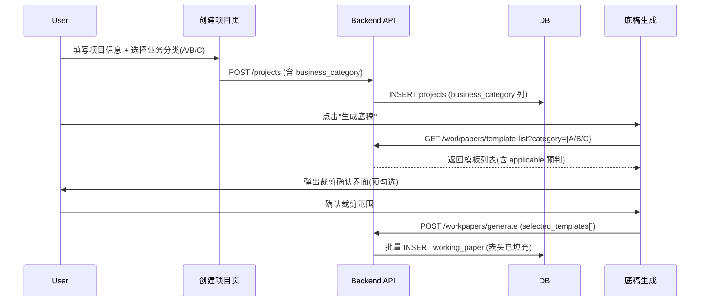

# Design: 底稿表头自动填充与业务分类裁剪

## Overview

本设计解决三个紧密关联的问题：底稿表头自动填充、项目业务分类(A/B/C)、底稿裁剪确认。核心改动集中在项目模型扩展+底稿生成流程重构+前端裁剪 UI。

## Architecture



## Components and Interfaces

### 1. 数据模型扩展

```sql
-- V076: projects 表新增 business_category
ALTER TABLE projects ADD COLUMN IF NOT EXISTS business_category VARCHAR(10) DEFAULT 'C';
-- 值域: 'A1'~'A8', 'B1'~'B6', 'C'

-- wp_account_mapping.json 扩展字段
-- 每条模板增加 "applicable_categories": ["A","B","C"] 或 "a_only": true
```

### 2. 后端接口

```python
# 新增/修改端点

# GET /api/workpapers/template-list?project_id={}&category={}
# 返回按循环分组的模板列表，每项含 applicable 预判
@router.get("/template-list")
async def get_template_list(project_id: UUID, db=Depends(get_db)):
    project = await get_project(db, project_id)
    category = project.business_category or 'C'
    templates = load_wp_account_mapping()
    for t in templates:
        t['applicable'] = is_template_applicable(t, category)
    return templates

# POST /api/workpapers/generate — 修改现有端点
# 增加 selected_templates 参数（裁剪后的模板 ID 列表）
async def generate_project_workpapers(
    project_id, year, selected_templates: list[str] | None = None, ...
):
    # 如果传了 selected_templates，只生成这些
    # 否则按 category 自动过滤（兼容旧逻辑）
    ...
```

### 3. 表头填充逻辑

```python
# wp_header_service.py（新建）
class WpHeaderService:
    """底稿表头自动填充服务"""

    HEADER_FIELDS = {
        '${entity_name}': lambda p: p.client_name or p.name,
        '${audit_period}': lambda p: f"{p.audit_year}年度",
        '${period_end}': lambda p: p.audit_period_end.strftime('%Y.%m.%d') if p.audit_period_end else '',
        '${index_no}': lambda wp: wp.wp_code,
        '${preparer}': lambda wp: wp.assigned_to_name or '',
        '${prepare_date}': lambda wp: wp.created_at.strftime('%Y.%m.%d') if wp.created_at else '',
        '${reviewer}': lambda wp: wp.reviewer_name or '',
        '${review_date}': lambda wp: wp.reviewed_at.strftime('%Y.%m.%d') if wp.reviewed_at else '',
    }

    async def fill_header(self, workpaper, project) -> dict:
        """返回表头字段映射，供 Univer 渲染或导出时使用"""
        ...
```

### 4. 前端裁剪确认组件

```typescript
// WorkpaperTrimDialog.vue
// 按循环分组的树形 checkbox
// 根据 business_category 自动预勾选
// 显示每个模板的 applicable 状态（推荐/不推荐/A类专属）
```

### 5. 业务分类参考数据

```json
// backend/data/business_category_reference.json
{
  "A": {
    "subcategories": [
      {"code": "A1", "name": "上市公司", "description": "..."},
      {"code": "A2", "name": "IPO首次申报", "description": "..."},
      ...
    ],
    "quality_measures": "需专委会审批+EQCR复核",
    "exclusive_templates": ["A1-12","A1-16","A17*","A18*","A24*","A25*","A26*","A27","A28"]
  },
  "B": { ... },
  "C": { ... }
}
```

## Data Models

| 字段 | 表 | 类型 | 说明 |
|------|---|------|------|
| business_category | projects | VARCHAR(10) | 'A1'~'A8'/'B1'~'B6'/'C' |
| applicable_categories | wp_account_mapping.json | string[] | 模板适用的业务类型 |
| header_filled | working_paper | BOOLEAN | 表头是否已填充 |

## Error Handling

- 业务分类未选择时默认 C 类（不阻塞）
- 裁剪确认界面为空（无可选模板）时提示"请先确认业务分类"
- 表头填充失败（如项目信息不完整）时保留占位符并 warning

## Testing Strategy

- 单元测试：`is_template_applicable` 对 A/B/C 各类型的过滤正确性
- 集成测试：生成底稿后验证表头字段已填充（非占位符）
- PBT：随机 business_category + 随机模板列表 → 验证裁剪结果一致性
