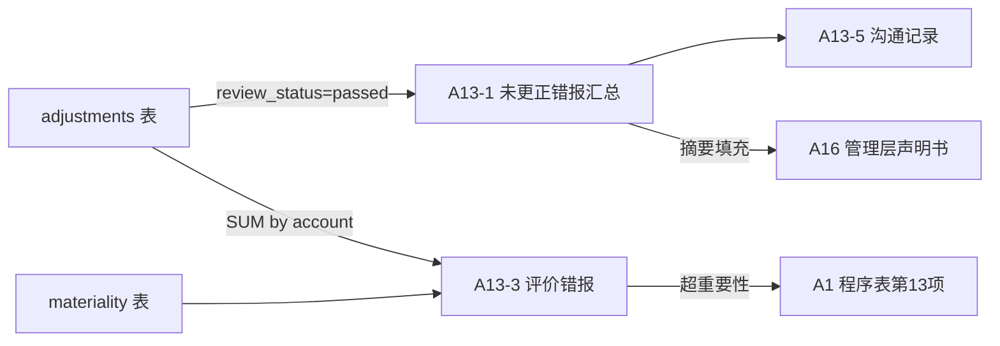

# Design: A13 错报自动生成与跨模块溯源

## Overview

A13 底稿（5 sheet）的数据源全部来自 `adjustments` 表。核心设计：不再作为独立 Excel 底稿存在，而是作为调整分录模块的**视图层**——从 passed 状态的调整分录自动聚合生成。与 A16 管理层声明书通过共享数据源实现联动。

## Architecture



## Components and Interfaces

### 1. 后端服务

```python
# misstatement_summary_service.py（新建）
class MisstatementSummaryService:
    """A13 错报汇总服务 — 从 adjustments(passed) 自动聚合"""

    async def get_uncorrected_misstatements(self, project_id, year) -> dict:
        """返回 A13-1 数据结构"""
        # 查询 adjustments WHERE review_status='passed'
        # 按 prior_period/current_period 分组
        # 每条含：adjustment_no, description, wp_index_code(索引), 
        #         debit_account, debit_amount, credit_account, credit_amount,
        #         misstatement_nature, mgmt_reason
        ...

    async def evaluate_misstatements(self, project_id, year) -> dict:
        """返回 A13-3 评价数据：汇总金额 vs 重要性"""
        total = await self._sum_passed_adjustments(project_id, year)
        materiality = await self._get_materiality(project_id)
        return {
            'total_aje': total['aje'],
            'total_rje': total['rje'],
            'materiality': materiality,
            'exceeds': total['aje'] > materiality or total['rje'] > materiality,
            'suggested_conclusion': self._suggest_conclusion(total, materiality),
        }

    async def get_for_representation_letter(self, project_id, year) -> str:
        """返回 A16 声明书用的错报摘要文本"""
        items = await self.get_uncorrected_misstatements(project_id, year)
        if not items['current'] and not items['prior']:
            return "无未更正错报。"
        return self._format_for_letter(items)
```

### 2. 前端视图

```typescript
// MisstatementSummaryView.vue — A13 底稿的 HTML 呈现
// 不使用 Univer，而是 HTML 表格
// 数据从 GET /api/workpapers/{project_id}/misstatement-summary 获取
// 索引号列可跳转到来源底稿
// 支持用户补充"管理层不予更正原因"（回写 adjustment.passed_reason）
```

### 3. API 端点

```
GET  /api/workpapers/{project_id}/{year}/misstatement-summary    → A13-1 数据
GET  /api/workpapers/{project_id}/{year}/misstatement-evaluation  → A13-3 数据
GET  /api/workpapers/{project_id}/{year}/misstatement-for-letter  → A16 用摘要
POST /api/workpapers/{project_id}/{year}/misstatement-communication → A13-5 沟通记录
```

## Data Models

不新增主表——复用 `adjustments` 表 + `materiality` 表 + 基础设施 `workpaper_field_overrides`（A13-2 披露错报）。

新增字段：
- `adjustments.passed_reason` VARCHAR — 管理层不予更正原因（A13-1 第10列）
- `adjustments.passed_communication_date` TIMESTAMPTZ — 沟通日期

A13-2 披露错报存储在 `workpaper_field_overrides`（scope='misstatement:disclosure'），不混入金额型 adjustments。

## Testing Strategy

- PBT：随机生成 N 条 adjustments(passed) → 验证汇总金额一致
- 集成测试：passed 数量变化 → A13 视图实时反映
- 联动测试：A13 摘要 → A16 声明书占位符正确填充
