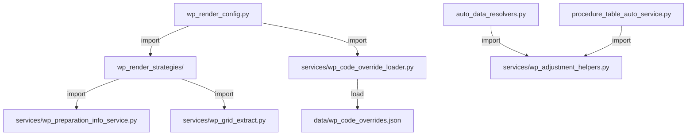

# 底稿模块健康度二期 — 设计文档

## Overview

本设计覆盖 9 项 P1/P2 代码健康度治理：循环依赖消除、helper 下沉、测试补全、重复代码 DRY、大 dict 外置、docstring 补全、注册完整性断言、大文件预防性拆分。

核心原则：
- **零回归**：所有重构操作必须通过 1096 render-config 冒烟测试 + 2457 循环验证测试
- **渐进式**：每个 Requirement 独立可交付，互不阻塞
- **最小侵入**：不改 API 响应结构、不改 componentType 语义、不改前端

## Architecture

### 当前架构痛点

```
wp_render_config.py (1156行)
  ├── _build_preparation_info()      ← 被策略反向 import（循环依赖）
  ├── _generate_b_index_data()       ← 已被 _b_index.py 策略替代，冗余
  ├── _generate_a_program_data()     ← 同上
  ├── _generate_grid_data()          ← 同上
  ├── _fetch_audit_sheet_tb_values() ← 同上
  └── get_render_config()            ← 119行 dispatch 主函数（正常）
```

### 目标架构

```
wp_render_config.py (≤800行)
  └── get_render_config() + 辅助（_resolve_sheet_type / _unpack_sheet_schema / 端点）

services/
  ├── wp_preparation_info_service.py   ← NEW: _build_preparation_info 迁入
  ├── wp_adjustment_helpers.py         ← NEW: 共享 _count_adjustments
  └── wp_code_override_loader.py       ← NEW: JSON 加载+验证+热重载

data/
  └── wp_code_overrides.json           ← NEW: 910条映射外置

routers/
  ├── wp_template_files.py (≤800行)    ← 仅保留核心端点+公共helper
  ├── wp_template_xlsx.py              ← NEW: xlsx 转换端点
  └── wp_template_docx.py             ← NEW: docx 转换端点
```

### 依赖流向（修正后）



注意：策略文件不再反向 import router 文件，循环依赖消除。

## Components and Interfaces

### 1. WpPreparationInfoService（Req 1）

**文件**: `backend/app/services/wp_preparation_info_service.py`

```python
"""底稿编制信息服务 — 从 router 下沉的纯 service 层

提供 build_preparation_info(db, project_id, wp_id) 异步方法，
返回底稿表头编制信息字典（7 字段）。
"""
from __future__ import annotations
from uuid import UUID
from sqlalchemy.ext.asyncio import AsyncSession


async def build_preparation_info(
    db: AsyncSession,
    project_id: UUID,
    wp_id: UUID,
) -> dict[str, str]:
    """编制信息 JOIN（workpaper 级表头 + B-Index 共用）。

    Returns:
        {entity_name, period_end, preparer, prep_date,
         reviewer, review_date, index_no}
    """
    ...
```

**调用方变更**:
- `_b_index.py`: `from app.routers.wp_render_config import _build_preparation_info` → `from app.services.wp_preparation_info_service import build_preparation_info`
- `_c_note.py`: 同上
- `wp_render_config.py`: 删除 `_build_preparation_info` 定义，endpoint `get_preparation_info` 改为调用 service

### 2. Helper 迁移目标（Req 2）

| 函数 | 当前位置 | 目标位置 | 理由 |
|------|----------|----------|------|
| `_build_preparation_info` | wp_render_config.py L258-320 | `services/wp_preparation_info_service.py` | Req 1，被多策略调用 |
| `_generate_b_index_data` | wp_render_config.py L323-388 | **删除**（已被 `_b_index.py` render() 替代） | 策略已实现相同逻辑 |
| `_generate_a_program_data` | wp_render_config.py L394-475 | **删除**（已被 `_a_program.py` render() 替代） | 策略已实现相同逻辑 |
| `_generate_grid_data` | wp_render_config.py L481-508 | **删除**（已被 `_univer_grid.py` render() 替代） | 策略已实现相同逻辑 |
| `_fetch_audit_sheet_tb_values` | wp_render_config.py L528-600 | `services/wp_audit_sheet_tb_service.py` | 被 `_audit_sheet.py` 策略调用 |
| `_generate_audit_sheet_data` | wp_render_config.py L603-680 | **删除**（已被 `_audit_sheet.py` render() 替代） | 策略已实现相同逻辑 |
| `_has_grid_cells` | wp_render_config.py L479 | 随 `_generate_grid_data` 删除 | helper 的 helper |
| `_decimal_to_float` | wp_render_config.py L514-523 | 移入 `services/wp_audit_sheet_tb_service.py` | 仅被 TB 取数使用 |

**预估行数减少**: ~350 行删除/迁出 → wp_render_config.py 从 1156 降至 ~800 行

### 3. 共享调整计数 Helper（Req 5）

**文件**: `backend/app/services/wp_adjustment_helpers.py`

```python
"""调整分录计数共享 helper

统一 _count_adjustments / _count_adjustments_with_pending 实现，
消除 auto_data_resolvers.py 和 procedure_table_auto_service.py 重复。
"""
from __future__ import annotations
from uuid import UUID
import sqlalchemy as sa
from sqlalchemy.ext.asyncio import AsyncSession


async def count_adjustments(
    db: AsyncSession, project_id: UUID, year: int, adj_type: str
) -> int:
    """按类型统计调整分录数。

    adj_type: "aje" | "rje" | "passed"
    passed 特殊处理：按 passed_reason IS NOT NULL 判定。
    """
    ...


async def count_adjustments_with_pending(
    db: AsyncSession, project_id: UUID, year: int, adj_type: str
) -> tuple[int, int, float]:
    """按类型统计：(总数, 待审批数, 借方总金额)。"""
    ...
```

**调用方变更**:
- `auto_data_resolvers.py`: 删除本地 `_count_adjustments` + `_count_adjustments_with_pending`，改为 `from app.services.wp_adjustment_helpers import count_adjustments, count_adjustments_with_pending`
- `procedure_table_auto_service.py`: 删除 `ProcedureTableService._count_adjustments` + `_count_adjustments_with_pending` 方法，改为调用共享 helper

### 4. wp_code_overrides.json（Req 6）

**文件**: `backend/app/data/wp_code_overrides.json`

**格式**: 扁平 `{wp_code: componentType}` 对象

```json
{
  "A1": "a1-dashboard",
  "A1-11": "wp-popup-signing",
  "A1-12": "checklist-table",
  ...
}
```

**加载器**: `backend/app/services/wp_code_override_loader.py`

```python
"""_WP_CODE_OVERRIDE JSON 外置加载器

启动时读取 + 验证；运行时基于 mtime 热重载。
"""
from __future__ import annotations
import json
import os
from pathlib import Path

_JSON_PATH = Path(__file__).resolve().parent.parent.parent / "data" / "wp_code_overrides.json"
_cache: dict[str, str] | None = None
_mtime: float = 0.0


def load_wp_code_overrides() -> dict[str, str]:
    """加载并验证 override 映射。mtime 变化时自动重载。"""
    ...


def validate_overrides(overrides: dict[str, str]) -> None:
    """验证所有 value ∈ VALID_COMPONENT_TYPES，否则 raise ValueError。"""
    from app.services.wp_classification_service import VALID_COMPONENT_TYPES
    invalid = {k: v for k, v in overrides.items() if v not in VALID_COMPONENT_TYPES}
    if invalid:
        raise ValueError(f"非法 componentType 映射: {invalid}")
```

**wp_classification_service.py 变更**:
```python
# 替换 910 行内嵌 dict
from app.services.wp_code_override_loader import load_wp_code_overrides

def get_wp_code_override() -> dict[str, str]:
    """获取 wp_code 级路由覆盖映射（热重载）。"""
    return load_wp_code_overrides()

# _WP_CODE_OVERRIDE 变为属性引用（兼容现有代码）
_WP_CODE_OVERRIDE = load_wp_code_overrides()  # 启动时加载+验证
```

### 5. Router Registry 完整性验证（Req 8）

**启动时校验**（WARNING 不阻断）:

在 `backend/app/router_registry/__init__.py` 的 `register_all_routers()` 末尾追加：

```python
def _validate_registry_completeness(app: FastAPI) -> None:
    """扫描 routers/ 目录，比对已注册列表，WARNING 遗漏。"""
    import importlib, pkgutil, logging
    logger = logging.getLogger(__name__)
    
    routers_pkg = importlib.import_module("app.routers")
    discovered = set()
    for info in pkgutil.walk_packages(routers_pkg.__path__, prefix="app.routers."):
        if info.ispkg:
            continue
        # 检查模块是否包含 router = APIRouter
        ...
    
    registered = {route.endpoint.__module__ for route in app.routes if hasattr(route, 'endpoint')}
    missing = discovered - registered - _EXCLUDED_ROUTERS
    if missing:
        logger.warning("未注册的 router 模块: %s", missing)


_EXCLUDED_ROUTERS: set[str] = {
    # 故意不注册的模块（废弃/实验性）
}
```

**CI 测试**: `backend/tests/test_router_registry_completeness.py`

```python
def test_all_routers_registered():
    """断言所有含 router = APIRouter 的模块已注册（CI 阻断）。"""
    ...
```

### 6. wp_template_files.py 拆分方案（Req 9）

| 新文件 | 迁入端点 | 行数估计 |
|--------|---------|----------|
| `wp_template_xlsx.py` | `convert_xlsx_to_json`, `convert_xlsx_storage_to_json`, `_build_sheet_obj_from_ws`, `_extract_*` 系列 helper | ~550行 |
| `wp_template_docx.py` | `convert_docx_to_univer_doc`, `_has_style`, `_safe_hex_rgb`, `_extract_cell_style` | ~200行 |
| `wp_template_files.py`（保留） | `get_workpaper_xlsx`, `init_from_template`, `get_available_templates`, `upload_xlsx_file`, `get_single_sheet_data`, `_get_tb_data_for_prefill` | ~400行 |

**路由前缀保持不变**: 新文件使用相同 `prefix="/api/projects/{project_id}/workpapers/{wp_id}/template-file"`，在 router_registry 中追加注册。

## Data Models

### wp_code_overrides.json Schema

```json
{
  "$schema": "http://json-schema.org/draft-07/schema#",
  "type": "object",
  "description": "wp_code → componentType 映射表",
  "additionalProperties": {
    "type": "string",
    "description": "componentType，必须属于 VALID_COMPONENT_TYPES"
  },
  "minProperties": 900
}
```

### Resolver Docstring 模板（Req 7）

```python
@auto_resolver("resolver_name")
async def _resolve_xxx(db: AsyncSession, project_id: UUID, year: int, **kw) -> dict:
    """[一句话用途描述]

    数据来源: [表名/服务名]
    返回结构: {"summary": str, ...可选扩展字段}
    """
    ...
```

### 测试文件结构（Req 3）

```
backend/tests/
  test_workpaper_render_strategies.py     ← NEW: 7+ 策略单元测试
  test_wp_code_override_contract.py       ← NEW: 契约测试（Req 4）
  test_router_registry_completeness.py    ← NEW: 注册完整性（Req 8）
```

## Correctness Properties

*A property is a characteristic or behavior that should hold true across all valid executions of a system—essentially, a formal statement about what the system should do. Properties serve as the bridge between human-readable specifications and machine-verifiable correctness guarantees.*

### Property 1: prep_info 服务契约 — 返回结构完整性

*For any* valid project_id 和 wp_id，`build_preparation_info(db, project_id, wp_id)` 返回的字典必须包含且仅包含以下 7 个键：`entity_name`, `period_end`, `preparer`, `prep_date`, `reviewer`, `review_date`, `index_no`，且所有值均为 `str` 类型。

**Validates: Requirements 1.1**

### Property 2: 策略函数返回类型约束

*For any* 策略函数 `render(ctx)` 和任何有效的 `RenderContext`（db mock 返回空数据），函数返回值必须为 `dict` 或 `None`，不得抛出未捕获异常。

**Validates: Requirements 3.3, 3.4**

### Property 3: 策略函数优雅降级

*For any* 策略函数 `render(ctx)` 和任何 `RenderContext`（其中 `sheet_html_data=None`, `sheet_schema=None`, `template_file_path=None`），函数必须返回 `dict` 或 `None`，不得抛出异常。

**Validates: Requirements 3.4**

### Property 4: Override 映射值合法性

*For any* `(wp_code, component_type)` 键值对存在于 `wp_code_overrides.json` 中，`component_type` 必须属于 `VALID_COMPONENT_TYPES` 集合。

**Validates: Requirements 4.1, 6.2**

### Property 5: Override JSON 热重载正确性

*For any* 对 `wp_code_overrides.json` 的合法修改（增删改条目，值仍合法），在文件 mtime 变化后的下次调用 `load_wp_code_overrides()` 必须返回更新后的内容。

**Validates: Requirements 6.4**

### Property 6: 所有 Resolver 均有 docstring

*For any* 注册在 `_REGISTRY` 中的 resolver 函数，其 `__doc__` 属性必须为非空字符串。

**Validates: Requirements 7.1, 7.4**

### Property 7: Router 注册完整性

*For any* `backend/app/routers/` 目录下包含 `router = APIRouter(` 定义的 Python 模块（排除 `_EXCLUDED_ROUTERS` 列表中的模块），该模块对应的 router 必须已通过 `register_all_routers` 注册到 FastAPI app 中。

**Validates: Requirements 8.1, 8.2, 8.4, 8.5**

### Property 8: 端点路径拆分不变性

*For any* 在 `wp_template_files.py` 拆分前已存在的 API 端点 `(path, method)` 组合，拆分后必须仍存在于 FastAPI app 的路由表中。

**Validates: Requirements 9.4**

### Property 9: 每个策略至少有一个单元测试

*For any* `wp_render_strategies/` 目录下以 `_` 开头的策略 Python 文件（排除 `_context.py` 和 `__init__.py`），在 `test_workpaper_render_strategies.py` 中必须存在至少一个对应的测试函数。

**Validates: Requirements 3.1**

## Error Handling

### 服务层错误策略

| 场景 | 处理方式 |
|------|----------|
| `build_preparation_info` SQL 失败 | 逐字段 try/except，降级返回空字符串（已有逻辑保留） |
| `wp_code_overrides.json` 不存在 | 启动时 `FileNotFoundError` → 应用拒绝启动 |
| `wp_code_overrides.json` 含非法值 | 启动时 `ValueError` → 应用拒绝启动 |
| JSON 热重载时文件格式错误 | 保留旧缓存，WARNING 日志，不影响运行 |
| 策略 render(ctx) 异常 | 由 `get_render_config` dispatch 循环的 `try/except` 包裹，降级不阻塞 |
| Router 注册校验发现遗漏 | WARNING 日志，不阻断启动（CI 测试阻断） |

### 迁移安全网

- 所有 helper 函数的旧 import 路径在删除前，不添加兼容性 re-export（直接删除，依赖 ImportError 快速暴露漏网调用方）
- 迁移过程中每步都运行 1096 冒烟测试确认零回归

## Testing Strategy

### 测试分层

| 层级 | 测试类型 | 文件 | 数量 |
|------|----------|------|------|
| 单元 | 策略 render(ctx) 测试 | `test_workpaper_render_strategies.py` | ≥7 |
| 契约 | Override 值合法性 | `test_wp_code_override_contract.py` | 1 |
| 契约 | Resolver docstring 覆盖 | `test_auto_data_resolvers.py`（追加） | 1 |
| 集成 | Router 注册完整性 | `test_router_registry_completeness.py` | 1 |
| 回归 | render-config 冒烟 | `test_render_config_smoke.py`（已有） | 1096 |
| 属性 | Property-based tests | `test_workpaper_health_pass2_pbt.py` | 9 |

### Property-Based Testing 配置

- **库**: `hypothesis`（项目已使用，见 `.hypothesis/` 目录）
- **最低迭代次数**: 100 per property
- **标注格式**: `# Feature: workpaper-module-health-pass2, Property {N}: {title}`

### 关键测试实现指导

**策略单元测试模式**:
```python
@pytest.mark.asyncio
async def test_b_index_render_empty_context():
    """B-Index 策略：空 html_data 时应自动生成。"""
    ctx = RenderContext(
        db=AsyncMock(),
        project_id=uuid4(),
        wp_id=uuid4(),
        wp_code="D1",
        working_paper=MagicMock(),
        classification=MagicMock(sheet_name="B-Index"),
        component_type="b-index",
        sheet_html_data=None,  # 无持久化数据
        sheet_schema=None,
        template_file_path=None,
        year=2025,
        business_category="C",
        classifications=[],
        audit_cycle="D",
    )
    # mock service call
    with patch("app.services.wp_preparation_info_service.build_preparation_info", ...):
        result = await render_b_index(ctx)
    assert result is None or isinstance(result, dict)
```

**Override 契约测试**:
```python
def test_all_override_values_are_valid_component_types():
    """Property 4: 所有 override value ∈ VALID_COMPONENT_TYPES"""
    from app.services.wp_code_override_loader import load_wp_code_overrides
    from app.services.wp_classification_service import VALID_COMPONENT_TYPES
    overrides = load_wp_code_overrides()
    invalid = {k: v for k, v in overrides.items() if v not in VALID_COMPONENT_TYPES}
    assert not invalid, f"非法映射: {invalid}"
```

**Resolver docstring 属性测试**:
```python
from hypothesis import given, settings
from hypothesis import strategies as st

@given(resolver_name=st.sampled_from(get_registered_sources()))
@settings(max_examples=100)
def test_all_resolvers_have_docstring(resolver_name):
    # Feature: workpaper-module-health-pass2, Property 6: 所有 Resolver 均有 docstring
    fn = _REGISTRY[resolver_name]
    assert fn.__doc__ and fn.__doc__.strip(), f"resolver '{resolver_name}' 缺少 docstring"
```

### 测试不涵盖的范围

- 前端组件渲染（无变更）
- API 响应结构（无变更，由冒烟测试覆盖）
- 性能基准（本轮不做性能优化）
