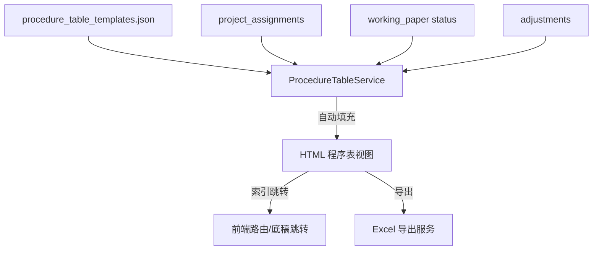

# Design: A循环程序表 HTML 化

## Overview

将 A1~A17 共 17 个程序表从 Excel 底稿改为 HTML 结构化表格。核心能力：自动填充执行状态、索引号可跳转、与各模块联动、支持导出为标准 Excel 归档。

## Architecture



## Components and Interfaces

### 1. 程序表模板数据

```json
// backend/data/procedure_table_templates.json
{
  "A1": {
    "title": "财务报告程序表",
    "index_no": "A1",
    "items": [
      {
        "seq": "1",
        "description": "确定审计结论是否提供了充分适当的审计证据...",
        "description_en": "Determine whether the results of the audit...",
        "auto_applicable": null,
        "auto_data_source": "workpaper_completion_rate",
        "ref_index": null,
        "sub_items": [
          {"seq": "●", "description": "额外舞弊风险指标..."}
        ]
      },
      {
        "seq": "6",
        "description": "追踪比较数字到以前年度财务报表",
        "ref_index": "A1-17",
        "auto_data_source": "prior_year_comparison_status"
      },
      ...
    ]
  },
  "A2": { ... },
  ...
}
```

### 2. 后端服务

```python
# procedure_table_service.py
class ProcedureTableService:
    """程序表自动填充服务"""

    async def get_procedure_table(self, project_id, year, table_code: str) -> dict:
        """获取指定程序表的完整数据（含自动填充结果）"""
        template = self._load_template(table_code)
        project = await self._get_project(project_id)
        
        for item in template['items']:
            # 自动判定适用性
            item['applicable'] = await self._resolve_applicable(item, project)
            # 自动填充执行人
            item['executor'] = await self._resolve_executor(item, project_id)
            # 自动填充执行情况
            item['execution_summary'] = await self._resolve_summary(item, project_id, year)
            # 用户手动覆盖值（从 DB 读取）
            override = await self._get_override(project_id, year, table_code, item['seq'])
            if override:
                item.update(override)
        
        return template

    async def save_override(self, project_id, year, table_code, seq, data):
        """保存用户手动修改的值"""
        ...
```

### 3. 用户覆盖存储（复用基础设施）

使用 `workpaper-foundation-kit` 的 `FieldOverrideService`，scope='procedure_table:{table_code}'，item_key=item.seq，field='applicable'/'executor'/'execution_summary'/'remark'。**不新建 procedure_table_overrides 表**。

### 4. 前端组件

```typescript
// ProcedureTableView.vue — 通用程序表 HTML 渲染组件
// props: tableCode ('A1'/'A2'/...)
// 从 API 获取数据 → 渲染 HTML 表格
// 列：序号 | 程序 | 是否适用(三态) | 执行人 | 执行情况说明 | 索引号(链接) | 备注
// 行内编辑：点击"是否适用"切换三态；双击"说明"进入编辑
// 索引号列渲染为 <router-link>，跳转到对应底稿

// ProcedureTableExport — 导出为 Excel
// 按原模板格式（含表头+合并单元格）生成 xlsx
```

## Data Models

| 表/文件 | 用途 |
|---------|------|
| procedure_table_templates.json | 17 个程序表的模板定义（items + 自动填充规则） |
| procedure_table_overrides | 用户手动覆盖值（项目级） |
| working_paper (现有) | 底稿状态，供自动填充引用 |
| adjustments (现有) | 调整分录，供 A2 自动填充 |

## Testing Strategy

- 单元测试：每种 auto_data_source 的解析逻辑
- PBT：随机 business_category → 验证 A1 第15项适用性判定
- E2E：打开 A1 程序表 → 验证索引跳转 → 修改一项 → 刷新不丢失
