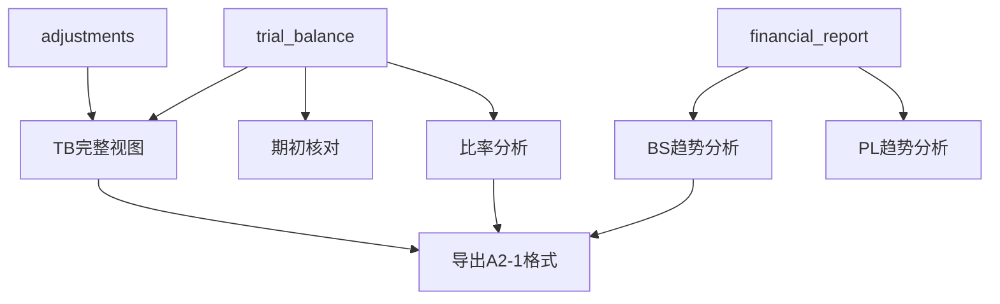

# Design: 报表模块完善（TB完整视图/比率分析/趋势分析/期初核对）

## Overview

增强现有报表模块，补充 A2-1/A2-2 单体报表试算底稿中覆盖但系统缺失的功能：TB 调整中间列视图、期初核对、BS/PL 趋势分析增强、财务比率分析。所有数据源已在系统中（trial_balance/adjustments/financial_report），只需增加计算+展示层。

## Architecture



## Components and Interfaces

### 1. TB 完整视图

```python
# trial_balance_full_view_service.py
class TrialBalanceFullViewService:
    """TB 完整视图：含调整分列"""

    async def get_full_view(self, project_id, year) -> list[dict]:
        """返回每个科目的完整调整过程"""
        tb_rows = await self._get_trial_balance(project_id, year)
        adj_by_account = await self._get_adjustments_by_account(project_id, year)
        
        result = []
        for row in tb_rows:
            code = row['standard_account_code']
            adjs = adj_by_account.get(code, {})
            result.append({
                'account_code': code,
                'account_name': row['account_name'],
                'unadjusted': row['unadjusted_amount'],
                'aje_debit': adjs.get('aje_debit', 0),
                'aje_credit': adjs.get('aje_credit', 0),
                'rje_debit': adjs.get('rje_debit', 0),
                'rje_credit': adjs.get('rje_credit', 0),
                'other_debit': adjs.get('other_debit', 0),
                'other_credit': adjs.get('other_credit', 0),
                'audited': row['audited_amount'],
                'balance_check': self._verify_formula(row, adjs),
            })
        return result
```

### 2. 期初核对

```python
# opening_balance_reconciliation.py
async def reconcile_opening_balance(project_id, year, db) -> list[dict]:
    """本年期初 vs 上年审定对比"""
    current_tb = await get_tb(project_id, year)  # opening_balance
    prior_tb = await get_tb(project_id, year - 1)  # audited_amount
    
    diffs = []
    for curr in current_tb:
        prior = find_by_code(prior_tb, curr['standard_account_code'])
        if prior and abs(curr['opening_balance'] - prior['audited_amount']) > 0.01:
            diffs.append({
                'account_code': curr['standard_account_code'],
                'account_name': curr['account_name'],
                'current_opening': curr['opening_balance'],
                'prior_audited': prior['audited_amount'],
                'difference': curr['opening_balance'] - prior['audited_amount'],
                'explanation': '',  # 用户填写
            })
    return diffs
```

### 3. 趋势分析增强

```python
# report_trend_analysis_service.py
class ReportTrendAnalysisService:
    """BS/PL 横向纵向趋势分析"""

    async def analyze_bs(self, project_id, year, audited=False) -> list[dict]:
        """资产负债表趋势分析"""
        source = 'audited_amount' if audited else 'unadjusted_amount'
        current = await self._get_report_data(project_id, year, 'balance_sheet', source)
        prior = await self._get_report_data(project_id, year - 1, 'balance_sheet', 'audited_amount')
        
        total_current = sum(r['amount'] for r in current if r['is_total_row'])
        total_prior = sum(r['amount'] for r in prior if r['is_total_row'])
        
        result = []
        for curr in current:
            prev = find_by_row_code(prior, curr['row_code'])
            prev_amt = prev['amount'] if prev else 0
            curr_pct = curr['amount'] / total_current * 100 if total_current else 0
            prev_pct = prev_amt / total_prior * 100 if total_prior else 0
            change_amt = curr['amount'] - prev_amt
            change_pct = change_amt / prev_amt * 100 if prev_amt else None
            
            result.append({
                'row_code': curr['row_code'],
                'row_name': curr['row_name'],
                'prior_amount': prev_amt,
                'prior_pct': prev_pct,
                'current_amount': curr['amount'],
                'current_pct': curr_pct,
                'change_amount': change_amt,
                'change_pct': change_pct,
                'significant': abs(change_pct or 0) >= 20,  # 显著变动阈值
                'weight_change': curr_pct - prev_pct,
                'weight_notable': abs(curr_pct - prev_pct) >= 5,  # 比重变动阈值
                'explanation': '',  # 用户填写
            })
        return result
```

### 4. 财务比率分析

```python
# financial_ratio_service.py
RATIO_DEFINITIONS = [
    {'name': '流动比率', 'formula': 'current_assets / current_liabilities', 'warning': '<1'},
    {'name': '速动比率', 'formula': '(current_assets - inventory) / current_liabilities', 'warning': '<0.8'},
    {'name': '资产负债率', 'formula': 'total_liabilities / total_assets * 100', 'warning': '>70'},
    {'name': '应收周转率', 'formula': 'revenue / avg_receivables', 'warning': None},
    {'name': '存货周转率', 'formula': 'cost / avg_inventory', 'warning': None},
    {'name': '毛利率', 'formula': '(revenue - cost) / revenue * 100', 'warning': None},
    {'name': '净利率', 'formula': 'net_profit / revenue * 100', 'warning': None},
    {'name': 'ROE', 'formula': 'net_profit / avg_equity * 100', 'warning': None},
    {'name': 'ROA', 'formula': 'net_profit / avg_total_assets * 100', 'warning': None},
]
```

### 5. 前端组件

```typescript
// TrialBalanceFullView.vue — TB 完整视图（简洁/完整切换）
// OpeningReconciliation.vue — 期初核对差异列表
// ReportTrendAnalysis.vue — BS/PL 趋势分析（增强 MultiYearCompare）
// FinancialRatioPanel.vue — 比率分析面板
```

## Data Models

复用基础设施 `workpaper_field_overrides` 表存储用户分析说明（scope='report_analysis:bs_trend'/'report_analysis:pl_trend'/'report_analysis:ratio'/'report_analysis:opening'），item_key=row_code 或 ratio_name，field='explanation'。**不新建 report_analysis_explanations 表**。

## Testing Strategy

- 单元测试：比率计算公式正确性
- PBT：随机 TB 数据 → TB 完整视图公式恒等（原报+调整=审定）
- 集成测试：真实项目数据的趋势分析显著标记
- E2E：切换简洁/完整视图 + 填写分析说明 + 导出 Excel
