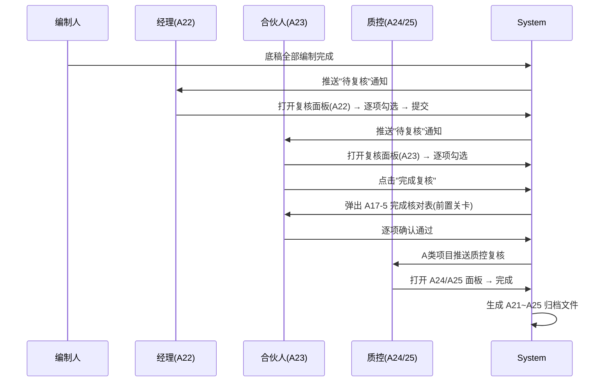

# Design: 复核流程 HTML 化与签署工作流

## Overview

将 A21~A25 复核表从独立 Excel 底稿转为审计生命周期中的结构化流程步骤。复核人在系统内完成逐项勾选+意见填写，系统自动生成归档文件。A17-5 完成核对表作为签发前置关卡，A17-7 独立性声明书通过电子签署工作流完成。

## Architecture



## Components and Interfaces

### 1. 复核检查要点模板

```json
// backend/data/review_checklist_templates.json
{
  "A21-1": {
    "title": "项目现场负责人复核表（财报审计）",
    "role": "field_lead",
    "audit_type": "financial",
    "items": [
      {"seq": 1, "content": "审计程序是否按照计划执行", "auto_check": "workpaper_plan_coverage"},
      {"seq": 2, "content": "是否取得充分适当的审计证据", "auto_check": null},
      {"seq": 3, "content": "重大判断是否恰当记录", "auto_check": null},
      ...
    ]
  },
  "A22-1": { "role": "manager", ... },
  "A23-1": { "role": "partner", ... },
  "A24-1": { "role": "quality_reviewer", "a_only": true, ... },
  "A25-1": { "role": "eqcr", "a_only": true, ... }
}
```

### 2. 后端服务

```python
# review_workflow_service.py
class ReviewWorkflowService:
    """复核流程服务"""

    async def get_review_panel(self, project_id, year, role: str) -> dict:
        """获取指定角色的复核面板数据"""
        template = self._get_template_for_role(role, project.audit_type)
        # 自动检查项从系统状态取值
        for item in template['items']:
            if item['auto_check']:
                item['auto_result'] = await self._resolve_auto_check(item['auto_check'], project_id)
        # 读取已保存的勾选记录
        saved = await self._get_saved_review(project_id, year, template['code'])
        return {**template, 'saved': saved}

    async def save_review(self, project_id, year, template_code, items, opinion, user_id):
        """保存复核记录"""
        ...

    async def get_completion_checklist(self, project_id, year) -> dict:
        """A17-5 完成核对表"""
        # 按项目类型选版本
        # 自动校验项取系统状态
        ...

    async def generate_archive_file(self, project_id, year, template_code) -> bytes:
        """生成归档 Excel/PDF"""
        ...
```

### 3. 独立性签署服务

```python
# independence_signing_service.py
class IndependenceSigningService:
    """A17-7 独立性声明书电子签署"""

    async def initiate_signing(self, project_id):
        """为项目所有成员创建签署任务"""
        members = await self._get_project_members(project_id)
        for member in members:
            await self._create_signing_task(project_id, member.user_id, 'A17-7')

    async def sign(self, project_id, user_id):
        """成员电子签署"""
        task = await self._get_task(project_id, user_id)
        task.signed_at = datetime.utcnow()
        task.status = 'signed'
        ...

    async def get_signing_progress(self, project_id) -> dict:
        """签署进度"""
        tasks = await self._get_all_tasks(project_id)
        return {
            'total': len(tasks),
            'signed': sum(1 for t in tasks if t.status == 'signed'),
            'pending': [t for t in tasks if t.status == 'pending'],
        }
```

### 4. 新增数据表

```sql
-- review_records: 复核记录
CREATE TABLE IF NOT EXISTS review_records (
    id UUID PRIMARY KEY DEFAULT gen_random_uuid(),
    project_id UUID NOT NULL,
    year INT NOT NULL,
    template_code VARCHAR(10) NOT NULL,
    reviewer_id UUID NOT NULL REFERENCES users(id),
    items JSONB NOT NULL,  -- [{seq, checked, remark}]
    opinion TEXT,
    status VARCHAR(20) DEFAULT 'draft',  -- draft/submitted
    submitted_at TIMESTAMPTZ,
    created_at TIMESTAMPTZ DEFAULT now()
);

-- independence_signing_tasks: 独立性签署任务
CREATE TABLE IF NOT EXISTS independence_signing_tasks (
    id UUID PRIMARY KEY DEFAULT gen_random_uuid(),
    project_id UUID NOT NULL,
    user_id UUID NOT NULL REFERENCES users(id),
    template_code VARCHAR(10) DEFAULT 'A17-7',
    status VARCHAR(20) DEFAULT 'pending',  -- pending/signed
    signed_at TIMESTAMPTZ,
    created_at TIMESTAMPTZ DEFAULT now(),
    UNIQUE(project_id, user_id, template_code)
);
```

## Testing Strategy

- 单元测试：auto_check 各规则的解析
- 集成测试：完成复核流程 → 验证归档文件生成
- PBT：随机角色+项目类型 → 验证匹配到正确模板
- E2E：签署流程（发起→成员签署→进度100%→底稿标完成）
