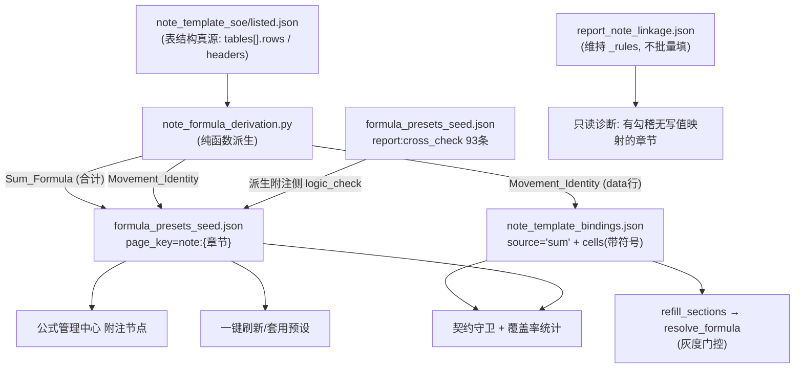

# Design Document

## Overview

补全附注**公式数据**，使既有但空转的表内公式链路有对象可算，并让附注公式在公式管理中心可见可编。

核心是**一次机械派生、两处消费**：从 `note_template_{soe,listed}.json`（表结构真源）派生公式，同时写入
- `note_template_bindings.json` 的 `source='sum'` binding（供 `refill_sections → resolve_formula` 求值）
- 显式预设文件 `formula_presets_seed.json` 的 `page_key='note:{章节}'` 条目（供公式管理中心展示/编辑/套用）

两处由**同一派生函数**产出，避免第二套口径。

## 引擎既有契约（本轮读码实证，设计前提）

| 事实 | 位置 | 对设计的约束 |
| --- | --- | --- |
| `refill_sections` 对 `row.is_total` 行 `continue`，合计由 `_backfill_totals` 算（生成路径 + 刷新末尾各一次） | `disclosure_engine.py` | 刷新路径合计**不进**求值路径 → Requirement 1 只做可见化，`_backfill_totals` 保持唯一真源 |
| `refill_sections` 对 data 行按 `source ∈ {sum,report,aging}` 调 `resolve_formula`，其余调 `dispatch_resolver` | `disclosure_engine.py` | 公式家族分派键是 `sum`/`report`/`aging`，而 `VALID_SOURCES`/json `valid_sources` 声明的是 `formula` → **source 命名已存在双轨**（详见 Wave 0 核实结论 §V11） |
| `_build_with_binding` 只调 `dispatch_resolver`，且合计行直接 None 占位，末尾 `_backfill_totals` | `disclosure_engine.py` | 生成路径首遍走 dispatch；`source='formula'` 经 `SOURCE_RESOLVERS['formula']` 进 `resolve_formula`，灰度关时返 None（与原 manual placeholder 同为 None） |
| `_resolve_formula_sum` 读 `binding.cells: ['R{r}C{c}',…]`，构造 `ROW('c1') + ROW('c2')` 交 `evaluate_formula`；**只有加法** | `note_source_resolvers.py` | 恒等式减项需 Requirement 9 的带符号扩展 |
| `values` 长度 = `len(headers) - 1`，**不含 label 列**；`_cell_value_from_table` 取 `row.values[C-1]` | `_build_with_binding` / `_cell_value_from_table` | 坐标口径：`R` = 输出 `rows` 的 1-based 序号（**含 header_label 行与合计行**）；`C` = 数值列 1-based 序号（即 `headers[C]`） |
| 输出行序 = `table_template.rows` 顺序（binding 的 `rows` 是 dict，按标签定位、且去重/加后缀/排除 header_label） | `_build_with_binding` | 坐标派生必须以 **note_template 的 `tables[].rows` 列表序**为准，**绝不能**用 bindings 的 rows dict 序（实测 200 处不一致，§V4） |
| `_resolve_cell_binding(label, col_idx, …)` 按「行标签 + 列语义」定位 binding | `disclosure_engine.py` | binding 本身无需坐标；坐标只出现在 `cells`（引用兄弟单元格）；**同表重复 label 无法定位** → 派生跳过（§V7） |
| 预设库 = 显式 seed ∪ 三源读时收敛（`prefill_formula_mapping` / `note_check_preset_formulas` / 宽表 MD） | `preset_library.build_preset_library` | 新公式写**显式 seed**（seed 优先、不触碰三源）；宽表 MD 源文件缺失（`附注模版/*宽表公式预设.md` not found）故不依赖它 |
| 现有 `note:*` 预设 1551 条 / 59 章节，来源 `check_presets` 1549 的 expression 是**中文自然语言**（`报表.货币资金期末 = ①货币资金分类表.合计行.期末余额`） | 实跑 `build_preset_library()` | 它们人可读、机器不可求值 → 本 spec 产出的是**机器可读**表达式，与之并存（去重键 `(page_key,target_cell)` 不撞） |

## Wave 0 核实结论（实测，设计据此修订）

| # | 结论（实测） | 对实现的约束 |
| --- | --- | --- |
| V1 | `refill_sections` / 生成第二遍的 ctx 注入 `report_data`（`_report_data_cache`），**未注入 `aging_data`** | 本 spec 只产出 `sum` 一种公式；`aging` 当期不可用，覆盖率报告注明 |
| V2 | `note_template_{soe,listed}.json` 的 `tables[].rows` 恒为 list（0 例外）；但 `header_normalize` 在模板中**恒为 None**，模板 headers 只有文本、行只有 `{label,row_type}` | **列语义真源 = `note_template_bindings.json` 的 `header_normalize[{text,semantic}]`**（index 0 = label 列 `manual_text`）；派生输入必须是「模板表 + binding 表」配对 |
| V3 | 模板 ↔ bindings 关联键 = `section["section_number"]`（**不是** `section_id` slug）；bindings 146 章节 = soe 63 + listed 86 按 `section_number` 合并 | 派生按 `section_number` join；同号章节合并语义沿用既有生成器 |
| V4 | bindings 的 `rows` dict 序 **≠** 模板 rows 列表序（soe 73 / listed 127 处不一致）：dict keyed by label，重复 label 加 `#1`、空 label 变 `row_N`、header_label 行被排除 | 坐标 `R` **只能**取模板 rows 列表序；bindings 仅提供 per-label 的 `row_type` / `binding` |
| V5 | 运行时输出 rows = 全部模板 rows（含 header_label 行，其 values 全 None + mode=manual）；`num_value_cols = len(headers) - 1` | 坐标 `R` 含 header_label 与合计行；`C` = 1..num_value_cols |
| V6 | `_cell_meta[col]` **不含** `binding` 字段 → 第二遍求值经 ctx `_cell_binding_resolver`（按 label+semantic）重建 binding | 新公式必须写进 `note_template_bindings.json` 的 `rows[label].binding[semantic]`；`cells` 坐标在生成期算好写死 |
| V7 | 同一表内重复 label（如「出票人类型或账龄」）在 bindings 里被加 `#1` 后缀，而 `_resolve_cell_binding` 按原 label 精确匹配 → 只命中第一个 | 派生对重复 label 行 **跳过**（reason=`duplicate_label`），避免坐标与 binding 定位错配 |
| V8 | `_backfill_totals` 口径 = 逐列，对「上一个合计行之后 → 本合计行之前」的**所有非合计行**求和（None 跳过、header_label 行天然不贡献） | `derive_sum_formula` 求和范围必须与此段一致（不是"仅 data 行"） |
| V9 | bindings 中 total/subtotal 行共 567 条，**全部无 `binding` 字段** | 合计纯靠 `_backfill_totals`；给合计加字段是纯新增（只加追溯标注、不加公式 source） |
| V10 | `NoteFormulaEvaluator._evaluate_single_table` **不跳过** `is_total` 行（只跳 manual/locked 与非公式家族 source） | 若给合计写公式 binding，灰度开时生成路径**会**求值它 → 与 `_backfill_totals` 双写。故决策 2 的"合计不写公式 binding"是**硬约束**，由 Property 3 守卫强制 |
| V11 | `VALID_SOURCES`（resolvers，9 项）与 bindings json `valid_sources`（8 项）都**含 `formula`、不含 `sum/report/aging`**；`test_note_template_bindings.py` 硬编码 8 项集合断言**每个 cell.source ∈ 该集合**；`test_disclosure_engine_v2` 另有 json↔代码 valid_sources 对齐断言（**当前已 pre-existing 失败**，因 json 缺 `consol_aggregation`） | 写 `source='sum'` 会**直接打破** cell.source 枚举断言；故改用 `source='formula'` + `formula_kind='sum'`（决策 3 修订），既不新增 source 也不改 json `valid_sources` 声明 |
| V12 | 预设写入 API 实名 `upsert_seed_presets(entries: list[PresetEntry])`（非 `upsert_presets`）；`PresetEntry` 含 `variant` 字段；seed = `{…, "presets": [365 条]}`，其中 `note:*` 仅 2 条、`report:cross_check` 93 条 | 生成器调 `upsert_seed_presets`；`variant` 用于区分 soe/listed |
| V13 | 93 条 `report:cross_check` 中 **61 条含 `NOTE('章节', …)`、32 条不含**（纯报表内恒等式） | cross_check 派生只处理 61 条，其余跳过并记录（不硬凑） |
| V14 | 四件套（期初/增/减/期末）语义齐全的表 = **48 张**（soe 24 + listed 24）；仅期初+期末 = 97 张 | movement identity 候选上限 48 张表；覆盖率报告如实呈现 |
| V15 | data 行 `manual` + `todo` 候选按语义：`closing_balance` 1030 / `opening_balance` 631 / `prior_year_value` 377 / `current_year_increase` 296 / `current_year_decrease` 295 … | 恒等式只写 `closing_balance` 目标格；增减列保持 manual+todo（Property 6） |
| V16 | `check_note_binding_registry.py` 校验对象是 **`note_binding_registry.json`**（另一文件，与 `note_template_bindings.json` 无关） | 本 spec 守卫无需同步该脚本 |
| V17 | pre-existing 失败基线：`tests/services/test_disclosure_engine_v2.py` **7 failed / 53 passed**（`test_seven_sources_have_resolvers`、`test_binding_json_valid_sources_match`、`test_load_templates_*` 5 项）；`tests/services/test_note_template_bindings.py` 全绿 | 零回归门以此清单区分，不得混为本 spec 回归 |
| V18 | 另一组 pre-existing 失败：`tests/test_note_template_variant_matrix.py`（4 failed + 8 errors，traceback 指向**另一个仓库路径 `D:\GT_workplan\backend\tests\...`** + 断言 version `1.0.0` vs 实际 `2026-1`）、`tests/test_variant_matrix.py::test_every_matrix_code_exists_in_index`（G13/G14 公允价值变动收益/信用减值损失）。`git status` 实证本 spec 未改 `note_template_variant_matrix.json` / `section_code_index.json` | 环境/数据 drift，非本 spec 回归 |
| V19 | 预设写入后必须重跑 `scripts/seed/seed_formula_presets.py` 刷新物化 `data/formula_presets/inventory.json`，否则 `tests/formula_management/test_preset_library.py::test_materialized_inventory_json_consistent`（断言 `inventory.summary.total_pages == len(build_inventory())`）会失败 | 生成器后处理链：`generate_note_formula_data.py --apply` → `normalize_note_bindings.py --write` → `seed_formula_presets.py` |

## Architecture



## 关键决策

### 决策 1：报表↔附注只做校验，不做写值（用户已拍板）

93 条 `report:cross_check` 派生为**附注侧 `logic_check` 预设**；不生成 report→note 写值 linkage。理由：附注是明细支撑、报表是汇总结果，正确流向是 底稿/附注 → 报表；写值会覆盖附注明细汇总真值。`ReportNoteSyncService` 对无 linkage 章节 `cells_updated=0` 定义为正确行为，另加只读诊断供逐节人工评估。

### 决策 2：合计不写公式 binding（硬约束），只做可见化

`refill_sections` 跳过 `is_total` 行，但**生成路径的第二遍 `NoteFormulaEvaluator` 不跳过合计行**（§V10）。故"合计不被公式求值"不是引擎天然保证，而是**靠不给合计写公式 binding 来保证**：合计只登记预设（可见/可核对）+ binding 侧加**追溯标注字段**（不写 `source`/`formula_kind`）。`_backfill_totals` 保持唯一计算真源，避免双写。Property 3 守卫强制"产出中不存在 total/subtotal 行的公式 binding"。

### 决策 3：恒等式走 `source='formula'` + `formula_kind='sum'` + 带符号项（修订）

**不新增 `sum` 作为 source**：`VALID_SOURCES`（9 项）与 bindings json `valid_sources`（8 项）都只声明 `formula`，且 `test_note_template_bindings.py` 硬编码断言每个 `cell.source ∈ 该 8 项集合`（§V11）→ 写 `source='sum'` 会直接打破既有测试，且触碰 `SOURCE_RESOLVERS == VALID_SOURCES` 契约。

改为写 `source='formula'`（已在两处枚举内，dispatch 天然路由到 `resolve_formula`）+ 新增 `formula_kind='sum'` 子类型字段。引擎三处 additive 最小扩展（均在灰度门控内）：

1. `resolve_formula`：`kind = binding.get('formula_kind') or binding.get('kind') or source`，按 kind 分派 `sum/report/aging/prior_year_note`；原 `source in ('sum','report','aging')` 直调路径逐字节保留（向后兼容）。这顺带激活了原本的死键 `SOURCE_RESOLVERS['formula']`。
2. `refill_sections` 公式家族判定：`_src in ('sum','report','aging','formula')`。
3. `NoteFormulaEvaluator` 的 `FORMULA_FAMILY_SOURCES` / `_RESOLVE_FORMULA_DIRECT` 各加 `'formula'`。

`_resolve_formula_sum` 项写法扩展为 `cells: [{cell:'R2C1', sign:'+'}, …]`，**保留** `cells: ['R2C1', …]` 纯字符串写法逐字节原行为（additive）。表达式仍由 `formula_parse_utils.evaluate_formula` 求值（`ROW('a') + ROW('b') - ROW('c')`），不新造求值器。

### 决策 4：人工优先 + 试算表优先

派生仅在目标单元格**当前无有效绑定**（`source='manual'` 且带 `todo` 的 placeholder）时写入；已是 `trial_balance`/`prior_year_note`/人工标注的一律不覆盖（试算表实际数优先于恒等式推算）。

### 决策 5：坐标以模板行序为准 + 属性测试锁定

`R` 取 `note_template.tables[].rows` 列表序（**含 header_label 行与合计行**，即运行时输出 rows 的同一序，§V4/V5）；`C` 取数值列 1-based 序号（`headers[C]` / `header_normalize[C]`）。**绝不使用 bindings 的 rows dict 序**（实测 200 处不一致）。同表重复 label 行一律跳过（§V7）。属性测试对同一模板断言"派生坐标 → `_build_with_binding` 输出 rows/values 索引"一一对应，防模板改序后坐标漂移。

### 决策 6：完全不动 VALID_SOURCES / valid_sources / SOURCE_RESOLVERS（修订）

采用决策 3 的 `source='formula'` 后：
- **不**新增 source 枚举值，**不**改 `note_template_bindings.json` 的 `valid_sources` 声明（其与代码 9 项不一致是 pre-existing 失败，本 spec 不介入）
- **不**改 `SOURCE_RESOLVERS`，`assert set(SOURCE_RESOLVERS) == set(VALID_SOURCES)` 契约原样
- `test_note_template_bindings.py` 的 cell.source 枚举断言天然通过（`formula` 在其 8 项集合内）

## Components and Interfaces

### `app/services/note_formula_derivation.py`（新建，纯函数）

```python
def cell_coord(row_index_0based: int, value_col_index_0based: int) -> str:
    """→ 'R{r+1}C{c+1}'（R = 模板 rows 列表序，含 header_label 与合计行；
    C = 数值列序号，不含 label 列）。"""

def value_col_semantics(table_binding: dict) -> list[str | None]:
    """从 binding.header_normalize 取数值列语义（丢弃 index 0 的 label 列）。"""

def derive_sum_formula(table_template: dict, table_binding: dict) -> list[SumFormulaSpec]:
    """合计/小计行 → 同列求和规格；求和范围严格对齐 `_backfill_totals`
    （上一合计行之后 → 本行之前的所有非合计行）；不可判定→跳过+reason。"""

def derive_movement_identity(table_template: dict, table_binding: dict) -> list[MovementIdentitySpec]:
    """列语义四件套齐全 → data 行 closing_balance = 期初 + 增 − 减（带符号项）；
    仅当目标格当前为 manual+todo 且行 label 在表内唯一时产出。"""

def derive_note_formulas(
    section_number: str,
    template_section: dict,
    binding_section: dict,
    variant: str,
) -> DerivationResult:
    """单章节派生汇总：sum_specs / movement_specs / skipped(带 reason)。
    模板提供行序与 headers，binding 提供列语义与既有 cell binding（§V2/V3）。"""
```

不做 IO、不读 DB、同输入同输出（供 PBT）。输入是「模板表 + binding 表」**配对**（模板无列语义、binding 行序不可用，§V2/V4）。

### `scripts/gen/generate_note_formula_data.py`（新建，幂等生成器）

读 `note_template_{soe,listed}.json` + `note_template_bindings.json`（按 `section_number` 配对）→ 调派生纯函数 → 写两处：
1. `note_template_bindings.json`：对候选 data 单元格写 `{"source":"formula","formula_kind":"sum","cells":[{"cell":"R2C1","sign":"+"},…],"table_index":n,"mode":"auto","derived_by":"movement_identity"}`（人工/试算表绑定不覆盖）
2. `formula_presets_seed.json`：`upsert_seed_presets`（既有幂等 API，按 `(page_key,target_cell)` 去重，§V12）

产出覆盖率报告；重复运行逐字节一致。生成后必须跑 `normalize_note_bindings.py --write`（既有后处理，补国企 legacy_aliases）。

### `scripts/gen/generate_note_cross_check_presets.py`（新建）

从 `formula_presets_seed.json` 的 `report:cross_check` 条目提取 `NOTE('{章节}', …)` → 为该章节登记 `note:{章节}` 的 `logic_check` 预设，**表达式与容差沿用原条目**（同源，不另写一份），`target_cell` 用稳定派生 id 避免与 1549 条中文 check_presets 撞键。实测 93 条中仅 **61 条**含 `NOTE()`，其余 32 条为纯报表内恒等式 → 跳过并记录（§V13）。

### `app/services/report_note_linkage.py`（只读诊断，additive）

```python
def diagnose_missing_write_linkage(...) -> list[dict]:
    """列出"有报表↔附注勾稽关系但无写值 linkage"的章节（只呈现，不写入）。"""
```

经 `GET /api/disclosure-notes/{pid}/{year}/formula-health`（既有端点）附加字段暴露，不新增路由。

### `note_source_resolvers` 最小扩展（两处，additive）

1. `resolve_formula`：`kind = binding.get('formula_kind') or binding.get('kind') or source` 后按 kind 分派；`source in ('sum','report','aging')` 的旧直调语义逐字节保留。
2. `_resolve_formula_sum`：项支持 `str`（原样，`+`）或 `{"cell": str, "sign": "+"|"-"}`；构造 `ROW('a') + ROW('b') - ROW('c')` 交 `evaluate_formula`。取不到值的项跳过；全空 → None。

### `disclosure_engine` / `NoteFormulaEvaluator` 公式家族判定扩展（additive）

`refill_sections` 的 `_src in ('sum','report','aging')` → 追加 `'formula'`；`FORMULA_FAMILY_SOURCES` / `_RESOLVE_FORMULA_DIRECT` 各追加 `'formula'`。均在灰度门控内，关闭时行为不变。

### `scripts/check/check_note_formula_contract.py`（新建守卫）

- 预设库 `note:*`（本 spec 产出条目）章节集合 ≡ binding 中 `formula_kind='sum'` 的章节集合 ∪ 合计登记章节
- `report:cross_check` 与附注侧 `logic_check` 表达式/容差同源
- 合计登记的求和范围 ≡ `_backfill_totals` 口径
- 遍历数据文件为源，不硬编码清单

## Data Models

### Formula_Binding（写入 `note_template_bindings.json`）

```json
{
  "source": "formula",
  "formula_kind": "sum",
  "cells": [
    {"cell": "R2C1", "sign": "+"},
    {"cell": "R2C2", "sign": "+"},
    {"cell": "R2C3", "sign": "-"}
  ],
  "table_index": 0,
  "mode": "auto",
  "derived_by": "movement_identity",
  "derived_note": "由列语义四件套（期初/增加/减少/期末）机械派生"
}
```

`source='formula'` 落在既有 `VALID_SOURCES` / json `valid_sources` / 测试枚举集合内（§V11）；`formula_kind` 是本 spec 新增子类型字段（additive，旧数据无此字段时 `resolve_formula` 回退按 `source` 分派）。

### Preset_Entry（写入 `formula_presets_seed.json`）

```json
{
  "page_key": "note:五、22",
  "target_cell": "note-formula:movement:R2C4@soe",
  "expression": "ROW('R2C1') + ROW('R2C2') - ROW('R2C3')",
  "formula_type": "auto_calc",
  "refs": [{"formula_ref": "ROW('R2C1')"}],
  "source": "note_formula_derivation",
  "description": "期末余额 = 期初 + 本期增加 − 本期减少（机械派生）"
}
```

### Derivation_Provenance

每条产出携带 `derived_by ∈ {sum_total, movement_identity, report_cross_check}` 与 `derived_note`；跳过项进覆盖率报告 `skipped[{section, table, row, reason}]`。

## Correctness Properties

### Property 1: 生成器幂等
同输入重复运行两次，两个数据文件逐字节一致。
**Validates: Requirements 5.4**

### Property 2: 人工优先不覆盖
目标单元格为 `trial_balance`/`prior_year_note`/人工标注时，派生 SHALL NOT 改写它。
**Validates: Requirements 1.4, 2.2, 5.2**

### Property 3: 合计不写公式 binding
产出数据中不存在 `row_type ∈ {total,subtotal}` 行的公式 binding（`source='formula'` 或 `formula_kind` 任一存在即违规）。这是硬约束：生成路径第二遍求值不跳过合计行（§V10），一旦写入即与 `_backfill_totals` 双写。
**Validates: Requirements 1.2**

### Property 4: 合计口径一致
登记的合计求和范围与 `_backfill_totals` 对同一模板的求和范围集合相等。
**Validates: Requirements 1.3, 1.5**

### Property 5: 恒等式仅在四件套齐全时产出
缺任一语义列 → 该表无 movement 产出；分列语义按组齐全才产出，跨组不混算。
**Validates: Requirements 2.1, 2.3, 2.5**

### Property 6: 增减列不被绑定
`current_year_increase` / `current_year_decrease` 保持 `manual` + `todo`。
**Validates: Requirements 2.4**

### Property 7: 坐标口径正确
派生坐标 `R{r}C{c}` 经 `_cell_value_from_table` 反查，命中 `_build_with_binding` 输出的对应单元格（R = 模板 rows 列表序含 header_label 与合计行、C 为数值列序号）；用 bindings rows dict 序派生的坐标应被测试判为错（反例锁定，§V4）。
**Validates: Requirements 8.1, 8.2**

### Property 8: 带符号 sum 向后兼容
纯字符串 `cells` 写法求值结果与扩展前逐字节一致；带 `sign:'-'` 项按减法参与。
**Validates: Requirements 9.1, 9.2**

### Property 9: sum fail-open
任一项坐标取不到值 → 跳过该项；全部取不到 → None，且 refill 不覆盖既有值。
**Validates: Requirements 9.3**

### Property 10: 灰度关闭数值零回归
`DISCLOSURE_NOTE_FORMULA_ENABLED=False` 时，生成/刷新产出的 **`values` 与 `is_total`/`label`/`headers` 逐字节等价**于本 spec 前。

**已知声明性差异（非数值回归，须显式断言其无害）**：候选单元格 binding 从 `manual`+`todo` 改为 `formula`+`mode=auto` 后，新生成 note 的 `_cell_modes[col]` 由 `"manual"` 变 `"auto"`，`_cell_meta[col].semantic` 不变、值仍为 None。存量 note 不受影响（`merge_table_data_preserving_cell_modes` 保留 OLD `_cell_modes`，用户手工值不被覆盖）；该变化方向与 `_is_legacy_auto_cell`（把"binding 声明 auto 却 mode=manual"视为待修正的 legacy 态）一致。
**Validates: Requirements 6.1, 6.3**

### Property 11: 灰度开启数值不变
灰度开启后合计与恒等式单元格数值与关闭时 `_backfill_totals` 结果一致（公式只把黑箱显式化）。
**Validates: Requirements 6.2**

### Property 12: 不改披露内容
产出不新增/修改任何行标签、表名、章节号、列头文案；`disclosure_notes` 表结构不变、无迁移。
**Validates: Requirements 5.3, 6.4**

### Property 13: 不批量派生写值 linkage
`report_note_linkage.json` 业务条目数在本 spec 前后不变（仍为 0），诊断只读不写。
**Validates: Requirements 4.1, 4.2, 4.4**

### Property 14: 预设↔binding 一致
守卫遍历数据文件断言两侧章节集合一致；任一侧改动未同步即失败。
**Validates: Requirements 7.2, 7.4**

### Property 15: cross_check 同源
附注侧 `logic_check` 预设的表达式与容差与 `report:cross_check` 原条目一致，不出现第二套口径。
**Validates: Requirements 3.2, 7.3**

### Property 16: 覆盖率三分类可解释、无重复计数
`candidate_cells`（data 行 × 有语义列 × 当前 manual+todo，**独立统计**）与三分类满足：
- 已公式化目标格集合 ∩ 被跳过的候选格集合 = ∅，且二者都 ⊆ 候选格集合
- `已公式化 + 被跳过的候选 + 仍 manual+todo = candidate_cells`，且 `仍 manual+todo ≥ 0`
- 每个跳过项带 reason；表级/列级跳过标 `is_candidate=False`（不进三分类分母）
**Validates: Requirements 7.1, 5.2**

## Error Handling

| 场景 | 行为 |
| --- | --- |
| 模板结构异常（rows 非 list / headers 缺失） | 跳过该表，计入 `skipped` 带 reason，不中断整体生成 |
| 列语义缺失/未识别 | 不产出公式（宁缺勿造），计入 manual+todo 统计 |
| 坐标越界/非法 | 派生阶段即校验并跳过；求值阶段 `_resolve_row_col` 返 None → 该项跳过 |
| 合计层级不可判定 | 跳过该合计行登记，reason 记录 |
| 预设 upsert 撞键 | 按 `(page_key,target_cell)` 覆盖表达式（既有幂等语义） |
| 灰度关闭 | `refill_sections` 旁路公式家族，绝不用 None 覆盖既有值 |
| 求值异常 | `resolve_formula` fail-open 返 None，`logger.warning`，不抛给调用方 |

## Testing Strategy

- **PBT**（`max_examples=5`）：Property 1/2/5/6/8/9/16 对派生纯函数与 `_resolve_formula_sum`
- **契约守卫**：Property 3/4/12/13/14/15（`check_note_formula_contract.py`，挂 governance-checks）
- **灰度两态**：Property 10/11 —— 同一章节在开关关/开各生成一次，比对数值
- **零回归门**：`test_disclosure_note_formula_wave*`、`test_disclosure_engine_v2`、`test_note_template_bindings`、`test_note_source_resolvers`、`note_validation` 相关全量（基线见 §V17：`test_disclosure_engine_v2` 7 failed / 53 passed 为 pre-existing；`test_note_template_bindings` 全绿，若变红即本 spec 回归）
- **真实 round-trip**：灰度开启后对真实项目某变动表章节生成/刷新 → 恒等式与合计数值正确 → 公式管理附注节点可见预设 → 直连 DB 备份/恢复，`RESTORED_IDENTICAL` 断言零污染
