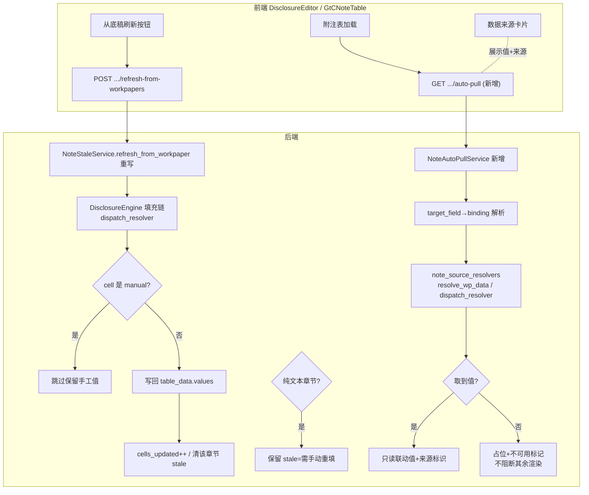

# Design Document — disclosure-note-linkage-and-slimdown

## 现状勘察确认（Verify Before Design）

> 本节为基于真实代码的实证勘察（2026-06-05），所有结论标注文件名 + 行号 + 真实签名。设计的每个取舍均建立在此之上，不凭印象。

### 缺口 1（P0 假性刷新）勘察结论

| 勘察点 | 文件:行 | 实证结论 |
|--------|---------|----------|
| `NoteStaleService.refresh_stale_sections` | `backend/app/services/note_stale_service.py:191` | 签名 `async def refresh_stale_sections(self, project_id, year, section_codes=None) -> RefreshResult`。**只 `note.is_stale = False` + `sections_refreshed += 1`，从不取数**；注释自承认「实际数据刷新由 fill engine 负责」却从未调用。`cells_updated` 恒为 0。 |
| `NoteStaleService.refresh_from_workpaper` | `note_stale_service.py:237` | 签名 `async def refresh_from_workpaper(self, project_id, year, wp_code) -> RefreshResult`。**只 `UPDATE disclosure_notes SET is_stale=False`，不写任何数值**。 |
| **双重失效（致命）** | `note_stale_service.py:88,148,306` | 服务内 `from app.models.phase13_models import DisclosureNote` —— **`phase13_models.py` 内根本没有 `class DisclosureNote`**（grep 确认；`:169` 的 `is_stale` 属于 `ReportSnapshot`）。该 import 抛 `ImportError` 被方法体内宽 `except Exception` 静默吞掉 → 实际**永远走异常分支返回空 RefreshResult**。即便 import 成功，又误用 `DisclosureNote.section_code`（`:97`），真实字段名是 `note_section`。 |
| `RefreshResult` 结构 | `note_stale_service.py:38` | `@dataclass: sections_refreshed:int=0; cells_updated:int=0; errors:list[str]=[]`。已具承载真实重算结果的字段，无需新增。 |
| `NoteWpMappingService.refresh_from_workpapers` | `backend/app/services/note_wp_mapping_service.py:92` | 签名 `async def refresh_from_workpapers(self, project_id, year) -> dict`。**「从底稿刷新」按钮真正命中的方法**。`:128-132` 匹配底稿后 `# 简化：标记为已刷新` → 仅 `refreshed += 1`，`return {"refreshed","total_notes"}`，**不写回 `note.table_data`**。 |
| 默认映射 | `note_wp_mapping_service.py:30` | `DEFAULT_WP_MAPPING` 是 `{note_section: wp_code_prefix}`（如 `"五、3":"D1"`），`wp_code.startswith(prefix)` 匹配。 |
| `NoteFillEngine` 公开方法 | `backend/app/services/note_fill_engine.py:71` | 4 模式 `fetch_total/fetch_detail/fetch_category/fetch_change` + 入口 `fill_section(section_code, fetch_mode, wp_data=, report_row_data=, detail_rows=, category_data=, change_data=) -> SectionFillResult`；另有 `fill_from_trial_balance(section_code, tb_current=, tb_prior=, adjustments=)`。**纯函数（`__init__` 无参、无 DB）**，输入预提取好的 dict/list，输出 `SectionFillResult(cells:list[CellValue], stats, errors)`。**只产出「该填什么值」，不写回 table_data，也不从 DB 取数。** |
| 已验证的真实填充路径 | `backend/app/services/disclosure_engine.py:266,606,715` | `DisclosureEngine` 才是生产中真正把数值写进 `table_data` 的引擎：`_preload_data_for_notes` 预热 `_wp_cache/_tb_cache/_prior_notes_cache` → 逐单元格 `val = await dispatch_resolver(cell, ctx)`（`:715`）→ 写回 `values`。由 `generate_notes` 全量调用，已被 66 测试覆盖。 |
| `execute_note_formulas` | `backend/app/services/note_formula_generator.py:314` | 签名 `async def execute_note_formulas(db, project_id, year, note_section) -> {"executed","updated","results","anomalies"}`。已实现「**只更新 `_cell_modes[col]=='auto'` 的单元格，manual 跳过**」，写回 `table_data.rows[].values[]` 并 `flag_modified`。被 `apply-formulas` 端点（`disclosure_notes.py:413`）调用。**这是已落地、已测试的「真实重算 + manual 保护」范式。** |
| `DisclosureNote` ORM 真实 schema | `backend/app/models/report_models.py:307` | 表 `disclosure_notes`。关键字段：`note_section:str`（**非 `section_code`**）、`section_title`、`year:int`、`table_data:JSONB`、`text_content:Text`、`content_type:Enum`、`is_stale:bool`(default false, `:367`)、`status:Enum`、`is_deleted:bool`、`last_sync_source/last_sync_wp_id/last_sync_at`。**无独立 `manual_override` 列** —— 手工保护标记存在 `table_data` 内。 |
| manual 保护标记真实存储 | `note_wp_mapping_service.py:140-210` + `note_formula_generator.py` | manual/auto 模式存在 `table_data.rows[]._cell_modes`（`{str(col): "auto"|"manual"}`），另有老格式 `cells[i].mode`。**重算跳过 manual 的唯一正确判据 = `_cell_modes[str(col)] != "auto"`**。 |
| 前端调用链 | `audit-platform/frontend/src/views/DisclosureEditor.vue:1620,1645,1791,1875` | `onRefreshFromWP / onManualRefresh / onStaleRecalc 重算 / restore-auto` 全调 `refreshDisclosureFromWorkpapers(projectId, year)`（`commonApi.ts:128`）→ `POST /api/disclosure-notes/{pid}/{year}/refresh-from-workpapers`（`apiPaths/report.ts:104`）→ 路由 `note_wp_mapping.py:45` → `refresh_from_workpapers`（假性刷新）。刷新后前端 `fetchDetail` 重新拉取，但后端没写值 → 拉到旧数据。 |
| 刷新端点事务边界 | `backend/app/routers/note_wp_mapping.py:45-56` | 路由调 service 后 `await db.commit()`（router 统一 commit，service 只 flush），符合铁律。 |

**P0 根因定性**：三条「从底稿刷新」按钮链路全部命中只清 stale 标记 / 只自增计数器的代码，真正写数值的 `DisclosureEngine.dispatch_resolver` 链从未被 refresh 路径调用；`NoteFillEngine` 是孤立纯函数引擎也从不被 refresh 调用。

### 缺口 2（P1 cross_ref auto_pull）勘察结论

| 勘察点 | 文件:行 | 实证结论 |
|--------|---------|----------|
| `NoteCrossReferenceService` 现有方法 | `backend/app/services/note_cross_reference_service.py:48,84,118,140` | `generate_cross_references`（报表行次→章节序号 dict）、`resolve_ref_placeholders`（`{ref:BS-001}`→「详见附注五、（一）1」文本替换）、`get_report_note_numbers`、`update_all_references`、`generate_word_bookmarks`。**全部只做「章节号文本」映射，没有任何从底稿/报表拉数值的逻辑**。它 `from app.models.report_models import DisclosureNote`（正确来源）。 |
| `custom_query._query_workpaper_cell_range` | `backend/app/routers/custom_query.py:1341` | 签名 `async def _query_workpaper_cell_range(db, pid: str, filters: dict)`，`filters` 需 `wp_code`+`cell_range`(+可选 `sheet_name`)。返回 `{rows:[{index,wp_code,sheet_name,cell_ref,value,formula?}],columns,total,source}`。取数优先级：① `parsed_data['univer_snapshot']`（零计算）② storage xlsx cache ③ LibreOffice headless 重算。**它是 router 内模块级 async 函数（非类方法），依赖 `db` + 一堆 `_sync_*` helper + LibreOffice；从 note service 跨 router import 会造成 router→router 隐式耦合，并把 LibreOffice 重负载带进附注渲染热路径。** |
| 已有更轻的 note 专属取数器 | `backend/app/services/note_wp_data_resolver.py:160,236,316` | **纯函数**：`extract_wp_cell(parsed_data, sheet, cell_ref) -> Decimal|str|None`、`extract_wp_table(...)`、`extract_wp_column_sum(...)`。兼容扁平 `"Sheet!A1"` 与嵌套 `cells[Sheet][A1]`、兼容 `{v,f}`/`{value,formula}`，**缺数据返 None 永不抛异常**。已被 `test_note_wp_data_resolver.py` 覆盖。 |
| 统一 source 解析器 | `backend/app/services/note_source_resolvers.py:435,815` | `resolve_wp_data(binding, ctx)` 封装上面三个 extract，从 `ctx["_wp_cache"]` 命中或 `ctx["db"]` 按需加载 `WorkingPaper.parsed_data`。`dispatch_resolver(binding, ctx)`（`:815`）按 `binding.source`（9 种）分发，**catch-all 返 None 不抛**。**这是附注模块自己的取数内核，已被 disclosure_engine 复用。** |
| `CrossRefService.detect_changes` | `backend/app/services/cross_ref_service.py:84` | `detect_changes(wp_code, sheet_name, old_html_data, new_html_data, changed_cells=None) -> list[CrossRefChange]`。读 `data/cross_wp_references.json`，按 `source_wp` 前缀匹配。 |
| `CrossRefService.propagate_with_manual_override_check` | `cross_ref_service.py:227` | kw-only 签名 `(*, db, project_id, source_wp_id, change, target_workpaper, current_value, new_value, user_id, propagation_origin="user_edit") -> Literal["allow","block_enqueued","auto_resolved"]`。manual_override 判据走 `target_workpaper.parsed_data['_manual_override_cells']`。**针对 WorkingPaper，其「联动写入前先查 manual_override，命中不覆盖」契约可作附注侧对齐范式。** |
| cross_ref schema 真实来源 | `backend/data/wp_render_schema/C-D1-disclosure.yaml:308`(上市)/`:588`(国企)；另 `C-D2/C-L-disclosure.yaml` | `cross_refs[]` 真实字段：`ref_id`、`source:{sub_table,row?,column}`、`target_wp`、`target_sheet`、`target_field`、`description`、`severity:required|optional`、`direction:inbound`、`auto_pull:true`。**schema 给的是 `target_field`（人读列名如「审定数(期末)」），不是 Excel `cell_range`** → 需一层「target_field → cell/extract binding」解析，不能直接喂 `_query_workpaper_cell_range`。 |
| 前端 `autoPullRefs` | `GtCNoteTable.vue:376` | `computed(() => schema?.cross_refs?.filter(r => r.auto_pull && r.direction==='inbound'))`。渲染区 `:191-211` 仅展示 `target_wp`(`GtIndexChip` 可跳转)+`description`，**没有展示拉到的值**。jump-to-reference 已接线（`:741` → `emit('jump-to-reference', refCode)`）。 |
| `CrossRefDef` 前端类型 | `GtCNoteTable.types.ts:115` | 已含 `target_wp/target_sheet/target_field/direction/auto_pull/severity/source/source_cell`。**缺承载「拉到的值 + 来源标识 + 不可用标记」的字段**，需扩展。 |
| 信封约定 | `backend/app/middleware/response.py:16` | `_SKIP_PATHS=("/docs","/redoc","/openapi.json","/wopi/","/api/events/","/api/message/stream")`。附注端点不豁免 → 2xx 被包成 `{code,message,data}`。`apiProxy`(`api.get/post`) 自动解一层；原生 `http`/`fetch` 必手动取 `body.data`（铁律）。`commonApi.refreshDisclosureFromWorkpapers` 用的是 `http.post`。 |

**P1-cross_ref 根因定性**：schema 已完整定义 auto_pull cross_ref（上市 4 + 国企 2），前端已筛选 + 已接 jump 跳转，**唯独「按 target_field 从来源底稿拉真实数值」整条缺失** —— 既无 target_field→cell 解析，也未调用任何取数器。

### 缺口 3（P1 瘦身）勘察结论

| 勘察点 | 文件:行 | 实证结论 |
|--------|---------|----------|
| `DisclosureEditor.vue` 规模 | `audit-platform/frontend/src/views/DisclosureEditor.vue` | 2585 行，全平台第二大 .vue（仅次 `LedgerPenetration.vue` 3794）。远超仓库 1500 行卡点。 |
| 已抽出的 composable（现状） | `DisclosureEditor.vue:812,823,835,868,874,994` | 已用 `useNoteTableStructure / useNoteSectionNumbering / useAuditContext / useStaleStatus / useNoteStale / useEditingLock / useProjectEvents / useNoteCustomTemplate`。**说明拆 composable 是该文件既有且被接受的范式，继续抽取风险可控。** |
| 可抽的大块逻辑（按职责聚类） | 同文件多处 | ①**数据加载/树**：`fetchTree/fetchDetail/onProjectChange/onYearChange/onTreeNodeDrop/allowTreeDrop`（`:914,1018,1952`）②**编辑/富文本/AI**：`onRichTextChange/onAiContinueWrite/onAiRewriteOpen/getSelectedText/onPickKnowledge`（`:1112,1178,1201`）③**保存/校验**：`onSave/onValidate`（`:2029`）④**刷新联动**：`onRefreshFromWP/onManualRefresh/onStaleRecalc/restore-auto`（`:1620,1645,1875`）⑤**模板/转换**：`handleTemplateChange/loadNoteMappingPreset/saveNoteMappingRules/onNoteTemplateApplied`（`:927,964`）⑥**导出**：`onExportWord`（`:1884`）⑦**EQCR/锁**：`isEqcrRole/getSectionLock/editLock`（`:794,892`）。 |
| 瘦身范式参照 | `.kiro/specs/_archive/07-workpaper-slimdown/workpaper-editor-slimdown/design.md` | `WorkpaperEditor.vue` 已用「先测后拆」拆到 837 行（抽 `useEditorToolbar` 等 composable + 子 SFC）。`gtdform-test-and-shrink` 用「先测后拆 + HARD_CAPS + evalFormula 安全解析器」。**本 spec 复用同范式。** |
| `check_file_size.py` HARD_CAPS | `backend/scripts/check/check_file_size.py:47` | `HARD_CAPS: dict[str,int]`，键=相对仓库根路径，值=行数上限；`check_file:93` 优先于 whitelist/默认上限判定，超限 `return 1`。当前已登记 3 个 GtDForm。**瘦身后须新增 `"audit-platform/frontend/src/views/DisclosureEditor.vue": 1500`。** |
| 对外契约 | 路由视图组件 | 由路由 `/projects/:pid/disclosure-notes` 挂载，无父组件 props/events（顶层视图）。**瘦身不得改变路由路径 + query 约定（`year`）。** |

### 附注后端测试基线（零回归守护）

`backend/tests/services/test_note_*.py` 系列（`test_note_wp_data_resolver / test_note_source_resolvers / test_note_ci1..ci19 / test_note_cell_merge_pbt / test_note_column_semantics / test_note_auto_trim_v2 / test_note_cell_trace …`）+ 报表/导出/离线相关，合计需求所述 66 个附注后端测试。**本 spec 任意改动后该集合须全绿；改动导致失败 → 修代码不改断言（Req 1.5）。**

## Overview

本设计针对附注模块 3 处实证缺口给出最小侵入、零回归的修复方案：

1. **P0 — 从底稿刷新真实重算**：让「从底稿刷新」按钮真正重算附注金额。不新建重算引擎，而是把 refresh 路径接到**已被生产验证、已被 66 测试覆盖**的 `DisclosureEngine.dispatch_resolver` 填充链上，并补齐 manual 保护、纯文本章节降级、`cells_updated` 真实统计、按章节粒度的 stale 清除。同时修复 `note_stale_service.py` 的两处致命 bug（错误的 `phase13_models` import + 错误的 `section_code` 字段名）。

2. **P1 — cross_ref auto_pull 真实取数**：新建一个**附注专属、纯函数为主**的 `NoteAutoPullService`，把 schema 里的 `cross_refs`（`target_wp`+`target_field`）解析成 `resolve_wp_data` 能消费的 binding，复用 `note_source_resolvers.dispatch_resolver` 取真实值（**不复用 custom_query 的 `_query_workpaper_cell_range`**，理由见取舍 §设计取舍 2）。取数失败降级为占位 + 不可用标记，不阻断渲染；manual_override 单元格跳过；auto_pull 值与手填值在持久化时可区分。前端 `GtCNoteTable` 展示拉到的值 + 来源标识。

3. **P1 — DisclosureEditor.vue 瘦身**：先补特征测试锁定现有行为，再按职责抽 composable + 子 SFC，把 2585 行降到 ≤1500，登记 HARD_CAPS 防回弹。纯重构，对外路由/事件契约零变化。

**贯穿约束（Req 1）**：service 只 flush、router 统一 commit；新增 PG 专属 SQL 标 `pg_only`；前端文本中文 + GT 紫令牌；改动致测试失败修代码不改断言；完成后 Playwright 在线实测。

### 整体数据流（修复后）



## Architecture

### 分层与改动落点

| 层 | 现有组件 | 本 spec 改动 | 性质 |
|----|----------|-------------|------|
| 前端视图 | `DisclosureEditor.vue`(2585) | 拆 composable+子 SFC（缺口 3）；刷新提示文案区分「已刷新/需手动重填」（缺口 1）；触发 auto-pull 加载（缺口 2） | 重构 + 小改 |
| 前端组件 | `GtCNoteTable.vue` / `GtCNoteTable.types.ts` | 数据来源卡片展示拉到的值 + 不可用标记；`CrossRefDef` 扩展 `pulled_value/source_label/unavailable`（缺口 2） | 小改 |
| 前端 service | `commonApi.ts` / `apiPaths/report.ts` | 新增 `fetchNoteAutoPull(projectId, year, section)`（缺口 2） | 新增 |
| 路由 | `disclosure_notes.py` / `note_wp_mapping.py` | `refresh-from-workpapers` 改调重写后的真实重算（缺口 1）；新增 `GET .../auto-pull`（缺口 2） | 改 + 新增 |
| Service | `note_stale_service.py` | 修复 import/字段名 bug；`refresh_from_workpaper` 接 DisclosureEngine 填充链 + manual 保护 + 纯文本降级 + cells_updated（缺口 1） | 重写方法体 |
| Service | `note_wp_mapping_service.py` | `refresh_from_workpapers` 真实写回 table_data（缺口 1） | 重写方法体 |
| Service（新） | `note_auto_pull_service.py` | target_field→binding 解析 + 复用 `dispatch_resolver` 取数 + 降级（缺口 2） | 新增 |
| Service（复用） | `disclosure_engine.py` / `note_source_resolvers.py` / `note_fill_engine.py` | 作为被调用方，**不改** | 复用 |

### 关键架构原则

- **不新建重算引擎**：P0 复用 `DisclosureEngine` 的 `_preload_data_for_notes` + `dispatch_resolver` 单元格填充链（已被 66 测试覆盖），避免与生产填充逻辑产生第二套实现导致数值不一致。
- **取数内核单一**：P1 auto_pull 复用 `note_source_resolvers.dispatch_resolver` / `resolve_wp_data`（附注模块自有取数内核），不引入 custom_query 的 router 级依赖。
- **manual 保护判据统一**：刷新与 auto_pull 都以 `table_data.rows[]._cell_modes[str(col)] != "auto"` 为「手工值不可覆盖」的唯一判据，与 `execute_note_formulas` 既有行为对齐。
- **降级不阻断**：所有取数器缺数据返 None（已是现状），上层据此降级为占位/保留 stale，绝不抛异常打断渲染或刷新。
- **事务边界不变**：所有 service 只 `flush`，router 统一 `commit`（Req 1.3）。

## 设计取舍（显式记录）

### 取舍 1：P0 重算 —— 复用 DisclosureEngine 填充链，不复用 NoteFillEngine，也不新建重算路径

**候选方案**：
- A. 调 `NoteFillEngine.fill_section/fill_from_trial_balance`。
- B. 新建独立重算函数。
- C. **复用 `DisclosureEngine` 的 `_preload_data_for_notes` + 逐 cell `dispatch_resolver` 填充链。**

**选定：C。**

**理由**：
1. `NoteFillEngine`（方案 A）是**纯函数，不从 DB 取数也不写回 table_data**（`note_fill_engine.py` 全文确认），其入参是「已提取好的 wp_data/detail_rows/tb_current」字典。要喂它，仍得先写一套「从 DB 取数 + 把 SectionFillResult.cells 写回 table_data」的胶水代码 —— 等于把 `DisclosureEngine` 已做的事再实现一遍，且两套取数口径极易漂移，违反零回归最高约束。
2. `DisclosureEngine`（方案 C）是**生产中唯一真正写值进 table_data 的引擎**，`generate_notes` 全量走它、已被 66 测试覆盖。让 refresh 复用它 = refresh 后的值与「生成附注」时的值同源同口径，天然零漂移。
3. 方案 B 新建路径与 C 同病（重复实现 + 漂移风险），且无收益。

**落地形态**：在 `DisclosureEngine` 暴露一个窄接口 `refill_sections(project_id, year, section_codes, *, skip_manual=True) -> RefillReport`，内部复用现有 `_preload_data_for_notes` + 单元格 `dispatch_resolver`，但**只重写命中章节、只写 `_cell_modes[col]=='auto'` 的单元格**，逐格记录 old→new 以统计 `cells_updated`。`NoteStaleService.refresh_from_workpaper` / `NoteWpMappingService.refresh_from_workpapers` 改为调用它。`NoteFillEngine` 维持现状（不动，避免牵连其测试）。

### 取舍 2：auto_pull 取数入口 —— 复用 note_source_resolvers，不复用 custom_query._query_workpaper

**候选方案**：
- A. 复用 `custom_query._query_workpaper_cell_range`（按需可拆出 service 避免 router 依赖 router）。
- B. **复用 `note_source_resolvers.resolve_wp_data / dispatch_resolver`（附注自有取数内核）。**

**选定：B。**

**理由**：
1. `_query_workpaper_cell_range` 是 **router 内模块级函数**，依赖 `db` + 多个 `_sync_*` helper + **LibreOffice headless 重算**（`custom_query.py:1341` 注释明确第 3 优先级会触发 LibreOffice）。把它接进附注**加载热路径**会把重算负载带进每次附注表渲染，且 note service import router 造成 router→router 隐式耦合。即便拆 service 层，也要把 LibreOffice 依赖一并搬迁，工程量大且与「最小侵入」相悖。
2. `resolve_wp_data`（方案 B）是**纯函数取数器**，从 `WorkingPaper.parsed_data`（已落库的快照值）取数，零计算、永不抛异常、已被测试覆盖，且是 `disclosure_engine` 已在用的同一内核 —— 与 P0 取数口径天然一致。
3. schema 的 `cross_refs` 用 `target_field`（人读列名）而非 `cell_range`；无论走 A 还是 B 都需要一层「target_field→定位」解析。走 B 时把它解析成 `resolve_wp_data` 的 binding（`{source:"wp_data", wp_code, sheet, extract:"cell"/"table", cell_ref/value_cols}`）最自然。

**target_field → binding 解析策略**：`NoteAutoPullService._resolve_binding(cross_ref)` 优先级：
- 若 cross_ref 显式带 `source_cell`（Excel 引用如 `B7`）→ `extract:"cell", cell_ref`。
- 否则按 `target_wp` 对应底稿的 schema/表头，将 `target_field`（如「审定数(期末)」）映射到列定位 → `extract:"table"` 取该列匹配行，或退化为 `extract:"column_sum"`。
- 映射不到 → 返回 `None` binding，上层降级为占位 + 不可用（不报错）。

### 取舍 3：瘦身 composable 边界划分

按职责单一 + 与现有 `useNoteXxx` 命名一致，新增以下 composable / 子 SFC（具体清单见 Components and Interfaces）：

| 抽取单元 | 类型 | 职责 | 来源行 |
|----------|------|------|--------|
| `useNoteTree` | composable | 章节树加载、拖拽排序、节点选中（`fetchTree/onTreeNodeDrop/allowTreeDrop`） | `:914,1018,1952` |
| `useNoteDetail` | composable | 章节详情加载、富文本 change（`fetchDetail/onRichTextChange`） | `:1112,1952` |
| `useNotePersist` | composable | 保存、自动保存脏标记（`onSave` + autoSave） | `:2029` |
| `useNoteRefresh` | composable | 从底稿刷新/手动重试/stale 重算（`onRefreshFromWP/onManualRefresh/onStaleRecalc`）+ 区分「已刷新/需手动重填」提示 | `:1620,1645,1875` |
| `useNoteTemplate` | composable | 模板切换、转换规则、模板配置（`handleTemplateChange/loadNoteMappingPreset/onNoteTemplateApplied`） | `:927,964` |
| `useNoteExport` | composable | Word 导出、离线导入导出触发（`onExportWord`） | `:1884` |
| `useNoteAi` | composable | AI 续写/改写/知识库选取（`onAiContinueWrite/onAiRewriteOpen/onPickKnowledge`） | `:1178,1201` |
| `NoteEditorToolbar.vue` | 子 SFC | 顶部工具栏按钮区（模板切换/刷新/生成/校验/导出/EQCR） | 模板 `:31-50` |
| `NoteMappingDialog.vue` | 子 SFC | 转换规则弹窗 | `:923-952` |

**边界原则**：composable 只搬逻辑不改语义；子 SFC 通过 props/emit 与父通信，父保留编排。所有抽取项**先有特征测试**再动（Req 4.2）。

## Components and Interfaces

### 后端：P0 真实重算

**`DisclosureEngine.refill_sections`（新增窄接口，复用既有填充链）**

```python
@dataclass
class CellRefillRecord:
    section: str          # note_section
    row_index: int
    col_index: int
    old_value: Any
    new_value: Any

@dataclass
class RefillReport:
    sections_recomputed: list[str]          # 成功重算（含至少一个 auto 单元格被处理）的章节
    text_only_sections: list[str]           # 纯文本/叙述章节，无法自动重算
    cells_updated: int                      # 实际数值发生变化的单元格数
    records: list[CellRefillRecord]
    errors: list[str]                       # {section}: {reason}

async def refill_sections(
    self,
    project_id: UUID,
    year: int,
    section_codes: list[str] | None = None,   # None=全部
    *,
    skip_manual: bool = True,
) -> RefillReport:
    """复用 _preload_data_for_notes + 逐 cell dispatch_resolver 重算指定章节。
    - 只处理 content_type 含表格的章节；纯文本章节计入 text_only_sections。
    - 仅写 _cell_modes[str(col)]=='auto' 的单元格（skip_manual=True 时）。
    - 逐格比较 old vs new，变化才计 cells_updated 并写回。
    - flag_modified(note,'table_data')；只 flush 不 commit。
    """
```

**`NoteStaleService.refresh_from_workpaper`（重写方法体）**

```python
async def refresh_from_workpaper(self, project_id, year, wp_code) -> RefreshResult:
    # 修复点 1：import 改 from app.models.report_models import DisclosureNote
    # 修复点 2：字段名 section_code → note_section
    # 1. 用 NoteAccountMapping/DEFAULT_WP_MAPPING 求出受 wp_code 影响的 note_section 列表
    # 2. engine = DisclosureEngine(self.db); report = await engine.refill_sections(project_id, year, sections, skip_manual=True)
    # 3. 对 report.sections_recomputed 清 is_stale；text_only_sections 保留 stale
    # 4. 取数失败的章节（report.errors）保留 stale，写入 result.errors
    # 5. result.cells_updated = report.cells_updated；result.sections_refreshed = len(sections_recomputed)
    # 只 flush 不 commit
```

`refresh_stale_sections` 同样改为：查 stale 章节 → `refill_sections` → 按结果分别清/留 stale + 真实 `cells_updated`。

**`NoteWpMappingService.refresh_from_workpapers`（重写方法体）**：删除 `# 简化：标记为已刷新` 自增计数器，改为委托 `DisclosureEngine.refill_sections`（按 mapping 命中的 sections），返回 `{"refreshed": cells_updated, "sections_recomputed": [...], "text_only_sections": [...], "errors": [...]}`，保持响应键向后兼容（`refreshed`/`total_notes` 仍在）。

**路由**：`note_wp_mapping.py:refresh_from_workpapers` 维持「调 service → `await db.commit()`」结构，仅透传更丰富的返回体（含 `cells_updated`、`text_only_sections`）。

### 后端：P1 auto_pull 取数

**`NoteAutoPullService`（新增 `backend/app/services/note_auto_pull_service.py`）**

```python
@dataclass
class AutoPullResult:
    ref_id: str
    target_wp: str | None
    source_label: str          # 溯源标识：如 "D1-1!审定数(期末)" 或 "D1-1!B7"
    value: Any | None          # 拉到的只读联动值
    available: bool            # 取数是否成功
    reason: str = ""           # 不可用原因（available=False 时）

class NoteAutoPullService:
    def __init__(self, db: AsyncSession):
        self.db = db

    async def pull_for_section(
        self, project_id: UUID, year: int, schema: dict,
        *, note_table_data: dict | None = None,
    ) -> list[AutoPullResult]:
        """对 schema.cross_refs 中 auto_pull&&direction==inbound 的项逐条取数。
        - 预热 _wp_cache（一次加载项目底稿 parsed_data）。
        - 逐 ref：manual_override 检查 → _resolve_binding → dispatch_resolver → 成功填值+来源标识 / 失败 available=False+reason。
        - 任一 ref 异常被捕获为 available=False，绝不中断整体（缺口 2 AC4/AC10）。
        """

    def _resolve_binding(self, cross_ref: dict) -> dict | None:
        """target_field/source_cell → resolve_wp_data binding；映射不到返 None。"""

    @staticmethod
    def _is_manual_override(note_table_data: dict | None, ref: dict) -> bool:
        """auto_pull 目标单元格是否被标记 manual（_cell_modes != 'auto'）→ 跳过自动取数。"""
```

**路由（新增）`GET /api/disclosure-notes/{project_id}/{year}/{note_section}/auto-pull`**

```python
@router.get("/{project_id}/{year}/{note_section}/auto-pull")
async def get_auto_pull(project_id, year, note_section, db=Depends(get_db),
                        user=Depends(get_current_user)):
    # 1. 加载该章节 schema（wp_render_schema_service）+ 该 note 的 table_data
    # 2. results = await NoteAutoPullService(db).pull_for_section(...)
    # 3. 只读查询，无需 commit
    return {"refs": [asdict(r) for r in results]}
```

### 前端

- **`CrossRefDef` 扩展**（`GtCNoteTable.types.ts`）：新增 `pulled_value?: number | string | null`、`source_label?: string`、`unavailable?: boolean`、`unavailable_reason?: string`。
- **`GtCNoteTable.vue` 数据来源卡片**（`:191-211`）：每个 `refItem` 增展示 `pulled_value`（available）或「取数不可用：{reason}」（unavailable，灰色），保留 `GtIndexChip` 跳转。auto_pull 值标只读样式（区别于手填）。
- **`commonApi.ts` / `apiPaths/report.ts`**：新增 `fetchNoteAutoPull(projectId, year, section)` → `GET .../auto-pull`，**手动解信封 `body.data`**（铁律，原生 http）。
- **`DisclosureEditor.vue`（缺口 1 提示文案）**：`useNoteRefresh` 收到刷新返回后，依据 `cells_updated` / `text_only_sections` 显示差异化提示：有更新→「已刷新 N 个单元格」；存在纯文本章节→额外「以下章节需手动重填：…」（区别于无脑「已刷新」，缺口 1 AC8/AC9）。

### 前端瘦身组件清单（缺口 3）

见取舍 3 表：新增 `useNoteTree / useNoteDetail / useNotePersist / useNoteRefresh / useNoteTemplate / useNoteExport / useNoteAi` 七个 composable + `NoteEditorToolbar.vue / NoteMappingDialog.vue` 两个子 SFC。`DisclosureEditor.vue` 保留编排与模板骨架，目标 ≤1500 行。

## Data Models

本 spec **不新增数据库表/列**（Req 1 零回归 + 复用现有 schema）。涉及的数据结构如下：

### 现有持久化结构（复用，不改）

- **`disclosure_notes` 表**（`report_models.py:307`）：`note_section / table_data:JSONB / is_stale:bool / content_type:Enum / text_content`。
- **`table_data` JSONB 内部结构**（约定，不改）：
  ```jsonc
  {
    "headers": [...],
    "rows": [
      { "label": "...", "values": [v0, v1, ...],
        "_cell_modes": { "0": "auto", "1": "manual" } }  // manual 保护判据
    ],
    "_formulas": {...}, "_check_presets": [...]
  }
  ```
- **auto_pull 值与手填值的可区分（Req 3.7）**：auto_pull 拉到的值**不写入 `table_data`**（不污染手填数据），仅在 `auto-pull` 端点的响应中作为只读联动值返回前端展示。持久化层因此天然区分：`table_data` 只含手填/公式值，auto_pull 值是运行时只读派生。

### 新增内存数据类（非持久化）

- `RefillReport` / `CellRefillRecord`（`DisclosureEngine`，见上）。
- `AutoPullResult`（`NoteAutoPullService`，见上）。
- `RefreshResult`（`note_stale_service.py:38`，复用现有字段 `sections_refreshed/cells_updated/errors`）。

### binding 解析中间结构（运行时）

`_resolve_binding` 产出喂给 `resolve_wp_data` 的 dict：
```jsonc
{ "source": "wp_data", "wp_code": "D1-1", "sheet": "审定表D1-1",
  "extract": "cell", "cell_ref": "B7" }          // 或 extract:"table"/"column_sum"
```

## Correctness Properties

*属性（property）是在系统所有合法执行中都应成立的特征或行为——一个关于系统应当做什么的形式化陈述。属性是人类可读规范与机器可验证正确性保证之间的桥梁。*

> 下列属性由「现状勘察」+ Acceptance Criteria Testing Prework 推导，已做属性反思消冗：刷新「会写回」被「值=新值」蕴含（删冗）；刷新跳过 manual 与 auto_pull 跳过 manual 合并为单一双路径保护属性；auto_pull 多来源类型合并为单一取数一致性属性；stale 清除的三个分支（成功清/纯文本留/失败留）合并为单一条件属性。

### Property 1：从底稿刷新后金额等价（P0 核心）

*For any* 项目、年度、随机底稿 parsed_data 数值集合，以及映射到这些底稿的附注表格章节，当上游底稿数值变更后触发「从底稿刷新」，刷新后该章节所有 `_cell_modes=="auto"` 的自动取数单元格的值都应等于按同一取数口径（`dispatch_resolver`）从底稿最新值计算出的目标值。

**Validates: Requirements 2.1, 2.2, 2.10**

### Property 2：cells_updated 精确计数

*For any* 一组待重算的附注章节，刷新返回的 `cells_updated` 应恰好等于刷新过程中数值实际发生变化（old != new）的自动单元格数量——未变化的单元格、被跳过的 manual 单元格、纯文本章节均不计入。

**Validates: Requirements 2.7**

### Property 3：stale 清除条件正确

*For any* 一组 stale 附注章节执行刷新后，某章节的 `is_stale` 被清除当且仅当该章节被成功自动重算（至少其取数未报错）；纯文本/叙述章节与取数失败章节的 `is_stale` 应保留为 True，且失败原因应出现在返回结果的 `errors` 中。

**Validates: Requirements 2.3, 2.5, 2.6**

### Property 4：manual 单元格双路径不可覆盖

*For any* 被标记为 manual（`_cell_modes[str(col)] != "auto"`）的附注单元格，无论经由「从底稿刷新」重算路径还是经由 auto_pull 取数路径，该单元格持久化的手工值在操作前后都应保持不变。

**Validates: Requirements 2.4, 3.6**

### Property 5：auto_pull 取数与来源值一致

*For any* schema 中 `auto_pull==true && direction=="inbound"` 的 cross_ref，以及其来源（底稿/报表/试算表）的当前单元格值，`NoteAutoPullService.pull_for_section` 为该 ref 返回的 `value` 应等于按解析出的 binding 经 `dispatch_resolver` 从来源取得的值。

**Validates: Requirements 3.1, 3.2, 3.9**

### Property 6：auto_pull 值只读且可溯源

*For any* 取数成功（`available==true`）的 auto_pull 结果，其 `source_label` 应非空且能定位到来源（底稿编码 + 列名/单元格引用），且该值仅作为只读联动值返回、不写入附注 `table_data`。

**Validates: Requirements 3.3**

### Property 7：取数失败降级不阻断渲染

*For any* 一组 cross_ref（其中任意子集取数失败/来源缺失），`pull_for_section` 返回的结果列表应包含全部 ref 一一对应的项（失败项 `available==false` 且带 `reason` 占位），且整个调用不抛异常——即单条取数失败不影响其余 ref 的正常返回。

**Validates: Requirements 3.4, 3.10**

### Property 8：auto_pull 不污染手填持久化

*For any* 附注章节 `table_data` 与任意 auto_pull 取数操作，取数操作前后该章节持久化的 `table_data`（手填值/公式/`_cell_modes`）应保持逐字节等价——auto_pull 值与用户手填字段可区分（前者不入库）。

**Validates: Requirements 3.7**

### Property 9：瘦身行为与契约不变（特征测试守护）

*For any* 触发附注编辑器既有交互（章节树加载、章节编辑、保存、校验、从底稿刷新、模板切换、Word 导出、公式管理、导入、EQCR 只读副本）的相同输入，瘦身后抽取 composable/子 SFC 的实现应产生与瘦身前相同的可观察输出，且对外路由路径、query 约定与事件契约保持不变。

**Validates: Requirements 4.4, 4.9**

> 以下验收标准为示例/UI 级（非属性），由具体单测/E2E 覆盖：2.8/2.9（刷新提示文案随 cells_updated 与 text_only_sections 分支）、3.8（jump-to-reference 跳转）、4.1/4.5（行数 ≤1500 + HARD_CAPS 登记，由 `check_file_size.py` 静态断言）。

## Error Handling

### 降级矩阵

| 场景 | 触发条件 | 处置 | 不变量 |
|------|----------|------|--------|
| 取数失败（底稿无 parsed_data / cell 缺失） | `dispatch_resolver` 返 None | 刷新：该单元格不写、章节保留 stale + errors 记录；auto_pull：该 ref `available=false` + reason 占位 | 不抛异常、不阻断其余章节/ref（P3, P7） |
| 纯文本/叙述章节无法重算 | `content_type` 无表格 / table_data 无 rows | 计入 `text_only_sections`，**保留 is_stale=True**，前端提示「需手动重填」 | 纯文本章节 stale 不被误清（P3, 缺口1 AC3/AC9） |
| manual_override 保护 | 单元格 `_cell_modes[col] != "auto"` | 刷新与 auto_pull 均跳过该单元格 | 手工值前后不变（P4） |
| auto_pull 来源缺失 / target_field 映射不到 | `_resolve_binding` 返 None | `available=false` + reason「来源字段无法定位」，占位渲染 | 渲染不阻断（P7, 缺口2 AC4） |
| `note_stale_service` 历史 import bug | 修复前 `phase13_models` 无 DisclosureNote | 改 `from app.models.report_models import DisclosureNote` + 字段 `note_section`；移除掩盖错误的宽 except 静默吞（改为记录并降级，不再静默成功假象） | 刷新真正执行而非永远空返回 |
| 取数器内部异常 | resolver 抛错 | `dispatch_resolver` 既有 catch-all 返 None（已现状）；`pull_for_section` 外层再包一层 per-ref try | 单 ref 异常不影响整体（P7） |
| 事务一致性 | service 内多次写 | service 只 `flush`，router 末尾统一 `commit`；任一步抛错由 router 回滚 | 事务边界不变（Req 1.3） |

### 关键原则

- **缺数据返 None 不抛异常**：贯穿 `note_wp_data_resolver` / `note_source_resolvers` / `NoteAutoPullService`，与现有契约一致。
- **修 bug 不掩盖**：`note_stale_service` 的宽 `except Exception` 此前把 ImportError 伪装成「刷新成功」，修复时改为正确 import 后，异常应真实暴露并按降级矩阵处置，不再静默。
- **manual 优先**：任何联动写入前先判 `_cell_modes`，与 `execute_note_formulas` 既有行为对齐。

## Testing Strategy

### 双重测试策略

- **单元测试**（具体示例 / 边界 / 错误条件）：刷新提示文案分支、jump-to-reference 跳转、行数上限 + HARD_CAPS 登记、target_field→binding 解析的典型映射、纯文本章节识别、信封解包。
- **属性测试**（通用性质 / 随机输入全覆盖）：上述 Property 1–9，每条由**单个**属性测试实现。
- 二者互补：单测抓具体回归，属性测试验证通用正确性。

### 框架与配置

- **前端**：Vitest + @vue/test-utils + **fast-check**（`numRuns: 100`）。覆盖 `GtCNoteTable` 数据来源卡片展示/降级、`DisclosureEditor` 刷新提示文案、抽出的 composable 行为、特征测试（瘦身前后行为不变 P9）。
- **后端**：pytest + **hypothesis**（`max_examples=5`，遵循仓库铁律，禁默认 100）。覆盖 `DisclosureEngine.refill_sections`、`NoteStaleService` 刷新、`NoteAutoPullService` 取数/降级/manual 保护。
- **测试环境**：SQLite in-memory 默认（conftest `sqlite+aiosqlite:///:memory:`）；任何 PG 专属 SQL 标 `pg_only`（本 spec 预期不引入新 PG 专属 SQL）。优先 `httpx.ASGITransport(app=app)` in-process 直调端点（避免 stale uvicorn）。

### 属性测试 → 实现映射（每条属性单一 PBT）

| 属性 | 测试位置 | 标签注释 |
|------|----------|----------|
| P1 金额等价 | `backend/tests/services/test_note_refill_pbt.py` | `# Feature: disclosure-note-linkage-and-slimdown, Property 1: 从底稿刷新后金额等价` |
| P2 cells_updated 计数 | `test_note_refill_pbt.py` | `# Feature: disclosure-note-linkage-and-slimdown, Property 2: cells_updated 精确计数` |
| P3 stale 清除条件 | `test_note_refill_pbt.py` | `# Feature: disclosure-note-linkage-and-slimdown, Property 3: stale 清除条件正确` |
| P4 manual 双路径保护 | `test_note_manual_protect_pbt.py` | `# Feature: disclosure-note-linkage-and-slimdown, Property 4: manual 单元格双路径不可覆盖` |
| P5 auto_pull 取数一致 | `test_note_auto_pull_pbt.py` | `# Feature: disclosure-note-linkage-and-slimdown, Property 5: auto_pull 取数与来源值一致` |
| P6 auto_pull 只读溯源 | `test_note_auto_pull_pbt.py` | `# Feature: disclosure-note-linkage-and-slimdown, Property 6: auto_pull 值只读且可溯源` |
| P7 失败降级不阻断 | `test_note_auto_pull_pbt.py` | `# Feature: disclosure-note-linkage-and-slimdown, Property 7: 取数失败降级不阻断渲染` |
| P8 不污染持久化 | `test_note_auto_pull_pbt.py` | `# Feature: disclosure-note-linkage-and-slimdown, Property 8: auto_pull 不污染手填持久化` |
| P9 瘦身行为不变 | `audit-platform/frontend/src/views/__tests__/DisclosureEditor.characterization.spec.ts` | `// Feature: disclosure-note-linkage-and-slimdown, Property 9: 瘦身行为与契约不变` |

### 零回归守护（Req 1）

- 改动后运行附注后端 66 测试全集（`backend/tests/services/test_note_*.py` + 报表/导出/离线相关），须全绿。
- 前端 vitest 附注相关全集（GtCNoteTable / DisclosureEditor / composable）须全绿。
- 瘦身：先补 `DisclosureEditor.characterization.spec.ts`（行为快照）→ 再拆 → 特征测试维持绿。
- `check_file_size.py` 加 `DisclosureEditor.vue: 1500` HARD_CAP。
- 完成后在线（9980 + 3030）Playwright 实测：从底稿刷新（金额真变）、auto_pull 数据来源展示真实值、附注核心链路无运行时回归（Req 1.7，外部环境依赖项标 `[ ]*`）。

## 实施顺序建议

1. **缺口 1 P0**（最高业务价值 + 修致命 bug）：`DisclosureEngine.refill_sections` → `note_stale_service` 修复 + 重写 → `note_wp_mapping_service` 重写 → 路由透传 → 前端提示文案 → P1/P2/P3/P4(刷新侧) 属性测试。
2. **缺口 2 P1**：`NoteAutoPullService` → `auto-pull` 端点 → 前端 `CrossRefDef` 扩展 + 卡片展示 + `fetchNoteAutoPull` → P5/P6/P7/P8/P4(auto_pull 侧) 属性测试。
3. **缺口 3 P1**：先补特征测试（P9）→ 按 composable 清单逐个抽取（每抽一个跑特征测试）→ 抽子 SFC → HARD_CAPS 登记 → vue-tsc。

每阶段结束跑附注全量测试守护零回归，再进下一阶段。
