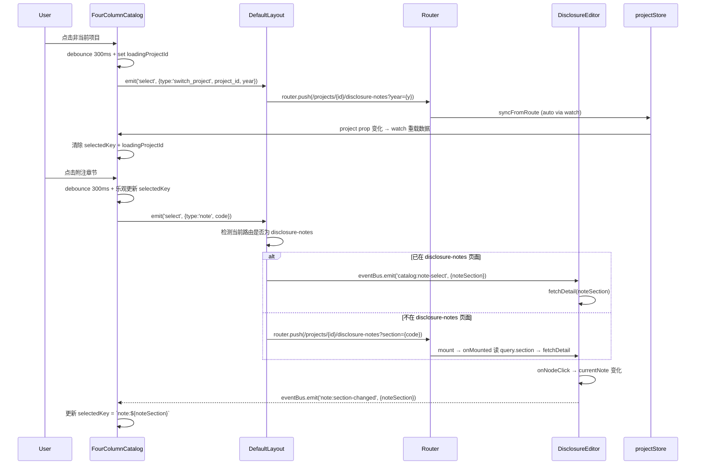

# Design Document: 四栏视图附注联动 (Four-Panel Note Linkage)

## Overview

本设计实现四栏视图侧边栏（FourColumnCatalog）与主编辑区之间的真正联动导航。当前组件已渲染项目列表和附注章节列表，但点击仅触发 `emit('select')` 事件，DefaultLayout 的 `onCatalogSelect` 仅加载项目信息到 `selectedProject` 而不执行路由跳转。

核心改动：
1. **项目切换**：点击非当前项目 → `router.push` 到目标项目工作页（含正确子路由）
2. **附注章节导航**：点击章节条目 → 如已在 DisclosureEditor 则直接调用 `fetchDetail`；否则 `router.push` 附带 `?section=` query 参数
3. **双向同步**：DisclosureEditor 内部章节切换 → 通过 eventBus 通知 FourColumnCatalog 更新 selectedKey；路由变化 → catalog 高亮同步
4. **防抖/加载态**：300ms debounce + loading 状态 + 导航期间禁用交互

## Architecture



## Components and Interfaces

### 1. FourColumnCatalog.vue — 新增状态与事件

```typescript
// 新增 props
interface Props {
  project: any
  activeCatalog?: string
  currentNoteSection?: string  // 从 DefaultLayout 透传当前编辑章节（用于反向同步高亮）
}

// 新增 emits（保持原有 'select' | 'tab-change'）
// emit('select') payload 保持不变，由 DefaultLayout 统一处理导航逻辑

// 新增内部状态
const loadingProjectId = ref<string | null>(null)  // 项目切换 loading 态
const isNavigating = ref(false)                     // 导航进行中，禁用交互
let debounceTimer: ReturnType<typeof setTimeout> | null = null
```

关键改动：
- `onSwitchProject` 增加 debounce + loading + isNavigating 守卫
- `selectItem('note', section)` 增加 debounce + 乐观更新 + 同章节守卫
- 监听 `eventBus.on('note:section-changed')` 更新 `selectedKey`
- 监听 `props.project.id` 变化时清除 `selectedKey`

### 2. DefaultLayout.vue — `onCatalogSelect` 路由导航逻辑

```typescript
function onCatalogSelect(item: any) {
  if (item?.type === 'switch_project' && item.project_id) {
    handleProjectSwitch(item)
    return
  }
  if (item?.type === 'note') {
    handleNoteNavigation(item)
    return
  }
  // 其他类型（report/workpaper/trial_balance）保持现有行为
  selectedCatalogItem.value = item
}

async function handleProjectSwitch(item: { project_id: string; year?: number }) {
  const targetId = item.project_id
  if (targetId === route.params.projectId) return  // 同项目不操作

  const year = item.year || projectStore.year
  const activeTab = activeCatalog.value  // 保持当前 Tab 对应的子路由
  const subRoute = tabToRoute(activeTab) // 'notes' → 'disclosure-notes'

  try {
    await router.push({
      path: `/projects/${targetId}/${subRoute}`,
      query: { year: String(year) }
    })
  } catch (err: any) {
    ElMessage.error('项目切换失败：' + (err.message || '未知错误'))
  }
}

function handleNoteNavigation(item: { code: string }) {
  const pid = route.params.projectId as string
  const isOnNotesPage = route.name === 'DisclosureNotes'

  if (isOnNotesPage) {
    // 已在附注编辑器页面，通过 eventBus 通知 DisclosureEditor 直接导航
    eventBus.emit('catalog:note-select', { noteSection: item.code })
  } else {
    // 不在附注页面，路由导航并附带 section query
    router.push({
      path: `/projects/${pid}/disclosure-notes`,
      query: { ...route.query, section: item.code }
    })
  }
}

function tabToRoute(tab: string): string {
  const map: Record<string, string> = {
    reports: 'financial-reports',
    notes: 'disclosure-notes',
    workpapers: 'workpapers',
    trial_balance: 'trial-balance',
  }
  return map[tab] || 'disclosure-notes'
}
```

### 3. DisclosureEditor.vue — 接收外部章节导航 + 反向通知

```typescript
// onMounted 中增加：读取 route.query.section 自动选中
onMounted(async () => {
  // ... existing logic ...
  await fetchTree()

  // 从 URL query.section 自动定位章节
  const targetSection = route.query.section as string
  if (targetSection && noteList.value.length > 0) {
    await fetchDetail(targetSection)
    // 清除 query 避免刷新时重复定位
    router.replace({ query: { ...route.query, section: undefined } })
  }
})

// 监听 catalog 发来的章节导航事件
eventBus.on('catalog:note-select', async ({ noteSection }) => {
  if (noteSection === currentNote.value?.note_section) return  // 同章节不重载
  try {
    await fetchDetail(noteSection)
  } catch {
    ElMessage.error('章节加载失败')
  }
})

// 反向通知：内部树切换时发布事件
watch(() => currentNote.value?.note_section, (newSection) => {
  if (newSection) {
    eventBus.emit('note:section-changed', { noteSection: newSection })
  }
})
```

### 4. eventBus 新增事件类型

```typescript
// utils/eventBus.ts 中新增
export interface CatalogNoteSelectPayload {
  noteSection: string
}

export interface NoteSectionChangedPayload {
  noteSection: string
}

// Events 映射表新增
'catalog:note-select': CatalogNoteSelectPayload
'note:section-changed': NoteSectionChangedPayload
```

## Data Models

本功能不涉及后端数据模型变更，完全在前端路由 + 组件状态层实现。

关键状态流：

| 状态 | 所在组件 | 用途 |
|------|---------|------|
| `loadingProjectId` | FourColumnCatalog | 标记正在切换的目标项目 ID |
| `isNavigating` | FourColumnCatalog | 导航进行中禁用交互 |
| `selectedKey` | FourColumnCatalog | 当前高亮的目录项 key |
| `currentNote.note_section` | DisclosureEditor | 当前编辑的章节标识 |
| `route.query.section` | URL | 从外部进入时指定目标章节 |

状态同步规则：
- `selectedKey` 由两个来源写入：① 用户点击（乐观更新） ② eventBus `note:section-changed`（反向同步）
- 项目切换时 `selectedKey` 重置为空字符串
- 从非附注 Tab 切换到附注 Tab 时不自动选中

## Correctness Properties

*A property is a characteristic or behavior that should hold true across all valid executions of a system — essentially, a formal statement about what the system should do. Properties serve as the bridge between human-readable specifications and machine-verifiable correctness guarantees.*

### Property 1: 项目切换生成正确路由路径

*For any* non-current project with a valid projectId and year, clicking it in the catalog should produce a router.push call with path `/projects/{projectId}/{activeTabRoute}` and query `{ year }`.

**Validates: Requirements 1.1**

### Property 2: 已选中项点击为空操作

*For any* item (project or note section) that is currently selected/active, clicking it should not trigger any navigation action or data reload.

**Validates: Requirements 1.4, 2.4**

### Property 3: 同页附注章节点击触发 fetchDetail

*For any* note_section string, when the current route is `DisclosureNotes`, clicking that section in FourColumnCatalog should emit `catalog:note-select` with the exact same noteSection value, causing DisclosureEditor to call `fetchDetail` with that string.

**Validates: Requirements 2.1**

### Property 4: 非附注页面章节点击生成正确导航路由

*For any* note_section string and any route that is NOT `DisclosureNotes`, clicking that section should produce a router.push to `/projects/{currentProjectId}/disclosure-notes` with query containing `section={note_section}`.

**Validates: Requirements 2.2**

### Property 5: 反向同步 selectedKey 一致性

*For any* chapter change within DisclosureEditor (currentNote.note_section changes to a new value), FourColumnCatalog's `selectedKey` should equal `note:{newNoteSection}`.

**Validates: Requirements 3.1**

### Property 6: 项目切换清除选中状态

*For any* project switch event (project.id prop changes), `selectedKey` should be reset to empty string `''`.

**Validates: Requirements 3.4**

### Property 7: 乐观更新立即生效

*For any* note section click, `selectedKey` should be updated to `note:{section.code}` synchronously (before any async operation resolves).

**Validates: Requirements 4.2**

### Property 8: 防抖仅执行最后一次

*For any* sequence of N clicks within 300ms window, exactly one navigation action should be executed, corresponding to the last click's target.

**Validates: Requirements 4.3**

### Property 9: 导航期间禁用交互

*For any* click event received while `isNavigating` is true, no navigation action should be dispatched.

**Validates: Requirements 4.4**

## Error Handling

| 场景 | 处理方式 |
|------|---------|
| 项目切换 getProject 失败（404/403） | ElMessage.error 提示 + 保持当前项目上下文 + 清除 loadingProjectId |
| router.push 被 navigation guard 拦截 | catch NavigationFailure → ElMessage.warning + 回退 loading 状态 |
| fetchDetail 网络失败 | ElMessage.error + 回退 selectedKey 到之前值（撤销乐观更新） |
| route.query.section 指向不存在的章节 | fetchDetail 返回空/404 → ElMessage.warning + 不选中任何章节 |
| 快速项目切换导致竞态 | isNavigating 锁 + debounce 保证只有最后一次生效 |

乐观更新回退策略：
```typescript
const previousKey = selectedKey.value
selectedKey.value = `note:${section.code}`  // 乐观更新
try {
  await navigateToSection(section.code)
} catch {
  selectedKey.value = previousKey  // 回退
  ElMessage.error('章节导航失败')
}
```

## Testing Strategy

### 单元测试（Vitest）

1. **FourColumnCatalog debounce 逻辑**：使用 `vi.useFakeTimers()` 验证 300ms 内多次点击只触发一次 emit
2. **DefaultLayout.handleProjectSwitch**：mock router.push，验证不同 activeTab 下生成正确路径
3. **DefaultLayout.handleNoteNavigation**：mock route.name，验证两条分支（eventBus vs router.push）
4. **DisclosureEditor query.section 初始化**：mock route.query，验证 onMounted 自动调用 fetchDetail
5. **乐观更新回退**：mock fetchDetail 抛异常，验证 selectedKey 回退

### Property-Based Tests（vitest + fast-check）

使用 `fast-check` 库，每个 property 最少运行 100 次迭代。

每个 property test 应标记对应的设计文档 property：
```typescript
// Feature: four-panel-note-linkage, Property 1: 项目切换生成正确路由路径
```

测试重点：
- **Property 1/4**：生成随机 projectId (UUID) + year (2020-2030) + activeTab (4种)，验证 router.push 参数
- **Property 2**：生成随机 currentProject + click target (same/different)，验证 no-op 条件
- **Property 3/5**：生成随机 noteSection 字符串（中文章节号如"一、1"~"十五、99"），验证 eventBus/selectedKey 映射
- **Property 8**：生成随机长度 (2-20) 的点击序列 + 随机 target，验证只有最后一个被执行
- **Property 9**：生成随机 isNavigating 状态 (true/false) + 点击事件，验证 true 时无操作

### Edge Cases（单元测试覆盖）

- 项目列表为空时不渲染可点击项
- note_section 为空字符串时不触发导航
- router.push 在同一路由重复导航时静默处理 (NavigationDuplicated)
- 组件 unmount 时清理 eventBus 监听 + 清除 debounce timer
