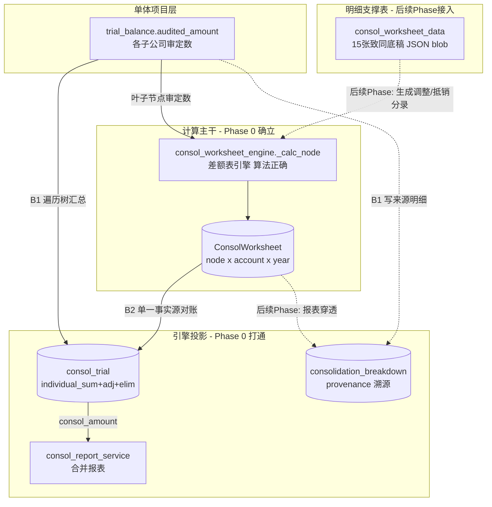
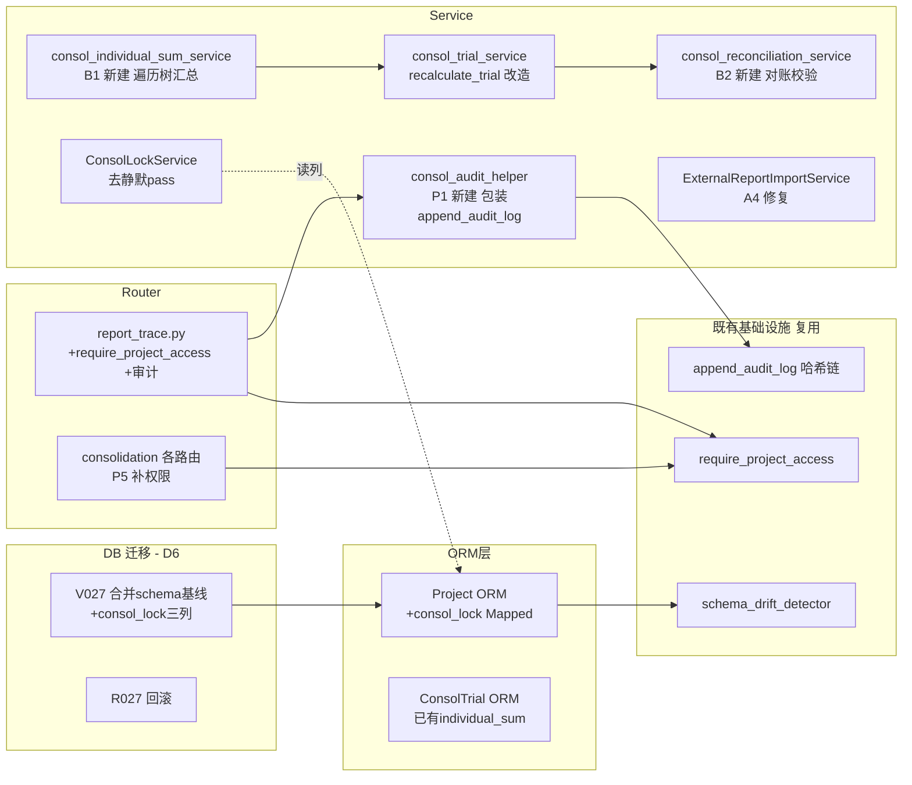
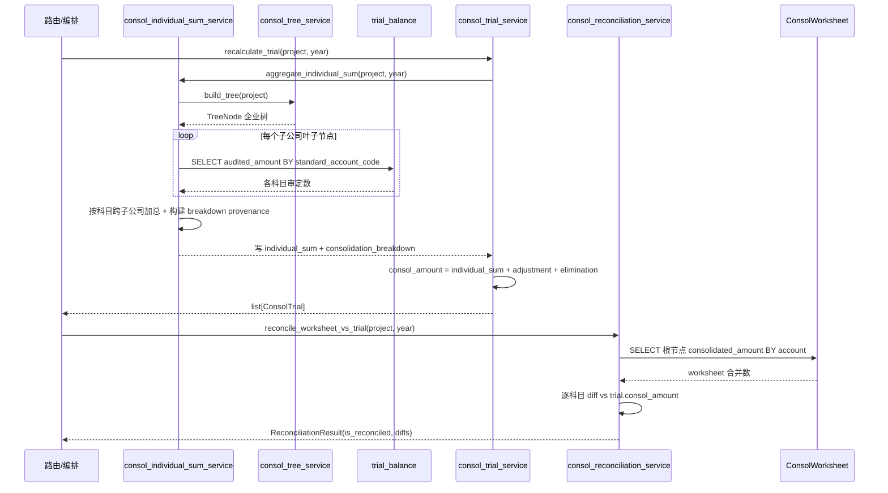

# 设计文档：consol-phase0-core-pipeline（合并模块 Phase 0 核心管线 + 基础设施修复）

> 关联调研：#[[file:docs/proposals/consolidation-module-status-and-proposal.md]]
> 范围：Phase 0「核心管线 + 基础设施修复」（~3 人天，最高优先，无外部数据依赖）
> 目标：**止血** —— 让合并数逻辑成立 + 合规留痕 + 项目级权限 + 防误用，**不做新高端功能**。

---

## 一、概述（Overview）

合并模块当前"骨架健全、核心管线断裂、关键操作无留痕、无项目级权限"，调研实证存在 5 层隐患（A 工程 / B 会计 / C 基础设施 / P 合伙人 / W 工作底稿）。Phase 0 不追求功能完整，只做 9 件止血的事：

1. **W1/W4 数据流主干 ADR**：把三套并行互不连通的数据模型（`consol_worksheet_engine` 差额表引擎 / `consol_worksheet_data` 15 张致同底稿 JSON blob / `consol_trial` 报表数据源）的关系一次性拍板——**差额表引擎为计算主干、15 张致同底稿为明细支撑表、trial/report 为引擎投影**，并把 5 大横切能力（单体联动 / 溯源穿透 / 国企↔上市模板 / 自定义查询 / 公式管理）作为设计输入。
2. **C1/C3 schema 基线迁移**：合并所有表从未进 D6 迁移（`grep` 0 命中），靠 `create_all()` 兜底（永不 ALTER 已存在表）。新增 V027 基线迁移（固化 ORM 现状为幂等 SQL）+ 加 `consol_lock/consol_lock_by/consol_lock_at` 三列 + `consol_lock` 进 ORM `Project` 模型（纳入 `schema_drift_detector` 守护）；C2 删 stale `.pyc`。
3. **B1 individual_sum 自动汇总**：`consol_trial.consol_amount = individual_sum + consol_adjustment + consol_elimination`，但 `individual_sum` 无写入路径（`recalculate_trial` 实际算出"仅抵销额"）。新增遍历企业树、按 `standard_account_code` 汇总各子公司 `trial_balance.audited_amount` 写入 `individual_sum`，同时写 `consolidation_breakdown` provenance。
4. **B2/衔接1 单一事实源对账**：两条计算路径（trial→report / worksheet→pivot）从不对账。确立 worksheet 为单一事实源，并加对账校验（diff > 容差则告警）。
5. **A4 死代码修复/下线**：`ExternalReportImportService.import_external_report` 引用未定义的 `self.db/kwargs/year/company_code` 必崩，却挂在已注册路由上。修复签名+参数 + 入口 `float()` → `Decimal`。
6. **P1 审计留痕（CAS 1131 合规红线）**：lock/unlock、抵销审批、recalc、scope 变更零 `audit_log` 写入。接入既有哈希链 `append_audit_log`。
7. **P5 项目级权限（CAS 1101 数据隔离红线）**：所有 consol 路由只挂 `get_current_user`，无 `require_project_access`。补项目级访问控制。
8. **P3 防误用标记**：在 Phase 0 端到端验证通过前，标记合并模块"开发中，不可用于正式合并报告"。
9. **F2 锁定假成功联动**：前端锁定调用完整但后端列缺失 → UPDATE 静默失败仍返 200。补列后前后端一起验真闭环。

**设计原则**：彻底解决不绕开（修根因 + 防御测试）；三层一致校验铁律（DB 迁移 + ORM `Mapped[]` + service）；金额 Decimal 铁律；D6 唯一迁移入口 + IF NOT EXISTS 幂等。

---

## 二、架构（Architecture）

### 2.1 数据流主干（三套模型并一套 — W1/W4 ADR 核心）

Phase 0 不重写引擎，而是**确立主干 + 桥接 + 投影**关系。下图是目标数据流（实线=Phase 0 落地，虚线=后续 Phase）：



**主干裁定（ADR-CONSOL-001，详见 §九）**：
- **计算主干** = `consol_worksheet_engine`（`_calc_node` 后序遍历企业树，算法经实证正确）。
- **明细支撑表** = 15 张致同底稿（`consol_worksheet_data`），后续 Phase 将其结果转为调整/抵销分录喂入引擎；Phase 0 仅声明关系，不接线。
- **投影** = `consol_trial` / `consol_report`，是引擎结果的下游投影。Phase 0 通过 B1（汇总 individual_sum）+ B2（worksheet↔trial 对账）把投影与主干打通。
- **5 大横切能力作为设计输入**（不在 Phase 0 实现，但主干设计必须为它们留出口）：① 单体联动靠 `consol_lock` + 企业树；② 溯源穿透靠 `consol_lock` 之外的 `consolidation_breakdown` provenance（Phase 0 写入，UI 后续）；③ 国企↔上市模板转换靠 `template_type`（已有字段）；④ 自定义查询靠 `consol_pivot_service`（查 ConsolWorksheet）；⑤ 公式管理靠后续把合并公式纳入管理中心。

### 2.2 组件关系（Phase 0 改动面）



### 2.3 关键铁律对齐

| 铁律 | Phase 0 应用 |
|------|-------------|
| 三层一致校验 | `consol_lock` 必须 DB 迁移（V027）+ ORM `Mapped[]`（Project）+ service（ConsolLockService）三层齐全，否则 drift detector 抓不到 |
| D6 唯一入口 | V027/R027 配对，`CREATE TABLE/ALTER` 全 `IF NOT EXISTS`；`ALTER TYPE ADD VALUE` 不在 Phase 0 范围 |
| 金额 Decimal | B1 汇总、对账容差、A4 入口全用 `Decimal`；新 PG-only SQL 加 `bind.dialect.name == "sqlite"` 检测 |
| 彻底解决不绕开 | A4 修根因（补参数）而非吞异常；锁定去静默 pass 让真实错误暴露 |
| 改动后必验 | F2 锁定前后端联调（补列→后端锁→前端点→真改子公司被拦 423→前端显示锁定态） |

---

## 三、组件与接口（Components and Interfaces）

### 组件 1：consol_individual_sum_service（B1 新建）

**职责**：遍历企业树，按 `standard_account_code` 汇总各子公司 `trial_balance.audited_amount` 写入 `consol_trial.individual_sum`，同时写 `consolidation_breakdown` provenance。复用 `consol_tree_service.build_tree` 的树遍历与 `_get_audited_amount` 的取数逻辑（与 `_calc_node` 叶子取数口径一致）。

**接口**：
```python
async def aggregate_individual_sum(
    db: AsyncSession,
    project_id: UUID,   # 合并母项目 id
    year: int,
) -> AggregationResult:
    """遍历企业树，把各子公司 audited_amount 按科目加总写入 individual_sum，
    并写 consolidation_breakdown provenance。返回汇总统计。"""
```

**责任边界**：
- 只负责"加总到 individual_sum + 写 provenance"，不负责调整/抵销（由 `recalculate_trial` 叠加）。
- 不重算 worksheet（那是引擎的事），但取数口径必须与 `_get_audited_amount` 一致（同 `audited_amount`、同 soft-delete 过滤）。
- provenance 必须可反查："每个 individual_sum 由哪些 company_code 贡献多少"。

### 组件 2：consol_trial_service.recalculate_trial（B1 改造）

**职责**：调用 `aggregate_individual_sum` 写入 individual_sum 后，再叠加 adjustment/elimination 得 `consol_amount`。修复"合并第一步加总缺失"。

**接口（签名不变，行为修正）**：
```python
async def recalculate_trial(
    db: AsyncSession, project_id: UUID, year: int
) -> list[ConsolTrial]:
    """先 aggregate_individual_sum（B1），再叠加 consol_adjustment +
    consol_elimination 得 consol_amount。"""
```

### 组件 3：consol_reconciliation_service（B2 新建）

**职责**：对账 worksheet 根节点 `consolidated_amount` 与 report 数据源（`consol_trial.consol_amount`），diff > 容差则告警。确立 worksheet 为单一事实源。

**接口**：
```python
async def reconcile_worksheet_vs_trial(
    db: AsyncSession,
    project_id: UUID,
    year: int,
    tolerance: Decimal = Decimal("0.01"),
) -> ReconciliationResult:
    """逐科目对比 ConsolWorksheet(根节点).consolidated_amount 与
    consol_trial.consol_amount，返回差异清单 + is_reconciled 标志。"""
```

### 组件 4：ConsolLockService（C3/F2 修复）

**职责**：lock/unlock/check_lock 在 `consol_lock` 列就位后去掉静默 pass，让真实错误暴露；`check_lock` 返回真实锁定态供前端 UI 反馈。

**接口（签名不变，依赖列就位）**：
```python
async def lock_project(db, project_id: UUID, locked_by: UUID) -> dict
async def unlock_project(db, project_id: UUID) -> dict
async def check_lock(db, project_id: UUID) -> dict  # {locked, locked_by, locked_at}
```

> 注：`check_consol_lock`（deps.py，返回 423）现有 try/except SAVEPOINT 静默 pass（注释明写 "Column may not exist"）必须移除——列就位后 SELECT 失败应暴露而非永远放行。

### 组件 5：ExternalReportImportService.import_external_report（A4 修复）

**职责**：修复死代码——`self.db` → `db` 参数；`kwargs/year/company_code` → 显式参数；入口 `amount=float(row[1])` → `Decimal`。或标记 stub 并从 `report_trace.py` 路由下线（二选一，设计推荐"修复"，因路由已注册且导入功能有真实价值）。

**接口（修复后签名）**：
```python
async def import_external_report(
    self,
    db: AsyncSession,
    project_id: UUID,
    year: int,
    company_code: str,
    file_content: bytes | None = None,
) -> dict[str, Any]:
    """解析上传 Excel 写入 trial_balance；金额用 Decimal。"""
```

### 组件 6：consol_audit_helper（P1 新建）

**职责**：包装 `audit_log_helper.append_audit_log`，为合并关键写操作（lock/unlock/抵销审批/recalc/scope 变更）统一留痕，复用 V007 哈希链。新增 consol 专属 event_type schema。

**接口**：
```python
async def log_consol_action(
    db: AsyncSession,
    *,
    user_id: UUID,
    project_id: UUID,
    action: str,            # consol.lock / consol.unlock / consol.elimination.approve / consol.recalc / consol.scope.change
    resource_type: str,     # project / elimination_entry / consol_trial / consol_scope
    resource_id: str | None,
    before: dict | None,    # 前值
    after: dict | None,     # 后值
) -> UUID:
    """写合并操作审计日志（操作人+时间+前后值），进哈希链。"""
```

> 注：`audit_log_helper.EVENT_TYPE_SCHEMAS` 需新增 consol 事件类型（详见 §四 数据模型），以便 `validate_event_type_details` 校验。

### 组件 7：项目级权限装配（P5）

**职责**：给所有 consol 路由补 `require_project_access`。区分权限级别：
- 只读类（lock-status / snapshots list / pivot / drilldown / report 查看）→ `require_project_access("readonly")`
- 写类（lock / unlock / recalc / 抵销审批 / scope 变更 / external import）→ `require_project_access("edit")`

**装配方式**：在路由 `Depends` 链中加入 `require_project_access(...)`（工厂依赖，参数从路径 `project_id` 注入）。

### 组件 8：防误用标记（P3）

**职责**：合并模块入口返回/响应头携带"开发中，不可用于正式合并报告"标记，前端展示 banner。后端通过一个轻量常量/配置开关 `CONSOL_MODULE_DEV_MODE`（默认 True）控制，Phase 0 端到端验证通过后由人工置 False。

**接口**：
```python
# 配置项（settings 或模块常量）
CONSOL_MODULE_DEV_MODE: bool = True

# 合并相关响应统一附带（或独立端点）
GET /api/consolidation/{project_id}/module-status
  -> {"dev_mode": true, "warning": "开发中，不可用于正式合并报告"}
```

---

## 四、数据模型（Data Models）

### 4.1 V027 合并 schema 基线迁移（C1）

**问题**：`grep consol_trial|consol_worksheet|consol_scope|elimination_entries|consol_lock` 在 `backend/migrations/*.sql` = **0 命中**。所有合并表靠 `init_tables.py` 的 `create_all()` 首次建表，对已存在表永不 ALTER → 任何后加 ORM 字段在老库永不出现。

**方案**：新增 `V027__consol_schema_baseline.sql`（下一个可用编号，现有最大 V026），把合并模块 ORM 现状固化为幂等 SQL + 加 consol_lock 三列。配套 `R027__consol_schema_baseline_rollback.sql`。

**迁移内容**（全部 `IF NOT EXISTS` 幂等）：

```sql
-- V027: 合并模块 schema 基线 + consol_lock 三列
-- 1) projects 表加 consol_lock 三列（B-lock / C3 / F2 根因）
ALTER TABLE projects ADD COLUMN IF NOT EXISTS consol_lock BOOLEAN NOT NULL DEFAULT false;
ALTER TABLE projects ADD COLUMN IF NOT EXISTS consol_lock_by UUID;
ALTER TABLE projects ADD COLUMN IF NOT EXISTS consol_lock_at TIMESTAMPTZ;

-- 2) consol_trial 加 consolidation_breakdown provenance（B1 溯源）
ALTER TABLE consol_trial ADD COLUMN IF NOT EXISTS consolidation_breakdown JSONB;

-- 3) 合并核心表基线固化（CREATE TABLE IF NOT EXISTS，与 ORM 一致）
--    consol_trial / consol_worksheet / elimination_entries / consol_scope ...
--    （内容由 ORM 现状反推，IF NOT EXISTS 对已存在表无副作用，对新库补建）

-- 4) provenance 查询索引（GIN）
CREATE INDEX IF NOT EXISTS idx_consol_trial_breakdown
    ON consol_trial USING gin (consolidation_breakdown)
    WHERE is_deleted = false;
```

> **设计取舍**：基线迁移对**已部署老库**用 `IF NOT EXISTS` 仅补缺列（consol_lock / consolidation_breakdown），不重建已有表；对**全新库** `create_all` 已建表后此迁移 no-op。两条路径都收敛到"列齐全"。consol_lock 三列是核心新增，consolidation_breakdown 是 B1 provenance 所需。

### 4.2 Project ORM 新增字段（C3 三层一致）

`backend/app/models/core.py` 的 `Project` 模型新增（紧邻 `consol_level`）：

```python
# 合并锁定（Phase 0 — consol-phase0-core-pipeline）
consol_lock: Mapped[bool] = mapped_column(
    Boolean, server_default=text("false"), nullable=False
)
consol_lock_by: Mapped[uuid.UUID | None] = mapped_column(
    ForeignKey("users.id"), nullable=True
)
consol_lock_at: Mapped[datetime | None] = mapped_column(nullable=True)
```

> **关键**：进 ORM 后，`schema_drift_detector`（对比 ORM `Base.metadata` vs DB）才能守护 consol_lock。这正是 C3"裸 SQL 操作未在 ORM 声明的列是监控盲区"的根本修复。

### 4.3 ConsolTrial ORM 新增字段（B1 provenance）

`backend/app/models/consolidation_models.py` 的 `ConsolTrial` 新增：

```python
consolidation_breakdown: Mapped[dict | None] = mapped_column(JSONB, nullable=True)
```

**provenance JSON 结构**：
```python
{
  "by_company": [
    {"company_code": "SUB001", "company_name": "子公司A", "amount": "1234567.89"},
    {"company_code": "SUB002", "company_name": "子公司B", "amount": "234567.00"}
  ],
  "individual_sum": "1469134.89",   # == Σ by_company[*].amount
  "computed_at": "2026-05-30T12:00:00+00:00"
}
```

### 4.4 审计日志 event_type schema 扩展（P1）

`audit_log_helper.EVENT_TYPE_SCHEMAS` 新增 consol 事件类型（用于 `validate_event_type_details` 校验必需字段）：

```python
"consol_lifecycle": {"sub_action", "before", "after"},
# sub_action ∈ {lock, unlock, elimination_approve, recalc, scope_change}
```

并把 `EventType` Literal 增补 `"consol_lifecycle"`。`log_consol_action` 写入时 `details = {"event_type": "consol_lifecycle", "sub_action": ..., "before": ..., "after": ...}`。

### 4.5 返回值数据类（service 层）

```python
@dataclass
class AggregationResult:
    project_id: UUID
    year: int
    accounts_aggregated: int          # 写入 individual_sum 的科目数
    companies_traversed: int          # 遍历的子公司节点数
    total_individual_sum: Decimal     # 全表 individual_sum 合计（debug 用）

@dataclass
class ReconciliationResult:
    is_reconciled: bool
    tolerance: Decimal
    diffs: list[dict]                 # [{account_code, worksheet_amount, trial_amount, diff}]
    max_abs_diff: Decimal
```

**校验规则**：
- `consolidation_breakdown.individual_sum` 必须等于 `Σ by_company[*].amount`（provenance 自洽）。
- `consol_amount` 必须等于 `individual_sum + consol_adjustment + consol_elimination`（合并恒等式）。
- 金额字段全部 `Decimal`；JSON 序列化时 `str(Decimal)` 避免精度丢失。

---

## 五、低层设计（Low-Level Design）

### 5.1 主算法时序（B1 汇总 → 对账 → 报表）



### 5.2 individual_sum 汇总算法（B1 核心，复用 _calc_node 取数口径）

```python
async def aggregate_individual_sum(
    db: AsyncSession, project_id: UUID, year: int
) -> AggregationResult:
    ...
```

**前置条件（Preconditions）**：
- `project_id` 指向一个合并母项目（`consol_level > 1` 或 `report_scope == "consolidated"`，调用方保证）。
- 企业树通过 `parent_project_id` 可达；子公司 `trial_balance` 已有审定数（无数据则该子公司贡献 0，不报错）。
- `year` 为正整数。

> ⚠️ **单层合并边界（Phase 0 范围约束）**：本算法用 `leaves = 无 children 的节点`求和，**仅对单层合并（母 + 直接子公司）正确**。多级合并树（如 A 合并 B+C、B 又合并 D+E）中，若中间节点 B 自身持有 TB，"只取叶子"会**漏掉 B 本体**。Phase 0 显式不处理此场景——多级中间节点本体的汇总由 `consol_worksheet_engine._calc_node`（后序遍历，逐层累加）负责，留待后续 Phase 与 worksheet 主干合并时统一。P3 属性测试用单层合成树验证；多级正确性不在 Phase 0 守护范围（关联需求 1.8、风险 R-多级）。

**后置条件（Postconditions）**：
- 对每个出现在任一子公司的 `standard_account_code`，`consol_trial.individual_sum` == `Σ 各子公司 audited_amount`（按科目）。
- `consol_trial.consolidation_breakdown.individual_sum` == `Σ by_company[*].amount`（provenance 自洽）。
- 不修改 `consol_adjustment` / `consol_elimination`（由 `recalculate_trial` 负责）。
- 无对应 trial 行的科目自动 `upsert_trial_row` 建行（account_name 从 TB 带入）。

**循环不变式（Loop Invariants）**：
- 遍历子公司节点时，已累加的 `acc[account_code]` 始终等于"已处理子公司在该科目上的 audited_amount 之和"。
- breakdown 的 `by_company` 列表长度 == 已处理且对该科目有贡献的子公司数。

**算法伪代码**：
```python
async def aggregate_individual_sum(db, project_id, year):
    tree = await build_tree(db, project_id)
    assert tree is not None

    leaves = [n for n in iter_nodes(tree) if not n.children]  # 叶子=单体子公司
    # acc: {account_code: Decimal}, prov: {account_code: [ {company_code, name, amount} ]}
    acc: dict[str, Decimal] = {}
    prov: dict[str, list[dict]] = {}

    for leaf in leaves:
        # 取该子公司全部审定数（与 _get_audited_amount 同口径：audited_amount + soft-delete 过滤）
        rows = await _load_audited_amounts(db, leaf.project_id, year)  # {account_code: Decimal}
        for code, amount in rows.items():
            if amount == ZERO:
                continue
            acc[code] = acc.get(code, ZERO) + amount
            prov.setdefault(code, []).append({
                "company_code": leaf.company_code,
                "company_name": leaf.company_name,
                "amount": str(amount),
            })
            # 不变式：acc[code] == Σ 已处理子公司在 code 上的 audited_amount

    # 写回 consol_trial
    for code, total in acc.items():
        trial = await _get_or_create_trial_row(db, project_id, year, code)
        trial.individual_sum = total
        trial.consolidation_breakdown = {
            "by_company": prov[code],
            "individual_sum": str(total),
            "computed_at": now_iso(),
        }
    await db.commit()

    return AggregationResult(
        project_id=project_id, year=year,
        accounts_aggregated=len(acc),
        companies_traversed=len(leaves),
        total_individual_sum=sum(acc.values(), ZERO),
    )
```

> **取数口径铁律**：`_load_audited_amounts` 必须与 `consol_worksheet_engine._get_audited_amount` 一致 —— 读 `trial_balance.audited_amount`、`is_deleted == false`、按 `standard_account_code`。否则 B2 对账必然失败（这正是确立单一事实源的意义）。

### 5.3 recalculate_trial 改造（B1）

```python
async def recalculate_trial(db, project_id, year):
    # ① B1：先汇总各子公司本体（之前完全缺失这一步）
    await aggregate_individual_sum(db, project_id, year)

    # ② 重新加载（individual_sum 已写入）
    trials = await get_trial_balance(db, project_id, year)

    # ③ 抵销（沿用既有：仅 APPROVED 的 EliminationEntry）
    elim_debits, elim_credits = await _load_approved_eliminations(db, project_id, year)

    # ④ 合并恒等式
    for trial in trials:
        code = trial.standard_account_code
        trial.consol_adjustment = Decimal("0")
        trial.consol_elimination = (
            elim_debits.get(code, ZERO) - elim_credits.get(code, ZERO)
        )
        trial.consol_amount = (
            trial.individual_sum + trial.consol_adjustment + trial.consol_elimination
        )
    await db.commit()
    return trials
```

**后置条件**：`∀ trial: consol_amount == individual_sum + consol_adjustment + consol_elimination`（合并恒等式，PBT 守护）。

### 5.4 worksheet ↔ trial 对账（B2）

```python
async def reconcile_worksheet_vs_trial(db, project_id, year, tolerance=Decimal("0.01")):
    root_code = await _get_root_company_code(db, project_id)  # 企业树根节点
    ws_rows = await _load_worksheet_root(db, project_id, root_code, year)  # {account: consolidated_amount}
    trials = await get_trial_balance(db, project_id, year)
    trial_map = {t.standard_account_code: t.consol_amount for t in trials}

    diffs = []
    max_abs = ZERO
    all_codes = set(ws_rows) | set(trial_map)
    for code in all_codes:
        w = ws_rows.get(code, ZERO)
        t = trial_map.get(code, ZERO)
        d = w - t
        if abs(d) > tolerance:
            diffs.append({"account_code": code, "worksheet_amount": str(w),
                          "trial_amount": str(t), "diff": str(d)})
        max_abs = max(max_abs, abs(d))

    return ReconciliationResult(
        is_reconciled=(len(diffs) == 0),
        tolerance=tolerance, diffs=diffs, max_abs_diff=max_abs,
    )
```

**前置条件**：worksheet 已 `recalc_full` 跑过（根节点 consolidated_amount 已算）；trial 已 `recalculate_trial`。
**后置条件**：`is_reconciled == (max_abs_diff <= tolerance)`；`diffs` 仅含超容差科目。
**用途**：diff > tolerance → 记日志/告警，不阻断（Phase 0 是观测，不强制一致；长期目标是合并为一条管线）。

> ⚠️ **抵销归集维度差异（已知设计性不一致，非 bug）**：两条路径消费 `EliminationEntry` 的**结构不同**——`recalculate_trial` 按 `EliminationEntry.lines[].account_code`（科目级）聚合借贷；而 worksheet `_calc_node` 按 `EliminationEntry.debit_amount/credit_amount`（公司节点级）聚合。这意味着**即使两边底层数据都正确，逐科目对账仍可能报大量 diff**（归集维度不同）。Phase 0 的对账是**观测手段**：diff ≠ Phase 0 缺陷，不应被当作 bug 追查。抵销口径的统一（建议都收敛到科目级 + 只认 APPROVED）留待后续 Phase 的"衔接2 抵销→试算口径统一"。本设计据此把对账定为 `is_reconciled=false` 时**记 warning 不阻断**（E5），并在 P4 属性测试中只验"对账逻辑自洽"（diff 集合与 tolerance 关系），**不验**"两路径数值必相等"。

### 5.5 ExternalReportImportService 修复（A4）

**修复点（逐一对应死代码缺陷）**：
```python
async def import_external_report(self, db, project_id, year, company_code, file_content=None):
    # 修复①: self.db -> db（签名传入的参数）
    proj = await db.execute(text("SELECT id FROM projects WHERE id = :pid"), {"pid": str(project_id)})
    if not proj.fetchone():
        return {"project_id": str(project_id), "imported": False, "message": "项目不存在"}

    if not file_content:                       # 修复②: kwargs.get(...) -> 显式参数
        return {"imported": False, "message": "未提供文件内容"}

    wb = openpyxl.load_workbook(BytesIO(file_content), data_only=True)
    ws = wb.active
    count = 0
    for row in ws.iter_rows(min_row=2, values_only=True):
        if not row or not row[0]:
            continue
        account_code = str(row[0]).strip()
        amount = Decimal(str(row[1] or 0)) if len(row) > 1 else Decimal("0")  # 修复③: float -> Decimal
        await db.execute(text("""
            INSERT INTO trial_balance (...) VALUES (..., :amt, :amt, ...)
            ON CONFLICT (project_id, year, standard_account_code)
            DO UPDATE SET unadjusted_amount = :amt, audited_amount = :amt, updated_at = NOW()
        """), {"pid": str(project_id), "year": year, "code": account_code, "amt": amount})
        count += 1
    wb.close()
    await db.flush()
    return {"project_id": str(project_id), "company_code": company_code,
            "imported": True, "imported_count": count}
```

> **Decimal 入库**：asyncpg 对 `Numeric` 列原生支持 `Decimal` 绑定，无需转 float。`year`/`company_code` 现为显式参数（之前未定义直接崩）。

### 5.6 consol_lock 三层去静默 pass（C3/F2）

`deps.py:check_consol_lock` 现有逻辑（伪）：
```python
# 修复前（静默 pass — 列不存在时永远放行）
try:
    row = await db.execute(text("SELECT consol_lock ..."))  # SAVEPOINT
except Exception:
    return  # ← "Column may not exist" 静默放行（锁定形同虚设）
```
```python
# 修复后（列已就位 → 真实状态生效）
row = await db.execute(select(Project.consol_lock).where(Project.id == project_id))
if row.scalar_one_or_none():
    raise HTTPException(status_code=423, detail="项目已被合并锁定，无法修改")
```

**状态机（lock/unlock 不变量）**：
```
        lock(by=U)
unlocked ---------> locked(by=U, at=T)
   ^                    |
   |     unlock         |
   +--------------------+

不变量：
- locked  <=> consol_lock == true  且 consol_lock_by 非空 且 consol_lock_at 非空
- unlocked <=> consol_lock == false 且 consol_lock_by 为空 且 consol_lock_at 为空
- 锁定态下，对子公司写端点（已挂 check_consol_lock）必返 423
```

### 5.7 审计留痕装配（P1）

每个关键写操作在 service/路由层包一层 `log_consol_action`（复用哈希链）：

```python
# 例：lock_project 路由
@router.post("/api/consolidation/{project_id}/lock")
async def lock_project(project_id, db, current_user = Depends(require_project_access("edit"))):
    before = await ConsolLockService().check_lock(db, project_id)
    result = await ConsolLockService().lock_project(db, project_id, current_user.id)
    await log_consol_action(
        db, user_id=current_user.id, project_id=project_id,
        action="consol.lock", resource_type="project", resource_id=str(project_id),
        before=before, after=result,
    )
    await db.commit()
    return result
```

**留痕覆盖清单**（P1 必须全覆盖）：lock / unlock / 抵销审批（review_status→APPROVED）/ recalc 触发 / scope 变更。
**后置条件**：每次写操作后 `audit_log` 新增一条，哈希链 `prev_hash → entry_hash` 连续（PBT 守护链完整性）。

---

## 六、正确性属性与测试策略（Correctness Properties + Testing Strategy）

本工作流集成 **Property-Based Testing（PBT）**。合并核心管线是"算对不对"的会计逻辑，最适合用属性（不变式）守护——属性对**所有**合成母子数据成立，而非仅几个样例。后端 PBT 统一用 **hypothesis**。

### 6.1 正确性属性总表

| # | 属性名 | 不变式（形式化） | 守护的根因 | 测试框架 |
|---|--------|------------------|-----------|---------|
| P1 | 合并恒等式 | `∀ trial 行: consol_amount == individual_sum + consol_adjustment + consol_elimination` | B1 加总缺失 | hypothesis |
| P2 | provenance 自洽 | `∀ trial 行: consolidation_breakdown.individual_sum == Σ by_company[*].amount` | B1 溯源 | hypothesis |
| P3 | 汇总正确 | `∀ 科目 code: individual_sum[code] == Σ_子公司 audited_amount[code]`（含 0 贡献子公司不报错） | B1 核心 | hypothesis |
| P4 | 对账等价 | `is_reconciled == (max_abs_diff <= tolerance)` 且 `diffs` 恰为超容差科目集合 | B2 单一事实源 | hypothesis |
| P5 | 锁状态机不变量 | `locked <=> (consol_lock==true ∧ lock_by≠∅ ∧ lock_at≠∅)`；`unlocked <=> (consol_lock==false ∧ lock_by==∅ ∧ lock_at==∅)` | C3/F2 锁定 | hypothesis |
| P6 | 哈希链连续性 | `∀ i>0: chain[i].prev_hash == chain[i-1].entry_hash` 且 `entry_hash == H(prev_hash‖payload)` | P1 审计留痕 | hypothesis |
| P7 | Decimal 全程无精度丢失 | 汇总/对账/导入全链路无 `float` 中转；`Σ Decimal` 与逐项 `Decimal` 相加结果按 2 位量化后逐位相等 | 金额 Decimal 铁律 | hypothesis |

### 6.2 属性详述

**P1 — 合并恒等式（核心，守护 B1）**
- 形式化：对 `recalculate_trial` 返回的每一行，`consol_amount == individual_sum + consol_adjustment + consol_elimination`（Decimal 精确相等）。
- hypothesis 策略：随机生成 N 个子公司 × M 个科目的 `audited_amount`（Decimal，`places=2`，含负数与 0），随机生成若干 APPROVED 抵销分录；跑 `recalculate_trial` 后断言恒等式对每行成立。
- 反例意义：若 individual_sum 未写入（旧 bug），`consol_amount == 0 + 0 + 抵销` ≠ 恒等式右边 → 属性立即失败，精确复现 B1。

**P2 — provenance 自洽（守护 B1 溯源）**
- 形式化：每行 `consolidation_breakdown.individual_sum`（字符串 Decimal）== `Σ by_company[*].amount`（逐项 Decimal 相加）。
- hypothesis 策略：同 P1 的母子数据集，断言 breakdown 重算与落库的 individual_sum 一致；并断言 `by_company` 不含 amount==0 的条目（0 贡献不写溯源行）。

**P3 — 汇总正确（守护 B1 核心）**
- 形式化：对每个出现的科目 `code`，`individual_sum[code] == Σ_叶子子公司 audited_amount[code]`。
- hypothesis 策略：随机母子树（含"某子公司无 TB 数据"分支，B1 错误场景），独立用 Python 字典重算预期汇总，与服务结果逐科目比对。
- 边界覆盖：① 子公司无 TB 数据 → 贡献 0 不报错；② 同科目跨多子公司；③ 负数科目（如累计折旧）。

**P4 — 对账等价（守护 B2 单一事实源）**
- 形式化：`reconcile_worksheet_vs_trial` 返回 `is_reconciled == (max_abs_diff <= tolerance)`，且 `diffs` 集合恰好等于 `{code | abs(ws-trial) > tolerance}`。
- hypothesis 策略：随机生成 worksheet 根节点金额与 trial 金额两组 Decimal，随机 tolerance；断言三者关系自洽（不依赖具体数值，只验逻辑等价）。

**P5 — 锁状态机不变量（守护 C3/F2）**
- 形式化：`locked <=> (consol_lock==true ∧ consol_lock_by≠None ∧ consol_lock_at≠None)`；`unlocked <=> (consol_lock==false ∧ consol_lock_by==None ∧ consol_lock_at==None)`。绝不存在"三字段半填"中间态。
- hypothesis 策略：随机生成 lock/unlock 操作序列（含重复 lock、重复 unlock、交替），每步后断言三字段联合不变量成立 + `check_lock` 返回与列状态一致。
- 反例意义：若锁定 UPDATE 静默失败（旧 bug，列缺失），lock 后三字段仍为 unlocked 态 → 属性失败，精确复现 F2"假成功"。

**P6 — 哈希链连续性（守护 P1 审计留痕）**
- 形式化：对一段 `log_consol_action` 写入序列产生的 `audit_log` 链，`∀ i>0: chain[i].prev_hash == chain[i-1].entry_hash`，且 `chain[i].entry_hash == H(prev_hash ‖ canonical(payload))`。
- hypothesis 策略：随机生成 K 个合并操作（lock/unlock/抵销审批/recalc/scope 变更任意排列），写入后读回校验链不可篡改；篡改任一中间 payload 应使后续校验失败。

**P7 — Decimal 全程无精度丢失（守护金额 Decimal 铁律）**
- 形式化：汇总/对账/导入全链路输入 Decimal、输出 Decimal，无 `float()` 中转。对随机 Decimal 序列，`服务汇总结果.quantize(0.01) == Python 逐项 Decimal 相加.quantize(0.01)`。
- hypothesis 策略：生成易触发 float 误差的金额（如 `0.1 + 0.2`、大量小数累加、`10000000.01` 级大数），断言走服务链路与纯 Decimal 参照实现逐位相等；并静态断言 A4 导入入口、B1 汇总、B2 对账代码路径无 `float(` 调用（配合 `_check_no_float_amount.py` 基线）。

### 6.3 测试策略（单测 / 集成 / UAT 边界）

遵循「任务标记不能假绿」+「真实 UAT 不伪绿」铁律，分三层，边界清晰：

**① 纯函数算法单测（unit）**
- 对象：`aggregate_individual_sum` 的汇总逻辑、`reconcile_worksheet_vs_trial` 的 diff 逻辑、`import_external_report` 的解析、锁状态机判定、`log_consol_action` 的 payload 构造与哈希。
- 手法：把取数（DB）与计算（纯函数）分离，计算部分喂内存字典 / 合成 ORM 对象直接断言；PBT（P1~P7）落在这一层为主。
- 要求：SQLite 测试库可跑；PG-only SQL（GIN / JSONB cast / `set_config`）加 `bind.dialect.name == "sqlite"` 兜底，不让方言差异污染单测。

**② 合成母子数据集成测试（integration）**
- 对象：端到端 `recalculate_trial → reconcile` 全链路 + lock 前后端契约（后端锁→子公司写端点返 423）+ 权限（`require_project_access` 命中/拒绝）+ 审计留痕（操作后 `audit_log` +1 且链连续）。
- 数据：代码内构造 1 母 N 子的合成数据集（含"某子公司无 TB""含负数科目""含未审批抵销"等分支），不依赖真实 PG 项目。
- 价值：证明"链路通"——这是 Phase 0「让合并数逻辑成立」可被验证的核心证据。

**③ 真实 UAT（Phase 4 外部数据，显式标"待数据"不伪绿）**
- 对象：真实集团母子项目 + 审计师确认的科目映射 + 端到端合并报告产出 + worksheet/trial/report 三者数值一致性的专业复核。
- 现状：PG `consolidated` 项目数为 0，无真实合并母子数据 → **本 Phase 不做，tasks 中显式标 `[ ]* 待数据`**，绝不用合成数据冒充真实 UAT 通过。
- 防误用：在真实 UAT 通过前，`CONSOL_MODULE_DEV_MODE=True` + 前端 banner「开发中，不可用于正式合并报告」（P3）。

**测试不变量守门（CI）**：P1~P7 PBT 全绿 + `_check_no_float_amount.py` 合并相关文件基线不增 + `schema_drift_detector` 对 `consol_lock` 三列 0 漂移。

---

## 七、错误处理（Error Handling）

合并核心管线的错误处理原则：**会计语义错误必须暴露（不静默 pass），运维/数据缺失场景优雅降级（不阻断），权限/锁定按 HTTP 语义返回标准状态码**。

### 7.1 错误场景与响应

| # | 场景 | 触发条件 | 系统响应 | 恢复策略 |
|---|------|---------|---------|---------|
| E1 | 子公司无 TB 数据（B1） | 某叶子子公司 `trial_balance` 无审定数 | **贡献 0，不报错**；该子公司不进 breakdown；汇总继续 | 子公司补数后重跑 `recalculate_trial` 自动纳入 |
| E2 | 文件内容缺失/解析失败（A4） | `file_content` 为空 / 非法 Excel / 列缺失 | 返回 `{"imported": False, "message": 中文原因}`，**不抛 500**；逐行 try 跳过坏行并计 `skipped` | 用户修正文件重传；坏行原因写日志 |
| E3 | 项目已锁定（F2） | 对已挂 `check_consol_lock` 的写端点操作锁定项目 | **HTTP 423** `{detail: "项目已被合并锁定，无法修改"}` | 解锁后重试（解锁本身需 edit 权限 + 留痕） |
| E4 | 无项目访问权限（P5） | 调用者无母项目 / 对应子公司访问权 | **HTTP 403** `{detail: "无权访问该项目"}` | 由项目负责人授权后重试 |
| E5 | 对账 diff 超容差（B2） | `max_abs_diff > tolerance` | **告警不阻断**：`is_reconciled=false` + `diffs` 清单 + 写 warning 日志；接口仍 200 返回结果 | 人工核查 diffs 科目；Phase 0 为观测，不强制一致 |
| E6 | 迁移幂等重跑（C1） | V027 在已部署/全新库重复执行 | `IF NOT EXISTS` 全部 no-op，不抛 `DuplicateColumn/DuplicateTable` | D6 管线继续后续迁移，不中断 |
| E7 | PG-only SQL 在 SQLite（测试） | 单测库为 SQLite，遇 GIN / JSONB cast / `set_config` / `pg_advisory_*` | `bind.dialect.name == "sqlite"` 分支 skip / 降级（如 GIN 索引不建、JSONB 当 TEXT） | 仅 PG 生产生效；单测逻辑不受影响 |
| E8 | 锁定列 SELECT 异常（C3） | `consol_lock` 查询真实失败（非"列不存在"） | **暴露异常**（去掉静默 pass），让 drift/日志捕获 | 修复 schema 漂移（V027 已保证列在）后恢复 |
| E9 | 审计留痕写入失败（P1） | `log_consol_action` 写 `audit_log` 失败 | 写失败**不静默吞**：记 error 日志；主操作与留痕同事务，留痕失败回滚主操作（合规优先：宁可操作失败也不留无痕操作） | 排查 audit_log 表/哈希链后重试 |

### 7.2 关键设计取舍

- **会计错误 vs 运维错误分治**：E1（数据缺失）属业务正常态 → 降级；E8（列查询失败）属系统异常 → 暴露。区分标准 = "是否影响合并数正确性的可观测性"。
- **E5 对账不阻断的理由**：Phase 0 阶段 worksheet 与 trial 是两条尚未完全并轨的路径，强制一致会导致正常业务被拦。先观测（告警 + diffs），并轨在后续 Phase 完成。这与「彻底解决不绕开」不冲突——根因（两套模型）已由 ADR-CONSOL-001 锁定主干，Phase 0 是按计划分阶段收敛。
- **E9 留痕与主操作同事务**：CAS 1131 合规红线要求关键操作必留痕。采用"主操作 + 留痕"单事务，留痕失败则整体回滚，杜绝"操作成功但无审计记录"（这正是 P1 要根治的）。
- **E2/E7 与既有铁律一致**：E2 沿用项目"业务异常 = 结构化返回不抛 500"惯例；E7 沿用「新增 PG-only SQL 必加 SQLite dialect 检测」铁律。

---

## 八、风险与缓解（Risks and Mitigations）

### 8.1 沿用调研文档 §六风险表

| 风险 | 缓解 |
|------|------|
| 接线/改造后改变前端"生成合并附注/报表"既有行为 | feature flag（`CONSOL_MODULE_DEV_MODE`）双版本并存，灰度切换 + 老版兼容保留 |
| mock CSV 替换真实科目映射时章节/科目 ID 不匹配 | `section_title`/`standard_account_code` 跨项目 alias 表；真实映射由审计师确认（Phase 4） |
| `consolidation_breakdown` JSONB 大表查询慢 | GIN 索引 `idx_consol_trial_breakdown`（V027）+ `WHERE is_deleted=false` 部分索引 |
| 阶段写完无真实数据无法验收 | 合成母子数据集成测试先证链路；真实 UAT 显式标"待数据"不伪绿 |
| 合并 stale 传播链（子公司 stale→母 stale） | `consol_note_stale_handler` 已实装，后续 Phase 扩展覆盖新路径 |

### 8.2 Phase 0 特有风险

| # | 风险 | 等级 | 缓解 |
|---|------|------|------|
| R1 | **基线迁移对老库的幂等性** —— V027 在已 `create_all` 的老库重跑可能触发 `DuplicateColumn/DuplicateTable` 中断 D6 管线 | 🔴 | 所有 `ALTER/CREATE` 严格 `IF NOT EXISTS`；本地 PG + 全新库双路径实测幂等重跑（呼应「DB 迁移幂等铁律」V006/V010 漏加教训）；V027 配 R027 回滚 |
| R2 | **去静默 pass 后真实错误暴露** —— 移除 `check_consol_lock` 的 try/except 后，历史遗留的真实 schema/数据异常会从"被吞"变"500" | 🟠 | 先上 V027 保证 `consol_lock` 列必在，再去静默 pass；上线前跑全量集成测试让暴露的真实错误在测试期被发现修复，而非生产期 |
| R3 | **单一事实源裁定需审计专业确认** —— ADR-CONSOL-001 裁定 worksheet 为主干，但"worksheet vs trial 谁更可信"的最终会计口径需审计师确认 | 🟠 | ADR 标注"待审计专业确认合并口径"；Phase 0 先确立结构关系 + 对账观测（E5），不强制裁定具体数值口径；真实 UAT（Phase 4）由签字合伙人/EQCR 复核 |
| R4 | **B1 取数口径与引擎不一致** —— `aggregate_individual_sum` 取数若与 `_calc_node._get_audited_amount` 不一致，B2 对账必然失败 | 🟠 | 强制复用同一取数函数 `_load_audited_amounts`（同 `audited_amount` + 同 soft-delete 过滤 + 同 `standard_account_code` 维度）；P4 对账属性测试守门 |
| R5 | **A4 修复 vs 下线二选一误判** —— 若 `import_external_report` 实际无业务调用方，修复等于给死代码美容（参考 workpaper-fill-service 教训） | 🟡 | 修复前 grep 确认路由已注册 + 是否有真实调用方；设计推荐"修复"（路由已注册且导入有真实价值），若实证为纯死代码则改为"下线路由 + 删方法" |
| R6 | **审计留痕同事务回滚扩大影响面** —— E9 留痕失败回滚主操作，可能因 audit_log 故障导致正常合并操作全部失败 | 🟡 | 留痕逻辑保持极简（仅 append 哈希链，无复杂依赖）；audit_log 写入路径已被既有哈希链 worker 充分测试；监控 audit_log 写失败率 |
| R7 | **Phase 0 改动散落多 router/service 回归面广** | 🟡 | 三层一致校验 + PBT + 合成数据集成测试三重守门；改动前 grep 全部 consol 路由清单，逐一补权限/留痕，避免遗漏（呼应「触类旁通 grep 铁律」） |
| R8 | **多级合并树中间节点本体被漏（B1 单层假设）** —— `aggregate_individual_sum` 只取叶子求和，多级树（A 合 B+C、B 又合 D+E）中间节点 B 自身 TB 不进 individual_sum | 🟠 | Phase 0 显式约束为单层合并（需求 1.8 + §5.2 边界说明）；多级中间节点本体由 worksheet `_calc_node` 后序遍历覆盖，留后续 Phase 合并主干时统一；P3 仅用单层合成树守护，多级不在 Phase 0 范围（不伪绿） |
| R9 | **抵销归集维度差异致 B2 对账假阳性** —— trial 按 `lines[].account_code` 聚合、worksheet 按公司节点聚合，对账即使数据对也报 diff | 🟠 | §5.4 明确标注为"已知设计性不一致非 bug"；P4 只验对账逻辑自洽不验两路径数值相等；diff 记 warning 不阻断（E5）；口径统一留后续 Phase 衔接2 |

> **E9/R6 决策确认（高影响合规取舍，已接受）**：审计留痕与主操作**同事务、留痕失败回滚主操作**，意味着 audit_log 故障会导致正常合并写操作全部失败。这是 CAS 1131"关键操作必留痕"合规红线下的**有意取舍**——宁可操作失败也不允许"操作成功但无审计记录"。缓解见 R6（留痕极简 + 监控写失败率）。此决策已在本设计确认接受。

### 8.3 调研未实时核实项（沿用，影响 Phase 0 验收口径）

- **PG 实际 schema**：consol 表是否真在 PG、`consol_lock` 是否真缺，需 Docker 起来后 `\d projects` 复核（V027 用 `IF NOT EXISTS` 对两种情况都安全）。
- **算法单测全绿 ≠ 端到端正确**：Phase 0 集成测试用合成数据，真实端到端正确性卡 Phase 4。
- **MI/商誉在 verify_balance 的处理（B4）**：未深入，不在 Phase 0 范围，标注遗留。

---

## 九、架构决策记录（ADR）

### ADR-CONSOL-001：合并数据流主干裁定（差额表引擎为计算主干）

**状态**：已接受（待审计专业确认数值口径，见 R3）
**日期**：2026-05-30

**背景（Context）**
调研实证发现合并模块存在**三套并行、互不连通**的数据模型，是"组件齐全却从未产出正确合并报表"谜题的根因（W1/W4 + B1/B2 + 衔接1 同根）：
1. `consol_worksheet_engine._calc_node` + `ConsolWorksheet` 表 —— 差额表引擎，后序遍历企业树（叶子取 `trial_balance.audited_amount`，中间节点 = Σ子节点 `consolidated_amount` + 抵销 + 调整，根节点 = 最终合并数），**算法经实证正确**，但 `consolidated_amount` 从不回写 trial、不喂报表（仅被 pivot/drilldown 读）。
2. `consol_worksheet_data` 表 —— 前端 15 张致同底稿（净资产表/模拟权益法/少数股东权益等）以 sheet_key→JSON blob 存储，**用户实际填的数据**，但既不喂引擎也不喂报表（"填了不算数"）。
3. `consol_trial` —— 报表数据源，但 `individual_sum` 无写入路径（B1），实际 `consol_amount = 0 + 0 + 抵销额`。

**决策（Decision）**
确立三者关系，**不重写引擎**：
- **计算主干 = 差额表引擎**（`consol_worksheet_engine`）。算法正确，作为合并数的唯一权威计算源。
- **明细支撑表 = 15 张致同底稿**（`consol_worksheet_data`）。后续 Phase 将其勾稽结果转为调整/抵销分录喂入引擎；Phase 0 仅声明关系不接线。
- **投影 = `consol_trial` / `consol_report`**。是引擎结果的下游投影。Phase 0 通过 B1（汇总 individual_sum + provenance）+ B2（worksheet↔trial 对账观测）把投影与主干打通。
- **5 大横切能力作为设计输入**（单体联动 / 溯源穿透 / 国企↔上市模板 / 自定义查询 / 公式管理），主干设计为其预留出口，避免"各自接线、底层仍不连通"。

**为什么选 worksheet 而非 trial 作单一事实源**
- worksheet 引擎算法**经代码实证正确**（教科书级后序遍历，含抵销/调整/少数股东权益在中间节点处理）；trial 的 `individual_sum` 根本没实现（B1），是"空的投影"。
- worksheet 天然携带企业树层级与 `node_company_code` 明细 → 支撑报表级/附注级穿透（衔接4 低垂果实）。
- trial 是扁平的科目级结果，无层级，无法支撑穿透，只适合作报表投影。
- 选 trial 作主干 = 在错误（空）的基础上加功能；选 worksheet = 在正确的基础上打通投影。

**结果（Consequences）**
- 正向：合并数有唯一权威源；B1/B2 有明确收敛方向；穿透/横切能力有结构基础。
- 代价：Phase 0 仅打通"引擎→trial 投影 + 对账观测"，15 底稿喂引擎、报表/附注穿透留后续 Phase；worksheet↔trial 短期并存（E5 对账观测，不强制一致）。
- 待确认：worksheet 与 trial 数值口径的最终会计裁定需审计师确认（R3），ADR 先锁结构不锁数值。

### ADR-CONSOL-002：consol_lock 进 ORM 三层一致，纳入 drift detector 守护

**状态**：已接受
**日期**：2026-05-30

**背景（Context）**
锁定功能（`ConsolLockService` + `check_consol_lock` 返回 423 + lock/unlock/lock-status 路由）代码齐全，但 `consol_lock` 列**既不在 ORM `Project` 模型、也不在任何迁移 SQL**（grep 0 命中）。后果：
- `lock_project` 的 `UPDATE projects SET consol_lock=...` 运行时失败；
- `check_consol_lock` 的 try/except SAVEPOINT 静默 pass（注释"Column may not exist"）→ 锁定**装饰性失效**；
- 前端调用完整 → 后端 UPDATE 静默失败仍返 200 → **F2"假成功"**（显示锁定成功实际没锁，比功能没做更危险）；
- C3 深层教训：**用裸 SQL 操作未在 ORM 声明的列，是自动化 schema 安全网（`schema_drift_detector`）的盲区**——drift detector 对比 ORM `Base.metadata` vs DB，两边都没有 consol_lock 就永远抓不到。

**决策（Decision）**
`consol_lock` 严格走**三层一致校验铁律**：
1. **DB 迁移**：V027 `ALTER TABLE projects ADD COLUMN IF NOT EXISTS consol_lock BOOLEAN ... + consol_lock_by + consol_lock_at`。
2. **ORM `Mapped[]`**：`Project` 模型新增 `consol_lock: Mapped[bool]` + `consol_lock_by` + `consol_lock_at`（紧邻 `consol_level`）。
3. **service**：`ConsolLockService` 用 ORM/`select(Project.consol_lock)` 操作（不再裸 SQL），`check_consol_lock` **去掉静默 pass**，列就位后真实状态生效。

进 ORM 后，`schema_drift_detector` 自动把 consol_lock 三列纳入守护——任何后续漂移（列被删/类型变）会被启动期 drift 检查捕获并 `degraded` 告警。

**为什么不继续用裸 SQL**
- 裸 SQL 操作"影子列"绕过了 ORM 与 drift detector，是 C3 根因；继续裸 SQL = consol_lock 永远是监控盲区，"只是冰山一角"。
- 进 ORM 后同时获得：类型安全、drift 守护、与 `require_project_access` 等既有 ORM 依赖链一致。

**结果（Consequences）**
- 正向：锁定功能真实生效；F2 假成功根治；consol_lock 被 drift detector 永久守护；前后端可联调真闭环（补列→后端锁→前端点→子公司写返 423→前端显示锁定态）。
- 代价：去静默 pass 后历史真实异常会暴露为 500（R2）→ 须先上 V027 再去 pass + 全量集成测试兜底。
- 规约沉淀：**service 层禁止裸 SQL 操作未在 ORM 声明的列**（grep `UPDATE \w+ SET` 审查），违者即制造 drift 盲区。

---

### ADR-CONSOL-003：V027 合并 schema 基线迁移，把 create_all 时代遗留纳入 D6 治理

**状态**：已接受
**日期**：2026-05-30

**背景（Context）**
`grep consol_trial|consol_worksheet|consol_scope|elimination_entries|consol_lock` 在 `backend/migrations/*.sql` = **0 命中**。所有合并表靠 `init_tables.py` 的 `Base.metadata.create_all()` 首次建表（`migration_runner` 注释承认"现有表已 create_all 创建，V001 自动标记已应用"）。致命后果：
- `create_all` **只在表不存在时建表，对已存在表不 ALTER** → 后期加到 ORM 的合并字段（如 consol_lock）在已部署 DB **永不出现**（C1，也是 B-lock 系统性根因）；
- 合并模块在"老库升级"路径**无 schema 演进能力**，冻结在首次建库那刻；
- C2：`consolidation_orchestrator` 源码被删仅剩 stale `.pyc`，印证合并模块是"create_all 时代"遗留，未跟上 D6 迁移体系。

**决策（Decision）**
新增 `V027__consol_schema_baseline.sql`（现有最大 V026，取下一编号）+ `R027__consol_schema_baseline_rollback.sql`：
- 把合并模块 ORM 现状**固化为幂等 SQL**（`CREATE TABLE IF NOT EXISTS` 与 ORM 一致，对老库 no-op、对新库补建）；
- 加 consol_lock 三列 + `consol_trial.consolidation_breakdown` JSONB + GIN 索引；
- 自此合并模块**纳入 D6 唯一迁移入口治理**，后续任何 schema 变更走 `V0XX__*.sql` + `R0XX` 配对，不再依赖 create_all。
- 清理 C2 stale `.pyc`（grep 确认无 live import 后删 + `.gitignore __pycache__`）。

**为什么是基线迁移而非逐字段补**
- 合并模块从未进迁移系统，逐字段补会遗漏；基线迁移一次性把"现状"固化为迁移系统已知状态，作为后续演进的锚点。
- `IF NOT EXISTS` 保证对"已 create_all 的老库"和"全新库"两条路径都收敛到"列齐全"，无副作用（呼应「DB 迁移幂等铁律」+「ALTER TABLE 表不存在需 DO 块防御」）。

**结果（Consequences）**
- 正向：合并模块获得 schema 演进能力；consol_lock 等后加字段在老库可补；与 D6 体系统一；drift detector 有 ORM 基线可比对。
- 代价：V027 内容较大（需反推 ORM 现状），须本地 PG + 全新库双路径实测幂等（R1）。
- 规约沉淀：**新模块表从第一天就进 D6 迁移**，禁止靠 create_all 兜底建表后再"事后补迁移"。

---

## 十、设计完成检查清单

- [x] §一~§五（概述/架构/组件接口/数据模型/低层设计）已定稿
- [x] §六 正确性属性（P1~P7，hypothesis）+ 三层测试边界
- [x] §七 错误处理（E1~E9，会计错误暴露 vs 运维降级分治）
- [x] §八 风险与缓解（沿用调研 §六 + Phase 0 特有 R1~R7）
- [x] §九 ADR（CONSOL-001 数据流主干 / 002 consol_lock 三层一致 / 003 V027 基线迁移）
- [x] 全程对齐铁律：金额 Decimal / 三层一致校验 / D6 唯一入口 + 幂等 / 彻底解决不绕开 / 改动后必验
- [ ] 待下一步：与用户确认 design → 生成 requirements.md（EARS + 关联正确性属性）→ tasks.md
