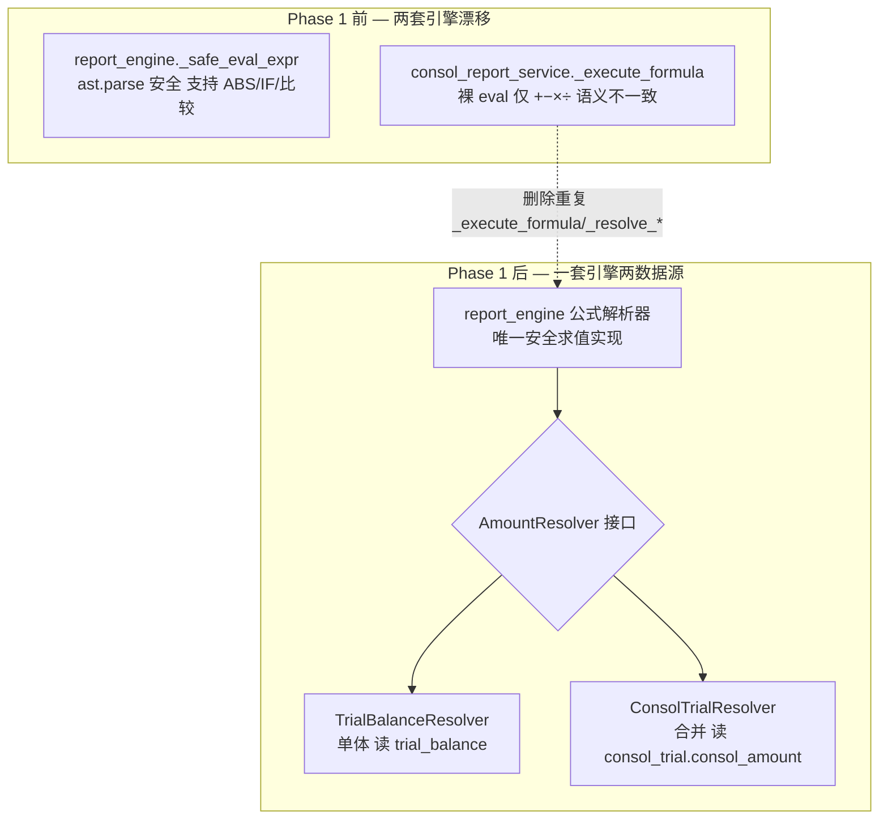
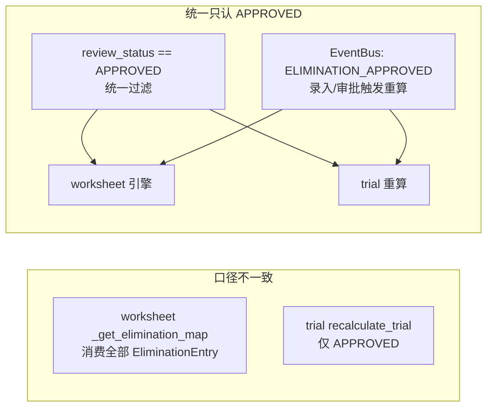
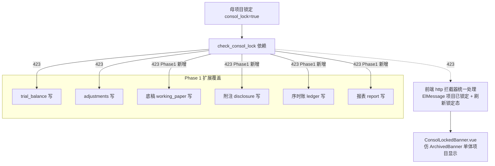
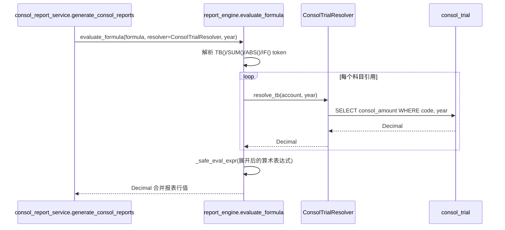

# 设计文档：consol-phase1-arch-lock（合并模块 Phase 1 架构修复 + 锁定闭环）

> 关联调研：#[[file:docs/proposals/consolidation-module-status-and-proposal.md]]
> 前置依赖：#[[file:.kiro/specs/consol-phase0-core-pipeline/design.md]]（Phase 0 已补 consol_lock 三列 + ORM + 去静默 pass + 审计留痕 + 项目级权限基线）
> 范围：Phase 1「架构修复 + 锁定闭环」（~2 人天，依赖 Phase 0 完成）
> 目标：**统一公式引擎语义（A1）+ 统一抵销口径（衔接2）+ 锁定全端点覆盖与前端闭环（F2/F4）**，消除腐化地基。

---

## 一、概述（Overview）

Phase 0 止血让合并数逻辑成立、补了 consol_lock 三层一致与审计留痕。Phase 1 在此基础上做**架构理顺**——不加新高端功能，专注消除"已腐化的地基"：

1. **A1 公式引擎统一**：`report_engine._safe_eval_expr`（ast.parse 安全求值，支持 ABS/IF/比较）已是 Phase 1 主引擎的正确实现，但 `consol_report_service._execute_formula` **仍用裸 `eval(safe_expr, ...)` 且只支持 `+−×÷`**（consol_report_service.py:253 实证）。导致**同一张报表的单体版和合并版公式行为不一致**（单体支持 ABS/IF，合并不支持）——审计数据准确性硬伤。Phase 1 让合并引擎**复用** `report_engine` 的公式解析器（经 `AmountResolver` 注入不同数据源），删除合并侧重复的 `_execute_formula`/`_resolve_*`。

2. **A2 数据源注入（AmountResolver）**：当前合并报表 = "整个 `ConsolReportService` 重写一遍 generate/execute/resolve"，而非"注入数据源"。这是 A1 漂移的根因（复制粘贴 + 各自演进）。Phase 1 抽象 `AmountResolver` 接口，`report_engine` 接受注入：单体注入 `TrialBalanceResolver`，合并注入 `ConsolTrialResolver`。一套引擎两个数据源。

3. **衔接2 抵销口径统一**：worksheet `_get_elimination_map` 消费**全部** `EliminationEntry`（仅 `is_deleted` 过滤，无 `review_status`，consol_worksheet_engine.py:126 实证）；trial `recalculate_trial` 只消费 **APPROVED**。两路径口径不一致，叠加 Phase 0 的 B2 对账必报 diff。Phase 1 统一为**只认 APPROVED**（draft 不进合并数），并让抵销分录录入/审批 → EventBus 触发 worksheet + trial 重算。

4. **F2/F4 锁定全端点覆盖 + 前端闭环**：Phase 0 已让 consol_lock 真实生效（列就位 + 去静默 pass）。Phase 1 把 `check_consol_lock` **扩展到全部子公司写端点**（底稿/附注/序时账/报表，当前仅 trial+adjustments 5 端点），新建前端 `ConsolLockedBanner.vue`（仿 `ArchivedBanner`），并统一前端 423 拦截处理（F4）。

**设计原则**：彻底解决不绕开（A1 复用安全解析器而非给裸 eval 打补丁）；金额 Decimal；改动后必 Playwright 实测；触类旁通 grep（锁定端点全覆盖）。

**范围外**（留 Phase 2/3）：cascade_refresh 编排者 / 一键刷新 / V2 附注接线 / 自动抵销生成（B3）/ 报表·附注穿透 UI / 双向导航 / 自动建树。

---

## 二、架构（Architecture）

### 2.1 公式引擎统一（A1 + A2 AmountResolver 注入）



**AmountResolver 抽象（A2 核心）**：
- `report_engine` 的公式求值不再硬编码"从 trial_balance 取数"，而是调用注入的 `AmountResolver.resolve_tb(account, year)` / `resolve_sum(codes, year)`。
- 单体报表注入 `TrialBalanceResolver`（读 `trial_balance.audited_amount`）。
- 合并报表注入 `ConsolTrialResolver`（读 `consol_trial.consol_amount`，复用 Phase 0 已打通的 individual_sum）。
- 删除 `consol_report_service._execute_formula`/`_resolve_consol_tb`/`_resolve_sum_consol`/`_extract_account_codes`（重复实现），改委托 `report_engine`。

### 2.2 抵销口径统一（衔接2）



- worksheet `_get_elimination_map` 加 `review_status == APPROVED` 过滤，与 trial 对齐。
- 抵销分录审批（→APPROVED）发 `ELIMINATION_APPROVED` 事件 → 订阅者触发 worksheet + trial 重算（复用既有 EventBus）。
- 与 Phase 0 B2 对账配合：口径统一后，worksheet 与 trial 的抵销维度差异（§Phase0 R9）收窄，对账 diff 应显著减少。

### 2.3 锁定全端点覆盖 + 前端闭环（F2/F4）



### 2.4 关键铁律对齐

| 铁律 | Phase 1 应用 |
|------|-------------|
| 彻底解决不绕开 | A1 删除裸 eval 复用 ast 安全解析器，不给 eval 打白名单补丁 |
| 金额 Decimal | AmountResolver 全程 Decimal；抵销聚合 Decimal |
| 改动后必 Playwright 实测 | 锁定全端点 423 + 前端 banner 必须真点 UI 验证（F2/F4 闭环） |
| 触类旁通 grep | 锁定端点全覆盖：grep 全部子公司写端点逐一挂 check_consol_lock |
| service 禁裸 SQL 操作 ORM 未声明列 | 沿用 Phase 0 ADR-CONSOL-002 |

---

## 三、组件与接口（Components and Interfaces）

### 组件 1：AmountResolver 抽象接口（A2 新建）

**职责**：把"金额从哪取"抽象为可注入接口，让 `report_engine` 一套公式求值逻辑服务单体 + 合并两个数据源。

```python
class AmountResolver(Protocol):
    async def resolve_tb(self, account_code: str, year: int, *, is_prior: bool = False) -> Decimal:
        """解析单个科目金额（TB 函数）。"""
    async def resolve_sum(self, account_codes: list[str], year: int, *, is_prior: bool = False) -> Decimal:
        """解析科目区间合计（SUM 函数）。"""

class TrialBalanceResolver:   # 单体：读 trial_balance.audited_amount
    def __init__(self, db, project_id): ...

class ConsolTrialResolver:    # 合并：读 consol_trial.consol_amount（Phase 0 已打通 individual_sum）
    def __init__(self, db, project_id): ...
```

**责任边界**：Resolver 只负责"取数"，不含公式解析/求值（那是 `report_engine` 的事）。取数口径与现有 `_resolve_consol_tb`/`_resolve_sum_consol` 一致（迁移逻辑，不改语义）。

### 组件 2：report_engine 公式求值接受注入（A1）

**职责**：`report_engine` 的公式求值入口接受 `AmountResolver` 参数；合并报表生成改为"复用 report_engine + 注入 ConsolTrialResolver"，删除 consol 侧重复实现。

**接口（改造）**：
```python
async def evaluate_formula(
    formula: str, *, resolver: AmountResolver, year: int, is_prior: bool = False
) -> Decimal:
    """统一公式求值：解析 TB()/SUM()/ABS()/IF() → 经 resolver 取数 → _safe_eval_expr 求值。
    单体注入 TrialBalanceResolver，合并注入 ConsolTrialResolver。"""
```

**删除项**：`consol_report_service._execute_formula` / `_resolve_consol_tb` / `_resolve_sum_consol` / `_extract_account_codes`（全部委托 report_engine）。`generate_consol_reports` 改调 `evaluate_formula(resolver=ConsolTrialResolver(...))`。

### 组件 3：抵销口径统一（衔接2）

**职责**：worksheet 与 trial 抵销消费口径统一为 `review_status == APPROVED`；审批事件触发重算。

**改造点**：
- `consol_worksheet_engine._get_elimination_map`：`where` 子句加 `EliminationEntry.review_status == ReviewStatusEnum.APPROVED`（对齐 trial）。
- 抵销审批端点（→APPROVED）发 `ELIMINATION_APPROVED` 事件（含 project_id/year）。
- 新增/复用 EventBus handler：订阅 `ELIMINATION_APPROVED` → 触发 `recalc_full(worksheet)` + `recalculate_trial`。

### 组件 4：锁定全端点覆盖（F2）

**职责**：`check_consol_lock` 依赖挂到全部子公司写端点。

**装配**：grep 全部子公司维度写端点（`working_paper` / `disclosure` / `ledger` / `report` 等的 POST/PUT/DELETE），在 `Depends` 链加 `check_consol_lock`。沿用 Phase 0 已修好的真实生效版本（去静默 pass）。

### 组件 5：ConsolLockedBanner.vue（F2 前端，仿 ArchivedBanner）

**职责**：单体项目检测到 `consol_lock == true` 时，在视图顶部显示锁定横幅 + 禁用编辑按钮。仿 `components/common/ArchivedBanner.vue`（读 useAuditContext / 无 props）。

```
ConsolLockedBanner.vue（components/common/）
- 读取项目锁定态（GET lock-status 或 useAuditContext 扩展）
- consol_lock=true → 显示「本项目已被合并项目锁定，暂不可编辑」橙色横幅
- canEdit=false → 编辑按钮 disabled（与 ArchivedBanner 同模式）
```

### 组件 6：前端 423 统一拦截（F4）

**职责**：http 拦截器对 423 响应统一处理：`ElMessage` 提示「项目已被合并锁定，无法修改」+ 触发锁定态刷新。

### 组件 7：负商誉处理修正（B6，CAS 20）

**职责**：修 `goodwill_service.calculate_goodwill` 的负商誉分支——删除编造的"25% 阈值 + 递延摊销"，统一"全额计入当期损益"。

```python
# 修复前（编造逻辑，违 CAS 20）
treatment = "计入损益" if abs(goodwill) < acquisition_cost * 0.25 else "递延收益摊销"
# 修复后（CAS 20 现行规定）
if goodwill < 0:   # 负商誉
    treatment = "计入当期损益（营业外收入）"
    review_hint = "需复核合并成本与可辨认净资产公允价值的计量"
else:
    treatment = "确认为商誉"
```

> 商誉计算公式本身（成本 − 可辨认净资产 FV × 母持股比例）不变；仅修负商誉后续处理分支。标 `[ ]* 待审计专业确认`。

### 组件 8：少数股东比例语义统一（B7）

**职责**：统一 `minority_share_ratio` 语义为"少数股东持股比例"，修 `consol_disclosure_service` 的求补数 bug。

```python
# consol_disclosure_service 修复前（误当母公司比例求补数）
minority_ratio = (1 - mi.minority_share_ratio or 1) * 100
# 修复后（直接用少数股东比例，与 minority_interest_service.calculate_mi 一致）
minority_ratio = (mi.minority_share_ratio or Decimal("0")) * 100
```

> 加单测锁口径：母 80%/子 20% → 附注少数股东持股比例 == 20%。标 `[ ]* 待审计专业确认`。

### 组件 9：consol_report_service sync/async 统一（A3）

**职责**：`ConsolReportService` 同步 `self.db.query(...).all()` → async `await self.db.execute(select(...))`；`*_sync` 包装用 `run_sync` 桥接。搭车 A1/A2 重构一并完成（避免二次触碰 consol_report_service）。

---

## 四、数据模型（Data Models）

Phase 1 **不新增表/列**（schema 已由 Phase 0 V027 补齐）。仅涉及：
- `EventType` 增补 `"ELIMINATION_APPROVED"`（若 EventBus 枚举未含）。
- AmountResolver / 公式求值返回 `Decimal`，无新持久化结构。

```python
@dataclass
class FormulaEvalResult:    # 可选：调试用
    formula: str
    resolved_value: Decimal
    referenced_accounts: list[str]
```

**校验规则**：
- `evaluate_formula` 对单体 / 合并注入不同 resolver，**公式语义必须一致**（同一 formula 字符串，ABS/IF/比较运算行为相同，仅取数源不同）。
- 抵销聚合金额全程 `Decimal`；APPROVED 过滤后 worksheet 与 trial 抵销总额按科目对齐（衔接2 收敛验证）。

---

## 五、低层设计（Low-Level Design）

### 5.1 公式求值统一时序（A1/A2）



**关键不变式**：同一 `formula`，`evaluate_formula(resolver=TrialBalanceResolver)` 与 `evaluate_formula(resolver=ConsolTrialResolver)` 的**解析与求值路径完全相同**，差异仅在 resolver 返回的数值（A1 语义一致性的形式化）。

### 5.2 抵销口径统一（衔接2）

```python
# consol_worksheet_engine._get_elimination_map 改造
result = await db.execute(
    sa.select(EliminationEntry).where(
        EliminationEntry.project_id == project_id,
        EliminationEntry.year == year,
        EliminationEntry.review_status == ReviewStatusEnum.APPROVED,  # ← Phase 1 新增，对齐 trial
        EliminationEntry.is_deleted == sa.false(),
    )
)
```

**审批触发重算**：
```python
# 抵销审批端点 → APPROVED 后
await event_bus.publish("ELIMINATION_APPROVED", {"project_id": str(pid), "year": year})

# handler
async def on_elimination_approved(payload):
    await recalc_full(db, payload["project_id"], payload["year"])      # worksheet
    await recalculate_trial(db, payload["project_id"], payload["year"]) # trial（含 Phase 0 B1 汇总）
```

**后置条件**：审批一笔抵销后，worksheet 与 trial 都自动重算并纳入该笔；两者抵销消费集合相同（均 APPROVED）。

### 5.3 锁定全端点覆盖（F2）

```python
# 子公司写端点统一加依赖（grep 全覆盖后逐一挂）
@router.put("/api/working-papers/{wp_id}", dependencies=[Depends(check_consol_lock)])
@router.post("/api/disclosure-notes/...", dependencies=[Depends(check_consol_lock)])
# ... 序时账 / 报表写端点同理
```

> `check_consol_lock` 的 `project_id` 来源：写端点路径含 project_id 直接注入；若端点仅含 wp_id/note_id 则需先解析所属 project_id（设计：在依赖内按资源 id 反查 project_id 再判锁）。

**后置条件**：母项目锁定后，任一子公司写端点操作返回 423；解锁后恢复。

### 5.4 前端锁定 banner + 423 拦截（F2/F4）

```typescript
// http 拦截器
if (error.response?.status === 423) {
  ElMessage.warning('项目已被合并锁定，无法修改')
  // 触发当前项目锁定态刷新（useAuditContext / store）
}
```

```vue
<!-- ConsolLockedBanner.vue 用法（仿 ArchivedBanner）-->
<ConsolLockedBanner />   <!-- 无 props，内部读锁定态 -->
```

**Playwright 闭环验证**（F2/F4 必做）：补列(Phase0) → 后端锁 → 前端点锁定 → 真改子公司被拦 423 → 前端 ElMessage + banner 显示锁定态。

---

## 六、正确性属性与测试策略（hypothesis）

| # | 属性名 | 不变式 | 守护 | 框架 |
|---|--------|--------|------|------|
| Q1 | 公式语义一致 | 同一 formula，单体/合并 resolver 的解析+求值路径相同，仅取数值不同；ABS/IF/比较行为一致 | A1/A2 | hypothesis |
| Q2 | 求值安全 | evaluate_formula 不执行 eval；非法/注入表达式返回 0 不抛 | A1 | hypothesis |
| Q3 | 抵销口径一致 | worksheet 与 trial 消费的抵销集合相同（均 review_status==APPROVED） | 衔接2 | hypothesis |
| Q4 | 审批触发重算幂等 | 同一笔抵销审批重复触发 ELIMINATION_APPROVED，worksheet/trial 结果不变（幂等） | 衔接2 | hypothesis |
| Q5 | 锁定全端点覆盖 | 锁定态下任一子公司写端点（底稿/附注/序时账/报表）必返 423 | F2 | 集成测试参数化 |
| Q6 | Decimal 无精度丢失 | AmountResolver + 抵销聚合全程 Decimal，无 float 中转 | 金额铁律 | hypothesis |
| Q7 | 少数股东比例语义正确 | minority_share_ratio 直接作少数股东比例（不求补数）；母80%/子20% → 附注显示 20% | B7 口径 | hypothesis |

**测试三层边界**：
- 纯函数单测（PBT 主战场）：Q1/Q2/Q6 公式求值用合成 formula + mock resolver；Q3 抵销过滤纯逻辑。
- 合成数据集成测试：Q4 审批触发重算端到端；Q5 锁定全端点 423 参数化（遍历底稿/附注/序时账/报表写端点）。
- 真实 UAT：合并报表数值正确性卡 Phase 4 真实数据，显式标"待数据"不伪绿。
- **回归守门**：A1 改造后单体报表既有测试必须全绿（公式语义一致性的反向保证——复用引擎不能破坏单体行为）。

---

## 七、错误处理（Error Handling）

| # | 场景 | 响应 |
|---|------|------|
| EH1 | 公式含非法/注入表达式 | evaluate_formula 返回 Decimal("0") + warning 日志，不抛（沿用 _safe_eval_expr 行为） |
| EH2 | resolver 取数科目不存在 | 返回 Decimal("0")（缺科目视为 0，与现有 _resolve_consol_tb 一致） |
| EH3 | 抵销审批触发重算失败 | 重算异常记 error 日志，不阻断审批本身（审批已落库）；下次手动 recalc 兜底 |
| EH4 | 锁定端点 project_id 反查失败 | 资源 id 查不到所属项目 → 放行（不误拦）+ warning 日志 |
| EH5 | 前端 423 | http 拦截器统一 ElMessage + 刷新锁定态（F4） |

**关键取舍**：EH3 审批与重算解耦（审批同步落库 + 重算异步/可重试），避免重算故障导致审批失败（与 Phase 0 E9 留痕同事务不同——审批本身已有自己的留痕，重算是下游派生）。

---

## 八、风险与缓解

| # | 风险 | 等级 | 缓解 |
|---|------|------|------|
| R1 | A1 复用 report_engine 破坏单体报表既有行为 | 🔴 | 改造前跑单体报表全量回归基线；evaluate_formula 接口对单体注入 TrialBalanceResolver 后行为须与改造前逐位一致（Q1 + 回归守门） |
| R2 | consol_report_service 公式 DSL 与 report_engine 不完全同构（合并可能有独有函数） | 🟠 | 改造前 diff 两侧支持的函数集；若合并有独有 token，先在 report_engine 补齐再统一，不丢功能 |
| R3 | 抵销口径从"全部"改"仅 APPROVED"改变既有 worksheet 数值 | 🟠 | 属预期修正（draft 不应进合并数）；改动标注 + 集成测试验证只 APPROVED 进数；通知用户口径变更 |
| R4 | 锁定端点 project_id 反查增加查询开销 | 🟡 | 仅写端点触发（低频）；反查走主键索引；必要时缓存 resource→project 映射 |
| R5 | 锁定全端点覆盖遗漏 | 🟠 | grep 全部子公司写端点逐一核对（触类旁通铁律）；Q5 参数化集成测试遍历覆盖 |
| R6 | A1/A2 大重构回归面广 | 🟠 | 依赖 Phase 0 完成（trial 已通）；删除重复代码前先让 report_engine 注入版跑通合并用例再删 consol 侧 |
| R7 | B6/B7 会计准则/口径修正未经审计专业确认即误判 | 🔴 | B6 负商誉 + B7 少数股东比例标 `[ ]* 待审计专业确认`，懂 CAS 20 的人复核后才标完成；改动小（删分支/改求补数）但定性归会计正确性层 |
| R8 | A3 sync→async 改造触发 MissingGreenlet 或破坏 *_sync 调用方 | 🟠 | 搭车 A1/A2 重构（已触碰 consol_report_service）；grep *_sync 调用方确认 run_sync 桥接；集成测试覆盖关键查询 |

---

## 九、架构决策记录（ADR）

### ADR-CONSOL-101：合并报表复用 report_engine（AmountResolver 注入，删除重复公式引擎）

**状态**：已接受　**日期**：2026-05-30

**背景**：`report_engine._safe_eval_expr`（ast.parse 安全求值，支持 ABS/IF/比较）是 Phase 1 主引擎正确实现；但 `consol_report_service._execute_formula` 仍用裸 `eval` 且只支持 +−×÷（consol_report_service.py:253 实证）。同一报表单体版/合并版公式语义不一致 = 审计准确性硬伤，根因是 Phase 2 起步复制 Phase 1 旧逻辑后各自演进（A1/A2）。

**决策**：抽象 `AmountResolver` 接口，`report_engine` 公式求值接受注入；单体注入 `TrialBalanceResolver`、合并注入 `ConsolTrialResolver`；删除 consol 侧 `_execute_formula`/`_resolve_*`/`_extract_account_codes`。一套引擎两数据源。

**为什么不给裸 eval 打白名单补丁**：eval 是反模式（memory 彻底解决不绕开），主引擎已证明 ast 方案可行；继续维护两套求值器必然再次漂移。

**结果**：正向=公式语义统一 + 消除重复 + 单体改进自动惠及合并；代价=重构回归面（R1/R6，靠单体回归基线 + 注入版先跑通再删旧守门）。

### ADR-CONSOL-102：抵销消费统一为 APPROVED + 事件驱动重算

**状态**：已接受　**日期**：2026-05-30

**背景**：worksheet `_get_elimination_map` 消费全部 EliminationEntry（仅 is_deleted 过滤，consol_worksheet_engine.py:126 实证），trial 只消费 APPROVED → 两路径口径不一致，是 Phase 0 B2 对账 diff 的根因之一（衔接2/Phase0 R9）。

**决策**：统一只认 `review_status == APPROVED`（draft 不进合并数）；抵销审批发 `ELIMINATION_APPROVED` 事件 → 触发 worksheet + trial 重算。

**为什么选 APPROVED**：未审批的 draft 抵销进合并数会让"未定稿"的抵销影响正式合并报表，违审计复核流程；APPROVED 是已复核口径，与 trial 既有选择一致（向 trial 看齐而非 worksheet）。

**结果**：正向=两路径口径一致，Phase 0 B2 对账 diff 收窄；代价=改变既有 worksheet 数值（R3，属预期修正需通知用户）。

### ADR-CONSOL-103：锁定按子公司写端点全覆盖（不止 trial+adjustments）

**状态**：已接受　**日期**：2026-05-30

**背景**：Phase 0 让 consol_lock 真实生效，但 check_consol_lock 仅挂 trial_balance + adjustments 5 端点；底稿/附注/序时账/报表写端点未挂 → 锁定覆盖窄，"锁了等于半锁"。

**决策**：grep 全部子公司维度写端点，逐一挂 check_consol_lock；端点仅含资源 id（wp_id/note_id）时在依赖内反查所属 project_id 再判锁；前端建 ConsolLockedBanner + 423 统一拦截。

**结果**：正向=锁定真正覆盖子公司全部数据修改入口（F2 闭环）；代价=反查开销（R4，写端点低频可接受）+ 覆盖遗漏风险（R5，grep + Q5 参数化守门）。

### ADR-CONSOL-104：负商誉按 CAS 20 全额计入当期损益（删除编造的递延摊销）

**状态**：已接受（待审计专业确认）　**日期**：2026-05-30

**背景**：`goodwill_service.calculate_goodwill` 的负商誉处理 `treatment = "计入损益" if abs(goodwill) < acquisition_cost * 0.25 else "递延收益摊销"` 是**编造的会计逻辑**——CAS 20《企业合并》规定负商誉经复核后全额计入当期损益（营业外收入），无"25% 阈值"、无"递延收益摊销"（后者是旧准则/早期 IFRS 做法，现行 CAS 已废止）。这是调研里**唯一的会计准则硬错误**（"实现了但算错"比"没做"更危险，用户会采信）。

**决策**：删除 25% 阈值 + 递延摊销分支，负商誉统一"计入当期损益（营业外收入）"+ 提示审计师复核合并成本与可辨认净资产公允价值计量；商誉计算公式本身不变。标 `[ ]* 待审计专业确认`。

**结果**：正向=会计处理符合现行准则；代价=需懂 CAS 20 的审计专业人员复核后才标完成（代码 review 看不出准则错误）。

### ADR-CONSOL-105：minority_share_ratio 字段语义统一为"少数股东持股比例"

**状态**：已接受（待审计专业确认）　**日期**：2026-05-30

**背景**：同一 `minority_share_ratio` 字段两处语义不一致——`minority_interest_service.calculate_mi` 当少数股东比例直接用（正确），`consol_disclosure_service` 当母公司比例求补数 `(1 - ratio) * 100`（错误）→ 附注少数股东持股比例可能算反（母 80%/子 20% 显示 80%）。

**决策**：统一语义为"少数股东持股比例"；修 consol_disclosure_service 不再求补数；加单测锁口径（母 80%/子 20% → 附注 20%）。标 `[ ]* 待审计专业确认` 字段最终口径。

**结果**：正向=口径一致 + 单测守门防回归；代价=需确认字段语义最终定义（审计专业）。

### ADR-CONSOL-106：consol_report_service 统一 async（搭车 A1/A2 重构）

**状态**：已接受　**日期**：2026-05-30

**背景**：`ConsolReportService.__init__(db: AsyncSession)` 声明 async session，方法体内却用同步 `self.db.query(...).all()`，SQLAlchemy 2.0 下易触发 `MissingGreenlet`（A3）。

**决策**：同步 query → async `await self.db.execute(select(...))`；`*_sync` 包装用 `run_sync` 桥接。因 A1/A2 已重构 consol_report_service，A3 搭车一并完成，避免二次触碰。

**结果**：正向=消除 MissingGreenlet 风险 + 与 A1/A2 一次改完；代价=改造面与 A1/A2 重叠（统一回归测试覆盖，R8）。

---

## 十、设计完成检查清单

- [x] §一~§五（概述/架构/组件接口/数据模型/低层设计）
- [x] §六 正确性属性 Q1~Q7 + 三层测试边界 + 单体回归守门
- [x] §七 错误处理 EH1~EH5
- [x] §八 风险 R1~R8
- [x] §九 ADR-CONSOL-101/102/103/104/105/106
- [x] 依赖 Phase 0：consol_lock 三层一致 + B1 trial 已通 + 审计留痕基线
- [ ] 待下一步：requirements.md → tasks.md
