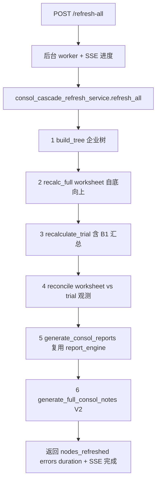
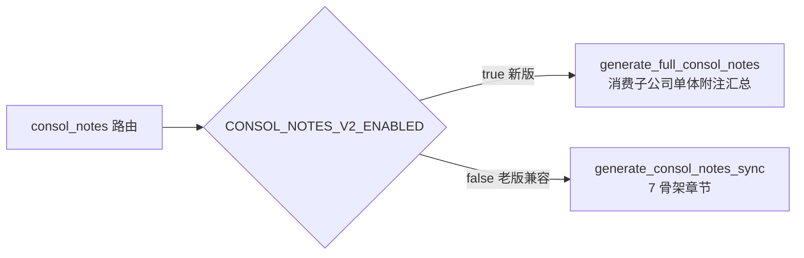
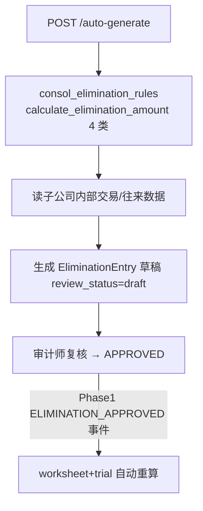

# 设计文档：consol-phase2-orchestration（合并模块 Phase 2 编排 + 接线 + 报表穿透）

> 关联调研：#[[file:docs/proposals/consolidation-module-status-and-proposal.md]]
> 前置依赖：consol-phase0-core-pipeline（B1/B2/consol_lock）+ consol-phase1-arch-lock（公式引擎统一 + 抵销 APPROVED + 事件重算）
> 范围：Phase 2「编排 + 接线 + 报表穿透」（~2 人天）
> 目标：**建统一编排者（A6/C2）+ 一键级联刷新 + V2 附注接线 + B3 自动抵销 + 衔接4 报表穿透（低垂果实）**。

---

## 一、概述（Overview）

Phase 0/1 让合并数逻辑成立、引擎与抵销口径统一。Phase 2 补"编排与接线"——把散落各 router 的合并步骤收敛为统一编排者，并接通已写好却孤立的功能：

1. **A6/C2 统一编排者（cascade_refresh）**：合并"建树→取数→worksheet→trial→report→notes"全链路无统一入口，散在各 router（`consolidation_orchestrator` 源码被删剩 pyc，C2）。新建 `consol_cascade_refresh_service`，定义清晰 DAG 执行顺序 + 失败隔离 + 进度上报。

2. **一键级联刷新**：现有刷新端点各自为政（worksheet recalc / trial recalculate / notes reaggregate / 单章节 refresh）。新建 `POST /api/consolidation/{pid}/{year}/refresh-all`（树遍历 → 按依赖顺序 recalc worksheet→trial→report→notes）+ SSE 进度。走后台 worker 不占请求连接（A5 性能：避免打爆 asyncpg pool）。

3. **V2 附注接线**：`generate_full_consol_notes`（V2，consol_disclosure_service.py:792，消费子公司单体附注汇总）是**孤儿**——consol_notes.py 路由 3 个端点调的是**老版** `generate_consol_notes_sync`（line 745，只生成 7 骨架章节不消费子公司数据）。Phase 2 用 feature flag 把 V2 接入路由（新/老版灰度切换，老版兼容保留）。

4. **B3 自动抵销生成**：`auto_generate_eliminations` 端点（consolidation.py 已有）+ `consol_elimination_rules.calculate_elimination_amount`（4 类预设：internal_ar/revenue/inventory/dividend）已实证存在但**未接通**。Phase 2 让端点调 elimination_rules，从子公司内部交易自动生成抵销**草稿**（draft），审计师复核后 APPROVED（Phase 1 已定 APPROVED 才进合并数）。

5. **衔接4 报表穿透（低垂果实）**：worksheet 已有 `node_company_code` 明细数据，只缺端点 + provenance。Phase 2 补报表级穿透后端（合并报表行 → 该科目在各子公司金额 + 抵销额），复用 Phase 0 写入的 `consolidation_breakdown`。报表穿透 UI 留 Phase 3，但后端端点 + 数据 Phase 2 就位。

**设计原则**：编排者单一入口 + DAG 依赖顺序 + 失败隔离；一键刷新走 worker + SSE 不占连接（A5）；V2 灰度不破坏老版；自动抵销只生成 draft 不自动进数。

**范围外**（留 Phase 3/4）：报表/附注穿透 UI 组件 / 双向导航 / 自动建树 / 附注穿透 provenance（依赖更多 B1 元数据）/ 真实数据 UAT。

---

## 二、架构（Architecture）

### 2.1 统一编排者 cascade_refresh（A6/C2）



**DAG 依赖顺序**（notes 依赖 report 依赖 trial 依赖 worksheet 依赖 tree）：严格自底向上，每步失败隔离（记错误继续/中断由策略定），进度经 SSE 上报。编排者是 C2 被删 `consolidation_orchestrator` 的重建。

### 2.2 V2 附注接线（feature flag 灰度）



### 2.3 B3 自动抵销生成（接通孤立规则）



> 自动生成只产 draft；APPROVED 才进合并数（Phase 1 ADR-CONSOL-102），审批后经 Phase 1 事件触发重算。

### 2.4 衔接4 报表穿透后端（低垂果实）

```mermaid
graph LR
    ROW[合并报表行] --> EP[GET /report/{rid}/consol-breakdown]
    EP --> WS[ConsolWorksheet node_company_code 明细]
    EP --> BD[consol_trial.consolidation_breakdown<br/>Phase0 已写 provenance]
    WS --> RESP[各子公司金额 + 抵销额 + 占比]
    BD --> RESP
    RESP -.UI 留 Phase3.-> DIALOG[ConsolBreakdownDialog]
```

### 2.5 关键铁律对齐

| 铁律 | Phase 2 应用 |
|------|-------------|
| 缺统一编排者根治 | cascade_refresh 单一入口 + DAG，重建被删的 orchestrator（C2） |
| A5 性能 | 一键刷新走后台 worker + SSE，不占 asyncpg 请求连接（呼应 SSE 打爆 pool 教训） |
| feature flag 灰度 | V2 附注接线双版本并存，老版兼容保留 |
| router_registry 必查 | 新端点 refresh-all / consol-breakdown 挂现有 consolidation router 或登记 |
| 改动后必 Playwright 实测 | 一键刷新 SSE 进度 + V2 附注前端表现需实测 |

---

## 三、组件与接口（Components and Interfaces）

### 组件 1：consol_cascade_refresh_service（A6/C2 新建，编排者）

```python
async def refresh_all(
    db: AsyncSession, parent_project_id: UUID, year: int,
    *, progress_cb: Callable | None = None,
) -> CascadeRefreshResult:
    """统一编排：build_tree → recalc_full(worksheet) → recalculate_trial(含B1) →
    reconcile(观测) → generate_consol_reports → generate_full_consol_notes(V2)。
    按 DAG 自底向上；每步失败隔离记 errors；progress_cb 经 SSE 上报。"""
```

**责任边界**：只编排不重算（调既有 service）；定义依赖顺序 + 失败隔离 + 进度；是被删 `consolidation_orchestrator` 的重建（C2）。

### 组件 2：一键刷新端点 + worker + SSE

```python
POST /api/consolidation/{project_id}/{year}/refresh-all
  -> {"job_id": ...}   # 异步，走后台 worker
GET  /api/consolidation/{project_id}/{year}/refresh-progress  (SSE)
  -> event: progress {step, total, current_node, status}
```

> 走后台 worker（不在请求线程跑全量重算，A5）；SSE 推进度，避免轮询打爆 pool。

### 组件 3：V2 附注接线（feature flag）

```python
CONSOL_NOTES_V2_ENABLED: bool = False   # 灰度开关，默认老版

# consol_notes 路由 3 端点改：
if settings.CONSOL_NOTES_V2_ENABLED:
    sections = await generate_full_consol_notes(db, project_id, year)   # V2 消费子公司
else:
    sections = generate_consol_notes_sync(db, project_id, year)         # 老版兼容
```

### 组件 4：B3 自动抵销接通

```python
# consolidation.py: auto_generate_eliminations 端点接通 elimination_rules
POST /api/consolidation/eliminations/auto-generate?project_id&year
  -> 读子公司内部交易/往来 → calculate_elimination_amount(4 类规则)
     → 生成 EliminationEntry(review_status=draft) → 返回草稿清单
```

> 只产 draft；审计师审批 → APPROVED → Phase 1 事件触发重算。

### 组件 5：报表穿透后端（衔接4）

```python
GET /api/consolidation/report/{project_id}/{year}/{account_code}/consol-breakdown
  -> {
       "account_code": ...,
       "by_company": [{company_code, company_name, amount, ratio}],  # 来自 ConsolWorksheet node_company_code + Phase0 breakdown
       "elimination": ...,
       "consolidated": ...,
     }
```

> 复用 Phase 0 写入的 `consol_trial.consolidation_breakdown` + worksheet `node_company_code` 明细。UI（ConsolBreakdownDialog）留 Phase 3。

---

## 四、数据模型（Data Models）

Phase 2 **不新增表**（schema 由 Phase 0 V027 备齐）。涉及：
- `EventType` 沿用 Phase 1 `ELIMINATION_APPROVED`。
- 刷新 job 状态可复用既有 import_job 式 job 表或轻量内存 + SSE（设计倾向复用既有 job 基础设施）。
- 返回数据类：

```python
@dataclass
class CascadeRefreshResult:
    parent_project_id: UUID
    year: int
    nodes_refreshed: int
    steps_completed: list[str]     # [tree, worksheet, trial, reconcile, report, notes]
    errors: list[dict]             # [{step, node, error}]
    duration_ms: int
    reconciliation: ReconciliationResult | None   # Phase 0 对账结果（观测）
```

**校验规则**：
- DAG 顺序不可乱（notes 必在 report 后，report 必在 trial 后）。
- 自动抵销生成的 EliminationEntry 必须 `review_status=draft`（不可直接 APPROVED）。
- 报表穿透 `by_company[*].amount` 之和（叠加抵销）== 该科目 `consolidated`（provenance 自洽，复用 Phase 0 P2）。

---

## 五、低层设计（Low-Level Design）

### 5.1 cascade_refresh DAG 编排

```python
async def refresh_all(db, parent_project_id, year, *, progress_cb=None):
    result = CascadeRefreshResult(parent_project_id, year, 0, [], [], 0, None)
    t0 = now()
    tree = await build_tree(db, parent_project_id)          # 1
    _emit(progress_cb, "tree", ...)
    # 2 worksheet 自底向上（recalc_full 内部已后序遍历）
    await recalc_full(db, parent_project_id, year); result.steps_completed.append("worksheet")
    # 3 trial（含 Phase 0 B1 individual_sum 汇总）
    await recalculate_trial(db, parent_project_id, year); result.steps_completed.append("trial")
    # 4 对账（Phase 0 观测，不阻断）
    result.reconciliation = await reconcile_worksheet_vs_trial(db, parent_project_id, year)
    # 5 报表（Phase 1 统一引擎）
    await generate_consol_reports(db, parent_project_id, year); result.steps_completed.append("report")
    # 6 附注 V2（feature flag）
    if settings.CONSOL_NOTES_V2_ENABLED:
        await generate_full_consol_notes(db, parent_project_id, year)
    result.steps_completed.append("notes")
    result.duration_ms = elapsed_ms(t0)
    return result
```

**失败隔离**：每步 try/except → 记 `errors.append({step, node, error})`；策略 = 关键步骤（worksheet/trial）失败中断，下游步骤（notes）失败继续（标记部分成功）。

**前置条件**：parent_project_id 是合并母项目；子公司 TB 已审定（无则贡献 0，Phase 0 E1）。
**后置条件**：steps_completed 反映实际完成步骤；errors 含失败步骤；SSE 推送每步进度。

### 5.2 一键刷新 worker + SSE（A5 不占连接）

```python
@router.post("/{project_id}/{year}/refresh-all")
async def trigger_refresh_all(project_id, year, ...):
    job_id = await enqueue_refresh_job(project_id, year)   # 入队后台 worker
    return {"job_id": job_id}

# worker 内调 refresh_all(progress_cb=publish_sse)
# 前端经 SSE 订阅 refresh-progress 显示进度条
```

> 全量重算放后台 worker（A5：大集团数十秒不阻塞请求），SSE 推进度（不轮询打爆 pool）。

### 5.3 B3 自动抵销生成

```python
async def auto_generate_eliminations(db, project_id, year):
    children = await _load_child_internal_trades(db, project_id, year)
    drafts = []
    for rule_type in ("internal_ar", "internal_revenue", "internal_inventory_unrealized", "internal_dividend"):
        amount = calculate_elimination_amount(rule_type, child_projects=children, ctx=...)
        if amount != ZERO:
            entry = EliminationEntry(project_id=project_id, year=year, rule_type=rule_type,
                                     review_status=ReviewStatusEnum.DRAFT, ...)   # 仅 draft
            db.add(entry); drafts.append(entry)
    await db.commit()
    return drafts
```

**后置条件**：所有自动生成 entry 均 `review_status == DRAFT`；不触发重算（要 APPROVED 才经 Phase 1 事件重算）。

### 5.4 报表穿透后端

```python
async def get_report_consol_breakdown(db, project_id, year, account_code):
    trial = await _get_trial_row(db, project_id, year, account_code)
    breakdown = trial.consolidation_breakdown or {}    # Phase 0 写入的 provenance
    by_company = breakdown.get("by_company", [])
    total = sum(Decimal(c["amount"]) for c in by_company)
    for c in by_company:
        c["ratio"] = str((Decimal(c["amount"]) / total).quantize(Decimal("0.0001"))) if total else "0"
    return {"account_code": account_code, "by_company": by_company,
            "elimination": str(trial.consol_elimination), "consolidated": str(trial.consol_amount)}
```

**后置条件**：`Σ by_company[*].amount` == `individual_sum`（Phase 0 P2 provenance 自洽）；穿透数据来自已落库 breakdown，无额外重算。

---

## 六、正确性属性与测试策略（hypothesis）

| # | 属性名 | 不变式 | 守护 | 框架 |
|---|--------|--------|------|------|
| S1 | DAG 顺序不变 | refresh_all 的 steps_completed 顺序恒为 worksheet→trial→report→notes（notes 必在 report 后，report 必在 trial 后） | A6 编排 | hypothesis |
| S2 | 失败隔离 | 任一下游步骤失败，errors 记录该步且不污染已完成步骤的结果；关键步骤失败则中断 | A6 | hypothesis |
| S3 | 自动抵销仅 draft | auto_generate 产出的所有 EliminationEntry review_status==DRAFT，不触发重算 | B3 | hypothesis |
| S4 | V2 灰度等价老版结构 | CONSOL_NOTES_V2_ENABLED 切换不破坏返回结构契约（章节列表 schema 一致），仅内容来源不同 | V2 接线 | 集成测试 |
| S5 | 穿透 provenance 自洽 | 报表穿透 Σ by_company[*].amount == individual_sum（复用 Phase 0 P2） | 衔接4 | hypothesis |
| S6 | 一键刷新幂等 | 同 project/year 连续两次 refresh_all 结果数值一致（幂等，含 B1/抵销重算） | A6 | hypothesis |
| S7 | cross_template 降级不丢章节 | template_type 不同时章节经 translate_child_section 翻译后汇总；无匹配映射降级原样汇总 + warning，汇总结果章节数 == 输入章节数（不丢） | cross_template 接线 | hypothesis |
| S8 | 签字快照可还原 | create_snapshot 后，即使子公司数据/抵销被改，从快照反序列化能还原"签字时合并数"且哈希校验通过 | P2 签字冻结 | 集成测试 |

**测试三层边界**：
- 纯函数单测：S1/S2 编排顺序与失败隔离用 mock service；S3 自动抵销状态；S5 穿透聚合纯逻辑；S7 cross_template 翻译/降级纯逻辑。
- 合成数据集成测试：S4 V2 灰度结构契约；S6 一键刷新幂等端到端；S8 签字快照存取还原；SSE 进度事件序列。
- 契约/前端测试：需求 7（公式管理数据源树补节点 + formula_audit_log module='consol'）用集成测试验证审计写入；需求 9（F3 前端 apiPaths 补路径）用前端路径契约核对 + Playwright 调通后端。
- 真实 UAT：V2 附注消费子公司真实数据正确性 + cross_template 真实国企↔上市映射卡 Phase 4，显式标"待数据"不伪绿。

---

## 七、错误处理（Error Handling）

| # | 场景 | 响应 |
|---|------|------|
| EH1 | 编排某步失败 | 记 errors[{step,node,error}]；关键步（worksheet/trial）中断，下游步（notes）继续标部分成功（S2） |
| EH2 | 一键刷新 worker 异常 | job 状态置 failed + SSE 推 error 事件；不影响其他请求（隔离在 worker） |
| EH3 | V2 附注生成失败 | feature flag 下 V2 异常回退老版兼容 + warning 日志（不让接线破坏既有可用性） |
| EH4 | 自动抵销规则无匹配数据 | calculate_elimination_amount 返回 0 → 不生成 entry，不报错（无内部交易属正常） |
| EH5 | 穿透科目无 breakdown | trial 行无 consolidation_breakdown（未跑 B1）→ 返回空 by_company + 提示"请先刷新合并数" |
| EH6 | SSE 连接断开 | 前端重连续推；job 状态可经 GET job 兜底查询（不依赖 SSE 必达） |
| EH7 | cross_template 翻译无匹配映射 | 降级为原样汇总 + warning，不丢章节（不让翻译缺失导致章节丢失） |
| EH8 | ConsolSnapshot 序列化数据过大 | 快照存储压缩（base64+gzip，复用 wp_offline _meta_ 模式）+ 大小监控 |

---

## 八、风险与缓解

| # | 风险 | 等级 | 缓解 |
|---|------|------|------|
| R1 | 一键全量重算性能（大集团数十秒，A5） | 🟠 | 走后台 worker + SSE，不占请求连接；中期增量重算留 Phase 后续（stale 基础设施已有） |
| R2 | V2 附注接线改变前端"生成合并附注"行为 | 🟠 | feature flag 默认老版，灰度切换；V2 异常回退老版（EH3）；返回结构契约一致（S4） |
| R3 | 编排者与既有散落 recalc 端点重复/冲突 | 🟠 | cascade_refresh 复用既有 service 不重写；既有单步端点保留（细粒度刷新），refresh-all 是组合入口 |
| R4 | 自动抵销规则误生成错误草稿 | 🟠 | 只产 draft 必经人工审批；calculate_elimination_amount 已有单测；审批前不进合并数 |
| R5 | SSE 打爆 asyncpg pool（重蹈覆辙） | 🟠 | SSE 用独立连接/Redis pub-sub；job 状态 GET 兜底（EH6），不强依赖长连接 |
| R6 | 穿透 provenance 依赖 Phase 0 B1 已跑 | 🟡 | EH5 无 breakdown 时友好提示；穿透前确保 refresh-all 已执行 |

---

## 九、架构决策记录（ADR）

### ADR-CONSOL-201：重建统一编排者 cascade_refresh（填补被删的 orchestrator）

**状态**：已接受　**日期**：2026-05-30

**背景**：合并"建树→worksheet→trial→report→notes"全链路无统一入口，散在各 router；`consolidation_orchestrator` 源码被删剩 stale pyc（C2）→ 编排层被抽空导致步骤散落、依赖顺序无保证（notes 依赖 report 依赖 trial）。用户"一键刷新"诉求本质就是要这个编排者。

**决策**：新建 `consol_cascade_refresh_service.refresh_all` 作唯一编排入口，定义 DAG 自底向上顺序 + 失败隔离 + SSE 进度；复用既有 service 不重写；既有单步 recalc 端点保留作细粒度入口。

**结果**：正向=依赖顺序有保证 + 一键刷新有载体 + 重建 C2 被删编排层；代价=与单步端点并存（R3，组合 vs 细粒度分工明确）。

### ADR-CONSOL-202：V2 附注 feature flag 灰度接线（不破坏老版）

**状态**：已接受　**日期**：2026-05-30

**背景**：`generate_full_consol_notes`（V2，消费子公司单体附注汇总）是孤儿，路由调老版 `generate_consol_notes_sync`（7 骨架章节不消费子公司）。直接切 V2 风险高（V2 未经真实数据验证）。

**决策**：`CONSOL_NOTES_V2_ENABLED` 开关默认老版；V2 异常回退老版；返回结构契约保持一致。真实数据验证通过后（Phase 4）再默认 V2。

**结果**：正向=V2 接通且可灰度 + 老版兜底不破坏可用性；代价=双版本并存维护（待 Phase 4 验证后收敛）。

### ADR-CONSOL-203：自动抵销只产 draft，审批后才进合并数

**状态**：已接受　**日期**：2026-05-30

**背景**：`auto_generate_eliminations` 端点 + `calculate_elimination_amount`（4 类规则）已存在但未接通；大集团内部交易上百笔纯手工不现实（B3）。

**决策**：端点接通 elimination_rules 自动生成 EliminationEntry，但**强制 review_status=draft**；审计师复核 → APPROVED → 经 Phase 1 `ELIMINATION_APPROVED` 事件触发重算才进合并数。

**为什么不自动 APPROVED**：自动生成可能算错（规则覆盖不全/数据不准），未经复核进合并数违审计流程；draft + 人工审批是会计审慎原则。

**结果**：正向=自动化省人力 + 人工把关防错；代价=仍需审批步骤（但比纯手工录入高效）。

### ADR-CONSOL-204：cross_template 随 V2 接线（接通国企↔上市孤儿）

**状态**：已接受　**日期**：2026-05-30

**背景**：`consol_cross_template_service`（3 API：translate_child_section / aggregate_cross_template / build_cross_template_provenance）已写好但 **0 router 引用，仅文件内部互调**（与 generate_full_consol_notes 并列"两大孤儿"，且是用户点名 5 大能力之一）。Phase 2 接 V2 附注时若不一并接 cross_template，国企子公司↔上市母公司混合集团的附注汇总仍不可用。

**决策**：cross_template 随 V2 附注汇总路径接线（reaggregate / generate_full_consol_notes 内调 translate_child_section）；feature flag 受控；无匹配映射降级原样汇总 + warning（EH7）。

**结果**：正向=消除第二个孤儿 + 国企↔上市混合集团附注可用；代价=依赖 V2 启用（与 ADR-202 同前提）+ 真实映射卡审计师（Phase 4 mock CSV 替换）。

### ADR-CONSOL-205：合并公式纳入公式管理中心 + formula_audit_log

**状态**：已接受　**日期**：2026-05-30

**背景**：公式管理中心 `FormulaManagerScope` 已含 `consol_note` 但数据源树只有试算表/报表/附注，**无合并工作底稿/合并报表节点**；合并公式散在 consol_report_service（旧 eval，Phase 1 已统一）+ 前端 computed + mock CSV，未纳入管理中心/formula_audit_log（用户 5 大能力之"公式管理联动"未闭环）。

**决策**：数据源树补"合并工作底稿"/"合并报表"节点；合并公式审计纳入 formula_audit_log（module='consol'）；复用 Phase 1 report_engine 安全解析器保证展示与求值一致。

**结果**：正向=合并公式可见/可留痕/与单体同源；代价=依赖 Phase 1 公式引擎统一先完成（前置）。

### ADR-CONSOL-206：ConsolSnapshot 存真实数据实现签字冻结（P2）

**状态**：已接受　**日期**：2026-05-30

**背景**：`create_snapshot` 只存 `{created_at}` 空壳，不快照真实合并数据（"框架在内容空"，P2）。合并报告签字后若子公司数据被改，无法证明"签字时合并数是多少"。

**决策**：create_snapshot 序列化签字时刻 consol_trial/worksheet/report/notes 全量结果 + 哈希（大数据 base64+gzip 压缩，EH8）；签字后锁定只读；快照创建写审计留痕（复用 Phase 0 log_consol_action）。

**结果**：正向=签字冻结有真实数据可还原 + 合规可追溯；代价=快照存储开销（压缩 + 大小监控缓解）。

---

## 十、设计完成检查清单

- [x] §一~§五（概述/架构/组件接口/数据模型/低层设计）
- [x] §六 正确性属性 S1~S8 + 三层测试边界
- [x] §七 错误处理 EH1~EH8
- [x] §八 风险 R1~R6（含 A5 性能/SSE pool 教训）
- [x] §九 ADR-CONSOL-201/202/203/204/205/206
- [x] 依赖 Phase 0（B1/breakdown）+ Phase 1（统一引擎/抵销 APPROVED/事件重算）
- [ ] 待下一步：requirements.md → tasks.md
