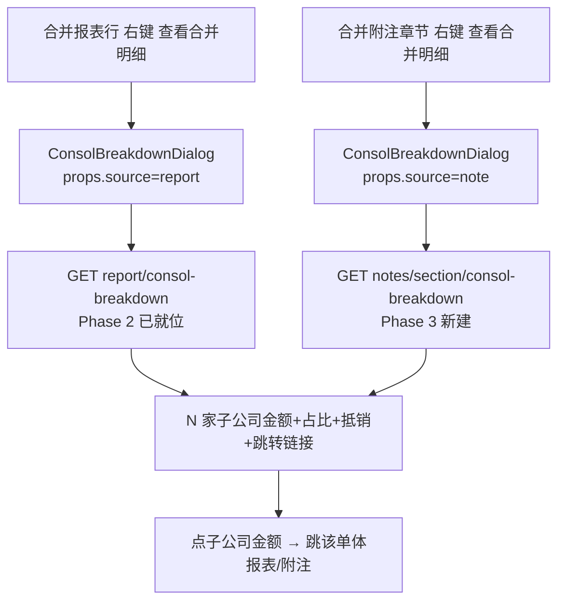
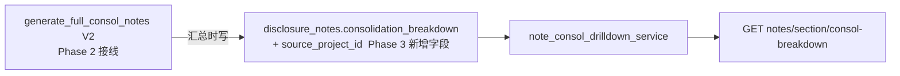
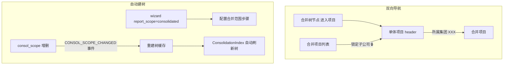

# 设计文档：consol-phase3-frontend-drilldown（合并模块 Phase 3 前端联动 + 附注穿透）

> 关联调研：#[[file:docs/proposals/consolidation-module-status-and-proposal.md]]
> 前置依赖：consol-phase0（B1/breakdown）+ consol-phase1（锁定/banner）+ consol-phase2（报表穿透后端/cascade_refresh/一键刷新）
> 范围：Phase 3「前端联动 + 附注穿透」（~3 人天）
> 目标：**穿透 UI（报表+附注）+ 双向导航 + 自动建树 + 子公司完整度校验** —— 把后端能力暴露为用户可用的联动体验。

---

## 一、概述（Overview）

Phase 0/1/2 在后端建好了核心管线、统一引擎、编排者、报表穿透端点。Phase 3 做"前端联动 + 穿透 UI"，让用户真正用上：

1. **统一穿透组件 ConsolBreakdownDialog.vue**：`ConsolBreakdownDialog.vue` 不存在（grep 0 命中）。新建统一穿透弹窗（props 区分 `source=report|note`），列 N 家子公司金额 + 占比 + 抵销 + 跳转链接。报表穿透复用 Phase 2 已就位的 `report/consol-breakdown` 端点。

2. **附注级穿透后端 + UI（依赖 B1 provenance）**：`disclosure_notes` 缺 `source_project_id` / `consolidation_breakdown` JSONB 字段（grep 0 命中），缺 `note_consol_drilldown_service`，缺 `GET /api/notes/{section}/consol-breakdown`。Phase 3 补附注级穿透后端（V2 附注汇总时写 provenance：该合并章节由哪些子公司哪些章节汇总而来）+ DisclosureEditor/ConsolNoteTab 右键"查看合并明细"。

3. **双向导航**：单体项目 header 显示"所属集团：XXX"链接 → 跳合并项目；合并项目树节点"进入项目"按钮 → 路由到单体项目；合并项目列表中锁定的单体项目显示"🔒"标签。

4. **自动建树 + 合并范围联动**：wizard 完成时若 `report_scope=consolidated` → 弹"配置合并范围"步骤（选已有单体挂为子公司）；consol_scope 增删 → `CONSOL_SCOPE_CHANGED` 事件 → 自动重建树缓存；前端 ConsolidationIndex 监听 scope 变更自动刷新树。

5. **子公司数据完整度前置校验**：一键刷新前检查各子公司 TB 审定数 + 附注生成状态，不满足 warning 提示（不阻断）。

**设计原则**：穿透组件统一复用（report/note 一个组件）；附注 provenance 在 V2 汇总时写（依赖 Phase 2 V2 接线）；自动建树用 EventBus 解耦；完整度校验 warning 不阻断；改动后必 Playwright 实测。

**范围外**（留 Phase 4）：真实集团数据端到端 UAT / 审计师真实章节映射替换 mock CSV / 上年数结转。

---

## 二、架构（Architecture）

### 2.1 统一穿透组件（报表 + 附注）



### 2.2 附注级穿透后端（依赖 V2 写 provenance）



### 2.3 双向导航 + 自动建树



### 2.4 关键铁律对齐

| 铁律 | Phase 3 应用 |
|------|-------------|
| 穿透组件统一复用 | ConsolBreakdownDialog 一个组件服务 report+note（props 区分），不重复造 |
| 附注 provenance 依赖 V2 | 附注穿透依赖 Phase 2 V2 接线写 breakdown，无 V2 则穿透为空（友好提示） |
| EventBus 解耦 | scope 变更经事件触发重建树，不耦合 |
| UI 全中文化 | 所有穿透/导航/banner 文本中文 |
| 改动后必 Playwright 实测 | 穿透弹窗 + 双向跳转 + 自动建树需真点 UI 验证 |
| 溯源跳转支持 Backspace | 穿透跳转纳入 DefaultLayout initGlobalBackspace 返回栈 |

---

## 三、组件与接口（Components and Interfaces）

### 组件 1：ConsolBreakdownDialog.vue（统一穿透弹窗，新建）

```
props: { source: 'report' | 'note', projectId, year, accountCode?, sectionId? }
- source=report → 调 GET report/{account_code}/consol-breakdown（Phase 2）
- source=note   → 调 GET notes/{section_id}/consol-breakdown（Phase 3 新建）
- 渲染：el-table 列 = 子公司名称 / 金额(.gt-amt) / 占比 / 抵销额；底部合并数
- 点子公司行 → emit jump（跳该单体报表/附注，纳入 Backspace 返回栈）
```

### 组件 2：note_consol_drilldown_service + 端点（附注穿透后端）

```python
GET /api/consolidation/notes/{project_id}/{year}/{section_id}/consol-breakdown
  -> {"section_id": ..., "by_company": [{company_code, company_name, section_title, amount}], ...}
```

> 数据来自 `disclosure_notes.consolidation_breakdown`（Phase 3 新增字段，V2 汇总时写）。

### 组件 3：disclosure_notes provenance 字段（迁移 V0XX）

```sql
ALTER TABLE disclosure_notes ADD COLUMN IF NOT EXISTS source_project_id UUID;
ALTER TABLE disclosure_notes ADD COLUMN IF NOT EXISTS consolidation_breakdown JSONB;
```

> ORM `DisclosureNote` 同步加 `Mapped` 字段（三层一致铁律）。V2 `generate_full_consol_notes` 汇总时写入哪些子公司哪些章节贡献。

### 组件 4：右键菜单接入

- `ReportView` / 合并报表视图：行右键菜单加"查看合并明细"→ ConsolBreakdownDialog(source=report)。
- `DisclosureEditor` / `ConsolNoteTab`：章节右键菜单加"查看合并明细"→ ConsolBreakdownDialog(source=note)。

### 组件 5：双向导航

- 单体项目 header：若 `parent_project_id` 非空，显示"所属集团：{母项目名}"链接 → 路由合并项目。
- 合并树节点（ConsolidationIndex）：加"进入项目"按钮 → 路由该单体项目。
- 合并项目列表：锁定子公司显示"🔒 已锁定"标签（复用 Phase 1 锁定态）。

### 组件 6：自动建树 + scope 联动

- wizard：`report_scope=consolidated` 完成时弹"配置合并范围"步骤（选已有单体项目挂子公司）。
- `consol_scope` 增删 → 发 `CONSOL_SCOPE_CHANGED` 事件 → 重建树缓存。
- ConsolidationIndex 监听事件自动刷新树。

### 组件 7：子公司完整度校验

- 一键刷新（Phase 2 refresh-all）前调校验：各子公司 TB `audited_amount` 是否非全 0 + 附注是否已生成。
- 不满足 → warning「子公司 XXX 数据不完整，合并结果可能不准确」（不阻断）。

---

## 四、数据模型（Data Models）

### 4.1 disclosure_notes provenance（迁移 V0XX + ORM）

```sql
ALTER TABLE disclosure_notes ADD COLUMN IF NOT EXISTS source_project_id UUID;
ALTER TABLE disclosure_notes ADD COLUMN IF NOT EXISTS consolidation_breakdown JSONB;
CREATE INDEX IF NOT EXISTS idx_disclosure_notes_consol_breakdown
  ON disclosure_notes USING gin (consolidation_breakdown) WHERE is_deleted = false;
```

**附注 provenance JSON**：
```python
{
  "by_company": [
    {"company_code": "SUB001", "company_name": "子公司A", "section_title": "货币资金", "amount": "1234.56"}
  ],
  "computed_at": "..."
}
```

### 4.2 EventType 扩展

`CONSOL_SCOPE_CHANGED`（scope 增删触发重建树）。

**校验规则**：
- 附注穿透 `Σ by_company[*].amount`（同口径科目）与该合并章节汇总值一致（provenance 自洽，类比 Phase 0 P2）。
- ConsolBreakdownDialog 对 report/note 两 source 渲染契约一致（统一组件）。
- disclosure_notes 新字段三层一致（迁移 + ORM Mapped + 写入逻辑）。

---

## 五、低层设计（Low-Level Design）

### 5.1 ConsolBreakdownDialog 统一渲染

```typescript
// props.source 决定调哪个端点，渲染契约统一
const endpoint = computed(() =>
  props.source === 'report'
    ? `/api/consolidation/report/${pid}/${year}/${props.accountCode}/consol-breakdown`
    : `/api/consolidation/notes/${pid}/${year}/${props.sectionId}/consol-breakdown`)

// el-table: 子公司名称 / 金额(GtAmountCell) / 占比 / 抵销额 + 底部合并数
// 行点击 emit('jump', { projectId: row.source_project_id }) → 纳入 Backspace 返回栈
```

### 5.2 附注 provenance 写入（V2 汇总时）

```python
# generate_full_consol_notes V2 汇总每章节时同步写 provenance
section.consolidation_breakdown = {
    "by_company": [
        {"company_code": c.code, "company_name": c.name,
         "section_title": child_section.title, "amount": str(child_amount)}
        for c, child_section, child_amount in contributors
    ],
    "computed_at": now_iso(),
}
```

**后置条件**：每个 V2 合并章节落库时带 provenance；穿透端点直接读，无需重算。

### 5.3 自动建树 EventBus

```python
# consol_scope 增删后
await event_bus.publish("CONSOL_SCOPE_CHANGED", {"parent_project_id": str(pid)})

# handler → 失效/重建树缓存
async def on_consol_scope_changed(payload):
    await invalidate_tree_cache(payload["parent_project_id"])
```

```typescript
// 前端 ConsolidationIndex 监听 SSE CONSOL_SCOPE_CHANGED → 重新拉 /tree
```

### 5.4 完整度校验（不阻断）

```python
async def check_subsidiary_completeness(db, parent_project_id, year):
    tree = await build_tree(db, parent_project_id)
    warnings = []
    for leaf in iter_leaves(tree):
        if not await _has_audited_tb(db, leaf.project_id, year):
            warnings.append(f"子公司 {leaf.company_name} 无审定试算数据")
        if not await _has_notes(db, leaf.project_id, year):
            warnings.append(f"子公司 {leaf.company_name} 未生成附注")
    return warnings   # 前端 warning 提示，不阻断刷新
```

---

## 六、正确性属性与测试策略（hypothesis + 前端 vitest/Playwright）

| # | 属性名 | 不变式 | 守护 | 框架 |
|---|--------|--------|------|------|
| T1 | 穿透组件契约统一 | ConsolBreakdownDialog 对 report/note 两 source 渲染同结构（列/合并数/跳转） | 统一组件 | vitest |
| T2 | 附注 provenance 自洽 | Σ by_company[*].amount（同口径）== 该合并章节汇总值 | 附注穿透 | hypothesis |
| T3 | 跳转返回栈完整 | 穿透跳转后 Backspace 返回到来源页（纳入 initGlobalBackspace） | 双向导航 | Playwright |
| T4 | scope 变更触发重建树 | consol_scope 增删 → CONSOL_SCOPE_CHANGED → 树缓存失效 + 前端刷新 | 自动建树 | 集成测试 |
| T5 | 完整度校验不阻断 | 子公司数据不全 → warnings 非空但刷新仍执行（warning 非 error） | 完整度校验 | hypothesis |
| T6 | 附注新字段三层一致 | disclosure_notes.consolidation_breakdown 迁移+ORM+写入齐全，drift 0 | 三层一致 | 集成测试 |

**测试三层边界**：
- 前端 vitest：T1 组件渲染契约；穿透弹窗 mount + props 切换。
- 纯函数/集成：T2 provenance 聚合；T4 事件触发；T5 校验逻辑；T6 drift。
- Playwright：T3 穿透跳转+Backspace；右键菜单；双向导航；自动建树弹窗。
- 真实 UAT：附注穿透真实子公司数据正确性卡 Phase 4，标"待数据"不伪绿。

---

## 七、错误处理（Error Handling）

| # | 场景 | 响应 |
|---|------|------|
| EH1 | 穿透章节无 breakdown（未跑 V2/B1） | 返回空 by_company + 弹窗提示"该章节暂无合并明细，请先用 V2 生成合并附注" |
| EH2 | 跳转目标单体项目无权访问 | 跳转前校验权限（Phase 0 P5），无权 ElMessage 提示不跳 |
| EH3 | V2 未启用时点附注穿透 | 提示"附注穿透需开启 V2 合并附注（CONSOL_NOTES_V2_ENABLED）" |
| EH4 | scope 变更事件丢失 | 前端提供手动"刷新树"按钮兜底（不强依赖事件必达） |
| EH5 | 完整度校验子公司过多耗时 | 校验异步 + 超时降级（返回部分结果 + 提示"校验未完成"），不阻断刷新 |

---

## 八、风险与缓解

| # | 风险 | 等级 | 缓解 |
|---|------|------|------|
| R1 | 附注穿透依赖 V2 接线（Phase 2）+ B1 provenance | 🟠 | 无 V2/无 breakdown 时友好提示（EH1/EH3）；Phase 3 附注穿透真实可用以 V2 启用为前提 |
| R2 | ConsolBreakdownDialog 双 source 渲染分叉 | 🟠 | 统一渲染契约 + T1 vitest 守门；source 仅决定端点不决定渲染结构 |
| R3 | 自动建树 wizard 改动影响既有项目创建流程 | 🟠 | 仅 report_scope=consolidated 触发新步骤；非合并项目流程不变；回归测试 wizard |
| R4 | 双向导航跳转破坏 Backspace 返回栈 | 🟡 | 穿透跳转纳入 initGlobalBackspace（T3 Playwright 守门） |
| R5 | 前端穿透 UI 多视图接入遗漏 | 🟡 | grep 合并报表/附注视图逐一接右键菜单；Playwright 覆盖关键路径 |
| R6 | 真实 UAT 卡数据 | 🔴 | Phase 3 用合成数据验证 UI/链路；真实正确性显式标 Phase 4"待数据"不伪绿 |

---

## 九、架构决策记录（ADR）

### ADR-CONSOL-301：统一穿透组件 ConsolBreakdownDialog（report+note 一个组件）

**状态**：已接受　**日期**：2026-05-30

**背景**：报表级穿透（Phase 2 后端就位）+ 附注级穿透（Phase 3 新建）都需要"列 N 家子公司金额+占比+抵销+跳转"的弹窗。分别造两个组件 = 重复 + 渲染分叉。

**决策**：新建一个 `ConsolBreakdownDialog.vue`，`props.source=report|note` 仅决定调哪个端点，渲染契约统一。报表复用 Phase 2 端点，附注用 Phase 3 新端点。

**结果**：正向=一个组件服务两场景，渲染一致；代价=props 分支（靠 T1 vitest 守门渲染契约不分叉）。

### ADR-CONSOL-302：附注 provenance 在 V2 汇总时写入（依赖 Phase 2 V2）

**状态**：已接受　**日期**：2026-05-30

**背景**：附注穿透要反查"该合并章节由哪些子公司哪些章节汇总"，必须在 V2 `generate_full_consol_notes` 汇总时同步写 `disclosure_notes.consolidation_breakdown`（事后无法重建）。

**决策**：disclosure_notes 加 `source_project_id`/`consolidation_breakdown`（三层一致）；V2 汇总每章节时写 provenance；附注穿透端点直接读。无 V2 则穿透为空（友好提示，EH1/EH3）。

**结果**：正向=附注穿透有数据基础 + 与报表穿透对称；代价=附注穿透真实可用以 V2 启用为前提（R1）。

### ADR-CONSOL-303：自动建树用 EventBus 解耦 + 手动刷新兜底

**状态**：已接受　**日期**：2026-05-30

**背景**：consol_scope 增删后树应自动更新，但强耦合"增删即同步重建"会拖慢 scope 操作。

**决策**：scope 增删发 `CONSOL_SCOPE_CHANGED` 事件 → 异步失效/重建树缓存；前端监听事件刷新；提供手动"刷新树"按钮兜底（事件丢失不致树永久过期，EH4）。

**结果**：正向=解耦 + scope 操作不被重建拖慢；代价=最终一致（事件异步）+ 需手动兜底按钮。

### ADR-CONSOL-304：合并页 stale 用 SSE 实时感知（复用既有基础设施，不轮询）

**状态**：已接受　**日期**：2026-05-30

**背景**：后端 `consol_note_stale_handler` 已订阅 NOTE_UPDATED 标记母项目 stale，但前端合并页**无 SSE/轮询感知**（F5）→ 用户看到的可能是过时合并数，不知子公司已改。

**决策**：stale 标记时发 SSE 事件 → 合并页提示「子公司数据已更新，建议重新汇总」+ "立即重新汇总"快捷入口（跳一键刷新）；warning 级不阻断；复用既有 SSE 基础设施（不新增轮询，呼应 A5/Phase 2 R5 打爆 pool 教训）。

**结果**：正向=合并数过时可感知 + 闭环到一键刷新；代价=依赖 SSE 必达性（断开时下次进页面读最新 stale 态兜底）。

---

## 十、设计完成检查清单

- [x] §一~§五（概述/架构/组件接口/数据模型/低层设计）
- [x] §六 正确性属性 T1~T6 + 三层测试边界
- [x] §七 错误处理 EH1~EH5
- [x] §八 风险 R1~R6
- [x] §九 ADR-CONSOL-301/302/303
- [x] 依赖 Phase 0（B1/breakdown）+ Phase 1（锁定/banner）+ Phase 2（报表穿透/V2/refresh-all）
- [ ] 待下一步：requirements.md → tasks.md
