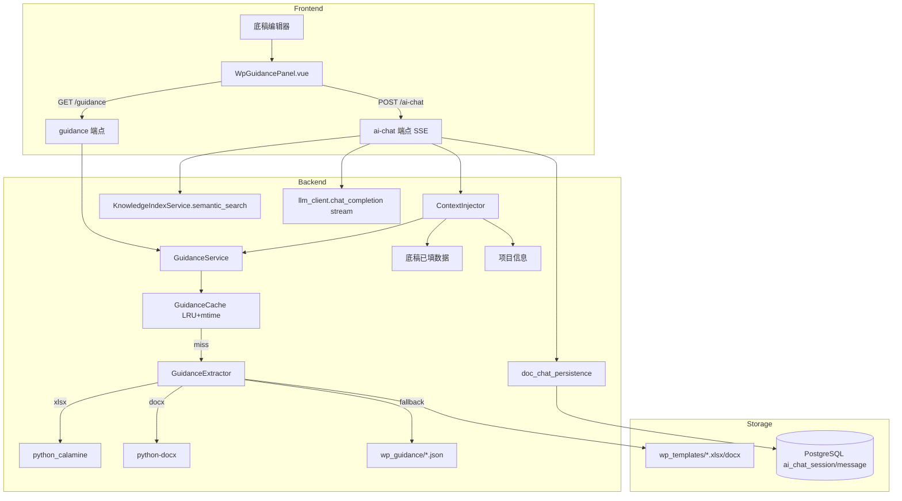

# 底稿编制指导助手 — 技术设计

## 概述

本设计扩展现有 `wp_guidance_service` 为完整的编制指导管线：从模板文件动态提取「编制说明」sheet 内容，结合 LRU + mtime 缓存策略，通过 REST API 提供给前端浮动面板；同时复用 `doc_ai_chat` 管线实现底稿级 AI 对话（SSE streaming + DB 持久化），注入底稿上下文（wp_code/已填数据/编制说明/项目信息）为 LLM system prompt。

设计遵循"静态优先、LLM 可选"原则：P0 阶段仅涉及模板提取 + 面板骨架（零 LLM 依赖），P1/P2 叠加对话与 RAG。

---

## 架构

### 整体数据流



### 分层职责

| 层 | 组件 | 职责 |
|---|---|---|
| 前端 | `WpGuidancePanel.vue` | 面板 UI、Tab 切换、SSE 消费、sessionStorage 缓存 |
| 路由 | `wp_guidance_chat.py` | 2 端点（GET guidance / POST ai-chat）、JWT 认证 |
| 服务 | `GuidanceService` (扩展 wp_guidance_service) | 编排提取→缓存→降级链 |
| 服务 | `GuidanceExtractor` | 模板文件解析（xlsx sheet / header / docx 首段） |
| 服务 | `GuidanceCache` | LRU(128) + mtime 失效 |
| 服务 | `ContextInjector` | 构建 system prompt（合并多 system → 单条） |
| 基础设施 | `doc_chat_persistence` | 会话/消息 DB 持久化（复用） |
| 基础设施 | `llm_client` | vLLM streaming + 熔断器（复用） |
| 基础设施 | `KnowledgeIndexService` | semantic_search（复用，scope=knowledge_doc） |

---

## 组件与接口

### 1. REST API

#### GET /api/workpapers/{wp_id}/guidance

获取底稿编制说明（静态）。

**Request:**
```
GET /api/workpapers/{wp_id}/guidance
Authorization: Bearer {token}
```

**Response 200:**
```json
{
  "wp_code": "D2-1",
  "wp_name": "主营业务收入审定表",
  "source": "template_sheet",
  "complexity": "high",
  "ai_enabled": true,
  "guidance": {
    "sections": [
      {
        "title": "一、编制目的",
        "items": ["确认收入金额的真实性和完整性", "..."]
      },
      {
        "title": "二、编制步骤",
        "items": ["1. 获取明细账...", "2. 核对报表金额..."]
      }
    ],
    "raw_text": "完整纯文本（用于 LLM 上下文注入）"
  },
  "recommended_questions": [
    "审定表的金额从哪里取数？",
    "审计调整和重分类调整的区别？",
    "如何验证审定金额正确？"
  ]
}
```

**Response 404:** 底稿不存在

**source 枚举值:**
- `template_sheet` — 从模板「编制说明」sheet 提取
- `template_header` — 从模板首行/首列提取
- `static_json` — 从 `data/wp_guidance/{wp_code}.json` 读取
- `fallback` — 通用提示

---

#### POST /api/workpapers/{wp_id}/ai-chat

底稿级 AI 对话（SSE streaming）。

**Request:**
```json
{
  "query": "这个底稿的金额从哪里取数？",
  "project_id": "uuid",
  "year": 2025,
  "wp_code": "D2-1",
  "wp_name": "主营业务收入审定表"
}
```

**Response:** SSE stream
```
data: {"type": "citations", "data": [{"source_type": "knowledge_doc", "source_name": "CAS14 收入", "content": "..."}]}

data: {"type": "content", "data": "审定表的金额主要从"}

data: {"type": "content", "data": "序时账和明细账中"}

data: {"type": "done", "data": {"token_estimate": 1250}}
```

**Error responses:**
- 404: wp_id 无效
- 503: LLM 服务不可用（熔断器 open）

---

### 2. GuidanceExtractor

```python
class GuidanceExtractor:
    """从模板文件提取编制说明文本"""

    SHEET_NAMES = ("编制说明", "说明", "Instructions")

    def extract(self, template_path: Path, wp_code: str) -> GuidanceResult:
        """主提取入口，按优先级尝试：
        1. xlsx/docx 模板中的专属 sheet/段落
        2. 模板首行/首列说明
        3. 静态 JSON 配置
        4. 通用 fallback
        
        特殊处理：
        - c-note-table 类型底稿（附注）跳过模板提取，从 disclosure_notes.guidance_text 读取
          （避免与 per_table_guidance 机制重复）
        """
        ...

    def _extract_xlsx_sheet(self, path: Path) -> tuple[str, list[dict]] | None:
        """python_calamine 读取「编制说明」sheet，返回 (raw_text, sections)"""
        ...

    def _extract_xlsx_header(self, path: Path) -> str | None:
        """读取首 sheet 前 5 行合并单元格中的说明文本"""
        ...

    def _extract_docx_instructions(self, path: Path) -> str | None:
        """python-docx 提取第一个表格之前的段落文本"""
        ...
```

**提取算法（xlsx）：**
1. 用 `python_calamine` 打开文件，获取 sheet 列表
2. 匹配 sheet 名称（"编制说明" / "说明" / "Instructions"，大小写不敏感）
3. 若匹配成功：遍历所有行，跳过空行，按行号保持顺序，识别数字/中文序号开头的行作为步骤分隔符
4. 若无匹配：读首 sheet 前 5 行，提取非空且长度 > 20 的文本作为 header 说明
5. 超时保护：单文件解析限 5 秒（`signal.alarm` 或 `asyncio.wait_for`）

**提取算法（docx）：**
1. 用 `python-docx` 打开文件
2. 遍历 `document.paragraphs`，收集第一个 `table` 元素之前的段落
3. 过滤空段落，合并为说明文本

---

### 3. GuidanceCache

```python
class GuidanceCache:
    """LRU 缓存 + mtime 失效"""

    def __init__(self, maxsize: int = 128):
        self._cache: OrderedDict[str, CacheEntry] = OrderedDict()
        self._maxsize = maxsize

    def get(self, wp_code: str, template_path: Path) -> GuidanceResult | None:
        """命中且 mtime 未变 → 返回缓存；mtime 变化 → 失效返回 None"""
        ...

    def put(self, wp_code: str, template_path: Path, result: GuidanceResult) -> None:
        """写入缓存，LRU 淘汰"""
        ...
```

**CacheEntry:**
```python
@dataclass
class CacheEntry:
    result: GuidanceResult
    mtime: float  # os.path.getmtime() at cache time
    wp_code: str
```

---

### 4. ContextInjector

```python
class ContextInjector:
    """构建底稿级 LLM system prompt"""

    SYSTEM_TEMPLATE = """你是审计底稿编制指导助手。当前底稿信息：
- 底稿编号：{wp_code}
- 底稿名称：{wp_name}
- 类型：{component_type}
- 项目：{client_name}（{audit_period}）
- 业务分类：{business_category}

编制说明：
{guidance_text}

已填写情况摘要：
{filled_data_summary}

请基于以上上下文回答用户关于底稿编制的问题。回答要具体、可操作，引用相关准则时标明出处。"""

    MAX_SUMMARY_TOKENS = 2000
    MAX_SYSTEM_PROMPT_TOKENS = 4000   # 总量上限
    MAX_GUIDANCE_TEXT_TOKENS = 1500   # guidance_text 截断上限
    MAX_RAG_HIT_TOKENS = 500         # 每条 RAG hit 截断上限

    async def build_system_prompt(self, wp_context: WpChatContext) -> str:
        """构建 system prompt（保证单条输出）"""
        ...

    def _build_filled_data_summary(self, wp_context: WpChatContext) -> str:
        """按底稿类型生成已填数据摘要：
        - 审定表(*-1): 科目名+审定金额前 10 行
        - 程序表(*-A): 已完成步骤数/总步骤数
        - 其他: 非空字段数/总字段数
        """
        ...

    def _truncate_to_tokens(self, text: str, max_tokens: int) -> str:
        """按完整行截断，不在单元格值中间断"""
        ...

    def merge_system_messages(self, messages: list[dict]) -> list[dict]:
        """合并多条 system 消息为一条（vLLM 约束）"""
        ...
```

---

### 5. 前端组件层次

```
WorkpaperEditorLayout (各 componentType 的外层)
├── [主编辑区 flex:1]
│   ├── GtAProgramConsole / GtDFormTable / GtAuditSheet / ...
│   └── (宽度随面板展开自适应收缩)
└── WpGuidancePanel (position: fixed right, 360-420px)
    ├── PanelHeader (折叠按钮 + 标题)
    ├── TabContainer
    │   ├── Tab「编制说明」
    │   │   ├── SourceBadge (来源标签)
    │   │   ├── TableOfContents (目录锚点，内容超一屏时显示)
    │   │   └── GuidanceContent (结构化渲染 + wp_code 链接化)
    │   └── Tab「AI 对话」(WP_AI_SERVICE_ENABLED 控制可见性)
    │       ├── MessageList (历史消息 + streaming)
    │       ├── CitationList (引用来源)
    │       ├── RecommendedQuestions (快捷按钮)
    │       └── ChatInput (输入框 + 发送)
    └── PanelTrigger (折叠态: 固定右侧图标按钮)
```

**状态管理：** Pinia store `useGuidancePanelStore`
```typescript
interface GuidancePanelState {
  isOpen: boolean              // 面板展开/折叠
  activeTab: 'guidance' | 'chat'
  wpContext: {                 // 当前底稿上下文
    wpId: string
    wpCode: string
    wpName: string
    componentType: string
    projectId: string
    year: number
  } | null
  guidanceData: GuidanceResponse | null
  guidanceLoading: boolean
  chatMessages: ChatMessage[]
  chatStreaming: boolean
  aiEnabled: boolean           // WP_AI_SERVICE_ENABLED
  requestId: number            // 竞态防护：每次底稿切换递增
  abortController: AbortController | null  // 取消上一个未完成请求
}
```

**竞态防护机制：**
```typescript
// 底稿切换时：
function onWpContextChange(newContext) {
  store.requestId++
  store.abortController?.abort()  // 取消上一个请求
  store.guidanceData = null       // 清空旧内容
  store.guidanceLoading = true    // 显示 loading
  const currentRequestId = store.requestId
  const controller = new AbortController()
  store.abortController = controller
  
  fetchGuidance(newContext, controller.signal).then(data => {
    if (store.requestId === currentRequestId) {  // 比对 requestId
      store.guidanceData = data
    }
  })
}
```

**前端集成点调研（⚠️ 实施前必确认）：**
- 面板注入点不在各 renderer 组件内部，而是在 renderer 的共同外层
- 候选位置：`views/workpaper/WorkpaperEditorView.vue`（如存在）或 `GtWpRenderer.vue` 或路由 layout
- Task 4.4 必须先调研实际路由结构（`codegraph_explore "workpaper editor route"`），确认注入位置后再写代码
- 原则：面板与 renderer 同级并列（flex 布局），而非嵌套在 renderer 内部

---

## 数据模型

### GuidanceResult（后端）

```python
@dataclass
class GuidanceResult:
    wp_code: str
    source: Literal["template_sheet", "template_header", "static_json", "fallback"]
    sections: list[GuidanceSection]  # 结构化章节
    raw_text: str                    # 纯文本（供 LLM 注入）
    complexity: Literal["high", "medium", "low"]

@dataclass
class GuidanceSection:
    title: str
    items: list[str]
```

### WpChatContext（后端）

```python
@dataclass
class WpChatContext:
    wp_id: UUID
    wp_code: str
    wp_name: str
    component_type: str
    project_id: UUID
    year: int
    client_name: str
    audit_period: str
    business_category: str
    guidance_text: str           # 从 GuidanceResult.raw_text
    filled_data: dict | None    # 已填写数据（按 componentType 提取摘要）
```

### DB 持久化（复用现有表）

| 表 | 用途 | 定位键 |
|---|---|---|
| `ai_chat_session` | 对话会话 | `context_summary = "workpaper:{wp_id}:{user_id}"` |
| `ai_chat_message` | 消息记录 | `session_id` FK |

无新增表/列，复用 `doc_chat_persistence` 模块，`doc_type = "workpaper"`。

**对话历史裁剪策略**：
- 上限 20 轮（40 条消息：20 user + 20 assistant）
- 超过时采用"最近窗口"策略：保留最近 20 轮，丢弃最旧消息
- MVP 阶段不做摘要压缩（简单裁剪足够，32K context window 下 20 轮 ≈ 8K tokens 远低于上限）
- 裁剪由 `doc_chat_persistence.append_message` 触发（写入新消息时检查总数，超限删最旧）

### 复杂度分类（后端配置）

```python
# backend/data/wp_guidance/_complexity.json
{
  "high": ["A17", "B60", "B50", "B51", "*-1", "*A"],
  "medium": ["A1-15", "A1-16", "A1-13", "A1-14", "A5", "S*"],
  "low": []  // 默认
}
```

匹配规则：`*` 通配符，`*-1` 匹配 `D2-1`/`E1-1` 等审定表，`*A` 匹配 `D0A`/`E1A` 等程序表。

### 推荐问题映射

```python
RECOMMENDED_QUESTIONS = {
    "program": [  # *A 程序表
        "这个程序表有哪些关键步骤？",
        "如何判断各步骤的适用性？",
        "这个循环的主要风险是什么？",
    ],
    "determination": [  # *-1 审定表
        "审定表的金额从哪里取数？",
        "审计调整和重分类调整的区别？",
        "如何验证审定金额正确？",
    ],
    "default": [  # 通用
        "这个底稿的编制目的是什么？",
        "填写完成后需要关注什么？",
    ],
}

# 两级覆盖机制：wp_guidance/{wp_code}.json 中的 recommended_questions 字段优先
# 高优先级底稿手写专属问题示例：
# wp_guidance/A17.json: {"recommended_questions": ["A17 章节1~16各写什么？", "KAM 怎么填？", "如何引用各循环结论？"]}
# wp_guidance/B60.json: {"recommended_questions": ["总体审计策略包含哪些要素？", "如何确定重要性水平？", "时间预算怎么安排？"]}
```

---

## 错误处理

| 场景 | 处理策略 | 用户可见效果 |
|---|---|---|
| 模板文件不存在/不可读 | 降级到 static_json → fallback | 面板显示通用提示 + 来源标签 "fallback" |
| 模板解析超时(>5s) | `asyncio.wait_for` 超时 → 降级 | 同上 |
| python_calamine 解析异常 | 捕获 → 降级到 header → json → fallback | 同上 |
| LLM 熔断器 open | 返回 `{"type": "error", "data": "AI 服务暂不可用"}` | 前端禁用输入框 + 提示 |
| LLM streaming 中断 | 已收集部分作为 partial response 存 DB | 用户看到部分回答 + 错误提示 |
| RAG 向量检索 404 | 降级 BM25 → ilike（复用现有链路） | 引用来源可能为空，不影响对话 |
| WP_AI_SERVICE_ENABLED=False | 不渲染 AI Tab、不调 ai-chat 端点 | 仅静态编制说明可用 |
| 前端 guidance API >3s | skeleton 占位 + 后台继续加载 | 用户看到加载骨架屏 |
| 前端面板组件异常 | Vue errorBoundary 隔离 | 底稿主体编辑不受影响 |

---

## 正确性属性

*A property is a characteristic or behavior that should hold true across all valid executions of a system—essentially, a formal statement about what the system should do. Properties serve as the bridge between human-readable specifications and machine-verifiable correctness guarantees.*


### Property 1: 模板提取保持结构化

*For any* xlsx 模板文件包含名为「编制说明」的 sheet 且含有序号化内容（如"1. ..."/"一、..."），GuidanceExtractor 提取后的 `sections` 列表应保持原始行顺序，且每个 section 的 items 非空。

**Validates: Requirements 2.1, 2.5**

### Property 2: Guidance 端点永不返回空

*For any* 有效的 wp_id，`GET /api/workpapers/{wp_id}/guidance` 响应的 `guidance.raw_text` 永不为空字符串，`source` 字段必为 `template_sheet | template_header | static_json | fallback` 之一。

**Validates: Requirements 2.4, 2.8**

### Property 3: 缓存一致性（mtime 失效）

*For any* wp_code 已缓存的情况下，若对应模板文件的 mtime 发生变化，下一次 `GuidanceCache.get()` 必须返回 `None`（缓存未命中），触发重新提取；且缓存条目总数不超过 `maxsize`（128）。

**Validates: Requirements 2.6, 8.1, 8.2, 8.3**

### Property 4: SSE 流式协议合规

*For any* 成功的 AI 对话请求，SSE 响应事件序列必须以 `done` 事件结尾，且所有 `content` 事件的 `data` 拼接结果等于 DB 中持久化的 assistant 消息文本。

**Validates: Requirements 4.3, 9.3**

### Property 5: 对话历史持久化往返

*For any* 用户发送 N 条消息（N ≤ 20），`get_history` 返回的消息数量等于 2N（N 条 user + N 条 assistant），且消息内容与发送/接收时一致；调用 `clear_history` 后 `get_history` 返回空列表。

**Validates: Requirements 4.6, 4.7, 9.6**

### Property 6: 推荐问题匹配 wp_code 模式

*For any* wp_code，返回的 `recommended_questions` 应匹配对应模式：以 `A` 结尾的程序表返回程序表问题集，以 `-1` 结尾的审定表返回审定表问题集，其余返回通用问题集。

**Validates: Requirements 4.8**

### Property 7: 上下文注入完整性

*For any* WpChatContext 输入，`ContextInjector.build_system_prompt` 输出的字符串必须包含 wp_code、wp_name、client_name、audit_period 的实际值，且 guidance_text 非空时必须出现在输出中。

**Validates: Requirements 5.1**

### Property 8: 已填数据摘要截断不超限

*For any* 已填写数据（无论大小），`ContextInjector._build_filled_data_summary` 输出的 token 数 ≤ 2000，且截断发生在完整行末尾（不在字段值中间截断）。

**Validates: Requirements 5.2**

### Property 9: 上下文按底稿类型适配

*For any* 审定表类底稿（wp_code 匹配 `*-1`），已填数据摘要包含「科目」和「金额」关键词；*For any* 程序表类底稿（wp_code 匹配 `*A`），已填数据摘要包含「已完成」和「步骤」关键词。

**Validates: Requirements 5.3, 5.4**

### Property 10: 单条 system 消息输出

*For any* 由 `ContextInjector.merge_system_messages` 处理后的消息列表，其中 `role == "system"` 的消息最多一条。

**Validates: Requirements 5.5**

### Property 11: 复杂度分类确定性

*For any* wp_code，`classify_complexity(wp_code)` 的返回值在相同配置下是确定性的（多次调用结果一致），且返回值为 `high | medium | low` 之一。已知高复杂度码（A17/B60/B50/B51/*-1/*A）必须返回 `high`。

**Validates: Requirements 7.1**

### Property 12: 内容深度随复杂度缩放

*For any* 高复杂度底稿的 guidance 响应，`sections` 列表长度 ≥ 1 且 `recommended_questions` 非空；*For any* 低复杂度底稿的 guidance 响应，`sections` 列表可以为空（仅 raw_text 含简短提示）。

**Validates: Requirements 7.2, 7.3, 7.4**

### Property 13: 请求体缺必填字段返回 422

*For any* POST /ai-chat 请求体缺少 query / project_id / wp_code 中任一字段，端点应返回 HTTP 422。

**Validates: Requirements 9.2**

### Property 14: 无效 wp_id 返回 404

*For any* 不存在于数据库中的 wp_id（UUID 格式有效但无对应记录），GET /guidance 和 POST /ai-chat 均应返回 HTTP 404。

**Validates: Requirements 9.5**

### Property 15: AI Tab 随功能开关隐藏

*For any* 前端组件状态下，当 `WP_AI_SERVICE_ENABLED = false` 时，面板仅渲染「编制说明」Tab，不渲染「AI 对话」Tab，且不发起任何 `/ai-chat` 请求。

**Validates: Requirements 1.7**

### Property 16: 知识库检索结果上限

*For any* RAG 检索调用，返回的 knowledge_hits 数量 ≤ 5，且所有结果的 scope 为 `knowledge_doc`。

**Validates: Requirements 6.2, 6.6**

---

## 测试策略

### 双轨测试方案

本功能采用 **单元测试 + 属性测试（Property-Based Testing）** 互补覆盖：

- **单元测试**：验证具体场景（特定模板文件解析、特定 API 请求响应、UI 交互示例）
- **属性测试**：验证跨所有输入的通用规律（缓存一致性、截断不超限、SSE 协议合规等）

### 属性测试配置

- **库**: `hypothesis`（Python 后端，已安装）
- **最小迭代**: 每个属性测试 5 次（`@settings(max_examples=5)`，用户偏好速度优先）
- **标注格式**: 每个测试函数注释引用设计属性

```python
# Feature: workpaper-editing-guidance, Property 3: 缓存一致性（mtime 失效）
@given(wp_code=st.text(min_size=2, max_size=10), mtime=st.floats(min_value=1.0))
@settings(max_examples=5)
def test_cache_invalidates_on_mtime_change(wp_code, mtime):
    ...
```

### 测试矩阵

| 属性 | 测试类型 | 文件 |
|------|----------|------|
| P1 模板提取 | property | `test_guidance_extractor_pbt.py` |
| P2 永不为空 | property | `test_guidance_service_pbt.py` |
| P3 缓存一致 | property | `test_guidance_cache_pbt.py` |
| P4 SSE 协议 | property + integration | `test_wp_ai_chat_pbt.py` |
| P5 历史往返 | property | `test_wp_chat_persistence_pbt.py` |
| P6 推荐问题 | property | `test_recommended_questions_pbt.py` |
| P7 上下文完整 | property | `test_context_injector_pbt.py` |
| P8 截断不超限 | property | `test_context_injector_pbt.py` |
| P9 类型适配 | property | `test_context_injector_pbt.py` |
| P10 单 system | property | `test_context_injector_pbt.py` |
| P11 复杂度确定 | property | `test_complexity_classification_pbt.py` |
| P12 深度缩放 | property | `test_guidance_service_pbt.py` |
| P13 422 验证 | property | `test_wp_ai_chat_pbt.py` |
| P14 404 处理 | unit | `test_wp_guidance_router.py` |
| P15 AI Tab 隐藏 | vitest | `WpGuidancePanel.spec.ts` |
| P16 RAG 上限 | property | `test_wp_ai_chat_pbt.py` |

### 单元测试覆盖（示例/边界）

- 具体 xlsx 文件解析（A17/B60/D2-1 模板）
- docx 文件解析（A16/A18 模板）
- 无「编制说明」sheet 的降级路径
- 空模板文件处理
- 超大模板解析超时
- LLM 熔断器触发时的 503 响应
- 前端面板 E2E（Playwright: 打开/折叠/发消息/流式接收）

### 前端测试

- **Vitest**: 组件渲染测试（Tab 切换、功能开关隐藏、skeleton 显示）
- **Playwright E2E**: 完整流程（打开面板→查看编制说明→发起对话→收到流式回答→查看引用）
