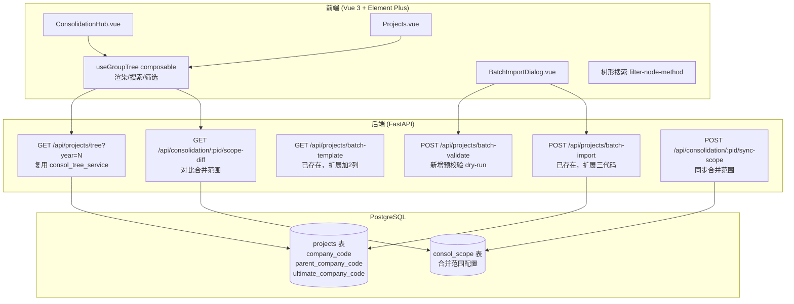

# Design Document: Group Tree Architecture

## Overview

本设计实现基于 `projects` 表已有三字段（`company_code` / `parent_company_code` / `ultimate_company_code`）的集团架构树形动态构建。核心原则：**树形纯运行时构建，不缓存死结构**。每次页面加载前端调用 `GET /api/projects/tree` 接收**后端已构建好的树形 JSON**，前端 composable 只负责渲染、搜索、筛选（不重复 build 树）。

系统提供三大能力：
1. ConsolidationHub 按集团分组树形展示（替换现有卡片式）
2. 项目列表页"树形"视图模式（与现有"列表"/"按客户"并列）
3. 批量建项 Excel 模板导入（预校验+正式导入两步）

附加：与 `consol_scope` 表（合并范围）的差异校对提示。

## Architecture



**关键决策：**
- 后端树形构建**复用已有 `consol_tree_service.py`**，扩展 `build_tree_by_codes` 方法（按三代码而非 parent_project_id 构建），暴露为 `GET /api/projects/tree?year=2025` 端点
- 前端 composable 只做渲染、搜索、筛选（不重复 build 树），从后端接收构建好的树形 JSON
- 批量导入的预校验树形预览由**后端 `validate_batch` 纯函数**构建（用 `build_group_trees_from_projects` 对解析出的 Excel 行构造 SimpleNamespace 对象后构建，不查 DB），结果作为 `tree_preview` 返回前端展示
- 合并范围校对查 `consol_scope` 表（非 `companies` 表），按需查询不阻塞树形渲染
- **不动 ConsolidationIndex 已有的集团架构 Tab**（那是项目内部架构，本 spec 改的是全局 ConsolidationHub）
- **批量建项复用现有 `batch_project_service.py` + `batch_project.py` router**（已有 batch-template/batch-import/batch-export 端点 + 前端 `BatchImportDialog.vue` 已接入）：扩展模板加 parent/ultimate 两列、parse_and_import 支持三代码、新增 validate_batch 预校验。端点路径沿用 `/api/projects/batch-*`，不另造

## Components and Interfaces

### 前端组件

#### `useGroupTree` composable

前端渲染/搜索/筛选逻辑，从后端 `GET /api/projects/tree` 接收已构建好的树形 JSON。被 ConsolidationHub 和 Projects 共用。

```typescript
interface TreeNode {
  id: string               // project.id
  label: string            // client_name || name
  companyCode: string      // company_code
  companyName: string      // client_name
  parentCompanyCode: string | null
  ultimateCompanyCode: string | null
  status: string
  reportScope: string | null
  children: TreeNode[]
  // 容错标记
  isDetached: boolean      // parent 指向不存在的企业
  isIndependent: boolean   // ultimate 为空
  isCycleBreak: boolean    // 循环引用被打断
  hasNoCompanyCode: boolean // company_code 为空
}

interface GroupTree {
  ultimateCode: string
  ultimateName: string
  rootProjectId: string | null  // consolidated 项目的 ID
  children: TreeNode[]
  hasScopeDiff: boolean         // 与合并范围有差异
}

// composable 导出
function useGroupTree(projects: Ref<Project[]>, year?: Ref<number | null>) {
  // 按年度过滤
  const filteredProjects: ComputedRef<Project[]>
  // 按 ultimate 分组构建森林
  const groupTrees: ComputedRef<GroupTree[]>
  // 独立节点（ultimate 为空 或 company_code 为空）
  const independentNodes: ComputedRef<TreeNode[]>
  // 搜索
  function filterTree(query: string): void
  // 树形构建核心算法
  function buildTree(projects: Project[]): { trees: GroupTree[], independents: TreeNode[] }
}
```

#### ConsolidationHub.vue 改造

- 保留顶部横幅和统计概览区域
- 替换卡片网格为 `el-tree` 树形展示
- 每棵集团树一个 `el-tree` 实例
- 根节点显示最终控制方名称 + 差异警示标签
- 节点点击导航到 `/projects/:id/consolidation`

#### Projects.vue 扩展

- `viewMode` radio-group 增加 `'tree'` 选项
- 树形视图使用 `el-tree` + `filter-node-method`
- 视图模式持久化到 `localStorage`（key: `gt-project-view-mode`）

#### BatchImportDialog.vue 增强

- 增加步骤 2.5：预校验结果展示（树形预览 + 错误标注）
- "确认导入"按钮在预校验通过后才可用
- 错误行红色标注 + 错误原因 tooltip

### 后端接口

#### `POST /api/projects/batch-validate`（新增）

预校验端点，解析 Excel 但不入库。新增到现有 `batch_project.py` router（复用 prefix），逻辑放 `batch_project_service.validate_batch`。

```python
# Request: multipart/form-data, file: UploadFile
# Response:
class BatchValidateResponse(BaseModel):
    valid: bool
    total_rows: int
    tree_preview: list[dict]    # 构建的树形预览
    errors: list[RowError]      # 行级错误

class RowError(BaseModel):
    row_number: int
    errors: list[str]           # 该行所有错误原因
```

#### `POST /api/projects/batch-import` (扩展现有)

**已存在**于 `batch_project.py`（调 `batch_project_service.parse_and_import`）。扩展：解析 parent/ultimate 两列 + 同批次互引 + 自动创建 consolidated 根项目。端点签名不变。

#### `POST /api/consolidation/{project_id}/sync-scope`

将树形推导的子企业**仅增量添加**到 `consol_scope` 表（不自动删除多出条目，避免误删手工配置）。

```python
# Request:
class SyncScopeRequest(BaseModel):
    company_codes: list[str]   # 要新增到合并范围的子企业代码列表

# Response:
class SyncScopeResponse(BaseModel):
    added: int                 # 实际新增数（已存在的跳过）
```

#### `GET /api/consolidation/{project_id}/scope-diff`

返回树形 vs 合并范围差异。

```python
class ScopeDiffResponse(BaseModel):
    in_tree_not_scope: list[dict]   # 树形有、合并范围无（待纳入）
    in_scope_not_tree: list[dict]   # 合并范围有、树形无（待移除）
```

## Data Models

### 数据源（只读，不新增表）

**projects 表**（已有字段，Tree_Builder 唯一权威源）：

| 字段 | 类型 | 说明 |
|------|------|------|
| company_code | varchar(50) | 企业代码（18位统一社会信用代码） |
| parent_company_code | varchar(50) | 上级企业代码 |
| ultimate_company_code | varchar(50) | 最终控制方企业代码 |
| audit_period_end | date | 审计期末日期（提取年份用于年度区分） |
| report_scope | varchar(20) | 报表范围（'consolidated' 为合并项目） |
| client_name | varchar(255) | 客户/企业名称 |

**consol_scope 表**（合并范围校对参考）：

| 字段 | 类型 | 说明 |
|------|------|------|
| project_id | UUID | 关联的合并项目 ID |
| company_code | varchar | 子公司代码 |
| company_name | varchar | 子公司名称 |
| company_type | enum | 类型（parent/subsidiary/associate 等） |
| is_included | bool | 是否纳入合并 |

### 树形构建算法

```python
def build_group_trees(projects: list[Project], year: int | None = None) -> dict:
    """
    纯函数：扁平项目列表 → 分组树形结构
    
    步骤：
    1. 按年度过滤（audit_period_end 提取年份）
    2. 排除 company_code 为空的项目 → independent 分组
    3. 按 ultimate_company_code 分组
    4. 组内按 parent_company_code → company_code 匹配建立父子关系
    5. parent 指向不存在的企业 → detached，挂 ultimate 根下
    6. 循环引用检测：visited set 遍历，检测到环打断标记 warning
    7. ultimate 为空 → independent 分组
    """
```

### 18位统一社会信用代码校验规则

```python
import re

USCC_PATTERN = re.compile(r'^[0-9A-HJ-NP-RTUW-Y]{2}\d{6}[0-9A-HJ-NP-RTUW-Y]{10}$')

def validate_company_code(code: str) -> bool:
    """校验18位统一社会信用代码格式"""
    if not code or len(code) != 18:
        return False
    return bool(USCC_PATTERN.match(code.upper()))
```

### 视图模式持久化

```typescript
const VIEW_MODE_KEY = 'gt-project-view-mode'

// 读取
const savedMode = localStorage.getItem(VIEW_MODE_KEY) as 'list' | 'client' | 'tree' | null
const viewMode = ref(savedMode || 'list')

// 写入
watch(viewMode, (v) => localStorage.setItem(VIEW_MODE_KEY, v))
```


## Correctness Properties

*A property is a characteristic or behavior that should hold true across all valid executions of a system—essentially, a formal statement about what the system should do. Properties serve as the bridge between human-readable specifications and machine-verifiable correctness guarantees.*

### Property 1: All valid projects appear in tree

*For any* set of projects with non-empty `company_code` and non-empty `ultimate_company_code`, every such project should appear exactly once in the constructed group trees (either as a tree node or detached node within its ultimate group).

**Validates: Requirements 1.1**

### Property 2: Ultimate grouping invariant

*For any* set of projects, all projects sharing the same `ultimate_company_code` should appear in the same `GroupTree` instance, and no project should appear in a tree belonging to a different ultimate group.

**Validates: Requirements 1.2**

### Property 3: Parent-child relationship correctness

*For any* project P within a group where P's `parent_company_code` equals another project Q's `company_code` (same ultimate group, no cycle), P should be a descendant of Q in the constructed tree.

**Validates: Requirements 1.3**

### Property 4: Year filtering isolation

*For any* set of projects spanning multiple years, building the tree for year Y should include only projects whose `audit_period_end` falls in year Y, and exclude all projects from other years.

**Validates: Requirements 1.4, 1.5**

### Property 5: Invalid field routing to independent group

*For any* project with empty `company_code` OR empty `ultimate_company_code`, that project should appear in the independent nodes list and NOT appear in any group tree.

**Validates: Requirements 2.2, 2.4**

### Property 6: Detached node handling

*For any* project whose `parent_company_code` references a `company_code` not present in the current project set (within the same ultimate group), that project should be marked as `isDetached=true` and be a direct child of the ultimate root node.

**Validates: Requirements 2.1**

### Property 7: Cycle detection terminates and marks

*For any* set of projects forming a cycle in `parent_company_code` references (A→B→C→A), the tree builder should terminate (not hang), break the cycle, and mark at least one node as `isCycleBreak=true`.

**Validates: Requirements 2.3**

### Property 8: Tree node data preservation

*For any* project that appears in the tree, its corresponding `TreeNode` should contain the project's `companyName`, `companyCode`, and `status` fields matching the source project data.

**Validates: Requirements 3.4**

### Property 9: Search filter correctness

*For any* tree and any non-empty search string, a node is visible (passes filter) if and only if its `companyName` or `companyCode` contains the search string (case-insensitive), OR it has a descendant that matches.

**Validates: Requirements 5.1, 5.2**

### Property 10: Scope diff set-difference correctness

*For any* set of tree member codes T and scope member codes S, the diff computation should produce `in_tree_not_scope = T \ S` and `in_scope_not_tree = S \ T` exactly.

**Validates: Requirements 9.2, 9.3**

### Property 11: USCC format validation

*For any* string, the company code validator should return `true` if and only if the string is exactly 18 characters matching the pattern `[0-9A-HJ-NP-RTUW-Y]{2}\d{6}[0-9A-HJ-NP-RTUW-Y]{10}` (excludes I/O/Z/S/V).

**Validates: Requirements 7.3**

### Property 12: Batch duplicate detection

*For any* import batch containing two or more rows with the same `company_code`, the validator should reject the batch and report all duplicate row numbers.

**Validates: Requirements 7.6**

### Property 13: Batch validation dry-run (no persistence)

*For any* uploaded Excel file processed by the validate endpoint, the database project count should remain unchanged after the call returns.

**Validates: Requirements 8.1**

### Property 14: Batch validation error blocking

*For any* import batch containing rows with invalid `company_code` format (non-18-char or illegal characters), the validation response should have `valid=false`, include error details for each invalid row, and the batch should not be importable.

**Validates: Requirements 8.2, 8.4**

### Property 15: View mode persistence round-trip

*For any* view mode value ('list', 'client', 'tree'), writing it to localStorage and reading it back should produce the same value.

**Validates: Requirements 4.5**

### Property 16: Batch intra-batch parent-child resolution

*For any* valid import batch where row A's `parent_company_code` equals row B's `company_code` (both in same batch), after successful import, building the tree should show A as a child of B.

**Validates: Requirements 7.1, 7.2**

## Error Handling

| 场景 | 处理方式 |
|------|----------|
| API 返回项目列表失败 | 显示 el-empty + 重试按钮，不渲染空树 |
| company_code 全为空 | 所有项目进独立分组，树形区域显示"暂无集团架构数据" |
| 循环引用检测 | 打断循环，标记 warning 图标，tooltip 提示"检测到循环引用" |
| 脱挂节点 | 标记虚线边框 + tooltip "上级企业不存在，已挂载到集团根节点" |
| 批量导入 Excel 格式错误 | 预校验阶段逐行报错，红色高亮错误行 |
| 批量导入网络超时 | ElMessage.error 提示 + 保持当前状态可重试 |
| 合并范围查询失败 | 静默降级，不显示差异标签，不阻塞树形展示 |
| 同步合并范围失败 | ElMessage.error 提示，弹窗不关闭可重试 |

## Testing Strategy

### 单元测试（Unit Tests）

- 前端 `useGroupTree` composable：Vitest
  - 后端返回树形 JSON → 正确渲染
  - 搜索匹配 / 不匹配 / 清空
  - 空树形 → 空状态
- 后端 `consol_tree_service.build_tree_by_codes`：pytest
  - 空项目列表 → 空树
  - 单集团简单层级 → 正确父子关系
  - 脱挂节点场景 → isDetached 标记
  - 独立节点场景 → 进 independentNodes
  - 循环引用场景 → 打断 + isCycleBreak 标记
- 后端 `validate_company_code`：pytest
  - 合法 18 位代码 → True
  - 含 I/O/Z/S/V → False
  - 长度不等于 18 → False
- 后端批量导入解析：pytest
  - Excel 解析字段映射正确
  - 重复 company_code 检测
  - 自动创建 consolidated 根项目

### 属性测试（Property-Based Tests）

**库选择**：
- 前端：`fast-check`（Vitest 集成）
- 后端：`hypothesis`（pytest 集成，已在项目中使用）

**配置**：每个属性测试运行 5 次迭代（项目铁律 `max_examples=5` / `numRuns: 5`，兼顾覆盖与速度）。

**标注格式**：每个测试文件头部注释引用设计属性：

```python
# Feature: group-tree-architecture, Property 7: Cycle detection terminates and marks
```

```typescript
// Feature: group-tree-architecture, Property 2: Ultimate grouping invariant
```

**重点覆盖属性**：
- Property 2（分组不变量）、Property 3（父子关系）、Property 5（无效字段路由）、Property 7（循环检测）：核心树构建逻辑
- Property 9（搜索过滤）：filter 函数正确性
- Property 10（集合差）：diff 计算
- Property 11（USCC 校验）：正则匹配
- Property 12（重复检测）：批量导入校验

**生成器设计**：

```typescript
// 生成随机项目数据（fast-check）
const arbProject = fc.record({
  id: fc.uuid(),
  companyCode: fc.stringOf(fc.constantFrom(...'0123456789ABCDEFGHJKLMNPQRTUWXY'), { minLength: 18, maxLength: 18 }),
  parentCompanyCode: fc.option(fc.string()),
  ultimateCompanyCode: fc.option(fc.string()),
  clientName: fc.string({ minLength: 1 }),
  status: fc.constantFrom('created', 'planning', 'execution', 'completion'),
  auditPeriodEnd: fc.date({ min: new Date('2020-01-01'), max: new Date('2026-12-31') }),
})
```

```python
# 生成随机项目数据（hypothesis）
from hypothesis import strategies as st

company_code_chars = '0123456789ABCDEFGHJKLMNPQRTUWXY'
st_company_code = st.text(alphabet=company_code_chars, min_size=18, max_size=18)
st_project = st.fixed_dictionaries({
    'id': st.uuids(),
    'company_code': st_company_code,
    'parent_company_code': st.one_of(st.none(), st_company_code),
    'ultimate_company_code': st.one_of(st.none(), st_company_code),
    'client_name': st.text(min_size=1, max_size=50),
    'audit_period_end': st.dates(min_value=date(2020, 1, 1), max_value=date(2026, 12, 31)),
})
```
