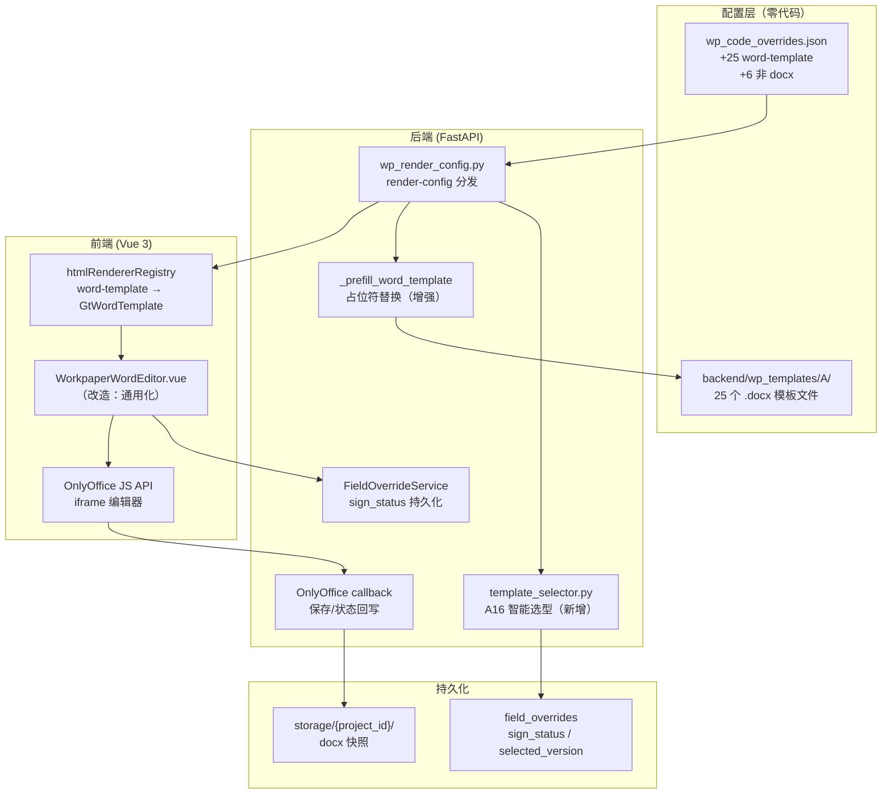

# Design Document: A循环 docx 底稿批量在线化

## Overview

本设计将 25 个 A 循环 docx 底稿批量注册为 `word-template` componentType，并注册 6 个非 docx 底稿到正确的结构化组件。在此基础上新增：模板预填服务（首次打开自动替换占位符）、签署状态跟踪（draft/pending/signed 三态）、A16 智能模板选择（按 business_category 推荐声明书版本）。

核心设计原则：
- **配置优先**：25+6 个 wp_code 注册只需修改 `wp_code_overrides.json`，零代码
- **复用现有模式**：A16 已有 `WorkpaperWordEditor.vue` + OnlyOffice 9.4.0 + `_prefill_word_template` helper，新底稿复用同一渲染路径
- **最小代码增量**：预填扩展现有 helper；签署状态复用 `field_overrides` 表；模板选择复用 `business_category` 字段

## Architecture



**数据流概述**：

1. 用户打开底稿 → `GET /render-config` → `_WP_CODE_OVERRIDE` 命中 "word-template" → 返回 `componentType: "word-template"`
2. 前端加载 `WorkpaperWordEditor.vue` → 构建 OnlyOffice editor config（document URL 指向后端 docx 文件）
3. 首次打开（无快照）→ 后端 `_prefill_word_template` 复制模板 + 替换占位符 → 保存为项目快照
4. OnlyOffice 保存回调 → 后端更新 docx 快照 + last_modified
5. 签署状态变更 → `POST /field-overrides` 写入 `scope=word_template:{wp_code}` 行

## Components and Interfaces

### 配置变更

#### wp_code_overrides.json 新增条目

```json
{
  "A8-1": "word-template",
  "A8-2": "word-template",
  "A9-1": "word-template",
  "A9-2": "word-template",
  "A10-1": "word-template",
  "A11-1": "word-template",
  "A12-1": "word-template",
  "A16-1": "word-template",
  "A16-2": "word-template",
  "A16-3": "word-template",
  "A16-4": "word-template",
  "A16-5": "word-template",
  "A16-6": "word-template",
  "A16-7": "word-template",
  "A17-2-1": "word-template",
  "A17-3": "word-template",
  "A17-3-1": "word-template",
  "A17-4": "word-template",
  "A17-6": "word-template",
  "A18-1": "word-template",
  "A26-1": "word-template",
  "A26-2": "word-template",
  "A26-3": "word-template",
  "A26-4": "word-template",
  "A27-1": "word-template",
  "A30": "checklist-table",
  "A28": "d-form-table",
  "A4-1": "audit-sheet",
  "A7-1": "audit-sheet",
  "A10": "a-program-console",
  "A12": "a-program-console"
}
```

#### 不变的现有条目（保护列表）

- `"A16": "word-template"` — 已有，不修改
- `"A17-1": "a17-summary"` — 专属组件
- `"A17-7": "independence-signing"` — 专属组件

### 后端改造

| 模块 | 变更 | 类型 |
|------|------|------|
| `wp_code_overrides.json` | +31 条映射 | 配置 |
| `_prefill_word_template()` | 扩展占位符 token 集合 + 空值保留逻辑 + 审计日志 | 改造 |
| `template_selector.py` | business_category → A16-x 推荐逻辑 | 新增 |
| `wp_editor_router.py` | sign_status 端点通用化（去除 A16 硬编码） | 改造 |
| `working_paper.py` render-config | 注入 sign_status + recommended_version | 改造 |

### 前端改造

| 模块 | 变更 | 类型 |
|------|------|------|
| `WorkpaperWordEditor.vue` | 拆分通用模式（非 A16 底稿）vs A16 专用模式（版本选择） | 改造 |
| 统一工具栏 | sign_status badge + 保存状态 + 导出按钮 | 已有 |

### API 接口

#### 已有端点（复用）

```
GET  /api/projects/{project_id}/working-papers/{wp_id}/render-config
POST /api/workpapers/field-overrides   { project_id, year, scope, item_key, field, value }
GET  /api/workpapers/field-overrides   ?project_id=&year=&scope=
POST /api/working-papers/{wp_id}/sign-status  { status: "draft"|"pending"|"signed", version? }
```

#### 新增端点

```
GET /api/projects/{project_id}/a16/recommended-version
  Response: {
    recommended_code: "A16-1",
    recommended_label: "企业会计准则通用声明书",
    all_versions: [
      { code: "A16-1", label: "...", exists_in_project: true },
      ...
    ],
    always_required: ["A16-7"]
  }
```

### 占位符 Token 规范

| Token | 数据来源 | 格式 |
|-------|---------|------|
| `{{entity_name}}` | projects.client_name ∥ projects.name | 原文 |
| `{{period_end}}` | projects.audit_period_end | YYYY年MM月DD日 |
| `{{preparer}}` | current_user.name (project_assignments JOIN staff_members) | 原文 |
| `{{current_date}}` | datetime.date.today() | YYYY年MM月DD日 |
| `{{client_name}}` | 同 entity_name（向后兼容 A16 已有模板） | 原文 |
| `{{audit_period}}` | 同 period_end（向后兼容） | YYYY-MM-DD |
| `{{partner_name}}` | project_assignments role='partner' | 原文 |

规则：
- 若对应值为空/None，保留 `{{token}}` 不替换（用户可手动填写）
- 替换操作在项目级副本上执行，原模板文件不变
- 替换后记录日志：`logger.info("prefill wp_code=%s fields=%s", wp_code, replaced_fields)`

## Data Models

### 存储（无新表，复用现有）

**field_overrides 表** — sign_status 持久化：

| project_id | year | scope | item_key | field | value |
|-----------|------|-------|----------|-------|-------|
| {uuid} | 2025 | `word_template:A16:A16-1` | sign_status | value | "signed" |
| {uuid} | 2025 | `word_template:A9-1` | sign_status | value | "draft" |
| {uuid} | 2025 | `word_template:A16` | selected_version | value | "A16-1" |

scope 格式规则：
- A16 子版本：`word_template:A16:{version_code}` — 因为 A16 是 parent，子版本需区分
- 其他独立底稿：`word_template:{wp_code}` — 如 `word_template:A9-1`

**sign_status 取值**：

| 值 | 含义 | OnlyOffice 权限 |
|----|------|-----------------|
| `"draft"` | 草稿（默认） | edit=true |
| `"pending"` | 待签署 | edit=true |
| `"signed"` | 已签署 | edit=false (只读) |

**sign_status 状态转换审计**：

每次 sign_status 变更通过 `FieldOverrideService.set()` 的 `user_id` 参数记录操作人。额外的时间戳由表的 `updated_at` 列自动覆盖。如需完整审计链（谁在何时将状态从 X 改为 Y），可在 field_overrides 表增加 `previous_value` 列（V092 迁移），但 MVP 阶段仅记录最新状态+操作人+时间即可。

### A16 模板选择逻辑（template_selector.py）

```python
# backend/app/services/template_selector.py

A16_CATEGORY_MAP: dict[str, str] = {
    "IPO": "A16-3",
    "上市": "A16-2",
    "listed": "A16-2",
    "新三板": "A16-5",
    "企业债": "A16-6",
    "债券": "A16-6",
}
A16_DEFAULT = "A16-1"
A16_ALWAYS_REQUIRED = ["A16-7"]

def recommend_a16_version(business_category: str | None) -> str:
    """根据 business_category 推荐 A16 变体 wp_code"""
    if not business_category:
        return A16_DEFAULT
    for keyword, version in A16_CATEGORY_MAP.items():
        if keyword in business_category:
            return version
    return A16_DEFAULT
```

### 文件系统布局

```
storage/{project_id}/workpapers/
  A9-1.docx          ← 项目级快照（首次从模板预填后保存于此）
  A16-1.docx
  ...

backend/wp_templates/A/
  A9-1向管理层通报内部控制缺陷-沟通函.docx   ← 原始模板（只读）
  A16-1 管理层声明书...docx
  ...
```


## Correctness Properties

*A property is a characteristic or behavior that should hold true across all valid executions of a system—essentially, a formal statement about what the system should do. Properties serve as the bridge between human-readable specifications and machine-verifiable correctness guarantees.*

### Property 1: Override 注册正确性（render-config 返回注册的 componentType）

*For any* wp_code that has been registered in `wp_code_overrides.json`, calling render-config for a workpaper with that wp_code SHALL return the exact componentType specified in the override registry (not a fallback or derived type).

**Validates: Requirements 1.2, 2.7**

### Property 2: word-template 模板文件可解析

*For any* wp_code registered as "word-template" in the override registry, there SHALL exist a corresponding .docx file in `backend/wp_templates/A/` whose filename contains that wp_code, and the file SHALL be openable by python-docx without error.

**Validates: Requirements 1.4, 1.5**

### Property 3: 占位符替换完备性

*For any* docx template containing supported placeholder tokens (`{{entity_name}}`, `{{period_end}}`, `{{preparer}}`, `{{current_date}}`), and *for any* project with non-empty values for those fields, after prefill the resulting document SHALL contain zero instances of the replaced tokens AND the actual project values SHALL appear in the document text.

**Validates: Requirements 3.1, 3.2**

### Property 4: 空值占位符保留

*For any* docx template containing placeholder tokens, and *for any* project where one or more corresponding field values are empty/None, after prefill the tokens with empty values SHALL remain as literal `{{token}}` strings in the document, while tokens with available values SHALL still be replaced.

**Validates: Requirements 3.3**

### Property 5: 快照幂等性（已有快照不重复预填）

*For any* word-template workpaper that already has a saved project-level snapshot file, calling the prefill operation SHALL leave the snapshot byte-for-byte unchanged AND the original template file in `backend/wp_templates/A/` SHALL remain unmodified regardless of whether prefill has been called.

**Validates: Requirements 3.4, 3.5**

### Property 6: sign_status 持久化往返

*For any* word-template wp_code, *for any* valid sign_status value, and *for any* project, after persisting the status via the sign_status endpoint, querying field_overrides with scope `word_template:{wp_code}` SHALL return the same status value, AND the record SHALL contain the updating user_id and a non-null updated_at timestamp.

**Validates: Requirements 4.3, 4.7**

### Property 7: sign_status 枚举验证

*For any* sign_status update request, the system SHALL accept only values in the set {"draft", "pending", "signed"} and SHALL reject any value outside this set with a validation error.

**Validates: Requirements 4.1**

### Property 8: 已签署文档只读

*For any* word-template workpaper whose sign_status is "signed", the render-config response SHALL include OnlyOffice permission configuration with `edit=false`, ensuring the document is served in read-only mode.

**Validates: Requirements 4.5**

### Property 9: 签署状态回退权限控制

*For any* sign_status transition from "signed" to "draft" or "pending", the operation SHALL succeed only when the requesting user has role "partner" (业务合伙人) or higher in the project. For users with lower roles (审计助理, 现场经理), the operation SHALL be rejected with 403.

**Validates: Requirements 4.6**

### Property 10: A16 模板选择确定性

*For any* business_category string, `recommend_a16_version()` SHALL return exactly one wp_code from the set {A16-1, A16-2, A16-3, A16-5, A16-6}, and the result SHALL be deterministic (same input always produces same output). Specifically: containing "IPO" → A16-3, containing "上市" or "listed" → A16-2, containing "新三板" → A16-5, containing "企业债" or "债券" → A16-6, otherwise → A16-1.

**Validates: Requirements 5.1, 5.2**

### Property 11: A16-7 始终必需 + render-config schema 完整

*For any* call to the A16 recommended-version endpoint, regardless of business_category input, the response SHALL include "A16-7" in the `always_required` list, AND SHALL contain non-null `recommended_code` and non-empty `all_versions` array.

**Validates: Requirements 5.3, 5.6**

### Property 12: 导出文件名格式

*For any* wp_code, entity_name, and period_end combination, the generated export filename SHALL match the pattern `{wp_code}_{entity_name}_{period_end}.docx` where special filesystem characters in entity_name are sanitized.

**Validates: Requirements 6.5**

### Property 13: OnlyOffice 回调持久化

*For any* valid OnlyOffice save callback (status=2 or status=6), the system SHALL persist the document content to the project snapshot path AND update the workpaper's last_modified timestamp to a value ≥ the callback reception time.

**Validates: Requirements 6.2**

## Error Handling

### 后端错误处理

| 场景 | 处理策略 |
|------|---------|
| 模板 .docx 文件不存在 | render-config 正常返回 componentType，前端显示"模板缺失"提示 + 下载按钮灰置 |
| python-docx 无法打开模板 | 日志 ERROR + prefill 返回 False + 前端降级为上传/下载模式 |
| 占位符替换部分失败（run 跨行） | 跳过该 token + 日志 WARNING，已替换的保留 |
| field_overrides 写入失败 | HTTP 500 + 前端 el-message 提示 |
| sign_status 非法值 | Pydantic 校验拦截 → 422 Validation Error |
| OnlyOffice 回调下载失败 | 返回 `{"error": 1}` 触发 DocServer 重试（最多 3 次） |
| OnlyOffice 容器不可达 | 前端检测 iframe 加载超时 → 显示降级工具栏（下载/上传） |
| business_category 为 null | `recommend_a16_version()` 返回 A16-1（默认） |
| A16 子版本 workpaper 不存在 | recommended-version 端点标记 `exists_in_project: false` + 前端显示创建提示 |
| sign_status 回退权限不足 | HTTP 403 + 错误信息"仅业务合伙人及以上角色可撤回签署" |

### 前端错误处理

| 场景 | 处理策略 |
|------|---------|
| OnlyOffice JS API 加载失败 | 隐藏 iframe 区域 + 显示降级"下载/上传"工具栏 |
| 网络断连 | 顶部 el-alert warning banner + 自动重连（10s 间隔） |
| 签回操作失败 | el-message.error 提示 + 按钮恢复为可点击 |
| 导出下载失败 | el-message.error + 提供重试按钮 |

## Testing Strategy

### 单元测试

**后端 pytest：**
- `test_wp_code_overrides.py` — 验证 JSON 文件包含全部 31 条新增映射 + 保护列表不变
- `test_prefill_word_template.py` — token 替换、空值保留、快照幂等、日志输出
- `test_template_selector.py` — 各 business_category 关键词 → 正确版本
- `test_sign_status_api.py` — 枚举验证、持久化往返、权限控制

**前端 Vitest：**
- `WorkpaperWordEditor.spec.ts` — 通用模式 vs A16 模式分支、sign_status badge 颜色映射
- `exportFilename.spec.ts` — 文件名格式化函数

### 属性测试（Property-Based Testing）

- 后端使用 **hypothesis** 库（项目已有 `.hypothesis/` 目录）
- 前端使用 **fast-check** 库
- 每个 property test 运行 ≥100 iterations
- 每个测试标注对应 design property：`# Feature: a-cycle-docx-online, Property {N}: {title}`

| Property | 测试位置 | 生成器策略 |
|----------|---------|-----------|
| P3 占位符替换 | 后端 pytest | st.text() 生成随机 entity_name/preparer + st.dates() 生成 period_end |
| P4 空值保留 | 后端 pytest | 随机选择哪些字段为 None（st.sampled_from + st.none()） |
| P5 快照幂等 | 后端 pytest | 生成随机 docx 内容作为快照 → 验证 prefill 不修改 |
| P6 sign_status 往返 | 后端 pytest | st.sampled_from(["draft","pending","signed"]) × 随机 wp_code |
| P7 枚举验证 | 后端 pytest | st.text() 生成非法 status 值 → 验证拒绝 |
| P9 权限控制 | 后端 pytest | st.sampled_from(roles) × st.sampled_from(transitions) |
| P10 模板选择 | 后端 pytest | st.text() 生成随机 business_category → 验证输出在合法集合内 |
| P11 A16-7 必需 | 后端 pytest | st.text() 或 st.none() 作为 business_category → 验证 A16-7 始终存在 |
| P12 文件名格式 | 前端 vitest (fast-check) | fc.string() 生成随机 entity_name + wp_code |

### 集成测试

- Playwright E2E：打开 A9-1 底稿 → 验证 OnlyOffice iframe 加载（或降级 UI）→ 签署状态切换
- API 集成：POST sign-status → GET render-config 验证 permissions.edit 联动
- 配置验证：CI 中 `python -m pytest test_wp_code_overrides.py` 确保 JSON 条目完整

### 测试优先级

1. P10 (模板选择逻辑) + P3/P4 (预填正确性) — 业务核心
2. P6/P7/P8/P9 (签署状态全链路) — 权限安全
3. P2 (模板文件存在性) + P1 (override 注册) — 配置完整性
4. P5/P12/P13 — 辅助行为
