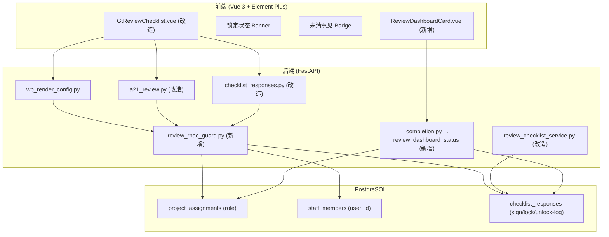

# Design Document: A21~A25 复核表角色权限绑定

## Overview

为 A21~A25 五级复核表增加基于 `project_assignments` 的角色权限控制，实现：
- RBAC Guard：非本级角色用户只读，后端在 render-config 和写入端点统一拦截
- Sequential Gate：逐级依赖链，下级未签字则上级不可编辑
- Sign-and-Lock：签字后永久只读 + 合伙人解锁能力
- Review Dashboard：A1 看板新增五级复核状态卡片（auto_data_resolver）
- Unresolved Counter：未清复核意见计数 + 签字前置校验

核心设计原则：
- **零新表**：全部复用 `checklist_responses`（sign/lock/unlock-log 均为 item_id 变体）和 `project_assignments`
- **render-config 注入**：RBAC 和 Sequential Gate 在 render-config 返回的 `html_data` 中注入 `readonly`/`locked`/`gate_reason` 字段，前端 GtReviewChecklist 消费
- **双重校验**：前端 readonly 防误操作 + 后端 403 防绕过
- **最小改动**：复用现有 `save_review_sign` + `checklist_responses PUT`，仅增加前置 guard

## Architecture



## Components and Interfaces

### 后端新增模块

| 模块 | 职责 | 位置 |
|------|------|------|
| `review_rbac_guard.py` | RBAC + Sequential Gate + Sign Lock 统一校验服务 | `backend/app/services/` |

### 后端改造模块

| 模块 | 改造内容 |
|------|---------|
| `wp_render_config.py` → review-checklist renderer | 调用 guard 注入 readonly/locked/gate_reason/signed_by/signed_at/unresolved_count |
| `a21_review.py` | review-sign 端点增加 RBAC 前置校验 + unresolved_count 校验 |
| `checklist_responses.py` | PUT 端点增加 RBAC 前置校验（仅对 review-checklist wp_code 生效） |
| `_completion.py` | 新增 `review_dashboard_status` resolver |

### 前端改造

| 组件 | 改造内容 |
|------|---------|
| `GtReviewChecklist.vue` | 消费 readonly/locked/gate_reason/unresolved_count 字段；显示锁定 Banner 和未清 Badge |
| A1 Dashboard 页面 | 新增 ReviewDashboardCard 消费 `review_dashboard_status` resolver 数据 |

### 新增端点

```
POST /api/workpapers/{wp_id}/review-unlock
  Body: { project_id: UUID, wp_code: str, reason: str }
  Response: { success: true, unlocked_at: str }
  权限: signing_partner only → 403 "仅合伙人可解锁已签字复核表"
```

### 改造端点行为

```
GET /api/projects/{pid}/working-papers/{wpId}/render-config
  → review-checklist componentType 的 html_data 新增字段:
    readonly: bool       // RBAC + gate + lock 三重判定
    locked: bool         // 签字锁定状态
    signed_by: str|null  // 锁定时的签字人姓名
    signed_at: str|null  // ISO 时间戳
    gate_reason: str|null // sequential gate 阻止原因
    unresolved_count: int // 未清意见数

POST /api/workpapers/{wp_id}/review-sign
  → 新增前置校验:
    1. RBAC: 403 "无权签署此级别复核表"
    2. unresolved_count > 0: 422 "尚有 {count} 项复核意见未清零，无法签字"

PUT /api/workpapers/{wp_id}/checklist-responses
  → 新增前置校验 (仅 review-checklist wp_code):
    1. RBAC: 403 "无权编辑此级别复核表"
    2. locked: 403 "复核表已锁定"
```

## Data Models

### 无新表 / 无迁移

所有状态存储复用 `checklist_responses` 的 item_id 约定：

| item_id 模式 | 用途 | conclusion | remark (JSON) |
|-------------|------|-----------|---------------|
| `{wp_code}-sign` | 签字记录 | `pass` / `reject` | `{"signer_id","signed_at","comment"}` |
| `{wp_code}-unlock-log` | 解锁审计日志 | `unlocked` | `{"unlocked_by","unlocked_at","reason","original_signer_id"}` |
| `{wp_code}-chk-{seq}` | 检查项响应 | `Y`/`N`/`NA` | 备注文本 |
| `{wp_code}-record` | 复核记录文本 | `done` | 自由文本 |

### RBAC 角色映射配置（静态常量）

```python
# review_rbac_guard.py
REVIEW_ROLE_MAP: dict[str, list[str]] = {
    "A21": ["senior", "auditor"],
    "A22": ["manager"],
    "A23": ["signing_partner"],
    "A24": ["qc"],
    "A25": ["eqcr"],
}
```

### Sequential Gate 依赖链（静态常量）

```python
# review_rbac_guard.py
REVIEW_DEPENDENCY: dict[str, str] = {
    "A22": "A21",
    "A23": "A22",
    "A24": "A23",
    "A25": "A24",
}
# A21 无前置依赖
```

### Guard 返回数据结构

```python
@dataclass
class ReviewGuardResult:
    readonly: bool
    locked: bool = False
    signed_by: str | None = None
    signed_at: str | None = None
    gate_reason: str | None = None
    unresolved_count: int = 0
    rbac_denied: bool = False  # 用于区分 403 场景
```

### Dashboard Resolver 输出

```python
# auto_data_resolver 返回结构
{
    "levels": [
        {
            "wp_code": "A21-1",
            "level_label": "现场负责人",
            "reviewer_name": "张三",
            "sign_status": "pass" | "reject" | "in_progress" | "not_started",
            "signed_at": "2026-01-15T10:30:00Z" | None,
            "progress": {"completed": 12, "total": 15}
        },
        # ... A22~A25
    ]
}
```


## Correctness Properties

*A property is a characteristic or behavior that should hold true across all valid executions of a system—essentially, a formal statement about what the system should do. Properties serve as the bridge between human-readable specifications and machine-verifiable correctness guarantees.*

### Property 1: RBAC Guard 正确性

*For any* user, project, and review level (A21~A25), the Review_RBAC_Guard SHALL return `rbac_denied=True` (and the write endpoints SHALL return HTTP 403) if and only if the user's staff_id does NOT have a matching role in `project_assignments` for that project according to the REVIEW_ROLE_MAP. Conversely, when the user DOES have the required role, `rbac_denied` SHALL be False.

**Validates: Requirements 1.1, 1.2, 1.3, 1.5, 1.6**

### Property 2: Sequential Gate 正确性

*For any* review level with a prerequisite in the dependency chain, and *for any* combination of sign states across all levels (including -1/-2 variants), the Sequential_Gate SHALL return `readonly=True` with a non-empty `gate_reason` if and only if the prerequisite level (with matching variant suffix) does NOT have `conclusion='pass'` in its `-sign` record. A21 (no prerequisite) SHALL never be gate-blocked.

**Validates: Requirements 2.1, 2.2, 2.3, 2.4, 2.5**

### Property 3: 解锁级联只读

*For any* signed level that is subsequently unlocked, ALL higher levels in the dependency chain SHALL have their Sequential_Gate return `readonly=True` on the next evaluation, regardless of their own sign state.

**Validates: Requirements 2.6**

### Property 4: Sign-Lock 不变式

*For any* review checklist where the `-sign` record has `conclusion='pass'`, the guard SHALL return `locked=True`, `readonly=True`, a non-empty `signed_by` string, and a valid ISO `signed_at` timestamp. No user (including the original signer) SHALL be able to modify the checklist while locked.

**Validates: Requirements 3.1, 3.2**

### Property 5: Unlock 往返恢复

*For any* locked review checklist, if a signing_partner performs the unlock action with a non-empty reason, THEN: (a) the `-sign` record SHALL be removed, (b) a `-unlock-log` record SHALL be created containing the unlocking user, timestamp, and reason, and (c) the guard SHALL subsequently return `locked=False` and `readonly=False` (assuming RBAC and gate conditions are met).

**Validates: Requirements 3.4, 3.6**

### Property 6: Unlock 角色限制

*For any* user whose role in `project_assignments` is NOT `signing_partner`, the unlock endpoint SHALL return HTTP 403. Only users with `signing_partner` role SHALL be able to execute the unlock action.

**Validates: Requirements 3.7**

### Property 7: Dashboard Resolver 输出 Schema

*For any* project with applicable review templates, the `review_dashboard_status` resolver SHALL return a `levels` list where each entry contains: `wp_code` (non-empty string), `level_label` (non-empty string), `reviewer_name` (string or null), `sign_status` (one of "pass"/"reject"/"in_progress"/"not_started"), `signed_at` (ISO string or null), and `progress` (object with integer `completed` ≤ integer `total`).

**Validates: Requirements 4.1, 4.2, 4.5**

### Property 8: Unresolved Count 计算

*For any* set of `checklist_responses` for a given wp_id, the Unresolved_Count SHALL equal the number of records where `conclusion='N'` AND `item_id` does NOT end with `-sign` AND `item_id` does NOT end with `-record` AND `item_id` does NOT end with `-unlock-log`. When all such items are changed to 'Y' or 'NA', the count SHALL be 0.

**Validates: Requirements 5.3, 5.5**

### Property 9: Unresolved Count 阻止签字

*For any* review checklist where Unresolved_Count > 0, the `save_review_sign` function with `action='pass'` SHALL raise a ValueError containing the exact count. When Unresolved_Count == 0 (and all items are done), the sign SHALL succeed.

**Validates: Requirements 5.2, 5.6**

## Error Handling

### 后端错误处理

| 场景 | 处理策略 |
|------|---------|
| user_id 无对应 staff_members 记录 | Guard 返回 rbac_denied=True（安全降级：无映射视为无权限） |
| project_assignments 查询异常 | 日志 ERROR + 返回 readonly=True（安全降级） |
| 签字时 wp_code 不在 REVIEW_ROLE_MAP | 跳过 RBAC 校验（非复核表类型，不受本 guard 管辖） |
| 解锁时 -sign 记录不存在 | 422 "该复核表未签字，无需解锁" |
| 解锁 reason 为空 | 422 "解锁必须填写原因" |
| Sequential Gate 查不到前置底稿 | 视为前置未完成，gate_reason 提示对应底稿缺失 |
| dashboard resolver 某级无分配人员 | reviewer_name 返回 null，sign_status 为 "not_started" |

### 前端错误处理

| 场景 | 处理策略 |
|------|---------|
| render-config 返回 readonly + gate_reason | 禁用所有输入 + 顶部显示 gate_reason 提示 |
| render-config 返回 locked | 禁用所有输入 + 显示锁定 Banner |
| 签字被 403 拒绝 | ElMessage.error 显示 detail 文本 |
| 签字被 422 拒绝（未清意见） | ElMessage.warning 显示未清数量 |
| 解锁被 403 拒绝 | ElMessage.error "仅合伙人可解锁" |

## Testing Strategy

### 单元测试

- 后端 pytest：
  - `review_rbac_guard.py` 各分支（有权/无权/无 staff 映射/多角色匹配）
  - Sequential Gate 各级依赖（含 -1/-2 变体、A21 无前置）
  - Sign-Lock 状态判定
  - Unresolved Count 计算（含排除 system items）
  - Dashboard resolver 输出结构
- 前端 Vitest：
  - GtReviewChecklist readonly/locked 状态渲染
  - 未清 Badge 显示逻辑

### 属性测试（Property-Based Testing）

- 后端使用 **hypothesis** 库（项目已有 `.hypothesis/` 目录）
- 每个 property test 运行 ≥100 iterations（`@settings(max_examples=100)`）
- 每个测试标注对应 design property：`# Feature: a-review-checklist-rbac, Property {N}: {title}`

| Property | 测试位置 | 生成器策略 |
|----------|---------|-----------|
| P1 RBAC Guard | backend pytest | 生成随机 user_id + 随机 project_assignments (0~5 条) + 随机 wp_code (A21~A25) |
| P2 Sequential Gate | backend pytest | 生成随机 sign state dict (每级 pass/reject/None) + 随机目标 wp_code + 随机变体后缀 |
| P3 级联解锁 | backend pytest | 生成已签字的多级链 + 随机选一级解锁，验证上游全部 readonly |
| P4 Sign-Lock | backend pytest | 生成随机 checklist_responses 含 -sign 记录，验证 guard 输出 |
| P5 Unlock 往返 | backend pytest | 生成已锁定状态 + 执行 unlock + 验证状态恢复 + log 记录存在 |
| P6 Unlock 角色限制 | backend pytest | 生成随机 role (5种) + 执行 unlock，验证仅 signing_partner 成功 |
| P7 Dashboard Schema | backend pytest | 生成随机项目 (0~5 级有分配/有签字/有进度) + 验证输出 schema |
| P8 Unresolved Count | backend pytest | 生成随机 checklist_responses (混合 Y/N/NA + system items)，验证计数 |
| P9 Unresolved 阻止签字 | backend pytest | 生成含 N 结论的 responses + 尝试 sign pass，验证拒绝 |

### 集成测试

- API 集成（pytest + httpx）：
  - 完整 RBAC 链路：创建项目分配 → render-config 返回正确 readonly
  - 签字 → 锁定 → 解锁完整流程
  - 无权签字/编辑 → 403
- Playwright E2E：
  - 不同角色登录看到 readonly 状态差异
  - 签字后锁定 Banner 显示
  - 解锁后恢复编辑

### 测试优先级

1. P1 (RBAC核心) → P2 (Sequential Gate) → P9 (签字防线)
2. P4 (Lock) → P5 (Unlock) → P8 (Count)
3. P3 (级联) → P6 (Unlock权限) → P7 (Dashboard)
