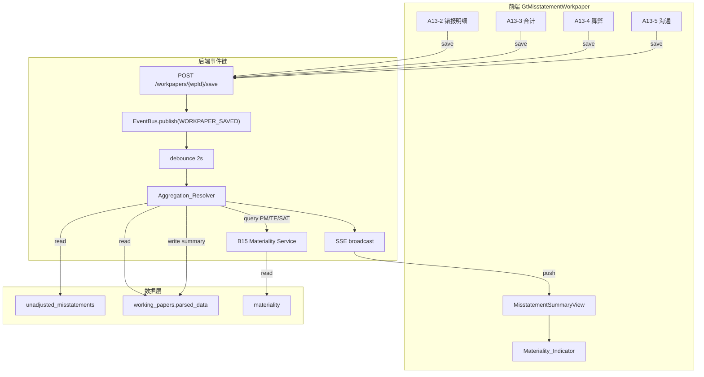

# Design Document: A13 错报评价自动聚合

## Overview

本设计将 A13 错报评价底稿从手动汇总升级为事件驱动的实时聚合系统。当 A13-2~5 任一子 tab 保存后，系统通过 EventBus 自动触发 Aggregation_Resolver 重算汇总指标，实时比较 B15 重要性水平并以三色预警呈现，同时支持上年结转状态追踪、沟通函草稿自动生成和源底稿 ref_chip 跳转。

核心数据流：

```
A13-2~5 保存 → WORKPAPER_SAVED event → debounce → Aggregation_Resolver
  → 写入 parsed_data.html_data['summary']
  → SSE 推送 → MisstatementSummaryView 实时刷新
  → Materiality_Indicator 三色状态更新
```

## Architecture



## Components and Interfaces

### 1. 后端新增组件

#### `_misstatement_aggregation.py` (auto_data_resolvers 子模块)

```python
@auto_resolver("a13_misstatement_summary")
async def _resolve_a13_summary(
    db: AsyncSession, project_id: UUID, year: int, **kw
) -> dict:
    """
    聚合 A13-2~5 sheet 数据 + UnadjustedMisstatement 表
    返回: {
        total_count, total_amount,
        by_type: {factual: {count, amount}, judgmental: {...}, projected: {...}},
        fraud_count,
        net_effect,
        prior_year: {continuing_amount, reversed_amount},
        current_year_amount,
        cumulative_total,
        materiality: {pm, te, sat, ratio, status},
    }
    """
```

#### `_on_a13_sheet_saved` (event_handlers 新增 handler)

```python
async def _on_a13_sheet_saved(payload: EventPayload) -> None:
    """
    过滤 wp_code 匹配 A13-2/A13-3/A13-4/A13-5，
    调用 Aggregation_Resolver，
    结果写入 A13 底稿 parsed_data.html_data['summary']，
    完成后 broadcast_raw SSE 通知前端。
    """
```

#### `POST /workpapers/{project_id}/{year}/communication-draft` (新增端点)

```python
@router.post("/{project_id}/{year}/communication-draft")
async def generate_communication_draft(
    project_id: UUID, year: int, db: AsyncSession = Depends(get_db)
) -> CommunicationDraftResponse:
    """根据当前未更正错报生成管理层沟通函草稿"""
```

### 2. 前端修改组件

#### `GtMisstatementWorkpaper.vue` — 保存后发布事件

当前 `onDFormSave` 已调用 `POST /workpapers/{wpId}/save`。后端 save 端点已发布 `WORKPAPER_SAVED` 事件（复用现有机制），无需前端额外发布。

#### `MisstatementSummaryView.vue` — 增强为自动刷新 + 三色预警

- 新增 `Materiality_Indicator` 区域（el-alert，顶部）
- SSE 监听：收到 `a13_summary_updated` 事件时自动 reload
- 新增 Prior_Year_Status 分类展示
- 新增 Source_Ref_Chip 列

#### `CommunicationDraftPanel.vue` — A13-5 内嵌沟通函生成

- "生成沟通函草稿" 按钮
- 调用后端端点生成并展示草稿
- 支持复制到 A10-1 或导出

### 3. 接口契约

| 端点 | 方法 | 用途 |
|------|------|------|
| `/workpapers/{wpId}/save` | POST | 已有，保存 sheet 数据并发布 WORKPAPER_SAVED |
| `/workpapers/{pid}/{year}/misstatement-summary` | GET | 已有，增强返回 Prior_Year_Status 分组 |
| `/workpapers/{pid}/{year}/misstatement-evaluation` | GET | 已有，增强返回三色状态 |
| `/workpapers/{pid}/{year}/communication-draft` | POST | 新增，生成沟通函草稿 |

## Data Models

### 扩展 `UnadjustedMisstatement` 表 (V092 迁移)

```sql
ALTER TABLE unadjusted_misstatements
  ADD COLUMN IF NOT EXISTS prior_year_status VARCHAR(20)
    DEFAULT 'new'
    CHECK (prior_year_status IN ('new', 'continuing', 'reversed'));

ALTER TABLE unadjusted_misstatements
  ADD COLUMN IF NOT EXISTS source_wp_code VARCHAR(20);

COMMENT ON COLUMN unadjusted_misstatements.prior_year_status IS
  '上年结转状态: new=本年新增, continuing=延续, reversed=已转回';
COMMENT ON COLUMN unadjusted_misstatements.source_wp_code IS
  '来源底稿编码 (如 D2-1, F3A)，用于 ref_chip 跳转';
```

### Aggregation Summary 存储结构

存入 `parsed_data.html_data['summary']`：

```json
{
  "_format": "a13-summary-v1",
  "_aggregated_at": "2026-06-22T12:00:00Z",
  "total_count": 5,
  "total_amount": 1500000.00,
  "by_type": {
    "factual": {"count": 2, "amount": 800000.00},
    "judgmental": {"count": 2, "amount": 500000.00},
    "projected": {"count": 1, "amount": 200000.00}
  },
  "fraud_count": 1,
  "net_effect": 1200000.00,
  "prior_year": {
    "continuing_count": 2,
    "continuing_amount": 600000.00,
    "reversed_count": 1,
    "reversed_amount": 300000.00
  },
  "current_year": {
    "new_count": 3,
    "new_amount": 900000.00
  },
  "cumulative_total": 1500000.00,
  "materiality": {
    "pm": 5000000.00,
    "te": 3750000.00,
    "sat": 250000.00,
    "ratio": 0.30,
    "status": "yellow",
    "fraud_flag": true
  }
}
```

### Communication Draft 结构

```json
{
  "_format": "communication-draft-v1",
  "_generated_at": "2026-06-22T12:00:00Z",
  "template_type": "A",
  "items": [
    {
      "seq": 1,
      "description": "...",
      "affected_account": "应收账款",
      "amount": 500000.00,
      "misstatement_type": "factual",
      "management_reason": "..."
    }
  ],
  "summary": {
    "total_count": 5,
    "cumulative_amount": 1500000.00,
    "pm": 5000000.00,
    "ratio": 0.30,
    "conclusion": "..."
  },
  "conclusion_text": "..."
}
```

### Materiality Indicator 状态枚举

| 状态 | 条件 | el-alert type | 颜色 |
|------|------|---------------|------|
| green | cumulative < SAT | success | 绿 |
| yellow | SAT ≤ cumulative < PM | warning | 黄 |
| red | cumulative ≥ PM | error | 红 |
| fraud_flag | A13-4 fraud_count > 0 | error + badge | 红+标记 |
| undetermined | PM = null/0 | info | 灰 |


## Correctness Properties

*A property is a characteristic or behavior that should hold true across all valid executions of a system—essentially, a formal statement about what the system should do. Properties serve as the bridge between human-readable specifications and machine-verifiable correctness guarantees.*

### Property 1: Aggregation computation correctness

*For any* set of `UnadjustedMisstatement` records with random misstatement_type (factual/judgmental/projected), random amounts, and random prior_year_status (new/continuing/reversed), the Aggregation_Resolver output SHALL satisfy:
- `total_count` == count of all non-reversed records
- `total_amount` == sum of amounts where status != "reversed"
- `by_type[t].count` == count of records with type `t` and status != "reversed"
- `by_type[t].amount` == sum of amounts with type `t` and status != "reversed"
- `prior_year.continuing_amount` == sum where status == "continuing"
- `prior_year.reversed_amount` == sum where status == "reversed"
- `current_year.new_amount` == sum where status == "new"
- `cumulative_total` == continuing_amount + new_amount

**Validates: Requirements 1.5, 4.3, 4.4, 4.5**

### Property 2: Materiality status classification

*For any* (cumulative_amount, pm, te, sat) tuple where pm > 0 and sat < pm, the materiality status function SHALL return:
- "green" when cumulative < sat
- "yellow" when sat ≤ cumulative < pm
- "red" when cumulative ≥ pm

Additionally, *for any* aggregation result where fraud_count > 0, the `fraud_flag` SHALL be true regardless of the amount-based status.

**Validates: Requirements 3.1, 3.2, 3.7**

### Property 3: Materiality threshold transition detection

*For any* prior cumulative amount below PM and a new cumulative amount at-or-above PM, the system SHALL emit a warning notification. Conversely, if both prior and new are below PM, or both are at-or-above PM, no transition notification SHALL fire.

**Validates: Requirements 3.5**

### Property 4: Debounce consolidation

*For any* sequence of N (N ≥ 2) WORKPAPER_SAVED events for A13 sub-sheets within the debounce window (2 seconds), the Aggregation_Resolver SHALL execute exactly once after the last event, using the final event's project_id and year.

**Validates: Requirements 2.4**

### Property 5: Event payload contract

*For any* A13 sub-sheet save (A13-2, A13-3, A13-4, or A13-5), the published EventPayload SHALL contain `event_type=WORKPAPER_SAVED`, the correct `project_id`, `year` derived from the project, and `extra.wp_code` matching the saved sheet identifier.

**Validates: Requirements 2.1, 2.6**

### Property 6: Prior_Year_Status invariant

*For any* `UnadjustedMisstatement` record, `prior_year_status` SHALL be one of exactly three values: "new", "continuing", or "reversed". Records where `is_carried_forward=True` SHALL have status "continuing" or "reversed" (never "new"). Records where `is_carried_forward=False` SHALL have status "new".

**Validates: Requirements 4.1**

### Property 7: Carry_forward status assignment

*For any* set of prior-year misstatements, executing `carry_forward` SHALL produce new records all with `prior_year_status="continuing"`, `is_carried_forward=True`, and `prior_year_id` pointing to the original record.

**Validates: Requirements 4.2**

### Property 8: Communication draft filtering and completeness

*For any* set of misstatements with mixed prior_year_status values, the generated Communication_Draft SHALL include exactly those items where `prior_year_status IN ('continuing', 'new')`, and each item SHALL contain all required fields: seq, description, affected_account, amount, misstatement_type, and management_reason.

**Validates: Requirements 5.1, 5.2, 5.3**

### Property 9: Communication draft template selection

*For any* (cumulative_amount, pm) pair where pm > 0:
- Template A when cumulative < pm × 0.75 (below PM)
- Template B when pm × 0.75 ≤ cumulative < pm (approaching PM)
- Template C when cumulative ≥ pm (exceeds PM)

**Validates: Requirements 5.6**

### Property 10: Source_Ref_Chip visibility

*For any* misstatement record, the Source_Ref_Chip SHALL be rendered if and only if `source_wp_code IS NOT NULL` OR `source_adjustment_id IS NOT NULL`.

**Validates: Requirements 6.1**

### Property 11: Source_wp_code auto-population from rejected AJE

*For any* adjustment with a non-null `originating_wp_code` that is rejected (creating a misstatement via `create_from_rejected_aje`), the resulting `UnadjustedMisstatement.source_wp_code` SHALL equal the adjustment's `originating_wp_code`.

**Validates: Requirements 6.4**

### Property 12: Aggregation persistence round-trip

*For any* valid aggregation result, after the Aggregation_Resolver persists it to `parsed_data.html_data['summary']`, reading the same workpaper's `parsed_data.html_data['summary']` SHALL return a value equivalent to the original result.

**Validates: Requirements 1.6**

## Error Handling

| 场景 | 处理策略 |
|------|----------|
| Aggregation_Resolver 执行异常 | log.error + 保留上次 summary 不变 (Req 1.8) |
| B15 重要性未设置 (PM=null/0) | Indicator 显示 "重要性水平未确定" + link to B15 (Req 3.4) |
| EventBus debounce 期间服务重启 | Redis Stream 持久化 → replay_pending_events 恢复 |
| 沟通函生成时无未更正错报 | 返回 empty 标志 + 前端禁用按钮 (Req 5.5) |
| source_wp_code 对应底稿不存在 | ref_chip 显示但 click 时 toast "底稿未找到" |
| SSE 连接断开时聚合完成 | 前端 tab 切换时主动 fetch 最新 summary (降级) |
| carry_forward 源年度无数据 | 返回 count=0，不报错 |
| 数据库写入 summary 失败 | retry 1 次 → 失败 log.error + SSE 不推送 |

## Testing Strategy

### Property-Based Testing (Hypothesis)

使用 `hypothesis` 库，每个 property test 至少 100 iterations。

| Property | 测试文件 | 生成器 |
|----------|----------|--------|
| P1: Aggregation computation | `test_a13_aggregation_pbt.py` | 随机 misstatement 列表 (type, amount, status) |
| P2: Materiality classification | `test_a13_aggregation_pbt.py` | 随机 (cumulative, pm, sat) 元组 |
| P3: Threshold transition | `test_a13_aggregation_pbt.py` | 随机 (old_cumulative, new_cumulative, pm) |
| P4: Debounce | `test_a13_event_pbt.py` | 随机 N 个事件 + 时间间隔 |
| P5: Event payload | `test_a13_event_pbt.py` | 随机 sheet_id ∈ {A13-2..A13-5} |
| P6: Prior_Year_Status invariant | `test_a13_aggregation_pbt.py` | 随机 misstatement (is_carried_forward, status) |
| P7: Carry_forward status | `test_a13_aggregation_pbt.py` | 随机 prior-year misstatement 集 |
| P8: Draft filtering | `test_a13_communication_pbt.py` | 随机 misstatement 集 (mixed status) |
| P9: Template selection | `test_a13_communication_pbt.py` | 随机 (cumulative, pm) |
| P10: Ref_chip visibility | `test_a13_ref_chip_pbt.py` | 随机 misstatement (source_wp_code, source_adjustment_id) |
| P11: Source_wp_code from AJE | `test_a13_ref_chip_pbt.py` | 随机 adjustment with originating_wp_code |
| P12: Persistence round-trip | `test_a13_aggregation_pbt.py` | 随机 aggregation result dict |

配置：
```python
from hypothesis import settings, given
@settings(max_examples=100, deadline=None)
```

Tag 格式：`# Feature: a13-misstatement-aggregation, Property {N}: {title}`

### Unit Tests

| 场景 | 测试文件 |
|------|----------|
| 空错报集合 → summary 全零 | `test_a13_aggregation.py` |
| PM 未设置 → indicator "undetermined" | `test_a13_aggregation.py` |
| 沟通函空态 → 禁用提示 | `test_a13_communication.py` |
| SSE broadcast 触发验证 | `test_a13_event.py` |
| handler 注册 + wp_code 过滤 | `test_a13_event.py` |
| cross_wp_references A13 条目存在 | `test_a13_ref_chip.py` |
| carry_forward 空源 → count=0 | `test_a13_aggregation.py` |
| 错误恢复: resolver 异常保留旧 summary | `test_a13_aggregation.py` |

### 前端测试 (Vitest)

| 组件 | 测试点 |
|------|--------|
| MisstatementSummaryView | SSE 刷新 + materiality indicator 渲染 |
| CommunicationDraftPanel | 按钮禁用态 + 草稿展示 |
| Source_Ref_Chip | 显示/隐藏条件 + click 跳转路由 |
| Prior_Year_Status tag | 颜色映射 (blue/orange/gray) |
