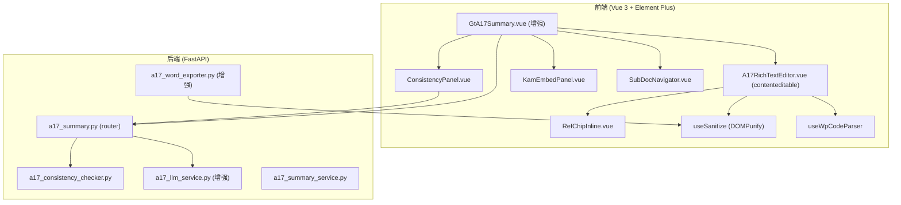

# Design Document: A17-1 重大事项概要深度打磨

## Overview

本设计增强 A17-1 重大事项概要底稿组件（`GtA17Summary.vue`），从当前的纯文本编辑器升级为富文本 HTML 编辑器，并新增跨章节一致性校验、LLM 生成增强、KAM 集成和子文档导航功能。

核心设计原则：
- **轻量富文本**：使用 `contenteditable` + DOMPurify 方案（项目已有依赖），不引入 TipTap 等重型编辑器
- **渐进增强**：存量纯文本数据无需迁移，自动兼容渲染
- **复用现有模式**：Ref_Chip 跳转复用 `router.push({ name: 'WorkpaperEditor' })` 模式；wp_index 查询复用 `getWpIndex` API

## Architecture



## Components and Interfaces

### 前端新增/改造组件

| 组件 | 职责 | 新增/改造 |
|------|------|----------|
| `GtA17Summary.vue` | 主容器，管理章节导航+工具栏+子组件分发 | 改造 |
| `A17RichTextEditor.vue` | 轻量富文本编辑器（contenteditable + toolbar） | 新增 |
| `RefChipInline.vue` | 行内 wp_code 芯片（可点击跳转/禁用态） | 新增 |
| `ConsistencyPanel.vue` | 一致性校验结果展示面板 | 新增 |
| `KamEmbedPanel.vue` | ch12 内嵌 KAM 列表面板 | 新增 |
| `SubDocNavigator.vue` | A17 子文档快速导航栏 | 新增 |

### 前端 Composables

| Composable | 职责 |
|-----------|------|
| `useWpCodeParser` | 正则解析文本中的 wp_code 模式 + source_label 分割 |
| `useSanitize` | DOMPurify 封装，strip script/iframe/on* |
| `useA17Navigation` | 封装 wp_code → wpId 查找 + router.push 跳转逻辑 |

### 后端新增/改造模块

| 模块 | 职责 | 新增/改造 |
|------|------|----------|
| `a17_consistency_checker.py` | 跨章节逻辑规则校验引擎 | 新增 |
| `a17_llm_service.py` | 增加 polish 模式 + 跨章上下文收集 | 改造 |
| `a17_word_exporter.py` | HTML→docx 段落样式转换 | 改造 |
| `a17_summary.py` (router) | 新增 consistency-check 端点 | 改造 |

### API 接口变更

#### 新增端点

```
POST /api/a17/consistency-check
  Body: { project_id: UUID, wp_id: UUID }
  Response: { results: ConsistencyResult[], checked_at: str }

POST /api/a17/chapters/{chapter_id}/ai-generate (增强)
  Body: { project_id: UUID, user_hint: str, mode: "generate" | "polish" }  ← 新增 mode 字段
  Response: { draft: str, model: str, confidence: float } | { error: str }

GET /api/a17/sub-documents?project_id=UUID
  Response: SubDocItem[]
```

#### 数据结构

```typescript
// ConsistencyResult
interface ConsistencyResult {
  rule_id: string           // e.g., "gc_vs_opinion"
  severity: 'error' | 'warning' | 'info'
  affected_chapters: string[]  // e.g., ["A17-1-ch10", "A17-1-ch14"]
  description: string
}

// SubDocItem
interface SubDocItem {
  wp_code: string       // e.g., "A17-2"
  label: string         // e.g., "KAM"
  exists: boolean       // 是否在项目 wp_index 中存在
  wp_id: string | null  // 存在时的 workpaper ID
}
```

## Data Models

### 存储层（无新表，复用 checklist_responses）

章节内容存储在 `checklist_responses.remark` 字段（text 类型），原存纯文本，增强后存 sanitized HTML。无需 schema 迁移。

```
checklist_responses:
  item_id: "A17-1-ch01" ~ "A17-1-ch16"
  remark: text  ← 从纯文本升级为 sanitized HTML
  wp_ref: text  ← source_label 不变
```

### 一致性校验规则定义（静态 JSON）

```json
// backend/data/a17_consistency_rules.json
[
  {
    "rule_id": "gc_vs_opinion",
    "description": "持续经营存疑但出具无保留意见需解释",
    "severity": "warning",
    "source_chapter": "A17-1-ch10",
    "target_chapter": "A17-1-ch14",
    "source_pattern": "重大不确定性|持续经营.*存疑|重大疑虑",
    "target_pattern": "标准无保留|无保留意见",
    "condition": "source_matches AND target_matches"
  },
  {
    "rule_id": "kam_required_listed",
    "description": "上市公司审计必须披露 KAM",
    "severity": "error",
    "source_chapter": "A17-1-ch12",
    "target_chapter": null,
    "source_pattern": null,
    "condition": "source_empty AND project.business_category == '上市公司'"
  },
  {
    "rule_id": "fraud_vs_opinion",
    "description": "舞弊线索未在审计结论中体现",
    "severity": "warning",
    "source_chapter": "A17-1-ch15",
    "target_chapter": "A17-1-ch14",
    "source_pattern": "舞弊|fraud|虚假",
    "target_pattern": "保留|否定|无法表示",
    "condition": "source_matches AND NOT target_matches"
  },
  {
    "rule_id": "risk_vs_opinion",
    "description": "未应对风险与审计结论不一致",
    "severity": "warning",
    "source_chapter": "A17-1-ch06",
    "target_chapter": "A17-1-ch14",
    "source_pattern": "未解决|遗留|未应对|未消除",
    "target_pattern": "标准无保留|无保留意见",
    "condition": "source_matches AND target_matches"
  }
]
```

### LLM 章节关联矩阵（静态配置）

```python
# a17_llm_service.py 内部
CHAPTER_AFFINITY = {
    "A17-1-ch10": ["A17-1-ch14", "A17-1-ch08"],  # 持续经营 → 结论, 财报分析
    "A17-1-ch12": ["A17-1-ch06", "A17-1-ch14"],  # KAM → 风险, 结论
    "A17-1-ch14": ["A17-1-ch10", "A17-1-ch12", "A17-1-ch15", "A17-1-ch06"],
    "A17-1-ch15": ["A17-1-ch14", "A17-1-ch06"],  # 舞弊 → 结论, 风险
    # ... 其余章节默认包含相邻章节
}
```


## Correctness Properties

*A property is a characteristic or behavior that should hold true across all valid executions of a system—essentially, a formal statement about what the system should do. Properties serve as the bridge between human-readable specifications and machine-verifiable correctness guarantees.*

### Property 1: HTML 消毒保留安全标签并剥离危险标签

*For any* arbitrary HTML string (including strings containing `<script>`, `<iframe>`, `on*` event attributes, or other XSS vectors), after sanitization the output SHALL NOT contain any `<script>`, `<iframe>`, `<object>`, `<embed>` tags or any `on*` event handler attributes, while preserving safe tags (`h3`, `h4`, `ul`, `ol`, `li`, `table`, `tr`, `td`, `th`, `strong`, `em`, `br`, `p`).

**Validates: Requirements 1.3, 1.4**

### Property 2: 纯文本兼容渲染保留换行

*For any* plain-text string (containing no HTML tags, only `\n` line breaks), the legacy content renderer SHALL produce output where every `\n` is converted to a `<br>` tag, and the original text content is fully preserved (no characters lost or added beyond the `<br>` insertions).

**Validates: Requirements 1.5**

### Property 3: HTML→Word 导出保留结构元素

*For any* sanitized HTML chapter content containing supported elements (headings, lists, bold, italic, tables), the Word exporter SHALL produce a Document where: each `<h3>`/`<h4>` maps to a Heading style paragraph, each `<ul>`/`<ol>` item maps to a list paragraph, `<strong>` maps to bold run, `<em>` maps to italic run, and `<table>` maps to a Table object.

**Validates: Requirements 1.6**

### Property 4: wp_code 正则解析完备性

*For any* text string containing embedded wp_code patterns (matching `[A-S]\d{1,2}(?:-\d{1,2})?(?:[A-Z])?`), the parser SHALL extract ALL matching patterns from the string, and for any text string containing NO such patterns, the parser SHALL return an empty result set.

**Validates: Requirements 2.1**

### Property 5: Ref_Chip 可用性由 wp_index 决定

*For any* parsed wp_code and any project wp_index set, the Ref_Chip SHALL be in disabled state if and only if the wp_code is NOT present in the project's wp_index. Conversely, if the wp_code IS in the wp_index, the chip SHALL be enabled with navigation capability.

**Validates: Requirements 2.3, 6.3, 6.4**

### Property 6: source_label 分割正确性

*For any* source_label string containing `+` delimiters (e.g., "A15+A15-1+B50"), splitting on `+` SHALL produce exactly N segments where N equals the count of `+` characters plus one, and each segment SHALL be a non-empty string that can be independently parsed for wp_code patterns.

**Validates: Requirements 2.4**

### Property 7: 一致性校验规则引擎正确触发

*For any* set of 16 chapter contents and a project business_category, the consistency checker SHALL: (a) produce a WARNING when ch10 matches "重大不确定性" AND ch14 matches "标准无保留"; (b) produce an ERROR when ch12 is empty AND business_category is "上市公司"; (c) produce a WARNING when ch15 matches fraud indicators AND ch14 does NOT mention qualification; (d) produce a WARNING when ch06 mentions unresolved risks AND ch14 states unqualified. No false positives: when none of these conditions hold, the result set SHALL be empty.

**Validates: Requirements 3.2, 3.3, 3.6**

### Property 8: 一致性校验输出 schema 不变式

*For any* input to the consistency checker, every item in the result list SHALL contain exactly the fields: `rule_id` (non-empty string), `severity` (one of "error"/"warning"/"info"), `affected_chapters` (non-empty list of valid chapter IDs), and `description` (non-empty string).

**Validates: Requirements 3.3**

### Property 9: LLM 跨章上下文构建完备性

*For any* target chapter and a set of 16 chapter contents where K chapters are non-empty (K ≥ 1, excluding target), the cross-chapter context builder SHALL include content from exactly K chapters (all non-empty chapters except the target) when total size is within budget, or a prioritized subset when exceeding budget, where prioritized chapters are determined by the affinity matrix.

**Validates: Requirements 4.1, 4.5**

### Property 10: LLM 生成模式 prompt 构建

*For any* generation request, when mode is "polish" the prompt SHALL contain the existing chapter content verbatim; when mode is "generate" the prompt SHALL NOT contain any prior chapter content. Additionally, the prompt SHALL always include project industry and audit_period_end fields.

**Validates: Requirements 4.2, 4.3, 4.6**

### Property 11: AI 模式默认值由内容状态决定

*For any* chapter state, the default generation mode SHALL be "generate" when chapter content is empty (whitespace-only counts as empty) and "polish" when chapter content contains non-whitespace characters.

**Validates: Requirements 4.4**

### Property 12: 子文档导航可用性映射

*For any* project wp_index containing a subset of A17-series wp_codes (A17-2 through A17-7), the Sub_Doc_Navigator SHALL mark each sub-document as "已创建" (exists=true, navigable) if its wp_code appears in wp_index, and "不适用/未创建" (exists=false, disabled) otherwise.

**Validates: Requirements 6.3, 6.4, 6.5**

## Error Handling

### 前端错误处理

| 场景 | 处理策略 |
|------|---------|
| 富文本编辑器 paste 恶意 HTML | DOMPurify.sanitize 在 paste handler 中即时清洗 |
| wp_code 跳转目标不存在 | Ref_Chip 灰色禁用 + tooltip "该底稿在当前项目中不存在" |
| 一致性校验 API 失败 | ConsistencyPanel 显示 "校验服务暂不可用" 提示，不阻断编辑 |
| AI 生成超时/失败 | Dialog 显示错误信息 + 关闭按钮，不影响已有内容 |
| KAM 数据加载失败 | KamEmbedPanel 显示 "加载失败，点击重试" |
| contenteditable focus/blur 竞争 | isInternalChange guard（踩坑铁律） |
| sendBeacon 失败（页面卸载时） | 静默降级，下次打开时从 DB 恢复最后保存版本 |

### 后端错误处理

| 场景 | 处理策略 |
|------|---------|
| 一致性规则 JSON 加载失败 | 日志 ERROR + 返回空 results（不阻断） |
| LLM 服务不可用 | 返回 `{ error: "AI 服务未启用" }`，HTTP 200 |
| 跨章上下文 token 超限 | 按 CHAPTER_AFFINITY 优先级截断，不报错 |
| Word 导出遇到不支持的 HTML 标签 | 静默跳过该标签内容，不中断导出 |
| project.business_category 为 null | 一致性规则中依赖此字段的规则跳过 |

## Testing Strategy

### 单元测试

- 前端 Vitest：`useWpCodeParser` 正则解析、`useSanitize` 清洗、source_label 分割、AI 模式默认值
- 后端 pytest：一致性规则引擎（各规则触发/不触发）、LLM prompt 构建、Word HTML→docx 转换

### 属性测试（Property-Based Testing）

- 后端使用 **hypothesis** 库（项目已有 `.hypothesis/` 目录）
- 前端使用 **fast-check** 库
- 每个 property test 运行 ≥100 iterations
- 每个测试标注对应 design property：`# Feature: a17-summary-enhancement, Property {N}: {title}`

| Property | 测试位置 | 生成器策略 |
|----------|---------|-----------|
| P1 HTML消毒 | 后端 pytest + 前端 vitest | 生成含 script/iframe/on* 的随机 HTML |
| P2 纯文本兼容 | 前端 vitest | 生成含 \n 的随机 ASCII 字符串（无 HTML 标签） |
| P3 HTML→Word | 后端 pytest | 生成含 h3/ul/ol/table/strong/em 的 HTML 片段 |
| P4 wp_code 解析 | 前端 vitest + 后端 pytest | 生成随机文本 + 嵌入随机 wp_code 模式 |
| P5 Ref_Chip 可用性 | 前端 vitest | 生成随机 wp_code 集合 + 随机 wp_index |
| P6 source_label 分割 | 前端 vitest | 生成含随机个 + 分隔符的字符串 |
| P7 一致性规则 | 后端 pytest | 生成 16 章随机内容 + 随机 business_category |
| P8 schema 不变式 | 后端 pytest | 复用 P7 的输入，验证输出结构 |
| P9 跨章上下文 | 后端 pytest | 生成 16 章随机填充状态 + 随机目标章节 |
| P10 prompt 构建 | 后端 pytest | 生成随机 mode + 随机章节内容 + 随机项目元数据 |
| P11 模式默认值 | 前端 vitest | 生成随机字符串（含纯空白和非空白） |
| P12 子文档映射 | 前端 vitest | 生成随机 A17-x wp_code 子集作为 wp_index |

### 集成测试

- Playwright E2E：富文本编辑→保存→刷新验证；Ref_Chip 点击跳转；一致性校验触发+面板展示
- API 集成：POST consistency-check 返回预期 rule 触发；export-word 含 HTML 内容时正常导出

### 测试优先级

1. P1 (安全) → P7 (业务逻辑核心) → P4 (解析正确性)
2. P9, P10 (LLM 上下文) → P3 (导出)
3. P2, P5, P6, P8, P11, P12 (辅助)
