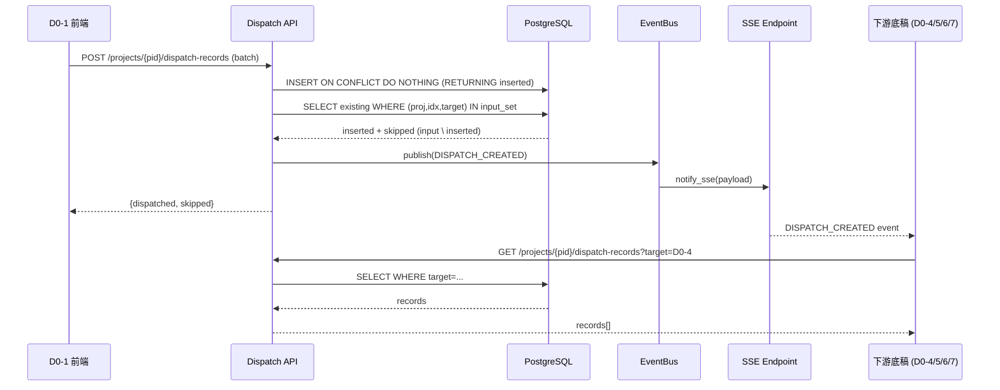

# Design Document: Cross-Workpaper Dispatch Persistence

## Overview

本设计为 D0-1 函证汇总表的跨底稿分发逻辑提供后端持久化支持。当前 `useConfirmationDispatch` composable 的分发状态仅存在于前端内存 `dispatchedMap`（`Map<string, Set<DispatchTarget>>`），页面刷新即丢失。本方案引入 `dispatch_records` 数据库表 + RESTful API + EventBus 事件通知，实现分发记录的持久化、跨用户可见性和实时同步。

### 设计目标

1. 分发记录后端持久化（单事务批量写入 + 唯一约束去重）
2. 前端 `dispatchedMap` 启动时从后端恢复，分发/撤回后同步更新
3. 下游底稿组件挂载时按 `target` 拉取分发记录填充"从 D0-1 带入"区域
4. EventBus 发布 `DISPATCH_CREATED` / `DISPATCH_REVOKED` 事件 → SSE 推送实时通知

### 关键决策

| 决策点 | 选择 | 理由 |
|--------|------|------|
| 去重机制 | DB 唯一约束 (project_id, confirm_index, target) | 数据库层保证一致性，无需分布式锁 |
| 批量写入 | INSERT ON CONFLICT DO NOTHING + 二次查询 | PG ON CONFLICT DO NOTHING 不返回跳过行，需先 INSERT 得 dispatched IDs，再用入参集合 EXCEPT 得 skipped |
| 事件类型 | 新增 EventType 枚举值 | 走完整 EventBus publish 路径（handlers + SSE） |
| 撤回权限 | dispatched_by 本人 OR project 管理员 | 符合审计助理/现场经理权限模型 |
| 迁移版本 | V092 | 接续当前最高 V091 |

## Architecture



### 层次结构

```
backend/
├── migrations/
│   ├── V092__create_dispatch_records.sql
│   └── R092__create_dispatch_records.sql
├── app/
│   ├── models/
│   │   └── dispatch_models.py          # ORM: DispatchRecord
│   ├── services/
│   │   └── dispatch_service.py         # 业务逻辑（批量创建/查询/撤回）
│   └── routers/
│       └── dispatch_records.py         # REST 端点

audit-platform/frontend/src/
├── api/
│   └── dispatchApi.ts                  # Axios 封装
├── components/workpaper/confirmation/coordination/
│   └── useConfirmationDispatch.ts      # 改造：接入后端 API
└── composables/
    └── useDownstreamDispatch.ts        # 下游底稿通用 composable
```

## Components and Interfaces

### 1. dispatch_models.py — ORM 模型

```python
class DispatchRecord(Base, TimestampMixin):
    __tablename__ = "dispatch_records"
    
    id: UUID (PK, default uuid4)
    project_id: UUID (FK → projects.id, NOT NULL)
    confirm_index: str (VARCHAR 50, NOT NULL)
    target: str (VARCHAR 10, NOT NULL)  # D0-4/D0-5/D0-6/D0-7
    entity_name: str (VARCHAR 255, nullable)
    account_type: str (VARCHAR 50, nullable)
    amount: Decimal(20,2) (nullable)
    reason: str (TEXT, nullable)
    dispatched_by: UUID (FK → users.id, NOT NULL)
    dispatched_at: datetime (timestamptz, NOT NULL, default now)
    
    __table_args__ = (
        UniqueConstraint('project_id', 'confirm_index', 'target', name='uq_dispatch_dedup'),
        Index('ix_dispatch_project_target', 'project_id', 'target'),
    )
```

### 2. dispatch_service.py — 业务服务

```python
class DispatchService:
    @staticmethod
    async def batch_create(db, project_id, entries, user_id) -> BatchResult
    # 实现：INSERT ON CONFLICT DO NOTHING → 得 inserted IDs → 
    # 入参集合 EXCEPT inserted = skipped（PG ON CONFLICT 不返回跳过行）
    
    @staticmethod
    async def list_records(db, project_id, *, target=None, confirm_index=None) -> list[DispatchRecord]
    
    @staticmethod
    async def revoke(db, record_id, user_id, is_manager=False) -> DispatchRecord
```

### 3. dispatch_records.py — REST Router

| Method | Path | 描述 |
|--------|------|------|
| POST | `/projects/{pid}/dispatch-records` | 批量创建（去重） |
| GET | `/projects/{pid}/dispatch-records` | 查询（可选 ?target=&confirm_index=） |
| DELETE | `/projects/{pid}/dispatch-records/{id}` | 撤回单条 |

### 4. 前端改造

**useConfirmationDispatch.ts** 改造点：
- `onMounted` → 调用 `GET /dispatch-records` 初始化 `dispatchedMap`
- `executeDispatch` → 调用 `POST /dispatch-records`，用响应更新本地 Map
- 新增 `revokeDispatch` → 调用 `DELETE`，从 Map 移除

**useDownstreamDispatch.ts**（新建）：
- 下游底稿组件 `onMounted` 调用 `GET /dispatch-records?target=D0-X`
- SSE 监听 `DISPATCH_CREATED` / `DISPATCH_REVOKED`，增量更新

### 5. EventBus 事件

新增 EventType 枚举：
```python
DISPATCH_CREATED = "dispatch.created"
DISPATCH_REVOKED = "dispatch.revoked"
```

EventPayload extra 结构：
```json
{
  "confirm_indices": ["CI-001", "CI-002"],
  "target": "D0-4",
  "dispatched_by": "user-uuid"
}
```

## Data Models

### dispatch_records 表 DDL (V092)

```sql
CREATE TABLE IF NOT EXISTS dispatch_records (
    id UUID PRIMARY KEY DEFAULT gen_random_uuid(),
    project_id UUID NOT NULL REFERENCES projects(id),
    confirm_index VARCHAR(50) NOT NULL,
    target VARCHAR(10) NOT NULL,
    entity_name VARCHAR(255),
    account_type VARCHAR(50),
    amount NUMERIC(20,2),
    reason TEXT,
    dispatched_by UUID NOT NULL REFERENCES users(id),
    dispatched_at TIMESTAMPTZ NOT NULL DEFAULT now(),
    created_at TIMESTAMPTZ NOT NULL DEFAULT now(),
    updated_at TIMESTAMPTZ NOT NULL DEFAULT now(),
    CONSTRAINT uq_dispatch_dedup UNIQUE (project_id, confirm_index, target)
);

CREATE INDEX IF NOT EXISTS ix_dispatch_project_target
    ON dispatch_records(project_id, target);
```

### API Request/Response Schemas

**POST /projects/{pid}/dispatch-records**

Request:
```json
{
  "entries": [
    {
      "confirm_index": "CI-001",
      "target": "D0-4",
      "entity_name": "某公司",
      "account_type": "应收账款",
      "amount": 50000.00,
      "reason": "差异金额 1000.00 元"
    }
  ]
}
```

Response:
```json
{
  "dispatched": [...],
  "skipped": [{"confirm_index": "CI-002", "target": "D0-4", "reason": "duplicate"}]
}
```

**GET /projects/{pid}/dispatch-records?target=D0-4&confirm_index=CI-001**

Response:
```json
{
  "items": [
    {
      "id": "uuid",
      "confirm_index": "CI-001",
      "target": "D0-4",
      "entity_name": "某公司",
      "account_type": "应收账款",
      "amount": 50000.00,
      "reason": "差异金额 1000.00 元",
      "dispatched_by": "user-uuid",
      "dispatched_at": "2026-06-22T10:00:00Z"
    }
  ],
  "total": 1
}
```


## Correctness Properties

*A property is a characteristic or behavior that should hold true across all valid executions of a system—essentially, a formal statement about what the system should do. Properties serve as the bridge between human-readable specifications and machine-verifiable correctness guarantees.*

### Property 1: Dispatch record field round-trip

*For any* valid dispatch entry (with non-empty confirm_index, valid target in {D0-4, D0-5, D0-6, D0-7}, and valid project_id), after batch_create then list_records, the returned record should contain all original fields (project_id, confirm_index, target, entity_name, account_type, amount, reason, dispatched_by) with values equal to the input, plus non-null dispatched_at.

**Validates: Requirements 1.1, 2.4**

### Property 2: Dedup idempotence

*For any* dispatch entry, inserting it twice with the same (project_id, confirm_index, target) combination should result in: the first insert succeeding (dispatched), the second returning skipped status, and the total record count for that project remaining unchanged after the second attempt.

**Validates: Requirements 1.2, 4.3**

### Property 3: Batch atomicity

*For any* batch of dispatch entries submitted in a single request, if a non-dedup database error occurs during processing, then zero records from that batch should be persisted (all-or-nothing), and the pre-existing record set should remain unchanged.

**Validates: Requirements 1.3, 1.4**

### Property 4: Query filter correctness

*For any* set of dispatch records across multiple projects and targets, querying with filter parameters (project_id, optional target, optional confirm_index) should return exactly the subset of records matching ALL specified filters, and no records outside that subset.

**Validates: Requirements 2.1, 2.2, 2.3, 4.1**

### Property 5: DispatchedMap reconstruction from backend

*For any* set of persisted dispatch records for a project, loading them and constructing a `Map<confirm_index, Set<target>>` should produce a map where every (confirm_index, target) pair in the DB is present in the Map, and no extra pairs exist.

**Validates: Requirements 5.1**

### Property 6: Pending list exclusion

*For any* set of D0-1 rows and any dispatchedMap state, the pending*Rows computed properties should exclude exactly those rows whose (confirm_index, target) pairs are present in dispatchedMap, and include all rows that meet dispatch criteria but are NOT in dispatchedMap.

**Validates: Requirements 4.2**

### Property 7: Map sync after batch response

*For any* batch dispatch API response containing both dispatched and skipped entries, after processing the response, the local dispatchedMap should contain ALL entries from both lists (dispatched ∪ skipped) as (confirm_index → target) pairs.

**Validates: Requirements 5.2, 5.3**

### Property 8: Revoke removes record

*For any* existing dispatch record, after a successful revoke operation, querying by that record's project_id should no longer include that record, and the total count should decrease by exactly one.

**Validates: Requirements 6.1**

### Property 9: Revoke restores pending eligibility

*For any* dispatch record that has been revoked, the corresponding (confirm_index, target) pair should be absent from dispatchedMap, causing the row to reappear in the appropriate pending*Rows list (assuming the row still meets dispatch criteria).

**Validates: Requirements 6.2**

### Property 10: Revoke access control

*For any* dispatch record and requesting user, the revoke operation should succeed if and only if (user.id == record.dispatched_by) OR (user has manager/partner role on the project). All other users should receive a 403 response.

**Validates: Requirements 6.3**

### Property 11: Downstream dedup merge

*For any* set of dispatch records from the API and any set of existing local rows (identified by confirm_index), the merge function should add only those dispatch records whose confirm_index is NOT already present in the local row set, leaving existing local rows unchanged.

**Validates: Requirements 3.3**

### Property 12: Event target filtering

*For any* DISPATCH_CREATED event with a given target field, downstream composables should trigger a data refresh if and only if their own workpaper target identifier matches the event's target value.

**Validates: Requirements 7.2**

### Property 13: Event payload correctness

*For any* successful batch_create or revoke operation, the EventBus should receive a publish call with an EventPayload containing: correct event_type (DISPATCH_CREATED or DISPATCH_REVOKED), the operation's project_id, and extra dict containing confirm_indices list and target string.

**Validates: Requirements 7.1, 7.3**

## Error Handling

| 场景 | 处理策略 | HTTP 状态码 |
|------|----------|-------------|
| entries 为空数组 | 返回 400 Bad Request | 400 |
| project_id 不存在 | FK 约束失败 → 回滚 + 400 | 400 |
| confirm_index 为空/null | Pydantic 校验拒绝 | 422 |
| target 不在白名单 | Pydantic 校验拒绝 | 422 |
| 全部去重（无新写入） | 正常返回 dispatched=[], skipped=[...] | 200 |
| DB 连接超时 | 500 + 日志告警 | 500 |
| 撤回不存在的记录 | 404 Not Found | 404 |
| 撤回权限不足 | 403 Forbidden | 403 |
| 前端加载分发记录失败 | ElMessage.warning 提示 + dispatchedMap 保持空 + 禁用分发按钮 | N/A |
| 前端撤回失败 | ElMessage.error 提示 + 不修改本地 Map | N/A |
| SSE 推送失败 | 不影响 API 响应（fire-and-forget），日志记录 | N/A |

### 重试策略

- 前端 API 调用：不自动重试（用户手动重试）
- EventBus publish：立即执行（publish_immediate），失败写 Redis Stream 待下次 replay
- 下游 SSE 断线重连：浏览器 EventSource 自带重连机制（默认 3s）

## Testing Strategy

### Property-Based Testing (Hypothesis)

使用 Python `hypothesis` 库实现后端属性测试，每个 property test 运行 5 次随机输入（项目约定 `max_examples=5`）。

**配置：**
- 库：`hypothesis` + `hypothesis[pytest]`
- 每个测试 `@settings(max_examples=5)`
- 标签格式：`# Feature: cross-workpaper-dispatch-persistence, Property {N}: {title}`

**后端属性测试覆盖：**
- Property 1: 生成随机 DispatchEntry，验证 create→query 字段一致
- Property 2: 生成随机 entry，连续 insert 两次，验证第二次 skipped
- Property 3: 构造包含非法 entry 的批次，验证原子回滚
- Property 4: 生成多项目/多 target 记录集，验证各种 filter 组合返回正确子集
- Property 8: 生成记录后 revoke，验证 query 不再包含
- Property 10: 生成 (record, user, role) 组合，验证权限判定

**前端属性测试覆盖（Vitest + fast-check）：**
- Property 5: 生成随机 DispatchRecord[]，验证 Map 重建正确性
- Property 6: 生成随机 rows + dispatchedMap，验证 pending 列表排除逻辑
- Property 7: 生成随机 API response，验证 Map 包含 dispatched ∪ skipped
- Property 9: 生成 Map 状态 + revoke entry，验证移除后 pending 恢复
- Property 11: 生成 dispatch records + local rows，验证 merge 去重
- Property 12: 生成 event + composable target，验证匹配逻辑

### Unit Tests

**后端（pytest）：**
- POST 正常批量创建 → 返回 dispatched 列表
- POST 全部去重 → 返回 skipped 列表
- GET 无 filter → 返回项目全部记录
- GET ?target=D0-4 → 仅返回 D0-4 记录
- DELETE 本人撤回 → 200
- DELETE 非本人非管理员 → 403
- DELETE 不存在记录 → 404
- 空 entries 数组 → 400
- target 不在白名单 → 422

**前端（Vitest）：**
- useConfirmationDispatch 初始化加载成功场景
- executeDispatch 调用 API 并更新 Map
- revokeDispatch 调用 API 并从 Map 移除
- useDownstreamDispatch SSE 事件监听 + 增量更新
- 加载失败时 loading 状态和错误提示

### Integration Tests

- 完整流程：D0-1 分发 → 后端持久化 → SSE 推送 → 下游底稿拉取
- 多用户并发去重：两个用户同时分发相同条目，仅一个成功
- 撤回后下游感知：撤回 → SSE DISPATCH_REVOKED → 下游标记"已撤回"
