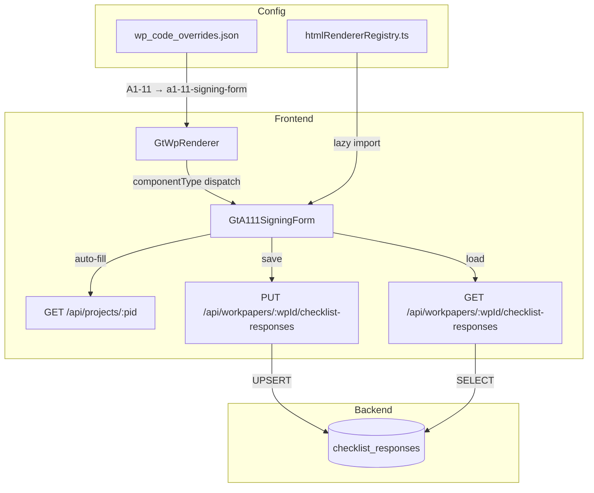

# Design Document — A1-11 业务报告签发流转控制表

## Overview

本设计替换现有 `WpPopupSigning.vue`（仅 2-4 行签字）为完整的 `GtA111SigningForm.vue` 组件，完全还原 Excel 模板"A1-11 报告签发"sheet 的全部字段和流转逻辑。

关键设计决策：
- **零新表**：所有数据通过 `checklist_responses` 表存储，item_id 前缀 `A1-11-` 区分字段
- **零新端点**：复用 `PUT /api/workpapers/{wp_id}/checklist-responses` 批量保存
- **注册替换**：在 htmlRendererRegistry 注册 `a1-11-signing-form`，wp_code_overrides 映射 A1-11 → `a1-11-signing-form`
- **自动填充**：从已有 `/api/projects/{pid}` 获取 entity_name、audit_period_end 等

## Architecture



### 数据流

1. **打开底稿** → GtWpRenderer 查 wp_code_overrides → 得到 `a1-11-signing-form` → 从 registry 加载组件
2. **初始化** → 组件并行请求 project info + checklist-responses
3. **自动填充** → 若 checklist-responses 中无对应 item，则从 project context 预填
4. **编辑** → debounce 2s 文本字段 / 签字立即保存
5. **完成** → 所有必填签字完成 → emit `completed` + 进入只读

## Components and Interfaces

### GtA111SigningForm.vue

```typescript
// Props（标准 contextProps='standard' 模式）
interface Props {
  wpId: string
  projectId: string
  wpCode: string
  year: number
  readonly?: boolean
}

// Emits
interface Emits {
  (e: 'save'): void
  (e: 'completed'): void
}

// Expose（GtWpToolbar 委托模式）
interface Expose {
  // 无额外 expose，toolbar 无自定义操作
}
```

### 内部组合式函数

```typescript
// composables/useA111FormData.ts
// 管理表单数据加载、自动填充、保存逻辑
export function useA111FormData(wpId: Ref<string>, projectId: Ref<string>) {
  // 返回响应式数据 + save/load 方法
}

// composables/useA111Signing.ts  
// 管理签字流转状态、只读判定、进度计算
export function useA111Signing(
  businessCategory: Ref<string>,
  signStates: Ref<Record<string, SignState>>
) {
  // 返回 visibleSlots, requiredSlots, progress, isAllSigned, isReadonly
}
```

### 注册

```typescript
// htmlRendererRegistry.ts — 新增条目
{
  componentType: 'a1-11-signing-form',
  component: defineAsyncComponent(() => import('./GtA111SigningForm.vue')),
  icon: '✍️',
  label: 'A1-11 签发流转控制表',
  emits: ['save', 'completed'],
  contextProps: 'standard',
}
```

### wp_code_overrides.json 变更

```json
"A1-11": "a1-11-signing-form"  // 从 "wp-popup-signing" 改为
```

## Data Models

### item_id 命名规范

所有字段使用 `checklist_responses` 表，通过 item_id 区分：

| 区域 | item_id | conclusion | remark | wp_ref |
|------|---------|-----------|--------|--------|
| **基本信息** | | | | |
| 委托人名称 | `A1-11-entity-name` | — | 名称文本 | — |
| 业务约定书编号 | `A1-11-engagement-no` | — | 编号文本 | — |
| 企业性质 | `A1-11-entity-type` | — | 性质文本 | — |
| 行业 | `A1-11-industry` | — | 行业文本 | — |
| 鉴证业务分类 | `A1-11-biz-category` | A/B/C | — | — |
| 首次承接 | `A1-11-first-engagement` | Y/N | — | — |
| **报告信息** | | | | |
| 报告标题 | `A1-11-report-title` | — | 标题文本 | — |
| 收件人全称 | `A1-11-recipient` | — | 收件人文本 | — |
| 附送说明 | `A1-11-attachment-note` | — | 说明文本 | — |
| **签字流转** | | | | |
| 项目负责经理 | `A1-11-sign-pm` | Y/null | 签字人姓名 | 日期 YYYY-MM-DD |
| 项目合伙人 | `A1-11-sign-partner` | Y/null | 签字人姓名 | 日期 |
| 质控复核人 | `A1-11-sign-qc` | Y/null/NA | 签字人姓名 | 日期 |
| 技术复核人(EQCR) | `A1-11-sign-eqcr` | Y/null/NA | 签字人姓名 | 日期 |
| IT专家 | `A1-11-sign-it` | Y/null/NA | 签字人姓名 | 日期 |
| 税务专家 | `A1-11-sign-tax` | Y/null/NA | 签字人姓名 | 日期 |
| **报告管理** | | | | |
| 部门 | `A1-11-mgmt-dept` | — | 部门文本 | — |
| 文号 | `A1-11-mgmt-doc-no` | — | 文号文本 | — |
| 中文报告份数 | `A1-11-mgmt-cn-copies` | — | 份数 | — |
| 外文报告份数 | `A1-11-mgmt-en-copies` | — | 份数 | — |
| 打字校对 | `A1-11-mgmt-proofread` | Y/null | 签字人 | 日期 |
| 打印 | `A1-11-mgmt-print` | Y/null | 签字人 | 日期 |
| 印章管理员 | `A1-11-mgmt-seal` | Y/null | 签字人 | 日期 |
| **修改区** | | | | |
| 修改原因(第n次) | `A1-11-amend-{n}-reason` | — | 原因文本 | — |
| 修改签字(第n次) | `A1-11-amend-{n}-sign-{role}` | Y/null | 签字人 | 日期 |

### 签字槽位配置

```typescript
interface SignSlot {
  id: string          // item_id 后缀，如 'pm'
  label: string       // 中文标签
  requiredFor: ('A' | 'B' | 'C')[]  // 哪些业务分类必填
  optional: boolean   // 是否可选填（如 IT/税务专家）
}

const SIGN_SLOTS: SignSlot[] = [
  { id: 'pm',      label: '项目负责经理',       requiredFor: ['A','B','C'], optional: false },
  { id: 'partner', label: '项目合伙人',         requiredFor: ['A','B','C'], optional: false },
  { id: 'qc',      label: '质量控制复核合伙人', requiredFor: ['A'],        optional: false },
  { id: 'eqcr',    label: '技术复核人(EQCR)',   requiredFor: ['A'],        optional: false },
  { id: 'it',      label: 'IT专家',             requiredFor: [],           optional: true },
  { id: 'tax',     label: '税务专家',           requiredFor: [],           optional: true },
]
```

### 只读判定逻辑

```typescript
function computeIsReadonly(
  externalReadonly: boolean,
  businessCategory: string,
  signStates: Record<string, SignState>
): boolean {
  if (externalReadonly) return true
  const requiredSlots = SIGN_SLOTS.filter(s => s.requiredFor.includes(businessCategory))
  return requiredSlots.every(s => signStates[`A1-11-sign-${s.id}`]?.signed)
}
```

### 自动填充映射

```typescript
const AUTO_FILL_MAP: Record<string, (project: ProjectInfo) => string> = {
  'A1-11-entity-name':       p => p.entity_name || '',
  'A1-11-entity-type':       p => p.entity_type || '',
  'A1-11-industry':          p => p.industry || '',
  'A1-11-engagement-no':     p => p.engagement_letter_no || '',
  'A1-11-biz-category':      p => p.business_category || '',
}
```

规则：仅在 checklist_responses 中无对应记录时填充。用户手动修改后存入 checklist_responses，后续加载从 responses 读取，不再覆盖。

## Correctness Properties

*A property is a characteristic or behavior that should hold true across all valid executions of a system—essentially, a formal statement about what the system should do. Properties serve as the bridge between human-readable specifications and machine-verifiable correctness guarantees.*

### Property 1: Required signing slots determined by business category

*For any* business_category value (A/B/C), the set of required signing slots SHALL equal the slots where `requiredFor` includes that category. B/C category requires exactly {pm, partner}; A category requires exactly {pm, partner, qc, eqcr}.

**Validates: Requirements 3.5, 3.6**

### Property 2: Readonly mode equals all-required-signed OR external readonly

*For any* combination of business_category, signing states, and external readonly prop, the form's readonly state SHALL be `true` if and only if: (a) external readonly is true, OR (b) all required signing slots for the given category have `signed=true`.

**Validates: Requirements 5.1, 5.3, 9.4**

### Property 3: Signing progress computation

*For any* set of signing states and business_category, the displayed progress (signed/total) SHALL equal the count of required slots with `signed=true` divided by the total count of required slots for that category.

**Validates: Requirements 3.7**

### Property 4: Auto-fill only populates empty fields

*For any* project context and existing checklist_responses set, auto-fill SHALL only write to fields that have no existing record in checklist_responses. Fields with existing records (including empty string values) SHALL remain unchanged.

**Validates: Requirements 2.1, 2.2, 2.3, 2.4, 2.5**

### Property 5: Signing action records correct data

*For any* signing slot and current user, executing a sign action SHALL produce a checklist_response with: conclusion='Y', remark=signer_name (non-empty string), wp_ref=today's date in YYYY-MM-DD format.

**Validates: Requirements 3.2**

### Property 6: Signed slot disables interaction

*For any* signing slot, if its conclusion='Y' in the data, the slot SHALL render in completed state (button disabled, name+date displayed). Conversely, if conclusion is null, the slot SHALL render as actionable.

**Validates: Requirements 3.3, 3.4**

### Property 7: Amendment reason validation

*For any* string composed entirely of whitespace (including empty string), attempting to submit an amendment SHALL be rejected. The amendment signing slots SHALL NOT become available until a non-empty, non-whitespace reason is saved.

**Validates: Requirements 9.2, 9.3**

### Property 8: Amendment history item_id sequencing

*For any* sequence of N amendments on the same workpaper, the Nth amendment SHALL use item_id prefix `A1-11-amend-{N}-`. Each amendment's items SHALL be independent (not overwrite previous amendments).

**Validates: Requirements 9.5**

### Property 9: Data persistence round-trip

*For any* valid form field value saved via PUT checklist-responses, subsequently loading the form via GET checklist-responses SHALL return the same value for that item_id (conclusion, remark, wp_ref all preserved).

**Validates: Requirements 4.1**

## Error Handling

| 场景 | 行为 |
|------|------|
| PUT 保存失败（网络/500） | ElMessage.error('保存失败')，保留本地数据不回滚 |
| GET 加载失败 | ElMessage.warning，表单保持空白可编辑状态 |
| Project API 加载失败 | 跳过自动填充，表单全部可手填 |
| 签字时无 current_user | 不应发生（登录态保证），前端 guard + 后端 401 |
| conclusion 值不在白名单 | 后端 422，前端显示校验错误 |
| 组件卸载时保存失败 | 静默失败（已离开页面），下次打开从后端加载 |

### 后端 conclusion 白名单扩展

当前 `checklist_responses.py` 的 conclusion 校验对 `A1-11-` 前缀需放行以下值：
- 签字字段：`Y` / `null`
- 不适用标记：`NA`
- 业务分类：`A` / `B` / `C`
- 首次承接：`Y` / `N`

实现方式：在现有 allowed 判断中增加 `A1-11-` 前缀分支。

## Testing Strategy

### Property-Based Testing（fast-check，前端）

每个 correctness property 对应一个 PBT 测试文件：

```
audit-platform/frontend/src/components/workpaper/__tests__/a111SigningForm.property.spec.ts
```

配置：
- 库：`fast-check`（项目已安装）
- 最小迭代：100 次
- Tag 格式：`Feature: a1-11-signing-control-form, Property {N}: {title}`

测试内容：
- Property 1-3, 6: 纯函数测试（requiredSlots / isReadonly / progress / slotState 计算）
- Property 4: 模拟 project context + existing responses → 验证合并逻辑
- Property 7: 生成随机空白字符串 → 验证 amendment reason 校验
- Property 8: 生成随机 amendment 序列 → 验证 item_id 命名

### Unit Tests（vitest，前端）

```
audit-platform/frontend/src/components/workpaper/__tests__/a111SigningForm.spec.ts
```

覆盖：
- 组件注册正确性（registry 包含 `a1-11-signing-form`）
- wp_code_overrides 映射正确性
- 签字操作 emit 行为
- debounce 2s 行为（fake timers）
- readonly 模式下所有交互禁用
- amendment 启动流程
- 打印样式类存在性

### 后端 PBT（hypothesis）

```
backend/tests/test_a111_signing_pbt.py
```

覆盖：
- Property 9: round-trip（生成随机 item → PUT → GET → 验证一致）
- conclusion 白名单校验（生成随机 A1-11- item_id + conclusion 组合）

### 契约测试

- componentType 契约：`componentTypeContract.spec.ts` 自动覆盖（已有 CI 卡点）
- HtmlComponentType union 类型更新后 TypeScript 编译即验证
