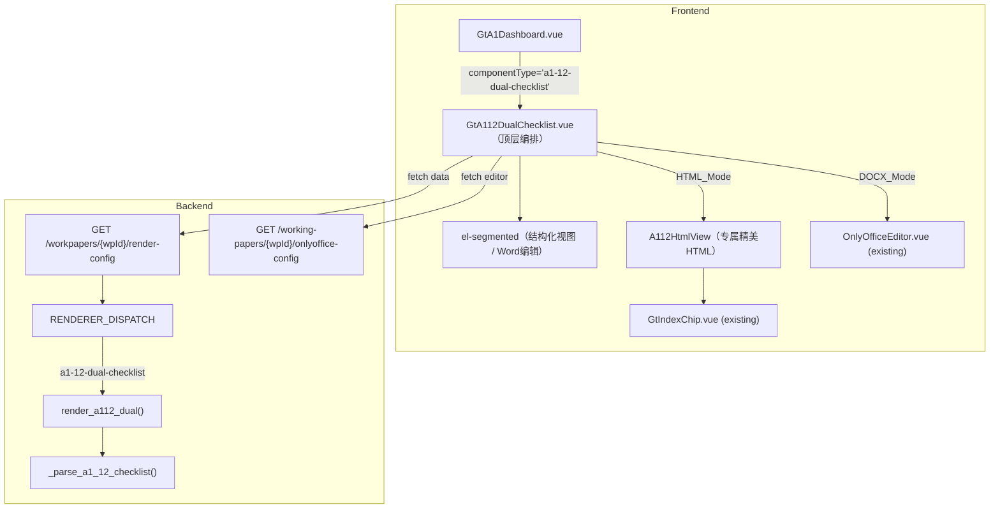
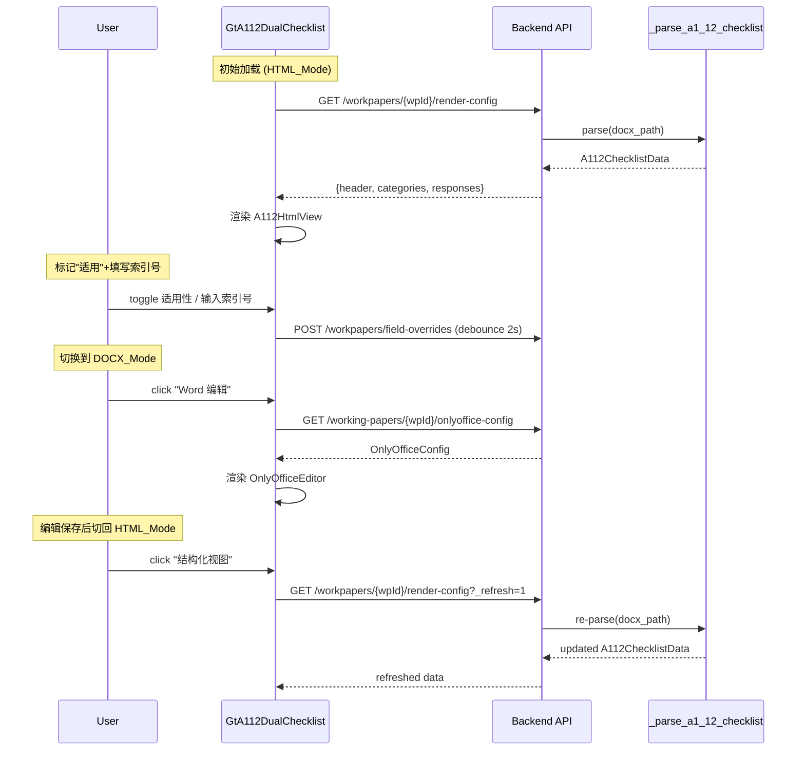

# Design Document: A1-12 重大事项决定程序双模式核查表

## Overview

A1-12（重大事项决定程序的履行情况核查表）基于实际 DOCX 模板分析，采用双模式渲染：OnlyOffice DOCX 原始编辑 + 专属精美 HTML 核查卡片。

**源模板结构分析（A1-12 重大事项决定程序的履行情况核查表1105.docx）：**
- 头部：标题 + 被审计单位信息 + 业务分类(A/B/C) + 是否首次承接 + 4 级签字区
- 主体：1 个 3 列表格（17 行 × 3 列）
  - 列结构：`事项描述 | 是否适用 | 如适用，索引号`
  - 第一类（行 0-14）：需提交专业技术委员会会议讨论、决策后出具报告的情形（14 项固定）
  - 第二类（行 15-16）：提交专业技术委员会讨论、决策的重大业务咨询或业务分歧事项（可动态添加）

**核心设计决策：**
- **不复用 GtChecklistTable**——A1-12 是"适用性标记+索引跳转"的简洁核查表，不是 35 章节 Y/N/NA 大型核对表
- 专属 HTML 渲染：卡片式布局 + 适用性 Switch + GtIndexChip 索引跳转 + 签字联动
- 复用已有 OnlyOfficeEditor（弹窗式）
- 新 componentType `a1-12-dual-checklist`

## Architecture

### Component Diagram



### Data Flow



## HTML 模式视觉设计

### 布局结构

```
┌──────────────────────────────────────────────────────────────────┐
│  [结构化视图 ·  Word编辑]          保存 ○  已保存 3 秒前          │
├──────────────────────────────────────────────────────────────────┤
│  ┌─ 头部信息卡 ────────────────────────────────────────────────┐ │
│  │  被审计单位：[显示]   截止日：[显示]   业务分类：● A ○ B ○ C │ │
│  │  首次承接：● 是 ○ 否                                        │ │
│  └─────────────────────────────────────────────────────────────┘ │
│                                                                   │
│  ┌─ 进度汇总 ─────────────────────────────────────────────────┐ │
│  │  ● 适用 3 项   ○ 不适用 9 项   ◻ 未标记 2 项  [14/14 完成]  │ │
│  └─────────────────────────────────────────────────────────────┘ │
│                                                                   │
│  ═══ 一、需提交专技委讨论决策后出具报告的情形 ══════════════════  │
│  ┌─ 卡片 ─────────────────────────────────────────────────────┐ │
│  │ 1  首次承接后的境内上市公司...的首份业务报告（A1）          │ │
│  │    [● 适用  ○ 不适用]   索引号: [A17-3] [+添加]            │ │
│  └─────────────────────────────────────────────────────────────┘ │
│  ┌─ 卡片 ─────────────────────────────────────────────────────┐ │
│  │ 2  首次承接的新三板已挂牌公司...的首份业务报告（A2）        │ │
│  │    [○ 适用  ● 不适用]                                       │ │
│  └─────────────────────────────────────────────────────────────┘ │
│  ...                                                              │
│                                                                   │
│  ═══ 二、提交专技委讨论决策的重大咨询或分歧事项 ════════════════  │
│  ┌─ 可编辑区域 ───────────────────────────────────────────────┐ │
│  │ [无事项] / [自由填写区]                                     │ │
│  │ [+ 添加事项]                                                │ │
│  └─────────────────────────────────────────────────────────────┘ │
│                                                                   │
│  ┌─ 签字区 ───────────────────────────────────────────────────┐ │
│  │  项目负责经理：[name] [date]   项目合伙人：[name] [date]    │ │
│  │  质量复核合伙人：[name] [date] 质量控制复核人：[name] [date]│ │
│  └─────────────────────────────────────────────────────────────┘ │
└──────────────────────────────────────────────────────────────────┘
```

### 卡片交互规则

| 状态 | 视觉 | 行为 |
|------|------|------|
| 未标记 | 白底灰左边框 | 显示"适用/不适用"两个 radio |
| 适用 | 白底紫左边框+高亮 | 展开索引号输入（el-autocomplete + GtIndexChip） |
| 不适用 | 白底浅灰+半透明 | 收起索引号区域，仅显示勾选状态 |

### 联动设计

1. **索引号跳转**：每个"如适用"的索引号渲染为 `GtIndexChip`，点击跳转到关联底稿
2. **签字区联动**：读取 `project_assignments` 自动填充签字人姓名，关联 A1-11 签发状态
3. **五级复核联动**：核查表完成度（全部标记）作为 A1 程序表进度统计的一部分
4. **A17 依赖**：若 A17 审计总结未完成，头部提示"建议先完成 A17 识别重大事项后再进行核查"

## Data Models

### A112ChecklistData（后端解析输出）

```typescript
interface A112ChecklistData {
  header: {
    entity_name: string | null    // 被审计单位
    period_end: string | null     // 截止日
    business_class: 'A' | 'B' | 'C' | null  // 业务分类
    is_first_engagement: boolean | null       // 首次承接
  }
  categories: A112Category[]
  signatures: A112Signature[]
}

interface A112Category {
  id: string                   // "cat-1" / "cat-2"
  title: string                // "一、需提交专技委..." / "二、提交专技委..."
  items: A112CheckItem[]
  allow_custom: boolean        // 第二类允许动态添加
}

interface A112CheckItem {
  id: string                   // "item-1" ~ "item-14"
  seq: number                  // 序号 1~14
  description: string          // 完整事项描述
  category_tag?: string        // 括号内标签 如 "(A1)" "(A2)"
}

interface A112Signature {
  role: string                 // "项目负责经理" / "项目合伙人" / ...
  name: string | null
  date: string | null
}
```

### A112Responses（用户填写数据，存 field_overrides）

```typescript
interface A112Responses {
  items: Record<string, A112ItemResponse>  // key = item.id
  header: Partial<A112ChecklistData['header']>
  custom_items: A112CustomItem[]           // 第二类用户自定义事项
}

interface A112ItemResponse {
  applicable: 'yes' | 'no' | null   // 适用/不适用/未标记
  ref_index: string                  // 索引号（逗号分隔多个）
}

interface A112CustomItem {
  id: string
  description: string
  applicable: 'yes' | 'no' | null
  ref_index: string
}
```

### OnlyOfficeConfig（复用现有）

```typescript
interface OnlyOfficeConfig {
  document_url: string
  document_key: string
  title: string
  onlyoffice_url: string
  callback_url: string
}
```

## Components

### 1. GtA112DualChecklist.vue（顶层编排）

```typescript
// Props
interface Props {
  wpId: string
  readonly?: boolean
}

// State
const activeMode = ref<'html' | 'docx'>('html')
const checklistData = ref<A112ChecklistData | null>(null)
const responses = ref<A112Responses>({ items: {}, header: {}, custom_items: [] })
const loading = ref(false)
const docxDirty = ref(false)  // DOCX 编辑后标记
const onlyofficeAvailable = ref(true)
```

### 2. A112HtmlView（专属精美 HTML，内联 template section）

不单独创建文件，作为 GtA112DualChecklist.vue 内的主渲染区域。包含：
- 头部信息卡（el-descriptions）
- 进度汇总条（el-statistic + 色块）
- 类别分组 + 卡片列表
- 签字区

### 3. 后端解析函数

```python
# backend/app/services/checklist_docx_parser.py

def _parse_a1_12_checklist(docx_path: str) -> dict:
    """解析 A1-12 DOCX 为 A112ChecklistData 结构.
    
    解析规则:
    1. 头部信息从段落 [4]~[10] 正则提取
    2. 表格第 0 行为表头（跳过）
    3. 以"一、"/"二、" 开头的行为 category 分隔
    4. 其余行为 checklist items，seq 按出现顺序编号
    5. description 中括号内容 (A1)/(A2) 提取为 category_tag
    """
```

## 注册点变更

| 注册点 | 变更 |
|--------|------|
| `wp_code_overrides.json` | `"A1-12": "a1-12-dual-checklist"` |
| `VALID_COMPONENT_TYPES` | 新增 `"a1-12-dual-checklist"` |
| `RENDERER_DISPATCH` | 新增 `"a1-12-dual-checklist": render_a112_dual` |
| `htmlRendererRegistry.ts` | 新增 lazy entry |
| `useA1SubWorkpapers.ts` | A1-12 componentType → `'a1-12-dual-checklist'` |
| `GtA1Dashboard.vue` | 新增 v-else-if 渲染分支 |

## Correctness Properties

### Property 1: 模式互斥渲染

*For any* state, exactly one of (A112HtmlView, OnlyOfficeEditor) is rendered, never both, never neither (when data loaded).

**Validates: Requirements 2.1, 3.1, 4.2, 4.3**

### Property 2: 适用性标记双向一致

*For any* item with applicable='yes', the ref_index input area must be visible; with applicable='no' or null, ref_index area must be hidden.

**Validates: Requirements 3.4, 3.5**

### Property 3: 索引号自动补全一致性

*For any* ref_index value entered, GtIndexChip should render with validate=true, and the autocomplete suggestions should come from the project's wp_index list.

**Validates: Requirements 3.5**

### Property 4: DOCX→HTML 切换刷新

*For any* mode transition from 'docx' to 'html' where docxDirty=true, a fresh API request must be issued to re-parse the DOCX.

**Validates: Requirements 5.1**

### Property 5: 响应数据持久化不丢失

*For any* sequence of (mark applicable → switch mode → switch back), the applicable/ref_index values should be preserved (fetched from field_overrides on return).

**Validates: Requirements 5.3**

### Property 6: 进度统计正确性

*For any* responses state, progress = (items with applicable != null) / total_items, where total_items includes both fixed items and custom_items.

**Validates: Requirements 3.6**

### Property 7: 解析输出结构完整性

*For any* valid A1-12 DOCX file, parsing should produce: (a) exactly 2 categories, (b) category[0] has 14 items, (c) all items have unique IDs, (d) all items have non-empty description.

**Validates: Requirements 6.1, 6.2, 6.3, 6.4**

### Property 8: Round-Trip 等价

*For any* A112ChecklistData produced by parsing, format_to_docx → re-parse should produce equivalent data (same items, same descriptions, same category structure).

**Validates: Requirements 7.1, 7.2**

## Error Handling

| 场景 | 处理策略 |
|------|----------|
| OnlyOffice 不可用 | DOCX 按钮 disabled + tooltip |
| render-config 返回空 | 空态卡片"数据未加载" |
| DOCX→HTML 刷新失败 | ElMessage.error + 保留上次数据 |
| 索引号验证失败 | GtIndexChip 红色虚线标记 |
| field_overrides 保存失败 | 重试3次 + ElMessage.warning |

## Testing Strategy

| 层级 | 范围 |
|------|------|
| Vitest 单元 | 组件注册、模式切换、适用性切换、进度计算 |
| fast-check PBT | P1-P6 前端属性（模式互斥、适用性→UI映射、刷新触发） |
| hypothesis PBT | P7-P8 后端属性（解析完整性、round-trip） |
| Playwright E2E | 完整链路：标记适用→填索引号→切换模式→验证数据 |
