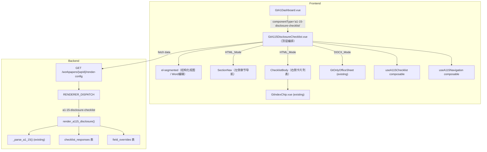
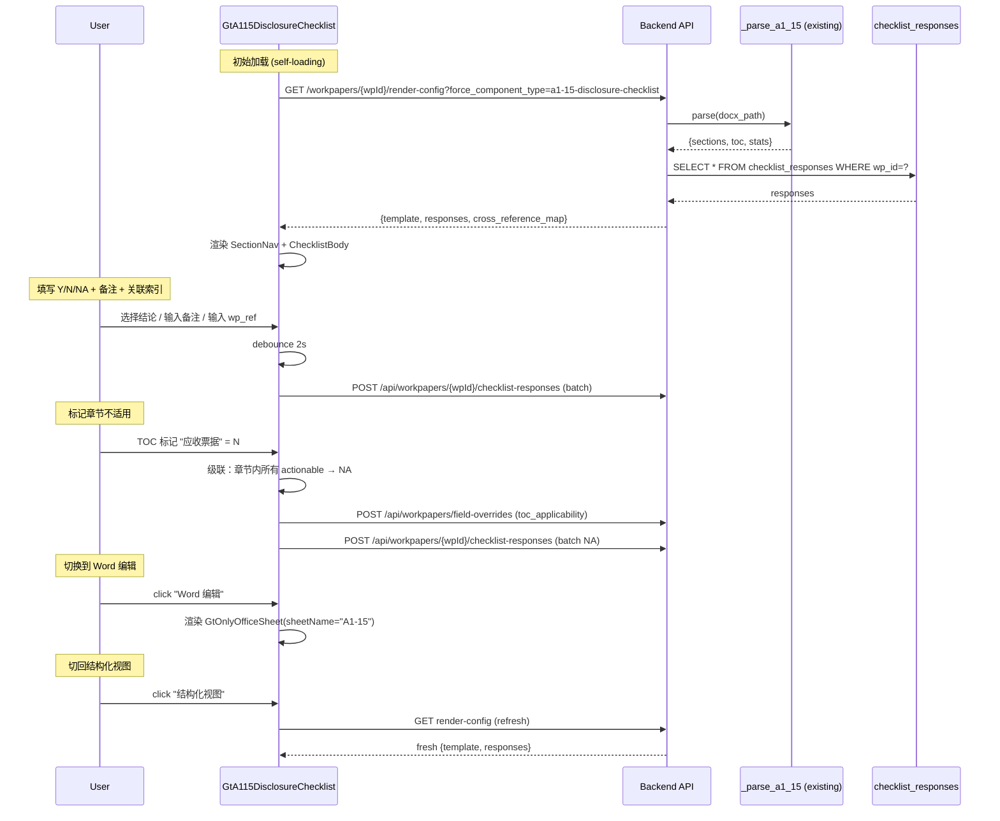

# Design Document: A1-15 企业会计准则财务报表列报及披露核对表

## Overview

A1-15（企业会计准则有关财务报表列报及披露核对表）从通用 `checklist-table` 升级为精美 HTML 专属组件，采用双模式渲染（结构化 HTML + Word 编辑）。

**源模板结构（已验证 _parse_a1_15 解析器输出）：**
- 文件：`A1-15 企业会计准则有关财务报表列报及披露核对表20141021.docx`
- 3 个 Word 表格：表1=封面(25行)、表2=目录(35+ 章节 Y/N)、表3=核对表主体(934行×3列)
- 35 章节：一般列报要求→资产负债表各科目→利润表→现金流量表→所有者权益→附注
- ~500 actionable 条目：`准则索引号(CAS_Ref) | 核查内容 | Y/N/NA`
- ~200 guidance 子项(a~j)：挂在 actionable 下，只读

**核心设计决策：**
- **复用现有 `_parse_a1_15` 解析器**——后端已完整实现 35 章节解析，仅需新增渲染策略函数包装
- **不复用 GtChecklistTable**——通用 UI 无法支持：左侧导航、科目跳转联动、章节适用性级联、Cross_Reference_Map 建议
- **大列表性能**：500+ 条目按章节分组 + section-based lazy rendering（仅渲染可视区 ±1 章节）
- **Cross_Reference_Map 静态配置**：科目→底稿编码映射，预置于前端 composable 中（不从后端计算）
- **自加载模式**：A1 Dashboard 仅传 wpId，组件自行请求 `render-config?force_component_type=a1-15-disclosure-checklist`
- **数据持久化复用 `checklist_responses` 表**（已有，通用 checklist 使用的同一张表）+ TOC 适用性存 `field_overrides`

## Architecture

### Component Diagram



### Data Flow



## HTML 模式视觉设计

### 布局结构

```
┌────────────────────────────────────────────────────────────────────────────┐
│  [结构化视图 · Word编辑]    🔍搜索    筛选[全部▾]    ○ 已保存 3秒前       │
├────────────────────────────────────────────────────────────────────────────┤
│  ┌─ 全局进度 ─────────────────────────────────────────────────────────┐   │
│  │  [████████░░] 72%  Y:280  N:12  NA:68  未填:140  总计:500         │   │
│  └────────────────────────────────────────────────────────────────────┘   │
├──────────────┬─────────────────────────────────────────────────────────────┤
│  章节导航     │  ═══ 5. 应收账款 ══════════════════════════════════════════ │
│              │  [██████░░] 80%  Y:16 N:1 NA:2 未填:1  建议关联: D2       │
│  □ 1.一般    │                                                            │
│  ■ 2.货币    │  ┌─ 卡片 ─────────────────────────────────────────────┐   │
│  ■ 3.应收票  │  │ [CAS22.4]  应收账款应按照实际发生额入账...           │   │
│  ■ 4.应收账  │  │ [● Y  ○ N  ○ NA]  备注:[________]  索引:[D2]       │   │
│  ◐ 5.预付    │  │  ▶ 详细披露要求 (3)                                 │   │
│  □ 6.存货    │  └────────────────────────────────────────────────────┘   │
│  □ 7.长投    │  ┌─ 卡片 ─────────────────────────────────────────────┐   │
│  □ 8.固资    │  │ [CAS22.5]  应收账款应按照账龄进行分析...             │   │
│  ...         │  │ [○ Y  ● N  ○ NA]  备注:[需补充]  索引:[D2]          │   │
│  ─────────── │  └────────────────────────────────────────────────────┘   │
│  ■ = 已完成  │                                                            │
│  ◐ = 进行中  │  ── 小节标题：坏账准备 ──────────────────────────────────  │
│  □ = 未开始  │                                                            │
│  ▧ = 不适用  │  ┌─ 卡片 ─────────────────────────────────────────────┐   │
│              │  │ [CAS22.9]  坏账准备计提方法应予以披露...              │   │
│              │  │ [○ Y  ○ N  ○ NA]  备注:[________]  索引:[D2]        │   │
│              │  │  ▶ 详细披露要求 (5)                                  │   │
│              │  │    a) 各类应收款项的坏账准备计提比例...               │   │
│              │  │    b) 本期计提、转回或转销坏账准备的金额...           │   │
│              │  └────────────────────────────────────────────────────┘   │
└──────────────┴────────────────────────────────────────────────────────────┘
```

### 卡片交互规则

| 结论状态 | 视觉 | 行为 |
|----------|------|------|
| 未填 | 白底无左边框 | 显示 Y/N/NA 三选一按钮 |
| Y | 白底绿色左边框 | 展开备注+索引号区域 |
| N | 白底红色左边框+高亮 | 展开备注(必填)+索引号区域 |
| NA | 白底灰色半透明 | 备注可选，索引号隐藏 |

### 性能策略

500+ 条目不能一次性全部渲染 DOM。采用 **section-based lazy rendering**：
- 仅渲染当前可视章节 ± 1 个缓冲章节（IntersectionObserver 触发）
- 非可视章节渲染为占位 div（高度预估 = items.length × 80px）
- 章节导航点击时，先设置目标章节为 visible，再 scrollIntoView
- 搜索/筛选时，匹配的章节全部展开渲染（性能可接受：搜索结果通常 <50 条）

## Data Models

### A115Template（后端 _parse_a1_15 输出，已有）

```typescript
interface A115Template {
  wp_code: string                    // "A1-15"
  title: string                      // "企业会计准则有关财务报表列报及披露核对表"
  sections: A115Section[]
  toc: A115TocEntry[]
  stats: {
    total_actionable: number          // ~500
    total_guidance: number            // ~200
    total_sections: number            // 35
  }
  parsed_at: string                  // ISO datetime
}

interface A115Section {
  id: string                         // "S01" ~ "S35"
  title: string                      // "应收账款"、"固定资产" 等
  items: A115Item[]
}

interface A115Item {
  id: string                         // "S05-001" ~ "S05-020"
  type: 'actionable' | 'header'      // actionable=可填写, header=小节标题
  standard_ref: string               // CAS 准则索引号，如 "CAS22.4"
  content: string                    // 核查内容描述
  children: A115GuidanceChild[]      // guidance 子项（a~j）
}

interface A115GuidanceChild {
  id: string                         // "S05-001-a"
  content: string                    // 详细披露要求文本
  standard_ref: string               // 子项准则索引号
}

interface A115TocEntry {
  id: string                         // "S01" ~ "S35"
  title: string                      // 章节标题
  applicable: boolean | null         // 从 DOCX 目录解析的默认适用性
}
```

### A115Responses（用户填写数据，存 checklist_responses 表）

```typescript
interface A115Responses {
  items: Record<string, A115ItemResponse>  // key = item.id (如 "S05-001")
  toc_applicability: Record<string, boolean>  // key = section.id, value = 适用与否
}

interface A115ItemResponse {
  conclusion: 'Y' | 'N' | 'NA' | null   // 结论
  remark: string                          // 备注
  wp_ref: string                          // 关联底稿索引号（如 "D2"）
}
```

### A115RenderConfigResponse（render-config API 返回）

```typescript
interface A115RenderConfigResponse {
  template: A115Template
  responses: A115Responses
  cross_reference_map: Record<string, string>  // section_id → suggested wp_code
}
```

### Cross_Reference_Map（静态配置）

```typescript
// 前端 composable 中预置，后端 render-config 也返回一份
const CROSS_REFERENCE_MAP: Record<string, string> = {
  // section_id → suggested wp_code
  'S03': 'D1',   // 应收票据 → D1
  'S04': 'D2',   // 应收账款 → D2
  'S05': 'D3',   // 预付款项 → D3（如有）
  'S06': 'E1',   // 存货 → E1
  'S07': 'I1',   // 长期股权投资 → I1
  'S08': 'G1',   // 固定资产 → G1
  'S09': 'H1',   // 无形资产 → H1
  'S02': 'D0',   // 货币资金 → D0
  'S10': 'F1',   // 应付账款 → F1
  'S11': 'F2',   // 应付职工薪酬 → F2
  'S12': 'K1',   // 收入 → K1
  // ... 其余章节由用户手动关联
}
```

## Components and Interfaces

### 1. GtA115DisclosureChecklist.vue（顶层编排）

```typescript
// Props
interface Props {
  wpId: string
  readonly?: boolean
}

// Emits
const emit = defineEmits<{
  progress: [{ filled: number; total: number }]
}>()
```

### 2. useA115Checklist composable（数据管理+持久化）

```typescript
// composables/useA115Checklist.ts
export function useA115Checklist(wpId: Ref<string>, readonly: Ref<boolean>) {
  const template = ref<A115Template | null>(null)
  const responses = ref<A115Responses>({ items: {}, toc_applicability: {} })
  const crossRefMap = ref<Record<string, string>>({})
  const loading = ref(false)
  const saving = ref(false)
  const lastSavedAt = ref<Date | null>(null)

  // 加载数据（self-loading）
  async function loadData(): Promise<void>

  // 更新单条目响应（debounce 2s 后批量保存）
  function updateItemResponse(itemId: string, field: keyof A115ItemResponse, value: any): void

  // 标记章节适用性（级联 NA）
  function setTocApplicability(sectionId: string, applicable: boolean): void

  // 进度计算
  const globalProgress: ComputedRef<{ filled: number; total: number; y: number; n: number; na: number }>
  function sectionProgress(sectionId: string): { filled: number; total: number }

  // 搜索与筛选
  const searchQuery = ref('')
  const conclusionFilter = ref<'all' | 'filled' | 'unfilled' | 'Y' | 'N' | 'NA'>('all')
  const filteredSections: ComputedRef<A115Section[]>

  return { template, responses, crossRefMap, loading, saving, lastSavedAt, loadData, updateItemResponse, setTocApplicability, globalProgress, sectionProgress, searchQuery, conclusionFilter, filteredSections }
}
```

### 3. useA115Navigation composable（章节导航+懒渲染）

```typescript
// composables/useA115Navigation.ts
export function useA115Navigation(sections: Ref<A115Section[]>, containerRef: Ref<HTMLElement | null>) {
  const activeSectionId = ref<string | null>(null)
  const visibleSections = ref<Set<string>>(new Set())

  // IntersectionObserver 管理可视章节
  function initObserver(): void
  function scrollToSection(sectionId: string): void
  function isSectionVisible(sectionId: string): boolean

  return { activeSectionId, visibleSections, initObserver, scrollToSection, isSectionVisible }
}
```

### 4. 后端渲染策略 `_a115_disclosure.py`

```python
# backend/app/routers/wp_render_strategies/_a115_disclosure.py

async def render(ctx: RenderContext) -> dict | None:
    """A1-15 披露核对表专属渲染策略.

    1. 调用现有 _parse_a1_15 获取模板数据
    2. 从 checklist_responses 查询用户 responses
    3. 从 field_overrides 查询 toc_applicability
    4. 返回 {template, responses, cross_reference_map}
    """
```

## 注册点变更

| 注册点 | 变更 |
|--------|------|
| `wp_code_overrides.json` | `"A1-15": "a1-15-disclosure-checklist"`（替换 `skip`） |
| `VALID_COMPONENT_TYPES` | 新增 `"a1-15-disclosure-checklist"` |
| `RENDERER_DISPATCH` | 新增 `"a1-15-disclosure-checklist": render_a115_disclosure` |
| `htmlRendererRegistry.ts` | 新增 lazy entry → `GtA115DisclosureChecklist` |
| `useA1SubWorkpapers.ts` | A1-15 Tab componentType → `'a1-15-disclosure-checklist'` |
| `GtA1Dashboard.vue` | 识别 componentType 渲染对应组件 |

## Correctness Properties

*A property is a characteristic or behavior that should hold true across all valid executions of a system—essentially, a formal statement about what the system should do. Properties serve as the bridge between human-readable specifications and machine-verifiable correctness guarantees.*

### Property 1: 模式互斥渲染

*For any* mode state ('html' | 'docx'), exactly one of (HTML structured view, GtOnlyOfficeSheet) is rendered—never both, never neither (when data is loaded and not in loading transition).

**Validates: Requirements 2.2, 2.3**

### Property 2: DOCX→HTML 切换触发刷新

*For any* mode transition from 'docx' to 'html', the component SHALL issue a fresh render-config API request to re-parse the DOCX and obtain updated template+responses data.

**Validates: Requirements 2.6**

### Property 3: 章节导航完整有序

*For any* valid A115Template with N sections, the SectionNav SHALL display exactly N entries, in the same order as `template.sections[].id` (i.e., S01→S35).

**Validates: Requirements 4.2**

### Property 4: 章节进度计算正确

*For any* section with K actionable items and a given responses state, `sectionProgress(sectionId).filled` SHALL equal the count of items in that section whose conclusion is not null, and `sectionProgress(sectionId).total` SHALL equal K.

**Validates: Requirements 4.4, 5.7**

### Property 5: TOC 适用性级联

*For any* section marked as `toc_applicability[sectionId] = false`, ALL actionable items in that section SHALL have conclusion='NA' in the responses.

**Validates: Requirements 4.7**

### Property 6: Actionable 卡片字段完整

*For any* item with `type='actionable'`, the rendered card SHALL contain: (a) standard_ref 准则索引号, (b) content 描述文本, (c) Y/N/NA 结论按钮组, (d) 备注输入区, (e) wp_ref 关联索引区.

**Validates: Requirements 5.1, 5.2, 6.1**

### Property 7: 结论状态→视觉映射

*For any* actionable item with conclusion ∈ {Y, N, NA, null}, the card's CSS class SHALL correspond to: Y→'conclusion-yes' (green border), N→'conclusion-no' (red border), NA→'conclusion-na' (gray/transparent), null→'conclusion-pending' (no border).

**Validates: Requirements 5.3**

### Property 8: Header 条目渲染为分隔标题

*For any* item with `type='header'`, it SHALL NOT render as an interactive card (no conclusion buttons, no remark input), but as a visual section divider with its content text.

**Validates: Requirements 5.6**

### Property 9: Cross_Reference_Map 建议显示

*For any* section whose `id` exists as a key in `cross_reference_map`, AND whose actionable items have no user-set `wp_ref`, the UI SHALL display the mapped wp_code as a suggested chip (dashed border).

**Validates: Requirements 6.3**

### Property 10: 全局进度不变量

*For any* responses state, `globalProgress.y + globalProgress.n + globalProgress.na + (total - filled)` SHALL equal `template.stats.total_actionable`. (Category counts sum to total.)

**Validates: Requirements 8.1, 8.2**

### Property 11: 筛选正确性

*For any* search query Q and conclusion filter F applied to the item list, every visible item SHALL satisfy: (a) item.content contains Q (case-insensitive) OR item.standard_ref contains Q, AND (b) if F ≠ 'all', then item's conclusion matches F (or 'filled'='Y'|'N'|'NA', 'unfilled'=null).

**Validates: Requirements 8.4, 8.5**

### Property 12: render-config 响应结构完整

*For any* valid A1-15 DOCX, the render-config response SHALL contain keys `template` (with wp_code, title, sections, toc, stats), `responses` (with items, toc_applicability), and `cross_reference_map` (dict).

**Validates: Requirements 9.3, 9.4, 9.5**

### Property 13: 解析器内容保真

*For any* actionable item produced by `_parse_a1_15`, (a) `standard_ref` SHALL be non-empty (matching original DOCX CAS reference), and (b) `content` SHALL be non-empty and untruncated (preserving newlines and special characters from source).

**Validates: Requirements 10.3, 10.4**

### Property 14: 解析-格式化 Round Trip

*For any* valid A1-15 DOCX parse output, calling `format_a115_to_summary()` then verifying against the original parse SHALL preserve: (a) all section titles, (b) all section item counts, (c) total_actionable count.

**Validates: Requirements 10.2**

### Property 15: 持久化 Round Trip

*For any* A115Responses state saved via checklist_responses + field_overrides, reloading the component (calling render-config again) SHALL produce an equivalent responses object (same conclusions, remarks, wp_refs, toc_applicability).

**Validates: Requirements 7.5, 7.6**

## Error Handling

| 场景 | 处理策略 |
|------|----------|
| render-config 请求失败 | 错误卡片 + 重试按钮（Req 11.3） |
| GtOnlyOfficeSheet 降级 | Word 编辑按钮 disabled + tooltip 提示 |
| checklist-responses 保存失败 | 重试 3 次，失败后 ElMessage.warning |
| 章节解析为空 | 跳过该章节，SectionNav 不显示 |
| cross_reference_map 目标底稿不存在 | GtIndexChip 显示为无效态（红色虚线） |
| 搜索无结果 | 空态提示"未找到匹配条目" |

## Testing Strategy

| 层级 | 范围 | 工具 |
|------|------|------|
| Vitest 单元 | 组件注册、模式切换、卡片渲染、进度计算、筛选逻辑 | vitest + @vue/test-utils |
| fast-check PBT | P1~P11 前端属性（模式互斥、进度不变量、筛选正确性、级联 NA、视觉映射） | fast-check |
| hypothesis PBT | P12~P14 后端属性（响应结构、解析保真、round-trip） | hypothesis |
| Playwright E2E | 完整链路：加载→导航→填写→保存→切换模式→验证数据 | playwright |

**Property-Based Testing 配置：**
- fast-check: 每个 property 最少 100 iterations
- hypothesis: max_examples=5（后端 DOCX 解析较慢）
- 每个 PBT 测试需注释 tag：`// Feature: a1-15-disclosure-checklist, Property {N}: {title}`

**Unit Test 聚焦：**
- 注册正确性（htmlRendererRegistry 含 entry、VALID_COMPONENT_TYPES 含 entry）
- Cross_Reference_Map 覆盖最低 10 个映射
- debounce 保存机制（2s 延迟、合并批量）
- OnlyOffice 降级态 UI

**E2E 场景：**
- 自加载→骨架屏→数据渲染
- 章节导航点击→滚动定位
- 填写 Y/N/NA→自动保存→刷新验证
- TOC 标记不适用→级联 NA
- 切换 Word 编辑→切回→数据不丢失
