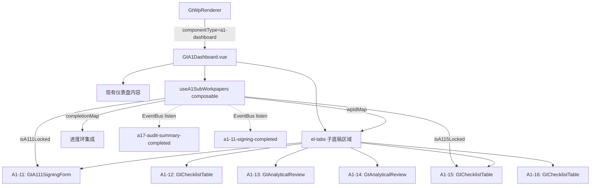

# 设计文档：A1 Dashboard 子底稿内嵌升级

## 概述

在 GtA1Dashboard.vue 现有阶段卡片下方新增 el-tabs 区域，内嵌 A1-11~A1-16 六个子底稿。引入轻量 composable `useA1SubWorkpapers` 管理 wp_id 解析、完成状态追踪、依赖规则和 EventBus 监听。

设计原则：
- **不重写**现有 GtA1Dashboard —— 仅在模板底部追加 Tab 区域 + 脚本中引入 composable（增量 ~100-150 行）
- composable ~150 行，管理全部业务逻辑
- 参考 GtA17Bundle 的 Tab 分发模式，但更轻量（无仪表盘条、无 KAM 引用）

## 架构



## 组件与接口

### useA1SubWorkpapers composable

```typescript
// 文件: audit-platform/frontend/src/components/workpaper/composables/useA1SubWorkpapers.ts

export type CompletionStatus = 'completed' | 'in_progress' | 'not_started'

/** 子底稿 Tab 配置 */
export interface A1SubTab {
  id: string           // 'A1-11' ~ 'A1-16'
  label: string        // 中文名称
  wpCode: string       // wp_code
  componentType: 'signing-form' | 'checklist' | 'analytical-review'
  dependsOn?: string   // 依赖的前置条件 key
}

export const A1_SUB_TABS: A1SubTab[] = [
  { id: 'A1-11', label: '签发流转控制表', wpCode: 'A1-11', componentType: 'signing-form', dependsOn: 'a17-completed' },
  { id: 'A1-12', label: '审计质量控制检查表', wpCode: 'A1-12', componentType: 'checklist' },
  { id: 'A1-13', label: '分析性复核（期初）', wpCode: 'A1-13', componentType: 'analytical-review' },
  { id: 'A1-14', label: '分析性复核（期末）', wpCode: 'A1-14', componentType: 'analytical-review' },
  { id: 'A1-15', label: '归档检查表', wpCode: 'A1-15', componentType: 'checklist', dependsOn: 'a111-signed' },
  { id: 'A1-16', label: '交接检查表', wpCode: 'A1-16', componentType: 'checklist' },
]

export interface UseA1SubWorkpapersOptions {
  projectId: Ref<string>
  wpId: Ref<string>
}

export interface UseA1SubWorkpapersReturn {
  // wp_id 映射
  wpIdMap: Ref<Record<string, string>>
  loading: Ref<boolean>

  // 可见 Tab 列表
  visibleTabs: ComputedRef<A1SubTab[]>
  hasAnySubTab: ComputedRef<boolean>

  // 依赖锁定状态
  isA17Completed: Ref<boolean>
  isA111Signed: Ref<boolean>
  isA111Locked: ComputedRef<boolean>
  isA115Locked: ComputedRef<boolean>
  a111LockReason: ComputedRef<string>
  a115LockReason: ComputedRef<string>

  // 完成状态（用于进度环集成）
  subWorkpaperCompletions: ComputedRef<Record<string, CompletionStatus>>
  subCompletedCount: ComputedRef<number>
  subTotalCount: ComputedRef<number>

  // 操作
  loadWpIndex: () => Promise<void>
  refreshDependencyStatus: () => Promise<void>
  cleanup: () => void
}
```

### Tab 定义表

| id | label | wpCode | componentType 渲染 | 依赖 |
|----|-------|--------|-------------------|------|
| A1-11 | 签发流转控制表 | A1-11 | GtA111SigningForm | A17 完成 |
| A1-12 | 审计质量控制检查表 | A1-12 | GtChecklistTable | 无 |
| A1-13 | 分析性复核（期初） | A1-13 | GtAnalyticalReview | 无 |
| A1-14 | 分析性复核（期末） | A1-14 | GtAnalyticalReview | 无 |
| A1-15 | 归档检查表 | A1-15 | GtChecklistTable | A1-11 已签发 |
| A1-16 | 交接检查表 | A1-16 | GtChecklistTable | 无 |

### GtA1Dashboard.vue 变更

在现有组件中追加：

```typescript
// 新增 imports
import { useA1SubWorkpapers, A1_SUB_TABS } from './composables/useA1SubWorkpapers'
import { defineAsyncComponent } from 'vue'

const GtA111SigningForm = defineAsyncComponent(() => import('./GtA111SigningForm.vue'))
const GtChecklistTable = defineAsyncComponent(() => import('./GtChecklistTable.vue'))
const GtAnalyticalReview = defineAsyncComponent(() => import('./GtAnalyticalReview.vue'))

// 初始化 composable
const subWps = useA1SubWorkpapers({
  projectId: computed(() => props.projectId || ''),
  wpId: computed(() => props.wpId),
})

// 子底稿 Tab 活跃状态
const subTabActive = ref('')

// sheetName 路由
watch(() => props.sheetName, (v) => {
  if (v && subWps.visibleTabs.value.some(t => t.id === v)) {
    subTabActive.value = v
    subTabsExpanded.value = true
  }
})
```

模板追加（在 `.gt-a1-dashboard__phases` div 之后）：

```html
<!-- ═══ 子底稿 Tab 区域 ═══ -->
<div v-if="subWps.hasAnySubTab.value" class="gt-a1-dashboard__sub-workpapers">
  <div class="sub-wp-header" @click="subTabsExpanded = !subTabsExpanded">
    <span>📋 子底稿</span>
    <span>{{ subTabsExpanded ? '−' : '+' }}</span>
  </div>
  <div v-show="subTabsExpanded">
    <el-tabs v-model="subTabActive" type="border-card">
      <el-tab-pane
        v-for="tab in subWps.visibleTabs.value"
        :key="tab.id"
        :label="tab.label"
        :name="tab.id"
        lazy
      >
        <!-- 锁定警告 -->
        <el-alert v-if="getSubTabLockReason(tab)" type="warning" :title="getSubTabLockReason(tab)" :closable="false" show-icon />

        <!-- 组件分发 -->
        <GtA111SigningForm v-if="tab.componentType === 'signing-form'" :wp-id="subWps.wpIdMap.value[tab.wpCode]" :readonly="isSubTabReadonly(tab)" />
        <GtChecklistTable v-else-if="tab.componentType === 'checklist'" :wp-id="subWps.wpIdMap.value[tab.wpCode]" :readonly="isSubTabReadonly(tab)" />
        <GtAnalyticalReview v-else-if="tab.componentType === 'analytical-review'" :wp-id="subWps.wpIdMap.value[tab.wpCode]" :readonly="isSubTabReadonly(tab)" />
      </el-tab-pane>
    </el-tabs>
  </div>
</div>
```

### wp_id 解析逻辑

```typescript
async function loadWpIndex(): Promise<void> {
  loading.value = true
  try {
    const items = await getWpIndex(projectId.value)
    const map: Record<string, string> = {}
    for (const item of items) {
      if (item.wp_code && /^A1-1[1-6]$/.test(item.wp_code)) {
        map[item.wp_code] = item.id
      }
    }
    wpIdMap.value = map
  } catch {
    wpIdMap.value = {}
  } finally {
    loading.value = false
  }
}
```

### 依赖锁定逻辑

```typescript
// A1-11 锁定：A17 未完成
const isA111Locked = computed(() => !isA17Completed.value)
const a111LockReason = computed(() =>
  isA111Locked.value ? 'A17 审计总结未完成，无法进行签发操作' : ''
)

// A1-15 锁定：A1-11 未签发
const isA115Locked = computed(() => !isA111Signed.value)
const a115LockReason = computed(() =>
  isA115Locked.value ? 'A1-11 签发流转控制表未完成，无法进行归档检查' : ''
)
```

### EventBus 集成

```typescript
import { eventBus } from '@/services/eventBus'

function setupEventListeners() {
  eventBus.on('a17-audit-summary-completed', handleA17Completed)
  eventBus.on('a1-11-signing-completed', handleA111Signed)
}

function handleA17Completed() {
  isA17Completed.value = true
}

function handleA111Signed() {
  isA111Signed.value = true
}

function cleanup() {
  eventBus.off('a17-audit-summary-completed', handleA17Completed)
  eventBus.off('a1-11-signing-completed', handleA111Signed)
}
```

### 初始依赖状态加载

```typescript
/**
 * 组件挂载时检查 A17 和 A1-11 的当前完成状态：
 * - A17 完成状态从 A17 底稿 checklist_responses 推导
 * - A1-11 签发状态从 A1-11 底稿 checklist_responses 中 sign_status 推导
 */
async function refreshDependencyStatus(): Promise<void> {
  // Check A17 completion: look for a17-bundle completion marker
  if (wpIdMap.value['A1-11']) {
    try {
      const responses = await api.get(`/api/workpapers/${wpIdMap.value['A1-11']}/checklist-responses`, {
        params: { project_id: projectId.value },
      })
      const signItem = (responses as any[])?.find((r: any) => r.item_id === 'sign-status')
      isA111Signed.value = signItem?.conclusion === 'signed'
    } catch {
      isA111Signed.value = false
    }
  }

  // Check A17 completion via project-level flag
  try {
    const data = await api.get(`/api/projects/${projectId.value}/completion-flags`)
    isA17Completed.value = !!(data as any)?.a17_completed
  } catch {
    isA17Completed.value = false
  }
}
```

### 进度环集成

```typescript
/**
 * 子底稿完成状态映射（用于注入到进度环计算）：
 * - A1-11: 签发 = completed, 否则 not_started
 * - A1-12/A1-15/A1-16: checklist_responses 全完成 = completed
 * - A1-13/A1-14: 有内容 = completed
 *
 * 进度环扩展：
 * 现有 programs.length + subTotalCount = 新总数
 * 现有 doneCount + subCompletedCount = 新完成数
 */
const subWorkpaperCompletions = computed<Record<string, CompletionStatus>>(() => {
  const map: Record<string, CompletionStatus> = {}
  for (const tab of A1_SUB_TABS) {
    if (!wpIdMap.value[tab.wpCode]) continue
    // 简化：A1-11 用 isA111Signed, 其他用 not_started（首次加载后由 refreshDependencyStatus 更新）
    if (tab.id === 'A1-11') {
      map[tab.id] = isA111Signed.value ? 'completed' : 'not_started'
    } else {
      map[tab.id] = 'not_started' // Default, updated via API
    }
  }
  return map
})

const subCompletedCount = computed(() =>
  Object.values(subWorkpaperCompletions.value).filter(s => s === 'completed').length
)

const subTotalCount = computed(() =>
  Object.keys(subWorkpaperCompletions.value).length
)
```

GtA1Dashboard 中修改 `progressPercentage` 和 `doneCount`：

```typescript
// 原有
const doneCount = computed(() => completedCount.value + trimmedCount.value + subWps.subCompletedCount.value)
const progressPercentage = computed(() => {
  const total = programs.value.length + subWps.subTotalCount.value
  return total ? Math.round((doneCount.value / total) * 100) : 0
})
```

### sheetName 路由

```typescript
// 在 GtA1Dashboard 中：
// 如果 props.sheetName 匹配子底稿 Tab，展开 Tab 区域并激活
watch(() => props.sheetName, (v) => {
  if (v && subWps.visibleTabs.value.some(t => t.id === v)) {
    subTabActive.value = v
    subTabsExpanded.value = true
  }
})

// 同理监听 route.query.sheet
watch(() => route.query.sheet as string | undefined, (v) => {
  if (v && subWps.visibleTabs.value.some(t => t.id === v)) {
    subTabActive.value = v
    subTabsExpanded.value = true
  }
})
```

## 数据模型

### 无后端变更

- wp_code_overrides.json 中 A1-11~A1-16 已映射为 `skip`（已完成）
- htmlRendererRegistry.ts 中 `a1-dashboard` 已注册（已存在）
- VALID_COMPONENT_TYPES 中 `a1-dashboard` 已存在
- **无新增 componentType**

### 数据流

```
底稿目录点击 A1
  → GtWpRenderer 查 componentType = 'a1-dashboard'
  → 渲染 GtA1Dashboard (props: wpId, sheetName?, readonly?, projectId?)
  → GtA1Dashboard onMounted:
      1. 加载现有 programs 数据（现有逻辑不变）
      2. useA1SubWorkpapers.loadWpIndex(projectId) → 获取 A1-11~A1-16 wp_id
      3. useA1SubWorkpapers.refreshDependencyStatus() → 加载 A17/A1-11 状态
      4. setupEventListeners() → 注册 EventBus 监听
      5. 渲染子底稿 Tab 区域

外部跳转流:
  RefChip 点击 "A1-15"
    → navigate('A1', { sheet: 'A1-15' })
    → GtA1Dashboard props.sheetName = 'A1-15'
    → subTabsExpanded = true, subTabActive = 'A1-15'
    → A1-15 Tab 渲染 GtChecklistTable

依赖联动流:
  A17 Bundle 签发完成
    → EventBus publish 'a17-audit-summary-completed'
    → useA1SubWorkpapers handleA17Completed() → isA17Completed = true
    → isA111Locked 变为 false → A1-11 Tab 解锁

  A1-11 签发完成
    → GtA111SigningForm emit 'completed'
    → EventBus publish 'a1-11-signing-completed'
    → useA1SubWorkpapers handleA111Signed() → isA111Signed = true
    → isA115Locked 变为 false → A1-15 Tab 解锁
```

## 正确性属性（Correctness Properties）

### Property 1: wp_id 解析正确性

*For any* wp_index 数据集（含若干 A1-1x 条目 + 干扰条目），`loadWpIndex` 解析出的 wpIdMap 应仅包含匹配 `A1-11`~`A1-16` 的条目，且每个 wp_code 正确映射到对应 wp_id。

**Validates: Requirements 3.1, 3.2, 3.4**

### Property 2: Tab 可见性由 wpIdMap 存在性驱动

*For any* wpIdMap 子集（A1-11~A1-16 中任意组合存在/不存在），`visibleTabs` 应仅包含 wpIdMap 中有对应 wp_id 的 Tab；若 wpIdMap 为空则 `hasAnySubTab` = false。

**Validates: Requirements 1.3, 3.3, 9.1, 9.2, 9.3**

### Property 3: A1-11 锁定由 A17 完成状态驱动

*For any* `isA17Completed` 布尔值：`isA111Locked = !isA17Completed`。当 locked 时 A1-11 子组件应接收 readonly=true。

**Validates: Requirements 4.1, 4.2, 4.3**

### Property 4: A1-15 锁定由 A1-11 签发状态驱动

*For any* `isA111Signed` 布尔值：`isA115Locked = !isA111Signed`。当 locked 时 A1-15 子组件应接收 readonly=true。

**Validates: Requirements 5.1, 5.2, 5.3**

### Property 5: sheetName 路由正确激活子底稿 Tab

*For any* sheetName 值属于当前 visibleTabs 列表，`subTabActive` 应切换为该值且 `subTabsExpanded` = true；若值不在 visibleTabs 中，`subTabActive` 保持不变。

**Validates: Requirements 7.1, 7.2, 7.3**

### Property 6: readonly 透传一致性

*For any* readonly 布尔值 + 任意 Tab + 锁定状态组合，子组件接收的 readonly 应为 `props.readonly || isTabLocked(tab)`。

**Validates: Requirements 8.1, 8.2, 8.3, 8.4**

### Property 7: 进度环集成正确性

*For any* programs 数组（含 N 项，M 项 completed/not_applicable）+ subCompletedCount(S) + subTotalCount(T)，进度百分比应为 `Math.round(((M + S) / (N + T)) * 100)`。

**Validates: Requirements 6.1, 6.2**

### Property 8: EventBus 状态同步

*For any* 事件序列（a17-completed / a1-11-signed），`isA17Completed` 和 `isA111Signed` 应分别变为 true，且对应 locked 状态同步更新。事件幂等（重复触发不改变已 true 的状态）。

**Validates: Requirements 10.3, 10.4**

## 错误处理

| 场景 | 处理方式 |
|------|---------|
| getWpIndex API 失败 | wpIdMap 为空，隐藏整个 Tab 区域，现有仪表盘正常渲染 |
| 子底稿 wp_id 不存在 | 对应 Tab 隐藏 |
| 依赖状态 API 失败 | 降级为 locked（安全侧），显示锁定警告 |
| EventBus 事件遗漏（组件挂载前事件已触发） | onMounted 时主动调用 refreshDependencyStatus 从后端读取最新状态 |
| sheetName 无效 | 忽略，不切换子底稿 Tab |

## 测试策略

### Property-Based Tests（fast-check）

| Property | 生成器 | 断言 |
|----------|--------|------|
| P1: wp_id 解析 | `fc.array(fc.record({wp_code: fc.constantFrom('A1-11',...,'A1-16','B10','D2'), id: fc.uuid()}))` | wpIdMap 仅含 A1-1x |
| P2: Tab 可见性 | `fc.subsetOf(['A1-11',...,'A1-16'])` → 生成 wpIdMap | visibleTabs.length = subset.length |
| P3: A1-11 锁定 | `fc.boolean()` → isA17Completed | isA111Locked = !input |
| P4: A1-15 锁定 | `fc.boolean()` → isA111Signed | isA115Locked = !input |
| P5: sheetName 路由 | `fc.oneof(fc.constantFrom(...VALID), fc.string())` | 合法→激活, 非法→不变 |
| P6: readonly 透传 | `fc.boolean()` × `fc.constantFrom(tabs)` × `fc.boolean()`(locked) | readonly = prop \|\| locked |
| P7: 进度环 | `fc.nat({max:50})` × `fc.nat()` × `fc.nat({max:6})` × `fc.nat({max:6})` | percentage 公式正确 |
| P8: EventBus 幂等 | `fc.array(fc.constantFrom('a17','a111'))` → 模拟事件序列 | 最终状态正确 |

### 单元测试（vitest）

- composable 纯逻辑测试：锁定推导、可见性过滤、进度计算
- 组件集成测试：mock wp_index + EventBus → 验证 Tab 渲染和锁定 UI
- sheetName 路由测试
- cleanup 测试（EventBus off）

### 测试配置

- PBT 库：`fast-check`
- 最小迭代：100 次/property
- Tag 格式：`Feature: a1-dashboard-bundle-upgrade, Property {N}: {title}`
