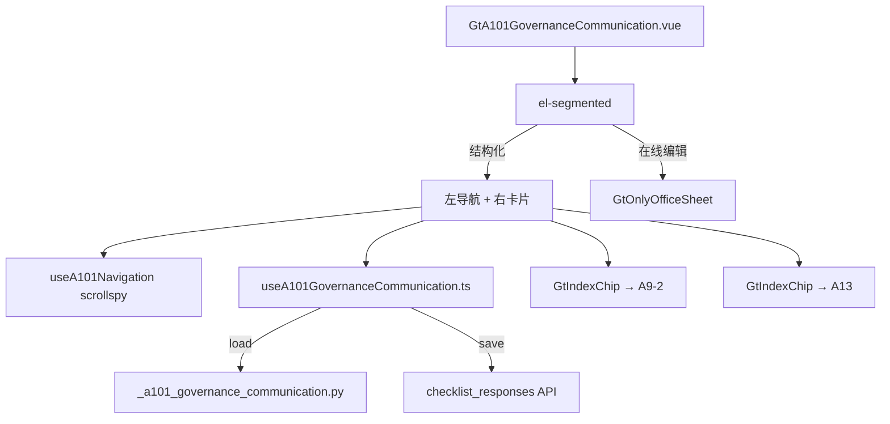

# Design Document: A10-1 与治理层沟通函

## Overview

将 A10-1（与治理层沟通函）从通用 word-template 升级为专属 HTML 组件。大型多章节沟通函（162P/10T），采用左侧导航 + 16 章折叠卡片布局。

新增 componentType `a10-1-governance-communication`，前端 GtA101GovernanceCommunication.vue (~600 行) + useA101GovernanceCommunication.ts，后端 `_a101_governance_communication.py`。

## Architecture



### 关键设计决策

| 决策 | 理由 |
|------|------|
| 左侧章节导航 | 16 章长文档需快速定位 |
| 折叠卡片 | 章节多但大部分为 textarea，折叠减少滚动 |
| 1-5 默认展开 / 6-16 折叠 | 前 5 章必填重要，后续按需展开 |
| 服务费表格 5×2 固定行 | 模板原始行数固定（5 类服务） |
| 联动仅 GtIndexChip | A17 系列联动策略（只跳转不同步） |
| scrollspy | IntersectionObserver 跟踪可见章节 |

## Components and Interfaces

### 后端 `_a101_governance_communication.py`

```python
async def render(ctx: RenderContext) -> dict | None:
    # 查询 checklist_responses item_id LIKE 'a101-%'
    # 加载跨引用 workpaper IDs (A9-2, A13)
    # 返回完整结构
```

返回结构:
```python
{
    "meta_info": {"client_name": str, "audit_period": str, "index_no": "A10-1"},
    "recipient": str | None,
    "introduction_text": [str, str],  # 2 段固定引言
    "chapters": [
        {"number": 1, "title": str, "content": str | None, "cross_ref": str | None}
        # ... 16 entries
    ],
    "service_fees": [
        {"name": "审计服务", "amount": float | None},
        {"name": "审阅服务", "amount": float | None},
        {"name": "其他鉴证服务", "amount": float | None},
        {"name": "税务服务", "amount": float | None},
        {"name": "其他服务", "amount": float | None}
    ],
    "signing_section": {
        "firm_name": str | None,
        "partner_name": str | None,
        "date": str | None
    },
    "guidance_notes": str,
    "cross_references": {
        "a9_2_wp_id": str | None,
        "a13_wp_id": str | None
    },
    "project_context": {"client_name": str, "audit_period": str, "firm_name": str}
}
```

### 前端 `useA101GovernanceCommunication.ts`

```typescript
interface UseA101Return {
  metaInfo: Ref<MetaInfo>
  recipient: Ref<string>
  chapters: Ref<ChapterData[]>  // 16 chapters
  serviceFees: Ref<ServiceFeeRow[]>  // 5 rows
  signingSection: Ref<SigningSection>
  saveStatus: Ref<'saved' | 'saving' | 'unsaved'>
  totalFee: ComputedRef<number>
  // 操作
  updateChapter(index: number, content: string): void
  updateFee(index: number, amount: number): void
  updateSigning(field: string, value: string): void
  flushPendingSaves(): Promise<void>
}
```

### 前端导航 `useA101Navigation.ts`

```typescript
interface UseA101NavReturn {
  activeChapter: Ref<number>
  scrollToChapter(index: number): void
  // IntersectionObserver based scrollspy
}
```

### 前端 `GtA101GovernanceCommunication.vue` (~600 行)

布局:
- el-segmented 双模式
- 左侧导航 (固定定位, ~180px): 收件人/引言/章一~章十六/签发/提示
- 右侧内容区:
  - 收件人 (el-input, auto-fill)
  - 引言 (2 段 read-only el-alert)
  - 16 章折叠卡片 (el-collapse-item × 16)
    - 章三额外含 Service_Fee_Table (el-table 5×2 + total)
    - 章九含 GtIndexChip → A9-2
    - 章十三含 GtIndexChip → A13
  - 签发区 (事务所/CPA/日期)
  - 提示框 (el-collapse)

## Data Models

### item_id 映射

| item_id | remark |
|---------|--------|
| `a101-recipient` | 收件人 |
| `a101-ch{N}-content` | 章 N 正文 (N=1~16) |
| `a101-ch3-fee-{N}` | 第三章服务费行 N (N=0~4, JSON: {name, amount}) |
| `a101-sign-firm` | 事务所名称 |
| `a101-sign-partner` | 合伙人姓名 |
| `a101-sign-date` | 签发日期 |

## Correctness Properties

### Property 1: item_id 格式

*For any* field save, item_id SHALL match pattern `a101-{section}-{field}` where section is one of: recipient, ch{1-16}, sign.

### Property 2: 服务费合计正确性

*For any* set of 5 fee amounts, totalFee SHALL equal the sum of all non-null amounts.

### Property 3: 章节完整性

*For any* valid render response, chapters array SHALL contain exactly 16 entries with sequential numbers 1-16.

### Property 4: 后端响应结构完整性

*For any* valid render request, response SHALL contain all 9 top-level keys with correct types.

### Property 5: 导航高亮一致性

*For any* scroll position, exactly one navigation item SHALL be highlighted at any time.

### Property 6: 跨引用存在性

*For any* chapter with cross_ref field set, the corresponding GtIndexChip SHALL render with valid target wp_id.

## Testing Strategy

### PBT (Hypothesis): P3 章节完整性, P4 响应结构完整性
### PBT (fast-check): P1 item_id 格式, P2 服务费合计, P5 导航高亮
### Unit Tests: 16 章渲染, 收件人 auto-fill, 服务费表格编辑/合计, 导航 scrollspy, 折叠展开, 模式切换, GtIndexChip
### E2E: 加载 → 验证 16 章卡片 → 填写章三服务费 → 点导航跳转 → 保存 → 刷新验证
