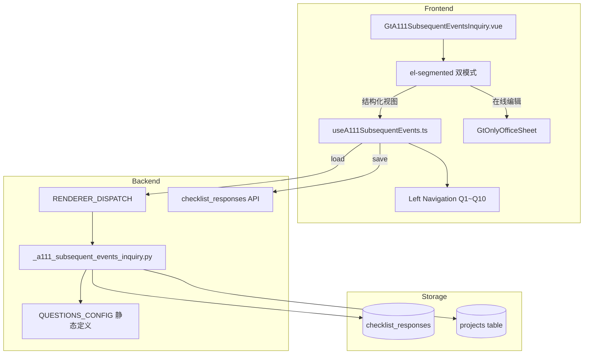

# Design Document: A11-1 期后事项问询函

## Overview

将 A11-1（期后事项问询记录）从通用 word-template 渲染升级为专属 HTML 组件。10 个 CAS 规定的问询事项以卡片式 Q&A 渲染，问题文本只读 + 答复 textarea 可编辑。顶部问询元信息 + 底部证据区 + 左侧 10 题快速导航。

新增 componentType `a11-1-subsequent-events-inquiry`，前端 GtA111SubsequentEventsInquiry.vue (~450 行) + useA111SubsequentEvents.ts composable，后端 `_a111_subsequent_events_inquiry.py` 渲染策略。

## Architecture



### 关键设计决策

| 决策 | 理由 |
|------|------|
| 10 题静态定义在后端 | CAS 规定的问询事项固定不变，后端一次性返回问题文本+编制指导 |
| 每题一条 checklist_response | 10 条记录（a111-qa-1~10），answer 存 remark 字段，简单直观 |
| 无 B22B 类联动 | 期后事项问询为独立记录，无跨底稿数据依赖 |
| 左侧导航 12 项 | 元信息 + Q1~Q10 + 证据 = 12 个锚点，简洁高效 |
| AI 按钮 disabled 预留 | Phase3 可根据项目期后事项自动生成建议答复 |

## Components and Interfaces

### 后端组件

#### 1. `routers/wp_render_strategies/_a111_subsequent_events_inquiry.py`

```python
# 10 个问询事项静态定义
QUESTIONS_CONFIG = [
    {"number": 1, "title": "承诺、借款及担保", "text": "自资产负债表日后...", "has_guidance": False, "guidance_text": None},
    {"number": 2, "title": "资产出售或购置", "text": "是否存在已经完成或预计...", "has_guidance": False, "guidance_text": None},
    {"number": 3, "title": "资本发行/债务", "text": "是否发行了新的股本或债务工具...", "has_guidance": False, "guidance_text": None},
    {"number": 4, "title": "政府征用/灾害损失", "text": "是否发生了政府征用或火灾...", "has_guidance": False, "guidance_text": None},
    {"number": 5, "title": "或有事项进展", "text": "或有事项（如诉讼、仲裁）有何进展...", "has_guidance": True, "guidance_text": "如涉及诉讼案例，请列明案号、诉讼金额、判决结果等详细信息"},
    {"number": 6, "title": "重大调整事项", "text": "是否发生了可能需要调整财务报表的事项...", "has_guidance": False, "guidance_text": None},
    {"number": 7, "title": "持续经营事项", "text": "是否存在可能影响持续经营假设的事项...", "has_guidance": False, "guidance_text": None},
    {"number": 8, "title": "会计估计变更", "text": "是否存在需要修订会计估计的情况...", "has_guidance": False, "guidance_text": None},
    {"number": 9, "title": "资产可收回性", "text": "是否存在资产减值或可收回性发生变化...", "has_guidance": False, "guidance_text": None},
    {"number": 10, "title": "其他重大事项", "text": "是否存在其他可能影响财务报表的重大事项...", "has_guidance": False, "guidance_text": None},
]

async def render(ctx: RenderContext) -> dict | None:
    """A11-1 渲染策略：返回 meta + qa_list + evidence + project_context"""
    # 1. 从 projects 表获取 client_name, balance_sheet_date
    # 2. 从 checklist_responses 查询 item_id LIKE 'a111-%'
    # 3. 组装 meta_data (4 fields)
    # 4. 组装 qa_list (10 questions + saved answers)
    # 5. 取 evidence description
    # 6. 返回 {meta_data, qa_list, evidence, project_context, questions_config}
```

返回结构:
```python
{
    "meta_data": {
        "inquiry_date": str | None,
        "interviewee": str | None,
        "location": str | None,
        "team_signature": str | None,
    },
    "qa_list": [
        {"number": 1, "answer": str | None},
        # ... 10 items
    ],
    "evidence": str | None,
    "project_context": {
        "client_name": str,
        "balance_sheet_date": str | None,
    },
    "questions_config": [  # 静态 10 题定义
        {"number": 1, "title": str, "text": str, "has_guidance": bool, "guidance_text": str | None},
        # ... 10 items
    ],
}
```

### 前端组件

#### 2. `useA111SubsequentEvents.ts` (composable)

```typescript
interface UseA111SubsequentEventsOptions {
  wpId: Ref<string>
  projectId: Ref<string>
  htmlData: Ref<A111RenderData | null>
}

interface QAItem {
  number: number
  title: string
  text: string
  hasGuidance: boolean
  guidanceText: string | null
  answer: string  // 用户填写的答复
}

interface UseA111SubsequentEventsReturn {
  // Data
  metaData: Ref<{ inquiryDate: string | null; interviewee: string | null; location: string | null; teamSignature: string | null }>
  qaList: Ref<QAItem[]>
  evidence: Ref<string>
  projectContext: Ref<{ clientName: string; balanceSheetDate: string | null }>

  // State
  loading: Ref<boolean>
  saveStatus: Ref<'saved' | 'saving' | 'unsaved'>
  activeNavItem: Ref<string>

  // Methods
  updateMeta(fieldId: string, value: string): void  // debounce 2s
  updateAnswer(questionNumber: number, value: string): void  // debounce 2s
  updateEvidence(value: string): void  // debounce 2s
  flushPendingSaves(): Promise<void>
  scrollToItem(itemId: string): void
}
```

#### 3. `GtA111SubsequentEventsInquiry.vue` (~450 行)

Props:
- `wpId: string`
- `projectId: string`
- `htmlData: object | null`

结构:
```vue
<template>
  <!-- el-segmented 双模式切换 -->
  <div v-if="mode === 'structured'" class="gt-a111">
    <!-- 左侧 mini 导航 (元信息/Q1~Q10/证据) -->
    <aside class="gt-a111__nav">
      <div v-for="item in navItems" @click="scrollToItem(item.id)">{{ item.label }}</div>
    </aside>
    <!-- 右侧主内容 -->
    <main class="gt-a111__content">
      <!-- 编制指导提示 (timing) -->
      <el-alert type="warning">问询时间要求...</el-alert>
      <!-- 问询目的 (collapsible, read-only) -->
      <el-collapse><el-collapse-item title="问询目的">...</el-collapse-item></el-collapse>
      <!-- 元信息卡片 -->
      <el-card id="nav-meta">询问日期/受访对象/地点/签字</el-card>
      <!-- 10 个 Q&A 卡片 -->
      <el-card v-for="qa in qaList" :id="`nav-q${qa.number}`">
        <div class="qa-question">{{ qa.number }}. {{ qa.title }}</div>
        <div class="qa-text muted">{{ qa.text }}</div>
        <el-alert v-if="qa.hasGuidance" type="info">{{ qa.guidanceText }}</el-alert>
        <el-input type="textarea" v-model="qa.answer" placeholder="受访对象答复" />
        <el-button disabled size="small" title="AI 生成建议答复即将上线">AI</el-button>
      </el-card>
      <!-- 证据区 -->
      <el-card id="nav-evidence">
        <el-input type="textarea" v-model="evidence" placeholder="贵公司已提供的相关证据" />
      </el-card>
    </main>
  </div>
  <!-- 在线编辑模式 -->
  <GtOnlyOfficeSheet v-else ... />
</template>
```

### API 接口

| Method | Path | Description |
|--------|------|-------------|
| GET | `/api/workpapers/{wp_id}/render-config` | a11-1-subsequent-events-inquiry 策略返回完整数据 |
| POST | `/api/checklist-responses/batch` | 保存 item_id: `a111-{section}-{field_id}` |

## Data Models

### checklist_responses 存储格式

| section | item_id 示例 | conclusion | remark |
|---------|-------------|------------|--------|
| meta | `a111-meta-inquiry_date` | "2026-03-15" | — |
| meta | `a111-meta-interviewee` | "张三（财务总监）" | — |
| meta | `a111-meta-location` | "公司会议室" | — |
| meta | `a111-meta-team_signature` | "李四" | — |
| qa | `a111-qa-1` | — | 答复文本 |
| qa | `a111-qa-2` | — | 答复文本 |
| ... | `a111-qa-10` | — | 答复文本 |
| evidence | `a111-evidence-description` | — | 证据描述文本 |

总计最多 15 条记录（4 meta + 10 qa + 1 evidence）。

## Correctness Properties

### Property 1: item_id 格式一致性

*For any* field edit in GtA111SubsequentEventsInquiry (meta field, qa answer, or evidence), the debounce-save SHALL produce a checklist_responses batch request where item_id matches one of: `a111-meta-{field_id}`, `a111-qa-{N}` (N∈1..10), `a111-evidence-description`.

**Validates: Requirements 3.3, 5.6, 6.3, 9.2**

### Property 2: 问题数量不变性

*For any* render response, the qa_list SHALL contain exactly 10 items with numbers 1 through 10 in order, and questions_config SHALL contain exactly 10 definitions.

**Validates: Requirements 5.1, 5.3, 8.1**

### Property 3: 答复数据 round-trip

*For any* set of 10 answer strings saved to checklist_responses, reloading render-config SHALL return the same 10 answer strings in the corresponding qa_list items.

**Validates: Requirements 9.1, 9.2**

### Property 4: 导航项数量固定

*For any* render state, the left navigation SHALL display exactly 12 items: "元信息" + "Q1"~"Q10" + "证据".

**Validates: Requirements 7.1**

### Property 5: 编制指导条件显示

*For any* question with has_guidance=true, the QA_Card SHALL display an el-alert with guidance_text. For has_guidance=false, no el-alert SHALL be rendered.

**Validates: Requirements 4.1, 5.4, 10.1**

### Property 6: 渲染策略返回结构完整性

*For any* valid A11-1 render request, the response SHALL contain keys: meta_data (with 4 fields), qa_list (10 items each with number and answer), evidence (string or null), project_context (with client_name and balance_sheet_date), questions_config (10 items).

**Validates: Requirements 8.1, 8.2, 8.3**

### Property 7: 双模式切换数据一致性

*For any* sequence of structured-edit → flush → switch-to-OO → switch-back, all answers and meta fields SHALL be preserved after the round-trip mode switch.

**Validates: Requirements 2.5, 9.1**

## Error Handling

| 场景 | 处理 |
|------|------|
| checklist_responses 保存失败 | el-message error + saveStatus "未保存"，不丢本地数据 |
| OnlyOffice 不可用 | 禁用在线编辑 tab，结构化视图独立可用 |
| render-config 返回失败 | 前端显示 el-result error 状态页 |
| AI 服务未部署 | 按钮 disabled + tooltip 提示 |
| balance_sheet_date 为空 | 询问日期不预填，用户手动选择 |

## Testing Strategy

### Property-Based Testing (Hypothesis — 后端)

| Property | 测试文件 | 策略 |
|----------|---------|------|
| P2 问题数量 | `test_a111_render_pbt.py` | 验证 questions_config 恒为 10 项 |
| P3 答复 round-trip | `test_a111_render_pbt.py` | 随机 10 个字符串存入再读取 |
| P6 返回结构 | `test_a111_render_pbt.py` | 随机 project context 验证 schema |

### Property-Based Testing (fast-check — 前端)

| Property | 测试文件 | 策略 |
|----------|---------|------|
| P1 item_id 格式 | `useA111SubsequentEvents.spec.ts` | 随机 section+field 组合 |
| P4 导航数量 | `GtA111SubsequentEventsInquiry.spec.ts` | 验证恒为 12 项 |
| P5 指导条件显示 | `GtA111SubsequentEventsInquiry.spec.ts` | 随机 has_guidance 组合 |
| P7 模式切换 | `useA111SubsequentEvents.spec.ts` | 随机编辑+切换验证持久化 |

### Unit Tests

- 后端: render 策略（正常/空答复/project context 缺失）
- 前端: 10 卡片渲染、meta 表单、AI disabled、导航锚点、OO 健康检查

### Integration Tests

- Playwright E2E: 加载 A11-1 → 验证 10 Q&A 卡片 → 填写 Q1 答复 → 填写元信息 → 保存 → 刷新验证持久化 → 导航跳转
