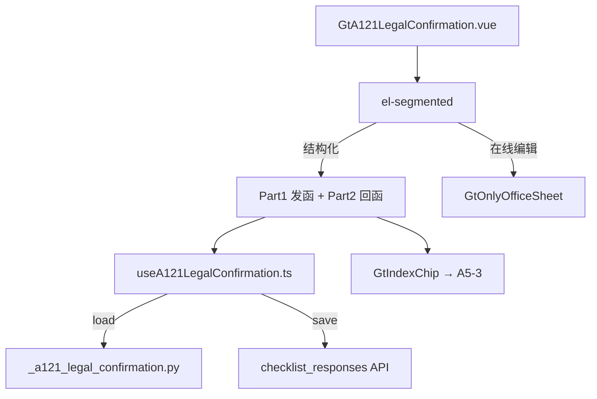

# Design Document: A12-1 法律事务确认函及律师回复函

## Overview

将 A12-1（法律事务确认函及律师回复函）从通用 word-template 升级为专属 HTML 组件。两部分结构：发函（3 问询事项 + 签章）+ 回函（确认 + 费用 + 签字）。

新增 componentType `a12-1-legal-confirmation`，前端 GtA121LegalConfirmation.vue (~450 行) + useA121LegalConfirmation.ts，后端 `_a121_legal_confirmation.py`。

## Architecture



### 关键设计决策

| 决策 | 理由 |
|------|------|
| 发函/回函两大区块 | 模板原始结构就是两部分 |
| 回函不同背景色 | 视觉区分发函/回函 |
| 诉讼列表动态行 | 案件数量不确定，需增删 |
| 回函条件展开 | 无诉讼时不显示详情 textarea |
| 联动仅 GtIndexChip | A17 系列联动策略（只跳转） |

## Components and Interfaces

### 后端 `_a121_legal_confirmation.py`

```python
async def render(ctx: RenderContext) -> dict | None:
    # 查询 checklist_responses item_id LIKE 'a121-%'
    # 加载 A5-3 workpaper ID
    # 返回完整结构
```

返回结构:
```python
{
    "meta_info": {"client_name": str, "audit_period": str, "index_no": "A12-1"},
    "send_section": {
        "recipient": {"firm_name": str|None, "lawyer_name": str|None},
        "explanation_text": str,  # 固定说明段
        "inquiry_1": {
            "litigation_list": [
                {"description": str, "opinion": str, "estimated_loss": float|None}
            ]
        },
        "inquiry_2": {"content": str|None},
        "inquiry_3": {"content": str|None},
        "simplified_note": str,  # 无事项简化流程说明
        "sign_info": {"company_name": str|None, "date": str|None},
        "reply_info_table": {"address": str|None, "phone": str|None, "contact": str|None}
    },
    "reply_section": {
        "litigation_status": "no_litigation" | "has_litigation" | None,
        "litigation_details": str | None,
        "fee_status": "no_outstanding" | "has_outstanding" | None,
        "outstanding_amount": float | None,
        "sign": {"firm_name": str|None, "lawyer_name": str|None, "date": str|None}
    },
    "cross_references": {"a5_3_wp_id": str|None},
    "project_context": {"client_name": str, "audit_period": str}
}
```

### 前端 `useA121LegalConfirmation.ts`

```typescript
interface UseA121Return {
  metaInfo: Ref<MetaInfo>
  sendSection: Ref<SendSection>
  replySection: Ref<ReplySection>
  saveStatus: Ref<'saved' | 'saving' | 'unsaved'>
  // 诉讼列表操作
  addLitigation(): void
  removeLitigation(index: number): void
  updateLitigation(index: number, field: string, value: any): void
  // 通用
  updateField(part: 'send' | 'reply', field: string, value: any): void
  flushPendingSaves(): Promise<void>
}
```

### 前端 `GtA121LegalConfirmation.vue` (~450 行)

2 大区块布局:
1. **Part 1 发函** (白色背景卡片):
   - 收件人: 律师事务所 + 律师姓名
   - 说明段: read-only text
   - 问询一(未决诉讼): 动态诉讼列表(案件描述textarea/律师意见textarea/金额input-number) + GtIndexChip(A5-3) + 添加/删除
   - 问询二(其他法律责任): textarea
   - 问询三(律师费): textarea
   - 简化说明: read-only muted text
   - 签章: 公司名(auto-fill) + 日期
   - 回函信息表: 地址/电话/联系人
2. **Part 2 回函** (浅蓝背景卡片):
   - 诉讼确认: radio(无/有) + conditional textarea
   - 律师费结算: radio(未积欠/尚有未付) + conditional amount input
   - 律师签字: 事务所/律师/日期

## Data Models

### item_id 映射

| item_id | remark |
|---------|--------|
| `a121-send-recipient-firm` | 律师事务所名称 |
| `a121-send-recipient-lawyer` | 律师姓名 |
| `a121-send-inquiry2-content` | 问询二内容 |
| `a121-send-inquiry3-content` | 问询三内容 |
| `a121-send-litigation-{N}` | 诉讼记录 N (JSON: {description, opinion, estimated_loss}) |
| `a121-send-sign-company` | 发函公司名 |
| `a121-send-sign-date` | 发函日期 |
| `a121-send-reply-address` | 回函地址 |
| `a121-send-reply-phone` | 回函电话 |
| `a121-send-reply-contact` | 回函联系人 |
| `a121-reply-status` | 诉讼确认状态 |
| `a121-reply-details` | 诉讼详情 |
| `a121-reply-fee-status` | 费用结算状态 |
| `a121-reply-fee-amount` | 未付金额 |
| `a121-reply-sign-firm` | 回函事务所 |
| `a121-reply-sign-lawyer` | 回函律师 |
| `a121-reply-sign-date` | 回函日期 |

## Correctness Properties

### Property 1: item_id 分区正确性

*For any* field save, item_id SHALL start with "a121-send-" for Part 1 fields or "a121-reply-" for Part 2 fields.

### Property 2: 诉讼列表增删一致性

*For any* sequence of add/remove operations on litigation list, count SHALL equal (adds - removes) and never be negative.

### Property 3: 条件展开逻辑

*For any* reply status, WHEN litigation_status is "no_litigation" THEN litigation_details textarea SHALL be hidden; WHEN "has_litigation" THEN textarea SHALL be visible.

### Property 4: 后端响应结构完整性

*For any* valid render request, response SHALL contain all 5 top-level keys (meta_info, send_section, reply_section, cross_references, project_context).

### Property 5: 费用条件展开

*For any* fee_status, WHEN "no_outstanding" THEN amount input SHALL be hidden; WHEN "has_outstanding" THEN amount input SHALL be visible.

## Testing Strategy

### PBT (Hypothesis): P4 响应结构完整性
### PBT (fast-check): P1 item_id 分区, P2 诉讼增删, P3 条件展开逻辑, P5 费用条件
### Unit Tests: 发函/回函渲染, 诉讼 CRUD, 条件展开, radio 交互, GtIndexChip, 模式切换
### E2E: 加载 → 填收件人 → 添加诉讼记录 → 填回函 → 设费用状态 → 保存 → 刷新验证
