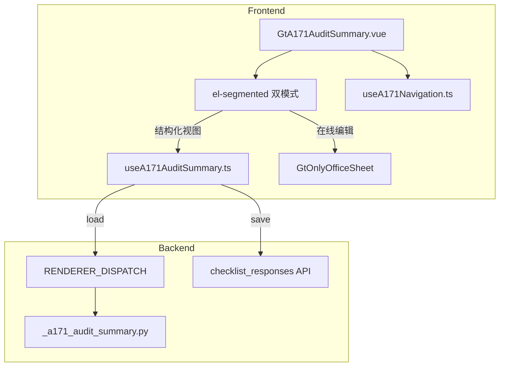

# Design Document: A17-1 重大事项概要汇总

## Overview

将 A17-1（重大事项概要汇总）从通用 word-template 渲染升级为专属 HTML 组件。16 章折叠卡片 + 顶部签字表(10行×3列) + 左侧导航。每章按内容类型渲染（textarea/表格/Y/N）。联动引用 B50、A13、A1-15。

新增 componentType `a17-1-audit-summary`，前端 GtA171AuditSummary.vue (~800 行) + useA171AuditSummary.ts + useA171Navigation.ts composables，后端 `_a171_audit_summary.py` 渲染策略。

## Architecture



### 关键设计决策

| 决策 | 理由 |
|------|------|
| 16 章折叠卡片 el-collapse | 大文档分章浏览，避免一次渲染全部 |
| 左侧导航 IntersectionObserver | 精确跟踪可视章节，零滚动抖动 |
| 表格章节存 JSON remark | 动态行数，单条 checklist_response 存整表 |
| Y/N 章节展开 textarea | 适用/不适用需附说明 |
| GtIndexChip 联动 | 直接跳转 B50/A13/A1-15 |

## Components and Interfaces

### 后端

#### `_a171_audit_summary.py`

```python
async def render(ctx: RenderContext) -> dict | None:
    # 1. 从 projects 获取 client_name, period, preparer
    # 2. 查询 checklist_responses item_id LIKE 'a171-%'
    # 3. 组装 16 章数据 + signature_table + project_context
```

返回结构:
```python
{
    "chapters": {
        "1": {"type": "textarea", "content": str | None},
        "6": {"type": "table", "rows": list[dict]},
        "9": {"type": "yn", "answer": "Y"|"N"|None, "explanation": str|None},
        # ...16 chapters
    },
    "signature_table": [{"role":str,"name":str|None,"date":str|None}] * 10,
    "project_context": {"client_name":str,"period":str,"preparer":str}
}
```

### 前端

#### `useA171AuditSummary.ts`

```typescript
interface UseA171Options {
  wpId: Ref<string>
  projectId: Ref<string>
  htmlData: Ref<A171RenderData | null>
}

interface UseA171Return {
  chapters: Ref<Record<string, ChapterData>>
  signatureTable: Ref<SignatureRow[]>
  projectContext: Ref<ProjectContext>
  loading: Ref<boolean>
  saveStatus: Ref<'saved' | 'saving' | 'unsaved'>
  updateChapter(chapterNum: number, fieldId: string, value: any): void
  addTableRow(chapterNum: number): void
  removeTableRow(chapterNum: number, rowIndex: number): void
  updateSignature(rowIndex: number, col: string, value: string): void
  flushPendingSaves(): Promise<void>
}
```

#### `useA171Navigation.ts`

```typescript
interface UseA171NavReturn {
  activeChapter: Ref<number>
  chapterRefs: Ref<HTMLElement[]>
  scrollToChapter(num: number): void
  completionStatus: ComputedRef<Record<number, boolean>>
}
```

#### `GtA171AuditSummary.vue` (~800 行)

结构:
- el-segmented 双模式
- 左侧固定导航面板（16 章标题 + 完成指示器）
- 顶部签字表 el-table (10 行 × 3 列)
- 16 el-collapse-item 卡片（按 type 渲染 textarea/table/yn）
- 跨底稿引用 GtIndexChip (B50/A13/A1-15)

## Data Models

### checklist_responses 存储格式

| item_id 模式 | conclusion | remark |
|-------------|------------|--------|
| `a171-ch{N}-content` | — | textarea 内容 |
| `a171-ch{N}-table` | row_count | JSON: `[{col1:val,...}]` |
| `a171-ch{N}-yn` | "Y"/"N" | 说明文本 |
| `a171-signature-{row}-{col}` | 值 | — |

## Correctness Properties

### Property 1: item_id 格式一致性

*For any* field edit in GtA171AuditSummary, the save SHALL produce checklist_responses batch where item_id matches `a171-ch{N}-{field_id}` or `a171-signature-{row}-{col}`.

### Property 2: 表格行 JSON round-trip

*For any* table data (chapter 6/8) saved as JSON to remark, reloading SHALL return equivalent rows with all columns preserved.

### Property 3: Y/N 条件展开

*For any* Y/N chapter (9/10/11/12), the explanation textarea SHALL be visible if and only if answer is "Y" or "N" (both require explanation).

### Property 4: 导航高亮一致性

*For any* scroll position, exactly one navigation item SHALL be highlighted matching the most visible chapter.

### Property 5: 渲染策略返回结构

*For any* valid A17-1 render request, response SHALL contain 16 chapters with correct types, signature_table with 10 rows, and project_context.

## Error Handling

| 场景 | 处理 |
|------|------|
| 保存失败 | el-message error + saveStatus "未保存" |
| OnlyOffice 不可用 | 禁用在线编辑 tab |
| JSON remark 解析失败 | 降级为空 + console.warn |
| B50/A13/A1-15 不存在 | GtIndexChip 显示为灰色不可点击 |

## Testing Strategy

### PBT (Hypothesis — 后端)
- P2: 表格 JSON round-trip
- P5: 返回结构校验

### PBT (fast-check — 前端)
- P1: item_id 格式
- P3: Y/N 条件展开
- P4: 导航高亮唯一性

### Unit Tests
- 后端: render 策略（正常/空/JSON 异常）
- 前端: 16 章卡片渲染、表格增删、Y/N 交互、签字表、导航

### E2E
- Playwright: 加载 A17-1 → 验证 16 章 → 导航跳转 → 编辑保存 → 切换模式
