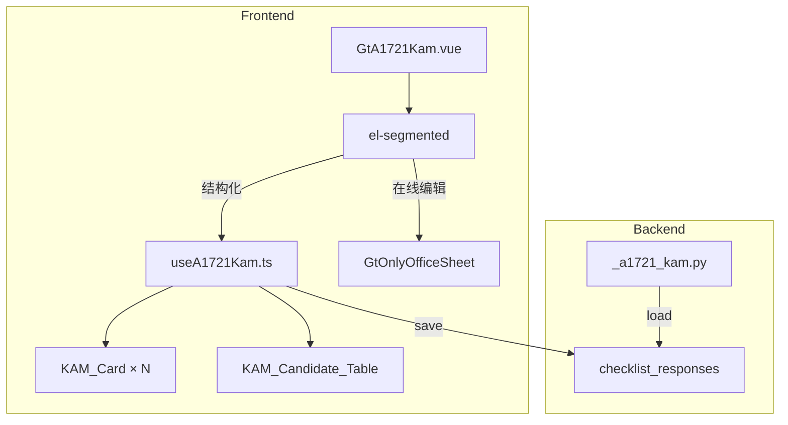

# Design Document: A17-2-1 关键审计事项(KAM)

## Overview

将 A17-2-1（关键审计事项）从通用 word-template 升级为专属 HTML 组件。KAM 列表为动态增删卡片，每个 KAM 含 6 个 textarea 字段 + 索引号跳转。第四节适用性开关控制整体。

新增 componentType `a17-2-1-kam`，前端 GtA1721Kam.vue (~500 行) + useA1721Kam.ts composable，后端 `_a1721_kam.py` 渲染策略。

## Architecture



### 关键设计决策

| 决策 | 理由 |
|------|------|
| KAM 动态卡片 | KAM 数量不固定(0~5+)，需增删 |
| 适用性开关隐藏section 2/3 | 无 KAM 时不渲染空卡片 |
| 候选表→详情卡片联动 | 标记"是否沟通=是"自动创建 KAM 卡片 |
| 底稿索引号用 GtIndexChip | 直接跳转至相关底稿 |
| 每个 KAM 存一条 JSON | 6 字段打包存 remark |

## Components and Interfaces

### 后端 `_a1721_kam.py`

```python
async def render(ctx: RenderContext) -> dict | None:
    # 查询 checklist_responses item_id LIKE 'a1721-%'
    # 返回 candidates + kams + notes + applicability + project_context
```

返回结构:
```python
{
    "candidates": [{"description":str,"risk_level":str,"communicate":"Y"|"N","reason":str}],
    "kams": [{"index":int,"basic":str,"policy":str,"reason":str,"response":str,"result":str,"ref_index":str}],
    "notes": [{"kam_index":int,"content":str}],
    "applicability": {"no_kam": bool, "reason": str|None},
    "project_context": {"client_name":str,"period":str}
}
```

### 前端 `useA1721Kam.ts`

```typescript
interface UseA1721Options {
  wpId: Ref<string>
  projectId: Ref<string>
  htmlData: Ref<A1721RenderData | null>
}

interface UseA1721Return {
  candidates: Ref<CandidateRow[]>
  kams: Ref<KamItem[]>
  notes: Ref<NoteItem[]>
  applicability: Ref<{noKam: boolean; reason: string | null}>
  saveStatus: Ref<'saved' | 'saving' | 'unsaved'>
  addCandidate(): void
  removeCandidate(index: number): void
  addKam(): void
  removeKam(index: number): void
  updateKamField(kamIndex: number, fieldId: string, value: string): void
  toggleApplicability(noKam: boolean): void
  flushPendingSaves(): Promise<void>
}
```

### 前端 `GtA1721Kam.vue` (~500 行)

结构:
- el-segmented 双模式
- Section 一: KAM 候选清单 el-table (4 列 + 动态行)
- Section 二: KAM 详情卡片列表 (el-card × N，每卡 6 textarea + GtIndexChip)
- Section 三: 附注披露 textarea per KAM
- Section 四: 适用性 el-switch + reason textarea
- A17-1 第十二章 GtIndexChip

## Data Models

### checklist_responses 存储格式

| item_id 模式 | conclusion | remark |
|-------------|------------|--------|
| `a1721-candidates` | row_count | JSON: `[{description,risk_level,communicate,reason}]` |
| `a1721-kam{N}` | — | JSON: `{basic,policy,reason,response,result,ref_index}` |
| `a1721-notes-{N}` | — | 附注内容文本 |
| `a1721-applicability` | "Y"/"N" | 不沟通原因 |

## Correctness Properties

### Property 1: item_id 格式一致性

*For any* field edit, save SHALL produce item_id matching `a1721-candidates`, `a1721-kam{N}`, `a1721-notes-{N}`, or `a1721-applicability`.

### Property 2: KAM JSON round-trip

*For any* KAM object (6 string fields) saved as JSON to remark, reloading SHALL return equivalent object with all fields preserved.

### Property 3: 适用性开关互斥

*For any* applicability state, WHEN noKam is true, sections 2/3 SHALL NOT be rendered; WHEN false, they SHALL be rendered.

### Property 4: 候选表→KAM 联动

*For any* candidate row with communicate="是", a corresponding KAM card SHALL exist in section 二.

### Property 5: KAM 增删一致性

*For any* sequence of add/remove operations on KAMs, kams.length SHALL equal (initial + adds - removes), and notes SHALL auto-sync length.

## Error Handling

| 场景 | 处理 |
|------|------|
| 保存失败 | el-message error |
| JSON 解析失败 | 降级空列表 |
| OO 不可用 | 禁用在线编辑 |
| KAM 删除确认 | el-popconfirm 二次确认 |

## Testing Strategy

### PBT (Hypothesis — 后端)
- P2: KAM JSON round-trip
- P5: KAM 增删一致性

### PBT (fast-check — 前端)
- P1: item_id 格式
- P3: 适用性互斥
- P4: 候选表联动

### Unit Tests
- 后端: render 策略（正常/空 KAM/适用性开关）
- 前端: KAM 卡片增删、候选表交互、适用性切换、附注同步

### E2E
- Playwright: 加载 → 添加候选 → 标记沟通 → 填写 KAM → 切换适用性 → 保存验证
