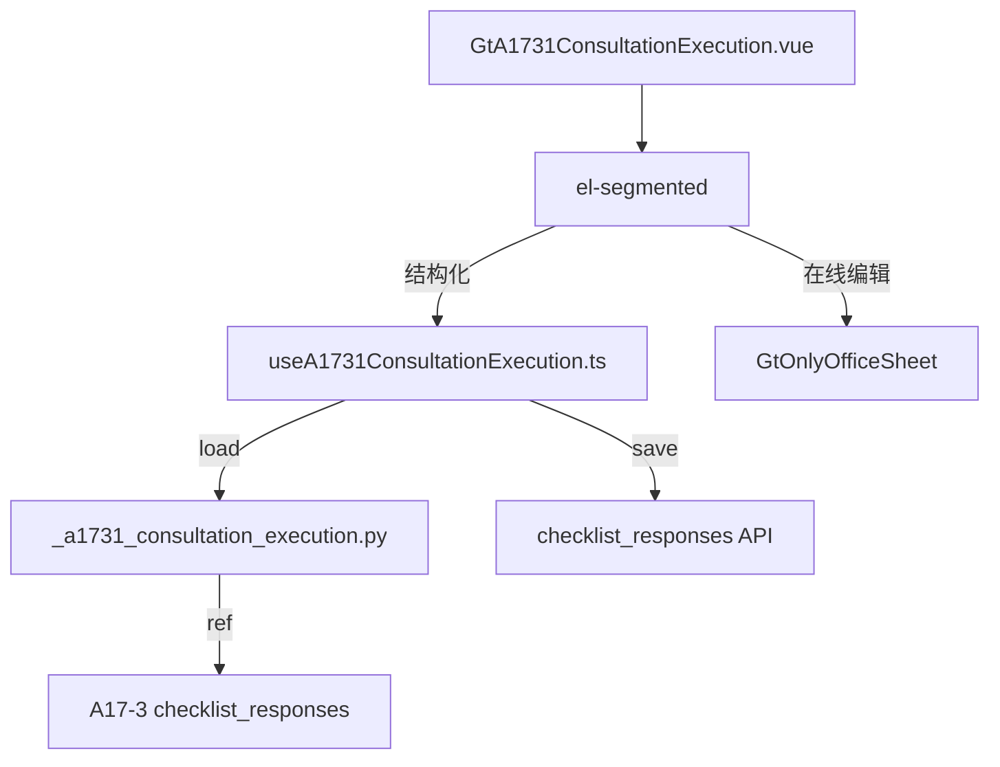

# Design Document: A17-3-1 业务咨询结果执行情况记录

## Overview

将 A17-3-1（业务咨询结果执行情况记录）从通用 word-template 升级为专属 HTML 组件。极简 5 区块卡片（元信息 + 4 章 textarea），联动引用 A17-3 咨询事项。

新增 componentType `a17-3-1-consultation-execution`，前端 GtA1731ConsultationExecution.vue (~250 行) + useA1731ConsultationExecution.ts，后端 `_a1731_consultation_execution.py`。

## Architecture



### 关键设计决策

| 决策 | 理由 |
|------|------|
| 极简 5 区块 | 原模板仅 4P/1T，最简组件 |
| 引用 A17-3 | 第一节显示咨询事项摘要避免重复填写 |
| GtIndexChip 跳转 | 快速导航到 A17-3 查看原文 |
| 各节独立 textarea | 表格结构转为语义清晰的章节 |

## Components and Interfaces

### 后端 `_a1731_consultation_execution.py`

```python
async def render(ctx: RenderContext) -> dict | None:
    # 查询 a1731-% + a173-sec1-% (引用)
    # 返回 meta_info + sections + a173_reference + project_context
```

返回结构:
```python
{
    "meta_info": {"office":str|None,"client_name":str,"consult_type":str|None,"period":str},
    "sections": {
        "1": {"notes": str|None},
        "2": {"result": str|None},
        "3": {"execution": str|None},
        "4": {"conclusion": str|None}
    },
    "a173_reference": {"overview": str|None, "background": str|None},
    "project_context": {"client_name":str,"period":str}
}
```

### 前端 `useA1731ConsultationExecution.ts`

```typescript
interface UseA1731Return {
  metaInfo: Ref<MetaInfo>
  sections: Ref<A1731Sections>
  a173Reference: Ref<{overview: string|null; background: string|null}>
  saveStatus: Ref<'saved' | 'saving' | 'unsaved'>
  updateMeta(field: string, value: string): void
  updateSection(secNum: number, field: string, value: string): void
  flushPendingSaves(): Promise<void>
}
```

### 前端 `GtA1731ConsultationExecution.vue` (~250 行)

结构:
- el-segmented 双模式
- Meta_Info_Card: 办公室/客户(auto)/类型/期间(auto)
- Section 一: 引用区(read-only A17-3 摘要 + GtIndexChip) + 补充 textarea
- Section 二: textarea (咨询结果)
- Section 三: textarea (执行情况)
- Section 四: textarea (结论)

## Data Models

| item_id | remark |
|---------|--------|
| `a1731-meta-{field}` | 元信息值 |
| `a1731-sec1-notes` | 补充说明 |
| `a1731-sec2-result` | 咨询结果 |
| `a1731-sec3-execution` | 执行情况 |
| `a1731-sec4-conclusion` | 结论 |

## Correctness Properties

### Property 1: item_id 格式

*For any* field edit, save SHALL produce item_id matching `a1731-meta-{field}` or `a1731-sec{N}-{field}`.

### Property 2: A17-3 引用一致性

*For any* render where A17-3 has data, the a173_reference fields SHALL reflect A17-3 section 1 content.

### Property 3: 元信息自动填充

*For any* first-load, client_name and period SHALL be pre-filled from project context.

## Testing Strategy

### PBT (Hypothesis): P2 A17-3 引用一致性
### PBT (fast-check): P1 item_id 格式, P3 自动填充
### Unit Tests: 5 区块渲染、A17-3 引用显示、meta 自动填充、保存
### E2E: 加载 → 验证 A17-3 引用 → 填写 → 保存 → 刷新
