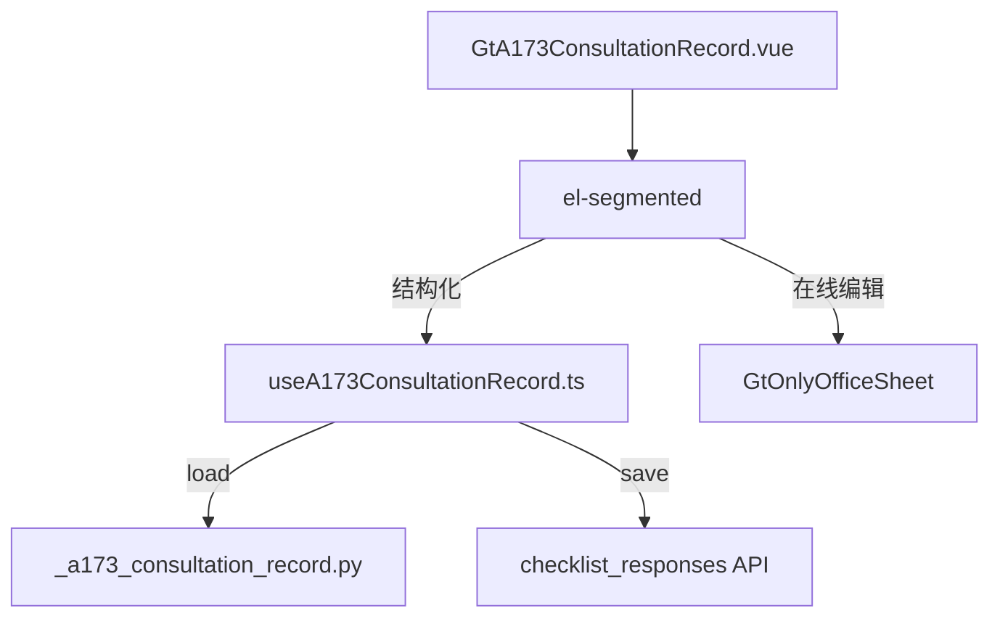

# Design Document: A17-3 业务咨询记录

## Overview

将 A17-3（业务咨询记录）从通用 word-template 升级为专属 HTML 组件。元信息表 + 4 章卡片，第一节含 3 子字段 + 文件 tag + AI 按钮预留。

新增 componentType `a17-3-consultation-record`，前端 GtA173ConsultationRecord.vue (~350 行) + useA173ConsultationRecord.ts，后端 `_a173_consultation_record.py`。

## Architecture



### 关键设计决策

| 决策 | 理由 |
|------|------|
| 4 章各为独立卡片 | 清晰分隔咨询流程各阶段 |
| 第一节 3 子字段 | 模板要求业务概况+问题背景+相关文件三分 |
| 文件 tag 用 el-tag | 轻量引用，非上传 |
| AI 按钮仅第一节 | 查准则功能只对"问题"有意义 |
| 咨询类型 el-select | 5 固定选项 |

## Components and Interfaces

### 后端 `_a173_consultation_record.py`

```python
async def render(ctx: RenderContext) -> dict | None:
    # 查询 checklist_responses item_id LIKE 'a173-%'
    # 返回 meta_info + sections + project_context
```

返回结构:
```python
{
    "meta_info": {"department":str|None,"client_name":str,"consult_type":str|None,"period":str},
    "sections": {
        "1": {"overview":str|None,"background":str|None,"files":list[str]},
        "2": {"opinion":str|None},
        "3": {"standards":str|None,"reply":str|None},
        "4": {"opinion":str|None}
    },
    "project_context": {"client_name":str,"period":str,"preparer":str}
}
```

### 前端 `useA173ConsultationRecord.ts`

```typescript
interface UseA173Return {
  metaInfo: Ref<MetaInfo>
  sections: Ref<A173Sections>
  saveStatus: Ref<'saved' | 'saving' | 'unsaved'>
  addFileTag(fileName: string): void
  removeFileTag(index: number): void
  updateMeta(field: string, value: string): void
  updateSection(secNum: number, field: string, value: string): void
  flushPendingSaves(): Promise<void>
}
```

### 前端 `GtA173ConsultationRecord.vue` (~350 行)

结构:
- el-segmented 双模式
- Meta_Info_Table: 4 字段 (department input + client_name auto + type select + period auto)
- Section 一: 3 textarea + el-tag 文件引用 + AI disabled 按钮
- Section 二: textarea
- Section 三: 2 textarea (准则依据 + 回复意见)
- Section 四: textarea

## Data Models

| item_id | conclusion | remark |
|---------|------------|--------|
| `a173-meta-{field}` | 值 | — |
| `a173-sec1-overview` | — | 业务概况 |
| `a173-sec1-background` | — | 问题背景 |
| `a173-sec1-files` | file_count | JSON: `["文件A","文件B"]` |
| `a173-sec2-opinion` | — | 初步意见 |
| `a173-sec3-standards` | — | 准则依据 |
| `a173-sec3-reply` | — | 回复意见 |
| `a173-sec4-opinion` | — | 委员会意见 |

## Correctness Properties

### Property 1: item_id 格式

*For any* field edit, save SHALL produce item_id matching `a173-meta-{field}` or `a173-sec{N}-{field}`.

### Property 2: 文件 tag JSON round-trip

*For any* file tag array saved as JSON, reloading SHALL return same array in order.

### Property 3: 元信息自动填充

*For any* first-load with project context, client_name and period SHALL be pre-filled.

## Testing Strategy

### PBT (Hypothesis): P2 file tag round-trip
### PBT (fast-check): P1 item_id 格式, P3 自动填充
### Unit Tests: 4 章渲染、meta 交互、文件 tag 增删、AI disabled
### E2E: 加载 → 填写 → 保存 → 刷新验证
