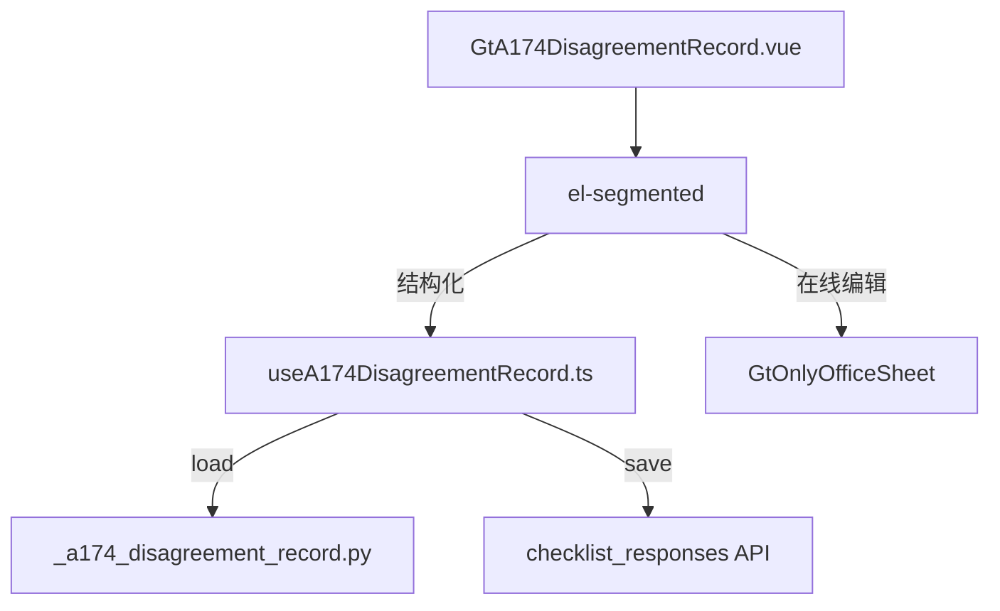

# Design Document: A17-4 重大专业分歧事项记录

## Overview

将 A17-4（重大专业分歧事项记录）从通用 word-template 升级为专属 HTML 组件。人员表 el-table(动态增删行) + 6 章 textarea 卡片 + 签字区。

新增 componentType `a17-4-disagreement-record`，前端 GtA174DisagreementRecord.vue (~400 行) + useA174DisagreementRecord.ts，后端 `_a174_disagreement_record.py`。

## Architecture



### 关键设计决策

| 决策 | 理由 |
|------|------|
| 人员表 JSON 单条存 | 动态行数，整表打包一条 remark |
| 6 章各独立 textarea | 每章独立保存粒度 |
| 签字区 3 字段 | 编制人(auto)+复核人+日期 |
| 无跨底稿联动 | 分歧记录为独立文档 |

## Components and Interfaces

### 后端 `_a174_disagreement_record.py`

```python
async def render(ctx: RenderContext) -> dict | None:
    # 查询 checklist_responses item_id LIKE 'a174-%'
    # 返回 personnel + sections + signature_data + project_context
```

返回结构:
```python
{
    "personnel": [{"name":str,"position":str,"role":str}],
    "sections": {
        "1": {"parties": str|None},
        "2": {"cause": str|None},
        "3": {"procedures": str|None},
        "4": {"opinions": str|None},
        "5": {"considerations": str|None},
        "6": {"conclusion": str|None}
    },
    "signature_data": {"preparer":str|None,"reviewer":str|None,"date":str|None},
    "project_context": {"client_name":str,"period":str,"current_user":str}
}
```

### 前端 `useA174DisagreementRecord.ts`

```typescript
interface UseA174Return {
  personnel: Ref<PersonnelRow[]>
  sections: Ref<Record<string, {content: string | null}>>
  signatureData: Ref<SignatureData>
  saveStatus: Ref<'saved' | 'saving' | 'unsaved'>
  addPersonnel(): void
  removePersonnel(index: number): void
  updatePersonnel(index: number, field: string, value: string): void
  updateSection(secNum: number, value: string): void
  updateSignature(field: string, value: string): void
  flushPendingSaves(): Promise<void>
}
```

### 前端 `GtA174DisagreementRecord.vue` (~400 行)

结构:
- el-segmented 双模式
- Personnel_Table: el-table (序号auto/姓名/职位/项目角色) + 增删按钮
- 6 Section_Cards: el-card + textarea (autosize min 3~4 rows)
- Signature_Area: 编制人(auto) + 复核人(input) + 日期(date-picker)

## Data Models

| item_id | remark |
|---------|--------|
| `a174-personnel` | JSON: `[{name,position,role}]` |
| `a174-sec1-parties` | textarea 内容 |
| `a174-sec2-cause` | textarea 内容 |
| `a174-sec3-procedures` | textarea 内容 |
| `a174-sec4-opinions` | textarea 内容 |
| `a174-sec5-considerations` | textarea 内容 |
| `a174-sec6-conclusion` | textarea 内容 |
| `a174-signature-{field}` | 签字值 |

## Correctness Properties

### Property 1: item_id 格式

*For any* field edit, save SHALL produce item_id matching `a174-personnel`, `a174-sec{N}-{field}`, or `a174-signature-{field}`.

### Property 2: 人员表 JSON round-trip

*For any* personnel array saved as JSON, reloading SHALL return equivalent array with all rows/fields preserved.

### Property 3: 人员表增删一致性

*For any* sequence of add/remove on personnel, final length SHALL equal (initial + adds - removes).

### Property 4: 签字区自动填充

*For any* first-load, 编制人 SHALL auto-fill from current user.

## Testing Strategy

### PBT (Hypothesis): P2 人员表 round-trip
### PBT (fast-check): P1 item_id 格式, P3 增删一致性, P4 自动填充
### Unit Tests: 人员表增删、6 章渲染、签字区、保存
### E2E: 加载 → 添加人员 → 填写 6 章 → 签字 → 保存 → 刷新
