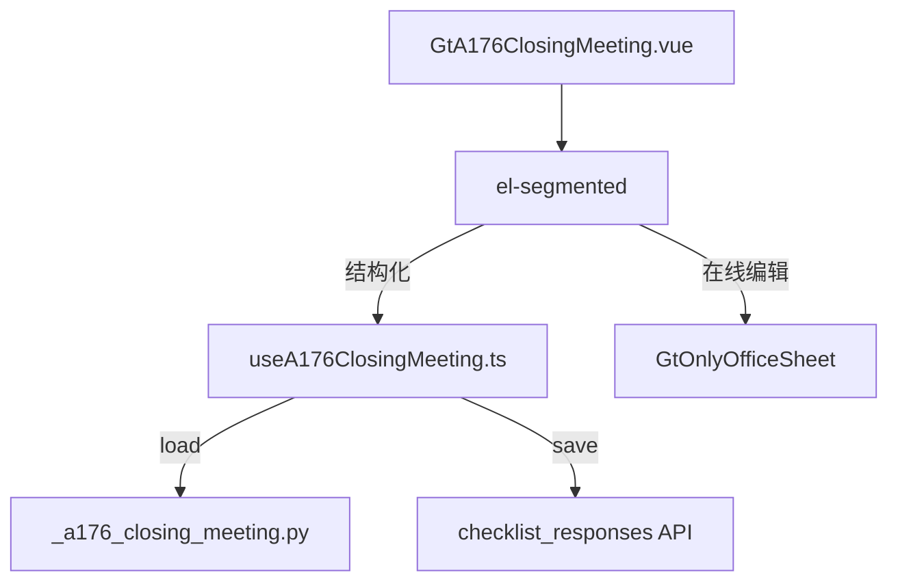

# Design Document: A17-6 总结会会议纪要

## Overview

将 A17-6（总结会会议纪要）从通用 word-template 升级为专属 HTML 组件。最简单的子底稿组件——6 字段卡片（date-picker + input + textarea + 附件描述）。

新增 componentType `a17-6-closing-meeting`，前端 GtA176ClosingMeeting.vue (~200 行) + useA176ClosingMeeting.ts，后端 `_a176_closing_meeting.py`。

## Architecture



### 关键设计决策

| 决策 | 理由 |
|------|------|
| 6 字段平铺 | 极简模板无需分章 |
| 会议纪要大 textarea | 主体内容需大面积编辑 |
| 附件为文本描述 | 非文件上传，仅记录名称 |
| 无跨底稿联动 | 会议纪要为独立记录 |

## Components and Interfaces

### 后端 `_a176_closing_meeting.py`

```python
async def render(ctx: RenderContext) -> dict | None:
    # 查询 checklist_responses item_id LIKE 'a176-%'
    # 返回 meta_info + fields + project_context
```

返回结构:
```python
{
    "meta_info": {
        "client_name": str, "period": str,
        "preparer": str|None, "reviewer": str|None,
        "date": str|None, "index_no": "A17-6"
    },
    "fields": {
        "meeting_time": str|None,
        "attendees": str|None,
        "minutes": str|None,
        "conclusion": str|None,
        "attachments": str|None
    },
    "project_context": {"client_name":str,"period":str,"current_user":str}
}
```

### 前端 `useA176ClosingMeeting.ts`

```typescript
interface UseA176Return {
  metaInfo: Ref<MetaInfo>
  fields: Ref<A176Fields>
  saveStatus: Ref<'saved' | 'saving' | 'unsaved'>
  updateMeta(field: string, value: string): void
  updateField(field: string, value: string): void
  flushPendingSaves(): Promise<void>
}
```

### 前端 `GtA176ClosingMeeting.vue` (~200 行)

结构:
- el-segmented 双模式
- Meta area: 被审计单位(auto) / 期间(auto) / 编制人(auto) / 复核人 / 日期 / 索引号(A17-6 read-only)
- 会议时间: el-date-picker type="datetime"
- 参加人员: el-input
- 会议纪要内容: textarea autosize min 8 rows
- 结论: textarea autosize min 3 rows
- 附件: el-input placeholder

## Data Models

| item_id | remark |
|---------|--------|
| `a176-meta-preparer` | 编制人 |
| `a176-meta-reviewer` | 复核人 |
| `a176-meta-date` | 日期 |
| `a176-meeting-time` | 会议时间 |
| `a176-attendees` | 参加人员 |
| `a176-minutes` | 会议纪要内容 |
| `a176-conclusion` | 结论 |
| `a176-attachments` | 附件描述 |

## Correctness Properties

### Property 1: item_id 格式

*For any* field edit, save SHALL produce item_id matching `a176-meta-{field}` or `a176-{field}`.

### Property 2: 元信息自动填充

*For any* first-load, client_name/period/preparer SHALL be pre-filled from project context.

### Property 3: 字段完整性

*For any* valid render request, response SHALL contain meta_info (6 keys) and fields (5 keys).

## Testing Strategy

### PBT (Hypothesis): P3 返回结构完整性
### PBT (fast-check): P1 item_id 格式, P2 自动填充
### Unit Tests: 6 字段渲染、meta 自动填充、datetime picker、保存
### E2E: 加载 → 填写 → 保存 → 刷新验证
