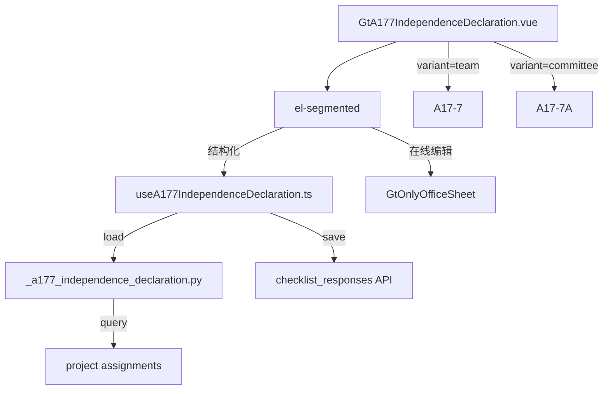

# Design Document: A17-7 审计项目团队成员独立性声明书

## Overview

将 A17-7（团队成员独立性声明书）和 A17-7A（委员会审核委员独立性声明书）从通用 word-template 升级为专属 HTML 组件。两个变体共用一个组件（variant prop），通过 wp_code 自动判别。

新增 componentType `a17-7-independence-declaration`，前端 GtA177IndependenceDeclaration.vue (~400 行) + useA177IndependenceDeclaration.ts，后端 `_a177_independence_declaration.py`。

## Architecture



### 关键设计决策

| 决策 | 理由 |
|------|------|
| 单组件 variant prop | A17-7 / A17-7A 结构几乎一致，仅标题/前缀/适用人群不同 |
| 签字表从 assignments 预填 | 减少手动输入，确保团队完整性 |
| 威胁记录默认折叠 | 可选附件，大部分情况无需展开 |
| item_id 前缀区分变体 | a177- vs a177a- 避免数据混淆 |
| 签字表动态行 JSON 序列化 | 灵活支持不定数量团队成员 |

## Components and Interfaces

### 后端 `_a177_independence_declaration.py`

```python
async def render(ctx: RenderContext) -> dict | None:
    # 根据 wp_code 判断 variant: A17-7→team, A17-7A→committee
    # prefix = "a177-" if team else "a177a-"
    # 查询 checklist_responses item_id LIKE '{prefix}%'
    # 查询 project assignments 获取团队成员名单
    # 返回完整结构
```

返回结构:
```python
{
    "variant": "team" | "committee",
    "meta_info": {"client_name": str, "audit_year": str, "index_no": str},
    "declaration_text": str,  # 固定声明正文
    "period_data": {
        "business_start": str|None, "business_end": str|None,
        "report_start": str|None, "report_end": str|None
    },
    "team_sign_table": [
        {"index": int, "name": str, "signed": bool, "date": str|None}
    ],
    "partner_section": {
        "confirmed": bool|None, "explanation": str|None,
        "partner_sign": {"name": str|None, "date": str|None},
        "manager_sign": {"name": str|None, "date": str|None}
    },
    "threat_records": {
        "economic_interest": [{"member": str, "type": str, "amount": str, "measure": str}],
        "loan_guarantee": [{"member": str, "type": str, "amount": str, "measure": str}],
        "business_relation": [{"member": str, "description": str, "measure": str}]
    },
    "guidance_notes": [str, str, str, str, str],
    "project_context": {"client_name": str, "audit_year": str, "team_members": list}
}
```

### 前端 `useA177IndependenceDeclaration.ts`

```typescript
interface UseA177Return {
  variant: Ref<'team' | 'committee'>
  metaInfo: Ref<MetaInfo>
  periodData: Ref<PeriodData>
  teamSignTable: Ref<SignRow[]>
  partnerSection: Ref<PartnerSection>
  threatRecords: Ref<ThreatRecords>
  guidanceNotes: Ref<string[]>
  saveStatus: Ref<'saved' | 'saving' | 'unsaved'>
  // 签字表操作
  addTeamMember(): void
  removeTeamMember(index: number): void
  updateTeamMember(index: number, field: string, value: any): void
  // 威胁记录操作
  addThreatRow(type: ThreatType): void
  removeThreatRow(type: ThreatType, index: number): void
  // 通用
  updateField(section: string, field: string, value: any): void
  flushPendingSaves(): Promise<void>
}
```

### 前端 `GtA177IndependenceDeclaration.vue` (~400 行)

5 区块布局:
1. **声明正文 + 期间承诺**: 自动填充公司/年度 + 2 组 date-range-picker
2. **团队成员签字表**: el-table 动态增删行(序号/姓名/签字/日期) + "添加成员"按钮
3. **合伙人声明 + 签字**: Y/N radio + conditional textarea + 2 行固定签字表
4. **附件威胁记录**: el-collapse 内含 3 个动态表格(经济利益/贷款担保/商业关系)
5. **编制指导**: el-collapse 5 条只读参考

## Data Models

### item_id 映射 (prefix = a177- | a177a-)

| item_id | remark |
|---------|--------|
| `{prefix}period-business-start` | 业务期间开始 |
| `{prefix}period-business-end` | 业务期间结束 |
| `{prefix}period-report-start` | 财报期间开始 |
| `{prefix}period-report-end` | 财报期间结束 |
| `{prefix}sign-{N}` | 团队成员签字行 N (JSON: {name, signed, date}) |
| `{prefix}partner-confirmed` | 合伙人确认 Y/N |
| `{prefix}partner-explanation` | 不确认说明 |
| `{prefix}partner-sign` | 合伙人签字 (JSON) |
| `{prefix}manager-sign` | 负责经理签字 (JSON) |
| `{prefix}threat-economic-{N}` | 经济利益威胁行 N (JSON) |
| `{prefix}threat-loan-{N}` | 贷款担保威胁行 N (JSON) |
| `{prefix}threat-business-{N}` | 商业关系威胁行 N (JSON) |

## Correctness Properties

### Property 1: item_id 前缀隔离

*For any* field save, variant='team' SHALL produce item_id starting with "a177-" and variant='committee' SHALL produce item_id starting with "a177a-".

### Property 2: 签字表预填完整性

*For any* project with N team members in assignments, initial load SHALL produce team_sign_table with exactly N rows pre-filled with names.

### Property 3: 威胁记录增删一致性

*For any* sequence of add/remove operations on threat tables, the count of rows SHALL equal (adds - removes) and never be negative.

### Property 4: 后端响应结构完整性

*For any* valid render request, response SHALL contain all 8 top-level keys with correct types.

### Property 5: variant 由 wp_code 确定

*For any* render request, wp_code "A17-7" SHALL produce variant="team", wp_code "A17-7A" SHALL produce variant="committee".

## Testing Strategy

### PBT (Hypothesis): P4 响应结构完整性, P5 variant 确定性
### PBT (fast-check): P1 item_id 前缀隔离, P2 签字表预填, P3 威胁记录增删
### Unit Tests: 5 区块渲染, variant 切换, 签字表 CRUD, 威胁记录 CRUD, 日期选择器, 模式切换
### E2E: 加载 → 验证预填 → 添加签字行 → 填写威胁记录 → 保存 → 刷新验证
